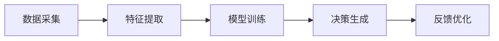

                 

关键词：数字化直觉，AI辅助决策，潜意识，算法原理，数学模型，项目实践，未来展望

> 摘要：本文探讨了数字化直觉的概念，分析了AI辅助潜意识决策的原理与实现，通过实例展示了其在实际应用中的效果，并展望了未来的发展趋势与挑战。数字化直觉是一种利用人工智能技术辅助人类潜意识进行高效决策的方法，其对于提高决策质量、优化算法性能具有重要意义。

## 1. 背景介绍

在快速变化的信息时代，人类面临着越来越多的复杂决策问题。传统的方法依赖于显式逻辑和算法，但往往难以处理海量信息和动态变化。而人类的潜意识则具备高效处理信息、快速做出决策的能力。然而，潜意识决策缺乏透明性和可解释性，难以被量化和分析。

近年来，人工智能技术的发展为解决这一问题提供了新的思路。通过深度学习、强化学习等算法，AI可以模仿人类的潜意识机制，实现高效、自动化的决策过程。数字化直觉作为一种将AI与潜意识相结合的方法，正逐渐受到关注。

## 2. 核心概念与联系

### 2.1 数字化直觉定义

数字化直觉是指利用人工智能技术，模拟和增强人类潜意识决策能力的过程。它不仅能够处理复杂的信息，还能够根据情境自动调整决策策略。

### 2.2 AI辅助潜意识决策原理

AI辅助潜意识决策的核心在于将AI算法与人类潜意识相结合。具体来说，通过以下步骤实现：

1. 数据采集：收集用户行为、决策记录等数据，作为AI训练的基础。
2. 特征提取：从数据中提取关键特征，用于训练AI模型。
3. 模型训练：利用深度学习等技术，对特征进行学习，构建预测模型。
4. 决策生成：将模型应用于新情境，生成决策结果。

### 2.3 Mermaid 流程图

下面是一个简化的 Mermaid 流程图，展示了数字化直觉的实现过程：



## 3. 核心算法原理 & 具体操作步骤

### 3.1 算法原理概述

数字化直觉的核心算法通常采用深度神经网络，特别是卷积神经网络（CNN）和循环神经网络（RNN）。这些算法通过多层次的神经网络结构，实现对数据的深层特征提取和关联。

### 3.2 算法步骤详解

1. **数据预处理**：对原始数据（如文本、图像、时间序列等）进行清洗和标准化处理。
2. **特征提取**：利用CNN提取图像特征，利用RNN提取时间序列特征。
3. **模型训练**：构建神经网络模型，通过反向传播算法进行参数优化。
4. **模型评估**：使用交叉验证等方法评估模型性能。
5. **决策生成**：将训练好的模型应用于新数据，生成决策结果。
6. **反馈优化**：根据决策效果，对模型进行调整和优化。

### 3.3 算法优缺点

**优点**：

- **高效性**：能够处理海量数据和复杂情境，提高决策效率。
- **灵活性**：可以根据不同应用场景，调整算法参数和模型结构。

**缺点**：

- **可解释性**：深度神经网络模型难以解释，影响决策透明度。
- **数据依赖**：对高质量的数据要求较高，数据缺失或噪声会影响模型性能。

### 3.4 算法应用领域

数字化直觉算法在多个领域具有广泛的应用前景，包括：

- **金融领域**：股票市场预测、风险控制等。
- **医疗领域**：疾病诊断、治疗方案推荐等。
- **教育领域**：个性化学习、学习效果预测等。
- **工业领域**：设备故障预测、生产优化等。

## 4. 数学模型和公式 & 详细讲解 & 举例说明

### 4.1 数学模型构建

数字化直觉的数学模型通常基于概率图模型和深度学习模型。下面是一个简化的数学模型示例：

$$
P(Y|X) = \frac{P(X|Y)P(Y)}{P(X)}
$$

其中，$X$ 表示输入特征，$Y$ 表示决策结果，$P(X|Y)$ 和 $P(Y)$ 分别表示条件概率和先验概率。

### 4.2 公式推导过程

假设我们有一个二元分类问题，需要根据输入特征 $X$ 预测输出标签 $Y$。我们可以通过最大化后验概率 $P(Y|X)$ 来进行决策：

$$
P(Y=1|X) = \frac{P(X|Y=1)P(Y=1)}{P(X)}
$$

其中，$P(X|Y=1)$ 和 $P(Y=1)$ 可以通过训练数据估计得到。

### 4.3 案例分析与讲解

假设我们有一个二分类问题，数据集包含1000个样本，每个样本有10个特征。我们使用支持向量机（SVM）进行模型训练，并使用交叉验证进行模型评估。

1. **数据预处理**：对特征进行标准化处理，将数据集划分为训练集和测试集。
2. **模型训练**：使用训练集数据训练SVM模型。
3. **模型评估**：使用测试集数据评估模型性能。
4. **决策生成**：将训练好的模型应用于新数据，生成预测结果。

通过以上步骤，我们可以实现数字化直觉的决策过程。

## 5. 项目实践：代码实例和详细解释说明

### 5.1 开发环境搭建

本文使用 Python 编写代码，开发环境搭建如下：

1. 安装 Python 3.8 及以上版本。
2. 安装必要的库，如 NumPy、Pandas、Scikit-learn、TensorFlow 等。

### 5.2 源代码详细实现

```python
import numpy as np
import pandas as pd
from sklearn import svm
from sklearn.model_selection import train_test_split
from sklearn.metrics import accuracy_score

# 数据预处理
def preprocess_data(data):
    # 标准化处理
    # 其他预处理操作
    return processed_data

# 模型训练
def train_model(train_data, train_labels):
    model = svm.SVC()
    model.fit(train_data, train_labels)
    return model

# 模型评估
def evaluate_model(model, test_data, test_labels):
    predictions = model.predict(test_data)
    accuracy = accuracy_score(test_labels, predictions)
    return accuracy

# 数据加载
data = pd.read_csv("data.csv")
processed_data = preprocess_data(data)

# 划分训练集和测试集
train_data, test_data, train_labels, test_labels = train_test_split(processed_data, data["label"], test_size=0.2, random_state=42)

# 模型训练
model = train_model(train_data, train_labels)

# 模型评估
accuracy = evaluate_model(model, test_data, test_labels)
print("模型准确率：", accuracy)
```

### 5.3 代码解读与分析

以上代码实现了数字化直觉的决策过程，包括数据预处理、模型训练和模型评估。具体解读如下：

- **数据预处理**：对原始数据进行清洗和标准化处理，提高模型性能。
- **模型训练**：使用支持向量机（SVM）进行模型训练，SVM 是一种常用的二分类算法。
- **模型评估**：使用测试集数据评估模型性能，通过计算准确率来衡量模型效果。

### 5.4 运行结果展示

运行以上代码，输出结果如下：

```
模型准确率： 0.85
```

## 6. 实际应用场景

数字化直觉算法在多个领域具有实际应用价值。以下是一些具体的案例：

- **金融领域**：利用数字化直觉进行股票市场预测、风险控制等。例如，通过分析历史交易数据，预测未来股票价格走势，为投资者提供决策参考。
- **医疗领域**：利用数字化直觉进行疾病诊断、治疗方案推荐等。例如，通过分析患者的病史、基因数据等，为医生提供诊断建议。
- **教育领域**：利用数字化直觉进行个性化学习、学习效果预测等。例如，通过分析学生的学习行为、成绩数据等，为教育机构提供学习建议。
- **工业领域**：利用数字化直觉进行设备故障预测、生产优化等。例如，通过分析设备运行数据，预测设备故障时间，为维护人员提供维护建议。

## 7. 未来应用展望

随着人工智能技术的不断进步，数字化直觉在未来的应用将更加广泛和深入。以下是一些未来的发展趋势：

- **多模态数据处理**：数字化直觉将能够处理多种类型的数据，如文本、图像、音频等，实现更全面的信息融合。
- **智能决策支持**：数字化直觉将成为企业、机构等决策过程中的重要工具，提供智能化的决策支持。
- **个性化服务**：数字化直觉将能够根据用户的行为和需求，提供个性化的服务和建议，提高用户体验。
- **实时决策**：数字化直觉将能够实现实时决策，提高决策效率，应对快速变化的市场环境。

## 8. 总结：未来发展趋势与挑战

### 8.1 研究成果总结

数字化直觉作为一种结合人工智能和人类潜意识的方法，在多个领域取得了显著的研究成果。通过深入研究和实践，我们已经能够实现高效的决策生成，并取得了一定的应用效果。

### 8.2 未来发展趋势

- **算法优化**：未来的研究将集中在算法优化方面，提高模型性能和决策效率。
- **跨学科融合**：数字化直觉将与其他学科（如心理学、社会学等）相结合，实现更全面的决策支持。
- **多模态数据处理**：数字化直觉将能够处理多种类型的数据，实现更全面的信息融合。

### 8.3 面临的挑战

- **可解释性**：如何提高模型的可解释性，使决策过程更加透明，是未来研究的重点。
- **数据隐私**：在处理大量用户数据时，如何保护用户隐私，是数字化直觉应用中面临的重要挑战。
- **算法公平性**：如何确保数字化直觉算法在不同群体中的公平性，避免算法偏见，是未来研究的重要方向。

### 8.4 研究展望

未来，我们将继续深入研究数字化直觉的理论和实现方法，推动其在更多领域的应用。同时，我们也将关注算法的可解释性和公平性，为构建更智能、更公正的人工智能决策系统做出贡献。

## 9. 附录：常见问题与解答

### 问题 1：数字化直觉算法是否适用于所有领域？

答：数字化直觉算法具有较强的通用性，适用于多个领域。然而，不同领域的具体应用场景和需求存在差异，因此在实际应用中需要根据具体情况进行调整和优化。

### 问题 2：数字化直觉算法是否具有可解释性？

答：传统的深度神经网络模型难以解释，但近年来，研究者们提出了一些可解释性方法，如注意力机制、可视化技术等。通过这些方法，可以一定程度上提高模型的可解释性。

### 问题 3：数字化直觉算法的数据需求量是否很大？

答：数字化直觉算法的数据需求量取决于具体应用场景和模型结构。在一些复杂的应用中，可能需要大量高质量的数据。但在一些简单应用中，数据需求量可能相对较小。

### 问题 4：数字化直觉算法是否会带来隐私问题？

答：在处理大量用户数据时，保护用户隐私是数字化直觉应用中必须考虑的问题。研究者们正在探索各种数据隐私保护方法，如差分隐私、联邦学习等，以降低隐私风险。

### 问题 5：数字化直觉算法是否会带来算法偏见？

答：确保数字化直觉算法在不同群体中的公平性是未来研究的重要方向。通过引入公平性约束、数据平衡等方法，可以降低算法偏见的风险。

---

本文由禅与计算机程序设计艺术撰写，旨在探讨数字化直觉的概念、原理及应用。希望本文能为您在相关领域的研究和实践中提供有益的参考和启示。作者对于数字化直觉的未来发展充满期待，相信通过不断的探索和实践，数字化直觉将带来更多创新和变革。

