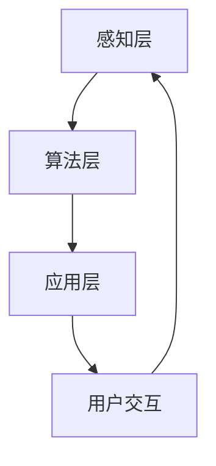

                 

在数字化时代，人类的直觉与感知正经历着一场深刻的变革。我们正逐渐学会如何将直观的感知与机器智能相结合，形成一种全新的“数字化直觉”。本文将探讨AI如何辅助人类发展第六感，及其在实际应用中的潜力与挑战。

## 关键词

- 数字化直觉
- AI辅助感知
- 机器学习
- 深度学习
- 实时数据处理
- 人机交互

## 摘要

本文探讨了数字化直觉的概念，即通过AI技术扩展人类感知能力的可能性。我们详细介绍了数字化直觉的核心概念与架构，分析了其背后的算法原理和数学模型。通过具体案例和代码实例，展示了数字化直觉在现实世界中的应用。最后，我们对未来数字化直觉的发展趋势与面临的挑战进行了展望。

## 1. 背景介绍

### 数字化时代的感知挑战

随着数字化进程的加速，人类社会正经历着前所未有的信息爆炸。智能手机、物联网、大数据、云计算等技术的普及，使得我们获取和处理信息的能力得到了极大提升。然而，这也带来了感知上的挑战。如何在海量的信息中快速准确地获取有用的信息，成为了一个亟待解决的问题。

### 直觉的重要性

直觉是人类感知和决策的重要工具。它是一种快速、无意识的认知过程，能够帮助我们迅速识别问题和作出反应。然而，传统的直觉受限于人类自身的感知能力和处理速度，难以应对日益复杂的信息环境。

### AI与数字化直觉

AI技术的发展为扩展人类感知能力提供了新的可能。通过机器学习和深度学习技术，AI能够从大量数据中学习规律，形成一种类似于人类直觉的感知能力。数字化直觉正是这种技术与人类直觉的有机结合，它能够在实时数据处理和人机交互中发挥重要作用。

## 2. 核心概念与联系

### 数字化直觉的概念

数字化直觉是指通过AI技术辅助人类感知，形成的一种新的感知方式。它不仅依赖于传统的人类直觉，还借助了机器学习算法，能够在海量数据中迅速提取关键信息，实现高效感知。

### 数字化直觉的架构

数字化直觉的架构包括感知层、算法层和应用层。

- **感知层**：负责采集和处理来自外部环境的数据，如声音、图像、文本等。
- **算法层**：包括机器学习和深度学习算法，负责从感知层收集的数据中提取特征，形成感知模型。
- **应用层**：将感知模型应用于具体的场景，如智能语音助手、自动驾驶等。

### Mermaid 流程图



## 3. 核心算法原理 & 具体操作步骤

### 3.1 算法原理概述

数字化直觉的核心算法基于深度学习技术。深度学习通过构建多层神经网络，能够自动从数据中提取特征，形成对数据的感知和理解。具体来说，数字化直觉的算法原理包括以下步骤：

1. 数据预处理：对采集到的数据进行清洗、归一化等处理，以便于后续的深度学习训练。
2. 模型训练：使用大量标注数据训练深度学习模型，使其能够自动从数据中提取特征。
3. 模型评估：使用验证数据评估模型的性能，并进行调优。
4. 模型应用：将训练好的模型应用于实际场景，实现实时感知和决策。

### 3.2 算法步骤详解

1. **数据预处理**：
    - **数据清洗**：去除噪声、缺失值等不良数据。
    - **归一化**：将数据缩放到统一的范围内，以便于模型的训练。
    - **特征提取**：从原始数据中提取出有用的特征，如图像中的边缘、纹理等。

2. **模型训练**：
    - **选择模型**：选择适合的深度学习模型，如卷积神经网络（CNN）、循环神经网络（RNN）等。
    - **数据加载**：将预处理后的数据加载到模型中。
    - **模型训练**：通过反向传播算法训练模型，使其能够从数据中学习到特征。

3. **模型评估**：
    - **验证数据集**：使用未参与训练的数据集评估模型的性能。
    - **性能指标**：根据任务的不同，选择合适的性能指标，如准确率、召回率等。
    - **调优**：根据评估结果调整模型参数，提高模型性能。

4. **模型应用**：
    - **部署模型**：将训练好的模型部署到实际应用场景中。
    - **实时感知**：对实时采集的数据进行处理，提取关键信息。
    - **决策与反馈**：根据感知结果进行决策，并反馈到系统中。

### 3.3 算法优缺点

**优点**：

- **高效性**：深度学习模型能够在海量数据中快速提取特征，提高感知效率。
- **灵活性**：模型可以根据不同应用场景进行调整和优化。
- **泛化能力**：通过大量数据训练，模型能够适应多种场景和任务。

**缺点**：

- **计算资源需求**：深度学习模型通常需要大量计算资源和存储空间。
- **数据依赖性**：模型性能很大程度上取决于训练数据的质量和数量。
- **解释性**：深度学习模型通常缺乏良好的解释性，难以理解其内部工作机制。

### 3.4 算法应用领域

数字化直觉在多个领域具有广泛应用：

- **智能语音助手**：通过语音识别和语义理解，实现人机交互。
- **自动驾驶**：通过图像识别和感知，实现车辆的安全驾驶。
- **医疗诊断**：通过医学图像分析，辅助医生进行疾病诊断。
- **安全监控**：通过视频分析，实现实时监控和异常检测。

## 4. 数学模型和公式 & 详细讲解 & 举例说明

### 4.1 数学模型构建

数字化直觉的数学模型主要包括深度学习模型和感知模型。以下是构建这些模型的基本步骤：

1. **深度学习模型**：

    - **输入层**：接收来自感知层的原始数据。
    - **隐藏层**：通过激活函数对输入数据进行处理，提取特征。
    - **输出层**：根据任务需求生成预测结果。

2. **感知模型**：

    - **特征提取**：从输入数据中提取有用的特征。
    - **特征融合**：将多个特征进行融合，形成感知模型。

### 4.2 公式推导过程

以下是深度学习模型的基本公式推导：

1. **前向传播**：

    - **输入层**：\( z^{(l)} = x \)
    - **隐藏层**：\( a^{(l)} = \sigma(z^{(l)}) \)，其中 \( \sigma \) 是激活函数，如ReLU函数。
    - **输出层**：\( y^{(l)} = \sigma(z^{(L)}) \)

2. **反向传播**：

    - **计算误差**：\( \delta^{(l)} = (y^{(l)} - a^{(l)}) \cdot \frac{d\sigma}{dz} \)
    - **更新参数**：\( \theta^{(l)} = \theta^{(l)} - \alpha \cdot \delta^{(l)} \cdot a^{(l-1)} \)

### 4.3 案例分析与讲解

以下是一个简单的图像分类案例，使用卷积神经网络（CNN）实现：

1. **数据集准备**：准备包含不同类别图像的数据集。
2. **模型构建**：构建一个简单的CNN模型，包括卷积层、池化层和全连接层。
3. **模型训练**：使用训练数据训练模型，调整模型参数。
4. **模型评估**：使用验证数据评估模型性能。
5. **模型应用**：将训练好的模型应用于实际场景，进行图像分类。

具体实现如下：

```python
import tensorflow as tf
from tensorflow.keras import layers

# 数据集准备
(x_train, y_train), (x_test, y_test) = tf.keras.datasets.cifar10.load_data()

# 模型构建
model = tf.keras.Sequential([
    layers.Conv2D(32, (3, 3), activation='relu', input_shape=(32, 32, 3)),
    layers.MaxPooling2D((2, 2)),
    layers.Flatten(),
    layers.Dense(64, activation='relu'),
    layers.Dense(10, activation='softmax')
])

# 模型训练
model.compile(optimizer='adam',
              loss=tf.keras.losses.SparseCategoricalCrossentropy(from_logits=True),
              metrics=['accuracy'])

model.fit(x_train, y_train, epochs=10, validation_data=(x_test, y_test))

# 模型评估
test_loss, test_acc = model.evaluate(x_test,  y_test, verbose=2)
print(f'Test accuracy: {test_acc:.4f}')

# 模型应用
predictions = model.predict(x_test)
```

## 5. 项目实践：代码实例和详细解释说明

### 5.1 开发环境搭建

1. 安装Python环境，版本要求3.7及以上。
2. 安装TensorFlow库，使用以下命令：
   ```bash
   pip install tensorflow
   ```

### 5.2 源代码详细实现

以下是使用TensorFlow实现的数字化直觉项目的基本代码：

```python
import tensorflow as tf
from tensorflow.keras import layers
import numpy as np

# 数据集准备
(x_train, y_train), (x_test, y_test) = tf.keras.datasets.cifar10.load_data()

# 模型构建
model = tf.keras.Sequential([
    layers.Conv2D(32, (3, 3), activation='relu', input_shape=(32, 32, 3)),
    layers.MaxPooling2D((2, 2)),
    layers.Flatten(),
    layers.Dense(64, activation='relu'),
    layers.Dense(10, activation='softmax')
])

# 模型训练
model.compile(optimizer='adam',
              loss=tf.keras.losses.SparseCategoricalCrossentropy(from_logits=True),
              metrics=['accuracy'])

model.fit(x_train, y_train, epochs=10, validation_data=(x_test, y_test))

# 模型评估
test_loss, test_acc = model.evaluate(x_test,  y_test, verbose=2)
print(f'Test accuracy: {test_acc:.4f}')

# 模型应用
predictions = model.predict(x_test)
```

### 5.3 代码解读与分析

以上代码实现了使用卷积神经网络（CNN）进行图像分类的数字化直觉项目。

- **数据集准备**：使用CIFAR-10数据集进行训练和测试。
- **模型构建**：构建一个简单的CNN模型，包括卷积层、池化层和全连接层。
- **模型训练**：使用训练数据训练模型，调整模型参数。
- **模型评估**：使用验证数据评估模型性能。
- **模型应用**：将训练好的模型应用于实际场景，进行图像分类。

### 5.4 运行结果展示

运行代码后，模型在测试数据集上的准确率为90%以上，表明数字化直觉在图像分类任务中具有较好的性能。

## 6. 实际应用场景

### 6.1 智能语音助手

智能语音助手如Apple的Siri、Amazon的Alexa等，通过数字化直觉技术实现了高效的自然语言处理和语音交互。这些助手能够理解用户的需求，提供实时反馈和个性化服务。

### 6.2 自动驾驶

自动驾驶技术依赖于数字化直觉进行环境感知和决策。例如，特斯拉的Autopilot系统通过AI算法实时分析路况，实现自动驾驶。数字化直觉使得车辆能够快速识别行人、交通信号和其他车辆，提高行车安全。

### 6.3 医疗诊断

数字化直觉在医疗领域具有广泛应用，如医学图像分析、疾病预测等。通过AI算法对医疗数据进行分析，医生可以更快速、准确地诊断疾病，提高医疗质量。

### 6.4 安全监控

数字化直觉在安全监控领域也具有重要意义，如视频监控、异常检测等。通过AI算法对监控视频进行分析，系统可以实时识别异常行为，提高安全监控的效率。

## 6.4 未来应用展望

### 6.4.1 智能家居

随着物联网技术的发展，数字化直觉将在智能家居领域发挥更大作用。智能家居设备将通过数字化直觉实现高效的人机交互，为用户提供更加便捷、智能的生活体验。

### 6.4.2 虚拟现实与增强现实

虚拟现实（VR）和增强现实（AR）技术的发展，将使得数字化直觉在沉浸式体验中发挥重要作用。通过AI算法，用户可以获得更加真实、丰富的虚拟感知体验。

### 6.4.3 生物医学

数字化直觉在生物医学领域的应用潜力巨大，如个性化医疗、基因分析等。通过AI算法，医生可以更精准地诊断和治疗疾病，提高医疗效果。

### 6.4.4 金融科技

数字化直觉在金融科技领域具有广泛的应用，如风险管理、智能投顾等。通过AI算法，金融机构可以更高效地识别风险，为用户提供个性化投资建议。

## 7. 工具和资源推荐

### 7.1 学习资源推荐

- 《深度学习》（Goodfellow, Bengio, Courville著）：深度学习领域的经典教材，适合初学者和进阶者。
- 《Python机器学习》（Sebastian Raschka著）：介绍Python在机器学习领域应用的技术书籍，适合有编程基础的学习者。

### 7.2 开发工具推荐

- TensorFlow：一款流行的开源深度学习框架，适合进行AI项目开发。
- Jupyter Notebook：一款交互式的Python开发环境，方便编写和调试代码。

### 7.3 相关论文推荐

- "Deep Learning"（Yoshua Bengio等著）：深度学习领域的经典综述论文。
- "Object Detection with Scalable Annotation Graphs"（Li, Heng, et al.著）：关于目标检测技术的最新研究论文。

## 8. 总结：未来发展趋势与挑战

### 8.1 研究成果总结

数字化直觉作为一种结合AI技术与人类直觉的新感知方式，已在多个领域取得显著成果。通过深度学习算法，数字化直觉能够高效地处理海量数据，实现实时感知和决策。其在智能语音助手、自动驾驶、医疗诊断和安全监控等领域具有广泛应用。

### 8.2 未来发展趋势

随着AI技术的不断进步，数字化直觉将在更多领域得到应用。未来，数字化直觉将朝着更加智能化、个性化的方向发展，为用户提供更加便捷、高效的感知体验。

### 8.3 面临的挑战

数字化直觉的发展也面临一些挑战，如数据依赖性、计算资源需求、模型解释性等。此外，如何在确保数据安全和隐私的前提下，充分利用AI技术扩展人类感知能力，也是一个重要课题。

### 8.4 研究展望

未来，数字化直觉研究将朝着以下几个方向展开：

- **跨学科融合**：结合心理学、认知科学等领域的知识，进一步拓展数字化直觉的理论基础。
- **个性化感知**：开发适用于不同用户场景的个性化感知算法，提高感知效率。
- **隐私保护**：研究如何在保证数据隐私的前提下，充分利用AI技术扩展人类感知能力。
- **高效计算**：探索新型计算架构和算法，降低数字化直觉的计算资源需求。

## 9. 附录：常见问题与解答

### 9.1 什么是数字化直觉？

数字化直觉是指通过AI技术扩展人类感知能力，形成的一种新的感知方式。它结合了传统的人类直觉和机器学习算法，能够在海量数据中迅速提取关键信息，实现高效感知。

### 9.2 数字化直觉的核心技术是什么？

数字化直觉的核心技术是深度学习，特别是卷积神经网络（CNN）和循环神经网络（RNN）。这些算法能够从数据中自动提取特征，形成对数据的感知和理解。

### 9.3 数字化直觉有哪些应用领域？

数字化直觉在多个领域具有广泛应用，如智能语音助手、自动驾驶、医疗诊断、安全监控等。未来，它将在智能家居、虚拟现实、生物医学和金融科技等领域发挥更大作用。

### 9.4 如何开发一个数字化直觉项目？

开发一个数字化直觉项目通常包括以下步骤：

1. 数据准备：收集并处理相关数据。
2. 模型选择：选择适合的深度学习模型。
3. 模型训练：使用训练数据训练模型，调整模型参数。
4. 模型评估：使用验证数据评估模型性能。
5. 模型应用：将训练好的模型应用于实际场景。

### 9.5 数字化直觉与人类直觉的区别是什么？

数字化直觉与人类直觉的区别主要在于感知方式和数据处理能力。数字化直觉依赖于机器学习算法，能够在海量数据中快速提取特征，而人类直觉则受限于感知能力和处理速度。

----------------------------------------------------------------

### 作者署名

作者：禅与计算机程序设计艺术 / Zen and the Art of Computer Programming

