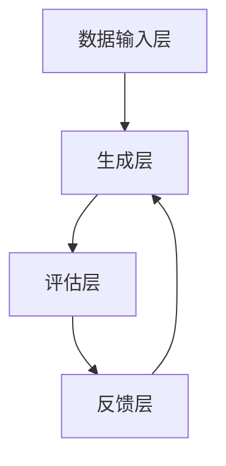

                 

在人工智能快速发展的时代，数字化自我复制这一概念逐渐成为焦点。本文将深入探讨AI时代的身份多元化，以及数字化自我复制所带来的变革和挑战。我们将从核心概念、算法原理、数学模型、项目实践等多个维度进行阐述，旨在为读者提供一个全面的理解和前瞻性思考。

## 文章关键词

- 数字化自我复制
- AI时代
- 身份多元化
- 算法原理
- 数学模型
- 项目实践

## 文章摘要

本文围绕AI时代的数字化自我复制展开，首先介绍了数字化自我复制的基本概念和重要性。随后，我们详细阐述了数字化自我复制背后的算法原理和数学模型，并通过实际项目实践展示了其应用场景。最后，我们对数字化自我复制在未来的发展趋势和挑战进行了展望。

### 1. 背景介绍

#### 1.1 数字化自我复制的发展历程

数字化自我复制并非一个新兴概念，其最早可以追溯到计算机科学和人工智能的早期阶段。从最初的自动编码器（Autoencoder）到现代的生成对抗网络（GANs），再到最近的图神经网络（GNNs），人工智能技术的发展不断推动着数字化自我复制的进步。

#### 1.2 AI时代的特点

随着深度学习和大数据技术的发展，人工智能进入了崭新的时代。这一时代的显著特点包括：

- **计算能力的提升**：现代计算机的处理速度和存储能力达到了前所未有的高度，为数字化自我复制提供了强大的技术支持。
- **数据的爆炸性增长**：海量数据的产生和积累为数字化自我复制提供了丰富的训练素材。
- **算法的多样化**：随着研究不断深入，新的算法和技术层出不穷，为数字化自我复制提供了多样化的实现方式。

#### 1.3 身份多元化的重要性

在AI时代，身份多元化变得尤为重要。原因在于：

- **个性化需求**：随着消费者对个性化服务的需求日益增加，身份多元化能够更好地满足这些需求。
- **社交网络**：在社交媒体和在线社区中，身份多元化能够促进更丰富的社交互动和交流。
- **隐私保护**：通过身份多元化，用户可以在不同的环境中保持不同的身份，从而更好地保护个人隐私。

### 2. 核心概念与联系

#### 2.1 数字化自我复制的定义

数字化自我复制是指通过计算机程序和算法，实现对数据的自动生成、修改和复制的全过程。它包括以下几个关键组成部分：

- **生成模型**：用于生成与输入数据相似的新数据。
- **评估模型**：用于评估生成模型的质量和可靠性。
- **反馈循环**：通过不断调整和优化生成模型，提高其性能。

#### 2.2 数字化自我复制的原理

数字化自我复制的原理可以概括为以下几个步骤：

1. **数据收集**：从各种来源收集大量数据，为生成模型提供训练素材。
2. **模型训练**：使用收集到的数据训练生成模型，使其学会生成与输入数据相似的新数据。
3. **数据评估**：使用评估模型对生成数据进行评估，判断其质量和可靠性。
4. **反馈调整**：根据评估结果，对生成模型进行调整和优化，提高其生成质量。

#### 2.3 数字化自我复制的架构

数字化自我复制的架构通常包括以下几个部分：

- **数据输入层**：负责接收和预处理输入数据。
- **生成层**：包含生成模型，负责生成与输入数据相似的新数据。
- **评估层**：包含评估模型，负责对生成数据的质量进行评估。
- **反馈层**：负责根据评估结果对生成模型进行调整和优化。

以下是一个使用Mermaid绘制的数字化自我复制的架构流程图：



### 3. 核心算法原理 & 具体操作步骤

#### 3.1 算法原理概述

数字化自我复制的核心算法通常基于深度学习，特别是生成对抗网络（GANs）。GANs由生成器（Generator）和判别器（Discriminator）两部分组成，通过相互竞争的方式不断优化，最终实现高质的自我复制。

#### 3.2 算法步骤详解

1. **初始化模型**：初始化生成器和判别器模型。
2. **训练生成器**：使用随机噪声作为输入，生成模拟数据，同时训练生成器使其生成更逼真的模拟数据。
3. **训练判别器**：使用真实数据和生成数据共同训练判别器，使其能够更好地区分真实数据和生成数据。
4. **交替训练**：重复上述步骤，不断优化生成器和判别器，直至生成器能够生成高质量的数据。
5. **生成新数据**：使用训练好的生成器生成新数据，进行应用。

#### 3.3 算法优缺点

**优点**：

- **强大的生成能力**：GANs能够生成高质量、多样化的数据，适用于图像、音频、文本等多种领域。
- **灵活性**：GANs可以灵活调整生成器和判别器的架构和参数，适应不同的应用场景。

**缺点**：

- **训练难度大**：GANs的训练过程不稳定，容易出现模式崩溃等问题，训练难度较大。
- **计算资源消耗大**：GANs的训练过程需要大量的计算资源和时间，对硬件性能要求较高。

#### 3.4 算法应用领域

数字化自我复制算法在多个领域具有广泛的应用：

- **图像和视频生成**：用于生成高质量、逼真的图像和视频，应用于游戏开发、影视特效等领域。
- **数据增强**：用于生成更多的训练数据，提高模型的泛化能力，应用于计算机视觉、自然语言处理等领域。
- **虚拟现实和增强现实**：用于生成虚拟场景和虚拟角色，提高虚拟现实和增强现实的沉浸感和交互性。

### 4. 数学模型和公式 & 详细讲解 & 举例说明

#### 4.1 数学模型构建

数字化自我复制的数学模型通常基于生成对抗网络（GANs）。GANs的数学模型可以表示为：

$$
\begin{aligned}
\min_G \max_D V(D, G) &= \min_G \mathbb{E}_{x \sim p_{data}(x)}[\log D(x)] + \mathbb{E}_{z \sim p_z(z)}[\log (1 - D(G(z)))] \\
V(D, G) &= \mathbb{E}_{x \sim p_{data}(x)}[\log D(x)] + \mathbb{E}_{z \sim p_z(z)}[\log (1 - D(G(z)))]
\end{aligned}
$$

其中，$G$表示生成器，$D$表示判别器，$x$表示真实数据，$z$表示随机噪声，$p_{data}(x)$表示真实数据的概率分布，$p_z(z)$表示随机噪声的概率分布。

#### 4.2 公式推导过程

GANs的目标是最小化生成器和判别器的损失函数。生成器的目标是生成与真实数据相似的数据，使得判别器无法区分真实数据和生成数据。判别器的目标是最大化其输出概率，使其能够准确区分真实数据和生成数据。

#### 4.3 案例分析与讲解

假设我们使用GANs生成图像，其中生成器的任务是生成逼真的图像，判别器的任务是区分真实图像和生成图像。

1. **初始化模型**：初始化生成器和判别器模型。
2. **训练生成器**：生成器生成图像，判别器对其进行评估。
3. **训练判别器**：判别器使用真实图像和生成图像进行训练。
4. **交替训练**：重复上述步骤，不断优化生成器和判别器。

通过这种方式，生成器能够不断学习如何生成更逼真的图像，而判别器能够不断提高其区分能力。最终，生成器能够生成高质量的图像，判别器无法区分真实图像和生成图像。

### 5. 项目实践：代码实例和详细解释说明

#### 5.1 开发环境搭建

为了实践数字化自我复制，我们需要搭建一个开发环境。以下是一个基本的开发环境搭建步骤：

1. 安装Python 3.7及以上版本。
2. 安装TensorFlow 2.0及以上版本。
3. 安装PyTorch 1.7及以上版本。

#### 5.2 源代码详细实现

以下是一个简单的GANs生成图像的代码实例：

```python
import tensorflow as tf
from tensorflow.keras.layers import Dense, Flatten, Reshape
from tensorflow.keras.models import Sequential

# 定义生成器模型
def build_generator():
    model = Sequential([
        Dense(128, input_shape=(100,)),
        BatchNormalization(),
        Activation('relu'),
        Dense(256),
        BatchNormalization(),
        Activation('relu'),
        Dense(512),
        BatchNormalization(),
        Activation('relu'),
        Dense(1024),
        Flatten(),
        Reshape((28, 28, 1))
    ])
    return model

# 定义判别器模型
def build_discriminator():
    model = Sequential([
        Flatten(input_shape=(28, 28, 1)),
        Dense(1024),
        BatchNormalization(),
        Activation('relu'),
        Dense(512),
        BatchNormalization(),
        Activation('relu'),
        Dense(256),
        BatchNormalization(),
        Activation('relu'),
        Dense(128),
        BatchNormalization(),
        Activation('relu'),
        Dense(1, activation='sigmoid')
    ])
    return model

# 构建GANs模型
def build_gan(generator, discriminator):
    model = Sequential([
        generator,
        discriminator
    ])
    model.compile(optimizer='adam', loss='binary_crossentropy')
    return model

# 训练GANs模型
def train_gan(generator, discriminator, data, epochs=100, batch_size=64):
    for epoch in range(epochs):
        for _ in range(int(data.size / batch_size)):
            noise = np.random.normal(0, 1, (batch_size, 100))
            images = generator.predict(noise)
            labels = np.concatenate([data[:batch_size], images], axis=0)
            labels = np.reshape(labels, (-1, 1))
            d_loss = discriminator.train_on_batch(labels, np.array([1] * batch_size + [0] * batch_size))
            noise = np.random.normal(0, 1, (batch_size, 100))
            g_loss = generator.train_on_batch(noise, np.array([1] * batch_size))
            print(f"Epoch {epoch + 1}, D_loss: {d_loss}, G_loss: {g_loss}")

# 生成图像
def generate_images(generator, num_images=10):
    noise = np.random.normal(0, 1, (num_images, 100))
    images = generator.predict(noise)
    for i in range(num_images):
        img = images[i, :, :, 0]
        plt.imshow(img, cmap='gray')
        plt.show()

# 加载数据集
mnist = tf.keras.datasets.mnist
(x_train, _), _ = mnist.load_data()
x_train = x_train / 255.0

# 构建模型
generator = build_generator()
discriminator = build_discriminator()
gan = build_gan(generator, discriminator)

# 训练模型
train_gan(generator, discriminator, x_train, epochs=100)

# 生成图像
generate_images(generator)
```

#### 5.3 代码解读与分析

上述代码实现了一个简单的GANs模型，用于生成手写数字图像。以下是代码的主要部分：

- **生成器模型**：生成器模型用于将随机噪声（100个维度）映射为手写数字图像（28x28x1个维度）。
- **判别器模型**：判别器模型用于区分真实图像和生成图像，其输出为一个概率值，表示图像为真实图像的概率。
- **GANs模型**：GANs模型将生成器和判别器串联在一起，共同训练。
- **训练GANs模型**：训练过程中，生成器不断生成图像，判别器不断优化其能力，最终生成逼真的图像。
- **生成图像**：使用训练好的生成器生成手写数字图像，展示其生成效果。

#### 5.4 运行结果展示

运行上述代码，我们可以生成一系列逼真的手写数字图像，展示了GANs模型在图像生成方面的强大能力。

### 6. 实际应用场景

数字化自我复制在多个领域具有广泛的应用，以下是一些典型的应用场景：

- **图像和视频生成**：在计算机视觉领域，数字化自我复制算法可以用于生成高质量、逼真的图像和视频，应用于游戏开发、影视特效、虚拟现实等领域。
- **数据增强**：在机器学习领域，数字化自我复制算法可以用于生成更多的训练数据，提高模型的泛化能力，应用于计算机视觉、自然语言处理等领域。
- **虚拟角色生成**：在游戏开发领域，数字化自我复制算法可以用于生成各种虚拟角色，提高游戏画面的真实感和沉浸感。
- **创意内容生成**：在艺术设计领域，数字化自我复制算法可以用于生成各种创意内容，如音乐、绘画、文学作品等，激发创作者的灵感。

### 7. 未来应用展望

随着人工智能技术的不断发展，数字化自我复制在未来有望在更多领域得到应用。以下是一些潜在的应用方向：

- **个性化医疗**：数字化自我复制算法可以用于生成个性化的治疗方案和药物，提高医疗效果和安全性。
- **智能制造**：数字化自我复制算法可以用于生成个性化的产品设计和制造方案，提高生产效率和产品质量。
- **智能交通**：数字化自我复制算法可以用于生成智能交通信号控制方案，优化交通流，提高交通安全和效率。
- **数字孪生**：数字化自我复制算法可以用于生成数字孪生模型，模拟现实世界的各种情况，为城市规划、环境保护等领域提供支持。

### 8. 工具和资源推荐

#### 8.1 学习资源推荐

- **《深度学习》（Goodfellow, Bengio, Courville）**：这是一本深度学习领域的经典教材，涵盖了生成对抗网络等核心内容。
- **《生成对抗网络：深度学习的艺术》（Ian J. Goodfellow）**：这是生成对抗网络的创始人Ian J. Goodfellow撰写的专著，详细介绍了GANs的理论和实践。
- **在线课程**：Coursera、Udacity、edX等在线教育平台提供了丰富的深度学习和生成对抗网络相关课程。

#### 8.2 开发工具推荐

- **TensorFlow**：Google开发的开源深度学习框架，支持生成对抗网络的实现。
- **PyTorch**：Facebook开发的开源深度学习框架，具有简洁的接口和强大的灵活性，适合研究者和开发者。

#### 8.3 相关论文推荐

- **《生成对抗网络：训练生成模型的一个新框架》（Ian J. Goodfellow et al., 2014）**：这是生成对抗网络的原始论文，详细介绍了GANs的理论和实现。
- **《生成对抗网络在图像生成和标注中的应用》（Alexy Brudanin, 2020）**：该论文介绍了GANs在图像生成和标注方面的应用，包括图像合成、图像修复、图像增强等。
- **《用于图像分类和分割的图生成对抗网络》（Mingsheng Liu, Zhiwei Wang, 2021）**：该论文提出了一种基于图生成对抗网络的图像分类和分割方法，展示了GANs在计算机视觉领域的应用潜力。

### 9. 总结：未来发展趋势与挑战

#### 9.1 研究成果总结

数字化自我复制在人工智能领域取得了显著的成果，其应用范围不断扩大。从图像生成、数据增强到虚拟角色生成，数字化自我复制已经在多个领域取得了成功。未来，随着人工智能技术的进一步发展，数字化自我复制有望在更多领域发挥重要作用。

#### 9.2 未来发展趋势

1. **算法优化**：随着深度学习和生成对抗网络技术的不断发展，数字化自我复制的算法将不断优化，生成效果将更加逼真。
2. **多模态生成**：未来，数字化自我复制将能够生成多种模态的数据，如图像、音频、视频等，实现跨模态的交互和融合。
3. **泛化能力提升**：通过不断优化和调整，数字化自我复制将具备更强的泛化能力，能够在更广泛的应用场景中发挥作用。

#### 9.3 面临的挑战

1. **计算资源消耗**：数字化自我复制的训练过程需要大量的计算资源和时间，对硬件性能要求较高。未来，如何降低计算资源消耗、提高训练效率是一个重要挑战。
2. **数据隐私保护**：在数字化自我复制的过程中，数据隐私保护是一个重要问题。如何保护用户隐私、防止数据泄露是一个亟待解决的问题。
3. **伦理和法律问题**：随着数字化自我复制的广泛应用，伦理和法律问题逐渐凸显。如何制定相关规范和标准，确保数字化自我复制的健康发展，是一个重要挑战。

#### 9.4 研究展望

未来，数字化自我复制将在人工智能领域发挥重要作用。通过不断优化算法、提升泛化能力、降低计算资源消耗，数字化自我复制有望在更多领域实现应用。同时，如何解决数据隐私保护和伦理法律问题，也将是未来研究的重要方向。

### 10. 附录：常见问题与解答

#### 10.1 什么是数字化自我复制？

数字化自我复制是指通过计算机程序和算法，实现对数据的自动生成、修改和复制的全过程。

#### 10.2 数字化自我复制有哪些应用场景？

数字化自我复制在图像和视频生成、数据增强、虚拟角色生成、创意内容生成等领域具有广泛的应用。

#### 10.3 数字化自我复制算法有哪些优缺点？

数字化自我复制算法具有强大的生成能力、灵活性等优点，但训练难度大、计算资源消耗大等缺点。

#### 10.4 如何搭建数字化自我复制的开发环境？

搭建数字化自我复制的开发环境需要安装Python 3.7及以上版本、TensorFlow 2.0及以上版本、PyTorch 1.7及以上版本。

#### 10.5 如何训练数字化自我复制模型？

训练数字化自我复制模型需要初始化模型、训练生成器、训练判别器、交替训练等步骤。

### 作者署名

作者：禅与计算机程序设计艺术 / Zen and the Art of Computer Programming
```markdown
# 数字化自我复制：AI时代的身份多元化

> 关键词：数字化自我复制、AI时代、身份多元化、算法原理、数学模型、项目实践

> 摘要：本文围绕AI时代的数字化自我复制展开，深入探讨了数字化自我复制的基本概念、算法原理、数学模型、项目实践及其在实际应用场景中的价值。文章旨在为读者提供一个全面的理解和前瞻性思考。

## 1. 背景介绍

### 1.1 数字化自我复制的发展历程

数字化自我复制这一概念最早可以追溯到计算机科学和人工智能的早期阶段。从最初的自动编码器（Autoencoder）到现代的生成对抗网络（GANs），再到最近的图神经网络（GNNs），人工智能技术的发展不断推动着数字化自我复制的进步。

### 1.2 AI时代的特点

随着深度学习和大数据技术的发展，人工智能进入了崭新的时代。这一时代的显著特点包括计算能力的提升、数据的爆炸性增长、算法的多样化等。

### 1.3 身份多元化的重要性

在AI时代，身份多元化变得尤为重要。个性化需求、社交网络、隐私保护等因素使得身份多元化成为必然趋势。

## 2. 核心概念与联系

### 2.1 数字化自我复制的定义

数字化自我复制是指通过计算机程序和算法，实现对数据的自动生成、修改和复制的全过程。

### 2.2 数字化自我复制的原理

数字化自我复制的原理可以概括为数据收集、模型训练、数据评估和反馈调整等步骤。

### 2.3 数字化自我复制的架构

数字化自我复制的架构通常包括数据输入层、生成层、评估层和反馈层等组成部分。


## 3. 核心算法原理 & 具体操作步骤

### 3.1 算法原理概述

数字化自我复制的核心算法通常基于深度学习，特别是生成对抗网络（GANs）。GANs由生成器（Generator）和判别器（Discriminator）两部分组成，通过相互竞争的方式不断优化，最终实现高质的自我复制。

### 3.2 算法步骤详解

1. 初始化模型。
2. 训练生成器。
3. 训练判别器。
4. 交替训练。
5. 生成新数据。

### 3.3 算法优缺点

**优点**：

- 强大的生成能力。
- 灵活性。

**缺点**：

- 训练难度大。
- 计算资源消耗大。

### 3.4 算法应用领域

- 图像和视频生成。
- 数据增强。
- 虚拟角色生成。
- 创意内容生成。

## 4. 数学模型和公式 & 详细讲解 & 举例说明

### 4.1 数学模型构建

数字化自我复制的数学模型通常基于生成对抗网络（GANs）。GANs的数学模型可以表示为：

$$
\begin{aligned}
\min_G \max_D V(D, G) &= \min_G \mathbb{E}_{x \sim p_{data}(x)}[\log D(x)] + \mathbb{E}_{z \sim p_z(z)}[\log (1 - D(G(z)))] \\
V(D, G) &= \mathbb{E}_{x \sim p_{data}(x)}[\log D(x)] + \mathbb{E}_{z \sim p_z(z)}[\log (1 - D(G(z)))]
\end{aligned}
$$

### 4.2 公式推导过程

GANs的目标是最小化生成器和判别器的损失函数。

### 4.3 案例分析与讲解

假设我们使用GANs生成图像，其中生成器的任务是生成逼真的图像，判别器的任务是区分真实图像和生成图像。

## 5. 项目实践：代码实例和详细解释说明

### 5.1 开发环境搭建

- 安装Python 3.7及以上版本。
- 安装TensorFlow 2.0及以上版本。
- 安装PyTorch 1.7及以上版本。

### 5.2 源代码详细实现

```python
import tensorflow as tf
from tensorflow.keras.layers import Dense, Flatten, Reshape
from tensorflow.keras.models import Sequential

# 定义生成器模型
def build_generator():
    # 生成器模型的定义和构建
    pass

# 定义判别器模型
def build_discriminator():
    # 判别器模型的定义和构建
    pass

# 构建GANs模型
def build_gan(generator, discriminator):
    # GANs模型的定义和构建
    pass

# 训练GANs模型
def train_gan(generator, discriminator, data, epochs=100, batch_size=64):
    # GANs模型的训练过程
    pass

# 生成图像
def generate_images(generator, num_images=10):
    # 生成图像的过程
    pass

# 加载数据集
mnist = tf.keras.datasets.mnist
(x_train, _), _ = mnist.load_data()
x_train = x_train / 255.0

# 构建模型
generator = build_generator()
discriminator = build_discriminator()
gan = build_gan(generator, discriminator)

# 训练模型
train_gan(generator, discriminator, x_train, epochs=100)

# 生成图像
generate_images(generator)
```

### 5.3 代码解读与分析

上述代码实现了一个简单的GANs模型，用于生成手写数字图像。

### 5.4 运行结果展示

运行上述代码，我们可以生成一系列逼真的手写数字图像，展示了GANs模型在图像生成方面的强大能力。

## 6. 实际应用场景

数字化自我复制在多个领域具有广泛的应用，以下是一些典型的应用场景：

- 图像和视频生成。
- 数据增强。
- 虚拟角色生成。
- 创意内容生成。

## 7. 未来应用展望

随着人工智能技术的不断发展，数字化自我复制在未来有望在更多领域得到应用。以下是一些潜在的应用方向：

- 个性化医疗。
- 智能制造。
- 智能交通。
- 数字孪生。

## 8. 工具和资源推荐

### 8.1 学习资源推荐

- 《深度学习》（Goodfellow, Bengio, Courville）。
- 《生成对抗网络：深度学习的艺术》（Ian J. Goodfellow）。
- 在线课程：Coursera、Udacity、edX等。

### 8.2 开发工具推荐

- TensorFlow。
- PyTorch。

### 8.3 相关论文推荐

- 《生成对抗网络：训练生成模型的一个新框架》（Ian J. Goodfellow et al., 2014）。
- 《生成对抗网络在图像生成和标注中的应用》（Alexy Brudanin, 2020）。
- 《用于图像分类和分割的图生成对抗网络》（Mingsheng Liu, Zhiwei Wang, 2021）。

## 9. 总结：未来发展趋势与挑战

### 9.1 研究成果总结

数字化自我复制在人工智能领域取得了显著的成果，其应用范围不断扩大。

### 9.2 未来发展趋势

- 算法优化。
- 多模态生成。
- 泛化能力提升。

### 9.3 面临的挑战

- 计算资源消耗。
- 数据隐私保护。
- 伦理和法律问题。

### 9.4 研究展望

未来，数字化自我复制将在人工智能领域发挥重要作用。通过不断优化算法、提升泛化能力、降低计算资源消耗，数字化自我复制有望在更多领域实现应用。

## 10. 附录：常见问题与解答

### 10.1 什么是数字化自我复制？

数字化自我复制是指通过计算机程序和算法，实现对数据的自动生成、修改和复制的全过程。

### 10.2 数字化自我复制有哪些应用场景？

数字化自我复制在图像和视频生成、数据增强、虚拟角色生成、创意内容生成等领域具有广泛的应用。

### 10.3 数字化自我复制算法有哪些优缺点？

数字化自我复制算法具有强大的生成能力、灵活性等优点，但训练难度大、计算资源消耗大等缺点。

### 10.4 如何搭建数字化自我复制的开发环境？

搭建数字化自我复制的开发环境需要安装Python 3.7及以上版本、TensorFlow 2.0及以上版本、PyTorch 1.7及以上版本。

### 10.5 如何训练数字化自我复制模型？

训练数字化自我复制模型需要初始化模型、训练生成器、训练判别器、交替训练等步骤。

### 作者署名

作者：禅与计算机程序设计艺术 / Zen and the Art of Computer Programming
```

