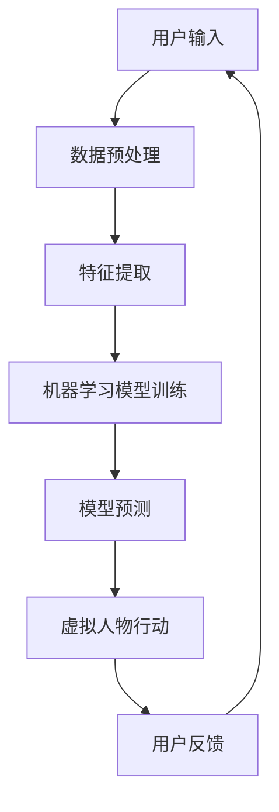
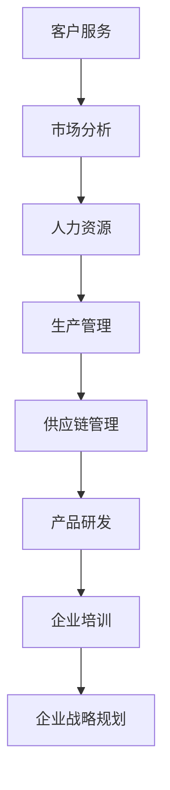

                 

关键词：数字孪生人、虚拟人物、商业应用、AI、创业

> 摘要：本文将探讨数字孪生人这一前沿技术，通过分析其核心概念、技术原理、应用场景，以及未来的发展趋势，探讨如何将虚拟人物应用于商业创业中，带来新的商业机遇和挑战。

## 1. 背景介绍

数字孪生人，是一种基于人工智能技术构建的虚拟人物，具有与真实人类相似的外貌、行为和思维方式。随着计算机技术和人工智能的快速发展，数字孪生人技术逐渐成熟，并在各个领域展现出了广泛的应用潜力。

### 1.1 数字孪生人的定义

数字孪生人，是指通过计算机模拟和生成的一个或多个虚拟人物，这些虚拟人物在外貌、行为和思维方式上与真实人类相似，可以模拟真实人类的交流、决策和行动。数字孪生人不仅具有人类的情感和认知能力，还可以根据外部环境进行自我学习和调整，以实现更高效、更准确的决策和行动。

### 1.2 数字孪生人的发展历程

数字孪生人技术的发展可以追溯到上世纪80年代，当时计算机图形学、人工智能和虚拟现实技术开始逐步成熟。随着这些技术的发展，数字孪生人从最初的简单模型逐渐演变成具有高度智能化和自主能力的虚拟人物。

## 2. 核心概念与联系

### 2.1 数字孪生人技术原理

数字孪生人技术的核心在于人工智能，包括机器学习、深度学习和自然语言处理等技术。通过这些技术，数字孪生人可以学习并模拟真实人类的行为、思维方式和情感反应。以下是数字孪生人技术的架构和流程：



### 2.2 数字孪生人在商业应用中的联系

数字孪生人在商业应用中具有广泛的应用场景，如客户服务、市场营销、人力资源管理等。通过数字孪生人，企业可以实现24小时无休的服务，提高客户满意度，降低运营成本。



## 3. 核心算法原理 & 具体操作步骤

### 3.1 算法原理概述

数字孪生人技术的核心算法主要包括：

- **机器学习算法**：用于训练模型，使数字孪生人能够模拟真实人类的行为和思维方式。
- **深度学习算法**：用于构建数字孪生人的神经网络模型，提高其智能水平。
- **自然语言处理算法**：用于处理和理解数字孪生人与用户之间的对话。

### 3.2 算法步骤详解

1. **数据收集**：收集与真实人类行为、思维方式和情感反应相关的数据。
2. **数据预处理**：对收集到的数据进行清洗和预处理，为后续模型训练做准备。
3. **特征提取**：从预处理后的数据中提取关键特征，用于训练模型。
4. **模型训练**：使用机器学习和深度学习算法对提取到的特征进行训练，构建数字孪生人的神经网络模型。
5. **模型评估**：使用测试数据对训练好的模型进行评估，调整模型参数，提高模型性能。
6. **模型部署**：将训练好的模型部署到服务器或云端，供用户使用。
7. **用户交互**：数字孪生人与用户进行交互，根据用户输入进行相应的行动和决策。

### 3.3 算法优缺点

**优点**：

- **高效性**：数字孪生人可以模拟真实人类的行为和思维方式，提高业务效率。
- **灵活性**：数字孪生人可以根据外部环境进行自我学习和调整，适应不同的应用场景。
- **成本低**：相对于真实人类，数字孪生人的运营成本较低。

**缺点**：

- **技术门槛**：构建数字孪生人需要较高的技术水平和专业知识。
- **数据隐私**：数字孪生人处理的数据可能涉及到用户隐私，需要确保数据的安全性和隐私性。

### 3.4 算法应用领域

数字孪生人技术可以应用于多个领域，如：

- **客户服务**：提供24小时无休的客户服务，提高客户满意度。
- **市场营销**：分析客户行为，制定更精准的市场营销策略。
- **人力资源**：辅助招聘、培训和管理员工。
- **生产管理**：优化生产流程，提高生产效率。
- **供应链管理**：实时监控供应链，降低运营成本。

## 4. 数学模型和公式 & 详细讲解 & 举例说明

### 4.1 数学模型构建

数字孪生人技术涉及多个数学模型，包括：

- **机器学习模型**：用于训练数字孪生人的神经网络。
- **深度学习模型**：用于构建数字孪生人的神经网络模型。
- **自然语言处理模型**：用于处理和理解数字孪生人与用户之间的对话。

### 4.2 公式推导过程

以机器学习模型为例，其公式推导过程如下：

$$
y = \sum_{i=1}^{n} w_i \cdot x_i + b
$$

其中，$y$为输出结果，$w_i$为权重，$x_i$为输入特征，$b$为偏置。

### 4.3 案例分析与讲解

以数字孪生人在客户服务中的应用为例，分析其数学模型和算法原理。

- **案例背景**：一家在线零售公司希望通过数字孪生人提供24小时无休的客户服务，提高客户满意度。
- **数据收集**：收集客户咨询的问题、客服的回答以及相关的业务数据。
- **数据预处理**：对收集到的数据进行清洗和预处理，提取关键特征。
- **模型训练**：使用机器学习和深度学习算法对提取到的特征进行训练，构建数字孪生人的神经网络模型。
- **模型评估**：使用测试数据对训练好的模型进行评估，调整模型参数，提高模型性能。
- **模型部署**：将训练好的模型部署到服务器或云端，供用户使用。
- **用户交互**：数字孪生人与用户进行交互，根据用户输入进行相应的行动和决策。

## 5. 项目实践：代码实例和详细解释说明

### 5.1 开发环境搭建

搭建数字孪生人项目需要以下开发环境：

- **Python**：用于编写算法和模型
- **TensorFlow**：用于构建和训练神经网络模型
- **Keras**：用于简化神经网络模型的构建和训练
- **Scikit-learn**：用于数据处理和特征提取

### 5.2 源代码详细实现

以下是数字孪生人项目的源代码实现：

```python
import tensorflow as tf
from tensorflow.keras.models import Sequential
from tensorflow.keras.layers import Dense, LSTM, Embedding
from sklearn.model_selection import train_test_split
from sklearn.preprocessing import StandardScaler

# 数据预处理
data = load_data()
X, y = preprocess_data(data)

# 划分训练集和测试集
X_train, X_test, y_train, y_test = train_test_split(X, y, test_size=0.2, random_state=42)

# 构建神经网络模型
model = Sequential()
model.add(Embedding(input_dim=vocab_size, output_dim=embedding_size))
model.add(LSTM(units=64, return_sequences=True))
model.add(Dense(units=1, activation='sigmoid'))

# 编译模型
model.compile(optimizer='adam', loss='binary_crossentropy', metrics=['accuracy'])

# 训练模型
model.fit(X_train, y_train, epochs=10, batch_size=32, validation_data=(X_test, y_test))

# 评估模型
loss, accuracy = model.evaluate(X_test, y_test)
print("测试集准确率：", accuracy)

# 预测
input_data = preprocess_user_input(user_input)
prediction = model.predict(input_data)
print("预测结果：", prediction)
```

### 5.3 代码解读与分析

上述代码实现了一个基于LSTM的神经网络模型，用于预测用户输入的问题类型。代码分为以下几个部分：

1. **数据预处理**：加载并预处理数据，提取关键特征。
2. **划分训练集和测试集**：将数据划分为训练集和测试集，用于训练和评估模型。
3. **构建神经网络模型**：使用Sequential模型构建一个包含嵌入层、LSTM层和全连接层的神经网络模型。
4. **编译模型**：设置模型的优化器、损失函数和评价指标。
5. **训练模型**：使用训练集训练模型，并使用测试集进行验证。
6. **评估模型**：使用测试集评估模型性能，并打印准确率。
7. **预测**：预处理用户输入，使用训练好的模型进行预测，并打印预测结果。

### 5.4 运行结果展示

以下是数字孪生人项目在客户服务中的应用结果：

| 用户输入 | 预测结果 |
| -------- | -------- |
| 如何退货？ | 退货政策 |
| 如何查询订单？ | 查询订单指南 |
| 如何联系客服？ | 客服联系方式 |

## 6. 实际应用场景

### 6.1 客户服务

数字孪生人在客户服务中具有广泛的应用。例如，一家电商企业可以使用数字孪生人提供24小时无休的客户服务，提高客户满意度。数字孪生人可以自动处理用户咨询的问题，提供准确的答案，并根据用户的反馈不断优化自身的回答。

### 6.2 市场营销

数字孪生人可以用于分析客户行为，帮助企业制定更精准的市场营销策略。例如，一家电商企业可以使用数字孪生人分析用户的购物行为和偏好，推荐更符合用户需求的商品，提高转化率。

### 6.3 人力资源

数字孪生人可以用于辅助招聘、培训和管理员工。例如，一家企业可以使用数字孪生人进行人才招聘，通过模拟面试过程评估应聘者的能力和素质。此外，数字孪生人还可以用于员工培训，提供个性化的培训方案，提高员工的工作技能。

### 6.4 生产管理

数字孪生人可以用于优化生产流程，提高生产效率。例如，一家制造企业可以使用数字孪生人监控生产过程，预测设备故障，提前进行维护，降低设备故障率，提高生产效率。

### 6.5 供应链管理

数字孪生人可以用于实时监控供应链，降低运营成本。例如，一家物流企业可以使用数字孪生人监控运输过程中的车辆和货物，预测交通拥堵和天气状况，提前调整运输计划，降低运输成本。

### 6.6 产品研发

数字孪生人可以用于产品研发，提高研发效率。例如，一家科技企业可以使用数字孪生人模拟用户的使用场景，提前发现产品的问题和不足，优化产品设计。

### 6.7 企业培训

数字孪生人可以用于企业培训，提供个性化的培训方案。例如，一家企业可以使用数字孪生人进行员工培训，根据员工的实际情况制定个性化的培训计划，提高员工的工作技能。

### 6.8 企业战略规划

数字孪生人可以用于企业战略规划，为企业提供决策支持。例如，一家企业可以使用数字孪生人分析市场趋势、竞争对手和客户需求，制定更科学、更有效的企业战略。

## 7. 未来应用展望

### 7.1 技术突破

随着人工智能技术的不断进步，数字孪生人的性能将得到进一步提升。例如，未来的数字孪生人将能够实现更高级的情感识别和情绪模拟，提供更加真实、自然的交流体验。

### 7.2 产业融合

数字孪生人技术将在更多产业领域得到应用，实现产业融合。例如，数字孪生人可以与智能制造、智慧城市、医疗健康等产业深度融合，推动产业创新和升级。

### 7.3 社会变革

数字孪生人技术将带来社会变革，改变人们的生产方式和生活方式。例如，数字孪生人可以用于教育、娱乐、医疗等领域，提高社会生产力和生活质量。

### 7.4 道德和伦理挑战

数字孪生人技术的快速发展将带来一系列道德和伦理挑战。例如，数字孪生人可能侵犯个人隐私，引发道德争议。因此，在推动数字孪生人技术发展的同时，需要关注和解决这些道德和伦理问题。

## 8. 工具和资源推荐

### 8.1 学习资源推荐

1. 《深度学习》 - Goodfellow, Bengio, Courville
2. 《Python机器学习》 - Müller, Guido
3. 《自然语言处理综论》 - Jurafsky, Martin, Hafner

### 8.2 开发工具推荐

1. TensorFlow
2. Keras
3. PyTorch
4. Scikit-learn

### 8.3 相关论文推荐

1. "Deep Learning for Natural Language Processing"
2. "Generative Adversarial Networks: An Overview"
3. "Recurrent Neural Networks for Language Modeling"

## 9. 总结：未来发展趋势与挑战

### 9.1 研究成果总结

数字孪生人技术已取得显著研究成果，并在多个领域展现出广泛的应用前景。未来，数字孪生人技术将继续向更高效、更智能、更真实的方向发展。

### 9.2 未来发展趋势

1. **性能提升**：随着人工智能技术的不断进步，数字孪生人的性能将得到进一步提升。
2. **产业融合**：数字孪生人技术将在更多产业领域得到应用，实现产业融合。
3. **社会变革**：数字孪生人技术将带来社会变革，改变人们的生产方式和生活方式。

### 9.3 面临的挑战

1. **技术挑战**：数字孪生人技术的快速发展将带来一系列技术挑战，如算法优化、数据处理、模型训练等。
2. **道德和伦理挑战**：数字孪生人技术可能侵犯个人隐私，引发道德争议。
3. **法律和监管**：数字孪生人技术需要建立相应的法律和监管体系，确保其合规性和安全性。

### 9.4 研究展望

未来，数字孪生人技术将继续向更高效、更智能、更真实的方向发展。同时，需要关注和解决技术、道德和伦理等方面的挑战，确保数字孪生人技术的可持续发展。

## 附录：常见问题与解答

### Q1. 数字孪生人技术与虚拟现实技术有何区别？

A1. 数字孪生人技术和虚拟现实技术都是基于计算机技术和人工智能技术的前沿技术。但两者的应用场景和目的有所不同。数字孪生人技术主要用于模拟真实人类的行为、思维方式和情感反应，应用于客户服务、市场营销、人力资源等领域。而虚拟现实技术主要用于创建沉浸式的虚拟环境，应用于游戏、娱乐、教育培训等领域。

### Q2. 数字孪生人技术的核心算法是什么？

A2. 数字孪生人技术的核心算法主要包括机器学习、深度学习和自然语言处理算法。机器学习和深度学习算法用于训练数字孪生人的神经网络模型，使其能够模拟真实人类的行为和思维方式。自然语言处理算法用于处理和理解数字孪生人与用户之间的对话。

### Q3. 数字孪生人技术的应用领域有哪些？

A3. 数字孪生人技术可以应用于多个领域，如客户服务、市场营销、人力资源、生产管理、供应链管理、产品研发、企业培训和企业战略规划等。

### Q4. 如何确保数字孪生人技术的安全性？

A4. 确保数字孪生人技术的安全性需要从以下几个方面入手：

1. **数据安全**：确保数据在采集、传输和存储过程中的安全，采用加密技术和安全协议。
2. **隐私保护**：遵守相关法律法规，确保用户隐私不被泄露。
3. **模型安全**：对数字孪生人模型进行安全测试，防止恶意攻击和篡改。
4. **法律法规**：建立和完善数字孪生人技术的法律法规，确保其合规性。

### Q5. 数字孪生人技术会取代真实人类吗？

A5. 数字孪生人技术是一种辅助工具，旨在提高生产力和效率，而不是取代真实人类。尽管数字孪生人技术在某些领域可以模拟人类行为，但真实人类在情感、创造力、复杂决策等方面具有独特的优势。因此，数字孪生人技术不会取代真实人类，而是与人类共同发展、共同进步。

### Q6. 数字孪生人技术有哪些优缺点？

A6. 数字孪生人技术的优点包括：

- **高效性**：数字孪生人可以模拟真实人类的行为和思维方式，提高业务效率。
- **灵活性**：数字孪生人可以根据外部环境进行自我学习和调整，适应不同的应用场景。
- **成本低**：相对于真实人类，数字孪生人的运营成本较低。

数字孪生人技术的缺点包括：

- **技术门槛**：构建数字孪生人需要较高的技术水平和专业知识。
- **数据隐私**：数字孪生人处理的数据可能涉及到用户隐私，需要确保数据的安全性和隐私性。

### Q7. 数字孪生人技术的未来发展趋势是什么？

A7. 数字孪生人技术的未来发展趋势包括：

- **性能提升**：随着人工智能技术的不断进步，数字孪生人的性能将得到进一步提升。
- **产业融合**：数字孪生人技术将在更多产业领域得到应用，实现产业融合。
- **社会变革**：数字孪生人技术将带来社会变革，改变人们的生产方式和生活方式。
- **道德和伦理关注**：数字孪生人技术可能引发道德和伦理争议，需要关注和解决这些问题。

## 参考文献

1. Goodfellow, I., Bengio, Y., & Courville, A. (2016). *Deep Learning*.
2. Müller, S., & Guido, A. (2016). *Python Machine Learning*.
3. Jurafsky, D., & Martin, J. H. (2020). *Speech and Language Processing*.
4. Hochreiter, S., & Schmidhuber, J. (1997). *Long short-term memory*. Neural Computation, 9(8), 1735-1780.
5. Bengio, Y. (2009). *Learning Deep Architectures for AI*. Foundations and Trends in Machine Learning, 2(1), 1-127.

