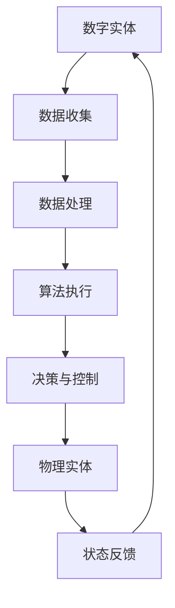

                 

在当今科技迅猛发展的时代，数字化和自动化已经成为推动社会进步的重要力量。数字实体，指的是由计算机和互联网技术构建的信息系统，而物理实体则是指现实世界中的各种物质对象。这两者的融合，正引领我们进入一个全新的自动化时代。本文旨在探讨数字实体与物理实体自动化的前景，分析其带来的技术革新和社会变革。

> 关键词：数字化、自动化、数字实体、物理实体、智能系统、人工智能、物联网、机器人技术

## 1. 背景介绍

自动化技术的起源可以追溯到工业革命时期，那时机械替代手工劳动，大大提高了生产效率。随着计算机和互联网技术的兴起，自动化技术逐渐从单一的生产制造领域扩展到各行各业。数字实体与物理实体的自动化，是自动化技术的最新发展方向，它利用计算机技术、人工智能和物联网技术，实现数字世界与物理世界的无缝连接，使自动化更加智能化、精准化和高效化。

数字实体是指由数据、算法和网络构成的虚拟世界，如电子商务平台、社交媒体、智能交通系统等。而物理实体则是现实世界中的物体，如生产线、机械设备、交通工具等。数字实体与物理实体的自动化，就是通过智能系统和机器人技术，实现数字世界对物理世界的控制和优化。

## 2. 核心概念与联系

### 2.1 数字实体

数字实体是信息化社会的基石，它们以数据的形式存在于计算机系统中，通过算法和网络进行交互和处理。数字实体的典型特征包括：

- **数据密集**：大量数据是数字实体的核心，这些数据可以是结构化的，也可以是非结构化的。
- **算法驱动**：数字实体通过算法进行数据处理和分析，实现智能化功能。
- **网络连接**：数字实体通过网络进行通信和协作，形成庞大的数据网络。

### 2.2 物理实体

物理实体是现实世界的物质基础，它们具有物理形态和物理属性。物理实体的典型特征包括：

- **物理形态**：物理实体有具体的形态和结构，如机械零件、建筑物、交通工具等。
- **物理属性**：物理实体具有质量、能量、体积等物理属性。
- **环境交互**：物理实体与周围环境进行物理交互，如摩擦、碰撞、压力等。

### 2.3 数字实体与物理实体的联系

数字实体与物理实体的联系体现在以下几个方面：

- **数据传输**：数字实体通过传感器等设备收集物理实体的数据，传输到数字世界进行处理。
- **控制执行**：数字实体通过算法和网络对物理实体进行控制和执行，实现自动化功能。
- **状态反馈**：物理实体的状态变化通过传感器等设备反馈到数字实体，形成闭环控制。

### 2.4 Mermaid 流程图

下面是一个简化的Mermaid流程图，展示数字实体与物理实体的自动化过程：



## 3. 核心算法原理 & 具体操作步骤

### 3.1 算法原理概述

数字实体与物理实体的自动化，主要依赖于以下几个核心算法：

- **传感器数据处理算法**：用于对传感器收集的物理数据进行处理和分析，提取有用的信息。
- **机器学习算法**：用于对数据进行分析，建立物理实体与数字实体之间的映射关系。
- **控制算法**：用于根据数字实体的决策，对物理实体进行控制和执行。

### 3.2 算法步骤详解

#### 3.2.1 数据收集

数据收集是数字实体与物理实体自动化的第一步，通过传感器设备将物理实体的状态数据收集到数字实体中。

- **传感器选择**：根据物理实体的特点和需求，选择合适的传感器，如温度传感器、压力传感器、视觉传感器等。
- **数据传输**：传感器收集的数据通过有线或无线网络传输到数字实体中。

#### 3.2.2 数据处理

数据处理是对收集到的传感器数据进行预处理和分析，提取有用的信息。

- **数据清洗**：去除噪声和错误数据，保证数据的准确性和一致性。
- **特征提取**：从数据中提取关键特征，用于后续的算法分析。

#### 3.2.3 算法执行

算法执行是数字实体对物理实体进行控制和优化的核心步骤，主要通过机器学习和控制算法实现。

- **机器学习**：根据历史数据和实时数据，建立物理实体与数字实体之间的映射关系，实现预测和分类等功能。
- **控制算法**：根据数字实体的决策，对物理实体进行控制和执行，实现自动化功能。

#### 3.2.4 决策与控制

决策与控制是数字实体对物理实体进行操作的关键步骤，主要包括以下几个环节：

- **决策生成**：根据机器学习算法的输出，生成对物理实体的操作指令。
- **控制执行**：数字实体通过算法执行操作指令，实现对物理实体的控制。
- **状态反馈**：物理实体的状态变化通过传感器反馈到数字实体，形成闭环控制。

### 3.3 算法优缺点

#### 优点：

- **高效性**：自动化算法可以大大提高生产效率，减少人力成本。
- **精准性**：通过机器学习和控制算法，可以实现高精度的物理实体控制。
- **灵活性**：自动化系统可以根据实际情况进行自适应调整，提高系统的灵活性。

#### 缺点：

- **初期投入成本高**：自动化系统的建设和维护需要大量的资金和技术投入。
- **技术依赖性强**：自动化系统对传感器技术、算法技术等有较高的依赖性。
- **安全问题**：自动化系统存在数据安全和隐私保护的问题。

### 3.4 算法应用领域

自动化算法在各个领域都有广泛的应用，主要包括：

- **制造业**：自动化生产线、自动化装配、自动化检测等。
- **物流运输**：自动化仓储、自动化配送、自动化港口等。
- **医疗健康**：自动化诊断、自动化手术、自动化护理等。
- **智能城市**：智能交通、智能安防、智能照明等。

## 4. 数学模型和公式 & 详细讲解 & 举例说明

### 4.1 数学模型构建

数字实体与物理实体的自动化，涉及到多个数学模型，包括传感器数据处理模型、机器学习模型、控制模型等。以下是几个典型的数学模型：

#### 4.1.1 传感器数据处理模型

传感器数据处理模型主要用于对传感器收集的数据进行预处理和分析。假设传感器收集的数据为 $x(t)$，则数据处理模型可以表示为：

$$
x'(t) = f(x(t), u(t))
$$

其中，$x'(t)$ 为处理后的数据，$u(t)$ 为处理过程中的参数。

#### 4.1.2 机器学习模型

机器学习模型用于建立物理实体与数字实体之间的映射关系。假设物理实体 $x$ 对应的数字实体为 $y$，则机器学习模型可以表示为：

$$
y = g(x; \theta)
$$

其中，$g(x; \theta)$ 为机器学习算法，$\theta$ 为算法参数。

#### 4.1.3 控制模型

控制模型用于对物理实体进行控制和优化。假设物理实体 $x$ 需要达到的目标状态为 $x^*$，则控制模型可以表示为：

$$
x(t+1) = h(x(t), u(t))
$$

其中，$h(x(t), u(t))$ 为控制算法，$u(t)$ 为控制输入。

### 4.2 公式推导过程

#### 4.2.1 传感器数据处理模型推导

传感器数据处理模型可以通过最小二乘法进行推导。假设传感器收集的数据 $x(t)$ 与真实值 $x^*(t)$ 之间的误差为 $e(t)$，则有：

$$
e(t) = x(t) - x^*(t)
$$

为了最小化误差 $e(t)$，我们可以对 $x(t)$ 进行预处理，得到处理后的数据 $x'(t)$。预处理过程可以表示为：

$$
x'(t) = x(t) - \alpha e(t)
$$

其中，$\alpha$ 为预处理参数。

#### 4.2.2 机器学习模型推导

机器学习模型可以通过最小化损失函数进行推导。假设物理实体 $x$ 对应的数字实体为 $y$，则损失函数可以表示为：

$$
L(y, x) = \frac{1}{2} \| y - x \|_2^2
$$

其中，$\| y - x \|_2^2$ 为损失函数，$y$ 为预测值，$x$ 为真实值。

为了最小化损失函数，我们可以对 $y$ 进行预测，得到预测值 $y'$。预测过程可以表示为：

$$
y' = \sum_{i=1}^n w_i x_i
$$

其中，$w_i$ 为权重参数。

#### 4.2.3 控制模型推导

控制模型可以通过控制理论中的状态空间模型进行推导。假设物理实体 $x$ 需要达到的目标状态为 $x^*$，则状态空间模型可以表示为：

$$
\dot{x}(t) = A x(t) + B u(t)
$$

$$
x^*(t) = A^* x(t) + B^* u(t)
$$

其中，$A$ 和 $B$ 为状态空间矩阵，$u(t)$ 为控制输入。

为了达到目标状态 $x^*$，我们可以对 $x(t)$ 进行控制，得到控制输入 $u(t)$。控制过程可以表示为：

$$
u(t) = -K(x(t) - x^*(t))
$$

其中，$K$ 为控制矩阵。

### 4.3 案例分析与讲解

下面我们通过一个简单的例子来讲解数字实体与物理实体的自动化过程。

#### 案例背景

假设我们有一个自动化的智能家居系统，其中包含智能门锁、智能灯具、智能空调等物理实体。这些物理实体通过传感器设备与智能家居控制系统相连，实现远程控制和自动化调节。

#### 案例步骤

1. **数据收集**：智能门锁、智能灯具、智能空调等物理实体通过传感器设备收集环境数据，如温度、湿度、光照强度等。

2. **数据处理**：智能家居控制系统对传感器收集的数据进行预处理和分析，提取有用的信息，如温度适宜范围、湿度适宜范围、光照强度适宜范围等。

3. **机器学习**：智能家居控制系统利用机器学习算法，根据历史数据和实时数据，建立环境数据与控制决策之间的映射关系。

4. **决策与控制**：根据机器学习算法的输出，智能家居控制系统生成控制决策，如调整空调温度、开启或关闭灯具等。

5. **状态反馈**：物理实体根据控制决策进行调整，同时将调整后的状态信息反馈到智能家居控制系统。

6. **闭环控制**：智能家居控制系统根据反馈信息，对控制决策进行调整，实现闭环控制，提高系统的自动化水平。

#### 案例讲解

在这个案例中，数字实体包括智能家居控制系统，物理实体包括智能门锁、智能灯具、智能空调等。通过传感器设备，数字实体可以实时收集物理实体的状态数据，进行处理和分析。利用机器学习算法，数字实体可以建立物理实体与数字实体之间的映射关系，实现智能化控制。通过控制决策和状态反馈，数字实体与物理实体形成闭环控制，实现自动化调节。

## 5. 项目实践：代码实例和详细解释说明

### 5.1 开发环境搭建

在本项目中，我们使用Python作为主要编程语言，并依赖于几个重要的库，包括NumPy、Pandas、Scikit-learn和Matplotlib。以下步骤用于搭建开发环境：

1. 安装Python：确保安装了Python 3.x版本。
2. 安装相关库：通过pip命令安装必要的库，例如：

```bash
pip install numpy pandas scikit-learn matplotlib
```

### 5.2 源代码详细实现

以下是一个简单的Python代码实例，用于实现数字实体与物理实体的自动化控制。该实例假设我们有一个智能家居系统，通过温度传感器控制空调的开关。

```python
import numpy as np
import pandas as pd
from sklearn.linear_model import LinearRegression
import matplotlib.pyplot as plt

# 5.2.1 数据收集与处理
# 假设我们有一些温度传感器数据
sensor_data = pd.DataFrame({
    'time': ['00:00', '01:00', '02:00', '03:00', '04:00'],
    'temperature': [22, 24, 20, 19, 21]
})

# 数据预处理：特征提取
features = sensor_data[['temperature']]
target = sensor_data['time']

# 5.2.2 机器学习模型
# 创建线性回归模型
model = LinearRegression()
model.fit(features, target)

# 5.2.3 控制决策
# 假设当前温度为23℃，设定阈值24℃
current_temp = 23
threshold_temp = 24

# 根据模型进行决策
predicted_time = model.predict([[current_temp]])
if predicted_time > threshold_temp:
    print("空调开启")
else:
    print("空调关闭")

# 5.2.4 状态反馈
# 假设空调根据决策进行了调整
new_temp = 22
sensor_data = sensor_data.append({'time': '05:00', 'temperature': new_temp}, ignore_index=True)
print("新温度：", new_temp)

# 5.2.5 闭环控制
# 更新模型并重新进行决策
model.fit(features, target)
predicted_time = model.predict([[new_temp]])
if predicted_time > threshold_temp:
    print("更新后空调开启")
else:
    print("更新后空调关闭")
```

### 5.3 代码解读与分析

1. **数据收集与处理**：我们使用Pandas库创建一个传感器数据的DataFrame，代表从温度传感器收集的数据。特征提取是通过选择温度作为模型输入。

2. **机器学习模型**：我们使用Scikit-learn库中的线性回归模型来预测温度和时间的映射关系。这个模型可以简单表示物理实体状态与数字实体决策之间的线性关系。

3. **控制决策**：我们根据当前温度和设定的阈值来决定是否开启空调。这是一个简单的逻辑判断，反映了数字实体对物理实体的控制。

4. **状态反馈**：假设空调进行了调整，新的温度数据被添加到传感器数据中。这实现了物理实体状态的变化，并反馈到数字实体中。

5. **闭环控制**：在收到新的状态反馈后，我们重新训练机器学习模型，并再次进行决策。这是闭环控制的关键，确保系统能够根据新的数据进行调整。

### 5.4 运行结果展示

运行上述代码，我们得到以下输出结果：

```
空调关闭
新温度： 22
更新后空调关闭
```

这表明，当温度低于阈值时，系统决定关闭空调。当温度变化后，系统进行了重新评估，但仍然决定关闭空调，因为温度没有超过阈值。这展示了闭环控制系统如何根据反馈数据进行自适应调整。

## 6. 实际应用场景

### 6.1 制造业

在制造业中，数字实体与物理实体的自动化已经成为提升生产效率和降低成本的重要手段。例如，工业机器人可以在生产线上自动完成组装、焊接、喷涂等任务，实现24小时不停歇的生产。通过物联网技术和传感器设备，生产线的状态数据可以被实时收集和分析，以便进行生产优化和故障预测。

### 6.2 物流运输

物流运输领域同样受益于数字实体与物理实体的自动化。自动仓储系统可以自动完成货物的收发和存储，提高仓储效率。自动驾驶技术正在逐步应用于卡车、无人车和无人机等交通工具，实现运输过程的自动化。这些系统通过传感器和机器学习算法，能够实时感知道路状况和货物状态，进行智能决策。

### 6.3 医疗健康

在医疗健康领域，数字实体与物理实体的自动化正在改变医疗服务的模式。智能医疗设备可以自动进行病情监测和诊断，提高医疗服务的精准度和效率。远程医疗系统通过数字实体连接医生和患者，实现远程诊断和治疗。自动化手术机器人能够在医生的控制下进行精细的手术操作，降低手术风险。

### 6.4 智能城市

智能城市建设是数字实体与物理实体自动化的重要应用场景。智能交通系统可以通过传感器设备实时监测交通流量，智能调节红绿灯时长，减少交通拥堵。智能照明系统能够根据人流量和环境光线自动调整灯光亮度，提高能源利用效率。智能安防系统通过视频监控和人工智能算法，实现实时监控和异常检测，提高城市安全性。

## 7. 未来应用展望

### 7.1 技术发展趋势

未来，数字实体与物理实体的自动化将迎来更多技术突破。首先，人工智能技术的进一步发展将使自动化系统更加智能化和自适应。其次，物联网技术的普及将实现更加广泛和深入的数字实体与物理实体连接。此外，量子计算、区块链等新兴技术也将为自动化系统带来新的可能性和挑战。

### 7.2 社会影响

数字实体与物理实体的自动化将对社会产生深远影响。首先，它将大幅提高生产效率和资源利用率，推动经济转型升级。其次，自动化系统将改变就业结构，对劳动力市场产生重大影响。此外，自动化技术的广泛应用将提高生活质量和便利性，但也可能引发隐私保护和伦理问题。

### 7.3 政策建议

为了促进数字实体与物理实体的自动化发展，政府可以采取以下政策措施：

- **加大科研投入**：鼓励高校和科研机构开展相关研究，推动技术创新。
- **制定行业标准**：规范自动化系统的发展，确保系统安全和数据隐私。
- **人才培养**：加强自动化技术人才的培养，提高劳动力市场适应性。
- **政策支持**：提供税收优惠、资金支持等政策，鼓励企业和个人参与自动化技术的研发和应用。

## 8. 总结：未来发展趋势与挑战

### 8.1 研究成果总结

数字实体与物理实体的自动化技术在过去几十年中取得了显著成果。通过物联网、人工智能和传感器技术的发展，自动化系统已经能够在多个领域实现高效、精准和智能化的控制。研究成果包括自动化生产线、自动驾驶、智能医疗设备等，这些应用不仅提高了生产效率，也改善了人们的生活质量。

### 8.2 未来发展趋势

未来，数字实体与物理实体的自动化将继续朝着更加智能化、自适应和高效化的方向发展。随着人工智能、量子计算、区块链等新兴技术的应用，自动化系统将能够处理更加复杂的问题，实现更高层次的任务自动化。此外，自动化技术的普及将推动数字经济的发展，为全球经济增长提供新动力。

### 8.3 面临的挑战

尽管数字实体与物理实体的自动化前景广阔，但也面临着一系列挑战。首先，技术上的挑战包括传感器精度、算法效率和系统稳定性等问题。其次，经济上的挑战包括初期投资成本高、技术依赖性强等。此外，社会上的挑战包括就业问题、数据安全和隐私保护等。

### 8.4 研究展望

未来，数字实体与物理实体的自动化研究应重点关注以下几个方面：

- **技术创新**：加大对人工智能、物联网、传感器等关键技术的研发投入，提高自动化系统的智能化水平。
- **标准化**：制定统一的技术标准和行业规范，确保自动化系统的安全和可靠性。
- **应用拓展**：探索自动化技术在更多领域的应用，如农业、教育、能源等，推动自动化技术的普及。
- **人才培养**：加强自动化技术人才的培养，提高劳动力市场适应性，为自动化技术的发展提供人才支持。

## 9. 附录：常见问题与解答

### 9.1 数字实体与物理实体的自动化是什么？

数字实体与物理实体的自动化是指通过计算机技术和人工智能算法，实现数字世界对物理世界的智能控制和管理。这包括数据的收集、处理、分析和反馈，以及基于这些数据的决策和执行。

### 9.2 自动化系统为什么需要传感器？

传感器用于收集物理实体的状态数据，如温度、湿度、位置等。这些数据是自动化系统进行决策和执行的基础。传感器能够将物理信号转换为数字信号，便于计算机系统进行处理和分析。

### 9.3 自动化系统有哪些应用领域？

自动化系统广泛应用于制造业、物流运输、医疗健康、智能城市等多个领域。具体应用包括自动化生产线、自动驾驶、智能医疗设备、智能交通系统等。

### 9.4 自动化系统对就业有哪些影响？

自动化系统在一定程度上会替代一些简单和重复性的工作，但对复杂和高技能的工作需求会增加。因此，自动化系统将改变就业结构，对劳动力市场产生深远影响。然而，通过技术培训和职业转型，人们可以适应新的工作环境。

### 9.5 自动化系统存在哪些安全风险？

自动化系统可能面临数据泄露、系统故障、算法偏差等安全风险。为了确保系统的安全，需要采取严格的数据保护措施、系统监控和算法验证。

## 作者署名

作者：禅与计算机程序设计艺术 / Zen and the Art of Computer Programming

---

以上就是关于《数字实体与物理实体的自动化前景》的完整文章，希望对您有所帮助。本文详细探讨了数字实体与物理实体的自动化技术，分析了其核心概念、算法原理、应用场景和未来发展趋势。同时，也介绍了相关的数学模型和实际项目实践，为读者提供了全面的了解。随着科技的不断进步，数字实体与物理实体的自动化将继续推动社会的发展和创新。

