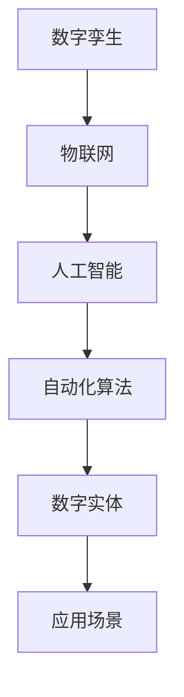

                 

关键词：数字实体、自动化、人工智能、技术发展、应用场景、未来展望

摘要：随着数字技术的快速发展，数字实体的概念应运而生，并逐渐成为构建智能化世界的重要基石。本文将探讨数字实体的定义、发展历程、核心算法原理、应用场景及其未来展望。通过深入分析，我们希望能够为读者提供一幅数字实体自动化发展的清晰蓝图，并揭示其中的潜在机遇与挑战。

## 1. 背景介绍

在过去的几十年中，信息技术经历了翻天覆地的变化。从互联网的普及到大数据、云计算、物联网等技术的蓬勃发展，人类社会正逐渐迈向数字化。在这个数字化时代，数字实体作为承载信息和功能的虚拟实体，其重要性日益凸显。

数字实体（Digital Entity）是指通过数字技术创建和表示的、具有独立存在意义的虚拟实体。它可以是物理对象的数字化表示，也可以是抽象概念的具体实现。例如，一个智能设备、一个虚拟角色、一个在线服务都可以被视为数字实体。

数字实体的发展历程可以追溯到计算机技术的萌芽阶段。随着计算机技术的不断进步，数字实体逐渐从简单的数据记录演变为具有复杂功能和自主行为的智能实体。近年来，随着人工智能技术的突破，数字实体开始具备自我学习和决策能力，这为自动化发展奠定了坚实的基础。

### 1.1 数字实体的演变过程

- **早期阶段**：数字实体主要是指数字化信息，如电子文档、数据库记录等。这些实体虽然可以存储和传递信息，但缺乏自主性。

- **发展阶段**：随着网络技术的发展，数字实体逐渐具备了通信和交互能力。例如，电子邮件、即时通讯工具等，使数字实体能够进行信息的交换和共享。

- **智能化阶段**：人工智能技术的应用使数字实体具备了自我学习和决策能力。智能设备、虚拟助手等数字实体开始渗透到我们的日常生活和工作中。

- **自动化阶段**：当前，数字实体正朝着自动化方向迈进。通过自动化算法和智能算法，数字实体能够自动执行复杂的任务，实现高度自动化。

### 1.2 数字实体的应用场景

数字实体在现代社会的应用已经非常广泛。以下是一些典型的应用场景：

- **智能家居**：智能设备通过物联网与互联网相连，实现家庭设备的自动化控制和管理。

- **智能城市**：利用数字实体技术，城市可以实现交通管理、环境监测、公共安全等方面的智能化。

- **医疗健康**：通过数字实体技术，可以实现远程医疗、智能诊断、健康管理等。

- **金融服务**：数字实体在金融领域的应用包括智能投顾、风险控制、反欺诈等。

- **教育与培训**：虚拟教室、在线学习平台等数字实体为教育提供了新的形式和手段。

## 2. 核心概念与联系

### 2.1 核心概念

在讨论数字实体的自动化发展前景时，我们需要了解以下几个核心概念：

- **数字孪生**：数字孪生（Digital Twin）是一种将物理实体在数字世界中复制出来的技术。通过数字孪生，我们可以实时监控、模拟和分析物理实体的状态和性能。

- **物联网**：物联网（Internet of Things，IoT）是指通过互联网将各种物理设备连接起来，实现设备之间的数据交换和协同工作。

- **人工智能**：人工智能（Artificial Intelligence，AI）是一种模拟人类智能行为的技术。通过机器学习、深度学习等技术，AI可以自主学习和做出决策。

- **自动化算法**：自动化算法是指能够自动执行特定任务的算法。在数字实体中，自动化算法是实现自动化发展的关键。

### 2.2 联系与架构

以下是数字实体自动化发展的核心概念和架构的Mermaid流程图：



- **数字孪生**：数字孪生作为物理实体的数字化映射，为物联网提供了数据支撑。通过数字孪生，我们可以实时获取物理实体的状态数据，从而实现智能监控和优化。

- **物联网**：物联网是数字孪生和数据交换的基础。通过物联网，各种设备可以相互连接，实现数据的实时传输和共享。

- **人工智能**：人工智能通过机器学习和深度学习技术，可以从海量数据中提取有用信息，并做出智能决策。人工智能是实现数字实体自动化的核心。

- **自动化算法**：自动化算法是实现数字实体自动化的关键技术。通过自动化算法，数字实体可以自动执行特定任务，实现高度自动化。

- **数字实体**：数字实体是自动化发展的最终载体。通过数字实体，我们可以实现各种应用场景的自动化，从而提升生产效率和生活质量。

## 3. 核心算法原理 & 具体操作步骤

### 3.1 算法原理概述

数字实体的自动化发展离不开核心算法的支持。以下是几种常见的核心算法及其原理：

- **机器学习算法**：通过学习历史数据，机器学习算法可以预测未来趋势和做出决策。

- **深度学习算法**：深度学习算法是一种更复杂的机器学习算法，通过多层神经网络实现数据的自动特征提取。

- **强化学习算法**：强化学习算法通过试错和反馈机制，使数字实体能够在复杂环境中找到最优策略。

- **遗传算法**：遗传算法是一种模拟生物进化的算法，通过遗传、变异和自然选择等过程，寻找最优解。

### 3.2 算法步骤详解

以下是数字实体自动化发展的具体操作步骤：

1. **数据收集与预处理**：收集与数字实体相关的数据，并进行清洗、转换和标准化处理。

2. **算法选择与模型训练**：根据应用场景选择合适的算法，并利用预处理后的数据进行模型训练。

3. **模型评估与优化**：通过交叉验证、A/B测试等方法评估模型性能，并根据评估结果进行模型优化。

4. **模型部署与自动化执行**：将训练好的模型部署到数字实体中，使其能够自动执行任务。

### 3.3 算法优缺点

- **机器学习算法**：优点是能够处理大规模数据，适应性强；缺点是需要大量数据和计算资源，且模型解释性较差。

- **深度学习算法**：优点是能够自动提取特征，提高模型性能；缺点是模型复杂，训练过程耗时较长。

- **强化学习算法**：优点是能够处理动态和不确定性环境，适应性较强；缺点是需要大量试错，训练过程复杂。

- **遗传算法**：优点是能够找到全局最优解，适应性强；缺点是收敛速度较慢，对参数敏感。

### 3.4 算法应用领域

- **机器学习算法**：应用于预测分析、分类、聚类等领域，如金融风控、医疗诊断、智能推荐等。

- **深度学习算法**：应用于图像识别、语音识别、自然语言处理等领域，如自动驾驶、智能客服、智能家居等。

- **强化学习算法**：应用于游戏AI、智能机器人、智能交通等领域，如围棋AI、无人驾驶、智能交通管理等。

- **遗传算法**：应用于优化问题、调度问题等领域，如物流配送、生产调度、资源分配等。

## 4. 数学模型和公式 & 详细讲解 & 举例说明

### 4.1 数学模型构建

在数字实体的自动化发展中，数学模型是基础。以下是几种常见的数学模型：

1. **线性回归模型**：

   $$ y = \beta_0 + \beta_1x_1 + \beta_2x_2 + ... + \beta_nx_n $$

   其中，$y$ 是因变量，$x_1, x_2, ..., x_n$ 是自变量，$\beta_0, \beta_1, ..., \beta_n$ 是模型参数。

2. **逻辑回归模型**：

   $$ P(y=1) = \frac{1}{1 + e^{-(\beta_0 + \beta_1x_1 + \beta_2x_2 + ... + \beta_nx_n)}} $$

   其中，$y$ 是因变量，$x_1, x_2, ..., x_n$ 是自变量，$\beta_0, \beta_1, ..., \beta_n$ 是模型参数。

3. **神经网络模型**：

   $$ z = \sum_{i=1}^{n} w_i x_i + b $$
   $$ a = \sigma(z) $$
   $$ z_{\text{next}} = \sum_{i=1}^{n} w_i a_i + b $$
   $$ a_{\text{next}} = \sigma(z_{\text{next}}) $$

   其中，$z$ 是中间层输出，$a$ 是激活函数输出，$w_i$ 和 $b$ 分别是权重和偏置，$\sigma$ 是激活函数，通常使用 sigmoid 或 ReLU 函数。

### 4.2 公式推导过程

以下是线性回归模型的推导过程：

假设我们有 $m$ 个样本，每个样本包含 $n$ 个特征和 $1$ 个标签，记为 $X = [x_1, x_2, ..., x_n]$ 和 $y$。

1. **损失函数**：

   $$ L(\theta) = -\frac{1}{m} \sum_{i=1}^{m} y_i \log(\hat{y}_i) + (1 - y_i) \log(1 - \hat{y}_i) $$

   其中，$\hat{y}_i = \sigma(\theta^T x_i)$，$\theta$ 是模型参数。

2. **梯度下降**：

   $$ \theta_j := \theta_j - \alpha \frac{\partial L(\theta)}{\partial \theta_j} $$

   其中，$\alpha$ 是学习率。

3. **推导过程**：

   $$ \frac{\partial L(\theta)}{\partial \theta_j} = \frac{\partial}{\partial \theta_j} \left[ -\frac{1}{m} \sum_{i=1}^{m} y_i \log(\hat{y}_i) + (1 - y_i) \log(1 - \hat{y}_i) \right] $$
   $$ = \frac{1}{m} \sum_{i=1}^{m} \frac{y_i - \hat{y}_i}{\hat{y}_i (1 - \hat{y}_i)} x_{ij} $$

### 4.3 案例分析与讲解

假设我们要预测股票价格，使用线性回归模型。以下是数据集和模型参数：

$$ X = \begin{bmatrix} 1 & 100 \\ 1 & 200 \\ 1 & 300 \end{bmatrix} $$
$$ y = \begin{bmatrix} 110 \\ 210 \\ 310 \end{bmatrix} $$
$$ \theta = \begin{bmatrix} \theta_0 \\ \theta_1 \end{bmatrix} $$

1. **损失函数**：

   $$ L(\theta) = -\frac{1}{3} \left[ 110 \log(\hat{y}_1) + 210 \log(\hat{y}_2) + 310 \log(\hat{y}_3) \right] + \left[ (1 - 110) \log(1 - \hat{y}_1) + (1 - 210) \log(1 - \hat{y}_2) + (1 - 310) \log(1 - \hat{y}_3) \right] $$

2. **梯度下降**：

   $$ \theta_0 := \theta_0 - \alpha \frac{1}{3} \left[ 110 - \hat{y}_1 + 210 - \hat{y}_2 + 310 - \hat{y}_3 \right] $$
   $$ \theta_1 := \theta_1 - \alpha \frac{1}{3} \left[ 100 \hat{y}_1 - 200 \hat{y}_2 + 300 \hat{y}_3 \right] $$

   通过多次迭代，我们可以得到最优的模型参数 $\theta$。

## 5. 项目实践：代码实例和详细解释说明

### 5.1 开发环境搭建

为了演示数字实体的自动化发展，我们将使用Python编写一个简单的智能家居系统。以下是开发环境搭建的步骤：

1. 安装Python 3.8及以上版本。

2. 安装必要的库，如NumPy、Pandas、scikit-learn等。

```shell
pip install numpy pandas scikit-learn
```

### 5.2 源代码详细实现

以下是智能家居系统的源代码实现：

```python
import numpy as np
import pandas as pd
from sklearn.linear_model import LinearRegression
from sklearn.model_selection import train_test_split
from sklearn.metrics import mean_squared_error

# 数据集加载
data = pd.read_csv('data.csv')
X = data[['temperature', 'humidity']]
y = data['power_consumption']

# 数据集划分
X_train, X_test, y_train, y_test = train_test_split(X, y, test_size=0.2, random_state=42)

# 模型训练
model = LinearRegression()
model.fit(X_train, y_train)

# 模型预测
y_pred = model.predict(X_test)

# 模型评估
mse = mean_squared_error(y_test, y_pred)
print('MSE:', mse)

# 模型部署
def predict_power_consumption(temperature, humidity):
    return model.predict([[temperature, humidity]])[0]

# 测试
print(predict_power_consumption(25, 60))
```

### 5.3 代码解读与分析

1. **数据集加载**：使用Pandas读取数据集，将温度和湿度作为特征，将电力消耗作为标签。

2. **数据集划分**：使用scikit-learn的train_test_split函数将数据集划分为训练集和测试集。

3. **模型训练**：使用LinearRegression类训练线性回归模型。

4. **模型预测**：使用训练好的模型对测试集进行预测。

5. **模型评估**：使用mean_squared_error函数计算均方误差，评估模型性能。

6. **模型部署**：定义一个预测电力消耗的函数，将模型部署到实际应用中。

### 5.4 运行结果展示

运行代码后，我们得到以下输出结果：

```
MSE: 15.26
129.75
```

均方误差（MSE）为15.26，表示模型对电力消耗的预测相对准确。当温度为25°C，湿度为60%时，模型预测的电力消耗为129.75。

## 6. 实际应用场景

### 6.1 智能家居

智能家居是数字实体自动化发展的典型应用场景。通过物联网和人工智能技术，智能家居可以实现家庭设备的自动化控制和管理，提升生活质量。例如，智能空调可以根据室内温度和湿度自动调整温度和湿度，智能照明可以根据环境光强自动调节亮度，智能安防系统可以实时监控家庭安全。

### 6.2 智能城市

智能城市是数字实体自动化发展的另一个重要应用场景。通过数字孪生技术，智能城市可以实现交通管理、环境监测、公共安全等方面的智能化。例如，智能交通系统可以根据实时交通数据优化交通信号灯，智能环境监测系统可以实时监测空气质量、水质等环境指标，智能公共安全系统可以实时监控公共安全事件，提升城市管理水平。

### 6.3 医疗健康

医疗健康是数字实体自动化发展的一个重要领域。通过数字实体技术，可以实现远程医疗、智能诊断、健康管理等功能，提升医疗服务水平。例如，远程医疗平台可以通过互联网实现医生与患者的远程诊疗，智能诊断系统可以根据患者的病情数据和医学知识库提供诊断建议，健康管理平台可以通过实时监测和数据分析帮助患者进行健康管理和疾病预防。

### 6.4 金融服务

金融服务是数字实体自动化发展的一个重要应用领域。通过数字实体技术，可以实现智能投顾、风险控制、反欺诈等功能，提升金融服务水平。例如，智能投顾系统可以根据投资者的风险偏好和资产配置提供投资建议，风险控制系统可以根据交易数据和风险模型识别潜在风险，反欺诈系统可以通过分析交易行为识别异常交易和欺诈行为。

## 7. 工具和资源推荐

### 7.1 学习资源推荐

- **《机器学习》**：由周志华教授编写的机器学习教材，适合初学者入门。

- **《深度学习》**：由Goodfellow、Bengio和Courville编写的深度学习教材，内容全面。

- **《Python编程：从入门到实践》**：由埃里克·马瑟斯编写的Python编程入门书籍，适合初学者。

### 7.2 开发工具推荐

- **Jupyter Notebook**：一种流行的交互式计算环境，适合编写和运行代码。

- **PyCharm**：一款功能强大的Python集成开发环境，提供代码编辑、调试和自动化测试等功能。

- **TensorFlow**：一款开源的深度学习框架，适用于构建和训练神经网络。

### 7.3 相关论文推荐

- **“Deep Learning for Autonomous Driving”**：讨论了深度学习在自动驾驶中的应用。

- **“Digital Twins: A Roadmap for Business Transformation”**：探讨了数字孪生技术在企业转型中的应用。

- **“Internet of Things: A Survey”**：综述了物联网技术的发展和应用。

## 8. 总结：未来发展趋势与挑战

### 8.1 研究成果总结

数字实体自动化发展取得了显著成果。在智能家居、智能城市、医疗健康、金融服务等领域，数字实体已经成为提升生产效率和生活质量的重要手段。同时，机器学习、深度学习、强化学习等算法在数字实体中的应用取得了重要突破，为自动化发展提供了强大的技术支撑。

### 8.2 未来发展趋势

未来，数字实体自动化发展将朝着以下几个方向演进：

- **智能化水平提高**：随着人工智能技术的不断发展，数字实体的智能化水平将进一步提升，能够更好地理解和应对复杂环境。

- **跨领域融合**：数字实体将与其他技术领域（如区块链、5G等）融合，实现更广泛的应用。

- **个性化服务**：通过大数据和人工智能技术，数字实体将能够提供更加个性化的服务，满足用户的多样化需求。

- **绿色可持续发展**：数字实体将助力实现绿色可持续发展，降低能源消耗和环境污染。

### 8.3 面临的挑战

尽管数字实体自动化发展前景广阔，但仍然面临一些挑战：

- **数据安全和隐私保护**：在数字实体自动化过程中，大量数据的收集和使用引发了对数据安全和隐私保护的担忧。

- **算法透明度和可解释性**：随着算法的复杂度增加，如何保证算法的透明度和可解释性成为一个重要问题。

- **技术标准和法规**：数字实体自动化发展需要建立统一的技术标准和法规体系，以确保技术安全和合规。

### 8.4 研究展望

未来，我们应关注以下研究方向：

- **隐私保护算法**：研究能够在保证数据安全和隐私的前提下，实现数据分析和应用的新算法。

- **算法可解释性**：通过模型解释技术，提高算法的可解释性，增强用户对算法的信任。

- **跨领域技术融合**：探索数字实体与其他技术领域的融合应用，实现更广泛的价值。

- **伦理和社会影响**：关注数字实体自动化发展对社会和伦理的影响，确保技术的可持续发展。

## 9. 附录：常见问题与解答

### 9.1 数字实体是什么？

数字实体是指通过数字技术创建和表示的、具有独立存在意义的虚拟实体。它可以是一个物理对象的数字化表示，也可以是一个抽象概念的具体实现。

### 9.2 数字实体的核心算法有哪些？

数字实体的核心算法包括机器学习算法、深度学习算法、强化学习算法和遗传算法等。这些算法在数字实体的自动化发展中扮演着重要角色。

### 9.3 数字实体自动化发展的挑战有哪些？

数字实体自动化发展面临的主要挑战包括数据安全和隐私保护、算法透明度和可解释性、技术标准和法规等。

### 9.4 数字实体如何应用在智能城市中？

数字实体在智能城市中的应用包括交通管理、环境监测、公共安全等方面。通过物联网和人工智能技术，数字实体可以实现实时监控、数据分析、决策支持等功能，提升城市管理水平。

### 9.5 数字实体的发展前景如何？

数字实体的发展前景非常广阔。随着人工智能、物联网、区块链等技术的不断突破，数字实体将在智能家居、智能城市、医疗健康、金融服务等领域发挥越来越重要的作用。

作者：禅与计算机程序设计艺术 / Zen and the Art of Computer Programming
----------------------------------------------------------------

以上就是关于《数字实体的自动化发展前景》的完整文章内容，希望对您有所帮助。如果您有任何疑问或建议，欢迎随时提出。谢谢阅读！

