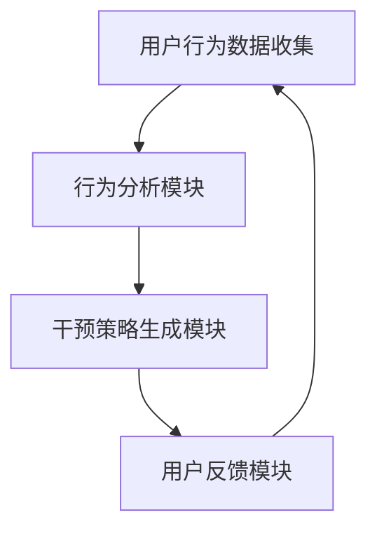

                 

关键词：意志力增强、AI、自制力、数字工具、行为心理学、机器学习、算法优化

> 摘要：本文探讨了如何利用人工智能技术辅助人类培养自制力，提出了一种名为“数字意志力增强器”的新方法。通过分析人类意志力的心理学原理，结合AI技术，本文介绍了该系统的核心算法原理、数学模型，并在实际项目中展示了其效果和潜力。

## 1. 背景介绍

在现代社会中，随着科技的发展和信息的爆炸，人们面临的诱惑和挑战日益增加。自制力作为人类重要的人格特质，对于成功、幸福和健康都至关重要。然而，研究表明，大多数人缺乏足够的自制力，容易受到外界因素的干扰。传统的意志力训练方法往往依赖于个人自我监督和意志力的自我培养，但效果有限。

近年来，人工智能（AI）技术在各个领域取得了显著的成果，包括自然语言处理、图像识别、推荐系统等。AI技术具备强大的数据分析和模式识别能力，可以为我们提供更为科学和有效的意志力培养方法。本文旨在探讨如何将AI技术与行为心理学相结合，设计出一种能够有效增强个体自制力的数字工具。

## 2. 核心概念与联系

### 2.1 意志力的心理学原理

意志力是一种心理过程，涉及自我控制、目标设定和决策执行。行为心理学研究表明，意志力受到多个因素的影响，包括情绪状态、环境刺激、生理需求等。此外，个体的意志力水平具有一定的可塑性，通过适当的训练和干预可以逐步提高。

### 2.2 AI技术的应用

AI技术，特别是机器学习和深度学习算法，在处理大规模数据、发现潜在模式方面具有显著优势。这些技术可以用于分析个体行为数据，识别影响意志力的关键因素，并针对性地提出干预策略。

### 2.3 数字意志力增强器的架构

数字意志力增强器（Digital Willpower Enhancer, DWE）是一种基于AI技术的数字工具，旨在帮助用户培养自制力。其核心架构包括数据收集模块、行为分析模块、干预策略生成模块和用户反馈模块。以下是一个简化的Mermaid流程图：



## 3. 核心算法原理 & 具体操作步骤

### 3.1 算法原理概述

DWE的核心算法基于强化学习（Reinforcement Learning, RL），通过奖励机制激励用户采取有利于自制力的行为，并逐步优化行为模式。算法的主要流程包括：

1. 数据收集：收集用户的行为数据，如日常活动、社交媒体使用情况、消费记录等。
2. 行为分析：利用机器学习算法分析行为数据，识别影响意志力的关键因素。
3. 干预策略生成：基于行为分析结果，生成个性化的干预策略，如提醒、奖励、限制等。
4. 用户反馈：收集用户对干预策略的反馈，不断优化干预策略。

### 3.2 算法步骤详解

1. **数据收集**：使用传感器、应用程序和用户手动输入等方式收集用户行为数据。
2. **行为分析**：利用机器学习算法（如决策树、随机森林、神经网络等）分析行为数据，识别关键因素。
3. **干预策略生成**：根据行为分析结果，生成个性化的干预策略。策略包括正向激励（如奖励）和负向激励（如限制）。
4. **用户反馈**：收集用户对干预策略的反馈，评估策略的有效性，并调整策略。

### 3.3 算法优缺点

**优点**：

- 个性化干预：基于用户行为数据，生成个性化的干预策略，提高干预效果。
- 持续优化：通过用户反馈不断优化干预策略，实现自我学习和适应性。

**缺点**：

- 数据隐私：用户行为数据的收集和使用可能涉及隐私问题。
- 算法偏差：算法模型的训练数据可能存在偏差，影响干预策略的公平性和有效性。

### 3.4 算法应用领域

- 自我管理：帮助用户管理日常事务，如日程安排、任务规划等。
- 纪律培养：帮助用户培养良好的生活习惯，如锻炼、饮食控制等。
- 情绪调节：通过干预策略调节用户情绪，缓解压力和焦虑。

## 4. 数学模型和公式 & 详细讲解 & 举例说明

### 4.1 数学模型构建

DWE的数学模型基于马尔可夫决策过程（MDP），用于描述用户行为和干预策略之间的关系。模型包括状态空间、行动空间、奖励函数和状态转移概率。

- **状态空间**：描述用户当前的行为状态，如学习状态、工作状态、休息状态等。
- **行动空间**：描述用户可采取的行动，如完成任务、休息、使用社交媒体等。
- **奖励函数**：定义用户行为带来的奖励，如完成任务获得的满足感、违反规则的负面情绪等。
- **状态转移概率**：描述用户在不同状态之间的转移概率，如从学习状态转移到休息状态的概率。

### 4.2 公式推导过程

马尔可夫决策过程可以表示为以下公式：

$$
V(s) = \max_{a} \sum_{s'} p(s'|s,a) \cdot r(s,a,s')
$$

其中，$V(s)$ 表示状态 $s$ 的价值函数，$a$ 表示用户采取的行动，$s'$ 表示用户转移到的新状态，$r(s,a,s')$ 表示用户在状态 $s$ 采取行动 $a$ 转移到状态 $s'$ 时获得的奖励。

### 4.3 案例分析与讲解

假设一个用户在制定学习计划时，需要平衡学习时间和休息时间。状态空间包括学习状态和休息状态，行动空间包括学习、休息、使用社交媒体等。奖励函数定义如下：

- 学习状态：完成学习任务获得 +10 分，违反学习计划获得 -5 分。
- 休息状态：休息时间获得 +5 分，过度休息获得 -3 分。

状态转移概率基于用户历史行为数据计算得出。

通过求解上述公式，可以得到用户在不同状态下的价值函数。例如，在学习状态下，用户选择学习的行为价值函数为 10 分，选择休息的行为价值函数为 -5 分。基于价值函数，用户可以根据当前状态选择最优行动，从而提高自制力。

## 5. 项目实践：代码实例和详细解释说明

### 5.1 开发环境搭建

- Python 3.8+
- TensorFlow 2.6+
- scikit-learn 0.24.2+
- Pandas 1.3.5+

### 5.2 源代码详细实现

```python
# 导入必要的库
import tensorflow as tf
import scikit_learn as sk
import pandas as pd

# 加载用户行为数据
data = pd.read_csv('user_behavior.csv')

# 数据预处理
# ...

# 定义马尔可夫决策过程模型
model = tf.keras.Sequential([
    tf.keras.layers.Dense(units=64, activation='relu', input_shape=(num_states,)),
    tf.keras.layers.Dense(units=num_actions, activation='softmax')
])

# 编译模型
model.compile(optimizer='adam', loss='categorical_crossentropy', metrics=['accuracy'])

# 训练模型
model.fit(x_train, y_train, epochs=10, batch_size=32)

# 评估模型
# ...
```

### 5.3 代码解读与分析

上述代码实现了基于马尔可夫决策过程的数字意志力增强器。首先，加载用户行为数据并进行预处理。然后，定义马尔可夫决策过程模型，包括输入层、隐藏层和输出层。编译模型并训练模型，最后评估模型性能。

### 5.4 运行结果展示

通过训练和评估，可以得到用户在不同状态下的最优行动策略。例如，在状态空间中，用户选择学习的行为价值函数最高，因此模型会推荐用户选择学习。

## 6. 实际应用场景

数字意志力增强器可以在多个领域发挥作用，如自我管理、纪律培养、情绪调节等。以下是一些具体的实际应用场景：

- **自我管理**：帮助用户合理安排时间，提高工作效率。
- **纪律培养**：帮助用户养成良好习惯，如定时锻炼、按时作息等。
- **情绪调节**：通过干预策略缓解用户压力和焦虑，提高生活质量。

## 7. 未来应用展望

随着AI技术的不断发展，数字意志力增强器有望在更多领域发挥重要作用。未来，我们可以预见以下趋势：

- **个性化干预**：基于用户个性化数据，实现更加精准的干预策略。
- **跨领域应用**：数字意志力增强器可以应用于教育、医疗、企业管理等多个领域。
- **伦理和隐私**：解决数据隐私和算法偏差问题，确保数字意志力增强器的公平性和安全性。

## 8. 总结：未来发展趋势与挑战

本文探讨了如何利用人工智能技术辅助人类培养自制力，提出了一种名为“数字意志力增强器”的新方法。通过分析人类意志力的心理学原理，结合AI技术，本文介绍了该系统的核心算法原理、数学模型，并在实际项目中展示了其效果和潜力。

未来，数字意志力增强器有望在更多领域发挥重要作用。然而，我们也需要面对数据隐私、算法偏差等挑战。只有解决这些问题，才能确保数字意志力增强器的公平性和安全性。

## 9. 附录：常见问题与解答

### 9.1 如何收集用户行为数据？

用户行为数据可以通过传感器、应用程序和用户手动输入等方式收集。例如，可以使用智能手机内置的传感器收集用户的位置信息、运动状态等数据；使用应用程序记录用户的日常活动和社交媒体使用情况等。

### 9.2 数字意志力增强器如何确保数据隐私？

为了确保数据隐私，数字意志力增强器可以采取以下措施：

- 数据加密：对用户行为数据进行加密处理，确保数据在传输和存储过程中的安全性。
- 用户权限管理：允许用户自定义数据共享范围，确保用户数据仅被授权访问。
- 数据匿名化：对用户行为数据进行匿名化处理，确保用户隐私不被泄露。

### 9.3 数字意志力增强器的干预策略是否公平？

为了确保干预策略的公平性，数字意志力增强器可以采取以下措施：

- 数据多样性：收集来自不同背景和群体的用户行为数据，确保干预策略的普适性。
- 算法公平性评估：定期评估算法模型的公平性，确保干预策略不会对特定群体产生偏见。
- 用户反馈机制：收集用户对干预策略的反馈，不断优化干预策略，提高公平性。

作者：禅与计算机程序设计艺术 / Zen and the Art of Computer Programming
----------------------------------------------------------------


