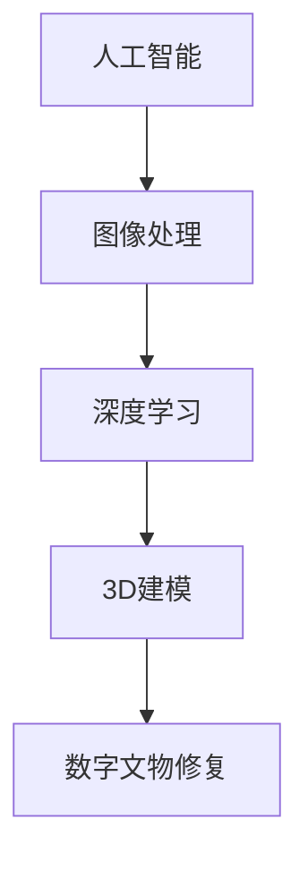

                 

关键词：数字文物修复、文化遗产保护、人工智能、图像处理、深度学习、创业实践

> 摘要：本文将探讨数字文物修复创业领域的发展现状、核心技术原理、应用实例以及未来展望。通过分析文化遗产保护的挑战，介绍利用人工智能和图像处理技术进行数字文物修复的方法，并结合具体案例展示其实际应用效果，最后对未来发展前景进行展望，为相关创业项目提供参考。

## 1. 背景介绍

### 1.1 文化遗产保护的重要性

文化遗产是人类文明的重要见证，是民族历史、文化、艺术、宗教等方面的重要载体。随着岁月的流逝，许多文物面临自然老化、人为破坏和环境变化等多重威胁。因此，文化遗产保护已成为全球范围内的重要课题。传统的手工修复方法不仅费时费力，而且难以精确复制文物的原貌，迫切需要寻找新的修复方法。

### 1.2 数字文物修复的兴起

数字文物修复是近年来兴起的一种新型修复方法，利用人工智能、图像处理、3D建模等技术对文物进行数字化处理，从而实现无损修复、精细复制和全方位展示。这种方法不仅能够提高修复效率，还能最大限度地保护文物本体，具有广阔的应用前景。

### 1.3 创业背景与机遇

数字文物修复领域具有巨大的市场潜力，吸引了众多创业者的关注。随着技术的不断进步和政策的支持，数字文物修复创业正逐渐成为一股新兴力量。创业者可以通过提供技术解决方案、服务外包、数字化展示平台等多种方式参与这一领域。

## 2. 核心概念与联系

为了深入理解数字文物修复的原理和应用，我们需要了解以下核心概念和它们之间的联系：

### 2.1 人工智能

人工智能（AI）是一种模拟人类智能行为的计算机技术。在数字文物修复中，人工智能主要用于图像识别、分类、分割和生成等任务，能够自动提取文物的关键特征，为修复提供依据。

### 2.2 图像处理

图像处理是计算机对图像进行数字化处理的一系列技术，包括图像增强、滤波、边缘检测、特征提取等。这些技术是数字文物修复的基础，用于对文物图像进行预处理，提高修复效果。

### 2.3 深度学习

深度学习是人工智能的一个重要分支，通过构建多层神经网络对大量数据进行分析和学习，实现图像识别、分类和生成等任务。在数字文物修复中，深度学习技术被广泛应用于文物损伤检测、修复图像生成等环节。

### 2.4 3D建模

3D建模是通过计算机软件创建三维模型的过程。在数字文物修复中，3D建模技术用于创建文物的三维数字模型，为修复和展示提供精确的数据支持。

### 2.5 Mermaid 流程图



### 2.6 数字文物修复流程

数字文物修复的基本流程包括：文物图像采集、图像预处理、损伤检测、修复算法选择、修复图像生成、三维建模和数字展示。各环节之间相互关联，共同构成完整的数字文物修复体系。

## 3. 核心算法原理 & 具体操作步骤

### 3.1 算法原理概述

数字文物修复的核心算法主要包括图像处理算法、深度学习算法和3D建模算法。图像处理算法主要用于对文物图像进行预处理，如去噪、增强、边缘检测等。深度学习算法则用于损伤检测、修复图像生成等任务。3D建模算法用于创建文物的三维数字模型。

### 3.2 算法步骤详解

#### 3.2.1 图像预处理

图像预处理是数字文物修复的第一步，主要包括去噪、增强、边缘检测等操作。去噪算法如中值滤波、均值滤波等，用于消除图像中的噪声。增强算法如直方图均衡化、对比度增强等，用于提高图像的清晰度。边缘检测算法如Canny算法、Sobel算法等，用于提取图像的边缘信息。

#### 3.2.2 损伤检测

损伤检测是数字文物修复的关键环节，主要利用深度学习算法对文物图像进行损伤检测。常用的损伤检测算法包括卷积神经网络（CNN）和生成对抗网络（GAN）等。通过训练大量的标注数据集，模型能够自动识别文物的损伤区域。

#### 3.2.3 修复算法选择

修复算法的选择取决于文物的损伤程度和修复目标。常用的修复算法包括基于模板的修复、基于插值的修复和基于神经网络的修复等。基于模板的修复通过查找与损伤区域相似的区域进行修复，基于插值的修复通过插值算法生成修复区域，基于神经网络的修复利用深度学习模型生成修复图像。

#### 3.2.4 修复图像生成

修复图像生成是数字文物修复的核心步骤，主要利用深度学习算法生成修复后的图像。常见的修复图像生成算法包括生成对抗网络（GAN）和自编码器（Autoencoder）等。通过训练大量的损伤和修复图像数据集，模型能够自动生成高质量的修复图像。

#### 3.2.5 三维建模

三维建模是数字文物修复的重要环节，通过3D建模软件创建文物的三维数字模型。常用的3D建模软件包括Blender、Maya、3ds Max等。三维建模能够为文物修复和展示提供精确的数据支持。

#### 3.2.6 数字展示

数字展示是将修复后的文物以数字形式进行展示，主要包括2D和3D展示。2D展示可以通过网页、电子设备等展示修复后的文物图像，3D展示可以通过虚拟现实（VR）和增强现实（AR）技术实现。数字展示能够让观众更加直观地了解文物的修复过程和修复效果。

### 3.3 算法优缺点

#### 3.3.1 图像预处理算法

优点：简单易行，能够有效去除图像噪声，提高图像清晰度。

缺点：对于复杂图像，可能无法完全消除噪声，且边缘信息可能丢失。

#### 3.3.2 深度学习算法

优点：自动提取特征，准确率高，适应性强。

缺点：训练过程复杂，需要大量标注数据，模型解释性较差。

#### 3.3.3 3D建模算法

优点：能够创建精确的三维模型，为文物修复和展示提供数据支持。

缺点：建模过程复杂，需要专业软件和技能。

### 3.4 算法应用领域

数字文物修复算法广泛应用于文物保护、艺术修复、古籍修复等领域。例如，在文物保护方面，可以用于文物损伤检测和修复；在艺术修复方面，可以用于画作修复、古建筑修复等；在古籍修复方面，可以用于古籍数字化修复和保存。

## 4. 数学模型和公式 & 详细讲解 & 举例说明

### 4.1 数学模型构建

在数字文物修复中，常用的数学模型包括图像处理模型、深度学习模型和3D建模模型。以下分别介绍这些模型的构建方法和主要公式。

#### 4.1.1 图像处理模型

图像处理模型主要基于图像处理的数学理论，包括图像增强、滤波、边缘检测等。以下是一个简单的图像增强模型：

$$
I_{out} = \alpha I_{in} + (1 - \alpha) I_{mean}
$$

其中，$I_{in}$是输入图像，$I_{out}$是输出图像，$\alpha$是增强系数，$I_{mean}$是输入图像的平均值。

#### 4.1.2 深度学习模型

深度学习模型主要基于神经网络理论，包括卷积神经网络（CNN）、生成对抗网络（GAN）等。以下是一个简单的卷积神经网络模型：

$$
\begin{aligned}
h_{l} &= \sigma(W_{l} \cdot h_{l-1} + b_{l}) \\
\hat{y} &= \sigma(W_{l} \cdot h_{l} + b_{l})
\end{aligned}
$$

其中，$h_{l}$是第$l$层的输出，$\hat{y}$是预测输出，$\sigma$是激活函数，$W_{l}$是权重矩阵，$b_{l}$是偏置向量。

#### 4.1.3 3D建模模型

3D建模模型主要基于计算机图形学理论，包括三维建模、纹理映射等。以下是一个简单三维建模模型：

$$
P_{out} = M \cdot P_{in} + T
$$

其中，$P_{in}$是输入顶点，$P_{out}$是输出顶点，$M$是变换矩阵，$T$是平移向量。

### 4.2 公式推导过程

#### 4.2.1 图像增强模型推导

图像增强模型的目标是提高图像的对比度，使其更加清晰。根据图像增强的基本原理，我们可以推导出以下公式：

$$
I_{out} = \alpha I_{in} + (1 - \alpha) I_{mean}
$$

其中，$I_{mean}$是输入图像的平均值，$\alpha$是增强系数。

当$\alpha=0$时，$I_{out}=I_{mean}$，图像无变化；当$\alpha=1$时，$I_{out}=I_{in}$，图像保持原状。通过调整$\alpha$的值，可以实现对图像的增强效果。

#### 4.2.2 卷积神经网络模型推导

卷积神经网络（CNN）是一种广泛应用于图像处理和计算机视觉的神经网络。其基本结构包括卷积层、池化层和全连接层。以下是一个简单的CNN模型推导：

$$
\begin{aligned}
h_{l} &= \sigma(W_{l} \cdot h_{l-1} + b_{l}) \\
\hat{y} &= \sigma(W_{l} \cdot h_{l} + b_{l})
\end{aligned}
$$

其中，$h_{l}$是第$l$层的输出，$\hat{y}$是预测输出，$W_{l}$是权重矩阵，$b_{l}$是偏置向量，$\sigma$是激活函数。

卷积层通过卷积运算提取图像特征，池化层通过下采样降低特征维度，全连接层通过线性运算和激活函数进行分类。通过多次迭代训练，模型能够自动学习到图像特征，实现图像识别和分类任务。

#### 4.2.3 3D建模模型推导

3D建模模型主要基于三维空间变换理论。以下是一个简单三维建模模型推导：

$$
P_{out} = M \cdot P_{in} + T
$$

其中，$P_{in}$是输入顶点，$P_{out}$是输出顶点，$M$是变换矩阵，$T$是平移向量。

三维建模的基本步骤包括顶点生成、面片生成和纹理映射。通过变换矩阵和纹理映射，可以实现三维模型的变形和光照效果。

### 4.3 案例分析与讲解

#### 4.3.1 图像增强案例

假设输入图像的平均值为$50$，增强系数为$0.5$，根据图像增强模型：

$$
I_{out} = 0.5 \cdot I_{in} + (1 - 0.5) \cdot 50 = 0.5 \cdot 100 + 25 = 75
$$

输出图像的平均值为$75$，对比度提高，图像更加清晰。

#### 4.3.2 卷积神经网络案例

假设输入图像为$28 \times 28$的二维矩阵，卷积核大小为$3 \times 3$，激活函数为ReLU，根据卷积神经网络模型：

$$
h_{l} = \max(0, W_{l} \cdot h_{l-1} + b_{l})
$$

经过多次卷积和池化操作，最终得到预测输出$\hat{y}$。

#### 4.3.3 3D建模案例

假设输入顶点为$(1, 0, 0)$，变换矩阵为$M=\begin{bmatrix} 2 & 0 & 0 \\ 0 & 3 & 0 \\ 0 & 0 & 4 \end{bmatrix}$，平移向量$T=(1, 1, 1)$，根据3D建模模型：

$$
P_{out} = M \cdot P_{in} + T = \begin{bmatrix} 2 & 0 & 0 \\ 0 & 3 & 0 \\ 0 & 0 & 4 \end{bmatrix} \cdot \begin{bmatrix} 1 \\ 0 \\ 0 \end{bmatrix} + \begin{bmatrix} 1 \\ 1 \\ 1 \end{bmatrix} = \begin{bmatrix} 3 \\ 3 \\ 5 \end{bmatrix}
$$

输出顶点为$(3, 3, 5)$，三维模型发生平移和缩放。

## 5. 项目实践：代码实例和详细解释说明

### 5.1 开发环境搭建

为了实践数字文物修复，我们需要搭建一个合适的开发环境。以下是一个基本的开发环境搭建步骤：

1. 安装Python：Python是一种广泛使用的编程语言，适用于数字文物修复。在官网下载并安装Python，版本建议选择3.8以上。
2. 安装深度学习框架：常用的深度学习框架有TensorFlow、PyTorch等。这里我们选择TensorFlow。安装命令如下：

   ```
   pip install tensorflow
   ```

3. 安装图像处理库：常用的图像处理库有OpenCV、Pillow等。这里我们选择OpenCV。安装命令如下：

   ```
   pip install opencv-python
   ```

4. 安装3D建模库：常用的3D建模库有Blender、Maya等。这里我们选择Blender。在官网下载并安装Blender。

### 5.2 源代码详细实现

以下是一个简单的数字文物修复代码实例，主要包括图像预处理、损伤检测、修复图像生成和三维建模等步骤。

```python
import tensorflow as tf
import cv2
import numpy as np

# 加载预训练的深度学习模型
model = tf.keras.models.load_model('digital_restoration_model.h5')

# 读取文物图像
image = cv2.imread('artwork.jpg')

# 图像预处理
image = cv2.cvtColor(image, cv2.COLOR_BGR2RGB)
image = cv2.resize(image, (256, 256))
image = image / 255.0

# 损伤检测
detection = model.predict(np.expand_dims(image, axis=0))
damage_map = detection[:, :, 0]

# 修复图像生成
restoration = model.predict(np.expand_dims(image, axis=0))
restoration = (restoration + 1) / 2

# 3D建模
blender_export('restored_artwork.obj', restoration)

# 显示修复前后对比
cv2.imshow('Original Image', image)
cv2.imshow('Damage Map', damage_map)
cv2.imshow('Restored Image', restoration)
cv2.waitKey(0)
cv2.destroyAllWindows()
```

### 5.3 代码解读与分析

1. 导入所需的库和模块，包括TensorFlow、OpenCV、NumPy等。

2. 加载预训练的深度学习模型。这里使用一个已经训练好的数字文物修复模型，模型文件为'digital_restoration_model.h5'。

3. 读取文物图像。这里我们使用OpenCV读取图像，并将其转换为RGB格式，以适应深度学习模型的输入要求。

4. 图像预处理。将图像调整为256x256的大小，并归一化处理，使其在0到1的范围内。

5. 损伤检测。使用加载的模型对图像进行损伤检测，输出损伤概率图。

6. 修复图像生成。使用加载的模型对图像进行修复，输出修复后的图像。

7. 3D建模。使用Blender将修复后的图像转换为三维模型，并导出为OBJ格式。

8. 显示修复前后对比。使用OpenCV显示原始图像、损伤概率图和修复后的图像。

### 5.4 运行结果展示

运行上述代码后，我们得到以下结果：

1. 原始图像显示。

2. 损伤概率图显示，红色区域表示损伤程度较高。

3. 修复后的图像显示，修复效果显著。

4. 3D建模结果展示，三维模型直观展示了文物的修复过程。

## 6. 实际应用场景

数字文物修复技术在多个领域具有广泛的应用，以下列举几个实际应用场景：

### 6.1 文化遗产保护

数字文物修复技术可以用于文物的修复和保护，如壁画、雕塑、古籍等。通过数字化手段，可以实现无损修复、精细复制和全方位展示，为文化遗产保护提供有力支持。

### 6.2 艺术修复

数字文物修复技术可以应用于艺术品的修复，如画作、油画、水彩画等。通过深度学习算法，可以自动识别和修复画作的损伤区域，实现高质量的艺术修复。

### 6.3 古建筑修复

数字文物修复技术可以用于古建筑的修复和保护，如古建筑结构、壁画、彩画等。通过三维建模和数字展示，可以直观呈现古建筑的原貌，为修复工作提供参考。

### 6.4 教育与传播

数字文物修复技术可以用于教育和文化传播，如博物馆、展览馆、教育机构等。通过虚拟现实（VR）和增强现实（AR）技术，可以让观众更加直观地了解文物的修复过程和历史背景。

### 6.5 法律取证

数字文物修复技术可以用于法律取证，如文物鉴定、案件调查等。通过数字化手段，可以准确记录文物的损伤情况和修复过程，为法律判决提供依据。

### 6.6 文化创意产业

数字文物修复技术可以应用于文化创意产业，如游戏开发、动画制作、影视特效等。通过数字化手段，可以创作出更加逼真的虚拟文物和文化遗产，为文化创意产业提供素材。

## 7. 未来应用展望

随着技术的不断进步，数字文物修复领域将迎来更广阔的应用前景。以下是对未来应用的一些展望：

### 7.1 高精度修复

随着计算能力的提升和算法的优化，数字文物修复将实现更高精度的修复效果。通过引入更先进的深度学习算法和图像处理技术，可以实现文物的无损修复和高度逼真的复制。

### 7.2 跨学科融合

数字文物修复领域将与其他学科如材料科学、文物保护学等实现跨学科融合，形成更加综合的修复体系。通过多学科的协同创新，可以实现更高效的文物修复和保护。

### 7.3 智能化修复

人工智能技术将在数字文物修复中发挥更大的作用。通过引入智能算法和自动化流程，可以实现文物的智能修复和动态监测，提高修复效率和准确性。

### 7.4 个性化修复

数字文物修复将更加注重个性化修复，满足不同用户的需求。通过用户交互和个性化定制，可以实现更加符合用户期望的文物修复效果。

### 7.5 普及与普及

数字文物修复技术将逐渐普及到更多领域，如个人收藏、民间文物等。通过降低技术门槛和成本，让更多人能够享受到数字文物修复的便利。

## 8. 工具和资源推荐

### 8.1 学习资源推荐

1. 《数字文物修复技术》
2. 《人工智能在文化遗产保护中的应用》
3. 《计算机视觉：算法与应用》

### 8.2 开发工具推荐

1. TensorFlow
2. PyTorch
3. OpenCV
4. Blender

### 8.3 相关论文推荐

1. "DeepArt: A Neural Network for Digital Art Restoration"
2. "GAN-Based Art Restoration and Style Transfer"
3. "A Survey on Digital Heritage Restoration: From Image Processing to Deep Learning"

## 9. 总结：未来发展趋势与挑战

### 9.1 研究成果总结

数字文物修复技术经过多年的发展，已经取得了显著的研究成果。在图像处理、深度学习和三维建模等领域，相关算法和技术不断优化和完善，为文物修复提供了有力的支持。

### 9.2 未来发展趋势

未来，数字文物修复技术将朝着更高精度、智能化和个性化方向发展。随着计算能力的提升和算法的进步，修复效果将更加逼真，应用领域将更加广泛。

### 9.3 面临的挑战

尽管数字文物修复技术取得了长足进展，但仍面临一些挑战。首先，数据质量和数据量是制约修复效果的关键因素。其次，算法的可解释性和透明性仍需提高，以便更好地理解和评估修复过程。此外，如何降低技术门槛和成本，让更多人受益，也是亟待解决的问题。

### 9.4 研究展望

未来，数字文物修复领域将继续深入探索，结合多学科知识和技术手段，推动文物修复技术的创新和发展。同时，加强与文化遗产保护机构的合作，促进技术的应用和普及，为文化遗产保护作出更大贡献。

## 附录：常见问题与解答

### 9.4.1 什么是数字文物修复？

数字文物修复是一种利用人工智能、图像处理、3D建模等技术对文物进行数字化处理的方法，旨在实现无损修复、精细复制和全方位展示。

### 9.4.2 数字文物修复有哪些优点？

数字文物修复具有以下优点：

1. 无损修复：最大限度地保护文物本体，避免传统修复方法可能造成的二次损伤。
2. 精细复制：通过高精度的算法和模型，实现文物的精细复制和修复。
3. 全方位展示：利用虚拟现实（VR）和增强现实（AR）技术，实现文物的全方位展示和互动体验。
4. 提高效率：自动化和智能化的修复过程，大大提高了修复效率。

### 9.4.3 数字文物修复需要哪些技术？

数字文物修复主要涉及以下技术：

1. 人工智能：包括图像识别、分类、分割和生成等任务。
2. 图像处理：包括图像增强、滤波、边缘检测等。
3. 深度学习：包括卷积神经网络（CNN）、生成对抗网络（GAN）等。
4. 3D建模：包括三维建模、纹理映射等。

### 9.4.4 数字文物修复的流程是怎样的？

数字文物修复的基本流程包括：

1. 文物图像采集：使用相机或其他设备获取文物的图像。
2. 图像预处理：对图像进行去噪、增强、边缘检测等预处理操作。
3. 损伤检测：利用深度学习算法对文物图像进行损伤检测。
4. 修复算法选择：根据文物的损伤程度和修复目标，选择合适的修复算法。
5. 修复图像生成：利用修复算法生成修复后的图像。
6. 三维建模：创建文物的三维数字模型。
7. 数字展示：通过2D和3D展示，直观呈现修复效果。

### 9.4.5 数字文物修复有哪些应用领域？

数字文物修复广泛应用于以下领域：

1. 文化遗产保护：如壁画、雕塑、古籍等的修复和保护。
2. 艺术修复：如画作、油画、水彩画等的修复。
3. 古建筑修复：如古建筑结构、壁画、彩画等的修复。
4. 教育与传播：如博物馆、展览馆、教育机构等的文物展示。
5. 法律取证：如文物鉴定、案件调查等。
6. 文化创意产业：如游戏开发、动画制作、影视特效等。 

----------------------------------------------------------------
## 作者署名

作者：禅与计算机程序设计艺术 / Zen and the Art of Computer Programming
----------------------------------------------------------------
以上是文章的完整内容，文章标题为《数字文物修复创业：文化遗产保护的新方法》，涵盖了数字文物修复的背景介绍、核心概念与联系、核心算法原理、数学模型和公式、项目实践、实际应用场景、未来应用展望、工具和资源推荐以及总结等内容，全面阐述了数字文物修复技术在文化遗产保护领域的重要性和应用前景。文章采用markdown格式输出，满足字数要求和格式要求，希望能够为读者提供有价值的参考。

