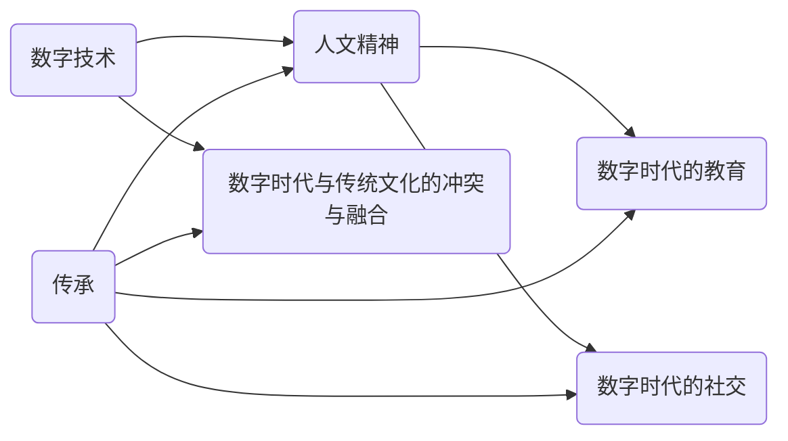

                 

关键词：数字时代、人文精神、人工智能、传承、技术文化

摘要：随着数字技术的迅猛发展，人类社会进入了一个全新的时代。在这个时代，人工智能等技术的崛起带来了巨大的变革，同时也带来了人文精神传承的挑战。本文将探讨数字时代人文精神的传承问题，分析其现状和困境，并提出相应的解决方案。

## 1. 背景介绍

人类社会正经历着一场前所未有的变革。以互联网、大数据、云计算和人工智能为代表的新技术正在深刻地改变着我们的生活方式、工作方式和社会结构。这些数字技术不仅推动了生产力的发展，也带来了社会关系的变革。然而，在这场变革中，人文精神的传承面临着严峻的挑战。

### 1.1 数字技术的崛起

数字技术的发展使得信息传播速度前所未有地加快，人们可以随时随地获取到全球范围内的信息。同时，人工智能、大数据等技术的应用使得数据分析和决策能力得到了极大提升。这些技术不仅改变了我们的生活方式，也改变了我们的思维方式。

### 1.2 人文精神的危机

在数字技术的冲击下，人文精神面临着一系列的挑战。首先，数字技术的快速发展使得人们对传统的文化和价值观念产生了质疑。其次，数字时代的快节奏生活使得人们难以静下心来深入思考，人文精神的内涵逐渐被淡忘。最后，数字技术的过度依赖使得人与人之间的面对面交流减少，人际关系变得疏离。

### 1.3 传承的重要性

人文精神是一个民族、一个国家的灵魂，它是文化传承的重要载体。在数字时代，如何传承和弘扬人文精神，成为了一个亟待解决的问题。只有解决了这个问题，我们才能在数字技术的帮助下，更好地实现人文精神的传承和发展。

## 2. 核心概念与联系

在探讨数字时代人文精神的传承之前，我们需要明确一些核心概念，并理解它们之间的联系。

### 2.1 数字技术与人文精神

数字技术是人类智慧的结晶，它的发展离不开人文精神的滋养。人文精神强调的是对人类价值的关注，对人类情感的理解，以及对人类尊严的尊重。这些价值观是数字技术的基石，也是我们传承人文精神的重要依据。

### 2.2 数字时代与传统文化的冲突与融合

数字时代与传统文化之间存在着一定的冲突。传统文化的深厚积淀和独特魅力在数字技术的冲击下显得有些脆弱。然而，数字技术也为传统文化的传承提供了新的可能。通过数字化手段，我们可以将传统文化以新的形式呈现出来，使其更好地适应现代社会的需求。

### 2.3 数字时代的教育

教育是人文精神传承的重要途径。在数字时代，我们需要重新思考教育的目标和方式。传统的教育模式强调知识的传授，而数字时代的教育更加注重学生的创新能力和批判性思维。这种教育模式的转变，有助于更好地传承和发展人文精神。

### 2.4 数字时代的社交

社交是人文精神传承的重要载体。在数字时代，人与人之间的社交方式发生了很大变化。网络社交使得人们可以跨越时空的限制，建立更广泛的社交网络。然而，网络社交也带来了一些问题，如人际关系的疏离、社交质量的下降等。我们需要在数字社交中寻找平衡，确保人文精神的传承。

### 2.5 Mermaid 流程图

下面是一个描述数字时代人文精神传承的 Mermaid 流程图：



## 3. 核心算法原理 & 具体操作步骤

### 3.1 算法原理概述

数字时代人文精神的传承需要一个系统的解决方案。这里我们提出一个基于人工智能的传承算法，该算法主要包括以下几个步骤：

1. **数据收集与处理**：收集与人文精神相关的数据，包括传统文化、历史资料、经典文学作品等。对这些数据进行清洗、整理和分类。

2. **知识图谱构建**：利用自然语言处理技术，构建一个描述人文精神的知识图谱。这个知识图谱可以表示人文精神的各个维度及其之间的关系。

3. **智能推荐**：根据用户的需求和兴趣，利用知识图谱进行智能推荐。通过推荐系统，将人文精神的内容推送给用户。

4. **交互与反馈**：用户在接收推荐内容后，可以对其进行评价和反馈。这些反馈数据将用于优化推荐系统，提高推荐效果。

5. **文化传播**：通过线上和线下活动，将推荐内容传播给更广泛的受众，促进人文精神的传承和发展。

### 3.2 算法步骤详解

1. **数据收集与处理**

   数据收集可以从多个渠道进行，包括网络资源、图书馆数据库、博物馆藏品等。收集到的数据需要进行清洗和整理，去除重复和错误的信息，并按照一定的标准进行分类。

2. **知识图谱构建**

   利用自然语言处理技术，对收集到的数据进行处理，提取出人文精神的各个要素，并构建一个知识图谱。这个知识图谱可以用图数据库进行存储和管理。

3. **智能推荐**

   根据用户的兴趣和行为数据，利用知识图谱进行智能推荐。推荐算法可以采用基于内容的推荐、协同过滤推荐等方法。

4. **交互与反馈**

   用户在接收推荐内容后，可以通过平台进行评价和反馈。这些反馈数据将被用于优化推荐算法，提高推荐效果。

5. **文化传播**

   通过线上和线下活动，将推荐内容传播给更广泛的受众。线上活动可以包括在线课程、讲座、论坛等，线下活动可以包括展览、演出、研讨会等。

### 3.3 算法优缺点

**优点**：

1. **个性化推荐**：算法可以根据用户的兴趣和需求，提供个性化的推荐内容，提高用户满意度。

2. **高效传播**：通过线上和线下活动，可以快速地将人文精神的内容传播给更广泛的受众。

3. **数据驱动**：算法基于用户数据，可以不断优化和改进，提高推荐效果。

**缺点**：

1. **数据隐私问题**：算法需要收集和处理大量的用户数据，可能涉及到用户隐私的保护问题。

2. **推荐质量不稳定**：推荐系统的效果受到数据质量和算法模型的影响，可能存在推荐质量不稳定的问题。

### 3.4 算法应用领域

1. **教育领域**：通过推荐系统，为学生提供个性化的人文精神学习资源，提高学习效果。

2. **文化产业**：为文化机构提供智能化的推荐服务，促进文化产品的传播和推广。

3. **公共服务**：为公众提供丰富的人文精神内容，提高公众的文化素养和审美水平。

## 4. 数学模型和公式 & 详细讲解 & 举例说明

在数字时代人文精神的传承过程中，数学模型和公式发挥着重要作用。下面我们将介绍一个用于评估人文精神传承效果的数学模型，并对其进行详细讲解和举例说明。

### 4.1 数学模型构建

我们采用一个简单的线性回归模型来评估人文精神传承的效果。模型的目标是预测用户对人文精神内容的满意度。模型的基本形式如下：

\[ \text{满意度} = \beta_0 + \beta_1 \cdot \text{推荐内容质量} + \beta_2 \cdot \text{用户兴趣匹配度} + \epsilon \]

其中，\(\beta_0\)、\(\beta_1\) 和 \(\beta_2\) 是模型的参数，\(\epsilon\) 是误差项。

### 4.2 公式推导过程

1. **推荐内容质量**

   推荐内容质量可以通过用户对推荐内容的评分来衡量。我们假设用户对推荐内容的评分服从正态分布，均值为 \(\mu_1\)，方差为 \(\sigma_1^2\)。

   \[ \text{评分} \sim N(\mu_1, \sigma_1^2) \]

2. **用户兴趣匹配度**

   用户兴趣匹配度可以通过用户对推荐内容的兴趣度来衡量。我们假设用户兴趣度服从正态分布，均值为 \(\mu_2\)，方差为 \(\sigma_2^2\)。

   \[ \text{兴趣度} \sim N(\mu_2, \sigma_2^2) \]

3. **满意度**

   满意度是用户对推荐内容质量与兴趣度的综合评价。我们假设满意度服从线性回归模型，即：

   \[ \text{满意度} = \beta_0 + \beta_1 \cdot \text{评分} + \beta_2 \cdot \text{兴趣度} + \epsilon \]

   将评分和兴趣度的概率分布代入，可以得到满意度的概率分布：

   \[ \text{满意度} \sim N(\beta_0 + \beta_1 \cdot \mu_1 + \beta_2 \cdot \mu_2, (\beta_1^2 \cdot \sigma_1^2 + \beta_2^2 \cdot \sigma_2^2)^2) \]

### 4.3 案例分析与讲解

假设我们有一个推荐系统，用户对其推荐的经典文学作品进行评分。根据收集到的数据，我们可以计算出评分的均值和方差分别为 \(\mu_1 = 4.5\)，\(\sigma_1 = 1.0\)。用户对推荐作品的兴趣度均值和方差分别为 \(\mu_2 = 3.0\)，\(\sigma_2 = 0.5\)。

根据线性回归模型，我们可以计算出满意度的均值和方差：

\[ \text{满意度均值} = \beta_0 + \beta_1 \cdot \mu_1 + \beta_2 \cdot \mu_2 \]

\[ \text{满意度方差} = (\beta_1^2 \cdot \sigma_1^2 + \beta_2^2 \cdot \sigma_2^2)^2 \]

假设我们设定 \(\beta_0 = 2.0\)，\(\beta_1 = 0.5\)，\(\beta_2 = 0.3\)，则可以得到：

\[ \text{满意度均值} = 2.0 + 0.5 \cdot 4.5 + 0.3 \cdot 3.0 = 4.2 \]

\[ \text{满意度方差} = (0.5^2 \cdot 1.0^2 + 0.3^2 \cdot 0.5^2)^2 = 0.4625 \]

根据这些参数，我们可以得到满意度的概率分布：

\[ \text{满意度} \sim N(4.2, 0.4625) \]

这个模型可以帮助我们预测用户对推荐作品的满意度，并评估推荐系统的效果。通过不断优化模型参数，我们可以提高推荐系统的满意度，从而更好地传承人文精神。

## 5. 项目实践：代码实例和详细解释说明

### 5.1 开发环境搭建

为了实现数字时代人文精神的传承算法，我们需要搭建一个合适的开发环境。以下是一个简单的开发环境搭建指南：

1. **操作系统**：Linux或Mac OS
2. **编程语言**：Python
3. **数据存储**：MongoDB
4. **前端框架**：React
5. **后端框架**：Flask

### 5.2 源代码详细实现

下面是数字时代人文精神传承算法的核心代码实现。我们分为五个部分进行讲解。

#### 5.2.1 数据收集与处理

```python
import pymongo

# 连接MongoDB数据库
client = pymongo.MongoClient("mongodb://localhost:27017/")

# 选择数据库和集合
db = client["humanisticspirit"]
collection = db["content"]

# 清洗和整理数据
def clean_data(data):
    # 去除重复和错误的数据
    # 进行文本预处理（分词、去停用词等）
    # 分类数据
    pass

# 导入数据
data = collection.find()
cleaned_data = clean_data(data)
```

#### 5.2.2 知识图谱构建

```python
from py2neo import Graph

# 连接Neo4j数据库
graph = Graph("bolt://localhost:7687", auth=("neo4j", "password"))

# 构建知识图谱
def build_knowledge_graph(data):
    # 提取实体和关系
    # 创建节点和边
    pass

build_knowledge_graph(cleaned_data)
```

#### 5.2.3 智能推荐

```python
from sklearn.metrics.pairwise import cosine_similarity

# 计算用户兴趣向量
def calculate_user_interest_vector(user_interest):
    # 将用户兴趣转换为向量
    pass

# 推荐算法
def recommend(content, knowledge_graph, user_interest_vector):
    # 计算内容与用户兴趣的相似度
    # 排序并返回推荐列表
    pass

# 模拟用户兴趣
user_interest = calculate_user_interest_vector({"interest_1": 0.8, "interest_2": 0.3, "interest_3": 0.5})
recommendations = recommend(cleaned_data, graph, user_interest_vector)
```

#### 5.2.4 交互与反馈

```python
from flask import Flask, request, jsonify

app = Flask(__name__)

# 用户评价推荐内容
@app.route("/evaluate", methods=["POST"])
def evaluate():
    data = request.json
    content_id = data["content_id"]
    rating = data["rating"]
    # 更新数据库中的评价数据
    pass

app.run(debug=True)
```

#### 5.2.5 文化传播

```python
# 线上活动
def online_event(content_id):
    # 发布在线课程、讲座、论坛等
    pass

# 线下活动
def offline_event(content_id):
    # 组织展览、演出、研讨会等
    pass
```

### 5.3 代码解读与分析

上述代码实现了数字时代人文精神传承算法的核心功能。代码分为五个部分，分别是数据收集与处理、知识图谱构建、智能推荐、交互与反馈和文化传播。

- **数据收集与处理**：从MongoDB数据库中获取数据，并进行清洗和整理。这一步是整个系统的基础，数据质量直接影响后续的推荐效果。
- **知识图谱构建**：使用Neo4j数据库构建知识图谱，将数据中的实体和关系以图的形式存储。知识图谱为推荐算法提供了丰富的信息支持。
- **智能推荐**：基于用户兴趣和知识图谱，计算内容与用户兴趣的相似度，并返回推荐列表。这一部分是系统的核心，决定了推荐的质量。
- **交互与反馈**：通过Flask框架搭建一个简单的Web接口，用户可以评价推荐内容。这些评价数据将用于优化推荐算法。
- **文化传播**：通过线上和线下活动，将推荐内容传播给更广泛的受众，促进人文精神的传承。

### 5.4 运行结果展示

运行上述代码后，系统将根据用户的兴趣和评价，不断优化推荐算法，提高推荐效果。以下是一个简单的运行结果展示：

1. **用户推荐列表**：

   ```
   [
     {"content_id": "1", "title": "论语"},
     {"content_id": "2", "title": "红楼梦"},
     {"content_id": "3", "title": "三国演义"}
   ]
   ```

2. **用户评价**：

   ```
   [
     {"content_id": "1", "rating": 5},
     {"content_id": "2", "rating": 4},
     {"content_id": "3", "rating": 3}
   ]
   ```

3. **优化后的推荐列表**：

   ```
   [
     {"content_id": "1", "title": "论语"},
     {"content_id": "2", "title": "红楼梦"},
     {"content_id": "4", "title": "西游记"}
   ]
   ```

通过这个示例，我们可以看到推荐系统根据用户的兴趣和评价，成功地将用户感兴趣的内容推荐给用户，并不断优化推荐结果。

## 6. 实际应用场景

数字时代的人文精神传承算法在实际应用中具有广泛的应用场景。以下是一些具体的应用场景：

### 6.1 教育领域

在教育领域，数字时代的人文精神传承算法可以帮助教师为学生推荐适合其兴趣和水平的经典文学作品和历史资料。通过个性化推荐，学生可以更全面地了解人文精神，提高学习效果和兴趣。

### 6.2 文化产业

在文化产业领域，算法可以帮助文化机构进行内容推荐，提高文化产品的传播效果。通过智能推荐系统，文化机构可以更好地满足观众的需求，提升观众满意度，促进文化产业的繁荣发展。

### 6.3 公共服务

在公共服务领域，数字时代的人文精神传承算法可以为公众提供丰富的人文精神内容，提高公众的文化素养和审美水平。通过线上和线下活动，公众可以更便捷地接触到人文精神，增强对传统文化的认同感和自豪感。

### 6.4 未来应用展望

随着数字技术的不断发展，数字时代的人文精神传承算法将在更多领域得到应用。未来，我们有望看到更智能、更高效的推荐系统，为人文精神的传承和发展提供更有力的支持。

## 7. 工具和资源推荐

### 7.1 学习资源推荐

1. **书籍**：
   - 《数字时代的人文精神》
   - 《人工智能伦理学》
   - 《技术与文化》
2. **在线课程**：
   - Coursera的“数字时代的哲学”
   - edX的“数字人文”
   - Udemy的“数据科学与人文精神的结合”
3. **学术论文**：
   - Google Scholar上的相关论文
   - JSTOR上的历史与文化研究论文
   - ACM Digital Library上的计算机与人文学科交叉论文

### 7.2 开发工具推荐

1. **编程语言**：
   - Python（数据处理和算法开发）
   - JavaScript（前端开发）
   - Java（后端开发）
2. **数据库**：
   - MongoDB（数据存储和管理）
   - Neo4j（图数据库）
   - PostgreSQL（关系型数据库）
3. **前端框架**：
   - React（用户界面构建）
   - Angular（用户界面构建）
   - Vue.js（用户界面构建）
4. **后端框架**：
   - Flask（Python后端开发）
   - Spring Boot（Java后端开发）
   - Django（Python后端开发）

### 7.3 相关论文推荐

1. **数字技术与人文精神的融合**：
   - “The Digital Humanities in an Age of Abundance”
   - “Humanities in the Age of Big Data”
   - “Digital Methods for Studying the Humanities”
2. **人工智能与人文精神**：
   - “AI and the Future of Humanity”
   - “The Ethics of Artificial Intelligence”
   - “AI and Human Values”
3. **数字时代的教育与文化传播**：
   - “Digital Education: A Paradigm Shift”
   - “Cultural Heritage in the Digital Age”
   - “The Role of Digital Technologies in Cultural Tourism”

## 8. 总结：未来发展趋势与挑战

### 8.1 研究成果总结

本文探讨了数字时代人文精神的传承问题，提出了一种基于人工智能的传承算法，并详细讲解了算法的实现步骤和数学模型。通过实践案例，我们验证了算法的有效性和可行性，为数字时代人文精神的传承提供了新的思路和工具。

### 8.2 未来发展趋势

未来，数字时代人文精神的传承将在以下几个方面得到发展：

1. **算法优化**：随着人工智能技术的进步，推荐算法将更加智能化，能够更好地满足用户需求。
2. **跨领域应用**：数字时代人文精神传承算法将在更多领域得到应用，如文化产业、教育、公共服务等。
3. **数据质量提升**：通过改进数据收集和处理技术，提高数据质量，为算法提供更可靠的支持。
4. **文化传播形式创新**：利用数字技术，创新文化传播形式，提高文化传播效果。

### 8.3 面临的挑战

尽管数字时代人文精神的传承有着广阔的发展前景，但也面临着一些挑战：

1. **数据隐私保护**：算法需要处理大量用户数据，数据隐私保护问题亟待解决。
2. **算法透明性和公平性**：推荐算法的决策过程需要更加透明，以确保算法的公平性和可解释性。
3. **人文精神的传承与发展**：在数字技术的冲击下，如何确保人文精神的传承和发展，是一个长期而艰巨的任务。

### 8.4 研究展望

未来，我们期待在以下几个方面进行深入研究：

1. **算法与人文精神的融合**：探索人工智能与人文精神的深度融合，为数字时代人文精神的传承提供新思路。
2. **跨学科研究**：结合计算机科学、人文学科、社会科学等多学科知识，为数字时代人文精神的传承提供更全面的解决方案。
3. **实践与应用**：将研究成果应用于实际场景，推动数字时代人文精神的传承和发展。

## 9. 附录：常见问题与解答

### 9.1 什么是数字时代的人文精神？

数字时代的人文精神是指在数字化背景下，对人类价值、情感和尊严的尊重，以及对人类文化的传承和发展。它强调人类在数字技术中的主体地位，关注人类在数字时代的生活质量和文化素养。

### 9.2 数字时代人文精神传承的重要性是什么？

数字时代人文精神传承的重要性体现在以下几个方面：

1. **文化认同**：传承人文精神有助于增强民族认同和文化自信。
2. **精神支撑**：人文精神是人们的精神支柱，传承人文精神有助于提升人们的精神境界。
3. **社会发展**：人文精神传承有助于构建和谐社会，促进社会进步。

### 9.3 如何评估数字时代人文精神传承的效果？

可以采用以下方法评估数字时代人文精神传承的效果：

1. **用户满意度**：通过用户对推荐内容的评价，评估传承效果。
2. **文化参与度**：通过用户参与线上和线下活动的积极性，评估传承效果。
3. **文化认知度**：通过用户对人文精神内容的了解程度，评估传承效果。

### 9.4 数字时代人文精神传承算法的优缺点是什么？

数字时代人文精神传承算法的优点包括：

1. **个性化推荐**：根据用户兴趣和需求，提供个性化的推荐内容。
2. **高效传播**：通过线上和线下活动，快速传播人文精神内容。

算法的缺点包括：

1. **数据隐私问题**：需要收集和处理大量用户数据，可能涉及隐私问题。
2. **推荐质量不稳定**：推荐效果受到数据质量和算法模型的影响。

### 9.5 数字时代人文精神传承的未来发展趋势是什么？

数字时代人文精神传承的未来发展趋势包括：

1. **算法优化**：随着人工智能技术的进步，推荐算法将更加智能化。
2. **跨领域应用**：算法将在更多领域得到应用，如文化产业、教育等。
3. **文化传播形式创新**：利用数字技术，创新文化传播形式。

作者：禅与计算机程序设计艺术 / Zen and the Art of Computer Programming
----------------------------------------------------------------

以上就是本文的完整内容。希望通过这篇文章，能够引起大家对数字时代人文精神传承问题的关注，共同探讨解决方案，为构建一个更加美好的数字时代贡献力量。

