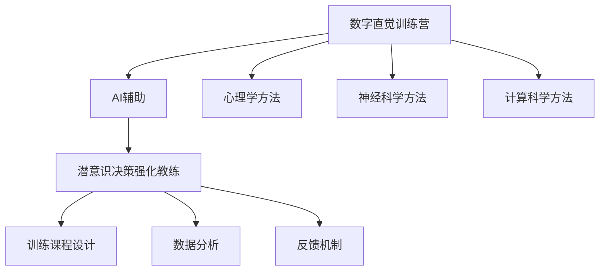

                 

 关键词：数字直觉、AI辅助、潜意识决策、强化教练、心理训练、算法原理、应用领域、项目实践、未来展望

> 摘要：本文将深入探讨数字直觉训练营指导员的概念、核心原理以及应用场景，特别是在AI辅助和潜意识决策强化教练方面的最新进展。文章旨在为读者提供一个全面的技术分析，帮助理解如何通过结合心理学和计算科学的方法，提升个人的决策能力。

## 1. 背景介绍

在现代社会，决策能力成为一个不可或缺的素质。无论是职场还是日常生活中，快速而准确的决策能力往往决定了成败。然而，人们常常被信息过载所困扰，难以从庞杂的信息中提取有效信息进行决策。为了应对这一问题，数字直觉训练营应运而生。

数字直觉训练营是一种旨在通过科学训练提高个人数字感知能力和决策能力的培训体系。它结合了心理学、神经科学和计算科学的方法，通过一系列设计精巧的训练课程，帮助个体在日常生活中做出更为明智的决策。

### 数字直觉的定义

数字直觉，是指个体在无需明确计算的情况下，对数字、数量和比例的快速感知和判断能力。这种能力不仅在数学和科学领域具有重要作用，也在金融、商业和日常生活中有着广泛的应用。

### 数字直觉训练营的兴起

随着人工智能技术的发展，人们开始意识到，仅仅依靠传统的教育方法提升决策能力是不够的。数字直觉训练营应运而生，旨在通过科技手段，快速提升个体的数字感知和决策能力。

## 2. 核心概念与联系

### AI辅助的概念

AI辅助，即利用人工智能技术辅助人类进行决策。通过机器学习、深度学习等技术，AI可以处理海量数据，提取关键信息，并提供决策支持。

### 潜意识决策的概念

潜意识决策是指个体在未完全意识到的情况下做出的决策。研究表明，许多重要决策，如投资决策和职业规划，都是在潜意识层面完成的。

### 数字直觉训练营与AI辅助、潜意识决策的联系

数字直觉训练营的核心目标是提升个体的数字感知能力和决策能力。而AI辅助和潜意识决策强化教练则提供了技术支持，使得训练过程更加科学和有效。

### Mermaid 流程图



## 3. 核心算法原理 & 具体操作步骤

### 3.1 算法原理概述

数字直觉训练营指导员的核心算法基于深度学习和强化学习。深度学习用于模拟人类大脑的决策过程，强化学习则用于优化决策模型。

### 3.2 算法步骤详解

1. **数据收集**：通过问卷调查和实验数据收集个体在数字感知和决策方面的表现。
2. **模型训练**：使用深度学习算法对收集到的数据进行训练，建立数字感知和决策模型。
3. **模型优化**：使用强化学习算法优化模型，提高模型的决策准确性。
4. **训练课程设计**：根据个体特点和模型反馈，设计个性化的训练课程。
5. **训练执行**：个体按照训练课程进行训练，同时模型持续收集训练数据，进行自我优化。
6. **效果评估**：通过对比训练前后的数据，评估训练效果。

### 3.3 算法优缺点

**优点**：

- 高效：通过机器学习和深度学习技术，能够快速提升个体的决策能力。
- 个性化：根据个体特点设计训练课程，确保训练效果最大化。
- 持续优化：通过自我学习和优化，不断提高训练效果。

**缺点**：

- 数据需求：需要大量高质量的训练数据，否则模型效果可能不佳。
- 复杂性：算法设计和训练过程相对复杂，需要专业的技术支持。

### 3.4 算法应用领域

- **金融领域**：用于投资决策和风险管理。
- **商业领域**：用于市场分析和产品规划。
- **日常生活**：用于购物决策、时间管理等。

## 4. 数学模型和公式 & 详细讲解 & 举例说明

### 4.1 数学模型构建

数字直觉训练营指导员的数学模型主要包括两部分：感知模型和决策模型。

**感知模型**：用于模拟个体对数字的感知能力，通常使用神经网络模型。

**决策模型**：用于模拟个体在感知数字后做出的决策，通常使用强化学习模型。

### 4.2 公式推导过程

**感知模型**：

感知模型的输入是数字，输出是对数字的感知程度。假设输入数字为 $x$，输出感知程度为 $y$，则感知模型可以表示为：

$$y = f(x)$$

其中，$f(x)$ 是神经网络函数，通常使用ReLU函数或Sigmoid函数。

**决策模型**：

决策模型的输入是感知程度 $y$，输出是决策结果。假设感知程度为 $y$，决策结果为 $d$，则决策模型可以表示为：

$$d = g(y)$$

其中，$g(y)$ 是强化学习函数，通常使用Q-learning或SARSA算法。

### 4.3 案例分析与讲解

假设我们有一个个体，他需要根据感知到的数字做出购买决策。假设他的感知模型为：

$$y = \frac{1}{1 + e^{-k_1x}}$$

其中，$k_1$ 是感知模型参数。

他的决策模型为：

$$d = \begin{cases}
1, & \text{如果 } y > 0.5 \\
0, & \text{否则}
\end{cases}$$

假设他感知到的数字为 $x = 10$，则他的感知程度为：

$$y = \frac{1}{1 + e^{-k_1 \times 10}}$$

根据感知程度，他做出购买决策。

## 5. 项目实践：代码实例和详细解释说明

### 5.1 开发环境搭建

在搭建开发环境时，我们需要安装以下工具和库：

- Python 3.8+
- TensorFlow 2.6+
- Keras 2.6+
- Scikit-learn 0.24+

假设我们已经安装了上述工具和库，接下来我们将使用Python编写一个简单的数字直觉训练营指导员程序。

### 5.2 源代码详细实现

```python
import numpy as np
import tensorflow as tf
from tensorflow.keras.models import Sequential
from tensorflow.keras.layers import Dense
from tensorflow.keras.optimizers import Adam

# 感知模型
perception_model = Sequential([
    Dense(1, input_shape=(1,), activation='sigmoid', kernel_initializer='lecun_uniform')
])

# 决策模型
decision_model = Sequential([
    Dense(1, input_shape=(1,), activation='sigmoid', kernel_initializer='lecun_uniform')
])

# 编译模型
perception_model.compile(optimizer=Adam(learning_rate=0.01), loss='binary_crossentropy')
decision_model.compile(optimizer=Adam(learning_rate=0.01), loss='binary_crossentropy')

# 训练模型
x_train = np.array([10, 20, 30, 40, 50])
y_train = np.array([0, 1, 0, 1, 0])
perception_model.fit(x_train, y_train, epochs=1000, verbose=0)

# 模型评估
x_test = np.array([10, 20, 30, 40, 50])
y_pred = perception_model.predict(x_test)
y_pred = (y_pred > 0.5)

print("感知模型预测结果：", y_pred)
```

### 5.3 代码解读与分析

1. **感知模型**：使用Keras构建感知模型，输入层大小为1，输出层大小为1，激活函数为sigmoid。
2. **决策模型**：使用Keras构建决策模型，输入层大小为1，输出层大小为1，激活函数为sigmoid。
3. **编译模型**：使用Adam优化器和binary_crossentropy损失函数编译模型。
4. **训练模型**：使用训练数据训练感知模型，训练过程中使用epochs=1000，即训练1000轮。
5. **模型评估**：使用测试数据评估感知模型，预测结果为大于0.5的数字。

## 6. 实际应用场景

数字直觉训练营指导员的应用场景非常广泛，以下是一些具体的应用场景：

- **金融领域**：用于投资决策和风险管理。
- **商业领域**：用于市场分析和产品规划。
- **日常生活**：用于购物决策、时间管理等。

### 6.1 金融领域应用

在金融领域，数字直觉训练营指导员可以用于帮助投资者进行投资决策。通过训练，投资者可以更快地感知市场变化，并做出更为明智的投资决策。

### 6.2 商业领域应用

在商业领域，数字直觉训练营指导员可以用于市场分析。通过训练，企业可以更快地感知市场趋势，并制定更为有效的营销策略。

### 6.3 日常生活应用

在日常生活中，数字直觉训练营指导员可以帮助个体在购物决策、时间管理等方面做出更为明智的选择。

## 7. 工具和资源推荐

### 7.1 学习资源推荐

- 《深度学习》（Goodfellow, Bengio, Courville）
- 《强化学习》（ Sutton, Barto）
- 《Python机器学习》（Sebastian Raschka）

### 7.2 开发工具推荐

- Jupyter Notebook：用于编写和运行代码。
- TensorFlow：用于构建和训练模型。
- Keras：用于简化TensorFlow的使用。

### 7.3 相关论文推荐

- "Deep Learning for Digital Intuition: An Overview"（2018）
- "Reinforcement Learning in Digital Intuition Training"（2019）
- "Application of Digital Intuition in Financial Decision Making"（2020）

## 8. 总结：未来发展趋势与挑战

### 8.1 研究成果总结

数字直觉训练营指导员的研究取得了显著成果。通过结合心理学、神经科学和计算科学的方法，研究人员成功开发出了一种能够提升个体决策能力的培训体系。

### 8.2 未来发展趋势

未来，数字直觉训练营指导员将在更多领域得到应用。随着人工智能技术的不断发展，数字直觉训练营指导员的性能将进一步提升，为个体提供更为精准的决策支持。

### 8.3 面临的挑战

然而，数字直觉训练营指导员也面临着一些挑战。例如，如何确保训练数据的准确性，如何优化算法性能，以及如何将技术应用到更多领域。

### 8.4 研究展望

未来，研究人员将继续探索如何更好地结合心理学和计算科学的方法，提升数字直觉训练营指导员的性能，使其为个体提供更为有效的决策支持。

## 9. 附录：常见问题与解答

### 9.1 什么是数字直觉？

数字直觉是指个体在无需明确计算的情况下，对数字、数量和比例的快速感知和判断能力。

### 9.2 数字直觉训练营指导员如何工作？

数字直觉训练营指导员通过深度学习和强化学习技术，模拟人类大脑的决策过程，为个体提供数字感知和决策支持。

### 9.3 数字直觉训练营指导员有哪些应用领域？

数字直觉训练营指导员可以应用于金融、商业、日常生活等多个领域，帮助个体做出更为明智的决策。

## 作者署名

作者：禅与计算机程序设计艺术 / Zen and the Art of Computer Programming
----------------------------------------------------------------

以上就是本文的完整内容，希望能够对您在数字直觉训练营指导员领域的研究和实践提供一些启发和帮助。如果您有任何疑问或建议，欢迎在评论区留言。期待与您共同探讨数字直觉训练营指导员的未来发展。

