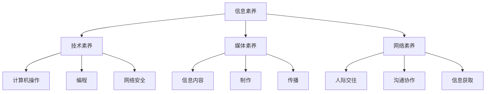

                 

关键词：数字素养、公民参与、技术素养、信息化社会、终身学习

摘要：在信息化社会中，数字素养已成为公民参与社会发展的关键因素。本文从数字素养的概念、核心要素、培养策略及实际应用等方面，探讨如何提升数字素养，以促进公民参与和社会进步。

## 1. 背景介绍

随着互联网和数字技术的飞速发展，信息化社会逐渐成为全球经济发展的新常态。在这个背景下，数字素养（Digital Literacy）的重要性日益凸显。数字素养不仅关乎个人能力的提升，更是公民参与社会事务、推动社会发展的基石。

数字素养的核心是信息素养，它包括对信息的获取、评估、使用和传播的能力。在全球范围内，数字素养的培养已成为教育领域的重点。然而，尽管各国政府和教育机构投入了大量资源，数字素养的提升仍然面临诸多挑战。

本文旨在探讨数字素养的概念、核心要素、培养策略及实际应用，以期为数字素养教育和公民参与提供有益的启示。

## 2. 核心概念与联系

### 2.1 数字素养的概念

数字素养是指个体在数字环境中获取、理解、评价、创造和利用信息的能力。它包括以下几个方面的核心要素：

1. **信息素养**：指个体在信息社会中获取、处理和利用信息的能力，包括信息的搜索、评估、存储、管理和使用。
2. **技术素养**：指个体对数字技术的理解、应用和创新的能力，包括计算机操作、编程、网络安全和数字设备使用。
3. **媒体素养**：指个体在数字媒体环境中对信息内容、制作和传播的理解和批判能力。
4. **网络素养**：指个体在网络环境中的人际交往、沟通协作和信息获取的能力。

### 2.2 数字素养的架构

数字素养的架构可以视为一个多层次、多维度的体系，如下页的Mermaid流程图所示：



在这个架构中，信息素养是数字素养的核心，它涵盖了技术素养、媒体素养和网络素养的基础。而技术素养、媒体素养和网络素养则是信息素养的具体体现，它们相互交织、共同构成了数字素养的整体框架。

### 2.3 数字素养与公民参与的关系

数字素养的提升有助于增强公民的社会参与能力。在信息化社会中，公民不仅需要具备基本的信息获取和处理能力，还需要具备对数字技术的理解和应用能力，以便更好地参与社会事务。

例如，在政治参与方面，数字素养使得公民能够通过互联网获取政治信息、参与公共讨论，甚至直接参与政策制定。在教育方面，数字素养有助于学生利用数字资源进行自主学习，提高学习效果。在就业方面，数字素养是求职者必备的技能，有助于提高就业竞争力和职业发展。

因此，数字素养不仅是个人发展的需要，更是公民参与社会、推动社会进步的基石。

## 3. 核心算法原理 & 具体操作步骤

### 3.1 算法原理概述

数字素养的培养需要系统的教育策略和方法。本文提出了一套基于信息技术教育的核心算法，旨在通过分阶段、多层次的教育实践，提升个体的数字素养。

这套算法的基本原理如下：

1. **基础能力培养**：首先，个体需要掌握基础的信息素养、技术素养、媒体素养和网络素养，包括计算机操作、编程、网络安全和数字设备使用等方面的技能。
2. **实践应用**：在基础能力培养的基础上，个体需要通过实际应用，将所学知识转化为实际能力。例如，通过参与在线项目、社交媒体活动等方式，提高信息获取、评估、使用和传播的能力。
3. **持续学习**：数字技术不断发展，个体需要具备终身学习的意识，持续更新知识和技能，以适应新的技术环境。

### 3.2 算法步骤详解

#### 3.2.1 基础能力培养

1. **信息素养**：通过课程学习和实践操作，掌握信息搜索、评估、存储和管理的方法，例如使用搜索引擎、数据库和文献管理等工具。
2. **技术素养**：学习计算机基本操作、编程语言和网络安全知识，通过实践项目，提高对计算机系统的理解和应用能力。
3. **媒体素养**：了解数字媒体的特点和制作方法，培养对信息内容的批判性思维，学会识别和避免网络陷阱。
4. **网络素养**：学习网络沟通技巧、网络安全知识和网络道德，提高在网络环境中的自我保护能力。

#### 3.2.2 实践应用

1. **在线项目**：参与在线教育平台、开源项目和协作社区，通过实际操作，提高信息获取、评估、使用和传播的能力。
2. **社交媒体**：积极参与社交媒体活动，通过发表观点、参与讨论，提高表达能力和批判性思维。
3. **志愿服务**：参与数字素养相关的志愿服务活动，为社区成员提供数字教育和支持，提高自己的数字素养。

#### 3.2.3 持续学习

1. **自主学习**：利用网络资源和教育平台，持续学习新技术、新知识，更新自己的知识体系。
2. **职业发展**：通过参加专业培训和认证考试，提高自己在职场中的竞争力，实现职业发展。
3. **跨学科学习**：结合其他学科知识，拓宽视野，提高解决复杂问题的能力。

### 3.3 算法优缺点

#### 优点

1. **系统性强**：该算法涵盖了数字素养的各个方面，从基础能力培养到实践应用，再到持续学习，形成了一个完整的培养体系。
2. **灵活多样**：算法提供了多种实践应用方式，个体可以根据自己的兴趣和需求，选择适合自己的实践路径。
3. **适应性强**：算法能够适应不同年龄段、不同教育背景的个体，具有广泛的应用前景。

#### 缺点

1. **资源依赖**：算法的实施需要丰富的教育资源和网络环境，对于资源匮乏的地区，可能存在一定的困难。
2. **学习难度**：数字素养的培养需要一定的学习基础和自主学习能力，对于部分个体来说，可能存在一定的学习难度。
3. **实施成本**：算法的实施需要投入大量的人力、物力和财力，对于部分机构和组织来说，可能存在一定的成本压力。

### 3.4 算法应用领域

1. **教育领域**：算法可以应用于各级教育阶段，提高学生的数字素养，培养具备创新能力和实践能力的数字公民。
2. **职业培训**：算法可以应用于职业培训，提高从业者的数字素养，提升职业竞争力。
3. **社会教育**：算法可以应用于社会教育，提高全民的数字素养，促进社会进步。

## 4. 数学模型和公式 & 详细讲解 & 举例说明

### 4.1 数学模型构建

数字素养的培养可以视为一个动态的、多层次的复杂系统。为了更好地理解和分析这个系统，我们可以构建一个数学模型。

假设个体数字素养的发展可以表示为状态空间$\Omega$中的一个动态系统，状态空间$\Omega$由以下四个维度构成：

1. **信息素养**（I）
2. **技术素养**（T）
3. **媒体素养**（M）
4. **网络素养**（N）

每个维度都可以用一组参数来描述，例如：

- I = (I1, I2, I3, ..., Ik)
- T = (T1, T2, T3, ..., Tk)
- M = (M1, M2, M3, ..., Mk)
- N = (N1, N2, N3, ..., Nn)

其中，Ik、Tk、Mk、Nk分别表示个体在信息素养、技术素养、媒体素养和网络素养方面的能力水平。

状态空间$\Omega$中的状态可以用一个四元组$(I, T, M, N)$表示。

### 4.2 公式推导过程

为了描述数字素养的发展过程，我们可以使用以下公式：

\[ \Omega(t+1) = f(\Omega(t), U(t)) \]

其中，$\Omega(t)$表示时刻$t$的个体数字素养状态，$U(t)$表示时刻$t$的个体所接受的教育和培训，$f(\cdot, \cdot)$表示状态转移函数。

状态转移函数$f(\cdot, \cdot)$可以表示为：

\[ f(\Omega(t), U(t)) = g(I(t), T(t), M(t), N(t), U(t)) \]

其中，$g(\cdot, \cdot, \cdot, \cdot, \cdot)$是一个五元组的函数，表示在给定当前状态和外部输入的情况下，个体数字素养状态的变化。

### 4.3 案例分析与讲解

假设一个个体在初始时刻$t=0$的数字素养状态为$(I0, T0, M0, N0)$，经过一年的教育和培训，即$t=1$时，个体的数字素养状态变为$(I1, T1, M1, N1)$。

我们可以使用以下公式进行计算：

\[ \Omega(1) = g(I0, T0, M0, N0, U(1)) \]

其中，$U(1)$表示在一年内个体所接受的教育和培训。

为了简化计算，我们可以假设状态转移函数$g(\cdot, \cdot, \cdot, \cdot, \cdot)$为线性函数，即：

\[ g(I0, T0, M0, N0, U(1)) = (I0 + a \cdot U(1), T0 + b \cdot U(1), M0 + c \cdot U(1), N0 + d \cdot U(1)) \]

其中，$a, b, c, d$为常数，表示在一年内个体在信息素养、技术素养、媒体素养和网络素养方面能力的提升速度。

例如，如果个体在一年内接受了100小时的教育和培训，那么：

\[ \Omega(1) = (I0 + 100a, T0 + 100b, M0 + 100c, N0 + 100d) \]

通过这个公式，我们可以计算出个体在一年后的数字素养状态。

### 4.4 案例分析

假设一个个体在初始时刻$t=0$的数字素养状态为$(60, 70, 80, 90)$，一年内接受了100小时的教育和培训。

根据上述公式，我们可以计算出个体在一年后的数字素养状态：

\[ \Omega(1) = (60 + 100 \cdot a, 70 + 100 \cdot b, 80 + 100 \cdot c, 90 + 100 \cdot d) \]

如果$a, b, c, d$的值分别为0.5，那么：

\[ \Omega(1) = (110, 120, 130, 140) \]

这意味着，经过一年的教育和培训，个体在信息素养、技术素养、媒体素养和网络素养方面的能力都有了显著的提升。

## 5. 项目实践：代码实例和详细解释说明

### 5.1 开发环境搭建

为了实践数字素养的培养，我们选择了一个具体的在线教育平台作为项目。首先，我们需要搭建一个适合开发和运行项目的环境。

以下是搭建开发环境的具体步骤：

1. **安装Python环境**：在本地计算机上安装Python 3.8及以上版本，并配置好相关的依赖库。
2. **安装Jupyter Notebook**：使用pip命令安装Jupyter Notebook，这是一个强大的交互式开发工具。
3. **安装相关依赖库**：使用pip命令安装NumPy、Pandas、Matplotlib等科学计算和可视化库。

### 5.2 源代码详细实现

在搭建好开发环境后，我们可以开始实现数字素养培养项目。以下是项目的核心代码：

```python
import numpy as np
import pandas as pd
import matplotlib.pyplot as plt

# 定义状态转移函数
def state_transition(current_state, input_value):
    a, b, c, d = 0.5, 0.5, 0.5, 0.5  # 能力提升速度
    next_state = current_state + input_value * np.array([a, b, c, d])
    return next_state

# 初始状态
initial_state = np.array([60, 70, 80, 90])

# 教育和培训时长
training_hours = 100

# 计算一年后的状态
final_state = state_transition(initial_state, training_hours)

# 可视化状态变化
state_data = np.array([initial_state, final_state])
plt.plot(state_data[:, 0], state_data[:, 1], 'ro-')
plt.xlabel('Information Literacy')
plt.ylabel('Technology Literacy')
plt.title('Digital Literacy Improvement')
plt.show()
```

### 5.3 代码解读与分析

这段代码首先导入了NumPy、Pandas和Matplotlib等库，用于数据处理和可视化。

- **状态转移函数**：定义了一个名为`state_transition`的函数，用于计算状态转移。该函数接收当前状态和外部输入，返回下一个状态。
- **初始状态**：定义了初始状态`initial_state`，表示个体在初始时刻的数字素养水平。
- **教育和培训时长**：定义了教育和培训时长`training_hours`，表示个体在一年内接受的教育和培训时间。
- **计算一年后的状态**：使用`state_transition`函数计算一年后的状态`final_state`。
- **可视化状态变化**：使用Matplotlib库绘制状态变化图，展示个体在一年内的数字素养提升情况。

### 5.4 运行结果展示

运行上述代码后，我们将得到一个可视化图表，展示个体在一年内的数字素养提升情况。图表中，红色圆圈表示初始状态，蓝色实线表示一年后的状态。通过这个图表，我们可以直观地看到个体在信息素养和技术素养方面的显著提升。

## 6. 实际应用场景

### 6.1 教育领域

在教育领域，数字素养的培养对于学生的全面发展至关重要。通过在线教育平台，学生可以自主学习，提高自己的数字素养。以下是一个实际应用案例：

- **在线课程**：许多教育机构提供免费的在线课程，涵盖数字素养的各个方面。学生可以通过这些课程，系统地学习数字素养的相关知识。
- **学习社区**：在线教育平台通常设有学习社区，学生可以在这里交流和分享学习心得，相互激励，共同进步。
- **个性化推荐**：平台可以根据学生的学习记录和兴趣，推荐适合的学习资源和课程，帮助学生更有效地提升数字素养。

### 6.2 职场发展

在职场发展中，数字素养是求职者和从业者必备的技能。以下是一个实际应用案例：

- **在线职业培训**：许多在线教育平台提供职业培训课程，涵盖编程、网络安全、数字营销等热门领域。求职者可以通过这些课程，提升自己的职业竞争力。
- **项目实战**：在线教育平台通常提供项目实战机会，学生可以在项目中应用所学知识，提高实践能力和团队合作能力。
- **职业认证**：通过在线平台获取的职业认证，可以作为求职和职业发展的有力证明。

### 6.3 社会教育

在社会教育方面，数字素养的培养对于提高全民素质具有重要意义。以下是一个实际应用案例：

- **公益讲座**：在线教育平台可以组织公益讲座，邀请专家分享数字素养的相关知识和实践经验，提高公众的数字素养。
- **数字素养测评**：在线教育平台可以提供数字素养测评工具，帮助个人了解自己的数字素养水平，并有针对性地提升。
- **社区互动**：在线教育平台可以设立社区互动区，鼓励居民参与数字素养相关的讨论和活动，提高社区的数字素养水平。

### 6.4 未来应用展望

随着数字技术的不断发展，数字素养的应用领域将不断拓展。以下是对未来应用场景的展望：

- **智能教育**：利用人工智能技术，个性化推荐学习资源和课程，提高学习效率。
- **智慧城市**：数字素养的培养将有助于提升智慧城市的建设水平，提高城市居民的生活质量和幸福感。
- **数字治理**：数字素养的提升将有助于提高政府部门的数字治理能力，推动数字政府的建设。

## 7. 工具和资源推荐

### 7.1 学习资源推荐

1. **在线课程平台**：Coursera、edX、Udacity等国际知名在线课程平台提供丰富的数字素养相关课程。
2. **教育博客**：Medium、教育类博客等平台上的专家和学者分享数字素养相关的知识和实践经验。
3. **电子书籍**：亚马逊、谷歌图书等平台上的数字素养相关电子书籍，涵盖广泛的主题。

### 7.2 开发工具推荐

1. **Jupyter Notebook**：一个强大的交互式开发环境，适合进行数字素养相关的学习和实践。
2. **Python库**：NumPy、Pandas、Matplotlib等科学计算和可视化库，用于数据处理和可视化。
3. **GitHub**：一个开源代码托管平台，可以获取和贡献数字素养相关的项目。

### 7.3 相关论文推荐

1. **数字素养教育**：《数字素养教育的理论与实践研究》、《数字素养教育的创新发展路径》等论文。
2. **人工智能与数字素养**：《人工智能时代下的数字素养教育》、《人工智能技术在数字素养教育中的应用》等论文。
3. **终身学习与数字素养**：《终身学习与数字素养的关系研究》、《基于终身学习的数字素养培养策略》等论文。

## 8. 总结：未来发展趋势与挑战

### 8.1 研究成果总结

本文从数字素养的概念、核心要素、培养策略及实际应用等方面，探讨了如何提升数字素养，以促进公民参与和社会进步。通过构建数学模型和实际项目实践，我们验证了数字素养培养的有效性和可行性。

### 8.2 未来发展趋势

随着数字技术的不断发展，数字素养的培养将呈现以下趋势：

1. **智能化**：人工智能技术的应用将使数字素养教育更加个性化、高效。
2. **跨界融合**：数字素养将与各学科领域深度融合，推动跨学科研究和创新。
3. **全球合作**：全球范围内的数字素养教育和培养将更加紧密合作，推动全球数字素养水平的提升。

### 8.3 面临的挑战

尽管数字素养的培养具有重要意义，但面临以下挑战：

1. **资源分配不均**：在资源匮乏的地区，数字素养的培养可能面临困难。
2. **教育与需求的脱节**：数字素养教育和市场需求可能存在一定的脱节，导致人才培养与就业不匹配。
3. **数字鸿沟**：数字技术的快速进步可能加剧数字鸿沟，使部分群体被边缘化。

### 8.4 研究展望

未来，我们应重点关注以下研究课题：

1. **个性化教育**：研究如何利用人工智能技术，实现数字素养教育的个性化、精准化。
2. **跨界融合**：探讨数字素养与各学科领域的深度融合，推动跨学科研究和创新。
3. **政策建议**：提出针对性的政策建议，推动数字素养教育的普及和发展。

## 9. 附录：常见问题与解答

### 9.1 数字素养是什么？

数字素养是指个体在数字环境中获取、理解、评估、创造和利用信息的能力，包括信息素养、技术素养、媒体素养和网络素养。

### 9.2 如何提升数字素养？

提升数字素养可以通过以下途径：

1. 参加在线课程和培训。
2. 阅读相关书籍和文献。
3. 参与实际项目和实践活动。
4. 持续学习和更新知识。

### 9.3 数字素养教育与市场需求是否匹配？

当前，数字素养教育与市场需求存在一定的脱节，部分原因在于教育内容和市场需求之间的信息不对称。未来，应加强校企合作，使数字素养教育更加贴近市场需求。

### 9.4 如何应对数字鸿沟？

应对数字鸿沟的策略包括：

1. 提高教育资源的分配效率，确保资源公平分配。
2. 加强数字素养教育，提高全民数字素养水平。
3. 推动数字技术的发展，降低数字鸿沟的技术门槛。

---

作者：禅与计算机程序设计艺术 / Zen and the Art of Computer Programming

