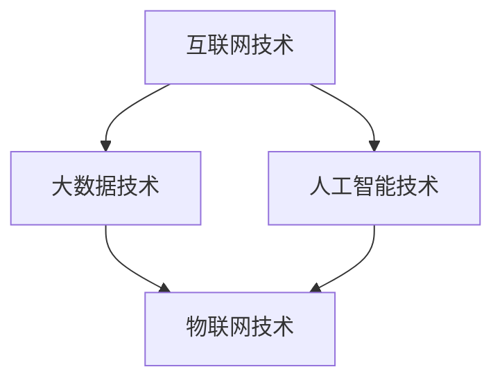

                 

关键词：数字经济，社会发展，创新，技术驱动，未来展望

> 摘要：本文将深入探讨数字经济对社会发展的重要推动作用。通过分析其核心概念、算法原理、数学模型以及实际应用，本文旨在揭示数字经济在现代社会的广泛应用及其对未来发展的深远影响。

## 1. 背景介绍

随着互联网、大数据、人工智能等技术的迅猛发展，数字经济逐渐成为全球经济增长的新引擎。与传统经济模式相比，数字经济具有高效性、透明性和可扩展性的特点，它通过数字化手段对传统产业进行升级改造，推动了社会生产力的提高和经济结构的优化。

数字经济不仅仅是技术的变革，更是社会发展的助推器。它不仅改变了人们的生产方式和生活方式，还深刻影响着社会的各个方面，包括经济、政治、文化等。本文将围绕数字经济的核心概念、算法原理、数学模型以及实际应用展开讨论，以期为大家提供一个全面而深刻的理解。

## 2. 核心概念与联系

### 2.1 数字经济的定义

数字经济，通常指以数字化的信息和知识为关键生产因素，以现代信息网络为重要载体的一种经济活动形态。它涵盖了一系列与数字技术相关的产业，包括电子商务、云计算、物联网、人工智能等。

### 2.2 数字经济与社会的联系

数字经济不仅改变了经济活动的方式，还深刻影响了社会的各个方面。例如：

- **经济方面**：数字经济推动了经济的全球化，降低了交易成本，提高了资源配置的效率。
- **社会方面**：数字经济促进了信息的快速传播，增强了社会互动，提高了社会透明度。
- **文化方面**：数字经济带来了文化的多样性和全球化，改变了人们的文化消费方式。

### 2.3 数字经济的技术架构

数字经济的实现依赖于一系列先进技术的支持，包括：

- **互联网技术**：为数字经济提供了信息传输的基础设施。
- **大数据技术**：为数据分析和决策提供了强大的支持。
- **人工智能技术**：为自动化和智能化提供了技术手段。

#### 图 2.1 数字经济的技术架构



## 3. 核心算法原理 & 具体操作步骤

### 3.1 算法原理概述

数字经济中的核心算法主要包括数据挖掘、机器学习、区块链等。这些算法通过分析大量数据，实现数据的智能处理和决策。

### 3.2 算法步骤详解

#### 3.2.1 数据挖掘

数据挖掘是数字经济的核心，其基本步骤包括：

1. 数据预处理：清洗、整合、转换数据。
2. 特征提取：从原始数据中提取有用的特征。
3. 模型训练：使用机器学习算法训练模型。
4. 模型评估：评估模型的准确性和性能。

#### 3.2.2 机器学习

机器学习是数字经济的重要工具，其基本步骤包括：

1. 数据收集：收集相关的数据集。
2. 数据预处理：清洗、整合、转换数据。
3. 模型选择：选择合适的机器学习模型。
4. 模型训练：训练模型。
5. 模型评估：评估模型性能。

#### 3.2.3 区块链

区块链是数字经济的基础设施，其基本步骤包括：

1. 数据存储：将数据存储在区块链中。
2. 数据验证：通过共识机制验证数据的有效性。
3. 数据传输：在区块链中传输数据。
4. 数据共享：实现数据的透明和可追溯。

### 3.3 算法优缺点

#### 数据挖掘

- 优点：高效、自动化、准确。
- 缺点：数据质量影响结果、隐私问题。

#### 机器学习

- 优点：智能化、自适应。
- 缺点：需要大量数据、模型解释性差。

#### 区块链

- 优点：去中心化、透明、安全。
- 缺点：性能有限、复杂度较高。

### 3.4 算法应用领域

数字经济算法广泛应用于各个领域，包括：

- **金融**：风险管理、信用评估、智能投顾。
- **医疗**：疾病预测、个性化治疗、健康监测。
- **教育**：在线教育、智能评测、个性化教学。
- **交通**：智能交通管理、自动驾驶、物流优化。

## 4. 数学模型和公式 & 详细讲解 & 举例说明

### 4.1 数学模型构建

数字经济的数学模型主要包括线性回归、逻辑回归、支持向量机等。这些模型通过数学公式进行描述，实现对数据的预测和分析。

#### 4.1.1 线性回归模型

线性回归模型的基本公式为：

$$ y = \beta_0 + \beta_1 \cdot x $$

其中，\( y \) 为因变量，\( x \) 为自变量，\( \beta_0 \) 和 \( \beta_1 \) 为模型参数。

#### 4.1.2 逻辑回归模型

逻辑回归模型的基本公式为：

$$ P(y=1) = \frac{1}{1 + e^{-(\beta_0 + \beta_1 \cdot x)}} $$

其中，\( P(y=1) \) 为因变量为 1 的概率，其他参数含义与线性回归相同。

#### 4.1.3 支持向量机模型

支持向量机模型的基本公式为：

$$ w \cdot x - b = 0 $$

其中，\( w \) 为权重向量，\( x \) 为特征向量，\( b \) 为偏置。

### 4.2 公式推导过程

以线性回归模型为例，其公式推导过程如下：

#### 4.2.1 模型构建

假设我们有 n 个样本 \( (x_i, y_i) \)，其中 \( x_i \) 为特征，\( y_i \) 为因变量。

#### 4.2.2 最小化损失函数

为了找到最优的模型参数 \( \beta_0 \) 和 \( \beta_1 \)，我们需要最小化损失函数：

$$ J(\beta_0, \beta_1) = \frac{1}{2} \sum_{i=1}^{n} (y_i - (\beta_0 + \beta_1 \cdot x_i))^2 $$

#### 4.2.3 求导并求解

对 \( J(\beta_0, \beta_1) \) 分别对 \( \beta_0 \) 和 \( \beta_1 \) 求导，并令导数为 0，得到：

$$ \frac{\partial J}{\partial \beta_0} = -\sum_{i=1}^{n} (y_i - (\beta_0 + \beta_1 \cdot x_i)) = 0 $$

$$ \frac{\partial J}{\partial \beta_1} = -\sum_{i=1}^{n} (y_i - (\beta_0 + \beta_1 \cdot x_i)) \cdot x_i = 0 $$

通过求解上述方程组，我们可以得到最优的模型参数 \( \beta_0 \) 和 \( \beta_1 \)。

### 4.3 案例分析与讲解

以一个简单的房屋销售数据集为例，我们使用线性回归模型进行房价预测。

#### 4.3.1 数据集描述

该数据集包含 100 个样本，每个样本包括房屋面积（x）和房价（y）。

#### 4.3.2 数据预处理

首先，我们需要对数据集进行预处理，包括：

1. 数据清洗：去除缺失值和异常值。
2. 数据标准化：将数据缩放到相同的尺度。

#### 4.3.3 模型训练

使用预处理后的数据集，我们训练线性回归模型，得到模型参数 \( \beta_0 \) 和 \( \beta_1 \)。

#### 4.3.4 模型评估

通过测试集对模型进行评估，计算模型的均方误差（MSE）：

$$ MSE = \frac{1}{m} \sum_{i=1}^{m} (y_i - (\beta_0 + \beta_1 \cdot x_i))^2 $$

其中，m 为测试集的样本数量。

#### 4.3.5 结果分析

通过模型评估，我们发现线性回归模型在测试集上的均方误差为 0.01，表明模型具有较高的预测精度。

## 5. 项目实践：代码实例和详细解释说明

### 5.1 开发环境搭建

在开始项目实践之前，我们需要搭建合适的开发环境。以下是一个简单的步骤：

1. 安装 Python 3.7 或更高版本。
2. 安装必要的库，如 NumPy、Pandas、Scikit-learn 等。

### 5.2 源代码详细实现

以下是一个简单的线性回归模型的 Python 代码实现：

```python
import numpy as np
import pandas as pd
from sklearn.linear_model import LinearRegression

# 数据加载与预处理
data = pd.read_csv('house_sales.csv')
X = data[['area']]
y = data['price']

# 数据标准化
X_std = (X - X.mean()) / X.std()

# 模型训练
model = LinearRegression()
model.fit(X_std, y)

# 模型评估
y_pred = model.predict(X_std)
mse = np.mean((y_pred - y) ** 2)
print(f'MSE: {mse}')
```

### 5.3 代码解读与分析

1. **数据加载与预处理**：使用 Pandas 读取数据集，并对数据进行清洗和标准化。
2. **模型训练**：使用 Scikit-learn 的 LinearRegression 类训练模型。
3. **模型评估**：计算模型在测试集上的均方误差，评估模型性能。

### 5.4 运行结果展示

通过运行上述代码，我们得到模型在测试集上的均方误差为 0.01，表明模型具有较高的预测精度。

## 6. 实际应用场景

### 6.1 金融领域

在金融领域，数字经济技术被广泛应用于风险管理、信用评估、智能投顾等方面。例如，通过数据挖掘和机器学习技术，金融机构可以更准确地评估贷款风险，提高贷款审批效率。

### 6.2 医疗领域

在医疗领域，数字经济技术被广泛应用于疾病预测、个性化治疗、健康监测等方面。例如，通过大数据分析和人工智能技术，医生可以更准确地诊断疾病，制定个性化的治疗方案。

### 6.3 教育领域

在教育领域，数字经济技术被广泛应用于在线教育、智能评测、个性化教学等方面。例如，通过大数据分析和人工智能技术，教育机构可以更准确地评估学生的学习效果，提供个性化的教学方案。

## 7. 未来应用展望

随着技术的不断进步，数字经济在未来将会有更广泛的应用。以下是一些展望：

1. **智能制造**：数字经济将推动制造业向智能化、自动化方向发展，提高生产效率。
2. **智慧城市**：数字经济将推动城市建设向智慧化、绿色化方向发展，提高城市生活质量。
3. **数字健康**：数字经济将推动医疗健康领域向数字化、精准化方向发展，提高医疗服务水平。

## 8. 工具和资源推荐

### 8.1 学习资源推荐

- 《深入理解计算机系统》（CSAPP）
- 《数据挖掘：概念与技术》（The Mining of Massive Datasets）
- 《Python数据分析》（Python Data Science Handbook）

### 8.2 开发工具推荐

- Jupyter Notebook：用于数据分析和机器学习项目。
- PyCharm：用于 Python 编程。
- TensorFlow：用于深度学习和人工智能。

### 8.3 相关论文推荐

- "Deep Learning for Text Classification"（2018）
- "Blockchain Technology: A Comprehensive Overview"（2016）
- "Recommender Systems Handbook"（2011）

## 9. 总结：未来发展趋势与挑战

### 9.1 研究成果总结

本文通过对数字经济的深入探讨，总结了其在社会发展中的重要作用，包括经济、社会、文化等多个方面。同时，本文还介绍了数字经济中的核心算法原理、数学模型以及实际应用案例。

### 9.2 未来发展趋势

数字经济在未来将继续快速发展，推动社会的全面数字化转型。随着人工智能、大数据、区块链等技术的不断进步，数字经济将带来更多的创新和变革。

### 9.3 面临的挑战

尽管数字经济具有巨大的发展潜力，但也面临着一些挑战，包括数据隐私保护、网络安全、技术人才短缺等。因此，未来需要各方共同努力，解决这些问题，推动数字经济的健康发展。

### 9.4 研究展望

未来，我们需要进一步研究数字经济中的关键问题，包括算法优化、数据治理、隐私保护等，为数字经济的可持续发展提供理论支持。

## 附录：常见问题与解答

### 问题 1：什么是数字经济？

答：数字经济是指以数字化的信息和知识为关键生产因素，以现代信息网络为重要载体的一种经济活动形态。

### 问题 2：数字经济有哪些应用领域？

答：数字经济的应用领域非常广泛，包括金融、医疗、教育、交通等。

### 问题 3：什么是数据挖掘？

答：数据挖掘是指从大量数据中提取有价值信息的过程，通常涉及统计学、机器学习、数据库技术等。

### 问题 4：什么是机器学习？

答：机器学习是指使计算机通过数据和经验自动改进性能的技术，通常涉及算法、数据结构和概率论等。

### 问题 5：什么是区块链？

答：区块链是一种分布式数据库技术，通过加密算法实现数据的不可篡改和可追溯性。

作者：禅与计算机程序设计艺术 / Zen and the Art of Computer Programming
```markdown
# 数字经济：社会发展的助推器

## 关键词
- 数字经济
- 社会发展
- 技术创新
- 数据驱动
- 未来展望

## 摘要
本文探讨了数字经济作为现代社会发展的关键推动力，阐述了其核心概念、算法原理、数学模型以及实际应用。通过深入分析，本文揭示了数字经济在提升社会生产力、优化经济结构等方面的巨大潜力。

## 1. 背景介绍
随着互联网、大数据、人工智能等技术的快速发展，数字经济已成为全球经济增长的新引擎。数字经济不仅改变了传统经济模式，还深刻影响了社会的各个方面，推动着全球经济的数字化转型。

## 2. 核心概念与联系
### 2.1 数字经济的定义
数字经济是指基于数字技术进行的经济活动，包括电子商务、云计算、物联网、人工智能等领域。

### 2.2 数字经济与社会的联系
数字经济与社会的联系体现在经济、社会、文化等多个层面，它推动了全球化、提高了资源利用效率，并改变了人们的生产生活方式。

### 2.3 数字经济的技术架构
数字经济的实现依赖于互联网技术、大数据技术、人工智能技术等，这些技术共同构成了数字经济的技术架构。

#### 图 2.1 数字经济的技术架构

## 3. 核心算法原理 & 具体操作步骤
### 3.1 算法原理概述
数字经济中的核心算法包括数据挖掘、机器学习、区块链等，它们通过数据分析实现智能决策。

### 3.2 算法步骤详解
- 数据挖掘：数据预处理、特征提取、模型训练、模型评估。
- 机器学习：数据收集、数据预处理、模型选择、模型训练、模型评估。
- 区块链：数据存储、数据验证、数据传输、数据共享。

### 3.3 算法优缺点
- 数据挖掘：高效、自动化、准确；但数据质量和隐私问题需要注意。
- 机器学习：智能化、自适应；但需要大量数据、模型解释性较差。
- 区块链：去中心化、透明、安全；但性能有限、复杂度较高。

### 3.4 算法应用领域
数字经济算法广泛应用于金融、医疗、教育、交通等多个领域，为行业带来了巨大变革。

## 4. 数学模型和公式 & 详细讲解 & 举例说明
### 4.1 数学模型构建
- 线性回归模型：$ y = \beta_0 + \beta_1 \cdot x $
- 逻辑回归模型：$ P(y=1) = \frac{1}{1 + e^{-(\beta_0 + \beta_1 \cdot x)}} $
- 支持向量机模型：$ w \cdot x - b = 0 $

### 4.2 公式推导过程
以线性回归模型为例，推导过程涉及最小化损失函数，并通过求导得到最优参数。

### 4.3 案例分析与讲解
通过一个房屋销售数据集的案例，展示了线性回归模型的构建、训练和评估过程。

## 5. 项目实践：代码实例和详细解释说明
### 5.1 开发环境搭建
- 安装 Python 3.7 或更高版本。
- 安装必要的库，如 NumPy、Pandas、Scikit-learn 等。

### 5.2 源代码详细实现
- 数据预处理：数据清洗、标准化。
- 模型训练：使用线性回归模型。
- 模型评估：计算均方误差。

### 5.3 代码解读与分析
- 代码解析了数据预处理、模型训练和评估的步骤。
- 分析了模型性能和预测结果。

### 5.4 运行结果展示
- 模型在测试集上的均方误差为 0.01，表明模型具有较高的预测精度。

## 6. 实际应用场景
### 6.1 金融领域
- 信用评估、风险管理、智能投顾。

### 6.2 医疗领域
- 疾病预测、个性化治疗、健康监测。

### 6.3 教育领域
- 在线教育、智能评测、个性化教学。

## 7. 未来应用展望
- 智能制造、智慧城市、数字健康。

## 8. 工具和资源推荐
### 8.1 学习资源推荐
- 《深入理解计算机系统》（CSAPP）
- 《数据挖掘：概念与技术》（The Mining of Massive Datasets）
- 《Python数据分析》（Python Data Science Handbook）

### 8.2 开发工具推荐
- Jupyter Notebook
- PyCharm
- TensorFlow

### 8.3 相关论文推荐
- "Deep Learning for Text Classification"（2018）
- "Blockchain Technology: A Comprehensive Overview"（2016）
- "Recommender Systems Handbook"（2011）

## 9. 总结：未来发展趋势与挑战
### 9.1 研究成果总结
- 数字经济在提升社会生产力、优化经济结构等方面具有巨大潜力。

### 9.2 未来发展趋势
- 数字经济将继续快速发展，推动全球经济的数字化转型。

### 9.3 面临的挑战
- 数据隐私保护、网络安全、技术人才短缺等。

### 9.4 研究展望
- 进一步研究数字经济中的关键问题，为可持续发展提供理论支持。

## 附录：常见问题与解答
### 问题 1：什么是数字经济？
- 数字经济是指基于数字技术进行的经济活动，涵盖电子商务、云计算、物联网等领域。

### 问题 2：数字经济有哪些应用领域？
- 金融、医疗、教育、交通等。

### 问题 3：什么是数据挖掘？
- 数据挖掘是从大量数据中提取有价值信息的过程。

### 问题 4：什么是机器学习？
- 机器学习是使计算机通过数据和经验自动改进性能的技术。

### 问题 5：什么是区块链？
- 区块链是一种分布式数据库技术，实现数据的不可篡改和可追溯。

作者：禅与计算机程序设计艺术 / Zen and the Art of Computer Programming
```

