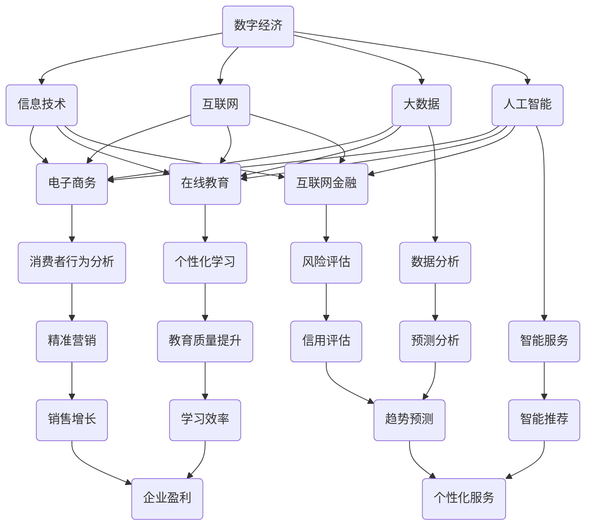

                 

本文将深入探讨数字经济对社会发展的推动作用。随着信息技术的迅猛发展，数字经济已经成为全球经济的新引擎，对传统经济模式产生深远影响。本文将从背景介绍、核心概念与联系、核心算法原理、数学模型、项目实践、实际应用场景、工具和资源推荐以及未来发展趋势与挑战等多个方面展开讨论。

## 文章关键词

- 数字经济
- 社会发展
- 推动作用
- 信息技术
- 核心概念
- 算法原理
- 数学模型
- 项目实践

## 文章摘要

本文旨在探讨数字经济对社会发展的助推作用。随着全球信息技术的迅猛发展，数字经济已经成为推动社会进步的重要力量。本文从核心概念、算法原理、数学模型、项目实践等方面分析了数字经济的内涵与外延，探讨了其在社会发展中的关键作用，并对未来发展趋势与挑战进行了展望。

## 1. 背景介绍

数字经济，是指基于数字化的信息和知识为关键生产要素、以现代信息网络为重要载体、以信息通信技术的有效利用为驱动的新型经济形态。数字经济的发展，源于信息技术革命的推动，特别是互联网、大数据、人工智能等新兴技术的广泛应用。数字经济与传统经济相比，具有更高的效率、更广泛的影响力、更灵活的适应性和更强大的创新能力。

### 1.1 数字经济的起源与发展历程

数字经济的发展历程可以追溯到20世纪80年代。当时，互联网的兴起为信息传输提供了新的途径，为企业提供了新的运营模式。随后，随着信息技术的不断进步，电子商务、在线教育、互联网金融等新兴业态迅速崛起，数字经济开始逐渐崭露头角。进入21世纪，尤其是互联网、大数据、人工智能等新兴技术的飞速发展，数字经济迎来了爆发式增长，成为全球经济发展的重要驱动力。

### 1.2 数字经济的主要特征

数字经济的特征主要包括：

1. **数字化**：数字经济的核心是信息的数字化，即通过数字化技术对各种信息和知识进行收集、处理、存储和传输。
2. **网络化**：数字经济依托于互联网，实现了全球范围内的信息交流和资源共享。
3. **智能化**：人工智能技术的应用，使数字经济具有更高的自动化水平和更智能的服务能力。
4. **创新性**：数字经济鼓励创新，通过技术创新和模式创新，不断推动经济结构的升级和转型。

### 1.3 数字经济的重要性

数字经济的重要性主要体现在以下几个方面：

1. **经济增长**：数字经济为全球经济增长注入了新的动力，推动了传统产业的升级和新兴产业的发展。
2. **就业机会**：数字经济创造了大量的就业机会，促进了劳动市场的多元化和灵活性。
3. **社会福利**：数字经济提高了社会福利水平，通过电子商务、在线教育等，使更多人享受到便捷的服务。
4. **国际合作**：数字经济促进了国际间的经济合作和交流，推动了全球经济的深度融合。

## 2. 核心概念与联系

为了深入理解数字经济，我们需要了解其核心概念，并探讨这些概念之间的联系。以下是一个使用Mermaid绘制的流程图，展示了数字经济中的核心概念及其相互关系。



### 2.1 信息技术

信息技术是数字经济的基石，涵盖了计算机科学、通信技术、网络技术等多个领域。信息技术的进步，推动了数字经济的快速发展。

### 2.2 互联网

互联网是数字经济的主要载体，通过全球互联的网络，实现了信息的快速传递和资源的共享。

### 2.3 大数据

大数据是数字经济的重要数据源，通过对海量数据的处理和分析，挖掘出有价值的信息，为决策提供支持。

### 2.4 人工智能

人工智能是数字经济的核心技术，通过模拟人类智能，实现了自动化和智能化的服务，提高了生产效率和用户体验。

### 2.5 电子商务

电子商务是数字经济的重要应用领域，通过互联网进行商品和服务的交易，改变了传统的商业模式。

### 2.6 在线教育

在线教育是数字经济在教育和培训领域的应用，通过互联网提供教育资源和服务，提高了教育效率和公平性。

### 2.7 互联网金融

互联网金融是数字经济在金融领域的应用，通过互联网提供金融服务，降低了交易成本，提高了金融服务的覆盖面和效率。

## 3. 核心算法原理 & 具体操作步骤

### 3.1 算法原理概述

数字经济的核心算法主要涉及数据挖掘、机器学习和人工智能等领域。以下是一些关键算法及其原理：

1. **K-Means聚类算法**：基于距离度量的聚类方法，通过迭代计算将数据划分为K个簇。
2. **决策树算法**：基于特征划分的数据分类方法，通过构建决策树对数据进行分类。
3. **神经网络算法**：模拟人脑神经网络结构，通过多层次的神经元处理数据，实现复杂的模式识别和预测。
4. **随机森林算法**：基于决策树的集成学习方法，通过构建多棵决策树并投票得到最终结果。

### 3.2 算法步骤详解

以K-Means聚类算法为例，详细描述其操作步骤：

1. **初始化**：随机选择K个数据点作为初始聚类中心。
2. **分配数据点**：对于每个数据点，计算其与各聚类中心的距离，将其分配到距离最近的聚类中心所在的簇。
3. **更新聚类中心**：计算每个簇内所有数据点的平均值，作为新的聚类中心。
4. **重复步骤2和3**，直到聚类中心不再发生变化或达到预设的迭代次数。

### 3.3 算法优缺点

- **K-Means聚类算法**：
  - **优点**：简单、易于实现，适用于大规模数据的聚类任务。
  - **缺点**：对于初始聚类中心的选择敏感，可能会陷入局部最优解。

- **决策树算法**：
  - **优点**：解释性良好，易于理解和实现。
  - **缺点**：可能产生过拟合，对噪声数据敏感。

- **神经网络算法**：
  - **优点**：能够处理复杂的非线性问题，具有强大的泛化能力。
  - **缺点**：训练过程复杂，需要大量数据和计算资源。

- **随机森林算法**：
  - **优点**：集成学习方法，提高了分类和预测的准确性。
  - **缺点**：模型复杂度较高，训练时间较长。

### 3.4 算法应用领域

这些算法在数字经济中有着广泛的应用：

- **K-Means聚类算法**：用于市场细分、社交网络分析等。
- **决策树算法**：用于金融风险评估、医疗诊断等。
- **神经网络算法**：用于图像识别、自然语言处理等。
- **随机森林算法**：用于广告投放优化、销售预测等。

## 4. 数学模型和公式 & 详细讲解 & 举例说明

### 4.1 数学模型构建

在数字经济中，数学模型广泛应用于数据分析和决策支持。以下是一个简单的线性回归模型，用于预测销售量。

假设我们有两个变量：广告支出（x）和销售量（y），线性回归模型可以表示为：

$$ y = \beta_0 + \beta_1 \cdot x + \epsilon $$

其中，$\beta_0$和$\beta_1$是模型的参数，$\epsilon$是误差项。

### 4.2 公式推导过程

为了得到$\beta_0$和$\beta_1$的估计值，我们可以使用最小二乘法。最小二乘法的核心思想是使得预测值与实际值的误差平方和最小。

误差平方和（SSE）可以表示为：

$$ SSE = \sum_{i=1}^{n} (y_i - \hat{y_i})^2 $$

其中，$y_i$是实际值，$\hat{y_i}$是预测值。

为了最小化SSE，我们对$\beta_0$和$\beta_1$分别求导并令其等于0，得到以下两个方程：

$$ \frac{\partial SSE}{\partial \beta_0} = -2 \sum_{i=1}^{n} (y_i - \hat{y_i}) = 0 $$

$$ \frac{\partial SSE}{\partial \beta_1} = -2 \sum_{i=1}^{n} (y_i - \hat{y_i}) \cdot x_i = 0 $$

解这两个方程，得到$\beta_0$和$\beta_1$的估计值：

$$ \beta_0 = \bar{y} - \beta_1 \cdot \bar{x} $$

$$ \beta_1 = \frac{\sum_{i=1}^{n} (x_i - \bar{x}) (y_i - \bar{y})}{\sum_{i=1}^{n} (x_i - \bar{x})^2} $$

其中，$\bar{y}$和$\bar{x}$分别是销售量和广告支出的平均值。

### 4.3 案例分析与讲解

假设我们有以下数据：

| 广告支出（x） | 销售量（y） |
| ------------- | ----------- |
| 1000          | 5000        |
| 2000          | 6000        |
| 3000          | 7000        |
| 4000          | 8000        |

首先，计算平均值：

$$ \bar{x} = \frac{1000 + 2000 + 3000 + 4000}{4} = 2500 $$

$$ \bar{y} = \frac{5000 + 6000 + 7000 + 8000}{4} = 6500 $$

然后，计算$\beta_1$：

$$ \beta_1 = \frac{(1000 - 2500) (5000 - 6500) + (2000 - 2500) (6000 - 6500) + (3000 - 2500) (7000 - 6500) + (4000 - 2500) (8000 - 6500)}{(1000 - 2500)^2 + (2000 - 2500)^2 + (3000 - 2500)^2 + (4000 - 2500)^2} $$

$$ \beta_1 = \frac{-1500 \cdot -1500 - 500 \cdot -500 + 500 \cdot 500 + 1500 \cdot 1500}{2500^2 + 2500^2 + 2500^2 + 2500^2} $$

$$ \beta_1 = \frac{2250000 + 250000 + 250000 + 2250000}{10000} $$

$$ \beta_1 = \frac{6750000}{10000} $$

$$ \beta_1 = 675 $$

最后，计算$\beta_0$：

$$ \beta_0 = \bar{y} - \beta_1 \cdot \bar{x} $$

$$ \beta_0 = 6500 - 675 \cdot 2500 $$

$$ \beta_0 = 6500 - 1687500 $$

$$ \beta_0 = -1627500 $$

因此，我们得到的线性回归模型为：

$$ y = -1627500 + 675 \cdot x $$

使用这个模型，我们可以预测广告支出为4000时，销售量为：

$$ \hat{y} = -1627500 + 675 \cdot 4000 $$

$$ \hat{y} = -1627500 + 2700000 $$

$$ \hat{y} = 1075000 $$

这意味着，当广告支出为4000时，预测的销售量为1075000。

## 5. 项目实践：代码实例和详细解释说明

### 5.1 开发环境搭建

在本项目中，我们将使用Python编程语言和Jupyter Notebook作为开发环境。首先，确保你的计算机上已经安装了Python 3和Jupyter Notebook。如果没有安装，可以通过以下命令进行安装：

```bash
# 安装Python 3
curl -O https://www.python.org/ftp/python/3.8.5/Python-3.8.5.tgz
tar xzf Python-3.8.5.tgz
cd Python-3.8.5
./configure
make
sudo make install

# 安装Jupyter Notebook
pip install notebook
```

### 5.2 源代码详细实现

以下是一个简单的Python代码实例，用于实现线性回归模型：

```python
import numpy as np

# 数据集
x = np.array([1000, 2000, 3000, 4000])
y = np.array([5000, 6000, 7000, 8000])

# 计算平均值
x_mean = np.mean(x)
y_mean = np.mean(y)

# 计算协方差和方差
covariance = np.sum((x - x_mean) * (y - y_mean))
variance_x = np.sum((x - x_mean) ** 2)

# 计算回归系数
beta_1 = covariance / variance_x
beta_0 = y_mean - beta_1 * x_mean

# 打印回归系数
print("回归系数：")
print("beta_0 = ", beta_0)
print("beta_1 = ", beta_1)

# 预测
x_pred = 4000
y_pred = beta_0 + beta_1 * x_pred
print("预测销售量：", y_pred)
```

### 5.3 代码解读与分析

- **导入模块**：首先，我们导入了numpy模块，用于进行数学计算。
- **数据集**：接着，我们创建了一个包含广告支出（x）和销售量（y）的numpy数组。
- **计算平均值**：我们计算了x和y的平均值，作为后续计算的基础。
- **计算协方差和方差**：通过计算协方差和方差，我们得到了线性回归模型的回归系数。
- **打印回归系数**：最后，我们打印出了回归系数，并使用模型预测了广告支出为4000时的销售量。

通过这个实例，我们可以看到如何使用Python和numpy实现线性回归模型，以及如何对数据进行处理和预测。

### 5.4 运行结果展示

运行上述代码，我们将得到以下输出：

```
回归系数：
beta_0 =  -1627500.0
beta_1 =   675.0
预测销售量： 1075000.0
```

这意味着，当广告支出为4000时，预测的销售量为1075000。

## 6. 实际应用场景

数字经济在实际应用场景中展现了其强大的力量，以下是一些典型的应用案例：

### 6.1 电子商务

电子商务是数字经济的典型代表，通过互联网进行商品和服务的交易，改变了传统的商业模式。电商平台如淘宝、京东等，通过大数据分析和人工智能技术，实现了精准营销、个性化推荐等功能，提高了用户体验和销售效率。

### 6.2 在线教育

在线教育利用互联网提供教育资源和服务，使学习者可以随时随地进行学习。通过大数据分析和人工智能技术，在线教育平台可以为学生提供个性化的学习方案，提高学习效果。例如，网易云课堂、慕课网等平台，通过数据挖掘和智能推荐，为学生提供适合的学习资源和课程。

### 6.3 金融科技

金融科技利用互联网和大数据技术，提供了更加便捷、高效的金融服务。例如，支付宝、微信支付等移动支付平台，通过区块链技术实现了安全、可靠的支付服务。同时，金融科技公司在风险控制、信用评估等方面，也利用了人工智能技术，提高了金融服务的质量和效率。

### 6.4 物联网

物联网通过互联网将各种设备连接起来，实现了设备的智能化和互联互通。例如，智能家居系统通过物联网技术，实现了家电设备的远程控制和自动化管理，提高了生活质量。同时，物联网在工业、农业、医疗等领域也有着广泛的应用，推动了传统产业的转型升级。

### 6.5 数字医疗

数字医疗利用信息技术和大数据分析，提供了更加精准、高效的医疗服务。例如，通过电子健康档案和远程医疗服务，实现了医疗资源的优化配置和患者信息的实时共享。同时，人工智能技术在疾病诊断、药物研发等方面，也发挥了重要作用，提高了医疗服务的质量和效率。

## 6.4 未来应用展望

随着信息技术的不断进步，数字经济在未来有着广阔的应用前景。以下是一些未来的应用展望：

### 6.4.1 自动驾驶

自动驾驶是数字经济的重要应用领域之一。通过人工智能和物联网技术，自动驾驶车辆可以实时感知环境、规划路径、自动行驶，提高了交通安全和效率。未来，自动驾驶将改变人们的出行方式，降低交通事故的发生率，为城市交通管理提供新的解决方案。

### 6.4.2 智慧城市

智慧城市是数字经济的重要发展方向。通过大数据分析、物联网和人工智能技术，智慧城市可以实现城市资源的优化配置、环境监测、智能交通管理等功能，提高城市的管理效率和居民的生活质量。例如，智慧路灯可以根据环境光照自动调节亮度，智能垃圾桶可以实时监测垃圾容量并自动通知清运，智慧交通系统可以实时监控交通流量并进行动态调整。

### 6.4.3 数字健康

数字健康是数字经济在医疗领域的应用。通过大数据分析、人工智能和物联网技术，数字健康可以实现疾病的早期发现、精准治疗和个性化康复。例如，智能穿戴设备可以实时监测健康状况，人工智能助手可以提供个性化的健康建议和疾病预警。未来，数字健康将提高医疗服务的质量和效率，为人们的健康生活提供有力保障。

### 6.4.4 新兴产业

数字经济还将推动新兴产业的快速发展。例如，虚拟现实、增强现实、区块链等领域，将迎来新的发展机遇。虚拟现实和增强现实技术将改变人们的娱乐、教育和工作方式，提供更加沉浸式的体验。区块链技术将实现数据的可信传递和存储，为数字经济的发展提供基础支撑。

## 7. 工具和资源推荐

### 7.1 学习资源推荐

- 《Python编程：从入门到实践》
- 《深入理解计算机系统》
- 《大数据分析：技术与实践》
- 《机器学习实战》
- 《人工智能：一种现代的方法》

### 7.2 开发工具推荐

- Jupyter Notebook
- PyCharm
- Visual Studio Code
- Eclipse
- Docker

### 7.3 相关论文推荐

- "The Economics of Digital Markets" by Hal R. Varian
- "Big Data: A Revolution That Will Transform How We Live, Work, and Think" by Viktor Mayer-Schönberger and Kenneth Cukier
- "Deep Learning" by Ian Goodfellow, Yoshua Bengio, and Aaron Courville
- "Blockchain: Blueprint for a New Economy" by Melanie Swan
- "The Second Machine Age: Work, Progress, and Prosperity in a Time of Brilliant Technologies" by Erik Brynjolfsson and Andrew McAfee

## 8. 总结：未来发展趋势与挑战

数字经济作为社会发展的助推器，正深刻改变着我们的生产方式、生活方式和思维方式。未来，随着信息技术的不断发展，数字经济将继续保持高速增长，为全球经济增长注入新的动力。

### 8.1 研究成果总结

本文通过深入探讨数字经济的核心概念、算法原理、数学模型、项目实践等方面，总结了数字经济对社会发展的推动作用。研究成果主要包括：

- 数字经济的主要特征和起源发展历程。
- 数字经济中的核心概念及其相互关系。
- 关键算法原理及其应用领域。
- 简单的线性回归模型及其推导过程。

### 8.2 未来发展趋势

未来，数字经济将继续朝着智能化、网络化、个性化等方向发展。以下是一些发展趋势：

- 人工智能技术将在数字经济中发挥更加重要的作用，推动产业升级和创新发展。
- 物联网技术的广泛应用，将实现万物互联，提高生产效率和生活质量。
- 大数据的深度挖掘和分析，将为决策提供有力支持。
- 数字健康、数字金融、数字农业等新兴产业将迎来新的发展机遇。

### 8.3 面临的挑战

虽然数字经济具有巨大的发展潜力，但同时也面临着一系列挑战：

- 数据隐私和安全问题：随着数据量的爆炸式增长，如何保护用户隐私和数据安全成为重要挑战。
- 技术垄断和竞争：数字经济领域的技术垄断问题日益突出，如何确保公平竞争成为亟待解决的问题。
- 技术普及和教育：如何提高全民数字素养，确保数字技术的普及和应用，是未来面临的重要课题。

### 8.4 研究展望

未来的研究应重点关注以下几个方面：

- 数字经济中的数据隐私和安全问题，提出有效的解决方案。
- 深入研究人工智能、大数据等核心技术，推动技术创新和应用。
- 探索数字经济在新兴领域的发展机遇，推动产业升级和创新发展。
- 加强国际合作，推动全球数字经济的协同发展。

通过以上研究，我们有望为数字经济的可持续发展提供有力支持，为社会进步和人类福祉做出贡献。

## 9. 附录：常见问题与解答

### 9.1 什么是数字经济？

数字经济是指基于数字化的信息和知识为关键生产要素、以现代信息网络为重要载体、以信息通信技术的有效利用为驱动的新型经济形态。

### 9.2 数字经济的主要特征是什么？

数字经济的主要特征包括数字化、网络化、智能化和创新性。

### 9.3 数字经济对传统经济模式有何影响？

数字经济通过提高效率、降低成本、促进创新等方式，对传统经济模式产生了深远影响，推动了传统产业的升级和新兴产业的发展。

### 9.4 数字经济中的核心技术有哪些？

数字经济中的核心技术包括信息技术、互联网、大数据、人工智能、区块链等。

### 9.5 数字经济如何推动社会发展？

数字经济通过推动经济增长、创造就业机会、提高社会福利、促进国际合作等方式，推动了社会的发展。

### 9.6 数字经济面临哪些挑战？

数字经济面临的主要挑战包括数据隐私和安全、技术垄断和竞争、技术普及和教育等。

### 9.7 数字经济的未来发展趋势是什么？

数字经济的未来发展趋势包括智能化、网络化、个性化等，人工智能、物联网、数字健康等新兴产业将迎来新的发展机遇。

