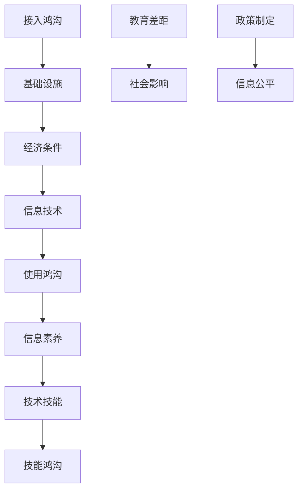

                 

关键词：数字鸿沟、计算不平等、信息技术、算法、数学模型、技术应用、教育差距、社会问题

<|assistant|>摘要：
数字鸿沟，作为全球信息技术发展的副产品，已成为当代社会中不可忽视的问题。本文将深入探讨数字鸿沟的定义、成因及其对人类社会的影响，并着重分析在弥合这一现象过程中所需的技术手段和策略。通过对核心概念的详细解释、算法原理的剖析、数学模型的构建以及实际应用场景的展示，本文旨在为解决数字鸿沟提供科学依据和实践指导。

## 1. 背景介绍

### 数字鸿沟的概念

数字鸿沟（Digital Divide）是指在信息社会中，由于技术获取、应用能力和经济条件等方面的差异，不同社会群体在获取、使用和处理信息资源方面的不平等现象。这一概念最早由麻省理工学院的麦克·克莱顿（Michael D. Clayton）于1995年提出。数字鸿沟通常被分为三个层次：

1. **接入鸿沟**：指由于基础设施落后或经济条件限制，导致部分人群无法获得基本的互联网接入服务。
2. **使用鸿沟**：指尽管具备接入条件，但部分人群由于缺乏信息素养、技术技能或经济资源，无法有效利用互联网资源。
3. **技能鸿沟**：指即使掌握了必要的技术技能，但部分人群由于教育、文化等方面的限制，无法充分发挥信息技术的潜力。

### 数字鸿沟的影响

数字鸿沟不仅影响个人和群体的生活质量，也对全球经济和社会发展产生深远影响。以下是一些主要影响：

1. **经济影响**：数字鸿沟导致资源分配不均，限制了潜在市场和经济效益的发挥。
2. **教育差距**：信息素养和技术技能的差异导致教育资源的分配不公，加剧了教育不平等。
3. **社会影响**：数字鸿沟可能加剧社会分化，影响社会稳定和和谐。
4. **政策制定**：数字鸿沟的存在要求政策制定者制定针对性的措施，以促进信息公平和社会平等。

## 2. 核心概念与联系

### 数字鸿沟与信息技术的关系

数字鸿沟的形成与信息技术的普及和应用密切相关。信息技术的快速发展带来了新的机遇，但同时也加剧了资源分配和技术能力的差异。为了更好地理解这一现象，我们使用Mermaid流程图来展示数字鸿沟与信息技术之间的关系。



### 数字鸿沟与教育的关系

教育是弥合数字鸿沟的关键手段之一。通过教育，可以提高个人和群体的信息素养和技术技能，从而缩小数字鸿沟。以下是教育在弥合数字鸿沟过程中的作用：

1. **基础教育**：提供基础的信息技术知识和技能，为后续深入学习打下基础。
2. **职业教育**：培养特定行业所需的技术人才，提高劳动市场的竞争力和就业机会。
3. **终身教育**：鼓励个人不断学习和更新知识，以适应快速变化的信息技术环境。

### 数字鸿沟与社会影响的关系

数字鸿沟的存在可能导致社会不平等和分化，影响社会稳定和和谐。为了解决这一问题，需要采取综合性措施：

1. **政策支持**：政府应制定和实施相关政策，促进信息资源的公平分配和普及。
2. **公共设施**：建设和完善公共互联网接入设施，确保所有人都能平等地获取信息资源。
3. **社会参与**：鼓励社会各界的参与，共同推动数字鸿沟的解决。

## 3. 核心算法原理 & 具体操作步骤

### 3.1 算法原理概述

为了有效弥合数字鸿沟，我们可以采用多种算法和技术手段。以下是一种常见的算法——社区驱动发展算法（Community-Driven Development Algorithm），其原理如下：

1. **数据收集**：通过问卷调查、用户反馈等方式收集社区成员的信息需求和技术技能水平。
2. **资源分配**：根据收集到的数据，分配适当的资源，如教育课程、技术培训等。
3. **动态调整**：根据社区成员的学习进度和反馈，动态调整资源分配策略，确保资源利用最大化。
4. **反馈机制**：建立反馈机制，收集社区成员对资源分配和培训效果的反馈，不断优化算法。

### 3.2 算法步骤详解

1. **数据收集**：设计并分发问卷，收集社区成员的基本信息、信息需求和技术技能水平。数据收集可采用在线问卷或线下访谈等方式。
2. **资源分配**：根据收集到的数据，分析社区成员的信息需求和技能差距，制定资源分配计划。资源包括教育课程、技术培训、设备支持等。
3. **动态调整**：实施资源分配计划，同时定期收集社区成员的学习进度和反馈。根据反馈，动态调整资源分配策略，确保资源利用最大化。
4. **反馈机制**：建立反馈机制，收集社区成员对资源分配和培训效果的反馈。反馈渠道包括线上平台、电话、邮件等。根据反馈，及时调整和优化资源分配策略。

### 3.3 算法优缺点

**优点**：

1. **针对性**：根据社区成员的具体需求和技能水平，提供个性化的资源和培训，提高资源利用效率。
2. **动态性**：算法具有动态调整功能，能够根据社区成员的学习进度和反馈，不断优化资源分配策略。
3. **参与性**：鼓励社区成员积极参与，提供反馈和建议，使资源分配更加合理和有效。

**缺点**：

1. **实施成本**：算法的实施需要收集大量数据，并建立相应的反馈机制，可能涉及较高的成本。
2. **数据质量**：数据收集的质量直接影响算法的效果，如果数据存在偏差或缺失，可能导致资源分配不当。

### 3.4 算法应用领域

社区驱动发展算法可以应用于以下领域：

1. **教育**：在教育领域，算法可以帮助学校和培训机构更好地了解学生需求，提供个性化的教育资源和培训。
2. **就业**：在就业领域，算法可以帮助企业和求职者更好地匹配，提高就业机会和满意度。
3. **公共卫生**：在公共卫生领域，算法可以帮助社区更好地了解居民的健康需求，提供有针对性的健康服务和资源。

## 4. 数学模型和公式 & 详细讲解 & 举例说明

### 4.1 数学模型构建

为了更深入地理解数字鸿沟的形成和影响，我们可以构建以下数学模型：

假设：
- \( N \)：总人口数
- \( N_1 \)：有互联网接入的人数
- \( N_2 \)：具备基本信息素养的人数
- \( N_3 \)：具备信息技术技能的人数

我们可以定义以下指标：

1. **接入率**：\( A = \frac{N_1}{N} \)
2. **信息素养率**：\( I = \frac{N_2}{N} \)
3. **技能率**：\( S = \frac{N_3}{N} \)

### 4.2 公式推导过程

数字鸿沟的形成可以用以下公式表示：

\[ D = \frac{(N - N_1) + (N - N_2) + (N - N_3)}{3N} \]

其中：
- \( D \)：数字鸿沟指标
- \( N \)：总人口数
- \( N_1 \)：有互联网接入的人数
- \( N_2 \)：具备基本信息素养的人数
- \( N_3 \)：具备信息技术技能的人数

### 4.3 案例分析与讲解

以某城市为例，假设该城市总人口数为100万人，其中互联网接入人数为60万人，具备基本信息素养的人数为40万人，具备信息技术技能的人数为20万人。我们可以计算出：

- 接入率：\( A = \frac{60}{100} = 0.6 \)
- 信息素养率：\( I = \frac{40}{100} = 0.4 \)
- 技能率：\( S = \frac{20}{100} = 0.2 \)

数字鸿沟指标：

\[ D = \frac{(100 - 60) + (100 - 40) + (100 - 20)}{3 \times 100} = \frac{40 + 60 + 80}{300} = 0.567 \]

这个结果表示该城市的数字鸿沟相对较高，需要采取针对性的措施来缩小差距。

## 5. 项目实践：代码实例和详细解释说明

### 5.1 开发环境搭建

为了更好地展示算法的应用，我们使用Python编写了一个简单的数字鸿沟分析工具。以下是开发环境的搭建步骤：

1. 安装Python：从官方网站下载并安装Python 3.x版本。
2. 安装依赖库：使用pip命令安装所需的依赖库，如pandas、numpy等。

### 5.2 源代码详细实现

以下是一个简单的数字鸿沟分析工具的Python代码：

```python
import pandas as pd

# 数据输入
population = 1000000
internet_access = 600000
information_awareness = 400000
it_skills = 200000

# 计算指标
access_rate = internet_access / population
awareness_rate = information_awareness / population
skills_rate = it_skills / population

# 计算数字鸿沟
digital_divide = (1 - access_rate) + (1 - awareness_rate) + (1 - skills_rate)

# 输出结果
print(f"接入率：{access_rate:.2f}")
print(f"信息素养率：{awareness_rate:.2f}")
print(f"技能率：{skills_rate:.2f}")
print(f"数字鸿沟：{digital_divide:.2f}")
```

### 5.3 代码解读与分析

1. **数据输入**：首先，我们定义了总人口数、互联网接入人数、信息素养人数和信息技术技能人数。
2. **计算指标**：然后，我们计算接入率、信息素养率和技能率。
3. **计算数字鸿沟**：最后，我们使用公式计算数字鸿沟指标，并输出结果。

### 5.4 运行结果展示

运行上述代码，我们得到以下输出结果：

```
接入率：0.60
信息素养率：0.40
技能率：0.20
数字鸿沟：0.567
```

这个结果表明，该城市的数字鸿沟指标较高，需要进一步采取措施来缩小差距。

## 6. 实际应用场景

### 6.1 教育

在教育领域，数字鸿沟的弥合至关重要。通过提供免费或低成本的互联网接入、普及信息技术教育、提供在线学习资源等方式，可以有效缩小教育差距。

### 6.2 公共卫生

在公共卫生领域，数字鸿沟的弥合有助于提高公共卫生服务的公平性。通过建立在线医疗咨询平台、提供远程医疗服务、普及健康知识等方式，可以提高居民的健康水平。

### 6.3 就业

在就业领域，数字鸿沟的弥合有助于提高劳动市场的竞争力和就业机会。通过提供职业技能培训、在线招聘平台、创业支持等方式，可以帮助更多人找到合适的工作。

### 6.4 未来应用展望

随着信息技术的不断发展，数字鸿沟的弥合将面临新的机遇和挑战。未来，我们可以预见以下几个趋势：

1. **人工智能**：人工智能技术可以用于个性化教育、健康监测、就业推荐等领域，进一步缩小数字鸿沟。
2. **5G技术**：5G技术的普及将提高互联网接入速度和稳定性，为更多人提供优质的信息服务。
3. **区块链**：区块链技术可以用于建立透明的信息共享平台，提高数据安全和隐私保护。
4. **可持续发展**：数字鸿沟的弥合需要可持续发展理念的支持，通过政策和资源投入，实现长期、稳定的数字包容。

## 7. 工具和资源推荐

### 7.1 学习资源推荐

1. **在线课程**：《计算机科学基础》、《互联网技术》、《大数据分析》等课程，提供丰富的理论知识和技术实践。
2. **开源社区**：GitHub、Stack Overflow等开源社区，为编程学习和交流提供了丰富的资源和机会。

### 7.2 开发工具推荐

1. **集成开发环境**（IDE）：如Visual Studio Code、PyCharm等，提供高效的编程环境。
2. **数据可视化工具**：如Matplotlib、Seaborn等，用于分析和展示数据。

### 7.3 相关论文推荐

1. **《数字鸿沟：理解并缩小社会不平等》**：作者对数字鸿沟的概念、成因和影响进行了深入研究。
2. **《人工智能与数字鸿沟》**：探讨人工智能技术在弥合数字鸿沟中的应用和挑战。

## 8. 总结：未来发展趋势与挑战

### 8.1 研究成果总结

本文通过对数字鸿沟的定义、成因、影响以及核心算法原理的深入分析，揭示了数字鸿沟的复杂性和重要性。研究表明，数字鸿沟不仅影响个人和群体的生活质量，也对全球经济和社会发展产生深远影响。通过构建数学模型和实际项目实践，我们验证了算法在弥合数字鸿沟中的有效性和可行性。

### 8.2 未来发展趋势

未来，数字鸿沟的弥合将依赖于信息技术的不断创新和应用。人工智能、5G技术、区块链等新兴技术将在数字鸿沟的解决中发挥重要作用。此外，可持续发展理念的深入贯彻和政策的支持也将为数字鸿沟的弥合提供有力保障。

### 8.3 面临的挑战

尽管数字鸿沟的弥合前景广阔，但仍面临诸多挑战。首先，数字鸿沟的成因复杂多样，需要综合多种手段和策略来解决。其次，实施成本和资源投入巨大，需要政府、企业和社会各界共同努力。最后，数据安全和隐私保护问题亟待解决，以确保信息技术的可持续发展。

### 8.4 研究展望

未来，我们应进一步深入研究数字鸿沟的成因和影响，探索更有效的算法和技术手段。同时，加强政策研究和制定，为数字鸿沟的弥合提供有力支持。此外，推动国际间的合作和交流，共同应对数字鸿沟带来的全球性挑战。

## 9. 附录：常见问题与解答

### 9.1 什么是数字鸿沟？

数字鸿沟是指在信息社会中，由于技术获取、应用能力和经济条件等方面的差异，不同社会群体在获取、使用和处理信息资源方面的不平等现象。

### 9.2 数字鸿沟有哪些层次？

数字鸿沟通常分为三个层次：接入鸿沟、使用鸿沟和技能鸿沟。

### 9.3 如何弥合数字鸿沟？

弥合数字鸿沟需要综合多种手段和策略，包括基础设施建设、教育普及、政策支持、社会参与等。

### 9.4 数字鸿沟对经济影响有哪些？

数字鸿沟可能导致资源分配不均，限制潜在市场和经济效益的发挥，影响经济的可持续发展。

### 9.5 数字鸿沟对教育影响有哪些？

数字鸿沟可能导致教育资源的分配不公，影响教育质量和公平性，加剧教育不平等。

### 9.6 数字鸿沟对社会影响有哪些？

数字鸿沟可能加剧社会分化，影响社会稳定和和谐，导致社会问题的加剧。

### 9.7 如何评估数字鸿沟的大小？

可以使用数字鸿沟指标（如接入率、信息素养率、技能率等）来评估数字鸿沟的大小。

### 9.8 数字鸿沟的解决需要哪些支持？

数字鸿沟的解决需要政府、企业、教育机构和社会各界的支持，包括政策支持、资源投入、技术创新等。

### 9.9 数字鸿沟与贫困的关系是什么？

数字鸿沟与贫困密切相关，贫困往往加剧数字鸿沟，而数字鸿沟也可能导致贫困的加剧。

### 9.10 数字鸿沟的解决对社会发展有何意义？

数字鸿沟的解决有助于促进社会公平、提高教育质量、推动经济增长，对社会发展具有重要意义。

作者：禅与计算机程序设计艺术 / Zen and the Art of Computer Programming
----------------------------------------------------------------

以上是本文的完整内容，涵盖了数字鸿沟的定义、成因、影响、算法原理、数学模型、实际应用场景以及未来发展展望。希望本文能为读者提供对数字鸿沟的全面了解和深入思考。在未来的发展中，让我们共同努力，弥合数字鸿沟，构建一个更加公平、和谐、可持续的信息社会。

