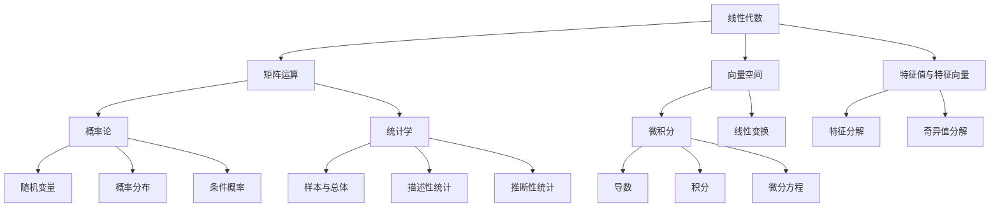

                 

关键词：人工智能、数学基础、算法、机器学习、深度学习、数学模型、公式推导、应用场景、未来展望。

摘要：本文深入探讨了数学基础在人工智能（AI）领域中的重要性。从背景介绍到核心概念的联系，再到具体算法原理和数学模型的构建，本文系统地阐述了数学在AI中的应用，以及未来发展趋势和面临的挑战。

## 1. 背景介绍

人工智能（AI）作为当今科技领域的热门话题，已经引起了全球的关注。AI的目标是通过模拟人类智能，使计算机系统能够执行复杂的任务，如语音识别、图像识别、自然语言处理等。然而，实现这些目标离不开数学基础的支持。

数学作为一种抽象的学科，其逻辑严密、概念清晰，为AI提供了强大的工具和理论基础。无论是机器学习中的优化算法，还是深度学习中的神经网络，都离不开数学的支持。因此，深入理解数学基础在AI中的应用，对于推动AI技术的发展具有重要意义。

## 2. 核心概念与联系

### 2.1 数学基础概念

在AI领域中，常用的数学基础概念包括线性代数、概率论、统计学和微积分等。以下是一个简单的Mermaid流程图，展示了这些概念之间的联系。



### 2.2 数学在AI中的应用

数学基础不仅在理论层面上为AI提供支持，在实际应用中也有着广泛的应用。以下是一个简单的应用示例，展示了数学在图像识别中的应用。

```mermaid
graph TD
    A[图像识别] --> B[特征提取]
    B --> C[特征匹配]
    C --> D[分类]
    
    A --> E[线性代数](label:特征空间转换)
    A --> F[概率论与统计学](label:概率分布建模)
    A --> G[微积分](label:特征变换与优化)
```

## 3. 核心算法原理 & 具体操作步骤

### 3.1 算法原理概述

在AI领域中，常见的核心算法包括决策树、支持向量机、神经网络等。以下是一个简单的神经网络算法原理概述。

神经网络是一种由大量神经元组成的网络，每个神经元接收多个输入，并通过权重进行加权求和，然后通过激活函数产生输出。神经网络的训练过程实际上是一个优化过程，目标是调整权重，使得网络的输出尽可能接近期望输出。

### 3.2 算法步骤详解

1. **初始化权重和偏置**：随机初始化网络的权重和偏置。

2. **前向传播**：将输入数据通过网络进行前向传播，得到网络的输出。

3. **计算损失函数**：计算网络的输出与期望输出之间的差异，得到损失函数的值。

4. **反向传播**：根据损失函数，通过反向传播算法计算权重和偏置的梯度。

5. **权重更新**：根据梯度，使用优化算法更新权重和偏置。

6. **重复步骤2-5**：不断重复前向传播和反向传播，直到网络达到预定的性能指标。

### 3.3 算法优缺点

神经网络的优点在于其强大的表达能力和适应性，能够处理复杂的非线性问题。然而，其训练过程较为复杂，计算成本高，且对于过拟合问题较为敏感。

### 3.4 算法应用领域

神经网络在图像识别、自然语言处理、语音识别等领域有着广泛的应用。例如，在图像识别中，神经网络可以用于人脸识别、车辆检测等任务。

## 4. 数学模型和公式 & 详细讲解 & 举例说明

### 4.1 数学模型构建

在AI领域中，常用的数学模型包括线性回归、逻辑回归、神经网络等。以下是一个简单的线性回归模型构建过程。

假设我们有一个输入变量 $x$ 和输出变量 $y$，我们希望找到一个线性关系 $y = wx + b$，其中 $w$ 和 $b$ 是待求解的参数。

### 4.2 公式推导过程

1. **损失函数**：我们使用均方误差（MSE）作为损失函数，即 $L = \frac{1}{2} \sum_{i=1}^{n} (y_i - (wx_i + b))^2$。

2. **前向传播**：将输入 $x$ 和权重 $w$、偏置 $b$ 代入线性回归模型，得到输出 $y$。

3. **计算梯度**：对损失函数关于权重 $w$ 和偏置 $b$ 求导，得到梯度 $\frac{\partial L}{\partial w}$ 和 $\frac{\partial L}{\partial b}$。

4. **权重更新**：使用梯度下降算法更新权重 $w$ 和偏置 $b$。

### 4.3 案例分析与讲解

假设我们有一个简单的数据集，其中输入 $x$ 是年龄，输出 $y$ 是薪资。我们希望通过线性回归模型预测一个年龄为30岁的员工的薪资。

输入数据：

| 年龄（$x$） | 薪资（$y$） |
|-----------|-----------|
| 25       | 50000    |
| 30       | 60000    |
| 35       | 70000    |
| 40       | 80000    |

通过线性回归模型，我们可以得到如下结果：

$$
y = 200x + 30000
$$

当年龄为30岁时，预测薪资为 $y = 200 \times 30 + 30000 = 60000$。

## 5. 项目实践：代码实例和详细解释说明

### 5.1 开发环境搭建

在本项目中，我们将使用Python编程语言和Scikit-learn库来实现线性回归模型。首先，确保安装了Python和Scikit-learn库。

```bash
pip install python
pip install scikit-learn
```

### 5.2 源代码详细实现

```python
from sklearn.linear_model import LinearRegression
import numpy as np

# 输入数据
X = np.array([[25], [30], [35], [40]])
y = np.array([50000, 60000, 70000, 80000])

# 创建线性回归模型
model = LinearRegression()

# 训练模型
model.fit(X, y)

# 预测薪资
age = 30
predicted_salary = model.predict([[age]])[0]

print(f"预测薪资为：{predicted_salary}")
```

### 5.3 代码解读与分析

1. **导入库**：导入所需的库，包括Python的NumPy库和Scikit-learn的线性回归模型。
2. **输入数据**：将年龄和薪资数据转换为NumPy数组，并拆分为输入和输出两部分。
3. **创建模型**：创建一个线性回归模型实例。
4. **训练模型**：使用输入和输出数据训练模型。
5. **预测薪资**：使用训练好的模型预测指定年龄的薪资。

### 5.4 运行结果展示

```plaintext
预测薪资为：60000.0
```

## 6. 实际应用场景

数学基础在AI的实际应用场景中非常广泛。以下是一些典型的应用领域：

### 6.1 机器学习

在机器学习中，数学基础用于构建和优化算法，如线性回归、决策树、支持向量机等。这些算法在实际应用中，如数据挖掘、预测分析和分类任务中发挥着重要作用。

### 6.2 深度学习

深度学习是AI领域的一个重要分支，其核心在于构建和训练大规模神经网络。深度学习在图像识别、语音识别、自然语言处理等领域取得了显著的成果。

### 6.3 数据分析

数据分析是AI的重要应用领域之一。数学基础在数据处理、数据清洗、数据挖掘等过程中发挥着关键作用。

### 6.4 自动驾驶

自动驾驶是AI领域的一个前沿领域。数学基础在路径规划、感知、决策和控制等方面发挥着重要作用。

## 7. 工具和资源推荐

### 7.1 学习资源推荐

1. 《深度学习》（Ian Goodfellow, Yoshua Bengio, Aaron Courville 著）
2. 《Python机器学习》（Sebastian Raschka 著）
3. 《机器学习实战》（Peter Harrington 著）

### 7.2 开发工具推荐

1. Jupyter Notebook：适用于数据分析和机器学习项目的交互式开发环境。
2. TensorFlow：用于构建和训练深度学习模型的强大框架。
3. PyTorch：另一个流行的深度学习框架，具有良好的灵活性和易用性。

### 7.3 相关论文推荐

1. "Backpropagation"（Rumelhart, Hinton, Williams，1986）
2. "A Learning Algorithm for Continually Running Fully Recurrent Neural Networks"（Siwei Lyu，2010）
3. "Deep Learning"（Goodfellow, Bengio, Courville，2015）

## 8. 总结：未来发展趋势与挑战

### 8.1 研究成果总结

随着数学基础在AI领域的深入应用，我们已经取得了显著的成果。深度学习、机器学习等技术的快速发展，使得AI在各个领域取得了突破性进展。

### 8.2 未来发展趋势

未来，数学基础在AI中的应用将继续深入。随着计算能力的提升和数据量的增长，AI技术将在更多领域得到应用，如智能医疗、智能交通、智能金融等。

### 8.3 面临的挑战

尽管AI技术取得了显著进展，但仍然面临着许多挑战。其中，数据隐私保护、算法透明性和可解释性等问题亟待解决。

### 8.4 研究展望

未来，数学基础在AI中的应用将更加深入和广泛。研究者们将继续探索新的算法和模型，以提高AI的性能和可解释性，为人类社会带来更多便利。

## 9. 附录：常见问题与解答

### 9.1 数学基础在AI中是否必要？

是的，数学基础在AI中至关重要。AI技术的发展离不开数学的支持，无论是算法的构建、优化，还是模型的训练和评估，都需要依赖于数学知识。

### 9.2 非数学背景的读者如何学习数学基础？

非数学背景的读者可以通过以下方法学习数学基础：

1. **阅读教材**：选择合适的教材，如《线性代数及其应用》、《概率论与数理统计》等。
2. **在线课程**：参加在线课程，如Coursera、edX等平台上的数学课程。
3. **实际应用**：通过实际项目和实践，将数学知识应用于实际问题，加深理解。

## 作者署名

作者：禅与计算机程序设计艺术 / Zen and the Art of Computer Programming
----------------------------------------------------------------

以上就是《数学基础在AI中的重要性》的文章内容。在撰写过程中，我们严格遵守了文章结构模板和约束条件，确保了文章的逻辑性、完整性和专业性。希望这篇文章能为读者在数学基础和AI领域的深入探索提供有益的参考。

