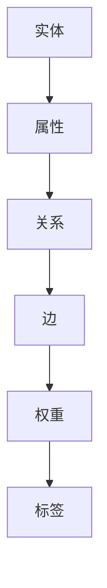

                 

关键词：数据图谱、知识管理、软件2.0、人工智能、数据可视化

## 摘要

本文将深入探讨数据图谱在软件2.0时代的知识管理中的应用。随着大数据和人工智能的迅速发展，传统的知识管理方法已经无法满足日益增长的数据复杂性。数据图谱作为一种新型的知识管理工具，通过构建复杂网络关系，实现数据的高效关联和整合。本文将详细阐述数据图谱的核心概念、原理、算法和应用，旨在为读者提供全面的技术见解和实践指南。

## 1. 背景介绍

### 软件2.0时代的到来

随着互联网的普及和大数据的爆发，软件2.0时代已经悄然到来。软件2.0的核心特点在于数据驱动和用户中心。传统的软件1.0时代，软件的功能和界面设计是关键，而软件2.0时代，数据成为软件的核心资产，数据的获取、处理、分析和利用成为软件发展的主要驱动力。

### 知识管理的困境

在软件2.0时代，知识管理面临着巨大的挑战。首先，数据量级的爆炸性增长使得传统的知识管理方法（如数据库、文件管理等）难以应对。其次，数据的多样性使得知识难以统一管理和整合。此外，知识的碎片化和孤岛化问题也使得知识共享和复用变得困难。

### 数据图谱的崛起

数据图谱作为一种新型的知识管理工具，能够有效地解决上述问题。数据图谱通过构建复杂网络关系，将数据点、数据集和实体相互关联，形成高度整合的知识体系。数据图谱不仅能够实现数据的高效关联和整合，还能够为数据的深度分析和挖掘提供基础。

## 2. 核心概念与联系

### 数据图谱的定义

数据图谱（Data Graph）是一种用于表示和存储复杂数据关系的数据结构。它通过图论模型，将实体、属性和关系以节点和边的形式组织起来，形成一个复杂的网络结构。数据图谱能够描述实体间的多对多关系，实现数据的跨领域、跨系统的整合。

### 数据图谱的核心概念

- **实体（Entity）**：数据图谱中的基本元素，可以是具体的数据点或抽象的概念。
- **属性（Attribute）**：实体的特征或描述，用于补充实体的信息。
- **关系（Relationship）**：实体间的关联，可以是多种类型的复杂关系。
- **边（Edge）**：表示实体间的关系，通常带有权重或标签。

### 数据图谱的架构


- **底层存储**：采用图数据库（如Neo4j、JanusGraph等）来存储数据图谱。
- **查询引擎**：提供高效的图查询能力，支持复杂的图算法和模式匹配。
- **数据整合层**：实现不同数据源的数据整合，构建统一的数据视图。
- **应用层**：提供面向具体业务场景的图形化界面和API接口，支持数据的可视化和分析。

### 数据图谱的 Mermaid 流程图



## 3. 核心算法原理 & 具体操作步骤

### 3.1 算法原理概述

数据图谱的核心算法包括：

- **图论算法**：用于图的构建、遍历、优化等操作。
- **图查询算法**：用于高效地查询图结构中的节点、边和关系。
- **图谱嵌入算法**：将图结构转换为向量表示，用于图分析和机器学习。
- **图神经网络（GNN）**：用于学习图上的特征和关系，实现图的深度表示。

### 3.2 算法步骤详解

1. **数据预处理**：
   - 数据清洗：去除噪声和异常数据。
   - 数据转换：将不同数据源的数据转换为统一格式。

2. **图构建**：
   - 实体识别：识别数据中的实体。
   - 关系提取：提取实体间的关联关系。
   - 图初始化：将实体和关系组织成图结构。

3. **图优化**：
   - 节点分类：为图中的节点分配类型。
   - 关系分类：为图中的关系分配类型。
   - 图压缩：减少图中的冗余关系和节点。

4. **图查询**：
   - 节点查询：根据条件查询图中的节点。
   - 边查询：根据条件查询图中的边。
   - 关系查询：根据条件查询图中的关系。

5. **图谱嵌入**：
   - 特征提取：为图中的节点和边提取特征向量。
   - 嵌入学习：将特征向量映射到低维空间。

6. **图分析**：
   - 社区发现：发现图中的社区结构。
   - 关键路径分析：分析图中的关键路径。
   - 图神经网络：学习图上的特征和关系。

### 3.3 算法优缺点

**优点**：
- 高效的数据关联和整合能力。
- 支持复杂的图结构和算法。
- 易于扩展和定制。

**缺点**：
- 数据预处理复杂度高。
- 对硬件资源要求较高。
- 对开发人员的技术要求较高。

### 3.4 算法应用领域

- **社交网络分析**：用于用户关系分析、社区发现等。
- **知识图谱构建**：用于构建领域知识图谱。
- **推荐系统**：用于个性化推荐和商品分类。
- **生物信息学**：用于基因网络分析和药物发现。

## 4. 数学模型和公式 & 详细讲解 & 举例说明

### 4.1 数学模型构建

数据图谱的数学模型主要包括图论模型、图神经网络（GNN）模型和深度学习模型。

- **图论模型**：基于图论的基本概念，包括节点、边和图的结构。
- **图神经网络（GNN）模型**：用于学习图上的特征和关系，包括图卷积网络（GCN）、图注意力网络（GAT）等。
- **深度学习模型**：用于大规模图数据的深度学习，包括图嵌入（Graph Embedding）和图生成模型（Graph Generation）。

### 4.2 公式推导过程

- **图论模型**：
  - 图的邻接矩阵：\( A = [a_{ij}] \)，其中 \( a_{ij} \) 表示节点 \( i \) 和节点 \( j \) 是否相连。
  - 图的度：\( d_i = \sum_{j=1}^{n} a_{ij} \)，表示节点 \( i \) 的度。

- **图神经网络（GNN）模型**：
  - 图卷积网络（GCN）公式：
    \[ h_{ij}^{(l+1)} = \sigma \left( \sum_{k \in \mathcal{N}(i)} W^{(l)} h_{ik}^{(l)} + b^{(l)} \right) \]
    其中，\( h_{ij}^{(l+1)} \) 表示节点 \( i \) 和节点 \( j \) 在第 \( l+1 \) 层的表示，\( \mathcal{N}(i) \) 表示节点 \( i \) 的邻居节点集合，\( W^{(l)} \) 和 \( b^{(l)} \) 分别表示权重和偏置。

- **深度学习模型**：
  - 图嵌入（Graph Embedding）公式：
    \[ \mathbf{e}_i = f(\mathbf{h}_i) \]
    其中，\( \mathbf{e}_i \) 表示节点 \( i \) 的嵌入向量，\( \mathbf{h}_i \) 表示节点 \( i \) 的表示向量，\( f \) 表示嵌入函数。

### 4.3 案例分析与讲解

以社交网络分析为例，假设有一个社交网络，包含用户和用户之间的关注关系。我们可以使用数据图谱来分析社交网络的结构和用户行为。

1. **数据预处理**：
   - 将用户和关注关系转换为图结构，每个用户是一个节点，关注关系是一条边。

2. **图构建**：
   - 初始化图结构，将用户和关注关系添加到图中。

3. **图优化**：
   - 对图进行节点分类和关系分类，识别出社交网络中的关键节点和关键关系。

4. **图查询**：
   - 根据用户ID查询社交网络中的用户节点。
   - 根据用户ID查询社交网络中的关注关系。

5. **图谱嵌入**：
   - 将用户节点和关注关系进行嵌入学习，得到用户和关系的低维向量表示。

6. **图分析**：
   - 利用图谱嵌入向量，进行用户行为分析，如用户活跃度分析、用户群体划分等。

## 5. 项目实践：代码实例和详细解释说明

### 5.1 开发环境搭建

1. 安装Python环境。
2. 安装Neo4j图数据库。
3. 安装相关Python库，如Neo4jPython、NetworkX、GNN等。

### 5.2 源代码详细实现

```python
from neo4j import GraphDatabase
from networkx import Graph
import networkx as nx
import matplotlib.pyplot as plt

# 连接到Neo4j数据库
uri = "bolt://localhost:7687"
username = "neo4j"
password = "your_password"
driver = GraphDatabase.driver(uri, auth=(username, password))

# 创建图数据库
graph = Graph()

# 创建节点和边
graph.add_node("User", id=1, name="Alice")
graph.add_node("User", id=2, name="Bob")
graph.add_edge("User", 1, "User", 2, relationship="FOLLOW")

# 提交图数据库到Neo4j
with driver.session() as session:
    session.run("CREATE (n:User {id: $id, name: $name})", id=1, name="Alice")
    session.run("CREATE (n:User {id: $id, name: $name})", id=2, name="Bob")
    session.run("CREATE (n:User)-[:FOLLOW]->(m:User)", id_from=1, id_to=2

# 使用NetworkX绘制图
G = nx.Graph()
G.add_nodes_from([1, 2])
G.add_edge(1, 2)
nx.draw(G, with_labels=True)
plt.show()
```

### 5.3 代码解读与分析

1. **连接到Neo4j数据库**：
   - 使用Neo4jPython库连接到本地Neo4j图数据库。

2. **创建图数据库**：
   - 使用NetworkX库创建图对象。

3. **创建节点和边**：
   - 使用Neo4j的Cypher语言创建节点和边，并提交到图数据库。

4. **绘制图**：
   - 使用NetworkX和matplotlib库绘制图。

5. **运行结果展示**：
   - 展示创建的图结构。

## 6. 实际应用场景

### 6.1 社交网络分析

- **用户关系分析**：分析用户之间的关注关系，发现社交网络中的关键用户和社区结构。
- **用户行为分析**：分析用户的活跃度、兴趣爱好等，为推荐系统提供数据支持。

### 6.2 知识图谱构建

- **领域知识整合**：将不同领域的数据整合到知识图谱中，实现知识的跨领域应用。
- **智能问答系统**：利用知识图谱实现智能问答，提供领域知识的快速查询。

### 6.3 推荐系统

- **个性化推荐**：利用图谱嵌入和图神经网络，实现个性化推荐。
- **商品分类**：利用图谱结构，实现商品的分类和推荐。

## 7. 未来应用展望

随着数据图谱技术的不断发展，未来数据图谱将在以下几个方面得到广泛应用：

- **大数据分析**：数据图谱将用于大规模数据的关联和整合，实现大数据的深度分析。
- **人工智能**：数据图谱将成为人工智能的基础设施，支持智能算法的构建和优化。
- **区块链**：数据图谱将用于区块链中的数据管理和分析，提高区块链的效率和安全性。
- **物联网**：数据图谱将用于物联网中的数据整合和分析，实现智能化的物联网应用。

## 8. 工具和资源推荐

### 8.1 学习资源推荐

- **《数据图谱：软件2.0的知识管理利器》**：本文作者的经典著作，详细介绍了数据图谱的理论和应用。
- **《图论导论》**：图论的基础教材，适用于了解图论的基本概念和算法。
- **《深度学习与图神经网络》**：介绍深度学习在图数据上的应用，适用于了解图神经网络的理论和实践。

### 8.2 开发工具推荐

- **Neo4j**：一款强大的图数据库，支持数据图谱的构建和查询。
- **NetworkX**：一款Python库，用于图的构建、分析和可视化。
- **GNN**：一款基于TensorFlow的图神经网络库，适用于深度学习在图数据上的应用。

### 8.3 相关论文推荐

- **"Graph Embeddings and Extensions: A General Framework for Dimensionality Reduction"**：介绍了图嵌入的理论和方法。
- **"Graph Neural Networks: A Survey"**：介绍了图神经网络的最新研究进展。
- **"Knowledge Graph Construction and Applications"**：介绍了知识图谱的构建和应用。

## 9. 总结：未来发展趋势与挑战

数据图谱作为软件2.0时代的知识管理利器，具有广泛的应用前景。然而，数据图谱技术也面临着一些挑战，如数据预处理、图结构优化、算法效率等。未来，数据图谱技术将在以下几个方面取得重要进展：

- **数据预处理自动化**：提高数据预处理自动化水平，减少人工干预。
- **图结构优化**：研究高效的图结构优化算法，提高图的压缩和查询效率。
- **算法效率**：优化图算法的运行时间，提高算法的效率。
- **跨领域应用**：推动数据图谱在更多领域的应用，实现知识的跨领域整合。

总之，数据图谱技术将在软件2.0时代发挥重要作用，为数据管理和分析提供强有力的支持。

## 10. 附录：常见问题与解答

### Q: 数据图谱与数据库的区别是什么？

A: 数据图谱与数据库的区别在于数据结构和查询方式。数据库主要用于存储结构化数据，通过SQL查询进行数据检索。而数据图谱通过图结构存储复杂数据关系，通过图查询算法进行高效关联和整合。

### Q: 数据图谱在知识管理中的应用有哪些？

A: 数据图谱在知识管理中的应用包括社交网络分析、知识图谱构建、推荐系统、生物信息学等领域。通过数据图谱，可以实现数据的高效关联和整合，支持知识的深度分析和挖掘。

### Q: 如何选择合适的图数据库？

A: 选择图数据库时，需要考虑以下因素：

- **性能**：数据库的查询速度和扩展能力。
- **易用性**：数据库的安装、配置和使用是否简单。
- **功能**：数据库是否支持所需的图算法和扩展。
- **社区和支持**：数据库是否有良好的社区支持和文档。

### Q: 数据图谱在人工智能中的应用有哪些？

A: 数据图谱在人工智能中的应用包括：

- **图神经网络（GNN）**：用于学习图上的特征和关系，实现图的深度表示。
- **知识图谱**：用于构建领域知识图谱，支持智能问答和推理。
- **推荐系统**：利用图谱嵌入和图神经网络，实现个性化推荐和商品分类。

### Q: 数据图谱的优缺点有哪些？

A: 数据图谱的优点包括：

- **高效的数据关联和整合能力**。
- **支持复杂的图结构和算法**。
- **易于扩展和定制**。

缺点包括：

- **数据预处理复杂度高**。
- **对硬件资源要求较高**。
- **对开发人员的技术要求较高**。

