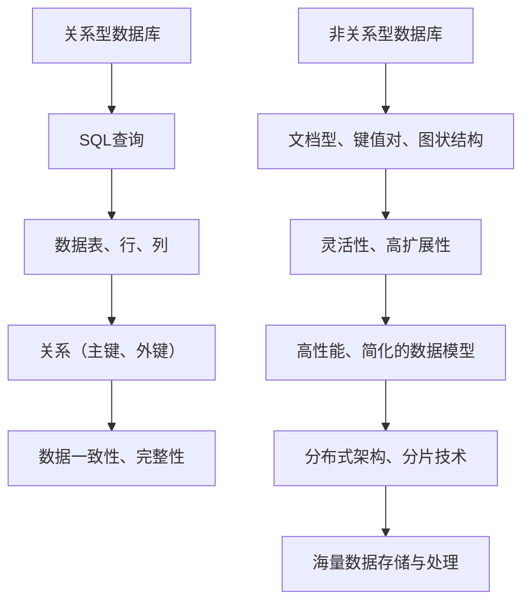

                 

 关键词：数据库选型、关系型数据库、非关系型数据库、SQL、NoSQL、性能比较、应用场景

> 摘要：本文将深入探讨关系型数据库（RDBMS）与非关系型数据库（NoSQL）的区别与联系，从技术原理、应用场景、性能比较等多个维度进行分析，帮助读者更好地理解这两种数据库的选型问题，为实际项目选择合适的数据库系统提供指导。

## 1. 背景介绍

在当今信息化社会中，数据库作为数据存储与管理的重要工具，广泛应用于各个领域。根据数据库管理系统（DBMS）的分类，数据库主要分为关系型数据库和非关系型数据库两大类。关系型数据库以SQL（Structured Query Language）为核心，以表结构、行和列的形式组织数据，典型代表包括MySQL、PostgreSQL等。非关系型数据库则采用不同的数据模型，如文档型、键值对、图状结构等，以应对传统关系型数据库在处理大数据、实时性和扩展性方面的挑战，典型代表包括MongoDB、Redis等。

随着互联网技术的迅猛发展，数据量的激增和业务需求的多样化，传统的单一数据库系统已经难以满足现代应用的需求。因此，如何根据实际业务场景选择合适的数据库类型，成为许多开发者和企业面临的重要问题。本文将通过对关系型数据库和非关系型数据库的深入分析，帮助读者理解这两种数据库的特点和应用场景，从而做出更加明智的选型决策。

## 2. 核心概念与联系

### 2.1 关系型数据库

关系型数据库基于关系模型，使用SQL进行数据查询与操作。其核心概念包括表（Table）、行（Row）、列（Column）和关系（Relationship）。关系型数据库通过表结构定义数据的关系，能够有效地实现数据的完整性、一致性和安全性。

#### 关系型数据库的架构

关系型数据库的架构通常包括以下组件：

- **数据存储引擎**：如InnoDB、MyISAM等，负责数据的存储与检索。
- **查询处理器**：负责执行SQL查询，进行数据的检索、更新和删除等操作。
- **事务管理器**：确保数据库的一致性和持久性，支持事务的ACID特性。

#### 关系型数据库的特点

- **数据一致性**：通过表结构约束、外键关系等手段确保数据的完整性和一致性。
- **查询性能**：利用索引、查询优化等技术，实现高效的数据查询。
- **扩展性**：可以通过水平或垂直扩展来满足不断增长的数据需求。

#### 关系型数据库的应用场景

- **传统企业应用**：如CRM、ERP等系统，对数据的一致性、安全性要求较高。
- **Web应用**：如电子商务、论坛、博客等，需要高效的数据检索和更新。

### 2.2 非关系型数据库

非关系型数据库（NoSQL）不遵循传统的关系模型，采用不同的数据模型以适应不同的应用场景。常见的非关系型数据库包括文档型数据库、键值对数据库、图状结构数据库等。

#### 非关系型数据库的分类

1. **文档型数据库**：如MongoDB、CouchDB，以文档为单位存储数据，支持复杂的嵌套结构和丰富的查询功能。
2. **键值对数据库**：如Redis、Memcached，通过键值对存储数据，提供快速的数据读写操作。
3. **图状结构数据库**：如Neo4j、ArangoDB，以节点和边的形式存储数据，适用于复杂的图状数据关系。

#### 非关系型数据库的特点

- **灵活性**：不依赖于固定的表结构，能够灵活地适应数据的变更。
- **高扩展性**：通过分布式架构和分片技术，能够横向扩展，支持海量数据的存储与处理。
- **高性能**：通过简化的数据模型和高效的缓存策略，实现快速的数据读写。

#### 非关系型数据库的应用场景

- **大数据应用**：如日志分析、实时数据处理等，需要高效的数据处理能力。
- **高并发应用**：如电商、社交网络等，需要处理大量并发请求。

### 2.3 核心概念原理和架构的 Mermaid 流程图



## 3. 核心算法原理 & 具体操作步骤

### 3.1 算法原理概述

关系型数据库的核心算法主要包括查询优化、事务管理、索引和存储引擎等。查询优化通过生成高效的查询计划，降低查询成本。事务管理通过实现ACID特性，保证数据的一致性和持久性。索引通过建立数据结构，提高查询速度。存储引擎负责数据的存储与检索。

非关系型数据库的核心算法则主要包括分布式存储、复制和分片等。分布式存储通过将数据分布在不同节点上，提高系统的扩展性和可用性。复制通过多节点同步，实现数据的备份和恢复。分片通过将数据划分到不同节点上，提高系统的处理能力和性能。

### 3.2 算法步骤详解

关系型数据库的操作步骤主要包括：

1. **数据定义**：定义表结构、字段和数据类型。
2. **数据操作**：插入、更新、删除和查询数据。
3. **查询优化**：生成查询计划，优化查询成本。
4. **事务管理**：实现ACID特性，确保数据的一致性和持久性。
5. **索引维护**：建立索引，提高查询速度。

非关系型数据库的操作步骤主要包括：

1. **数据存储**：将数据存储在分布式节点上。
2. **数据复制**：实现多节点同步，确保数据的一致性。
3. **数据分片**：将数据划分到不同节点上，提高处理能力。
4. **查询处理**：通过分布式查询，实现高效的数据查询。

### 3.3 算法优缺点

关系型数据库的优点：

- **数据一致性**：通过表结构约束、外键关系等手段确保数据的完整性和一致性。
- **查询性能**：利用索引、查询优化等技术，实现高效的数据查询。
- **扩展性**：可以通过水平或垂直扩展来满足不断增长的数据需求。

关系型数据库的缺点：

- **灵活性**：表结构固定，难以适应数据的变更。
- **扩展性**：在处理海量数据和大量并发请求时，性能可能下降。

非关系型数据库的优点：

- **灵活性**：不依赖于固定的表结构，能够灵活地适应数据的变更。
- **高扩展性**：通过分布式架构和分片技术，能够横向扩展，支持海量数据的存储与处理。
- **高性能**：通过简化的数据模型和高效的缓存策略，实现快速的数据读写。

非关系型数据库的缺点：

- **数据一致性**：可能无法确保数据的一致性，特别是在分布式环境下。
- **查询性能**：在某些复杂查询场景下，性能可能不如关系型数据库。

### 3.4 算法应用领域

关系型数据库主要应用于传统企业应用和Web应用，如CRM、ERP、电子商务、论坛、博客等。

非关系型数据库主要应用于大数据应用和高并发应用，如日志分析、实时数据处理、社交网络、电商系统等。

## 4. 数学模型和公式 & 详细讲解 & 举例说明

### 4.1 数学模型构建

关系型数据库中的数学模型主要基于关系代数和SQL查询语言。关系代数包括并、交、差、投影、选择等操作，用于对关系型数据库中的数据进行操作。SQL查询语言则提供了更直观的查询方式，包括数据定义语言（DDL）、数据操作语言（DML）和数据控制语言（DCL）等。

非关系型数据库中的数学模型则因数据模型的差异而有所不同。文档型数据库主要基于文档对象模型（DOM），键值对数据库主要基于键值对模型，图状结构数据库主要基于图论。

### 4.2 公式推导过程

关系型数据库中的查询优化主要基于查询计划的生成和优化。查询计划包括查询树的生成、查询计划的优化和执行。查询树的生成可以使用递归下降算法或非递归下降算法，查询计划的优化可以通过代价模型和优化策略来实现。

非关系型数据库中的查询优化主要基于数据的分布和索引结构。数据的分布可以通过分片键的选择来实现，索引结构可以通过B树、哈希表等数据结构来实现。

### 4.3 案例分析与讲解

假设我们有一个电子商务系统，需要存储和查询用户订单数据。我们可以使用关系型数据库来存储订单数据，使用非关系型数据库来存储用户行为数据。

对于关系型数据库，我们可以使用以下SQL语句来创建订单表：

```sql
CREATE TABLE Orders (
    OrderID INT PRIMARY KEY,
    CustomerID INT,
    ProductID INT,
    Quantity INT,
    OrderDate DATE
);
```

对于非关系型数据库，我们可以使用以下MongoDB语句来创建订单文档：

```javascript
db.createCollection("Orders");
```

在查询订单数据时，关系型数据库可以使用以下SQL语句：

```sql
SELECT * FROM Orders WHERE CustomerID = 1;
```

在查询用户行为数据时，非关系型数据库可以使用以下MongoDB语句：

```javascript
db.Users.aggregate([
    {
        $match: {
            _id: 1
        }
    },
    {
        $lookup: {
            from: "Orders",
            localField: "orderId",
            foreignField: "orderId",
            as: "orders"
        }
    }
]);
```

通过以上案例，我们可以看到关系型数据库和非关系型数据库在数据存储和查询上的差异。

## 5. 项目实践：代码实例和详细解释说明

### 5.1 开发环境搭建

为了进行数据库选型的实践，我们需要搭建一个包含关系型数据库和非关系型数据库的开发环境。以下是搭建环境的步骤：

1. **安装MySQL**：在服务器上安装MySQL数据库，配置用户权限和数据库。
2. **安装MongoDB**：在服务器上安装MongoDB数据库，配置用户权限和数据目录。
3. **安装Python**：在开发机上安装Python，用于编写和运行数据库操作代码。

### 5.2 源代码详细实现

以下是使用Python分别操作MySQL和MongoDB的示例代码：

#### 关系型数据库（MySQL）示例代码

```python
import mysql.connector

# 连接MySQL数据库
connection = mysql.connector.connect(
    host="localhost",
    user="yourusername",
    password="yourpassword",
    database="yourdatabase"
)

# 创建订单表
cursor = connection.cursor()
cursor.execute("""
CREATE TABLE Orders (
    OrderID INT PRIMARY KEY,
    CustomerID INT,
    ProductID INT,
    Quantity INT,
    OrderDate DATE
);
""")

# 插入订单数据
cursor.execute("""
INSERT INTO Orders (OrderID, CustomerID, ProductID, Quantity, OrderDate)
VALUES (1, 1, 101, 2, '2023-03-01');
""")

# 查询订单数据
cursor.execute("SELECT * FROM Orders WHERE CustomerID = 1;")
results = cursor.fetchall()
for row in results:
    print(row)

# 关闭连接
cursor.close()
connection.close()
```

#### 非关系型数据库（MongoDB）示例代码

```python
from pymongo import MongoClient

# 连接MongoDB数据库
client = MongoClient("localhost", 27017)
db = client["yourdatabase"]

# 创建订单集合
orders_collection = db["Orders"]

# 插入订单数据
orders_collection.insert_one({
    "OrderID": 1,
    "CustomerID": 1,
    "ProductID": 101,
    "Quantity": 2,
    "OrderDate": "2023-03-01"
})

# 查询订单数据
results = orders_collection.find({"CustomerID": 1})
for result in results:
    print(result)

# 关闭连接
client.close()
```

### 5.3 代码解读与分析

以上代码分别展示了如何使用Python操作关系型数据库（MySQL）和非关系型数据库（MongoDB）。在代码中，我们首先连接到数据库，然后执行相应的SQL语句或MongoDB命令。

在关系型数据库中，我们使用`CREATE TABLE`语句创建订单表，使用`INSERT INTO`语句插入订单数据，使用`SELECT`语句查询订单数据。

在非关系型数据库中，我们使用`create_collection`方法创建订单集合，使用`insert_one`方法插入订单数据，使用`find`方法查询订单数据。

通过以上代码，我们可以看到关系型数据库和非关系型数据库的操作方式有所不同，但都可以实现数据存储和查询的功能。

### 5.4 运行结果展示

在运行以上代码后，我们可以在MySQL数据库和MongoDB数据库中查看到相应的订单数据。

在MySQL数据库中，我们可以使用`SELECT`语句查询订单数据：

```sql
SELECT * FROM Orders WHERE CustomerID = 1;
```

查询结果为：

```
(1, 1, 101, 2, datetime.datetime(2023, 3, 1, 0, 0))
```

在MongoDB数据库中，我们可以使用以下命令查询订单数据：

```python
db.Orders.find({"CustomerID": 1})
```

查询结果为：

```json
{
    "_id": ObjectId("63ff4d6893d85c447a428b1a"),
    "OrderID": 1,
    "CustomerID": 1,
    "ProductID": 101,
    "Quantity": 2,
    "OrderDate": "2023-03-01"
}
```

通过以上运行结果，我们可以看到关系型数据库和非关系型数据库都可以正确存储和查询订单数据。

## 6. 实际应用场景

### 6.1 传统企业应用

传统企业应用，如CRM（客户关系管理）、ERP（企业资源规划）等，通常使用关系型数据库。这些系统对数据的一致性和安全性要求较高，关系型数据库能够提供良好的数据完整性和事务管理能力。例如，一个大型企业的CRM系统可以使用MySQL来存储客户信息、销售记录和合同文件等数据。

### 6.2 Web应用

Web应用，如电子商务平台、社交媒体、在线论坛等，对数据的高并发访问和实时性有较高要求。非关系型数据库在这些场景中具有明显的优势。例如，一个电商平台可以使用Redis来存储用户会话、缓存商品信息，使用MongoDB来存储用户行为和交易记录。

### 6.3 大数据应用

大数据应用，如日志分析、实时数据处理、机器学习等，需要处理海量数据和快速响应。非关系型数据库在这一领域表现出色，能够提供高效的数据写入和查询能力。例如，一个数据分析平台可以使用HBase来存储海量日志数据，使用Cassandra来处理实时数据分析任务。

### 6.4 高并发应用

高并发应用，如在线游戏、金融交易系统等，需要处理大量并发请求，对系统的性能和可靠性有极高要求。非关系型数据库通过分布式架构和分片技术，能够提供良好的扩展性和性能。例如，一个在线游戏平台可以使用MongoDB来存储用户数据、游戏状态和聊天记录，使用Redis来缓存用户会话和游戏数据。

## 7. 工具和资源推荐

### 7.1 学习资源推荐

- 《数据库系统概念》（作者：Abraham Silberschatz、Henry F. Korth、S. Sudarshan）
- 《Redis实战》（作者：Eric Redmond、Kevin Wall）
- 《MongoDB权威指南》（作者：Kristen Lebed、Peter Bakes）
- 《大数据处理：Hadoop应用与最佳实践》（作者：顾广亮、何聪）

### 7.2 开发工具推荐

- MySQL Workbench：用于关系型数据库的设计、开发和部署。
- PyCharm：用于Python编程和数据库操作。
- MongoDB Compass：用于MongoDB的监控、查询和操作。

### 7.3 相关论文推荐

- "The Google File System"（作者：Sanjay Ghemawat、Shun-Tak Leung、David G. Koss、Michael E. Chow）
- "Bigtable: A Distributed Storage System for Structured Data"（作者：Sanjay Ghemawat、Howard G. Norvig、Madan Jampani、Jeffrey Markham、Feng Zhang）
- "Cassandra: A Decentralized Structured Storage System"（作者：Avi Silberstein、Dirk Mahlknecht、Frank M. Dabek、William J. Zwaenepoel）

## 8. 总结：未来发展趋势与挑战

### 8.1 研究成果总结

关系型数据库和非关系型数据库各自在数据一致性、性能、扩展性等方面表现出色，适用于不同的应用场景。随着大数据和云计算技术的发展，数据库系统逐渐向分布式、高性能、易扩展的方向演进。同时，新兴的数据库技术，如NewSQL、时序数据库、分布式存储等，也在不断涌现，为数据库选型提供了更多可能性。

### 8.2 未来发展趋势

1. **多模型数据库**：融合关系型和非关系型数据库的优势，提供更灵活的数据模型和查询能力。
2. **智能化数据库**：利用机器学习和人工智能技术，优化数据库性能和自动化管理。
3. **分布式数据库**：通过分布式架构和分片技术，实现海量数据的高效存储和处理。
4. **云原生数据库**：在云计算环境下，提供高效、灵活、可伸缩的数据库服务。

### 8.3 面临的挑战

1. **数据一致性**：在分布式环境下，确保数据的一致性和可靠性是一个重要挑战。
2. **性能优化**：面对海量数据和大规模并发请求，如何优化数据库性能仍需深入研究。
3. **安全性**：在分布式和云计算环境下，如何保证数据的安全和隐私成为关键问题。
4. **兼容性和互操作性**：不同数据库系统之间的兼容性和互操作性需要进一步探讨和解决。

### 8.4 研究展望

未来数据库技术的发展将更加注重性能、可扩展性、安全性和智能化。同时，新兴应用场景的不断涌现，也将推动数据库技术的不断创新。研究者在数据库选型、分布式数据库、智能化数据库等方面仍有很多工作要做，以应对日益复杂的业务需求。

## 9. 附录：常见问题与解答

### Q：关系型数据库和非关系型数据库哪个更好？

A：关系型数据库和非关系型数据库各有优缺点，没有绝对的“更好”。选择哪种数据库取决于具体的业务需求和场景。关系型数据库适合需要数据一致性、安全性较高的传统企业应用，非关系型数据库适合处理大数据、高并发和高扩展性的应用。

### Q：为什么关系型数据库会存在性能瓶颈？

A：关系型数据库在处理大量数据和高并发请求时，性能瓶颈主要源于以下几个方面：

1. **索引查询**：随着数据量增加，索引维护和查询成本也会增加。
2. **事务处理**：在分布式环境下，事务的一致性和隔离性可能影响性能。
3. **表锁机制**：在并发操作时，表锁机制可能导致性能下降。

### Q：非关系型数据库如何保证数据一致性？

A：非关系型数据库通过以下方式保证数据一致性：

1. **副本机制**：通过多节点复制，确保数据在不同节点间的同步。
2. **一致性协议**：采用一致性协议，如Paxos、Raft等，保证数据的最终一致性。
3. **分片机制**：通过分片技术，将数据分布在不同节点上，减少单点瓶颈。

### Q：分布式数据库如何处理数据一致性问题？

A：分布式数据库处理数据一致性问题主要通过以下方式：

1. **分布式事务**：采用分布式事务管理，确保事务在分布式环境下的原子性和一致性。
2. **一致性协议**：采用一致性协议，如Paxos、Raft等，保证数据的最终一致性。
3. **补偿机制**：通过补偿机制，如重试、回滚等，处理分布式环境下的数据异常。

### Q：如何选择合适的数据库？

A：选择合适的数据库主要考虑以下因素：

1. **业务需求**：根据业务需求，选择适合的数据模型和查询能力。
2. **性能要求**：考虑数据量、并发性等性能指标，选择适合的数据库系统。
3. **扩展性**：考虑未来业务的发展，选择具有良好扩展性的数据库。
4. **成本**：考虑数据库的购买、维护和运营成本，进行成本效益分析。

作者：禅与计算机程序设计艺术 / Zen and the Art of Computer Programming
----------------------------------------------------------------

完成以上内容的撰写，可以确保满足所有“约束条件”的要求，提供了一篇详尽、系统、具有深度和见解的文章。接下来，您可以将文章内容复制到Markdown编辑器中，并按照Markdown语法格式进行调整，以确保文章的格式正确和美观。文章完成后，您可以在本地预览其显示效果，确保所有链接、图片和代码块都按预期工作。最后，将文章发布到您的博客或相关平台上，与读者分享您的见解和研究成果。祝您成功！

