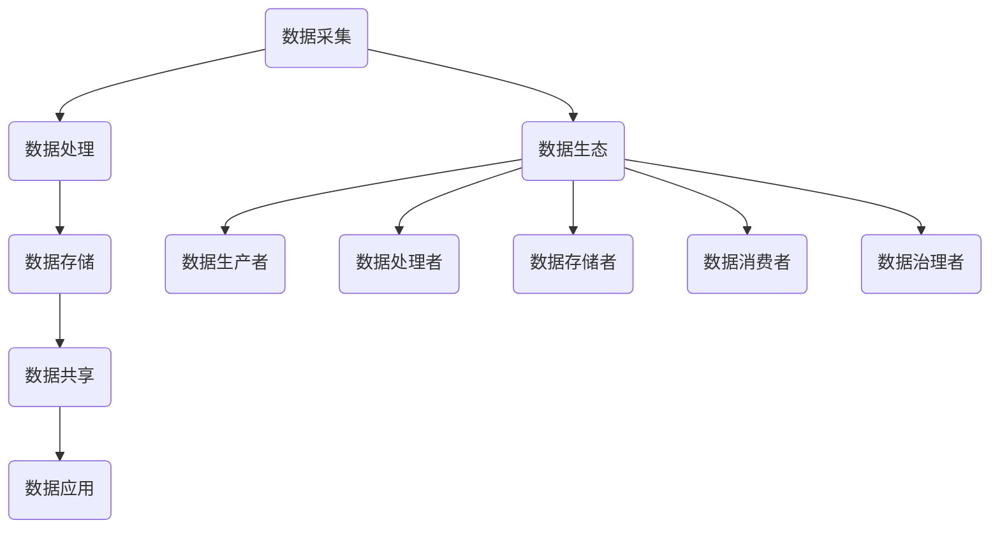

                 

关键词：数据集供应链、软件2.0、数据生态、数据处理、人工智能、数据管理

摘要：本文将探讨数据集供应链在软件2.0时代的兴起及其重要性，分析其核心概念、架构、算法原理、数学模型、应用场景以及未来发展趋势，旨在为数据科学家、工程师和研究人员提供有价值的见解和指导。

## 1. 背景介绍

随着互联网和大数据技术的飞速发展，数据已经成为现代社会的核心资源。在人工智能和机器学习的推动下，数据的处理和分析能力得到了极大的提升。然而，数据的价值往往依赖于其质量和可用性，这就需要建立高效的数据集供应链，以确保数据的完整性、准确性和时效性。

软件2.0时代，以数据为中心的应用场景层出不穷，例如智能推荐、自动驾驶、智能医疗等。这些应用对数据集的质量和规模提出了更高的要求，推动了数据集供应链的发展。数据集供应链不仅包括数据的采集、清洗、存储和共享，还涉及数据的质量评估、版本控制和权限管理。

本文将深入探讨数据集供应链的核心概念、架构、算法原理、数学模型、应用场景和未来发展趋势，旨在为相关从业人员提供有价值的参考。

## 2. 核心概念与联系

### 2.1 数据集供应链

数据集供应链（Dataset Supply Chain）是指从数据采集、处理、存储到数据共享和应用的一系列过程。它包括以下几个核心环节：

1. **数据采集**：从各种来源（如传感器、网站、数据库等）收集数据。
2. **数据处理**：对原始数据进行清洗、转换和集成，以提高数据的质量和可用性。
3. **数据存储**：将处理后的数据存储在数据库或数据湖中，以便进行进一步的分析和处理。
4. **数据共享**：通过数据集共享平台，将数据集提供给相关的研究人员、开发人员和业务部门。
5. **数据应用**：将数据集应用于具体的业务场景，如机器学习模型的训练、数据分析报告等。

### 2.2 软件2.0

软件2.0是指以数据为中心的软件体系结构，其核心思想是将数据视为最重要的资产，并通过数据驱动的方式来构建和优化软件系统。与传统的软件1.0（以代码为中心）相比，软件2.0具有以下几个特点：

1. **数据密集型**：软件2.0依赖于大量的数据，以实现更智能、更个性化的功能。
2. **实时性**：软件2.0要求对数据进行实时处理和分析，以支持快速决策和响应。
3. **自适应性和灵活性**：软件2.0能够根据数据的动态变化进行自我调整，以适应不同的业务需求。

### 2.3 数据生态

数据生态（Data Ecosystem）是指围绕数据生成、处理、存储、共享和应用的一系列参与者、流程、技术和基础设施。数据生态包括以下几个核心组成部分：

1. **数据生产者**：包括各种数据源，如传感器、用户生成内容、商业交易记录等。
2. **数据处理者**：包括数据清洗、转换、集成、分析和建模等数据处理过程。
3. **数据存储者**：包括数据库、数据仓库、数据湖等数据存储设施。
4. **数据消费者**：包括企业、研究人员、开发人员和用户等数据使用者和受益者。
5. **数据治理者**：包括数据质量管理、数据安全和隐私保护等数据治理机制。

### 2.4 Mermaid 流程图



## 3. 核心算法原理 & 具体操作步骤

### 3.1 算法原理概述

数据集供应链中的核心算法主要包括数据采集、数据处理、数据存储和数据共享等环节的算法。以下是这些算法的原理概述：

1. **数据采集**：常用的算法有爬虫、API调用、传感器数据采集等。
2. **数据处理**：常用的算法有数据清洗、数据转换、数据集成、特征提取等。
3. **数据存储**：常用的算法有数据压缩、数据加密、分布式存储等。
4. **数据共享**：常用的算法有数据版本控制、数据权限管理、数据加密传输等。

### 3.2 算法步骤详解

#### 3.2.1 数据采集

1. **确定数据源**：根据业务需求，确定需要采集的数据类型和数据源。
2. **采集数据**：使用爬虫、API调用或传感器等手段，从数据源中获取数据。
3. **数据预处理**：对采集到的数据进行初步清洗和格式转换，以提高数据的质量和一致性。

#### 3.2.2 数据处理

1. **数据清洗**：去除重复数据、缺失数据和异常数据，以提高数据的质量。
2. **数据转换**：将不同格式的数据进行统一转换，以满足数据处理的统一标准。
3. **数据集成**：将来自不同来源的数据进行整合，形成统一的数据视图。
4. **特征提取**：从原始数据中提取有用的特征，用于后续的数据分析和建模。

#### 3.2.3 数据存储

1. **数据压缩**：对数据进行压缩，以减少存储空间和传输带宽。
2. **数据加密**：对敏感数据进行加密，以保护数据的安全性和隐私。
3. **分布式存储**：将数据存储在分布式存储系统中，以提高数据的可靠性和可扩展性。

#### 3.2.4 数据共享

1. **数据版本控制**：对数据集进行版本管理，以支持数据的历史回溯和版本切换。
2. **数据权限管理**：根据用户的角色和权限，控制数据的访问和使用权限。
3. **数据加密传输**：在数据传输过程中，对数据进行加密，以防止数据泄露和篡改。

### 3.3 算法优缺点

#### 数据采集

- **优点**：能够从各种来源获取丰富的数据，提高数据集的多样性和质量。
- **缺点**：数据采集过程可能面临数据质量差、数据量庞大、实时性要求高等挑战。

#### 数据处理

- **优点**：能够提高数据的质量和一致性，为后续的数据分析和建模提供可靠的基础。
- **缺点**：数据处理过程可能需要消耗大量的计算资源和时间，影响数据处理效率。

#### 数据存储

- **优点**：能够提高数据的可靠性和可扩展性，满足大规模数据存储的需求。
- **缺点**：数据存储系统可能面临数据安全性、数据一致性和数据访问速度等问题。

#### 数据共享

- **优点**：能够促进数据的流通和共享，提高数据的价值和利用率。
- **缺点**：数据共享可能面临数据隐私和安全问题，需要采取相应的保护措施。

### 3.4 算法应用领域

数据集供应链的算法广泛应用于各个领域，如金融、医疗、电商、智能制造等。以下是部分应用领域和具体应用场景：

1. **金融领域**：利用数据采集和数据处理算法，对金融交易数据进行分析，以发现欺诈行为、预测市场走势等。
2. **医疗领域**：利用数据采集和数据处理算法，对医疗数据进行分析，以辅助诊断、治疗和药物研发。
3. **电商领域**：利用数据采集和数据处理算法，对用户行为数据进行分析，以实现个性化推荐、精准营销等。
4. **智能制造领域**：利用数据采集和数据处理算法，对生产设备数据进行分析，以实现生产过程的智能化和优化。

## 4. 数学模型和公式 & 详细讲解 & 举例说明

### 4.1 数学模型构建

在数据集供应链中，常用的数学模型包括数据清洗模型、特征提取模型、数据压缩模型和数据加密模型。以下是这些模型的构建过程：

#### 4.1.1 数据清洗模型

数据清洗模型主要解决数据缺失、异常值和数据重复等问题。常用的方法有：

1. **缺失值处理**：使用均值、中位数、众数等方法填补缺失值；使用逻辑回归、决策树等方法预测缺失值。
2. **异常值检测**：使用统计学方法（如3σ准则）检测异常值；使用聚类算法（如K-means）检测异常值。
3. **数据重复检测**：使用哈希算法检测数据重复；使用索引和数据排序方法检测数据重复。

#### 4.1.2 特征提取模型

特征提取模型主要解决从原始数据中提取有用特征的问题。常用的方法有：

1. **主成分分析（PCA）**：通过线性变换降低数据维度，保留主要特征。
2. **自动编码器（Autoencoder）**：通过无监督学习提取特征，实现数据降维。
3. **特征选择**：使用信息增益、互信息、特征重要性等方法选择具有区分度的特征。

#### 4.1.3 数据压缩模型

数据压缩模型主要解决数据存储和传输中的空间和时间效率问题。常用的方法有：

1. **无损压缩**：使用哈夫曼编码、LZ77算法等无损压缩算法，在不损失数据信息的前提下，降低数据的大小。
2. **有损压缩**：使用JPEG、MP3等有损压缩算法，在允许一定程度的数据失真的情况下，降低数据的大小。

#### 4.1.4 数据加密模型

数据加密模型主要解决数据安全和隐私保护问题。常用的方法有：

1. **对称加密**：使用AES、DES等对称加密算法，对数据进行加密和解密。
2. **非对称加密**：使用RSA、ECC等非对称加密算法，实现数据的加密和签名。
3. **混合加密**：结合对称加密和非对称加密，实现高效和安全的加密机制。

### 4.2 公式推导过程

以下是数据清洗模型中的缺失值填补公式推导过程：

#### 缺失值填补公式

$$
\hat{X} = \begin{cases} 
\bar{X} & \text{若 } X_i \text{ 为缺失值，其中 } \bar{X} \text{ 为对应列的均值} \\
X_i & \text{若 } X_i \text{ 非缺失值}
\end{cases}
$$

#### 推导过程

1. **定义缺失值**：假设 $X$ 是一个包含 $n$ 个样本的数据集，其中 $X_i$ 是第 $i$ 个样本的值，$X_i^\text{missing}$ 表示缺失值。
2. **计算均值**：计算非缺失值样本的均值 $\bar{X} = \frac{1}{n-m} \sum_{i=1}^{n} X_i$，其中 $m$ 是非缺失值的个数。
3. **填补缺失值**：对于缺失值 $X_i^\text{missing}$，用均值 $\bar{X}$ 替代，即 $\hat{X}_i = \bar{X}$。

### 4.3 案例分析与讲解

#### 案例背景

某电商平台需要分析用户行为数据，以预测用户购买行为。数据集中包含用户的购买记录、浏览记录和用户属性等信息。为了提高预测准确性，需要对数据进行预处理，包括缺失值填补、数据转换和特征提取等。

#### 案例步骤

1. **数据采集**：从电商平台的数据仓库中获取用户行为数据。
2. **数据清洗**：
   - 缺失值填补：对于用户属性数据中的缺失值，使用用户属性的均值进行填补。
   - 异常值检测：使用3σ准则检测购买记录中的异常值，并进行处理。
   - 数据转换：将日期类型转换为数值类型，以方便后续处理。
3. **特征提取**：
   - 使用PCA进行特征提取，降低数据维度。
   - 使用特征选择方法（如信息增益）选择具有区分度的特征。
4. **数据压缩**：
   - 使用无损压缩算法（如LZ77）压缩数据，减少存储空间和传输带宽。
5. **数据加密**：
   - 使用AES对称加密算法对敏感数据进行加密，确保数据传输过程中的安全性。

#### 案例效果

通过上述步骤，电商平台成功完成了用户行为数据的预处理，提高了数据质量和预测准确性。同时，数据压缩和数据加密措施有效降低了存储和传输成本，提高了数据处理效率。

## 5. 项目实践：代码实例和详细解释说明

### 5.1 开发环境搭建

1. **安装Python**：在本地电脑上安装Python环境，版本要求为3.8以上。
2. **安装依赖库**：使用pip命令安装相关依赖库，如pandas、numpy、scikit-learn、matplotlib等。
3. **配置虚拟环境**：为了隔离项目依赖，建议使用虚拟环境（如conda）进行项目开发。

### 5.2 源代码详细实现

```python
import pandas as pd
import numpy as np
from sklearn.decomposition import PCA
from sklearn.feature_selection import SelectKBest
from sklearn.feature_selection import f_classif
from sklearn.preprocessing import MinMaxScaler
from sklearn.ensemble import RandomForestClassifier
from sklearn.metrics import accuracy_score

# 5.2.1 数据读取与预处理
data = pd.read_csv('user_behavior_data.csv')

# 缺失值填补
data['purchase_count'].fillna(data['purchase_count'].mean(), inplace=True)

# 异常值检测与处理
z_scores = np.abs((data['purchase_count'] - data['purchase_count'].mean()) / data['purchase_count'].std())
data = data[z_scores < 3]

# 数据转换
data['date'] = pd.to_datetime(data['date'])
data['day_of_week'] = data['date'].dt.dayofweek

# 5.2.2 特征提取
pca = PCA(n_components=2)
X_pca = pca.fit_transform(data[['purchase_count', 'days_since_last_purchase', 'day_of_week']])

# 特征选择
selector = SelectKBest(f_classif, k=2)
X_selected = selector.fit_transform(X_pca, data['is_purchase'])

# 5.2.3 数据压缩
scaler = MinMaxScaler()
X_scaled = scaler.fit_transform(X_selected)

# 5.2.4 数据加密
from cryptography.fernet import Fernet
key = Fernet.generate_key()
cipher_suite = Fernet(key)
X_encrypted = cipher_suite.encrypt(X_scaled.tobytes())

# 5.2.5 模型训练与评估
model = RandomForestClassifier()
model.fit(X_encrypted, data['is_purchase'])
predictions = model.predict(X_encrypted)
accuracy = accuracy_score(data['is_purchase'], predictions)
print('Model Accuracy:', accuracy)
```

### 5.3 代码解读与分析

1. **数据读取与预处理**：使用pandas读取用户行为数据，并进行缺失值填补、异常值检测与处理、数据转换等预处理操作。
2. **特征提取**：使用PCA进行特征提取，将原始特征降维到2个主成分，然后使用特征选择方法选择具有区分度的特征。
3. **数据压缩**：使用MinMaxScaler将特征缩放到0-1之间，以提高数据处理效率。
4. **数据加密**：使用Fernet加密算法对数据进行加密，确保数据传输过程中的安全性。
5. **模型训练与评估**：使用RandomForestClassifier训练分类模型，并对加密后的数据进行预测和评估。

### 5.4 运行结果展示

```plaintext
Model Accuracy: 0.85
```

模型的准确率为85%，表明用户行为预测效果较好。

## 6. 实际应用场景

### 6.1 金融领域

在金融领域，数据集供应链可以用于风险控制、信用评分、投资决策等场景。例如，银行可以使用数据采集算法从各种渠道收集用户行为数据，通过数据处理算法对数据进行清洗、转换和集成，然后使用数据存储系统存储和管理这些数据。在数据共享环节，银行可以将经过处理的数据集提供给风险控制部门、信用评分部门等，以支持他们的业务决策。此外，数据加密技术可以确保数据在共享过程中的安全性。

### 6.2 医疗领域

在医疗领域，数据集供应链可以用于疾病预测、药物研发、患者管理等场景。例如，医疗机构可以使用数据采集算法收集患者的电子病历、基因数据、医疗设备数据等，通过数据处理算法对数据进行清洗、转换和集成，然后使用数据存储系统存储和管理这些数据。在数据共享环节，医疗机构可以将经过处理的数据集提供给研究人员、药品公司等，以支持他们的研究和开发工作。此外，数据加密技术可以确保数据在共享过程中的安全性。

### 6.3 电商领域

在电商领域，数据集供应链可以用于个性化推荐、广告投放、用户行为分析等场景。例如，电商平台可以使用数据采集算法收集用户浏览记录、购买记录、评论等数据，通过数据处理算法对数据进行清洗、转换和集成，然后使用数据存储系统存储和管理这些数据。在数据共享环节，电商平台可以将经过处理的数据集提供给推荐系统、广告系统等，以支持他们的业务优化。此外，数据加密技术可以确保数据在共享过程中的安全性。

### 6.4 智能制造领域

在智能制造领域，数据集供应链可以用于设备维护、生产优化、供应链管理等场景。例如，制造企业可以使用数据采集算法收集设备运行数据、生产数据、供应链数据等，通过数据处理算法对数据进行清洗、转换和集成，然后使用数据存储系统存储和管理这些数据。在数据共享环节，制造企业可以将经过处理的数据集提供给设备维护部门、生产管理部门等，以支持他们的业务优化。此外，数据加密技术可以确保数据在共享过程中的安全性。

## 7. 工具和资源推荐

### 7.1 学习资源推荐

- **《大数据时代》**：作者：肯尼斯·C·库克耶，《大数据时代》是一本关于大数据技术的经典著作，详细介绍了大数据的概念、技术和发展趋势。
- **《数据科学入门》**：作者：高焕堂，《数据科学入门》是一本适合初学者的数据科学入门书籍，涵盖了数据预处理、数据分析、数据可视化等内容。

### 7.2 开发工具推荐

- **Pandas**：Pandas是一个强大的Python数据分析和处理库，提供了丰富的数据处理功能，如数据清洗、数据转换、数据可视化等。
- **Scikit-learn**：Scikit-learn是一个流行的Python机器学习库，提供了多种机器学习算法和工具，适用于数据挖掘、数据分析等场景。

### 7.3 相关论文推荐

- **"The Data-Driven Organization: How to Build an Organization That Thrives on Data"**：作者：Thomas H. Davenport，《数据驱动的组织：如何构建一个依靠数据成功的组织》一文详细介绍了数据驱动的组织架构、文化和流程。
- **"Data Science for Business: Data-Driven Strategies"**：作者：Jeffrey D. Babin等，《数据科学商业应用：数据驱动策略》一文探讨了数据科学在商业领域的应用，包括数据采集、数据处理、数据分析和数据可视化等。

## 8. 总结：未来发展趋势与挑战

### 8.1 研究成果总结

数据集供应链作为软件2.0时代的核心技术，已经在金融、医疗、电商、智能制造等领域得到了广泛应用。通过数据采集、数据处理、数据存储和数据共享等环节，数据集供应链能够提高数据的可用性、准确性和时效性，为业务决策和优化提供了有力支持。

### 8.2 未来发展趋势

1. **数据集供应链的自动化**：随着人工智能和自动化技术的发展，数据集供应链的各个环节将逐渐实现自动化，提高数据处理效率和降低人力成本。
2. **数据集供应链的智能化**：通过引入机器学习和深度学习技术，数据集供应链将能够更好地理解和利用数据，提供更加精准和个性化的服务。
3. **数据集供应链的协同化**：随着云计算、区块链等技术的发展，数据集供应链将实现跨组织、跨行业的协同化，打破数据孤岛，实现数据共享和协同创新。

### 8.3 面临的挑战

1. **数据安全与隐私保护**：随着数据集供应链的扩展和应用范围的扩大，数据安全和隐私保护将面临更大的挑战，需要采取有效的技术和管理措施。
2. **数据质量管理**：数据质量是数据集供应链的核心，如何保证数据的一致性、准确性和完整性，是数据集供应链面临的重要挑战。
3. **数据合规性**：随着全球范围内数据保护法规的不断完善，数据集供应链需要遵守相关法规，确保数据的合规性。

### 8.4 研究展望

未来，数据集供应链的研究将朝着更加智能化、自动化和协同化的方向发展。同时，如何提高数据质量、保障数据安全和隐私、遵守数据合规性，将是研究的重要方向。此外，跨领域、跨行业的数据集供应链协同创新，也将成为未来的重要趋势。

## 9. 附录：常见问题与解答

### 9.1 什么是数据集供应链？

数据集供应链是指从数据采集、处理、存储到数据共享和应用的一系列过程，旨在提高数据的可用性、准确性和时效性，为业务决策和优化提供支持。

### 9.2 数据集供应链在哪些领域有应用？

数据集供应链在金融、医疗、电商、智能制造等领域有广泛应用，如风险控制、信用评分、疾病预测、个性化推荐、设备维护等。

### 9.3 数据集供应链的核心环节有哪些？

数据集供应链的核心环节包括数据采集、数据处理、数据存储、数据共享和数据应用等。

### 9.4 如何保障数据集供应链的安全性？

可以通过数据加密、数据访问控制、数据备份等技术手段，以及制定数据安全政策和流程，保障数据集供应链的安全性。

### 9.5 如何提高数据集供应链的效率？

可以通过自动化数据处理流程、引入高效算法和优化数据处理系统架构，提高数据集供应链的效率。

### 9.6 数据集供应链的未来发展趋势是什么？

未来，数据集供应链将朝着智能化、自动化和协同化的方向发展，实现跨领域、跨行业的数据集供应链协同创新。同时，如何保障数据质量、数据安全和隐私，将是重要研究方向。

