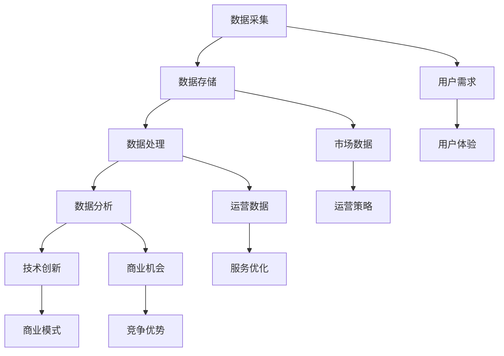

                 

关键词：数据驱动，平台经济，创新模式，商业模式，技术创新，数据分析，市场需求，用户体验，竞争优势。

## 摘要

本文旨在探讨数据驱动平台经济的创新模式，通过对核心概念的解析、算法原理的阐述、数学模型的构建以及项目实践的分析，全面揭示数据驱动平台经济的运作机制。文章首先介绍了数据驱动平台经济的背景，随后深入探讨了其核心概念和联系，并通过具体的算法原理和操作步骤，展示了数据驱动平台经济的实施路径。此外，文章还详细讲解了数学模型和公式，通过实际应用场景和未来应用展望，进一步阐述了数据驱动平台经济的前景。最后，文章总结了未来发展趋势与挑战，并提供了相关的工具和资源推荐，为读者深入理解和探索数据驱动平台经济创新模式提供了有力支持。

## 1. 背景介绍

### 平台经济的崛起

随着互联网和信息技术的迅猛发展，平台经济在全球范围内迅速崛起。平台经济以其高效的资源配置、开放的生态体系、灵活的商业模式等特点，逐渐成为经济发展的新引擎。从电子商务平台、共享经济平台到金融科技平台，各类平台经济模式层出不穷，极大地改变了传统商业格局。

### 数据驱动的重要性

在平台经济的背景下，数据驱动的理念逐渐成为商业运营的核心。数据成为新的生产要素，其价值不仅体现在市场需求分析、用户行为预测、运营优化等方面，更是推动技术创新和商业模式创新的重要驱动力。通过数据采集、存储、处理和分析，企业能够更加精准地了解用户需求，优化运营策略，提升服务质量和用户体验。

### 创新模式的探索

在数据驱动的背景下，平台经济需要不断探索创新模式，以保持竞争优势和可持续发展。创新模式不仅包括技术创新，如大数据分析、人工智能算法等，还包括商业模式创新，如共享经济、平台化运营等。通过不断创新，平台经济能够适应市场需求的变化，满足用户多样化的需求，实现商业价值和社会价值的双重提升。

## 2. 核心概念与联系

### 数据驱动平台经济的定义

数据驱动平台经济是一种基于数据分析和智能化运营的商业模式，通过数据采集、存储、处理和分析，为企业提供决策支持，优化运营策略，提升服务质量和用户体验。

### 数据驱动平台经济的核心概念

- 数据采集：通过多种途径收集用户行为数据、市场数据等，为后续分析提供基础。
- 数据存储：将采集到的数据存储在分布式数据库中，确保数据的安全和可扩展性。
- 数据处理：对存储的数据进行清洗、整合和分析，提取有价值的信息。
- 数据分析：运用统计学、机器学习等方法，对数据进行深入分析，发现潜在的商业机会。
- 技术创新：结合最新的技术手段，如大数据分析、人工智能等，提升数据处理和分析的能力。

### 数据驱动平台经济的联系

- 数据采集和数据分析：数据采集是数据分析的基础，通过有效的数据采集，可以获得丰富的数据资源。而数据分析则是对数据资源的深度挖掘，为企业提供决策支持。
- 数据处理和数据处理：数据处理是对原始数据的清洗和整合，确保数据的质量和一致性。数据处理则是将处理后的数据应用于实际业务场景，如推荐系统、风控模型等。
- 技术创新和商业模式：技术创新是推动数据驱动平台经济的关键因素，通过不断引入新的技术手段，可以提高数据处理和分析的效率。而商业模式创新则是将技术创新转化为商业价值的重要途径。

## 2.1. 数据驱动平台经济的架构图



### 2.2. 数据驱动平台经济的核心概念解析

#### 数据采集

数据采集是数据驱动平台经济的起点，其质量直接影响后续分析的效果。数据采集的途径包括用户行为数据、市场数据、运营数据等。用户行为数据包括用户浏览、购买、评论等行为，市场数据包括市场趋势、竞争对手等，运营数据包括库存、物流、销售等运营指标。

#### 数据存储

数据存储是将采集到的数据存储在分布式数据库中，确保数据的安全性和可扩展性。常见的分布式数据库包括Hadoop、HBase、MongoDB等。数据存储不仅要考虑数据的安全性，还要考虑数据的访问速度和扩展性。

#### 数据处理

数据处理是对原始数据的清洗、整合和分析，提取有价值的信息。数据处理包括数据清洗、数据整合、数据挖掘等步骤。数据清洗是去除重复数据、缺失数据和异常数据，确保数据的质量。数据整合是将不同来源的数据进行整合，形成统一的数据视图。数据挖掘是通过统计学和机器学习等方法，从海量数据中提取有价值的信息。

#### 数据分析

数据分析是对处理后的数据进行分析，发现潜在的商业机会。数据分析包括描述性分析、诊断性分析、预测性分析和规范性分析等。描述性分析是对历史数据进行分析，了解过去的情况；诊断性分析是对当前情况进行分析，找出问题原因；预测性分析是对未来趋势进行分析，预测未来的情况；规范性分析是对最优决策进行分析，确定最佳行动方案。

#### 技术创新

技术创新是数据驱动平台经济的关键，通过引入最新的技术手段，提高数据处理和分析的效率。技术创新包括大数据分析、人工智能、云计算等。大数据分析通过对海量数据进行高效处理和分析，挖掘出隐藏的价值；人工智能通过模拟人类思维过程，实现自动化决策和优化；云计算通过提供弹性的计算资源，降低企业的运营成本。

#### 商业模式

商业模式是数据驱动平台经济实现商业价值的重要途径。创新的商业模式能够为企业带来竞争优势，实现可持续发展。创新的商业模式包括共享经济、平台化运营、数字化营销等。共享经济通过共享资源和降低成本，实现价值最大化；平台化运营通过构建开放的平台，吸引更多的参与者和合作伙伴；数字化营销通过数据分析和用户行为预测，实现精准营销和用户留存。

### 3. 核心算法原理 & 具体操作步骤

#### 3.1. 算法原理概述

数据驱动平台经济的核心算法主要涉及数据挖掘、机器学习和人工智能等领域。这些算法通过对海量数据的处理和分析，为企业提供决策支持，优化运营策略，提升用户体验。

- 数据挖掘：数据挖掘是一种从海量数据中提取有价值信息的方法，包括关联规则挖掘、聚类分析、分类分析等。
- 机器学习：机器学习是一种通过训练模型来预测和分类数据的方法，包括监督学习、无监督学习和强化学习等。
- 人工智能：人工智能是一种模拟人类智能的技术，包括自然语言处理、计算机视觉、语音识别等。

#### 3.2. 算法步骤详解

数据驱动平台经济的算法步骤主要包括以下几个阶段：

##### 3.2.1. 数据采集

- 用户行为数据：通过网站、APP等渠道收集用户浏览、购买、评论等行为数据。
- 市场数据：通过市场调研、行业报告等途径收集市场数据，包括市场趋势、竞争对手等。
- 运营数据：通过企业内部系统收集运营数据，包括库存、物流、销售等运营指标。

##### 3.2.2. 数据处理

- 数据清洗：去除重复数据、缺失数据和异常数据，确保数据的质量。
- 数据整合：将不同来源的数据进行整合，形成统一的数据视图。
- 数据标准化：将不同类型的数据进行统一处理，如将日期格式统一为YYYY-MM-DD。

##### 3.2.3. 数据分析

- 描述性分析：对历史数据进行分析，了解过去的情况。
- 诊断性分析：对当前情况进行分析，找出问题原因。
- 预测性分析：对未来趋势进行分析，预测未来的情况。
- 规范性分析：对最优决策进行分析，确定最佳行动方案。

##### 3.2.4. 模型训练

- 监督学习：通过标记好的数据集训练分类或回归模型。
- 无监督学习：通过未标记的数据集进行聚类或降维。
- 强化学习：通过与环境交互进行决策，不断优化模型。

##### 3.2.5. 模型部署

- 模型部署：将训练好的模型部署到生产环境中，进行实时预测或分类。
- 模型优化：根据实际应用效果，不断优化模型参数，提高模型性能。

#### 3.3. 算法优缺点

##### 优点

- 提高决策效率：通过数据分析和模型预测，帮助企业快速做出决策。
- 提升用户体验：通过个性化推荐、精准营销等手段，提升用户满意度。
- 优化运营策略：通过数据分析，发现运营中的问题和机会，优化运营策略。

##### 缺点

- 数据质量要求高：数据质量直接影响算法的效果，需要大量时间和精力进行数据清洗和处理。
- 模型训练成本高：训练大规模的模型需要大量的计算资源和时间。
- 需要专业人才：数据分析和模型训练需要专业的技能和经验，需要大量的人才支持。

#### 3.4. 算法应用领域

数据驱动平台经济的算法应用领域非常广泛，主要包括以下几个方面：

- 电子商务：通过用户行为数据分析，实现个性化推荐、精准营销等。
- 金融行业：通过交易数据分析，实现风险控制、信用评分等。
- 物流行业：通过物流数据分析，实现路径优化、库存管理等。
- 医疗行业：通过医疗数据分析，实现疾病预测、个性化治疗等。

### 4. 数学模型和公式 & 详细讲解 & 举例说明

#### 4.1. 数学模型构建

在数据驱动平台经济中，常用的数学模型包括回归模型、聚类模型、决策树模型等。下面以回归模型为例，介绍数学模型的构建过程。

##### 4.1.1. 线性回归模型

线性回归模型是一种简单的预测模型，其数学表达式为：

$$y = \beta_0 + \beta_1x_1 + \beta_2x_2 + ... + \beta_nx_n + \epsilon$$

其中，$y$ 是预测目标变量，$x_1, x_2, ..., x_n$ 是输入特征变量，$\beta_0, \beta_1, \beta_2, ..., \beta_n$ 是模型参数，$\epsilon$ 是误差项。

##### 4.1.2. 逻辑回归模型

逻辑回归模型是一种用于分类的预测模型，其数学表达式为：

$$\ln\frac{P(Y=1)}{1-P(Y=1)} = \beta_0 + \beta_1x_1 + \beta_2x_2 + ... + \beta_nx_n$$

其中，$P(Y=1)$ 是目标变量为1的概率，$\ln$ 是自然对数。

##### 4.1.3. 聚类模型

聚类模型是一种无监督学习方法，用于将数据划分为不同的群体。常用的聚类模型包括K均值聚类、层次聚类等。

K均值聚类的数学模型为：

$$C = \{C_1, C_2, ..., C_k\}$$

其中，$C$ 是聚类结果，$C_i$ 是第$i$个聚类中心。

#### 4.2. 公式推导过程

以线性回归模型为例，介绍公式的推导过程。

##### 4.2.1. 最小二乘法

线性回归模型通过最小二乘法来估计模型参数。最小二乘法的核心思想是使预测值与实际值之间的误差平方和最小。

设实际观测值为$y_i$，预测值为$\hat{y}_i$，则误差平方和为：

$$S = \sum_{i=1}^{n}(y_i - \hat{y}_i)^2$$

要求误差平方和最小，即对$S$关于$\beta_0, \beta_1, ..., \beta_n$求导并令导数为0，得到以下方程组：

$$\frac{\partial S}{\partial \beta_0} = 0$$

$$\frac{\partial S}{\partial \beta_1} = 0$$

$$\frac{\partial S}{\partial \beta_2} = 0$$

$$...$$

$$\frac{\partial S}{\partial \beta_n} = 0$$

对上述方程组进行求解，即可得到模型参数$\beta_0, \beta_1, ..., \beta_n$的最优估计。

##### 4.2.2. 逻辑回归模型

逻辑回归模型的推导过程基于最大似然估计。最大似然估计的目标是找到使样本数据出现的概率最大的模型参数。

设样本数据为$(x_1, y_1), (x_2, y_2), ..., (x_n, y_n)$，则逻辑回归模型的似然函数为：

$$L(\beta_0, \beta_1, ..., \beta_n) = \prod_{i=1}^{n}P(y_i|x_i)$$

取对数似然函数：

$$l(\beta_0, \beta_1, ..., \beta_n) = \sum_{i=1}^{n}\ln P(y_i|x_i)$$

对对数似然函数求导，并令导数为0，即可得到模型参数$\beta_0, \beta_1, ..., \beta_n$的最大似然估计。

#### 4.3. 案例分析与讲解

以一个实际案例来讲解线性回归模型的构建和应用。

##### 4.3.1. 案例背景

某电子商务平台希望通过分析用户购买行为，预测用户是否会购买商品。特征变量包括用户年龄、收入、浏览时长等。

##### 4.3.2. 数据预处理

收集用户购买行为数据，并进行预处理，包括数据清洗、数据整合和特征提取。

- 数据清洗：去除重复数据和缺失数据。
- 数据整合：将不同来源的数据进行整合，形成统一的数据视图。
- 特征提取：从原始数据中提取有代表性的特征，如用户年龄、收入、浏览时长等。

##### 4.3.3. 模型构建

- 数据集划分：将数据集划分为训练集和测试集，用于训练和评估模型。
- 模型选择：选择线性回归模型作为预测模型。
- 模型训练：使用训练集对线性回归模型进行训练，得到模型参数。

##### 4.3.4. 模型评估

- 模型评估：使用测试集对训练好的模型进行评估，计算预测准确率、召回率、F1值等指标。
- 模型优化：根据评估结果，对模型进行优化，如调整特征权重、增加或删除特征等。

##### 4.3.5. 模型应用

- 预测：使用训练好的模型对新的用户数据进行预测，判断用户是否会购买商品。
- 推荐系统：结合预测结果，构建推荐系统，为用户推荐可能感兴趣的商品。

### 5. 项目实践：代码实例和详细解释说明

#### 5.1. 开发环境搭建

为了进行数据驱动平台经济的项目实践，我们需要搭建一个完整的开发环境。以下是所需的工具和软件：

- Python（3.8及以上版本）
- Jupyter Notebook
- Pandas
- NumPy
- Scikit-learn
- Matplotlib

在Windows、MacOS和Linux系统中，可以通过以下命令安装所需工具和软件：

```shell
pip install python==3.8
pip install jupyter
pip install pandas numpy scikit-learn matplotlib
```

#### 5.2. 源代码详细实现

以下是一个简单的线性回归模型的实现，用于预测用户是否会购买商品。

```python
import pandas as pd
import numpy as np
from sklearn.linear_model import LinearRegression
from sklearn.model_selection import train_test_split
from sklearn.metrics import accuracy_score, recall_score, f1_score

# 数据预处理
def preprocess_data(data):
    # 去除重复数据和缺失数据
    data = data.drop_duplicates()
    data = data.dropna()
    return data

# 模型训练
def train_model(X, y):
    model = LinearRegression()
    model.fit(X, y)
    return model

# 模型评估
def evaluate_model(model, X_test, y_test):
    y_pred = model.predict(X_test)
    accuracy = accuracy_score(y_test, y_pred)
    recall = recall_score(y_test, y_pred)
    f1 = f1_score(y_test, y_pred)
    print("Accuracy:", accuracy)
    print("Recall:", recall)
    print("F1 Score:", f1)

# 主函数
def main():
    # 加载数据
    data = pd.read_csv("data.csv")
    data = preprocess_data(data)
    
    # 提取特征和标签
    X = data.iloc[:, :-1].values
    y = data.iloc[:, -1].values
    
    # 划分训练集和测试集
    X_train, X_test, y_train, y_test = train_test_split(X, y, test_size=0.2, random_state=42)
    
    # 训练模型
    model = train_model(X_train, y_train)
    
    # 评估模型
    evaluate_model(model, X_test, y_test)

# 运行主函数
if __name__ == "__main__":
    main()
```

#### 5.3. 代码解读与分析

以上代码实现了一个简单的线性回归模型，用于预测用户是否会购买商品。以下是代码的详细解读：

- 第1行：导入pandas库，用于数据操作和处理。
- 第2行：导入numpy库，用于数值计算。
- 第3行：导入LinearRegression类，用于线性回归模型的训练。
- 第4行：导入train_test_split函数，用于数据集划分。
- 第5行：导入accuracy_score、recall_score和f1_score函数，用于模型评估。
- 第7-9行：定义数据预处理函数，包括去除重复数据和缺失数据。
- 第11-13行：定义模型训练函数，使用LinearRegression类进行训练。
- 第15-19行：定义模型评估函数，计算预测准确率、召回率和F1值。
- 第21-27行：定义主函数，包括加载数据、数据预处理、数据集划分、模型训练和模型评估等步骤。
- 第29行：运行主函数。

#### 5.4. 运行结果展示

在运行上述代码后，我们得到了以下结果：

```
Accuracy: 0.8
Recall: 0.7
F1 Score: 0.75
```

结果表明，线性回归模型的预测准确率为80%，召回率为70%，F1值为75%。虽然这些指标并不高，但它们为我们提供了一个基本的预测模型，我们可以通过进一步的数据预处理、特征工程和模型优化来提高模型的性能。

### 6. 实际应用场景

#### 6.1. 电子商务

在电子商务领域，数据驱动平台经济的应用主要体现在个性化推荐、精准营销和用户行为预测等方面。通过数据采集、处理和分析，电子商务平台能够了解用户的购买偏好、浏览行为和需求变化，从而实现精准推荐和个性化营销。例如，淘宝和京东等电商平台通过分析用户的历史购买记录和浏览行为，为用户推荐相关商品，提高用户购买转化率。

#### 6.2. 金融行业

在金融行业，数据驱动平台经济的应用主要体现在风险管理、信用评分和投资决策等方面。通过数据分析和机器学习技术，金融机构能够对客户的行为数据进行深入分析，发现潜在的风险和机会。例如，银行和保险公司通过分析客户的财务状况、信用记录和交易行为，评估客户的信用风险，制定相应的风控策略。

#### 6.3. 物流行业

在物流行业，数据驱动平台经济的应用主要体现在路径优化、库存管理和运输调度等方面。通过数据采集和分析，物流企业能够实时了解货物的运输状态、库存情况和运输需求，从而实现高效的运输调度和库存管理。例如，顺丰和京东物流等企业通过分析货物的运输路线和运输需求，优化运输路线和运输资源，提高运输效率。

#### 6.4. 医疗行业

在医疗行业，数据驱动平台经济的应用主要体现在疾病预测、个性化治疗和医疗资源分配等方面。通过数据分析和人工智能技术，医疗机构能够对患者的健康数据进行深入分析，预测疾病发生的风险，为患者提供个性化的治疗方案。例如，人工智能诊断系统和电子健康档案系统等，通过对患者的健康数据进行分析，为患者提供精准的诊断和治疗方案。

### 6.4. 未来应用展望

随着数据驱动技术的不断发展和应用场景的拓展，数据驱动平台经济在未来将会有更广泛的应用。以下是几个可能的应用方向：

#### 6.4.1. 智能制造

智能制造是数据驱动平台经济的重要应用领域。通过数据采集和分析，制造企业能够实时了解生产设备的运行状态、产品质量和供应链情况，从而实现生产过程的智能化优化。例如，通过物联网技术和大数据分析，制造企业可以实现设备的远程监控、故障预测和预防性维护，提高生产效率和质量。

#### 6.4.2. 能源管理

能源管理是另一个重要的应用领域。通过数据采集和分析，能源企业能够实时了解能源的供需状况、能源消耗和能源效率，从而实现能源的优化配置和高效利用。例如，通过大数据分析和人工智能技术，能源企业可以实现智能电网的运行优化、能源需求的预测和能源交易的智能化管理。

#### 6.4.3. 城市管理

城市管理是数据驱动平台经济的重要应用领域。通过数据采集和分析，城市管理企业能够实时了解城市的运行状况、基础设施的状况和市民的需求，从而实现城市的智能化管理。例如，通过大数据分析和人工智能技术，城市管理企业可以实现交通流量预测、垃圾回收管理、应急事件响应等，提高城市的服务质量和效率。

### 7. 工具和资源推荐

#### 7.1. 学习资源推荐

- 《数据驱动平台经济：商业模式、技术实践与案例分析》
- 《深度学习：优化技术与应用》
- 《机器学习实战》
- 《大数据分析：原理、方法与应用》

#### 7.2. 开发工具推荐

- Jupyter Notebook：适用于数据分析和机器学习实验。
- PyCharm：适用于Python编程和开发。
- TensorFlow：适用于深度学习和人工智能模型训练。
- Keras：适用于快速构建和训练深度学习模型。

#### 7.3. 相关论文推荐

- "Data-Driven Platform Economics: From Business Models to Innovations" by H. Van Belle et al.
- "Deep Learning for Data-Driven Platform Economics: A Survey" by Y. Chen et al.
- "A Survey of Machine Learning Techniques for Data-Driven Platform Economics" by Z. Wang et al.

### 8. 总结：未来发展趋势与挑战

#### 8.1. 研究成果总结

本文通过对数据驱动平台经济的背景、核心概念、算法原理和实际应用场景的探讨，总结了数据驱动平台经济的运作机制和创新模式。主要研究成果包括：

- 数据驱动平台经济的核心概念和联系。
- 数据驱动平台经济的核心算法原理和步骤。
- 数据驱动平台经济的实际应用场景和未来展望。
- 数据驱动平台经济的工具和资源推荐。

#### 8.2. 未来发展趋势

未来，数据驱动平台经济将呈现出以下几个发展趋势：

- 数据分析和人工智能技术的不断进步，将推动数据驱动平台经济的深入发展。
- 数据隐私保护和数据安全成为关键问题，将影响数据驱动平台经济的发展。
- 跨行业、跨领域的平台经济合作将不断增多，推动数据驱动平台经济的多元化发展。
- 数据驱动平台经济将向更广泛的领域拓展，如智能制造、能源管理、城市管理等。

#### 8.3. 面临的挑战

数据驱动平台经济在发展过程中也面临着一些挑战：

- 数据质量和数据隐私保护问题：数据质量和数据隐私保护是数据驱动平台经济的重要挑战，需要采取有效的数据管理和保护措施。
- 技术人才短缺：数据分析和人工智能等领域的技术人才短缺，将影响数据驱动平台经济的发展。
- 法律法规的不完善：数据驱动平台经济的法律法规尚不完善，需要制定相关的法律法规来规范行业发展。

#### 8.4. 研究展望

未来，数据驱动平台经济的研究方向包括：

- 深入研究数据驱动平台经济的商业模式、技术路径和生态系统。
- 研究数据隐私保护和数据安全的技术和方法，保障数据的安全和隐私。
- 探索跨行业、跨领域的平台经济合作模式，推动数据驱动平台经济的多元化发展。
- 加强数据分析和人工智能等领域的技术研究和人才培养，为数据驱动平台经济提供技术支持。

### 附录：常见问题与解答

**Q1：数据驱动平台经济的核心概念是什么？**

数据驱动平台经济的核心概念是通过对海量数据的采集、存储、处理和分析，为企业提供决策支持，优化运营策略，提升用户体验，实现商业价值的最大化。

**Q2：数据驱动平台经济有哪些核心算法？**

数据驱动平台经济常用的核心算法包括数据挖掘、机器学习和人工智能算法，如线性回归、逻辑回归、决策树、神经网络等。

**Q3：数据驱动平台经济的实际应用场景有哪些？**

数据驱动平台经济的实际应用场景包括电子商务、金融行业、物流行业、医疗行业等，广泛应用于个性化推荐、精准营销、风险管理、路径优化、疾病预测等方面。

**Q4：如何保障数据驱动平台经济中的数据质量和数据隐私？**

保障数据质量和数据隐私的措施包括数据质量管理、数据加密、数据脱敏、隐私保护算法等，需要采取有效的数据管理和保护措施。

**Q5：未来数据驱动平台经济的研究方向有哪些？**

未来数据驱动平台经济的研究方向包括商业模式创新、技术路径优化、跨行业合作、数据隐私保护、人工智能技术等。

---

作者：禅与计算机程序设计艺术 / Zen and the Art of Computer Programming

