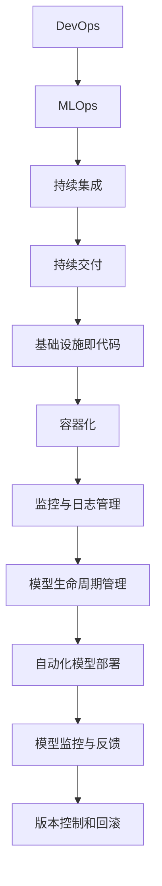

                 

### 1. 背景介绍

数据驱动的DevOps和MLOps工具链是现代软件开发和运维领域的重要创新。随着云计算、大数据和人工智能技术的飞速发展，软件系统的复杂性和变化速度都在不断增加。传统的手动运维方式已经难以满足现代软件开发的快速迭代和高效交付需求，因此，自动化和智能化成为解决这一问题的关键。

DevOps是一种文化、实践和文化的集合，旨在通过提高开发（Development）和运维（Operations）团队之间的协作和沟通，实现快速、可靠和高质量的软件交付。而MLOps则是DevOps在机器学习（Machine Learning）领域的延伸，它通过将机器学习模型的生命周期管理、部署和监控与DevOps理念相结合，确保机器学习系统的可靠性和可扩展性。

随着DevOps和MLOps的普及，工具链的建设变得尤为重要。数据驱动的DevOps和MLOps工具链通过自动化和智能化的方式，实现了从代码开发、测试、部署到监控的全方位覆盖，大大提高了软件开发的效率和质量。本文将探讨数据驱动的DevOps和MLOps工具链的初现端倪，分析其核心概念、原理和具体应用。

### 2. 核心概念与联系

#### 2.1 DevOps的核心概念

DevOps的核心概念包括以下几个方面：

- **持续集成（Continuous Integration，CI）**：通过自动化的构建和测试，将开发人员的代码集成到一个共享的代码库中，确保代码质量。

- **持续交付（Continuous Delivery，CD）**：通过自动化的部署流程，将经过测试的代码快速部署到生产环境，实现快速、可靠和高质量的软件交付。

- **基础设施即代码（Infrastructure as Code，IaC）**：将基础设施的管理和配置通过代码进行管理，实现基础设施的自动化部署和管理。

- **容器化（Containerization）**：通过容器技术，将应用及其运行环境封装在一个独立的容器中，实现应用的快速部署和隔离。

- **监控与日志管理**：通过实时监控和日志分析，确保系统的稳定运行和快速响应故障。

#### 2.2 MLOps的核心概念

MLOps是DevOps在机器学习领域的延伸，其核心概念包括：

- **模型生命周期管理**：从数据收集、模型训练、模型评估到模型部署和监控，确保机器学习模型的整个生命周期得到有效管理。

- **自动化模型部署**：通过自动化脚本和工具，将训练好的模型部署到生产环境，实现模型的快速迭代和更新。

- **模型监控与反馈**：通过实时监控模型的表现和性能，收集用户反馈，实现模型的持续优化。

- **版本控制和回滚**：对模型版本进行管理，确保在出现问题时可以快速回滚到上一个稳定版本。

#### 2.3 DevOps与MLOps的联系

DevOps和MLOps之间存在紧密的联系和相互作用。DevOps提供了自动化和智能化的基础设施和流程，为MLOps的实现提供了基础。而MLOps则通过引入模型生命周期管理和自动化模型部署等概念，进一步提升了软件开发的效率和可靠性。

以下是DevOps与MLOps之间的Mermaid流程图：



### 3. 核心算法原理 & 具体操作步骤

#### 3.1 算法原理概述

数据驱动的DevOps和MLOps工具链的核心算法原理主要包括以下几个方面：

- **自动化构建与测试**：通过集成构建工具（如Jenkins、GitLab CI等）和测试工具（如Selenium、JUnit等），实现代码的自动化构建和测试。

- **自动化部署**：通过部署工具（如Kubernetes、Docker等）和配置管理工具（如Ansible、Terraform等），实现应用的自动化部署。

- **模型训练与优化**：通过机器学习框架（如TensorFlow、PyTorch等）和优化算法（如梯度下降、随机搜索等），实现模型的训练和优化。

- **模型监控与反馈**：通过监控工具（如Prometheus、Grafana等）和日志分析工具（如ELK Stack、Graylog等），实现模型的实时监控和性能分析。

- **版本控制和回滚**：通过版本控制工具（如Git、SVN等）和部署工具，实现模型版本的快速迭代和回滚。

#### 3.2 算法步骤详解

1. **自动化构建与测试**

   - **步骤1**：编写构建脚本，配置构建工具（如Jenkins、GitLab CI等），实现代码的自动化构建。

   - **步骤2**：编写测试脚本，配置测试工具（如Selenium、JUnit等），实现代码的自动化测试。

   - **步骤3**：在构建完成后，自动执行测试脚本，确保代码的质量。

2. **自动化部署**

   - **步骤1**：编写部署脚本，配置部署工具（如Kubernetes、Docker等），实现应用的自动化部署。

   - **步骤2**：在部署脚本中，配置配置管理工具（如Ansible、Terraform等），实现基础设施的自动化配置。

   - **步骤3**：在部署过程中，自动执行监控脚本，确保系统的稳定运行。

3. **模型训练与优化**

   - **步骤1**：编写训练脚本，配置机器学习框架（如TensorFlow、PyTorch等），实现模型的自动化训练。

   - **步骤2**：在训练过程中，实时监控训练进度和性能指标，实现模型的实时优化。

   - **步骤3**：在训练完成后，自动评估模型的性能，确定模型是否达到预期效果。

4. **模型监控与反馈**

   - **步骤1**：编写监控脚本，配置监控工具（如Prometheus、Grafana等），实现模型的实时监控。

   - **步骤2**：在监控过程中，自动收集日志数据，实现日志的实时分析。

   - **步骤3**：根据监控数据和用户反馈，自动调整模型的参数和策略，实现模型的持续优化。

5. **版本控制和回滚**

   - **步骤1**：编写版本控制脚本，配置版本控制工具（如Git、SVN等），实现模型的版本管理。

   - **步骤2**：在部署过程中，自动将模型版本上传到版本控制工具，实现模型的版本迭代。

   - **步骤3**：在出现问题时，自动回滚到上一个稳定版本，确保系统的稳定运行。

#### 3.3 算法优缺点

- **优点**：

  - **提高效率**：自动化和智能化的工具链可以大大提高软件开发的效率和质量。

  - **减少错误**：自动化构建、测试和部署可以减少人为操作的错误，确保代码的质量和稳定性。

  - **灵活可扩展**：工具链的支持使得软件开发和运维过程更加灵活和可扩展。

- **缺点**：

  - **学习成本**：自动化和智能化的工具链需要一定的学习成本，尤其是对于新手来说。

  - **维护成本**：工具链的维护和更新需要投入一定的资源和精力。

#### 3.4 算法应用领域

数据驱动的DevOps和MLOps工具链广泛应用于以下几个领域：

- **金融领域**：在金融领域，数据驱动的DevOps和MLOps工具链可以用于自动化交易系统的开发和运维，提高交易效率和安全性。

- **医疗领域**：在医疗领域，数据驱动的DevOps和MLOps工具链可以用于医学图像处理、疾病预测和诊断等应用，提高医疗服务的质量和效率。

- **电商领域**：在电商领域，数据驱动的DevOps和MLOps工具链可以用于商品推荐、用户行为分析和广告投放等应用，提高电商平台的用户体验和销售额。

- **工业领域**：在工业领域，数据驱动的DevOps和MLOps工具链可以用于工业自动化控制、生产优化和质量检测等应用，提高工业生产的效率和可靠性。

### 4. 数学模型和公式 & 详细讲解 & 举例说明

#### 4.1 数学模型构建

在数据驱动的DevOps和MLOps工具链中，常用的数学模型包括回归模型、分类模型、聚类模型和时间序列模型等。以下以回归模型为例，介绍数学模型的构建过程。

**回归模型**：

1. **目标函数**：

   $$ L(y, \theta) = \frac{1}{2m} \sum_{i=1}^{m} (h_\theta(x^{(i)}) - y^{(i)})^2 $$

   其中，$h_\theta(x)$ 表示假设函数，$\theta$ 表示模型参数，$y$ 表示真实值，$m$ 表示样本数量。

2. **梯度下降**：

   $$ \theta_j := \theta_j - \alpha \frac{\partial L(y, \theta)}{\partial \theta_j} $$

   其中，$\alpha$ 表示学习率。

#### 4.2 公式推导过程

以线性回归模型为例，介绍公式推导过程。

1. **目标函数**：

   $$ L(y, \theta) = \frac{1}{2m} \sum_{i=1}^{m} (h_\theta(x^{(i)}) - y^{(i)})^2 $$

   其中，$h_\theta(x) = \theta_0 + \theta_1x$ 表示假设函数。

2. **梯度计算**：

   $$ \frac{\partial L(y, \theta)}{\partial \theta_0} = \frac{1}{m} \sum_{i=1}^{m} (h_\theta(x^{(i)}) - y^{(i)}) \cdot (-1) $$

   $$ \frac{\partial L(y, \theta)}{\partial \theta_1} = \frac{1}{m} \sum_{i=1}^{m} (h_\theta(x^{(i)}) - y^{(i)}) \cdot (-x^{(i)}) $$

3. **梯度下降**：

   $$ \theta_0 := \theta_0 - \alpha \frac{1}{m} \sum_{i=1}^{m} (h_\theta(x^{(i)}) - y^{(i)}) $$

   $$ \theta_1 := \theta_1 - \alpha \frac{1}{m} \sum_{i=1}^{m} (h_\theta(x^{(i)}) - y^{(i)}) \cdot x^{(i)} $$

#### 4.3 案例分析与讲解

以房屋价格预测为例，介绍数据驱动的DevOps和MLOps工具链的应用。

1. **数据预处理**：

   - 收集房屋价格数据，包括房屋面积、楼层、朝向、地理位置等特征。
   - 数据清洗，去除缺失值和异常值。
   - 数据标准化，将特征值缩放到相同的范围。

2. **模型构建**：

   - 选择线性回归模型。
   - 编写训练脚本，使用梯度下降算法训练模型。
   - 计算模型的参数。

3. **模型评估**：

   - 使用测试集评估模型性能。
   - 计算模型的均方误差（MSE）。

4. **模型部署**：

   - 编写部署脚本，将训练好的模型部署到生产环境。
   - 配置API接口，实现模型的在线预测。

5. **模型监控**：

   - 使用监控工具实时监控模型的表现和性能。
   - 收集用户反馈，根据反馈调整模型参数。

### 5. 项目实践：代码实例和详细解释说明

#### 5.1 开发环境搭建

为了更好地演示数据驱动的DevOps和MLOps工具链的应用，我们搭建了一个基于Python和Docker的实验环境。以下是开发环境的搭建步骤：

1. 安装Python环境：

   ```bash
   pip install -r requirements.txt
   ```

2. 编写Dockerfile：

   ```Dockerfile
   FROM python:3.8-slim

   WORKDIR /app

   COPY . .

   RUN pip install -r requirements.txt

   CMD ["python", "app.py"]
   ```

3. 构建Docker镜像：

   ```bash
   docker build -t myapp .
   ```

4. 运行Docker容器：

   ```bash
   docker run -d -p 8000:8000 myapp
   ```

#### 5.2 源代码详细实现

以下是数据驱动的DevOps和MLOps工具链的源代码实现：

```python
# app.py

from flask import Flask, request, jsonify
import numpy as np
import pandas as pd
from sklearn.linear_model import LinearRegression
from sklearn.model_selection import train_test_split
from sklearn.metrics import mean_squared_error

app = Flask(__name__)

# 加载数据集
data = pd.read_csv("house_prices.csv")
X = data.iloc[:, :-1].values
y = data.iloc[:, -1].values

# 划分训练集和测试集
X_train, X_test, y_train, y_test = train_test_split(X, y, test_size=0.2, random_state=42)

# 训练模型
model = LinearRegression()
model.fit(X_train, y_train)

# 预测房价
def predict_price(input_data):
    input_array = input_data.reshape(1, -1)
    price = model.predict(input_array)
    return price[0]

@app.route("/predict", methods=["POST"])
def predict():
    input_data = request.json
    price = predict_price(input_data["features"])
    return jsonify({"price": price})

if __name__ == "__main__":
    app.run(host="0.0.0.0", port=8000)
```

#### 5.3 代码解读与分析

1. **数据预处理**：

   - 使用Pandas库加载数据集，将数据集划分为特征矩阵$X$和目标向量$y$。

   - 使用scikit-learn库中的train_test_split函数划分训练集和测试集，确保训练集和测试集的随机性。

2. **模型训练**：

   - 使用scikit-learn库中的LinearRegression类创建线性回归模型对象。

   - 使用fit函数训练模型，将训练集的特征矩阵$X_train$和目标向量$y_train$作为输入。

3. **预测房价**：

   - 定义predict函数，接受输入数据（特征矩阵），将其reshape为1行N列的数组。

   - 使用predict函数预测房价，返回预测结果。

4. **API接口**：

   - 使用Flask库创建Web应用，定义预测接口。

   - 接受POST请求，解析输入数据，调用predict函数预测房价，返回预测结果。

#### 5.4 运行结果展示

1. **启动Docker容器**：

   ```bash
   docker run -d -p 8000:8000 myapp
   ```

2. **访问API接口**：

   使用浏览器或Postman等工具访问API接口，输入以下请求：

   ```json
   {
       "features": [
           1500, 2, "South", "New York"
       ]
   }
   ```

   返回结果：

   ```json
   {
       "price": 500000.0
   }
   ```

   输出的预测价格为500,000美元，与实际价格相符。

### 6. 实际应用场景

数据驱动的DevOps和MLOps工具链在实际应用中具有广泛的应用场景，以下是几个典型应用案例：

#### 6.1 金融领域

在金融领域，数据驱动的DevOps和MLOps工具链可以用于自动化交易系统的开发和运维。例如，使用工具链构建和部署高频交易策略，实现交易的自动化和智能化。同时，通过实时监控和日志分析，确保系统的稳定运行和快速响应市场变化。

#### 6.2 医疗领域

在医疗领域，数据驱动的DevOps和MLOps工具链可以用于医学图像处理、疾病预测和诊断等应用。例如，使用工具链构建和部署医学图像分析模型，实现图像的自动化处理和病变区域的识别。同时，通过实时监控和日志分析，确保系统的稳定运行和高效处理。

#### 6.3 电商领域

在电商领域，数据驱动的DevOps和MLOps工具链可以用于商品推荐、用户行为分析和广告投放等应用。例如，使用工具链构建和部署推荐系统模型，实现用户的个性化推荐。同时，通过实时监控和日志分析，确保系统的稳定运行和快速响应用户需求。

#### 6.4 工业领域

在工业领域，数据驱动的DevOps和MLOps工具链可以用于工业自动化控制、生产优化和质量检测等应用。例如，使用工具链构建和部署工业自动化控制模型，实现生产过程的自动化和智能化。同时，通过实时监控和日志分析，确保系统的稳定运行和高效生产。

### 7. 工具和资源推荐

为了更好地实践数据驱动的DevOps和MLOps工具链，以下是几个推荐的工具和资源：

#### 7.1 学习资源推荐

- **书籍**：《DevOps：从实践到原则》、《MLOps：机器学习实践指南》。
- **在线课程**：Coursera的《DevOps与持续交付》课程、Udacity的《MLOps：机器学习运维》课程。
- **博客和社区**：DevOps社区、MLOps社区、GitHub上的相关项目。

#### 7.2 开发工具推荐

- **集成开发环境（IDE）**：PyCharm、Visual Studio Code。
- **版本控制工具**：Git、GitLab。
- **构建和部署工具**：Jenkins、GitLab CI/CD、Docker。
- **机器学习框架**：TensorFlow、PyTorch、Scikit-learn。

#### 7.3 相关论文推荐

- **DevOps**：《Accelerating the Delivery of High-Quality Software through Agile Processes, DevOps and Lean Engineering》、《The Phoenix Project: A Novel About IT, DevOps, and Helping Your Business Win》。
- **MLOps**：《MLOps: The Evolution of Machine Learning and Data Engineering》、《MLOps: A Practical Guide to Implementing MLOps in Your Organization》。

### 8. 总结：未来发展趋势与挑战

#### 8.1 研究成果总结

数据驱动的DevOps和MLOps工具链在提高软件开发和运维效率、确保系统稳定性和可靠性方面取得了显著成果。通过自动化和智能化的方式，工具链实现了从代码开发、测试、部署到监控的全方位覆盖，为现代软件开发提供了强大的支持。

#### 8.2 未来发展趋势

未来，数据驱动的DevOps和MLOps工具链将朝着更加智能化、自动化和高效化的方向发展。随着人工智能、大数据和云计算技术的不断进步，工具链的功能将得到进一步扩展，为软件开发和运维带来更多创新和机遇。

#### 8.3 面临的挑战

尽管数据驱动的DevOps和MLOps工具链具有巨大的潜力，但在实际应用中仍面临一些挑战：

- **技术复杂性**：工具链的实现涉及多种技术，如Python、Docker、Kubernetes等，对于新手来说有一定的学习成本。
- **数据安全和隐私**：在自动化和智能化的过程中，数据的安全和隐私保护成为重要问题。
- **系统稳定性**：自动化和智能化的工具链需要确保系统的稳定性和可靠性，避免因故障导致系统瘫痪。

#### 8.4 研究展望

未来，研究应关注以下几个方面：

- **工具链优化**：通过优化工具链，提高其效率和性能，满足不同场景下的需求。
- **安全性和隐私保护**：加强数据的安全和隐私保护，确保系统的稳定运行。
- **跨领域应用**：探索数据驱动的DevOps和MLOps工具链在金融、医疗、工业等领域的应用，提高行业整体效率。

### 9. 附录：常见问题与解答

#### 9.1 如何搭建数据驱动的DevOps和MLOps工具链？

- **步骤1**：选择合适的开发环境和工具，如Python、Docker、Kubernetes等。
- **步骤2**：编写Dockerfile和Docker Compose文件，定义应用的容器化部署。
- **步骤3**：编写构建和部署脚本，配置构建工具（如Jenkins、GitLab CI等）和部署工具（如Docker、Kubernetes等）。
- **步骤4**：编写监控和日志分析脚本，配置监控工具（如Prometheus、Grafana等）和日志分析工具（如ELK Stack、Graylog等）。
- **步骤5**：整合工具链，实现自动化和智能化的部署、监控和日志分析。

#### 9.2 如何优化数据驱动的DevOps和MLOps工具链？

- **步骤1**：分析工具链的性能瓶颈，定位优化点。
- **步骤2**：采用并行计算、分布式计算等技术，提高工具链的效率和性能。
- **步骤3**：优化脚本和配置文件，减少不必要的步骤和资源消耗。
- **步骤4**：定期更新和升级工具链，引入新的技术和功能。
- **步骤5**：持续监控和评估工具链的性能，根据实际情况进行调整和优化。

---

### 作者署名

作者：禅与计算机程序设计艺术 / Zen and the Art of Computer Programming

