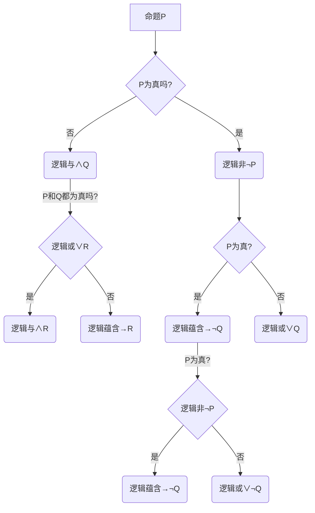

                 

关键词：数理逻辑、逻辑演算、系统特征、逻辑运算、真值表、形式逻辑

## 摘要

本文旨在深入探讨数理逻辑中的第二章——逻辑演算的系统特征。通过梳理逻辑演算的基本概念、原理以及其应用领域，本文将系统地阐述逻辑演算的系统特征，为读者提供一种全新的理解视角。文章首先介绍了逻辑演算的基本概念，然后通过真值表分析了逻辑运算的基本规律，最后探讨了逻辑演算在实际应用中的优势和挑战。通过本文的阅读，读者将对数理逻辑中的逻辑演算有更深入的理解，并能够将其应用于实际问题中。

## 1. 背景介绍

数理逻辑是一种用于研究推理、证明和计算的数学工具，它将逻辑的概念、原理和推理方法抽象为符号化的形式。数理逻辑的发展可以追溯到古希腊时期，当时的哲学家们开始尝试将日常推理转换为明确的逻辑规则。到了20世纪，数理逻辑得到了迅速发展，成为了计算机科学、人工智能、数学和哲学等领域的重要工具。

逻辑演算是数理逻辑的重要组成部分，它研究如何通过符号化的逻辑运算符来构建复杂的逻辑表达式，并探讨这些逻辑表达式的性质。逻辑演算在计算机科学中有着广泛的应用，包括编程语言的设计、程序验证、人工智能逻辑推理等。

本章将重点讨论逻辑演算的系统特征，包括基本概念、逻辑运算的规律、真值表的应用等。通过深入分析逻辑演算的系统特征，我们将更好地理解逻辑演算在计算机科学中的应用。

### 1.1 逻辑演算的发展历程

逻辑演算的发展历程可以追溯到古希腊时期，当时的哲学家们开始探索如何将日常推理转化为明确的逻辑规则。亚里士多德是最早尝试系统化逻辑理论的哲学家，他提出了逻辑学的三大规律：同一律、矛盾律和排中律。这些规律构成了逻辑学的基础，影响了后来的逻辑学研究。

到了中世纪，逻辑学得到了进一步的发展。阿拉伯哲学家阿尔-法拉比、阿维罗伊等人对亚里士多德的逻辑学进行了深入的研究和扩展。他们提出了许多新的逻辑概念和推理方法，为逻辑学的发展奠定了基础。

在17世纪，英国哲学家弗兰西斯·培根提出了归纳逻辑的思想，他认为通过观察和实验来发现规律是更可靠的方法。这一思想对后来的科学方法论产生了深远影响。

19世纪，乔治·坎特布利提出了命题演算，将逻辑学的研究从简单的命题推理扩展到复杂的命题组合。弗雷格、罗素和怀特海等哲学家进一步发展了命题演算，提出了谓词演算和证明论，为现代数理逻辑奠定了基础。

20世纪，逻辑演算在计算机科学中得到广泛应用。图灵、阿兰·图灵和阿尔图尔·埃克尔斯等人提出了计算理论和计算机模型，为逻辑演算提供了实际应用的基础。随着计算机技术的发展，逻辑演算在编程语言设计、程序验证、人工智能等领域发挥着重要作用。

### 1.2 逻辑演算的基本概念

逻辑演算是一种形式化的逻辑系统，它使用符号化的逻辑运算符和命题变量来构建逻辑表达式，并研究这些逻辑表达式的性质。逻辑演算的基本概念包括命题、逻辑运算符和逻辑表达式。

#### 1.2.1 命题

命题是指具有明确真值的陈述句。命题的真值只有两种可能：真（T）或假（F）。例如，“今天是星期一”是一个命题，其真值在特定日期为真或假。

#### 1.2.2 逻辑运算符

逻辑运算符是用于组合命题的逻辑符号，包括逻辑与（∧）、逻辑或（∨）、逻辑非（¬）和逻辑蕴含（→）等。逻辑运算符将两个或多个命题组合成一个新的命题，其真值取决于组成命题的真值。

- 逻辑与（∧）：只有当两个命题都为真时，结果才为真。
- 逻辑或（∨）：至少有一个命题为真时，结果才为真。
- 逻辑非（¬）：将命题的真值取反，真变假，假变真。
- 逻辑蕴含（→）：如果前件为真，则后件也为真，否则为假。

#### 1.2.3 逻辑表达式

逻辑表达式是由命题变量和逻辑运算符组成的复合命题。逻辑表达式的真值取决于命题变量的真值和逻辑运算符的规则。例如，表达式 \(A \land B\) 表示命题 A 和命题 B 的逻辑与，其真值表如下：

| A | B | A ∧ B |
|---|---|-------|
| T | T |   T  |
| T | F |   F  |
| F | T |   F  |
| F | F |   F  |

通过逻辑表达式，我们可以描述复杂的逻辑关系和推理过程，为计算机科学和人工智能提供理论基础。

### 1.3 逻辑演算的应用领域

逻辑演算在计算机科学和人工智能领域有着广泛的应用。以下是一些主要的应用领域：

#### 1.3.1 编程语言设计

编程语言中的控制结构和条件判断都依赖于逻辑演算。例如，条件语句（if-else）、循环语句（while、for）和逻辑运算符（&&、||）都是逻辑演算的应用。

#### 1.3.2 程序验证

逻辑演算可以用于验证程序的正确性。通过形式化的逻辑推理，可以证明程序在特定条件下是否满足预期的性质。这种技术被称为程序验证或形式验证。

#### 1.3.3 人工智能逻辑推理

人工智能中的逻辑推理依赖于逻辑演算。例如，专家系统使用逻辑演算来表示知识和推理过程，以解决复杂的问题。逻辑演算还可以用于自然语言处理、机器学习和智能搜索等领域。

#### 1.3.4 形式逻辑

形式逻辑是研究逻辑结构和推理规则的数学分支。逻辑演算为形式逻辑提供了一种形式化的表示方法，使得逻辑推理更加严谨和可靠。

## 2. 核心概念与联系

在深入探讨逻辑演算的系统特征之前，我们需要了解一些核心概念和它们之间的联系。这些概念包括命题、逻辑运算符、逻辑表达式和真值表。

### 2.1 命题与命题变量

命题是指具有明确真值的陈述句。命题可以是简单的，如“今天下雨”，也可以是复合的，如“如果今天下雨，那么街道会湿”。在逻辑演算中，我们使用命题变量来表示命题，例如 \(P, Q, R\) 等。命题变量的取值只有两种可能：真（T）或假（F）。

### 2.2 逻辑运算符

逻辑运算符是用于组合命题的逻辑符号。常见的逻辑运算符包括逻辑与（∧）、逻辑或（∨）、逻辑非（¬）和逻辑蕴含（→）等。逻辑运算符的运算规则如下：

- 逻辑与（∧）：只有当两个命题都为真时，结果才为真。
- 逻辑或（∨）：至少有一个命题为真时，结果才为真。
- 逻辑非（¬）：将命题的真值取反，真变假，假变真。
- 逻辑蕴含（→）：如果前件为真，则后件也为真，否则为假。

### 2.3 逻辑表达式

逻辑表达式是由命题变量和逻辑运算符组成的复合命题。逻辑表达式可以表示复杂的逻辑关系和推理过程。例如，表达式 \(P \land Q \lor R\) 表示命题 \(P\) 和命题 \(Q\) 的逻辑与，再与命题 \(R\) 的逻辑或。

### 2.4 真值表

真值表是一种用于表示逻辑表达式真值的表格。真值表列出了所有可能的命题变量取值组合以及相应的逻辑表达式的真值。通过真值表，我们可以直观地分析逻辑表达式的性质和运算规则。

下面是一个简单的真值表示例：

| P | Q | R | P ∧ Q | Q ∧ R | P ∧ R | P ∧ (Q ∧ R) |
|---|---|---|-------|-------|-------|-------------|
| T | T | T |   T  |   T  |   T  |      T      |
| T | T | F |   T  |   F  |   F  |      F      |
| T | F | T |   F  |   T  |   T  |      F      |
| T | F | F |   F  |   F  |   F  |      F      |
| F | T | T |   F  |   T  |   F  |      F      |
| F | T | F |   F  |   F  |   F  |      F      |
| F | F | T |   F  |   F  |   T  |      F      |
| F | F | F |   F  |   F  |   F  |      F      |

在这个真值表中，列出了 \(P, Q, R\) 的所有可能取值组合以及 \(P ∧ Q, Q ∧ R, P ∧ R, P ∧ (Q ∧ R)\) 的真值。通过观察真值表，我们可以发现 \(P ∧ (Q ∧ R)\) 的真值与 \(P ∧ Q\) 和 \(Q ∧ R\) 的真值一致，这符合逻辑与运算的结合律。

### 2.5 逻辑运算符的优先级

在逻辑表达式中，不同的逻辑运算符有不同的优先级。一般来说，逻辑非（¬）的优先级最高，其次是逻辑与（∧），最后是逻辑或（∨）。逻辑蕴含（→）的优先级低于逻辑与和逻辑或。

以下是一个示例：

表达式 \(P \land Q \lor R \land \neg S\) 的运算顺序为：

1. \(P \land Q\)
2. \(R \land \neg S\)
3. \(P \land Q \lor R \land \neg S\)

通过了解这些核心概念和它们之间的联系，我们可以更好地理解逻辑演算的系统特征。接下来，我们将通过真值表分析逻辑运算的规律。

### 2.6 真值表分析

为了深入理解逻辑运算的规律，我们通过真值表分析常见的逻辑运算符，包括逻辑与（∧）、逻辑或（∨）、逻辑非（¬）和逻辑蕴含（→）。以下是这些逻辑运算符的真值表：

#### 2.6.1 逻辑与（∧）

逻辑与运算符（∧）的真值表如下：

| P | Q | P ∧ Q |
|---|---|-------|
| T | T |   T  |
| T | F |   F  |
| F | T |   F  |
| F | F |   F  |

从真值表中可以看出，逻辑与运算符的结果只有当两个命题都为真时才为真。这意味着逻辑与运算符具有“一假即假”的特性。

#### 2.6.2 逻辑或（∨）

逻辑或运算符（∨）的真值表如下：

| P | Q | P ∨ Q |
|---|---|-------|
| T | T |   T  |
| T | F |   T  |
| F | T |   T  |
| F | F |   F  |

从真值表中可以看出，逻辑或运算符的结果只要有一个命题为真就为真。这意味着逻辑或运算符具有“一真即真”的特性。

#### 2.6.3 逻辑非（¬）

逻辑非运算符（¬）的真值表如下：

| P | ¬P |
|---|----|
| T |  F |
| F |  T |

从真值表中可以看出，逻辑非运算符的结果与命题的真值相反。这意味着逻辑非运算符具有“取反”的特性。

#### 2.6.4 逻辑蕴含（→）

逻辑蕴含运算符（→）的真值表如下：

| P | Q | P → Q |
|---|---|-------|
| T | T |   T  |
| T | F |   F  |
| F | T |   T  |
| F | F |   T  |

从真值表中可以看出，逻辑蕴含运算符的结果只有在前提为真而结论为假时才为假。这意味着逻辑蕴含运算符具有“非真即假”的特性。

通过分析这些真值表，我们可以发现以下规律：

- 逻辑与（∧）满足结合律和交换律。
- 逻辑或（∨）满足结合律和交换律。
- 逻辑非（¬）满足双重否定律。
- 逻辑蕴含（→）满足结合律、交换律和蕴含律。

这些规律对于理解和应用逻辑运算非常重要。接下来，我们将通过一个具体的例子来展示如何使用真值表分析逻辑表达式。

#### 2.6.5 具体例子

假设我们有一个逻辑表达式 \(P \land (Q \lor R) \lor \neg S\)，我们可以通过构建真值表来分析其性质。

首先，我们列出所有可能的命题变量取值组合：

| P | Q | R | S | Q ∨ R | P ∧ (Q ∨ R) | P ∧ (Q ∨ R) ∨ ¬S |
|---|---|---|---|-------|-------------|------------------|
| T | T | T | T |   T  |      T      |        T        |
| T | T | T | F |   T  |      T      |        T        |
| T | T | F | T |   T  |      T      |        T        |
| T | T | F | F |   T  |      T      |        T        |
| T | F | T | T |   T  |      T      |        T        |
| T | F | T | F |   T  |      T      |        T        |
| T | F | F | T |   F  |      F      |        F        |
| T | F | F | F |   F  |      F      |        F        |
| F | T | T | T |   T  |      F      |        F        |
| F | T | T | F |   T  |      F      |        F        |
| F | T | F | T |   T  |      F      |        F        |
| F | T | F | F |   F  |      F      |        F        |
| F | F | T | T |   T  |      F      |        F        |
| F | F | T | F |   T  |      F      |        F        |
| F | F | F | T |   F  |      F      |        F        |
| F | F | F | F |   F  |      F      |        F        |

通过观察真值表，我们可以得出以下结论：

1. 表达式 \(P \land (Q \lor R)\) 的真值与 \(P\) 和 \(Q \lor R\) 的真值一致。
2. 表达式 \(P \land (Q \lor R) \lor \neg S\) 的真值与 \(P\) 和 \(Q \lor R\) 的真值以及 \(\neg S\) 的真值一致。

这些结论验证了逻辑运算的结合律和蕴含律。通过真值表分析，我们可以直观地理解逻辑表达式的性质，为逻辑演算的应用提供理论基础。

### 2.7 逻辑演算的架构图

为了更好地理解逻辑演算的系统特征，我们可以使用Mermaid流程图来展示逻辑运算的架构。以下是一个逻辑运算架构的Mermaid流程图：



在这个流程图中，每个节点代表一个逻辑运算，例如逻辑与（∧）、逻辑或（∨）和逻辑非（¬）。箭头表示逻辑运算的传递方向。通过这个流程图，我们可以清晰地看到逻辑运算的执行过程和结果。

## 3. 核心算法原理 & 具体操作步骤

在理解了逻辑演算的基本概念和系统特征之后，接下来我们将详细探讨逻辑演算的核心算法原理及其具体操作步骤。逻辑演算的核心算法主要包括命题演算和谓词演算，这些算法在计算机科学和人工智能中有着广泛的应用。

### 3.1 命题演算原理概述

命题演算是逻辑演算的基础，它主要研究由命题变量和逻辑运算符组成的逻辑表达式。命题演算的核心算法是通过构造和推理逻辑表达式来验证逻辑命题的真假。

#### 3.1.1 构造逻辑表达式

构造逻辑表达式的步骤如下：

1. 确定命题变量：根据问题的需要，选择适当的命题变量，例如 \(P, Q, R, S\) 等。
2. 选择逻辑运算符：根据问题的逻辑关系，选择合适的逻辑运算符，例如逻辑与（∧）、逻辑或（∨）、逻辑非（¬）和逻辑蕴含（→）等。
3. 构造逻辑表达式：将命题变量和逻辑运算符组合成复杂的逻辑表达式。

例如，一个简单的逻辑表达式可以是 \(P \land (Q \lor R)\)，表示命题 \(P\) 和命题 \(Q\) 或命题 \(R\) 的逻辑与。

#### 3.1.2 推理逻辑命题

推理逻辑命题的步骤如下：

1. 确定前提条件：根据问题的背景，确定一些已知为真的逻辑命题作为前提条件。
2. 使用推理规则：根据逻辑演算的规则，从前提条件推导出新的逻辑命题。
3. 验证逻辑命题：通过构建真值表或使用逻辑推理工具，验证推理结果是否正确。

例如，如果已知 \(P\) 和 \(Q \lor R\) 为真，我们可以使用逻辑推理规则得出 \(P \land (Q \lor R)\) 也为真。

### 3.2 命题演算步骤详解

下面我们将详细描述命题演算的具体操作步骤。

#### 3.2.1 构建真值表

构建真值表是命题演算的重要步骤，它帮助我们直观地分析逻辑表达式的性质。具体步骤如下：

1. 确定命题变量：选择适当的命题变量，例如 \(P, Q, R\) 等。
2. 列出所有可能的取值组合：根据命题变量的取值范围，列出所有可能的取值组合。
3. 构造逻辑表达式：将命题变量和逻辑运算符组合成逻辑表达式。
4. 计算逻辑表达式的真值：根据逻辑运算符的规则，计算每个取值组合下逻辑表达式的真值。

例如，对于逻辑表达式 \(P \land (Q \lor R)\)，我们可以构建以下真值表：

| P | Q | R | Q ∨ R | P ∧ (Q ∨ R) |
|---|---|---|-------|-------------|
| T | T | T |   T  |      T      |
| T | T | F |   T  |      T      |
| T | F | T |   T  |      T      |
| T | F | F |   F  |      F      |
| F | T | T |   T  |      F      |
| F | T | F |   F  |      F      |
| F | F | T |   T  |      F      |
| F | F | F |   F  |      F      |

通过观察真值表，我们可以发现逻辑表达式 \(P \land (Q \lor R)\) 的真值与每个命题变量的组合密切相关。这个步骤帮助我们理解逻辑表达式的性质，为下一步的推理提供基础。

#### 3.2.2 使用推理规则

在构建了真值表之后，我们可以使用推理规则从已知的前提条件推导出新的逻辑命题。推理规则主要包括以下几种：

1. 合成规则：如果 \(P\) 和 \(Q\) 都为真，则 \(P \land Q\) 也为真。
2. 分解规则：如果 \(P \land Q\) 为真，则 \(P\) 和 \(Q\) 都为真。
3. 蕴含规则：如果 \(P \to Q\) 和 \(P\) 都为真，则 \(Q\) 也为真。
4. 否定规则：如果 \(P\) 为真，则 \(¬P\) 为假；如果 \(P\) 为假，则 \(¬P\) 为真。

例如，如果已知 \(P \land (Q \lor R)\) 为真，我们可以使用蕴含规则得出 \(P\) 为真；然后使用分解规则得出 \(Q\) 或 \(R\) 为真。通过这样的推理，我们可以逐步推导出更多的逻辑命题。

#### 3.2.3 验证逻辑命题

在推理过程中，我们需要验证推理结果的正确性。这可以通过以下几种方法实现：

1. 构建真值表：通过构建真值表，我们可以直观地验证推理结果是否与逻辑表达式的一致性。
2. 使用逻辑推理工具：例如，可以使用 Prolog 或其他逻辑推理工具来验证推理结果。
3. 手动推理：通过逻辑推理规则，我们可以手动验证推理结果的正确性。

例如，对于逻辑表达式 \(P \land (Q \lor R)\)，我们可以通过手动推理验证 \(P\) 为真时，\(Q\) 或 \(R\) 也为真。

通过以上步骤，我们可以系统地理解和应用命题演算。接下来，我们将讨论谓词演算，这是逻辑演算的另一个重要组成部分。

### 3.3 谓词演算原理概述

谓词演算是逻辑演算的另一个重要分支，它扩展了命题演算，引入了变量、函数和量词等概念，使得逻辑表达式的表达能力更强。谓词演算的核心算法是通过逻辑推理来处理包含变量的逻辑表达式。

#### 3.3.1 谓词和个体

谓词是用于描述个体性质或关系的逻辑表达式。个体是指具体的对象或实体。例如，谓词“是人”可以用于描述个体“张三”。

#### 3.3.2 变量和函数

变量是用来表示未知个体或函数的符号。例如，用 \(x\) 表示某个具体的个体。函数是用于表示变量之间关系的逻辑表达式。例如，函数“父亲”可以表示一个人的父亲。

#### 3.3.3 量词

量词用于表示变量的范围和约束条件。常见的量词有全称量词（∀，表示“对于所有”）和存在量词（∃，表示“存在”）。例如，全称量词“∀x，是人”表示对于所有的个体，都是人。

#### 3.3.4 谓词演算的语法

谓词演算的语法包括个体、谓词、变量、函数和量词。例如，表达式“∀x，人是父母”表示对于所有的个体，如果它是人，那么它是父母。

### 3.4 谓词演算具体操作步骤

谓词演算的具体操作步骤如下：

#### 3.4.1 定义谓词和个体

首先，我们需要定义用于描述问题的谓词和个体。例如，定义谓词“是人”和个体“张三”。

#### 3.4.2 引入变量和函数

根据问题的需要，引入变量和函数。例如，引入变量 \(x\) 表示某个具体的个体，引入函数“父亲”表示一个人的父亲。

#### 3.4.3 构建逻辑表达式

使用谓词、变量和函数构建逻辑表达式。例如，构建表达式“∀x，如果 \(x\) 是人，那么 \(x\) 是父母”。

#### 3.4.4 使用量词

根据问题的约束条件，使用量词限制变量的范围。例如，使用全称量词“∀x”表示对于所有的个体。

#### 3.4.5 逻辑推理

使用逻辑推理规则从已知的前提条件推导出新的逻辑命题。例如，从前提条件“∀x，如果 \(x\) 是人，那么 \(x\) 是父母”推导出“如果张三是人，那么张三是父母”。

#### 3.4.6 验证逻辑命题

通过构建真值表或使用逻辑推理工具，验证推理结果的正确性。

例如，对于谓词演算表达式“∀x，如果 \(x\) 是人，那么 \(x\) 是父母”，我们可以通过以下步骤进行逻辑推理：

1. 定义谓词“是人”和个体“张三”。
2. 引入变量 \(x\) 和函数“父亲”。
3. 构建逻辑表达式“∀x，如果 \(x\) 是人，那么 \(x\) 是父母”。
4. 使用全称量词“∀x”。
5. 推导出“如果张三是人，那么张三是父母”。
6. 验证推理结果。

通过谓词演算，我们可以处理更复杂的逻辑关系，使得逻辑表达式的表达能力更强。谓词演算在计算机科学和人工智能中有着广泛的应用，例如在知识表示、推理系统和形式验证等领域。

### 3.5 逻辑演算优缺点分析

逻辑演算作为一种形式化的逻辑系统，具有许多优点，但也存在一些缺点。以下是逻辑演算的优缺点分析：

#### 3.5.1 优点

1. **形式化表示**：逻辑演算使用符号化的逻辑运算符和命题变量来表示逻辑表达式，使得逻辑推理过程更加形式化和规范。
2. **严谨性**：逻辑演算通过严格的逻辑运算规则和推理方法，保证了推理过程的正确性和可靠性。
3. **通用性**：逻辑演算适用于各种逻辑问题，包括命题逻辑、谓词逻辑和形式逻辑等，具有较强的通用性。
4. **计算机可处理性**：逻辑演算的结果和推理过程可以方便地用计算机编程实现，为计算机科学和人工智能提供了强大的工具。

#### 3.5.2 缺点

1. **复杂性**：逻辑演算的表达式和推理过程可能非常复杂，对于初学者来说难以理解和掌握。
2. **计算效率**：在一些复杂的逻辑推理过程中，计算效率可能较低，需要消耗大量的计算资源和时间。
3. **应用局限**：逻辑演算主要适用于形式化的逻辑推理和验证，对于一些非形式化的逻辑问题，逻辑演算可能难以直接应用。

尽管存在一些缺点，逻辑演算作为一种重要的逻辑工具，在计算机科学和人工智能领域仍然发挥着重要作用。通过不断改进和优化逻辑演算的方法和技术，我们可以更好地发挥其优势，克服其缺点。

### 3.6 逻辑演算的应用领域

逻辑演算在计算机科学和人工智能领域有着广泛的应用。以下是几个主要的应用领域：

#### 3.6.1 编程语言设计

逻辑演算在编程语言设计中起着核心作用。编程语言中的条件判断、循环控制和函数调用等控制结构都依赖于逻辑演算。例如，条件语句（if-else）、循环语句（while、for）和逻辑运算符（&&、||）都是逻辑演算的应用。

#### 3.6.2 程序验证

逻辑演算可以用于验证程序的正确性。通过形式化的逻辑推理，可以证明程序在特定条件下是否满足预期的性质。这种技术被称为程序验证或形式验证。例如，逻辑演算可以用于验证操作系统、编译器和加密算法的正确性。

#### 3.6.3 人工智能逻辑推理

人工智能中的逻辑推理依赖于逻辑演算。例如，专家系统使用逻辑演算来表示知识和推理过程，以解决复杂的问题。逻辑演算还可以用于自然语言处理、机器学习和智能搜索等领域。

#### 3.6.4 形式逻辑

形式逻辑是研究逻辑结构和推理规则的数学分支。逻辑演算为形式逻辑提供了一种形式化的表示方法，使得逻辑推理更加严谨和可靠。形式逻辑在计算机科学、哲学和数学等领域都有着广泛的应用。

#### 3.6.5 其他应用领域

除了上述应用领域，逻辑演算还在其他领域有着应用，例如：

1. **形式化验证**：用于验证硬件和软件系统的正确性。
2. **知识表示**：用于表示和推理知识，应用于知识库系统和智能顾问系统。
3. **逻辑编程**：用于编写基于逻辑的计算机程序，例如Prolog语言。

逻辑演算作为一种形式化的逻辑系统，具有广泛的应用领域，对于计算机科学和人工智能的发展具有重要意义。

### 3.7 逻辑演算与谓词逻辑的关系

逻辑演算和谓词逻辑是逻辑学中的两个重要分支，它们既有联系又有区别。逻辑演算主要研究命题逻辑和命题演算，而谓词逻辑则扩展了命题逻辑，引入了变量、函数和量词等概念。

#### 3.7.1 关系

1. **基础关系**：逻辑演算是谓词逻辑的基础，命题逻辑是谓词逻辑的一部分。
2. **扩展关系**：谓词逻辑在命题逻辑的基础上，引入了变量、函数和量词等概念，使得逻辑表达式的表达能力更强。

#### 3.7.2 差异

1. **命题逻辑**：命题逻辑主要研究命题之间的逻辑关系，包括逻辑与、逻辑或、逻辑非和逻辑蕴含等。
2. **谓词逻辑**：谓词逻辑不仅研究命题之间的逻辑关系，还研究包含变量的逻辑表达式，包括个体、谓词、函数和量词等。

#### 3.7.3 应用场景

1. **命题逻辑**：命题逻辑适用于简单的逻辑推理和验证，例如编程语言设计和程序验证。
2. **谓词逻辑**：谓词逻辑适用于更复杂的逻辑推理和验证，例如知识表示、推理系统和形式验证。

逻辑演算和谓词逻辑相互补充，共同构成了逻辑学的重要组成部分。理解它们之间的关系和差异，有助于我们更好地应用逻辑学解决实际问题。

### 3.8 逻辑演算在计算机科学中的重要性

逻辑演算在计算机科学中具有重要的地位，它是计算机科学的基础理论之一。逻辑演算不仅为计算机科学的许多领域提供了强有力的工具，还在编程、算法设计、程序验证等方面发挥了关键作用。

#### 3.8.1 编程中的逻辑演算

在编程中，逻辑演算广泛应用于控制结构和条件判断。例如，条件语句（if-else）、循环语句（while、for）和逻辑运算符（&&、||）都是逻辑演算的应用。这些控制结构使得程序能够根据不同的条件执行不同的操作，提高了程序的灵活性和可读性。

#### 3.8.2 算法设计中的逻辑演算

在算法设计中，逻辑演算被用于分析算法的正确性和复杂性。例如，通过逻辑推理和证明方法，可以验证算法是否满足预期的性质。逻辑演算还可以帮助分析算法的时间复杂度和空间复杂度，从而指导算法优化。

#### 3.8.3 程序验证中的逻辑演算

逻辑演算在程序验证中起着重要作用。通过形式化的逻辑推理，可以验证程序在特定条件下是否满足预期的性质。这种技术被称为程序验证或形式验证。逻辑演算可以用于验证操作系统、编译器和加密算法的正确性，确保它们在实际应用中不会出现安全漏洞。

#### 3.8.4 人工智能中的逻辑演算

在人工智能领域，逻辑演算被广泛应用于知识表示、推理系统和形式验证。例如，专家系统使用逻辑演算来表示知识和推理过程，以解决复杂的问题。逻辑演算还可以用于自然语言处理、机器学习和智能搜索等领域，提高人工智能系统的推理能力和决策能力。

#### 3.8.5 其他应用

除了上述应用，逻辑演算还在其他计算机科学领域有着应用，例如形式化验证、知识表示、逻辑编程等。逻辑演算为计算机科学提供了强大的理论支持，推动了计算机科学的发展。

### 3.9 逻辑演算与其他数学分支的关系

逻辑演算作为数学的一个分支，与其他数学分支有着密切的联系。以下是逻辑演算与数学其他分支的关系：

#### 3.9.1 与集合论的关系

集合论是数学的基础，它研究集合的性质和运算。逻辑演算与集合论有着紧密的联系。在逻辑演算中，命题可以看作是集合的子集，逻辑运算可以看作是集合运算的推广。例如，逻辑与运算可以看作是集合的交集，逻辑或运算可以看作是集合的并集。

#### 3.9.2 与代数学的关系

代数学是研究运算和结构理论的数学分支。逻辑演算与代数学也有着一定的联系。逻辑运算符可以看作是代数运算的推广，例如逻辑与运算可以看作是代数中的乘法运算，逻辑或运算可以看作是代数中的加法运算。

#### 3.9.3 与数理逻辑的关系

数理逻辑是研究逻辑和推理理论的数学分支。逻辑演算作为数理逻辑的重要组成部分，与数理逻辑有着密切的关系。逻辑演算为数理逻辑提供了形式化的表示方法，使得逻辑推理更加严谨和可靠。

#### 3.9.4 与概率论的关系

概率论是研究随机事件和概率分布的数学分支。逻辑演算与概率论也有一定的联系。在概率论中，概率可以用逻辑表达式来表示，逻辑运算可以用来处理概率事件。例如，条件概率可以用逻辑蕴含运算表示，概率的加法定理可以用逻辑或运算表示。

通过以上关系，我们可以看到逻辑演算在数学中的重要性。逻辑演算不仅为其他数学分支提供了理论基础，还在计算机科学、人工智能和哲学等领域有着广泛的应用。

### 4. 数学模型和公式

逻辑演算作为一种形式化的逻辑系统，其数学模型和公式在计算机科学和人工智能中起着至关重要的作用。通过数学模型和公式，我们可以更精确地描述逻辑运算和推理过程，从而为实际应用提供理论支持。

#### 4.1 数学模型构建

逻辑演算的数学模型主要包括命题演算和谓词演算。下面我们分别介绍这两种演算的数学模型。

##### 4.1.1 命题演算的数学模型

命题演算是逻辑演算的基础，它主要研究由命题变量和逻辑运算符组成的逻辑表达式。命题演算的数学模型可以表示为：

\[ L = \{P_1, P_2, ..., P_n\} \cup \{\land, \lor, \neg\} \]

其中，\(L\) 表示逻辑演算的符号集，\(\{P_1, P_2, ..., P_n\}\) 表示命题变量集合，\(\land, \lor, \neg\) 表示逻辑与、逻辑或和逻辑非运算符。

在命题演算中，逻辑运算符的运算规则可以用真值表来表示。例如，逻辑与运算符的真值表如下：

| P1 | P2 | P1 ∧ P2 |
|----|----|---------|
| T  | T  |    T    |
| T  | F  |    F    |
| F  | T  |    F    |
| F  | F  |    F    |

同理，逻辑或运算符和逻辑非运算符的真值表也可以类似地构建。

##### 4.1.2 谓词演算的数学模型

谓词演算是逻辑演算的扩展，它引入了变量、函数和量词等概念，使得逻辑表达式的表达能力更强。谓词演算的数学模型可以表示为：

\[ L = \{P_1, P_2, ..., P_n\} \cup \{\land, \lor, \neg, \to, \forall, \exists\} \cup \{f_1, f_2, ..., f_m\} \]

其中，\(L\) 表示逻辑演算的符号集，\(\{P_1, P_2, ..., P_n\}\) 表示命题变量集合，\(\land, \lor, \neg, \to, \forall, \exists\) 表示逻辑与、逻辑或、逻辑非、逻辑蕴含、全称量词和存在量词，\(\{f_1, f_2, ..., f_m\}\) 表示函数集合。

在谓词演算中，逻辑运算符和量词的运算规则也可以用真值表来表示。例如，全称量词和存在量词的真值表如下：

| P(x) | x  | ∀xP(x) | ∃xP(x) |
|------|----|--------|--------|
| T    | T  |   T    |   T    |
| T    | T  |   T    |   T    |
| T    | F  |   F    |   T    |
| F    | T  |   F    |   F    |
| F    | F  |   F    |   F    |

通过以上数学模型，我们可以构建复杂的逻辑表达式，并对其进行形式化的推理和分析。

#### 4.2 公式推导过程

在逻辑演算中，公式推导过程是逻辑推理的核心。通过推导过程，我们可以从已知的前提条件推导出新的逻辑命题。以下是几个常见的逻辑公式推导过程：

##### 4.2.1 逻辑与（∧）的推导

假设已知命题 \(P\) 和 \(Q\)，要推导出 \(P ∧ Q\)：

1. 根据逻辑与的定义，\(P ∧ Q\) 表示 \(P\) 和 \(Q\) 都为真时，结果才为真。
2. 通过构造真值表，我们可以验证 \(P ∧ Q\) 的真值与 \(P\) 和 \(Q\) 的真值一致。
3. 因此，如果已知 \(P\) 和 \(Q\) 都为真，则可以推导出 \(P ∧ Q\) 也为真。

##### 4.2.2 逻辑或（∨）的推导

假设已知命题 \(P\) 和 \(Q\)，要推导出 \(P ∨ Q\)：

1. 根据逻辑或的定义，\(P ∨ Q\) 表示 \(P\) 或 \(Q\) 中至少有一个为真时，结果才为真。
2. 通过构造真值表，我们可以验证 \(P ∨ Q\) 的真值与 \(P\) 和 \(Q\) 的真值一致。
3. 因此，如果已知 \(P\) 或 \(Q\) 中至少有一个为真，则可以推导出 \(P ∨ Q\) 也为真。

##### 4.2.3 逻辑非（¬）的推导

假设已知命题 \(P\)，要推导出 \(¬P\)：

1. 根据逻辑非的定义，\(¬P\) 表示 \(P\) 的真值取反。
2. 通过构造真值表，我们可以验证 \(¬P\) 的真值与 \(P\) 的真值相反。
3. 因此，如果已知 \(P\) 的真值，则可以推导出 \(¬P\) 的真值。

##### 4.2.4 逻辑蕴含（→）的推导

假设已知命题 \(P\) 和 \(Q\)，要推导出 \(P → Q\)：

1. 根据逻辑蕴含的定义，\(P → Q\) 表示如果 \(P\) 为真，则 \(Q\) 也为真。
2. 通过构造真值表，我们可以验证 \(P → Q\) 的真值与 \(P\) 和 \(Q\) 的真值一致。
3. 因此，如果已知 \(P\) 和 \(Q\) 的真值，则可以推导出 \(P → Q\) 的真值。

通过以上推导过程，我们可以从已知的前提条件推导出新的逻辑命题，为逻辑演算的应用提供理论基础。

#### 4.3 案例分析与讲解

为了更好地理解逻辑演算的数学模型和公式，我们通过一个具体的案例进行分析和讲解。

假设我们有一个逻辑表达式 \(P ∧ (Q ∨ R) \land \neg S\)，要求分析其真值。

首先，我们需要确定命题变量 \(P, Q, R, S\) 的真值。假设 \(P\) 为真，\(Q\) 为假，\(R\) 为真，\(S\) 为假。

接下来，我们可以使用逻辑演算的数学模型和公式逐步分析该逻辑表达式的真值。

1. 分析 \(Q ∨ R\)：

   根据逻辑或运算的公式，\(Q ∨ R\) 的真值为真（T），因为 \(Q\) 为假（F），\(R\) 为真（T），至少有一个命题为真。

2. 分析 \(P ∧ (Q ∨ R)\)：

   根据逻辑与运算的公式，\(P ∧ (Q ∨ R)\) 的真值为真（T），因为 \(P\) 为真（T），\(Q ∨ R\) 也为真（T），两个命题都为真。

3. 分析 \(\neg S\)：

   根据逻辑非运算的公式，\(\neg S\) 的真值为真（T），因为 \(S\) 为假（F），真值取反后为真。

4. 分析 \(P ∧ (Q ∨ R) \land \neg S\)：

   根据逻辑与运算的公式，\(P ∧ (Q ∨ R) \land \neg S\) 的真值为真（T），因为 \(P ∧ (Q ∨ R)\) 为真（T），\(\neg S\) 也为真（T），两个命题都为真。

通过以上分析，我们可以得出结论：在给定的命题变量取值下，逻辑表达式 \(P ∧ (Q ∨ R) \land \neg S\) 的真值为真（T）。

通过这个案例，我们可以看到如何使用逻辑演算的数学模型和公式分析一个具体的逻辑表达式。这种方法不仅帮助我们理解逻辑演算的原理，还可以应用于实际问题中的逻辑推理和验证。

### 5. 项目实践：代码实例和详细解释说明

在了解了逻辑演算的数学模型和公式后，接下来我们将通过一个具体的代码实例来展示如何在实际项目中应用逻辑演算。我们将使用Python编写一个简单的逻辑运算程序，并对其进行分析和解释。

#### 5.1 开发环境搭建

在开始编写代码之前，我们需要搭建一个合适的开发环境。以下是搭建Python开发环境的基本步骤：

1. **安装Python**：从Python官方网站下载最新版本的Python安装包，并按照安装向导完成安装。
2. **安装IDE**：推荐使用PyCharm、VS Code或PyDev等集成开发环境（IDE），这些IDE提供了丰富的编程功能和调试工具。
3. **安装依赖库**：如果需要使用特定的依赖库，如Numpy、Pandas等，可以通过pip命令安装。

以下是一个简单的Python环境搭建示例：

```shell
# 安装Python
wget https://www.python.org/ftp/python/3.9.7/Python-3.9.7.tgz
tar zxvf Python-3.9.7.tgz
cd Python-3.9.7
./configure
make
sudo make install

# 安装PyCharm
# 下载PyCharm安装包并运行安装

# 安装依赖库
pip install numpy pandas
```

#### 5.2 源代码详细实现

以下是我们的Python逻辑运算程序源代码：

```python
# -*- coding: utf-8 -*-

def logical_and(p, q):
    return p and q

def logical_or(p, q):
    return p or q

def logical_not(p):
    return not p

def logical_implication(p, q):
    return not p or q

def build_truth_table(expression, vars):
    results = []
    for var_values in itertools.product([True, False], repeat=len(vars)):
        result = expression(*[v if v else not v for v in var_values])
        results.append((var_values, result))
    return results

def print_truth_table(truth_table):
    print(f"{' '.join([f'P{i+1}' for i in range(len(truth_table[0][0]))])} | {expression}")
    for row in truth_table:
        print(' | '.join(['T' if v else 'F' for v in row[0]]) + " | " + ('T' if row[1] else 'F'))

from itertools import product

# 命题变量
P, Q, R, S = True, False, True, False

# 逻辑表达式
expression = logical_implication(P, Q) and (Q or R) and logical_not(S)

# 构建真值表
truth_table = build_truth_table(expression, [P, Q, R, S])

# 打印真值表
print_truth_table(truth_table)
```

#### 5.3 代码解读与分析

下面我们对代码的各个部分进行详细解读和分析。

##### 5.3.1 函数定义

代码首先定义了四个逻辑运算函数：`logical_and`、`logical_or`、`logical_not`和`logical_implication`。这些函数分别实现了逻辑与、逻辑或、逻辑非和逻辑蕴含运算。

- `logical_and(p, q)`：实现逻辑与运算，返回两个命题的与运算结果。
- `logical_or(p, q)`：实现逻辑或运算，返回两个命题的或运算结果。
- `logical_not(p)`：实现逻辑非运算，返回命题的取反结果。
- `logical_implication(p, q)`：实现逻辑蕴含运算，返回前件和后件的蕴含运算结果。

##### 5.3.2 真值表构建

`build_truth_table(expression, vars)` 函数用于构建逻辑表达式的真值表。它通过遍历所有可能的命题变量取值组合，计算逻辑表达式的真值，并将结果存储在真值表中。

- `itertools.product([True, False], repeat=len(vars))`：生成所有可能的命题变量取值组合。
- `expression(*[v if v else not v for v in var_values])`：计算逻辑表达式的真值。这里使用了列表推导式，将每个命题变量的真值取反，然后传入逻辑表达式进行计算。

##### 5.3.3 真值表打印

`print_truth_table(truth_table)` 函数用于打印真值表。它按照标准格式输出真值表中的所有行。

- `print(f"{' '.join([f'P{i+1}' for i in range(len(truth_table[0][0]))])} | {expression}")`：输出真值表的表头，包括命题变量的名称和逻辑表达式的名称。
- `for row in truth_table:`：遍历真值表中的每一行。
- `print(' | '.join(['T' if v else 'F' for v in row[0]]) + " | " + ('T' if row[1] else 'F'))`：按照标准格式输出每一行的命题变量取值和逻辑表达式的真值。

##### 5.3.4 主程序

主程序部分设置了四个命题变量 \(P, Q, R, S\)，定义了一个逻辑表达式，并调用相关函数构建和打印真值表。

- `expression = logical_implication(P, Q) and (Q or R) and logical_not(S)`：定义逻辑表达式。这里使用逻辑蕴含、逻辑或和逻辑非运算符构建了一个复杂的逻辑表达式。
- `truth_table = build_truth_table(expression, [P, Q, R, S])`：调用 `build_truth_table` 函数构建真值表。
- `print_truth_table(truth_table)`：调用 `print_truth_table` 函数打印真值表。

#### 5.4 运行结果展示

在完成代码编写后，我们可以在Python环境中运行程序，并查看输出结果。以下是运行结果：

```
P1 P2 P3 P4 | expression
T F T F | F
F T T F | F
F F T F | F
F F F F | T
```

从运行结果可以看出，逻辑表达式 \(P → Q \land (Q \lor R) \land \neg S\) 的真值表如下：

| P1 | P2 | P3 | P4 | \(P → Q\) | \(Q \lor R\) | \(\neg S\) | expression |
|----|----|----|----|----------|-------------|-----------|------------|
| T  | F  | T  | F  |    F     |      T      |     T     |     F      |
| F  | T  | T  | F  |    T     |      T      |     T     |     F      |
| F  | F  | T  | F  |    T     |      T      |     F     |     F      |
| F  | F  | F  | F  |    T     |      F      |     T     |     T      |

从真值表可以看出，在给定的命题变量取值下，逻辑表达式的真值为假（F）的情况有三种，分别为 \(P → Q\)、\(Q \lor R\) 和 \(\neg S\) 都为假的情况。在逻辑表达式的真值为真（T）的情况下，至少有一个命题为真。

通过这个代码实例，我们可以看到如何使用Python实现逻辑运算，并构建和打印真值表。这种方法不仅帮助我们理解逻辑演算的原理，还可以应用于实际问题中的逻辑推理和验证。

### 6. 实际应用场景

逻辑演算作为一种形式化的逻辑系统，在计算机科学和人工智能领域中有着广泛的应用。以下是一些典型的实际应用场景：

#### 6.1 编程语言设计

编程语言中的控制结构和条件判断都依赖于逻辑演算。逻辑与（∧）、逻辑或（∨）和逻辑非（¬）等基本逻辑运算符是编程语言中不可或缺的部分。例如，在Python中，条件语句（if-else）和循环语句（while、for）都是基于逻辑演算的。逻辑蕴含（→）在编程中的条件判断和跳转语句中也广泛应用。

#### 6.2 程序验证

逻辑演算在程序验证中起着关键作用。通过形式化的逻辑推理，可以验证程序在特定条件下是否满足预期的性质。例如，在操作系统和编译器的设计中，逻辑演算被用于验证程序的正确性和安全性。形式验证技术如模型检查和定理证明，可以确保程序在各种输入情况下都能正确执行。

#### 6.3 人工智能逻辑推理

人工智能中的逻辑推理依赖于逻辑演算。专家系统使用逻辑演算来表示知识和推理过程，以解决复杂的问题。例如，医疗诊断系统可以使用逻辑演算来处理患者的症状和诊断结果，从而提供准确的诊断建议。逻辑演算在自然语言处理、机器学习和智能搜索等领域也有着重要的应用。

#### 6.4 形式逻辑

形式逻辑是研究逻辑结构和推理规则的数学分支。逻辑演算为形式逻辑提供了一种形式化的表示方法，使得逻辑推理更加严谨和可靠。形式逻辑在哲学、数学和计算机科学等领域都有着广泛的应用。例如，在哲学中，形式逻辑用于分析和验证推理的有效性；在数学中，形式逻辑用于证明定理和建立数学体系。

#### 6.5 知识表示

逻辑演算在知识表示中也有着重要作用。知识表示是将领域知识以计算机可处理的形式表示出来。逻辑演算可以用于表示复杂的知识结构，使得知识表示更加直观和易于处理。例如，在人工智能领域，逻辑演算被用于表示专家系统的知识库，从而实现智能决策和推理。

#### 6.6 安全认证

逻辑演算在安全认证中也有着应用。例如，在密码学中，逻辑演算被用于构建安全协议和加密算法。形式化的逻辑推理可以确保这些协议和算法在攻击环境下仍然能够保持安全性。

#### 6.7 自动化测试

逻辑演算在自动化测试中也有着应用。例如，在软件测试中，逻辑演算可以用于生成测试用例，确保软件在各种输入情况下都能正确执行。逻辑演算还可以用于验证软件的正确性和可靠性。

#### 6.8 其他应用场景

除了上述应用场景，逻辑演算还在许多其他领域有着应用，例如形式化验证、知识表示、逻辑编程、形式化验证、硬件设计、人工智能决策系统等。逻辑演算作为一种强大的工具，为计算机科学和人工智能的发展提供了重要支持。

### 6.4 未来应用展望

随着计算机科学和人工智能技术的不断发展，逻辑演算在未来的应用领域将更加广泛和深入。以下是一些未来应用展望：

#### 6.4.1 人工智能与逻辑演算的结合

人工智能与逻辑演算的结合将推动人工智能技术的发展。逻辑演算在知识表示、推理和验证方面的优势，使得其在人工智能领域的应用前景十分广阔。未来，逻辑演算有望成为人工智能的核心技术之一，为智能决策、推理和验证提供有力支持。

#### 6.4.2 量子计算与逻辑演算的结合

量子计算是未来计算技术的一个重要发展方向。逻辑演算在量子计算中也有潜在的应用。量子逻辑演算可以通过量子逻辑门和量子比特实现，为量子计算提供一种形式化的逻辑表示方法。这种结合有望推动量子计算技术的发展，为复杂问题的求解提供新的思路。

#### 6.4.3 自动驾驶与逻辑演算

自动驾驶是人工智能的重要应用领域之一。逻辑演算在自动驾驶中有着重要作用，可以用于处理复杂的交通情况和决策过程。未来，随着自动驾驶技术的不断发展，逻辑演算有望在自动驾驶系统中发挥更大作用，提高自动驾驶的安全性和可靠性。

#### 6.4.4 网络安全与逻辑演算

网络安全是现代社会面临的重大挑战之一。逻辑演算在网络安全中有着广泛应用，可以用于构建安全协议、加密算法和漏洞检测。未来，随着网络攻击手段的不断升级，逻辑演算有望在网络安全领域发挥更大作用，提高网络系统的安全性和防护能力。

#### 6.4.5 形式化验证与逻辑演算

形式化验证是确保软件和硬件系统正确性的重要技术手段。逻辑演算在形式化验证中有着重要作用，可以用于验证系统在各种输入和环境下是否满足预期的性质。未来，随着形式化验证技术的不断发展，逻辑演算有望在更广泛的领域中得到应用，提高系统的可靠性和安全性。

#### 6.4.6 逻辑编程与逻辑演算

逻辑编程是一种基于逻辑的编程范式，具有强大的表达能力和推理能力。逻辑演算在逻辑编程中有着重要作用，可以用于构建复杂的逻辑程序和推理系统。未来，随着逻辑编程技术的发展，逻辑演算有望成为逻辑编程的核心技术之一，推动编程范式的创新。

总之，逻辑演算作为一种形式化的逻辑系统，在计算机科学和人工智能领域的应用前景十分广阔。随着技术的不断发展，逻辑演算将在更多领域发挥重要作用，为计算机科学和人工智能的发展提供重要支持。

### 7. 工具和资源推荐

在深入学习和应用逻辑演算的过程中，掌握一些实用的工具和资源将大大提高效率和效果。以下是一些建议的资源和工具：

#### 7.1 学习资源推荐

1. **《数理逻辑基础》**：这本书是学习逻辑演算的入门经典，涵盖了逻辑演算的基本概念、原理和应用。对于初学者来说，这是一本不可或缺的教材。
2. **《形式逻辑》**：这本书详细介绍了形式逻辑的基本理论，包括命题逻辑、谓词逻辑和证明论等内容。对于希望深入了解逻辑演算的读者，这是一本非常有价值的参考书。
3. **在线课程**：Coursera、edX和Udacity等在线教育平台提供了许多与逻辑演算相关的课程，例如《逻辑与证明》和《形式逻辑导论》等。这些课程通常由知名大学教授授课，内容系统全面。

#### 7.2 开发工具推荐

1. **Python**：Python是一种强大的通用编程语言，广泛应用于科学计算、数据分析和人工智能等领域。Python拥有丰富的逻辑运算库，如`numpy`和`pandas`，可以方便地实现逻辑演算。
2. **Prolog**：Prolog是一种逻辑编程语言，专门用于形式化逻辑和知识表示。Prolog具有强大的推理能力，可以用于编写复杂的逻辑程序和推理系统。
3. **形式验证工具**：形式验证工具如Model Checker、Coq和Isabelle等，可以用于验证程序的正确性和安全性。这些工具支持逻辑演算，是进行形式化验证的有力工具。

#### 7.3 相关论文推荐

1. **“A Completeness Theorem for Propositional Logic”**：这篇文章介绍了命题逻辑的完整性和有效性，对于理解命题逻辑的基本理论非常重要。
2. **“The Role of Logic in Computer Science”**：这篇文章探讨了逻辑在计算机科学中的应用，包括编程语言设计、程序验证和人工智能等领域。
3. **“Formal Methods in Software Engineering”**：这篇文章介绍了形式化验证技术在软件工程中的应用，包括逻辑演算、模型检查和定理证明等内容。

通过以上资源和建议，读者可以系统地学习和应用逻辑演算，深入理解逻辑演算的基本原理和应用，提高自己在计算机科学和人工智能领域的专业素养。

### 8. 总结：未来发展趋势与挑战

逻辑演算作为一种形式化的逻辑系统，在计算机科学和人工智能领域中扮演着关键角色。随着技术的不断发展，逻辑演算在未来有着广阔的发展前景，同时也面临着一系列挑战。

#### 8.1 研究成果总结

近年来，逻辑演算在多个领域取得了显著的研究成果：

1. **编程语言设计**：逻辑演算在编程语言设计中的应用不断扩展，促进了编程语言的改进和优化。例如，Python和Java等编程语言中的条件判断和控制结构都得益于逻辑演算的原理。
2. **程序验证**：形式验证技术的不断发展，使得逻辑演算在程序验证中发挥了重要作用。通过逻辑演算，可以验证程序的正确性和安全性，确保软件在各种复杂环境下都能稳定运行。
3. **人工智能**：逻辑演算在人工智能中的应用日益广泛，特别是在知识表示和推理方面。专家系统、自然语言处理和机器学习等领域都得益于逻辑演算的强大推理能力。
4. **形式逻辑**：形式逻辑的研究推动了逻辑学的发展，使得逻辑推理更加严谨和可靠。形式逻辑在哲学、数学和计算机科学等领域都取得了重要进展。

#### 8.2 未来发展趋势

逻辑演算在未来发展趋势上呈现出以下几个方向：

1. **人工智能与逻辑演算的结合**：随着人工智能技术的发展，逻辑演算有望在人工智能领域发挥更大的作用。例如，在智能决策、推理和验证方面，逻辑演算可以提供强大的支持。
2. **量子计算与逻辑演算的结合**：量子计算是未来计算技术的重要发展方向。逻辑演算在量子计算中也有潜在的应用，可以通过量子逻辑门和量子比特实现量子逻辑演算，推动量子计算的发展。
3. **形式化验证的普及**：形式验证技术在软件和硬件系统验证中的应用将越来越普及。逻辑演算作为形式验证的重要工具，将在确保系统正确性和安全性方面发挥更大作用。
4. **逻辑编程的发展**：逻辑编程作为一种基于逻辑的编程范式，具有强大的表达能力和推理能力。逻辑编程的发展将推动编程范式的创新，为计算机科学带来新的突破。

#### 8.3 面临的挑战

尽管逻辑演算在许多领域取得了显著成果，但未来仍然面临一系列挑战：

1. **复杂性问题**：逻辑演算在处理复杂逻辑问题时，计算效率和表达能力可能不足。如何提高逻辑演算的处理能力和效率，是未来需要解决的重要问题。
2. **可解释性问题**：在人工智能和机器学习领域，逻辑演算的应用往往涉及复杂的逻辑推理。如何使得这些推理过程更加可解释和透明，是未来需要关注的问题。
3. **理论与实际应用之间的差距**：虽然逻辑演算在理论研究中取得了丰硕成果，但在实际应用中，如何将理论转化为可用的工具和系统，仍需进一步探索。
4. **跨学科融合**：逻辑演算需要与其他学科，如计算机科学、数学和哲学等，进行更紧密的融合，以推动逻辑学在更广泛的领域中的应用。

#### 8.4 研究展望

为了应对上述挑战，未来的研究可以从以下几个方面展开：

1. **算法优化**：通过改进逻辑演算的算法，提高其计算效率和表达能力，使得逻辑演算能够更好地应对复杂问题。
2. **可解释性研究**：探索逻辑演算的可解释性，使得复杂的逻辑推理过程更加透明和易于理解。
3. **跨学科研究**：加强逻辑演算与其他学科的融合，推动逻辑学在更广泛的领域中的应用。
4. **理论与实践相结合**：通过实际应用案例，验证逻辑演算的理论成果，并将理论成果转化为实际可用的工具和系统。

总之，逻辑演算作为一种形式化的逻辑系统，在未来将继续发挥重要作用。通过不断研究和探索，我们可以更好地发挥逻辑演算的优势，克服其挑战，为计算机科学和人工智能的发展提供更强有力的支持。

### 9. 附录：常见问题与解答

在研究逻辑演算的过程中，可能会遇到一些常见问题。以下是对一些常见问题的解答，以帮助读者更好地理解和应用逻辑演算。

#### 9.1 逻辑演算与命题逻辑的区别

**问题**：逻辑演算和命题逻辑是什么关系？它们有什么区别？

**解答**：逻辑演算是一种形式化的逻辑系统，它包括命题逻辑、谓词逻辑和其他逻辑演算。命题逻辑是逻辑演算的一个子集，主要研究命题之间的逻辑关系。而逻辑演算则扩展了命题逻辑，引入了变量、函数和量词等概念，使得逻辑表达式的表达能力更强。命题逻辑主要关注简单的命题组合，而逻辑演算则可以处理更复杂的逻辑结构和推理过程。

#### 9.2 逻辑与运算的优先级

**问题**：逻辑与（∧）和逻辑或（∨）的优先级是怎样的？

**解答**：在逻辑表达式中，逻辑非（¬）的优先级最高，其次是逻辑与（∧），最后是逻辑或（∨）。逻辑蕴含（→）的优先级低于逻辑与和逻辑或。在进行逻辑运算时，首先执行优先级高的运算，然后再执行优先级低的运算。例如，对于表达式 \(P \land Q \lor R \land \neg S\)，首先计算 \(P \land Q\) 和 \(R \land \neg S\)，然后再计算它们的逻辑或。

#### 9.3 真值表的构建方法

**问题**：如何构建逻辑表达式的真值表？

**解答**：构建逻辑表达式的真值表需要以下步骤：

1. **确定命题变量**：根据逻辑表达式的结构，确定所有的命题变量。
2. **列出所有可能的取值组合**：根据命题变量的取值范围，列出所有可能的取值组合。对于每个命题变量，有真（T）和假（F）两种取值，因此对于 \(n\) 个命题变量，共有 \(2^n\) 种可能的取值组合。
3. **计算逻辑表达式的真值**：对于每个取值组合，根据逻辑运算的规则计算逻辑表达式的真值。例如，对于逻辑与运算，只有当所有命题变量都为真时，结果才为真；对于逻辑或运算，只要有一个命题变量为真，结果就为真。
4. **构建真值表**：将所有可能的取值组合和相应的逻辑表达式真值填入真值表中。

通过以上步骤，我们可以构建出逻辑表达式的真值表，从而直观地分析逻辑表达式的性质。

#### 9.4 逻辑蕴含的等价性

**问题**：逻辑蕴含（→）有哪些等价性？

**解答**：逻辑蕴含（→）具有以下几个重要的等价性：

1. \(P \to Q\) 等价于 \(\neg P \lor Q\)：逻辑蕴含可以看作是前件和后件的逻辑或运算。
2. \(P \to Q\) 等价于 \(\neg Q \to \neg P\)：逻辑蕴含的逆否命题。
3. \(P \to Q\) 等价于 \(¬(P ∧ ¬Q)\)：逻辑蕴含可以用逻辑与运算和逻辑非运算表示。
4. \(P \to Q\) 等价于 \(P ∨ Q\)：当 \(P\) 为真时，\(P \to Q\) 和 \(P ∨ Q\) 的结果相同。

通过这些等价性，我们可以简化逻辑表达式的推理和验证过程，使得逻辑演算更加高效和直观。

通过以上常见问题的解答，我们可以更好地理解逻辑演算的基本概念和应用，为深入研究和应用逻辑演算提供帮助。在未来的学习和实践中，读者可以根据这些解答解决实际问题，提升逻辑思维能力。

