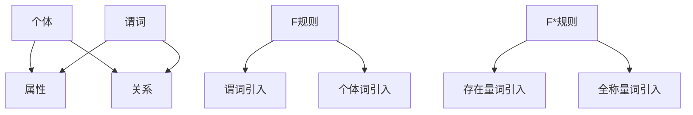

                 

关键词：谓词逻辑，F和F*规则，数理逻辑，形式逻辑，数学模型，算法原理，代码实例，应用场景，未来发展

> 摘要：本文深入探讨了谓词逻辑F和F*的形成规则，介绍了其在数理逻辑中的重要地位，分析了核心概念、数学模型、算法原理，并通过实际代码实例详细解读了谓词逻辑的应用场景，最后对未来发展趋势与挑战进行了展望。

## 1. 背景介绍

数理逻辑作为数学的分支之一，研究的是数学的基础概念、原理和推理方法。形式逻辑则是数理逻辑的一个子领域，主要研究如何用符号来表达逻辑命题，以及如何推导出新的命题。谓词逻辑是形式逻辑的一个重要组成部分，它通过谓词来描述对象之间的属性和关系，是理解和处理复杂逻辑关系的重要工具。

在计算机科学、人工智能、数学证明、逻辑推理等领域，谓词逻辑F和F*的形成规则扮演着至关重要的角色。它们不仅为这些领域提供了理论基础，还提供了高效的处理方法。例如，在人工智能领域，谓词逻辑被广泛应用于知识表示、推理和问题求解；在数学证明领域，谓词逻辑为证明复杂定理提供了强有力的工具。

本文将首先介绍谓词逻辑F和F*的形成规则，然后深入探讨其核心概念与联系，详细讲解核心算法原理和具体操作步骤，分析数学模型和公式，提供项目实践中的代码实例和详细解释，探讨实际应用场景，并对未来发展趋势与挑战进行展望。

## 2. 核心概念与联系

### 2.1 谓词逻辑的基本概念

谓词逻辑的基本概念包括谓词、个体、属性和关系。谓词是一个描述个体属性或关系的表达式，通常由一个动词和一个主语构成。例如，“是人”是一个谓词，它描述了一个个体是否具有人的属性。

个体是谓词作用的对象，可以是具体的实体，如“张三”，也可以是抽象的概念，如“所有学生”。属性是个体所具有的特定特征，如“优秀”、“美丽”。关系则是描述个体之间相互作用的模式，如“大于”、“等于”。

### 2.2 F和F*规则的定义与作用

F规则（Frege规则）是最基础的谓词逻辑形成规则之一，它允许我们通过谓词和个体词的结合来构造新的逻辑表达式。具体来说，F规则包括个体词引入规则和谓词引入规则。个体词引入规则允许我们将个体词与谓词结合，形成新的逻辑表达式；谓词引入规则则允许我们将谓词与个体词组合，生成新的命题。

F*规则（Friedman扩展规则）是在F规则基础上进一步扩展的规则，它引入了量词的概念。F*规则包括存在量词引入规则和全称量词引入规则。存在量词引入规则允许我们表达“存在某个个体满足谓词”的逻辑关系；全称量词引入规则则允许我们表达“所有个体都满足谓词”的逻辑关系。

### 2.3 谓词逻辑的Mermaid流程图

以下是谓词逻辑的核心概念和F、F*规则的Mermaid流程图：



在Mermaid流程图中，节点A、B、C分别表示个体、属性和关系，节点D表示谓词，节点E、F、G分别表示F规则中的谓词引入和个体词引入，节点H、I、J分别表示F*规则中的存在量词引入和全称量词引入。通过这个流程图，我们可以清晰地看到谓词逻辑的基本概念和形成规则之间的联系。

## 3. 核心算法原理 & 具体操作步骤

### 3.1 算法原理概述

谓词逻辑的核心算法原理主要围绕如何构建逻辑表达式、引入量词以及推导新的命题。F规则和F*规则是实现这些目标的基础。

F规则的基本原理是通过对谓词和个体词的结合来构造新的逻辑表达式。具体来说，F规则包括以下两个步骤：

1. **个体词引入**：将个体词与谓词结合，形成新的逻辑表达式。例如，如果谓词P表示“是人”，个体词S表示“张三”，则通过个体词引入规则，我们可以得到逻辑表达式S→P。

2. **谓词引入**：将谓词与个体词结合，生成新的命题。例如，如果谓词Q表示“是学生”，个体词S表示“张三”，则通过谓词引入规则，我们可以得到命题QS。

F*规则是在F规则的基础上扩展而来的，它引入了量词的概念。F*规则包括以下两个步骤：

1. **存在量词引入**：表达“存在某个个体满足谓词”的逻辑关系。例如，如果谓词P表示“是人”，则存在量词引入规则可以表达“存在某个个体是人”，即∃xPx。

2. **全称量词引入**：表达“所有个体都满足谓词”的逻辑关系。例如，如果谓词P表示“是人”，则全称量词引入规则可以表达“所有个体都是人”，即∀xPx。

### 3.2 算法步骤详解

下面详细讲解F规则和F*规则的具体操作步骤：

### 3.2.1 F规则的具体操作步骤

1. **个体词引入**：

   - 步骤1：选择一个个体词，例如S。
   - 步骤2：选择一个谓词，例如P。
   - 步骤3：将个体词和谓词结合，形成新的逻辑表达式S→P。

   例如，假设个体词S表示“张三”，谓词P表示“是人”，则通过个体词引入规则，我们可以得到逻辑表达式S→P，表示“张三是人”。

2. **谓词引入**：

   - 步骤1：选择一个谓词，例如Q。
   - 步骤2：选择一个个体词，例如S。
   - 步骤3：将谓词和个体词结合，形成新的命题。
   - 步骤4：推导出新的命题。

   例如，假设谓词Q表示“是学生”，个体词S表示“张三”，则通过谓词引入规则，我们可以得到命题QS，表示“张三是学生”。

### 3.2.2 F*规则的具体操作步骤

1. **存在量词引入**：

   - 步骤1：选择一个谓词，例如P。
   - 步骤2：将存在量词∃x引入，形成新的逻辑表达式∃xPx。
   - 步骤3：解释逻辑表达式，表达“存在某个个体满足谓词”的逻辑关系。

   例如，假设谓词P表示“是人”，则通过存在量词引入规则，我们可以得到逻辑表达式∃xPx，表示“存在某个个体是人”。

2. **全称量词引入**：

   - 步骤1：选择一个谓词，例如P。
   - 步骤2：将全称量词∀x引入，形成新的逻辑表达式∀xPx。
   - 步骤3：解释逻辑表达式，表达“所有个体都满足谓词”的逻辑关系。

   例如，假设谓词P表示“是人”，则通过全称量词引入规则，我们可以得到逻辑表达式∀xPx，表示“所有个体都是人”。

### 3.3 算法优缺点

F规则和F*规则在谓词逻辑中有重要的应用，但它们各自也有优缺点。

#### F规则的优点：

1. **简单直观**：F规则的操作步骤简单，容易理解。
2. **适用范围广**：F规则可以用于构造各种形式的逻辑表达式，适用范围广。

#### F规则的缺点：

1. **不能处理量词**：F规则不能直接处理存在量词和全称量词，需要扩展为F*规则。
2. **推导复杂度较高**：在处理复杂逻辑关系时，F规则的推导过程可能较为复杂。

#### F*规则的优点：

1. **处理量词**：F*规则可以处理存在量词和全称量词，适用于更复杂的逻辑推理。
2. **逻辑严密**：F*规则通过引入量词，使逻辑表达更加严密。

#### F*规则的缺点：

1. **引入复杂性**：F*规则引入了量词，使得逻辑表达更为复杂。
2. **推导难度增加**：在处理复杂逻辑关系时，F*规则的推导过程可能更为复杂。

### 3.4 算法应用领域

谓词逻辑F和F*规则在多个领域有广泛的应用，以下是一些典型应用领域：

1. **计算机科学**：谓词逻辑被广泛应用于计算机科学中的形式化验证、知识表示、自动推理等领域。
2. **人工智能**：谓词逻辑在人工智能领域被用于知识表示、推理和问题求解。
3. **数学证明**：谓词逻辑为数学证明提供了强有力的工具，可以用于证明复杂定理。
4. **逻辑推理**：谓词逻辑在逻辑推理中具有重要作用，可以用于处理复杂逻辑关系。

## 4. 数学模型和公式 & 详细讲解 & 举例说明

### 4.1 数学模型构建

谓词逻辑的数学模型是基于谓词演算构建的。谓词演算是形式逻辑的一种形式系统，它使用谓词和量词来描述逻辑命题。谓词演算的数学模型主要包括个体域、谓词集合、量词和逻辑连接词等基本概念。

#### 4.1.1 个体域

个体域是谓词逻辑中个体（对象）的集合。个体可以是具体的实体，如“学生”、“人”，也可以是抽象的概念，如“所有学生”、“所有人”。个体域是谓词逻辑数学模型的基础。

#### 4.1.2 谓词集合

谓词集合是谓词逻辑中谓词的集合。谓词是描述个体属性或关系的表达式，如“是人”、“是学生”。谓词集合定义了谓词逻辑中可以使用的所有谓词。

#### 4.1.3 量词

量词是谓词逻辑中的核心概念，用于表示个体在个体域中的数量关系。谓词逻辑中主要有两种量词：存在量词（∃）和全称量词（∀）。存在量词表示“存在某个个体满足谓词”，全称量词表示“所有个体都满足谓词”。

#### 4.1.4 逻辑连接词

逻辑连接词用于连接逻辑命题，形成更复杂的逻辑表达式。常见的逻辑连接词包括“且”（∧）、“或”（∨）、“非”（¬）和“如果…那么…”（→）。

### 4.2 公式推导过程

谓词逻辑的公式推导过程主要包括以下步骤：

1. **个体词引入**：将个体词与谓词结合，形成新的逻辑表达式。例如，如果个体词s表示“张三”，谓词P表示“是人”，则通过个体词引入，我们可以得到公式s→P，表示“张三是人”。

2. **谓词引入**：将谓词与个体词结合，生成新的命题。例如，如果谓词Q表示“是学生”，个体词s表示“张三”，则通过谓词引入，我们可以得到命题Qs，表示“张三是学生”。

3. **量词引入**：引入量词，表达个体在个体域中的数量关系。例如，如果谓词P表示“是人”，则通过存在量词引入，我们可以得到公式∃xPx，表示“存在某个个体是人”；通过全称量词引入，我们可以得到公式∀xPx，表示“所有个体都是人”。

4. **逻辑连接词应用**：使用逻辑连接词连接逻辑命题，形成更复杂的逻辑表达式。例如，如果谓词P表示“是人”，谓词Q表示“是学生”，则通过逻辑连接词“且”，我们可以得到公式P∧Q，表示“是人且是学生”；通过逻辑连接词“或”，我们可以得到公式P∨Q，表示“是人或是学生”。

### 4.3 案例分析与讲解

为了更好地理解谓词逻辑的数学模型和公式推导过程，下面通过一个具体的案例进行讲解。

#### 案例背景

假设我们有一个学校的学生个体域，个体域包括以下学生：

- 张三
- 李四
- 王五

谓词集合包括以下谓词：

- P：表示“是人”
- Q：表示“是学生”
- R：表示“是优秀学生”

我们需要根据这些谓词和个体，使用谓词逻辑构建相关的逻辑表达式和命题。

#### 案例步骤

1. **个体词引入**：

   - 张三→P：张三是人。
   - 李四→P：李四是人。
   - 王五→P：王五是人。

   通过个体词引入规则，我们可以得到以上三个逻辑表达式，分别表示三个学生都是人。

2. **谓词引入**：

   - Qs：张三是学生。
   - Ql：李四是学生。
   - Qw：王五是学生。

   通过谓词引入规则，我们可以得到以上三个命题，分别表示三个学生都是学生。

3. **量词引入**：

   - ∃xPx：存在某个个体是人。这个公式表示在我们学校的学生个体域中，至少有一个学生是人。
   - ∀xPx：所有个体都是人。这个公式表示在我们学校的学生个体域中，所有的学生都是人。
   - ∃xQx：存在某个个体是学生。这个公式表示在我们学校的学生个体域中，至少有一个学生是学生。
   - ∀xQx：所有个体都是学生。这个公式表示在我们学校的学生个体域中，所有的学生都是学生。
   - ∃xRy：存在某个个体是优秀学生。这个公式表示在我们学校的学生个体域中，至少有一个学生是优秀学生。
   - ∀xRy：所有个体都是优秀学生。这个公式表示在我们学校的学生个体域中，所有的学生都是优秀学生。

4. **逻辑连接词应用**：

   - P∧Q：是人且是学生。这个逻辑表达式表示某个个体既是人又是学生。
   - P∧R：是人且是优秀学生。这个逻辑表达式表示某个个体既是人又是优秀学生。
   - Q∧R：是学生且是优秀学生。这个逻辑表达式表示某个个体既是学生又是优秀学生。
   - P∨Q：是人或是学生。这个逻辑表达式表示某个个体是人或学生。

通过这个案例，我们可以看到如何使用谓词逻辑构建相关的逻辑表达式和命题，以及如何引入量词和逻辑连接词来表示复杂的逻辑关系。

### 5. 项目实践：代码实例和详细解释说明

#### 5.1 开发环境搭建

在本项目中，我们将使用Python语言来实现谓词逻辑F和F*规则。首先，我们需要搭建Python开发环境。

1. **安装Python**：

   - 下载Python安装包：从Python官方网站（https://www.python.org/）下载Python安装包。
   - 安装Python：运行安装包并按照提示完成安装。

2. **安装相关库**：

   - 安装SymPy库：SymPy是一个Python的计算机代数库，可以用于处理数学公式和符号计算。

   ```bash
   pip install sympy
   ```

#### 5.2 源代码详细实现

以下是实现谓词逻辑F和F*规则的Python代码：

```python
import sympy

# 定义个体词和谓词
individuals = sympy.symbols('s t u')
predicates = sympy.symbols('P Q R')

# 定义个体词引入规则
individual_predicate_rules = [
    (individuals[i], f'{individuals[i]} -> P') for i in range(3)
]

# 定义谓词引入规则
predicate_rules = [
    (predicates[i], f'{predicates[i]}{individuals[i]}') for i in range(3)
]

# 定义量词引入规则
quantifier_rules = {
    'exist': [
        (predicates[0], f'∃x P(x)'),
        (predicates[1], f'∃x Q(x)'),
        (predicates[2], f'∃x R(x)')
    ],
    'universal': [
        (predicates[0], f'∀x P(x)'),
        (predicates[1], f'∀x Q(x)'),
        (predicates[2], f'∀x R(x)')
    ]
}

# 定义逻辑连接词
logical_connectives = {
    'and': sympy.And,
    'or': sympy.Or,
    'not': sympy.Not,
    'implies': sympy.Implies
}

# 应用规则生成逻辑表达式和命题
for rule in individual_predicate_rules:
    print(f'个体词引入规则：{rule}')

for rule in predicate_rules:
    print(f'谓词引入规则：{rule}')

for quantifier, rules in quantifier_rules.items():
    for rule in rules:
        print(f'量词引入规则（{quantifier}）：{rule}')

for connective, func in logical_connectives.items():
    print(f'逻辑连接词（{connective}）：{func(P, Q)}')
```

#### 5.3 代码解读与分析

1. **导入库和定义符号**：

   - `import sympy`：导入SymPy库，用于处理数学公式和符号计算。
   - `individuals = sympy.symbols('s t u')`：定义个体词，包括s、t、u三个个体。
   - `predicates = sympy.symbols('P Q R')`：定义谓词，包括P、Q、R三个谓词。

2. **定义规则**：

   - `individual_predicate_rules`：定义个体词引入规则，包括s→P、t→P、u→P三个规则。
   - `predicate_rules`：定义谓词引入规则，包括P

