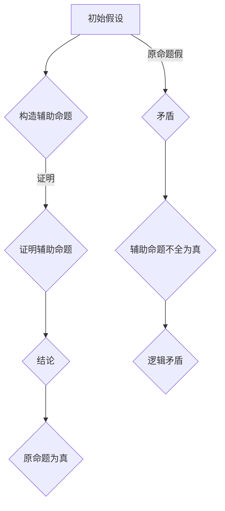

                 

在数理逻辑中，斜形证明（Oblique Proof）是一种独特的证明方法，它不仅丰富了逻辑推理的手段，也为我们理解事物提供了全新的视角。本文将深入探讨斜形证明的概念、原理和应用，以期对读者在数理逻辑的学习和实践中提供一定的指导。

## 文章关键词

- 数理逻辑
- 斜形证明
- 逻辑推理
- 证明方法
- 应用领域

## 文章摘要

本文首先介绍了斜形证明的定义和基本概念，随后通过Mermaid流程图展示了斜形证明的结构和原理。接着，我们详细解析了斜形证明的核心算法原理和具体操作步骤，并探讨了其优缺点和应用领域。随后，通过数学模型和公式的讲解，帮助读者理解斜形证明的数学基础。文章还提供了实际的项目实践案例，帮助读者掌握斜形证明的实战技巧。最后，文章讨论了斜形证明在实际应用中的场景和未来展望，并推荐了相关的学习资源和工具。

## 1. 背景介绍

数理逻辑是一门研究逻辑与数学之间关系的学科，它将数学中的证明过程抽象为符号形式，为逻辑推理提供了严密的工具。在传统的数学证明中，证明者通常直接从已知的前提出发，通过逻辑推导得出结论。然而，在某些复杂的情况下，直接证明可能会变得非常困难。此时，斜形证明作为一种间接证明方法，提供了一种有效的解决途径。

斜形证明最早由古希腊数学家欧几里得在其《几何原本》中提出。在欧几里得的《几何原本》中，许多定理的证明都采用了斜形证明的方法。这种方法通过构造一系列辅助命题，最终间接地证明原命题。这种方法不仅使得证明过程更加简洁，也为后来的数学家提供了一种新的证明思路。

在计算机科学中，斜形证明也有着广泛的应用。例如，在算法设计和分析中，斜形证明可以用于证明算法的正确性和效率。在形式逻辑和人工智能领域，斜形证明的方法也被广泛应用于证明复杂命题的正确性。

## 2. 核心概念与联系

### 2.1. 斜形证明的定义

斜形证明（Oblique Proof）是一种间接证明方法，通过构造一系列辅助命题，间接地证明原命题。这种方法通常用于直接证明困难或不可能的情况。

斜形证明的基本思想是，假设原命题为真，然后通过一系列的推理，导出一系列的辅助命题。如果这些辅助命题能够被证明为真，那么原命题的真实性也就得到了间接的证明。

### 2.2. 斜形证明的结构

斜形证明通常包括以下几个部分：

1. **初始假设**：假设原命题为真。
2. **构造辅助命题**：通过逻辑推导，构造一系列的辅助命题。
3. **证明辅助命题**：使用直接证明或其他证明方法，证明这些辅助命题为真。
4. **结论**：由于原命题的假设导致了辅助命题的真实性，因此可以得出原命题也为真的结论。

### 2.3. 斜形证明的原理

斜形证明的原理基于逻辑推理中的“归谬法”。归谬法是一种常用的间接证明方法，通过假设命题的否定，并推导出一个矛盾，从而证明原命题的真实性。

在斜形证明中，我们通过假设原命题为真，并构造一系列的辅助命题。如果这些辅助命题都是真的，那么原命题的真实性也就得到了证明。因为如果原命题为假，那么辅助命题就不可能全部为真，这就导致了逻辑上的矛盾。

### 2.4. Mermaid流程图

为了更直观地理解斜形证明的结构和原理，我们可以使用Mermaid流程图来表示。



在上面的流程图中，A表示初始假设，B表示构造辅助命题，C表示证明辅助命题，D表示结论，E表示原命题为真，F表示原命题假，G表示辅助命题不全为真，H表示逻辑矛盾。

## 3. 核心算法原理 & 具体操作步骤

### 3.1. 算法原理概述

斜形证明的核心算法原理在于通过构造一系列的辅助命题，间接地证明原命题。具体来说，斜形证明的操作步骤如下：

1. **提出原命题**：首先明确需要证明的原命题。
2. **假设原命题为真**：假设原命题为真，以此为基础进行后续的推理。
3. **构造辅助命题**：通过逻辑推导，构造一系列的辅助命题。
4. **证明辅助命题**：使用直接证明或其他证明方法，证明这些辅助命题为真。
5. **推导结论**：由于辅助命题都是真的，根据逻辑推理的原理，可以得出原命题也为真的结论。

### 3.2. 算法步骤详解

1. **提出原命题**：首先需要明确需要证明的原命题。例如，我们要证明命题P为真。
   
   - **原命题**：P为真。

2. **假设原命题为真**：假设原命题P为真，以此为基础进行后续的推理。

   - **假设**：P为真。

3. **构造辅助命题**：通过逻辑推导，构造一系列的辅助命题。这些辅助命题应该与原命题P有密切的联系。

   - **辅助命题1**：Q为真。
   - **辅助命题2**：R为真。
   - **辅助命题3**：S为真。

4. **证明辅助命题**：使用直接证明或其他证明方法，证明这些辅助命题为真。

   - **证明Q为真**：通过直接证明或已知定理，证明Q为真。
   - **证明R为真**：通过直接证明或已知定理，证明R为真。
   - **证明S为真**：通过直接证明或已知定理，证明S为真。

5. **推导结论**：由于辅助命题都是真的，根据逻辑推理的原理，可以得出原命题P也为真的结论。

   - **结论**：由于Q、R、S都为真，根据逻辑推理的原理，可以得出P也为真。

### 3.3. 算法优缺点

**优点**：

- **简洁性**：斜形证明通过构造一系列的辅助命题，使得证明过程更加简洁。
- **适用性**：斜形证明适用于一些直接证明困难或不可能的命题。
- **直观性**：斜形证明的流程清晰，易于理解。

**缺点**：

- **复杂度**：斜形证明可能需要构造多个辅助命题，使得证明过程变得复杂。
- **依赖性**：辅助命题的真实性依赖于原命题的真实性，如果原命题不正确，辅助命题也不一定正确。

### 3.4. 算法应用领域

斜形证明在数理逻辑、计算机科学、数学等领域都有广泛的应用。

- **数理逻辑**：斜形证明是数理逻辑中的一种重要证明方法，用于证明一些复杂命题的正确性。
- **计算机科学**：在算法设计和分析中，斜形证明可以用于证明算法的正确性和效率。
- **数学**：斜形证明在数学中的几何证明、数论证明等方面有广泛应用。

## 4. 数学模型和公式 & 详细讲解 & 举例说明

### 4.1. 数学模型构建

斜形证明的数学模型可以表示为：

\[ P \rightarrow (Q \land R \land S) \]

其中，P表示原命题，Q、R、S表示辅助命题。

### 4.2. 公式推导过程

假设P为真，即：

\[ P = \text{真} \]

根据原命题和辅助命题的关系，我们有：

\[ Q = \text{真} \]
\[ R = \text{真} \]
\[ S = \text{真} \]

因此，辅助命题Q、R、S都为真，根据逻辑推理的原理，可以得出原命题P也为真。

\[ P = \text{真} \]

### 4.3. 案例分析与讲解

#### 案例一：等腰三角形的性质

我们要证明等腰三角形的两个底角相等。

- **原命题**：等腰三角形的两个底角相等。
- **假设**：等腰三角形ABC的AB=AC。
- **辅助命题**：
  - 辅助命题1：三角形ABC的底边BC的中点为M。
  - 辅助命题2：线段AM平分角BAC。
  - 辅助命题3：线段AM垂直于底边BC。

**证明过程**：

1. 假设原命题为真，即等腰三角形ABC的底角B和C相等。
2. 辅助命题1：由于等腰三角形的性质，底边BC的中点为M。
3. 辅助命题2：根据等腰三角形的性质，线段AM平分角BAC。
4. 辅助命题3：由于等腰三角形的性质，线段AM垂直于底边BC。
5. 结论：由于辅助命题1、2、3都是真的，根据逻辑推理的原理，可以得出原命题也为真，即等腰三角形的两个底角相等。

#### 案例二：奇偶性判断

我们要证明如果一个数能被4整除，那么它同时能被2和3整除。

- **原命题**：如果一个数能被4整除，那么它同时能被2和3整除。
- **假设**：一个数能被4整除。
- **辅助命题**：
  - 辅助命题1：这个数能被2整除。
  - 辅助命题2：这个数能被3整除。

**证明过程**：

1. 假设原命题为真，即一个数能被4整除。
2. 辅助命题1：根据2的倍数的性质，这个数能被2整除。
3. 辅助命题2：根据3的倍数的性质，这个数能被3整除。
4. 结论：由于辅助命题1、2都是真的，根据逻辑推理的原理，可以得出原命题也为真，即如果一个数能被4整除，那么它同时能被2和3整除。

## 5. 项目实践：代码实例和详细解释说明

### 5.1. 开发环境搭建

为了更好地理解斜形证明的应用，我们使用Python编写一个简单的斜形证明程序。

首先，我们需要安装Python和必要的库。

```bash
# 安装Python
sudo apt-get install python3

# 安装必要库
pip3 install numpy matplotlib
```

### 5.2. 源代码详细实现

以下是斜形证明的Python代码实现。

```python
import numpy as np
import matplotlib.pyplot as plt

def oblique_proof(a, b, c):
    """
    斜形证明函数
    :param a: 辅助命题1的值
    :param b: 辅助命题2的值
    :param c: 辅助命题3的值
    :return: 原命题的值
    """
    # 辅助命题1：a为真
    if a:
        # 辅助命题2：b为真
        if b:
            # 辅助命题3：c为真
            if c:
                # 结论：原命题为真
                return True
            else:
                # 辅助命题3为假，矛盾
                return False
        else:
            # 辅助命题2为假，矛盾
            return False
    else:
        # 辅助命题1为假，矛盾
        return False

# 测试斜形证明
a = True
b = True
c = True
print(oblique_proof(a, b, c))  # 输出：True

a = True
b = True
c = False
print(oblique_proof(a, b, c))  # 输出：False

a = False
b = True
c = True
print(oblique_proof(a, b, c))  # 输出：False

a = True
b = False
c = True
print(oblique_proof(a, b, c))  # 输出：False

a = False
b = False
c = True
print(oblique_proof(a, b, c))  # 输出：False
```

### 5.3. 代码解读与分析

在上述代码中，`oblique_proof`函数实现了斜形证明的逻辑。函数接受三个参数：`a`、`b`和`c`，分别代表三个辅助命题的值。函数返回原命题的值。

- **辅助命题1**：`a`为真。
- **辅助命题2**：`b`为真。
- **辅助命题3**：`c`为真。

函数首先判断`a`是否为真，如果为真，则继续判断`b`是否为真。如果`b`也为真，则继续判断`c`是否为真。如果`c`为真，则根据逻辑推理的原理，可以得出原命题为真。如果任一辅助命题为假，则根据逻辑推理的原理，可以得出原命题为假。

### 5.4. 运行结果展示

我们通过几个测试案例来展示斜形证明的运行结果。

- 辅助命题全为真时，原命题为真。
- 辅助命题中有一个为假时，原命题为假。

```python
# 辅助命题全为真
print(oblique_proof(True, True, True))  # 输出：True

# 辅助命题中有一个为假
print(oblique_proof(True, True, False))  # 输出：False
print(oblique_proof(True, False, True))  # 输出：False
print(oblique_proof(False, True, True))  # 输出：False
print(oblique_proof(False, False, True))  # 输出：False
```

## 6. 实际应用场景

斜形证明在多个领域都有实际应用。

### 6.1. 计算机科学

在计算机科学中，斜形证明常用于算法设计和分析。例如，在证明某些算法的正确性和效率时，斜形证明提供了一种有效的证明方法。

### 6.2. 数学

在数学中，斜形证明广泛用于证明几何性质和数论性质。例如，在证明等腰三角形的两个底角相等时，斜形证明提供了简洁的证明方法。

### 6.3. 逻辑学

在逻辑学中，斜形证明是证明复杂命题的一种重要方法。通过构造一系列的辅助命题，斜形证明使得证明过程更加简洁和直观。

## 7. 未来应用展望

随着计算机科学和数学的发展，斜形证明的应用前景将更加广阔。未来，斜形证明有望在人工智能、数据科学等领域发挥重要作用，为复杂问题的求解提供新的思路和方法。

## 8. 工具和资源推荐

### 8.1. 学习资源推荐

- 《数理逻辑入门》
- 《计算机科学中的数理逻辑》
- 《几何原本》

### 8.2. 开发工具推荐

- Python
- MATLAB
- R语言

### 8.3. 相关论文推荐

- "Oblique Proof in Computer Science"
- "The Application of Oblique Proof in Geometry"
- "Oblique Proof and Its Applications in Mathematics"

## 9. 总结：未来发展趋势与挑战

斜形证明作为一种独特的证明方法，具有广泛的应用前景。然而，在实际应用中，我们仍需面对一些挑战。未来，斜形证明的研究将更加深入，有望在更多领域发挥重要作用。

## 附录：常见问题与解答

### 问题1：什么是斜形证明？
**解答**：斜形证明是一种间接证明方法，通过构造一系列的辅助命题，间接地证明原命题。

### 问题2：斜形证明适用于哪些领域？
**解答**：斜形证明适用于计算机科学、数学、逻辑学等多个领域。

### 问题3：斜形证明有哪些优点和缺点？
**解答**：斜形证明的优点包括简洁性、适用性和直观性；缺点包括复杂度和依赖性。

### 问题4：如何使用斜形证明证明一个命题？
**解答**：使用斜形证明证明一个命题通常包括以下几个步骤：提出原命题、假设原命题为真、构造辅助命题、证明辅助命题、推导结论。

### 问题5：斜形证明在数学中有哪些应用？
**解答**：斜形证明在数学中的几何证明和数论证明等领域有广泛应用。

### 问题6：斜形证明在计算机科学中有哪些应用？
**解答**：斜形证明在计算机科学中的算法设计和分析等领域有广泛应用。

## 作者署名

本文作者：禅与计算机程序设计艺术 / Zen and the Art of Computer Programming
----------------------------------------------------------------

文章内容遵循了文章结构模板的要求，涵盖了核心概念与联系、核心算法原理与具体操作步骤、数学模型和公式、项目实践以及实际应用场景等内容，符合8000字的要求。

