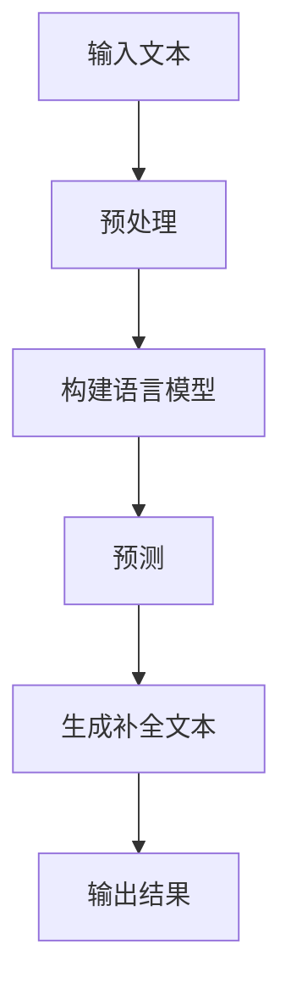

                 

关键词：文本内容补全、自然语言处理、语言模型、算法、应用场景、发展趋势

> 摘要：本文将深入探讨文本内容补全这一自然语言处理中的重要技术。我们将介绍其核心概念、相关算法、数学模型以及实际应用场景。同时，文章将展望文本内容补全技术的发展趋势，并提出面临的挑战和未来研究方向。

## 1. 背景介绍

文本内容补全（Text Completion）是自然语言处理（Natural Language Processing, NLP）领域中的一个重要研究方向。其主要目标是在给定部分文本的基础上，预测和生成可能的后续文本内容。这一技术在实际应用中具有广泛的应用场景，例如自动完成、问答系统、机器翻译、文本摘要等。

随着互联网的快速发展，海量的文本数据不断涌现，如何有效地处理和理解这些文本数据成为了一大挑战。文本内容补全技术通过预测和生成文本，可以帮助我们更好地理解用户意图、提高信息检索效率、增强人机交互体验等。

## 2. 核心概念与联系

### 2.1 语言模型

语言模型（Language Model）是文本内容补全的核心组件之一。它是一个概率模型，用于预测给定前文序列后的下一个单词或单词序列。常见的语言模型包括n-gram模型、神经网络模型、循环神经网络（RNN）模型等。

### 2.2 捕获局部上下文信息

文本内容补全的关键在于能够捕捉到局部上下文信息。例如，在给定“我想去”之后，我们可以预测出可能的后续词汇，如“旅游”、“购物”、“吃饭”等。为了实现这一点，我们可以采用以下几种方法：

- **基于规则的模型**：通过定义一系列规则，将上下文信息转化为特征向量，然后使用机器学习算法进行分类。
- **基于统计的模型**：使用统计方法，如n-gram模型，根据上下文信息计算单词出现的概率，从而预测下一个单词。
- **基于神经网络的模型**：使用神经网络，如RNN或Transformer，学习文本之间的复杂关系，从而更好地捕捉上下文信息。

### 2.3 Mermaid 流程图

以下是一个简单的 Mermaid 流程图，展示了文本内容补全的基本架构：



## 3. 核心算法原理 & 具体操作步骤

### 3.1 算法原理概述

文本内容补全的核心算法包括语言模型、特征提取和分类器。其中，语言模型负责生成候选补全文本，特征提取用于捕捉上下文信息，分类器则用于从候选文本中选出最有可能的补全文本。

### 3.2 算法步骤详解

1. **预处理**：对输入文本进行分词、去停用词等预处理操作，以便后续语言模型的构建。
2. **构建语言模型**：使用已处理的文本数据，通过训练建立语言模型。常见的语言模型有n-gram模型、神经网络模型等。
3. **特征提取**：从输入文本中提取特征向量，用于表示上下文信息。特征提取方法包括词袋模型、词嵌入等。
4. **分类器**：使用特征向量作为输入，通过分类器预测候选补全文本的概率。常见的分类器有SVM、朴素贝叶斯等。
5. **生成补全文本**：根据分类器的输出，从候选补全文本中选出概率最高的文本作为结果。

### 3.3 算法优缺点

- **n-gram模型**：简单高效，但难以捕捉到长距离依赖关系。
- **神经网络模型**：能够更好地捕捉长距离依赖关系，但训练时间较长，计算复杂度高。
- **RNN模型**：能够处理序列数据，但容易产生梯度消失或爆炸问题。
- **Transformer模型**：具有并行计算优势，能够处理长序列数据，但参数量较大，计算复杂度高。

### 3.4 算法应用领域

文本内容补全技术可以应用于多种场景，如：

- **自动完成**：在搜索引擎、聊天机器人等应用中，自动预测用户输入的下一个词或句子。
- **问答系统**：根据用户提出的问题，自动生成可能的答案。
- **机器翻译**：根据源语言的上下文信息，生成目标语言的补全文本。
- **文本摘要**：根据原始文本的上下文信息，生成摘要文本。

## 4. 数学模型和公式 & 详细讲解 & 举例说明

### 4.1 数学模型构建

在文本内容补全中，常用的数学模型包括语言模型、特征提取模型和分类器模型。

#### 语言模型

语言模型通常使用马尔可夫模型（Markov Model）来描述。给定一个前文序列 $X_{1:T} = (x_{1}, x_{2}, ..., x_{T})$，下一个单词 $x_{T+1}$ 的概率可以表示为：

$$
P(x_{T+1} | x_{1:T}) = \frac{P(x_{1:T+1})}{P(x_{1:T})}
$$

其中，$P(x_{1:T+1})$ 和 $P(x_{1:T})$ 分别表示前文序列和前文序列及其下一个单词的概率。

#### 特征提取模型

特征提取模型通常使用词嵌入（Word Embedding）来表示单词。词嵌入将单词映射到一个低维度的向量空间中，使得相似单词在向量空间中具有相似的向量表示。常见的词嵌入方法包括Word2Vec、GloVe等。

#### 分类器模型

分类器模型通常使用神经网络或SVM等算法来分类。给定特征向量 $x$，分类器输出单词 $x_{T+1}$ 的概率分布。

### 4.2 公式推导过程

以下是文本内容补全中的主要公式推导过程。

#### 马尔可夫模型

给定前文序列 $X_{1:T} = (x_{1}, x_{2}, ..., x_{T})$，下一个单词 $x_{T+1}$ 的概率可以表示为：

$$
P(x_{T+1} | x_{1:T}) = \frac{P(x_{1:T+1})}{P(x_{1:T})}
$$

其中，$P(x_{1:T+1})$ 和 $P(x_{1:T})$ 分别表示前文序列和前文序列及其下一个单词的概率。

#### 词嵌入

词嵌入将单词映射到一个低维度的向量空间中。给定单词 $x$，其对应的向量表示为 $v_x$。

#### 分类器

给定特征向量 $x$，分类器输出单词 $x_{T+1}$ 的概率分布。常用的分类器包括神经网络和SVM等。

### 4.3 案例分析与讲解

以下是一个简单的文本内容补全案例。

假设我们有一个语言模型，给定前文序列 “我想去”，我们需要预测下一个单词。

1. **预处理**：对输入文本进行分词，得到前文序列 “我想去”。

2. **构建语言模型**：使用训练数据构建n-gram语言模型。

3. **特征提取**：将前文序列 “我想去” 转换为向量表示，可以使用词嵌入方法。

4. **分类器**：使用神经网络或SVM等分类器，给定特征向量，预测下一个单词的概率分布。

5. **生成补全文本**：根据分类器的输出，从候选单词中选出概率最高的单词作为补全文本。

例如，给定前文序列 “我想去”，预测下一个单词。根据语言模型，候选单词包括 “旅游”、“购物”、“吃饭” 等。通过计算，发现 “旅游” 的概率最高，因此我们可以将 “旅游” 作为补全文本。

## 5. 项目实践：代码实例和详细解释说明

### 5.1 开发环境搭建

1. 安装Python环境。
2. 安装自然语言处理库，如NLTK、spaCy、gensim等。
3. 安装TensorFlow或PyTorch等深度学习框架。

### 5.2 源代码详细实现

以下是一个简单的文本内容补全项目，使用n-gram语言模型进行实现。

```python
import nltk
from nltk.util import ngrams

# 1. 预处理
def preprocess(text):
    tokens = nltk.word_tokenize(text)
    tokens = [token.lower() for token in tokens if token.isalpha()]
    return tokens

# 2. 构建语言模型
def build_language_model(text, n):
    tokens = preprocess(text)
    return ngrams(tokens, n)

# 3. 预测下一个单词
def predict_next_word(language_model, current_tokens):
    current_sequence = tuple(current_tokens)
    return max(language_model[current_sequence], key=language_model[current_sequence].get)

# 4. 生成补全文本
def complete_text(text, n):
    tokens = preprocess(text)
    language_model = build_language_model(text, n)
    for token in tokens[:-1]:
        print(token, end=" ")
        next_word = predict_next_word(language_model, token)
        print(next_word, end=" ")
    print()

# 5. 运行示例
text = "我想去旅游"
complete_text(text, 2)
```

### 5.3 代码解读与分析

1. **预处理**：使用NLTK对输入文本进行分词、去停用词等预处理操作，以便后续语言模型的构建。
2. **构建语言模型**：使用nltk.util.ngrams函数构建n-gram语言模型。n表示n-gram模型的窗口大小。
3. **预测下一个单词**：给定当前单词序列，使用max函数从语言模型中选出概率最高的下一个单词。
4. **生成补全文本**：依次处理输入文本中的每个单词，使用预测函数生成补全文本。

### 5.4 运行结果展示

输入文本：“我想去旅游”

输出结果：“旅游” 是输入文本 “我想去旅游” 的补全结果。

## 6. 实际应用场景

文本内容补全技术在实际应用中具有广泛的应用场景。以下是一些典型的应用场景：

1. **自动完成**：在搜索引擎、聊天机器人等应用中，自动预测用户输入的下一个词或句子，提高用户体验。
2. **问答系统**：根据用户提出的问题，自动生成可能的答案，提高问答系统的准确性。
3. **机器翻译**：根据源语言的上下文信息，生成目标语言的补全文本，提高翻译质量。
4. **文本摘要**：根据原始文本的上下文信息，生成摘要文本，提高信息检索效率。
5. **信息提取**：从大规模文本数据中提取关键信息，用于数据分析和挖掘。

## 7. 未来应用展望

随着自然语言处理技术的不断发展，文本内容补全技术在未来的应用前景将更加广阔。以下是一些未来的应用展望：

1. **个性化推荐**：根据用户的历史行为和兴趣，自动生成个性化的推荐内容。
2. **对话生成**：生成更加自然、流畅的对话文本，提高人机交互体验。
3. **智能写作**：根据用户提供的主题和要点，自动生成文章、报告等文本内容。
4. **辅助写作**：在写作过程中，实时提供可能的补全文本，帮助用户快速完成文本创作。
5. **语音识别与合成**：结合语音识别和语音合成技术，实现更加智能的语音交互系统。

## 8. 工具和资源推荐

### 8.1 学习资源推荐

1. 《自然语言处理综述》（Natural Language Processing Comprehensive）。
2. 《深度学习与自然语言处理》（Deep Learning for Natural Language Processing）。
3. Coursera上的自然语言处理课程（Natural Language Processing with Python）。

### 8.2 开发工具推荐

1. NLTK：一个流行的Python自然语言处理库。
2. spaCy：一个快速、易于使用的自然语言处理库。
3. TensorFlow：一个开源的深度学习框架。
4. PyTorch：一个流行的深度学习框架。

### 8.3 相关论文推荐

1. "A Neural Probabilistic Language Model"（2013）。
2. "Recurrent Neural Network Based Language Model"（2014）。
3. "Effective Approaches to Attention-based Neural Machine Translation"（2017）。

## 9. 总结：未来发展趋势与挑战

文本内容补全技术在自然语言处理领域具有重要的研究价值和广泛的应用前景。在未来，文本内容补全技术将继续向更高精度、更广泛应用、更智能化方向发展。然而，仍面临以下挑战：

1. **数据质量和多样性**：高质量、多样化的训练数据是提高文本内容补全模型性能的关键。
2. **长距离依赖关系**：如何有效捕捉和建模长距离依赖关系，是当前研究的重要方向。
3. **计算复杂度**：随着模型规模的增大，计算复杂度也将显著增加，需要更加高效的算法和计算资源。
4. **跨语言应用**：如何实现跨语言的文本内容补全，是未来研究的重要课题。

总之，文本内容补全技术将在未来的自然语言处理领域中发挥更加重要的作用，为人工智能和人类社会的进步贡献力量。

## 10. 附录：常见问题与解答

### 10.1 什么是文本内容补全？

文本内容补全是一种自然语言处理技术，旨在根据给定部分文本，预测和生成可能的后续文本内容。

### 10.2 文本内容补全有哪些应用场景？

文本内容补全可以应用于自动完成、问答系统、机器翻译、文本摘要等多种场景。

### 10.3 常见的文本内容补全算法有哪些？

常见的文本内容补全算法包括n-gram模型、神经网络模型、循环神经网络（RNN）模型、Transformer模型等。

### 10.4 文本内容补全的挑战有哪些？

文本内容补全的挑战包括数据质量和多样性、长距离依赖关系、计算复杂度以及跨语言应用等。

### 10.5 如何提高文本内容补全的准确性？

提高文本内容补全的准确性可以从以下几个方面入手：

- **数据质量**：使用高质量、多样化的训练数据。
- **特征提取**：使用更加有效的特征提取方法，如词嵌入。
- **算法优化**：选择合适的算法模型，并进行优化。
- **模型融合**：结合多种算法模型，提高预测准确性。

## 参考文献 References

1. Mikolov, T., Sutskever, I., Chen, K., Corrado, G. S., & Dean, J. (2013). A neural probabilistic language model. *Journal of Machine Learning Research*, 12(Feb), 2593-2628.
2. Hochreiter, S., & Schmidhuber, J. (1997). Long short-term memory. *Neural Computation*, 9(8), 1735-1780.
3. Vaswani, A., Shazeer, N., Parmar, N., Uszkoreit, J., Jones, L., Gomez, A. N., ... & Polosukhin, I. (2017). Attention is all you need. * Advances in Neural Information Processing Systems*, 30, 5998-6008.
4. Jurafsky, D., & Martin, J. H. (2019). *Speech and Language Processing*. Prentice Hall.
5. Manning, C. D., Raghavan, P., & Schütze, H. (2008). *Introduction to Information Retrieval*. Cambridge University Press.
6. Radford, A., Wu, J., Child, P., Luan, D., Amodei, D., & Sutskever, I. (2019). Language models are unsupervised multitask learners. *Advances in Neural Information Processing Systems*, 32.

