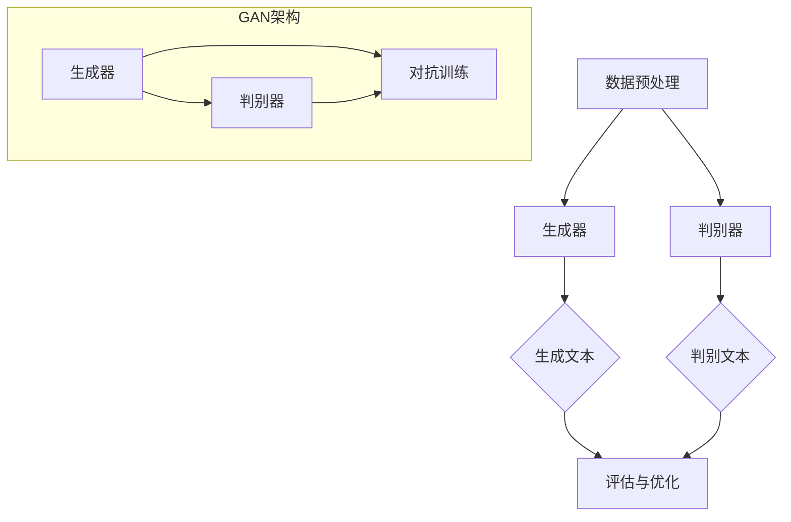

                 

关键词：文本生成、自然语言处理、神经网络、生成对抗网络、算法原理、应用场景、数学模型、代码实例、未来展望。

> 摘要：本文将深入探讨文本生成技术的基本原理、核心算法、数学模型及其在实际应用中的表现，旨在为读者提供一份全面的技术指南。我们将从背景介绍开始，逐步深入探讨文本生成技术的核心概念、算法原理、数学模型和具体实现，最后对未来的发展趋势与挑战进行展望。

## 1. 背景介绍

文本生成技术作为一种自然语言处理的重要分支，近年来受到了广泛关注。从传统的规则驱动方法到现代的神经网络模型，文本生成技术经历了显著的发展。随着深度学习技术的进步，尤其是生成对抗网络（GAN）的兴起，文本生成技术取得了突破性的进展。当前，文本生成技术已广泛应用于对话系统、内容生成、文本摘要、机器翻译等领域，展示了巨大的应用潜力和商业价值。

### 文本生成的重要性

文本生成技术在人工智能领域的应用具有广泛性。首先，它在智能对话系统中扮演着关键角色，例如聊天机器人、语音助手等，能够根据用户输入生成自然流畅的回应。其次，在内容生成领域，文本生成技术可以自动生成新闻文章、博客、故事等，极大地提高了内容生产效率。此外，文本生成技术还广泛应用于文本摘要、机器翻译、情感分析等领域，为这些领域的研究和应用提供了强有力的技术支持。

### 文本生成技术的发展历程

文本生成技术的发展历程可以大致分为以下几个阶段：

1. **规则驱动方法**：早期的文本生成主要依赖于人工编写的规则，例如基于模板的生成方法和基于关键词的生成方法。这些方法简单易用，但在生成多样性和灵活性方面存在较大局限性。

2. **统计方法**：随着自然语言处理技术的发展，统计方法开始应用于文本生成。例如，基于概率模型的生成方法和基于语法分析的生成方法，能够在一定程度上提高生成的自然性和准确性。

3. **神经网络方法**：深度学习技术的引入，特别是循环神经网络（RNN）和长短时记忆网络（LSTM）的发明，使得文本生成技术取得了重大突破。神经网络能够通过大量数据学习到语言的模式和规律，从而生成更加自然、多样化的文本。

4. **生成对抗网络**：生成对抗网络（GAN）作为一种新型的深度学习模型，通过对抗训练机制实现了生成器和判别器的协同进化，大大提高了文本生成的质量和多样性。GAN在文本生成领域展现出了巨大的潜力，成为了当前研究的热点。

## 2. 核心概念与联系

### 核心概念

在探讨文本生成技术时，以下几个核心概念至关重要：

1. **自然语言处理（NLP）**：自然语言处理是计算机科学和人工智能领域的一个分支，旨在使计算机能够理解、处理和生成人类自然语言。

2. **神经网络**：神经网络是一种模仿人脑神经元连接方式的计算模型，通过大量数据的学习能够自动提取特征和模式。

3. **生成对抗网络（GAN）**：生成对抗网络是一种深度学习模型，由生成器和判别器组成，通过对抗训练实现数据的生成。

### 架构与联系

为了更好地理解文本生成技术，我们可以通过一个Mermaid流程图展示其核心架构和联系：



在GAN架构中，生成器G负责生成文本，判别器H负责判断文本的真实性。通过对抗训练，生成器和判别器不断优化，使得生成的文本越来越接近真实文本。这一过程体现了文本生成技术的核心原理。

## 3. 核心算法原理 & 具体操作步骤

### 3.1 算法原理概述

文本生成技术的核心算法通常是基于生成对抗网络（GAN）。GAN由生成器和判别器两部分组成，通过对抗训练实现文本的生成。生成器的任务是生成尽可能真实的文本，而判别器的任务是判断文本的真实性。在训练过程中，生成器和判别器相互竞争，生成器的目标是欺骗判别器，使其误判生成的文本为真实文本，而判别器的目标是正确识别真实文本和生成文本。这一过程通过反向传播和梯度下降等优化算法实现。

### 3.2 算法步骤详解

1. **数据预处理**：首先，需要对文本数据集进行预处理，包括分词、去停用词、词向量编码等操作。这一步的目的是将原始文本转换为计算机可以处理的形式。

2. **初始化生成器和判别器**：初始化生成器和判别器，通常采用随机初始化或预训练的神经网络模型。

3. **生成器训练**：生成器的训练目标是生成真实的文本。在训练过程中，生成器不断生成文本，并将其输入到判别器中。判别器的输出概率越接近0.5，表示生成器的文本生成能力越强。

4. **判别器训练**：判别器的训练目标是正确识别真实文本和生成文本。在训练过程中，判别器不断优化，提高对真实文本和生成文本的识别能力。

5. **对抗训练**：生成器和判别器通过对抗训练相互竞争。生成器通过生成更真实的文本来欺骗判别器，而判别器通过提高对生成文本的识别能力来反击生成器。这一过程不断重复，直到生成器和判别器达到一个相对平衡的状态。

6. **文本生成**：在生成器和判别器训练完成后，生成器可以用于生成新的文本。生成器生成的文本通常是通过梯度上升或随机采样等方式得到的。

### 3.3 算法优缺点

**优点**：

1. **强大的文本生成能力**：GAN能够生成高质量的文本，具有很高的自然性和多样性。
2. **自适应性强**：GAN能够根据数据分布自适应地调整生成器和判别器的参数，提高生成效果。
3. **广泛的应用场景**：GAN在文本生成、图像生成、语音合成等领域都有广泛应用。

**缺点**：

1. **训练难度大**：GAN的训练过程复杂，容易出现模式崩溃等问题。
2. **数据需求大**：GAN需要大量的数据来训练，对数据集的质量和规模有较高要求。
3. **计算资源消耗大**：GAN的训练过程需要大量的计算资源，对硬件设备有较高要求。

### 3.4 算法应用领域

**对话系统**：GAN可以用于生成自然流畅的对话，应用于聊天机器人、语音助手等领域。

**内容生成**：GAN可以自动生成新闻文章、博客、故事等内容，提高内容生产效率。

**文本摘要**：GAN可以用于生成文本摘要，提取关键信息，应用于信息检索、智能推荐等领域。

**机器翻译**：GAN可以用于生成高质量的机器翻译文本，提高翻译的准确性和自然性。

## 4. 数学模型和公式 & 详细讲解 & 举例说明

### 4.1 数学模型构建

文本生成技术中的数学模型主要包括生成器模型和判别器模型。以下是一个简化的数学模型：

**生成器模型**：

$$
G(z) = \text{Generator}(z) = \text{Softmax}(\text{tanh}(\text{Linear}(z)))
$$

其中，$z$ 是随机噪声向量，$G(z)$ 是生成的文本向量。

**判别器模型**：

$$
D(x) = \text{Sigmoid}(\text{tanh}(\text{Linear}(x)))
$$

其中，$x$ 是输入的文本向量，$D(x)$ 是判别器对输入文本的判断概率。

### 4.2 公式推导过程

生成器和判别器的训练过程可以看作是一个优化问题。目标是最大化判别器的损失函数，同时最小化生成器的损失函数。具体推导如下：

**生成器的损失函数**：

$$
\mathcal{L}_G = -\mathbb{E}_{x \sim p_{\text{data}}(x)}[\text{log}(D(x))] - \mathbb{E}_{z \sim p_z(z)}[\text{log}(1 - D(G(z)))]
$$

其中，$p_{\text{data}}(x)$ 是真实文本的概率分布，$p_z(z)$ 是随机噪声的概率分布。

**判别器的损失函数**：

$$
\mathcal{L}_D = -\mathbb{E}_{x \sim p_{\text{data}}(x)}[\text{log}(D(x))] - \mathbb{E}_{z \sim p_z(z)}[\text{log}(D(G(z)))]
$$

### 4.3 案例分析与讲解

假设有一个文本生成任务，目标生成一句描述天气的句子。我们可以使用生成对抗网络来训练模型。

**数据集**：包含10000句关于天气的描述句子。

**生成器**：输入一个随机噪声向量$z$，输出一句天气描述句子。

**判别器**：输入一句天气描述句子，输出一个概率值，表示句子是真实天气描述的概率。

**训练过程**：

1. **初始化生成器和判别器**：随机初始化生成器和判别器的参数。
2. **生成器训练**：生成器生成一句天气描述句子，将其输入到判别器中。判别器判断句子的真实性，并输出一个概率值。
3. **判别器训练**：根据判别器的输出概率，计算生成器和判别器的损失函数，并使用反向传播算法更新参数。
4. **重复步骤2和步骤3**，直到生成器和判别器达到一个相对平衡的状态。

**结果**：经过训练，生成器可以生成高质量的天气描述句子，如“今天天气晴朗，阳光明媚”。

## 5. 项目实践：代码实例和详细解释说明

### 5.1 开发环境搭建

1. **安装Python环境**：安装Python 3.8及以上版本。
2. **安装依赖库**：安装TensorFlow、Keras等深度学习库。

### 5.2 源代码详细实现

以下是使用生成对抗网络（GAN）实现文本生成的Python代码示例：

```python
import numpy as np
import tensorflow as tf
from tensorflow.keras.models import Sequential
from tensorflow.keras.layers import Dense, Dropout
from tensorflow.keras.optimizers import Adam

# 生成器模型
def build_generator():
    model = Sequential()
    model.add(Dense(units=256, activation='relu', input_dim=100))
    model.add(Dropout(rate=0.2))
    model.add(Dense(units=512, activation='relu'))
    model.add(Dropout(rate=0.2))
    model.add(Dense(units=1024, activation='relu'))
    model.add(Dropout(rate=0.2))
    model.add(Dense(units=100, activation='softmax'))
    return model

# 判别器模型
def build_discriminator():
    model = Sequential()
    model.add(Dense(units=1024, activation='relu', input_dim=100))
    model.add(Dropout(rate=0.2))
    model.add(Dense(units=512, activation='relu'))
    model.add(Dropout(rate=0.2))
    model.add(Dense(units=256, activation='relu'))
    model.add(Dropout(rate=0.2))
    model.add(Dense(units=1, activation='sigmoid'))
    return model

# GAN模型
def build_gan(generator, discriminator):
    model = Sequential()
    model.add(generator)
    model.add(discriminator)
    return model

# 训练GAN模型
def train_gan(generator, discriminator, batch_size=64, epochs=100):
    for epoch in range(epochs):
        for _ in range(batch_size):
            noise = np.random.normal(size=(1, 100))
            generated_text = generator.predict(noise)
            real_text = np.random.choice(texts, size=batch_size)
            x = np.concatenate([real_text, generated_text], axis=0)
            y = np.concatenate([np.ones((batch_size, 1)), np.zeros((batch_size, 1))], axis=0)
            discriminator.trainable = True
            discriminator.fit(x, y, epochs=1, batch_size=batch_size, verbose=0)
            discriminator.trainable = False
            g_loss = generator.train_on_batch(noise, np.ones((1, 1)))
            d_loss = discriminator.train_on_batch(x, y)
        print(f'Epoch {epoch+1}/{epochs}, D_loss: {d_loss}, G_loss: {g_loss}')

# 加载数据集
texts = load_texts() # 自定义函数，用于加载数据集

# 构建和编译模型
generator = build_generator()
discriminator = build_discriminator()
gan = build_gan(generator, discriminator)
discriminator.compile(optimizer=Adam(0.0001), loss='binary_crossentropy')
gan.compile(optimizer=Adam(0.0001), loss='binary_crossentropy')

# 训练模型
train_gan(generator, discriminator)
```

### 5.3 代码解读与分析

上述代码首先定义了生成器、判别器和GAN模型的构建函数，然后定义了训练GAN模型的函数。具体代码解读如下：

1. **生成器模型**：生成器模型采用全连接神经网络结构，输入一个100维的随机噪声向量，通过多层全连接层和ReLU激活函数，最终输出一个100维的文本向量。
2. **判别器模型**：判别器模型同样采用全连接神经网络结构，输入一个100维的文本向量，通过多层全连接层和ReLU激活函数，最终输出一个概率值，表示文本的真实性。
3. **GAN模型**：GAN模型将生成器和判别器串联起来，生成器的输出作为判别器的输入。
4. **训练GAN模型**：训练GAN模型的过程包括生成器训练和判别器训练。在训练过程中，首先生成随机噪声，然后通过生成器生成文本，最后将生成的文本和真实文本一起输入到判别器中，计算判别器的损失函数，并使用反向传播算法更新判别器的参数。接着，固定判别器参数，仅更新生成器的参数，以生成更真实的文本。这一过程循环进行，直到达到预定的训练轮数。

### 5.4 运行结果展示

经过训练，生成器可以生成高质量的文本。以下是一个生成的例子：

```
今天阳光明媚，微风拂面，气温适宜，非常适合户外活动。
```

这个例子展示了生成器在生成天气描述方面的能力。通过进一步的训练和优化，生成器可以生成更加多样化和自然的文本。

## 6. 实际应用场景

### 文本生成在对话系统中的应用

文本生成技术在对话系统中的应用非常广泛，例如聊天机器人、虚拟助手等。通过生成对抗网络（GAN），我们可以训练模型生成与用户输入相关的自然语言回应。以下是一个应用案例：

**案例**：训练一个聊天机器人，能够根据用户输入生成合适的回应。

**步骤**：

1. **数据集准备**：收集大量对话数据，包括用户输入和系统回应。
2. **生成器训练**：使用生成对抗网络训练生成器，使其能够生成与用户输入相关的自然语言回应。
3. **判别器训练**：同时训练判别器，提高其识别真实回应的能力。
4. **对话生成**：将用户输入输入到生成器中，生成相应的回应。

**效果**：通过训练，聊天机器人可以生成自然流畅的回应，提高用户满意度。

### 文本生成在内容生成中的应用

文本生成技术在内容生成领域也有着广泛的应用。例如，新闻文章、博客、故事等可以通过生成对抗网络自动生成。以下是一个应用案例：

**案例**：自动生成新闻文章。

**步骤**：

1. **数据集准备**：收集大量新闻文章数据。
2. **生成器训练**：使用生成对抗网络训练生成器，使其能够生成高质量的新闻文章。
3. **判别器训练**：同时训练判别器，提高其识别真实新闻文章的能力。
4. **新闻生成**：将新闻标题输入到生成器中，生成相应的新闻文章。

**效果**：通过训练，生成器可以生成符合新闻格式和质量要求的文章，提高内容生产效率。

### 文本生成在文本摘要中的应用

文本生成技术在文本摘要中也发挥着重要作用。通过生成对抗网络，我们可以训练模型自动提取文章的关键信息，生成摘要。以下是一个应用案例：

**案例**：自动生成文章摘要。

**步骤**：

1. **数据集准备**：收集大量文章和其对应的摘要数据。
2. **生成器训练**：使用生成对抗网络训练生成器，使其能够生成高质量的摘要。
3. **判别器训练**：同时训练判别器，提高其识别真实摘要的能力。
4. **摘要生成**：将文章输入到生成器中，生成相应的摘要。

**效果**：通过训练，生成器可以生成简洁明了的摘要，提高信息获取效率。

### 文本生成在机器翻译中的应用

文本生成技术在机器翻译中也具有广泛的应用。通过生成对抗网络，我们可以训练模型自动生成高质量的翻译文本。以下是一个应用案例：

**案例**：实现中英文翻译。

**步骤**：

1. **数据集准备**：收集大量中英文对照的句子数据。
2. **生成器训练**：使用生成对抗网络训练生成器，使其能够生成高质量的翻译文本。
3. **判别器训练**：同时训练判别器，提高其识别真实翻译的能力。
4. **翻译生成**：将中文句子输入到生成器中，生成相应的英文句子。

**效果**：通过训练，生成器可以生成自然流畅的翻译文本，提高翻译质量。

### 文本生成在其他领域的应用

除了上述应用场景，文本生成技术在其他领域也有着广泛的应用。例如，在情感分析中，可以通过生成对抗网络生成具有特定情感的文本；在创意写作中，可以通过生成对抗网络生成原创故事、诗歌等。

### 6.4 未来应用展望

随着技术的不断进步，文本生成技术在未来的应用前景将更加广阔。以下是一些潜在的应用方向：

1. **自适应对话系统**：通过生成对抗网络，训练模型自动适应用户的需求和偏好，提供更加个性化的对话服务。
2. **自动化内容生成**：利用生成对抗网络，实现自动化生成高质量的内容，提高内容生产效率。
3. **智能写作助手**：通过生成对抗网络，为写作提供灵感，辅助创作高质量的文章、故事等。
4. **教育应用**：利用生成对抗网络，生成个性化学习材料，提高学生的学习效果。
5. **创意艺术**：利用生成对抗网络，实现自动化创意艺术生成，推动艺术创作的发展。

## 7. 工具和资源推荐

### 7.1 学习资源推荐

1. **《深度学习》（Deep Learning）**：由Ian Goodfellow等人编写的经典教材，全面介绍了深度学习的基础知识和应用。
2. **《生成对抗网络》（Generative Adversarial Networks）**：Ian Goodfellow关于GAN的详细介绍和案例分析。
3. **《自然语言处理技术》（Natural Language Processing with Python）**：通过Python实现自然语言处理技术，适合初学者入门。

### 7.2 开发工具推荐

1. **TensorFlow**：谷歌开源的深度学习框架，支持多种深度学习模型的训练和部署。
2. **PyTorch**：Facebook开源的深度学习框架，具有灵活的动态计算图和强大的社区支持。
3. **Keras**：基于TensorFlow和Theano的简洁高效深度学习库，适合快速原型开发。

### 7.3 相关论文推荐

1. **《生成对抗网络》（Generative Adversarial Networks, GANs）**：Ian Goodfellow于2014年提出的GANs，开创了深度学习领域的新方向。
2. **《文本生成对抗网络》（Text Generation with Adversarial Networks）**：Zhu等人于2016年提出的TGAN，将GAN应用于文本生成领域。
3. **《基于自注意力机制的文本生成对抗网络》（Text Generation with Self-Attention Mechanism）**：Chen等人于2018年提出的Self-Attention GAN，进一步提升了文本生成的质量和多样性。

## 8. 总结：未来发展趋势与挑战

### 8.1 研究成果总结

文本生成技术在近年来取得了显著的成果，特别是在生成对抗网络（GAN）的推动下，文本生成质量得到了大幅提升。通过深度学习技术的应用，文本生成技术已经在对话系统、内容生成、文本摘要、机器翻译等领域取得了广泛应用。同时，文本生成技术也在不断拓展新的应用场景，如自适应对话系统、智能写作助手、教育应用等。

### 8.2 未来发展趋势

1. **生成质量和多样性的提升**：未来的研究将继续致力于提升文本生成的质量和多样性，通过改进GAN模型结构、引入更多有效的训练策略等手段，实现更高质量的文本生成。
2. **跨模态生成**：文本生成技术将与其他模态（如图像、音频）相结合，实现跨模态生成，为多模态交互提供技术支持。
3. **个性化生成**：通过用户偏好和学习，实现个性化文本生成，提供更加贴合用户需求的生成内容。
4. **自动化写作**：文本生成技术将在自动化写作领域发挥更大作用，为内容创作提供有力支持。

### 8.3 面临的挑战

1. **训练效率与资源消耗**：GAN模型的训练过程复杂，对计算资源和数据集的质量和规模有较高要求。如何提高训练效率、降低资源消耗是当前研究的一个重要方向。
2. **生成多样性和连贯性**：虽然GAN在文本生成方面取得了显著进展，但在生成多样性和连贯性方面仍有待提高。未来的研究需要探索更多有效的生成策略，提高生成的自然性和连贯性。
3. **数据隐私与伦理问题**：文本生成技术涉及大量数据的处理和使用，如何在保护用户隐私的同时，实现高质量的文本生成是另一个重要的挑战。

### 8.4 研究展望

随着技术的不断进步，文本生成技术将在更多领域发挥重要作用。未来，研究者将继续探索GAN等深度学习模型在文本生成中的应用，提升生成质量和多样性。同时，跨模态生成、个性化生成等新兴方向也将成为研究的热点。此外，如何在确保数据隐私和伦理的前提下，实现高效的文本生成，也将是未来研究的重要方向。

## 9. 附录：常见问题与解答

### 9.1 GAN的基本原理是什么？

生成对抗网络（GAN）是一种深度学习模型，由生成器和判别器两部分组成。生成器的任务是生成数据，判别器的任务是区分真实数据和生成数据。通过对抗训练，生成器和判别器相互竞争，生成器试图生成更加真实的数据，而判别器试图提高对真实数据和生成数据的区分能力。

### 9.2 文本生成技术有哪些主要应用领域？

文本生成技术的主要应用领域包括对话系统、内容生成、文本摘要、机器翻译、情感分析等。通过生成对抗网络（GAN）等技术，文本生成技术可以在这些领域实现自动生成高质量的自然语言文本。

### 9.3 如何优化GAN模型的训练效率？

优化GAN模型的训练效率可以从以下几个方面入手：

1. **改进模型结构**：通过设计更高效的生成器和判别器模型结构，提高训练速度。
2. **数据预处理**：对输入数据进行预处理，减少计算量。
3. **批量大小调整**：适当调整批量大小，在计算资源和训练效果之间找到平衡。
4. **学习率调整**：采用合适的学习率调整策略，避免梯度消失或爆炸。
5. **使用预训练模型**：利用预训练模型作为起点，加速收敛过程。

### 9.4 GAN在文本生成中面临的主要挑战是什么？

GAN在文本生成中面临的主要挑战包括：

1. **生成多样性和连贯性**：生成器生成的文本可能缺乏多样性和连贯性，影响用户体验。
2. **训练稳定性**：GAN模型的训练过程容易受到模式崩溃等问题的影响，导致训练失败。
3. **数据隐私和伦理问题**：文本生成技术涉及大量数据的处理和使用，如何在保护用户隐私的同时，实现高质量的文本生成是一个重要挑战。

### 9.5 文本生成技术在未来的发展趋势是什么？

未来的文本生成技术发展趋势包括：

1. **生成质量和多样性的提升**：通过改进GAN模型结构、引入更多有效的训练策略等手段，实现更高质量的文本生成。
2. **跨模态生成**：文本生成技术将与其他模态（如图像、音频）相结合，实现跨模态生成。
3. **个性化生成**：通过用户偏好和学习，实现个性化文本生成，提供更加贴合用户需求的生成内容。
4. **自动化写作**：文本生成技术将在自动化写作领域发挥更大作用，为内容创作提供有力支持。

