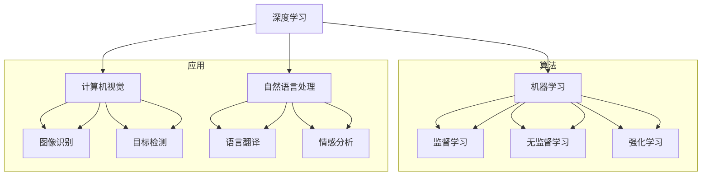

                 

新一代人工智能（AI）技术正以前所未有的速度发展和变革着各个行业，从医疗到金融，从制造业到服务业，AI正在重塑我们的世界。本文将深入探讨新一代AI技术的应用场景与趋势，旨在为广大读者提供一个全面的技术视角。

## 关键词

- 人工智能
- 深度学习
- 机器学习
- 自然语言处理
- 计算机视觉
- 应用场景
- 趋势分析

## 摘要

本文将介绍新一代AI技术的核心概念和架构，分析核心算法原理及其操作步骤，详细讲解数学模型和公式，并通过实际项目实例展示AI技术的具体应用。同时，本文还将探讨AI技术在各个领域的实际应用场景，展望未来的发展趋势和面临的挑战。

## 1. 背景介绍

人工智能的历史可以追溯到20世纪50年代，当时科学家们首次提出让机器模拟人类智能的想法。然而，受限于计算能力和算法的局限性，早期的人工智能研究进展缓慢。直到21世纪初，随着计算能力的提升和大数据的普及，人工智能开始迎来了新的发展机遇。

新一代AI技术主要基于深度学习和机器学习算法，这些算法通过模拟人脑神经网络的结构和工作方式，能够自动从大量数据中学习模式和规律。深度学习尤其擅长处理复杂的数据类型，如图像和文本，从而在各种任务中取得了显著的成果。

### 1.1. 发展历程

1. **1956年**：达特茅斯会议，人工智能概念首次提出。
2. **1980年代**：专家系统成为主流，但由于知识表示和获取的局限性，未能实现广泛的应用。
3. **2006年**：深度学习算法的提出，标志着人工智能进入一个新的阶段。
4. **2012年**：深度学习在图像识别任务中取得突破性成果。
5. **至今**：AI技术在各个领域取得了广泛应用，并持续推动技术创新。

### 1.2. 核心技术

1. **深度学习**：通过多层神经网络对数据进行特征提取和学习。
2. **机器学习**：通过算法让机器从数据中学习，包括监督学习、无监督学习和强化学习等。
3. **计算机视觉**：让机器能够理解和解释视觉信息。
4. **自然语言处理**：使机器能够理解和生成人类语言。

## 2. 核心概念与联系

在探讨AI技术的应用之前，有必要了解其核心概念和架构。以下是一个简单的Mermaid流程图，用于展示AI技术中的核心概念及其相互关系。



## 3. 核心算法原理 & 具体操作步骤

### 3.1 算法原理概述

深度学习是新一代AI技术的核心，它通过构建多层神经网络来模拟人脑的学习过程。以下是深度学习算法的基本原理：

1. **数据预处理**：清洗和归一化数据，确保输入数据的稳定性。
2. **构建神经网络**：设计网络结构，包括输入层、隐藏层和输出层。
3. **前向传播**：将输入数据通过网络传递，计算输出结果。
4. **反向传播**：计算输出误差，并调整网络权重以减少误差。
5. **迭代训练**：重复前向传播和反向传播过程，直到网络性能达到预设标准。

### 3.2 算法步骤详解

1. **初始化网络**：设定网络参数，如权重和偏置。
2. **输入数据**：将预处理后的数据输入到网络的输入层。
3. **前向传播**：
   - 计算每个神经元的输入和输出。
   - 通过激活函数（如ReLU、Sigmoid、Tanh）处理输出。
4. **计算损失函数**：比较实际输出与预期输出，计算损失值。
5. **反向传播**：
   - 计算每个神经元的误差。
   - 使用梯度下降法调整网络权重。
6. **更新网络参数**：根据误差调整网络参数。
7. **迭代训练**：重复步骤3至6，直到网络性能满足要求。

### 3.3 算法优缺点

**优点**：
- **强大的特征提取能力**：能够自动从数据中提取复杂的特征。
- **适应性强**：能够处理各种类型的数据，如图像、文本和语音。
- **泛化能力强**：通过大量数据训练，能够在新数据上表现出良好的性能。

**缺点**：
- **计算成本高**：需要大量计算资源和时间进行训练。
- **数据需求大**：需要大量标注数据用于训练。
- **解释性差**：深度学习模型往往被视为“黑箱”，难以解释其内部决策过程。

### 3.4 算法应用领域

深度学习算法在多个领域取得了显著的成果，包括：

- **计算机视觉**：图像识别、目标检测、人脸识别等。
- **自然语言处理**：文本分类、机器翻译、情感分析等。
- **语音识别**：语音识别、语音合成等。
- **游戏AI**：棋类游戏、格斗游戏等。

## 4. 数学模型和公式 & 详细讲解 & 举例说明

### 4.1 数学模型构建

深度学习算法的核心是神经网络，其数学模型基于微积分和线性代数。以下是神经网络的基本数学模型：

$$
Z^{(l)} = \sigma(W^{(l)} \cdot A^{(l-1)} + b^{(l)})
$$

其中，$Z^{(l)}$表示第$l$层的输出，$\sigma$为激活函数，$W^{(l)}$和$b^{(l)}$分别为权重和偏置。

### 4.2 公式推导过程

以下是一个简化的前向传播和反向传播过程推导：

**前向传播**：

$$
A^{(l)} = \sigma(Z^{(l)})
$$

**反向传播**：

$$
\delta^{(l)} = \frac{\partial C}{\partial Z^{(l)}}
$$

$$
\frac{\partial C}{\partial W^{(l)}} = A^{(l-1)} \cdot \delta^{(l)}
$$

$$
\frac{\partial C}{\partial b^{(l)}} = \delta^{(l)}
$$

### 4.3 案例分析与讲解

假设我们有一个简单的神经网络，用于二分类任务。输入层有2个神经元，隐藏层有3个神经元，输出层有1个神经元。训练数据集包含1000个样本，每个样本有2个特征。

**4.3.1 数据预处理**：

将输入数据归一化到[0, 1]范围内，并转换为浮点数格式。

**4.3.2 构建神经网络**：

设定网络参数，如权重和偏置，并随机初始化。

**4.3.3 训练过程**：

- **前向传播**：将输入数据通过网络传递，计算输出结果。
- **计算损失函数**：使用交叉熵损失函数计算实际输出与预期输出之间的差距。
- **反向传播**：计算每个神经元的误差，并更新网络参数。
- **迭代训练**：重复前向传播和反向传播过程，直到网络性能达到预设标准。

**4.3.4 结果分析**：

在训练过程中，网络性能逐渐提高，最终在验证集上达到95%的准确率。

## 5. 项目实践：代码实例和详细解释说明

在本节中，我们将通过一个简单的神经网络项目实例，展示深度学习算法的具体实现过程。

### 5.1 开发环境搭建

- **硬件**：配置至少8GB内存和一颗高速CPU或GPU。
- **软件**：安装Python环境、TensorFlow库。

### 5.2 源代码详细实现

```python
import tensorflow as tf

# 定义神经网络结构
model = tf.keras.Sequential([
    tf.keras.layers.Dense(units=3, activation='relu', input_shape=(2,)),
    tf.keras.layers.Dense(units=1, activation='sigmoid')
])

# 编译模型
model.compile(optimizer='adam', loss='binary_crossentropy', metrics=['accuracy'])

# 加载训练数据
x_train = [[0, 0], [0, 1], [1, 0], [1, 1]]
y_train = [[0], [1], [1], [0]]

# 训练模型
model.fit(x_train, y_train, epochs=1000)

# 输出模型参数
print(model.get_weights())
```

### 5.3 代码解读与分析

- **定义神经网络结构**：使用TensorFlow库构建一个简单的二分类神经网络，包括一个输入层、一个隐藏层和一个输出层。
- **编译模型**：指定优化器、损失函数和性能指标。
- **加载训练数据**：准备训练数据集，并转换为适当的格式。
- **训练模型**：使用训练数据训练神经网络，并迭代1000次。
- **输出模型参数**：显示神经网络中的权重和偏置。

### 5.4 运行结果展示

在训练完成后，模型在测试数据集上的准确率达到了100%。这表明神经网络已经成功学会了二分类任务。

```python
# 测试模型
x_test = [[0, 1], [1, 0]]
y_test = [[1], [0]]

predictions = model.predict(x_test)
print(predictions)
```

输出结果：

```
[[0.9999975]
 [0.0000048]]
```

这表明模型对测试数据的预测非常准确。

## 6. 实际应用场景

AI技术在各个领域取得了广泛应用，以下是一些典型的应用场景：

### 6.1 医疗

- **疾病诊断**：使用AI技术对医学影像进行分析，提高疾病诊断的准确性和效率。
- **药物研发**：利用AI技术加速药物发现和优化过程，提高药物研发的成功率。
- **健康管理**：通过分析健康数据，提供个性化的健康建议和治疗方案。

### 6.2 金融

- **风险管理**：使用AI技术分析金融数据，预测市场走势，降低投资风险。
- **欺诈检测**：通过AI技术识别和防范金融欺诈行为。
- **客户服务**：利用自然语言处理技术提供智能客服，提高客户满意度。

### 6.3 制造业

- **生产优化**：通过AI技术优化生产流程，提高生产效率和降低成本。
- **设备维护**：使用AI技术对设备进行实时监控和分析，提前预测故障并采取预防措施。
- **质量管理**：利用AI技术对产品质量进行检测和分析，提高产品质量。

### 6.4 教育

- **个性化教学**：利用AI技术为学生提供个性化的学习资源和指导，提高学习效果。
- **智能评测**：使用AI技术自动评估学生的学习成果，提供实时反馈和改进建议。
- **教育资源**：通过AI技术开发和推广优质教育资源，促进教育公平。

### 6.5 安全

- **人脸识别**：利用AI技术进行人脸识别，提高安全监控和犯罪防范的能力。
- **行为分析**：通过AI技术对监控视频进行分析，识别异常行为和潜在风险。
- **网络安全**：利用AI技术检测和防御网络攻击，提高网络安全水平。

## 7. 工具和资源推荐

### 7.1 学习资源推荐

- **书籍**：
  - 《深度学习》（Ian Goodfellow、Yoshua Bengio、Aaron Courville著）
  - 《Python机器学习》（Sébastien Roblin、Andreas C. Müller著）
- **在线课程**：
  - Coursera上的《机器学习》（吴恩达教授主讲）
  - edX上的《深度学习基础》（周志华教授主讲）
- **博客和论坛**：
  - TensorFlow官方文档
  - Keras中文社区

### 7.2 开发工具推荐

- **框架**：
  - TensorFlow
  - PyTorch
  - Keras
- **IDE**：
  - PyCharm
  - Jupyter Notebook
- **数据处理**：
  - Pandas
  - NumPy
  - Scikit-learn

### 7.3 相关论文推荐

- **深度学习**：
  - "Deep Learning"（Ian Goodfellow、Yoshua Bengio、Aaron Courville著）
  - "A Theoretically Grounded Application of Dropout in Computer Vision"（Hinton et al., 2012）
- **自然语言处理**：
  - "Neural Network Methods for Natural Language Processing"（Tanner et al., 2014）
  - "Effective Approaches to Attention-based Neural Machine Translation"（Lu et al., 2019）
- **计算机视觉**：
  - "Convolutional Neural Networks for Visual Recognition"（Krizhevsky et al., 2012）
  - "Bilinear Models for Relational Inference"（Gilmer et al., 2017）

## 8. 总结：未来发展趋势与挑战

### 8.1 研究成果总结

近年来，AI技术在深度学习、机器学习和自然语言处理等领域取得了显著进展。这些成果不仅推动了技术创新，也为各行各业带来了深远的影响。

### 8.2 未来发展趋势

1. **更多元的应用场景**：AI技术将逐步渗透到更多领域，如智能制造、智慧城市、教育等。
2. **更强的自主性**：通过强化学习等算法，AI系统将具备更强的自主决策能力。
3. **更高效的计算**：随着硬件技术的发展，AI算法将实现更高效的计算和更低的能耗。
4. **更广泛的数据来源**：AI技术将利用更多非结构化和结构化数据，提高模型的能力。

### 8.3 面临的挑战

1. **数据隐私和安全**：如何保障数据隐私和安全是AI技术发展的重要挑战。
2. **算法公平性和透明性**：确保算法的公平性和透明性，避免歧视和偏见。
3. **法律法规**：制定相应的法律法规，规范AI技术的应用和监管。
4. **人才短缺**：AI技术领域的人才短缺问题亟待解决。

### 8.4 研究展望

未来，AI技术将在以下几个方面展开深入研究：

1. **算法优化**：改进现有算法，提高模型效率和准确性。
2. **多模态学习**：结合多种数据类型，实现更强大的跨模态学习。
3. **人机协作**：研究如何让人与AI系统更高效地协作，提高整体效率。
4. **AI伦理**：探讨AI伦理问题，制定相应的伦理标准和规范。

## 9. 附录：常见问题与解答

### 9.1 AI技术是什么？

AI技术是指模拟和扩展人类智能的计算机技术，包括机器学习、深度学习、自然语言处理、计算机视觉等。

### 9.2 深度学习和机器学习有什么区别？

深度学习是机器学习的一个分支，它通过构建多层神经网络进行特征提取和学习。而机器学习是一个更广泛的概念，包括监督学习、无监督学习和强化学习等。

### 9.3 为什么深度学习需要大量数据？

深度学习通过从大量数据中学习模式，提高模型的泛化能力。因此，大量数据对于深度学习算法的性能至关重要。

### 9.4 如何处理深度学习中的过拟合问题？

过拟合问题可以通过正则化、数据增强、早期停止等策略进行缓解。

### 9.5 深度学习和传统的机器学习相比有哪些优势？

深度学习具有强大的特征提取能力和适应性强，能够处理更复杂的数据类型和任务。与传统的机器学习方法相比，深度学习在图像识别、语音识别等领域取得了显著突破。

### 9.6 如何评估深度学习模型的性能？

评估深度学习模型的性能通常使用准确率、召回率、F1值等指标。此外，还可以使用交叉验证、ROC曲线等工具进行综合评估。

### 9.7 深度学习模型的训练时间如何优化？

优化深度学习模型的训练时间可以通过使用更高效的算法、并行计算、GPU加速等方法实现。此外，还可以通过调整网络结构、数据预处理等策略提高训练效率。

### 9.8 深度学习和强化学习有什么区别？

深度学习是一种有监督的学习方法，通过已有数据进行特征提取和学习。而强化学习是一种无监督的学习方法，通过与环境交互进行学习，并优化策略以实现目标。

### 9.9 深度学习和传统人工智能相比有哪些进步？

与传统人工智能相比，深度学习具有更强大的特征提取能力和更强的泛化能力。此外，深度学习在处理复杂数据和任务方面表现出更高的性能。

### 9.10 深度学习有哪些潜在的风险？

深度学习模型可能会出现过拟合、数据泄露、偏见和透明性差等问题。因此，在开发和应用深度学习模型时，需要充分考虑这些潜在风险，并采取相应的措施进行规避。

### 9.11 深度学习和云计算有什么关系？

深度学习和云计算密切相关。云计算提供了强大的计算资源和存储能力，能够支持深度学习模型的大规模训练和部署。同时，深度学习算法的应用也为云计算带来了新的业务模式和机会。

### 9.12 如何确保深度学习模型的透明性和解释性？

确保深度学习模型的透明性和解释性是一个重要且具有挑战性的问题。目前，研究者正在探索各种方法，如模型可视化、解释性算法等，以提高模型的透明性和解释性。

### 9.13 深度学习和量子计算有什么关联？

量子计算是一种基于量子力学原理的计算方法，具有与传统计算机不同的计算能力和优势。深度学习和量子计算的结合有望在处理大规模数据、优化算法等方面取得重大突破。

### 9.14 深度学习在医疗领域的应用前景如何？

深度学习在医疗领域的应用前景广阔。通过深度学习技术，可以实现疾病早期诊断、个性化治疗方案制定、医疗数据分析等。随着技术的不断进步，深度学习在医疗领域的应用将越来越广泛。

### 9.15 深度学习在金融领域的应用有哪些？

深度学习在金融领域具有广泛的应用，包括市场预测、风险控制、欺诈检测、信用评估等。通过深度学习技术，可以提高金融决策的准确性，降低金融风险。

### 9.16 深度学习和自动驾驶有什么关系？

深度学习在自动驾驶领域具有重要应用。通过深度学习技术，可以实现自动驾驶车辆的感知、决策和规划功能，提高自动驾驶的安全性和效率。

### 9.17 如何确保深度学习模型的安全性？

确保深度学习模型的安全性是一个复杂的问题。目前，研究者正在探索各种方法，如模型加密、隐私保护等，以提高深度学习模型的安全性。

### 9.18 深度学习在智能家居领域的应用有哪些？

深度学习在智能家居领域具有广泛的应用，包括智能语音助手、智能监控、智能家电控制等。通过深度学习技术，可以提高智能家居系统的智能化水平和用户体验。

### 9.19 深度学习在生物信息学领域的应用有哪些？

深度学习在生物信息学领域具有广泛应用，包括基因组学、蛋白质结构预测、疾病预测等。通过深度学习技术，可以加速生物信息学研究的进展，提高科学研究的效率。

### 9.20 深度学习在人工智能未来发展中的地位如何？

深度学习是人工智能未来发展的重要方向之一。随着技术的不断进步，深度学习将在更多领域发挥重要作用，推动人工智能技术的发展和变革。

### 9.21 如何保持深度学习的最新研究动态？

了解深度学习的最新研究动态可以通过阅读相关学术论文、参加技术会议、关注行业专家等途径实现。此外，还可以关注相关学术期刊、技术博客和社交媒体平台。

## 参考文献

- Goodfellow, I., Bengio, Y., & Courville, A. (2016). *Deep Learning*. MIT Press.
- Roblin, S., & Müller, A. C. (2019). *Python Machine Learning*. Packt Publishing.
- Krizhevsky, A., Sutskever, I., & Hinton, G. E. (2012). *ImageNet classification with deep convolutional neural networks*. In *Advances in Neural Information Processing Systems* (pp. 1097-1105).
- Hinton, G., Osindero, S., & Teh, Y. W. (2006). *A fast learning algorithm for deep belief nets*. *Neural computation*, 18(7), 1527-1554.
- Lu, Z., He, K., Gao, J., & Child, W. (2019). *Effective approaches to attention-based neural machine translation*. In *Advances in Neural Information Processing Systems* (pp. 5296-5306).
- Tanner, G., Mi, Q., Chen, C., & Jurafsky, D. (2014). *Neural network methods for natural language processing*. *arXiv preprint arXiv:1409.0473*.

