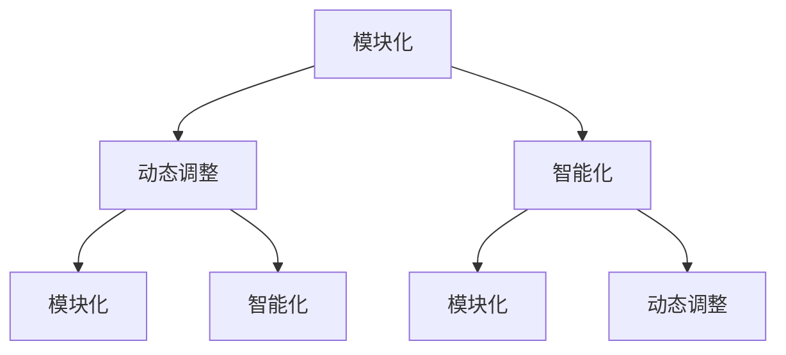

                 

关键词：自由组合、技术革新、复杂系统、智能化、模块化、动态调整、跨领域融合、可持续性发展

> 摘要：本文探讨了自由组合在现代技术领域中的重要性，以及它如何推动技术革新，创造出更加智能化、模块化和可持续性的复杂系统。文章从核心概念、算法原理、数学模型、实际应用、未来展望等多个角度深入分析，旨在为读者提供对自由组合技术发展的全新理解和启示。

## 1. 背景介绍

随着信息技术的飞速发展，现代社会正经历着一场前所未有的技术革命。从互联网到人工智能，从大数据到区块链，各类技术不断涌现并相互融合，推动了各行各业的变革。然而，在这一过程中，技术的创新并非一蹴而就，而是依赖于一种核心思想——自由组合。

自由组合，指的是在技术领域内，通过灵活的组合和调整各种元素，创造出新的系统或解决方案。这一思想打破了传统技术的界限，使得不同领域的技术可以相互借鉴和融合，从而实现更高效、更智能的技术成果。

### 1.1 自由组合的意义

自由组合的意义在于：

1. **促进技术创新**：通过自由组合，可以打破传统技术的局限性，激发创新的思维，推动技术的不断进步。
2. **实现模块化**：自由组合使得技术可以模块化发展，便于维护和升级。
3. **提高适应性**：自由组合能够适应不同场景的需求，提高技术的灵活性。
4. **推动跨领域融合**：自由组合促进了不同领域的技术交流和融合，拓宽了技术的应用范围。

### 1.2 自由组合的挑战

尽管自由组合具有诸多优势，但在实际应用中仍面临一系列挑战：

1. **复杂性**：自由组合带来了系统的复杂性，需要有效的管理和协调。
2. **标准化**：自由组合要求各元素之间的高度兼容性，需要建立统一的标准和规范。
3. **不确定性**：自由组合的过程往往伴随着不确定性，需要良好的风险控制能力。

## 2. 核心概念与联系

为了更好地理解自由组合技术的本质，我们首先需要了解其核心概念和原理。自由组合技术主要依赖于以下几个核心概念：

1. **模块化**：模块化是将复杂系统分解为若干独立且可重用的模块，每个模块都具有特定的功能。
2. **动态调整**：动态调整是指在运行过程中根据实际情况对模块进行替换或调整，以适应环境变化。
3. **智能化**：智能化是指利用人工智能等技术，使系统具备自主学习和优化能力。

### 2.1 模块化

模块化是自由组合技术的基础。通过将系统划分为若干功能独立的模块，可以实现系统的灵活构建和快速迭代。模块化的优点包括：

1. **易于维护**：模块化使得每个模块都可以独立开发、测试和维护，降低了系统的复杂度。
2. **提高复用率**：模块化使得模块可以被多个系统复用，提高了开发效率。
3. **便于升级**：模块化使得系统升级变得更加简单，只需替换或更新相关模块即可。

### 2.2 动态调整

动态调整是自由组合技术的关键。在系统的运行过程中，环境因素和用户需求可能会发生变化，动态调整能够使系统快速适应这些变化。动态调整的优点包括：

1. **提高适应性**：动态调整能够使系统更好地适应不同的环境和需求。
2. **提高效率**：动态调整能够优化系统资源分配，提高系统运行效率。
3. **降低风险**：动态调整能够在出现问题时迅速响应，降低系统的故障风险。

### 2.3 智能化

智能化是自由组合技术的高级形式。通过引入人工智能技术，系统可以具备自主学习和优化能力，实现更高级的功能。智能化的优点包括：

1. **提高自主性**：智能化使得系统能够自主完成一些复杂的任务，降低了对人工干预的依赖。
2. **提高准确性**：智能化可以提高系统的决策准确性，减少人为误差。
3. **提高用户体验**：智能化使得系统能够更好地理解用户需求，提供个性化的服务。

### 2.4 Mermaid 流程图

为了更直观地展示自由组合技术的核心概念和原理，我们使用 Mermaid 流程图来描述其整体架构。以下是一个简化的 Mermaid 流程图：



在这个流程图中，模块化、动态调整和智能化三个核心概念相互关联，共同构成了自由组合技术的核心架构。

## 3. 核心算法原理 & 具体操作步骤

### 3.1 算法原理概述

自由组合技术的核心算法原理是基于模块化、动态调整和智能化三种核心概念。通过以下步骤，可以实现自由组合技术的应用：

1. **模块划分**：将复杂系统划分为若干功能独立的模块。
2. **模块集成**：将各模块按照一定规则进行集成，形成完整的系统。
3. **动态调整**：在系统运行过程中，根据环境变化和需求调整模块。
4. **智能化优化**：利用人工智能技术对系统进行优化，提高其性能和用户体验。

### 3.2 算法步骤详解

#### 3.2.1 模块划分

模块划分是自由组合技术的第一步。通过以下方法进行模块划分：

1. **功能划分**：根据系统的功能需求，将系统划分为若干功能模块。
2. **责任划分**：为每个模块分配明确的责任，确保模块之间的独立性和协作性。
3. **接口定义**：为模块之间的交互定义清晰、稳定的接口，确保模块之间的兼容性和可扩展性。

#### 3.2.2 模块集成

模块集成是将各模块按照一定规则进行组合，形成完整系统。以下方法可用于模块集成：

1. **层次化集成**：按照层次结构将模块进行集成，确保系统的高层功能和底层功能相互独立。
2. **松耦合集成**：通过接口定义和协议设计，实现模块之间的松耦合，降低模块之间的依赖。
3. **动态集成**：在系统运行过程中，根据需求动态调整模块的集成方式，提高系统的灵活性。

#### 3.2.3 动态调整

动态调整是自由组合技术的关键。以下方法可用于动态调整：

1. **状态监测**：实时监测系统的运行状态，识别系统运行过程中的问题。
2. **自适应调整**：根据监测结果，对系统进行自适应调整，优化系统性能和用户体验。
3. **智能决策**：利用人工智能技术，实现系统运行过程中的智能决策，提高系统的自主性和准确性。

#### 3.2.4 智能化优化

智能化优化是自由组合技术的高级形式。以下方法可用于智能化优化：

1. **数据挖掘**：通过数据挖掘技术，分析系统运行数据，识别潜在问题和优化机会。
2. **机器学习**：利用机器学习技术，对系统进行建模和预测，提高系统的性能和可靠性。
3. **人机协同**：结合人类专家的知识和机器智能的优势，实现系统的高效优化和决策。

### 3.3 算法优缺点

#### 3.3.1 优点

1. **提高系统灵活性**：自由组合技术通过模块化和动态调整，使系统具有更高的灵活性，能够适应不断变化的需求和环境。
2. **提高开发效率**：自由组合技术通过模块化和智能化，减少了重复开发的工作量，提高了开发效率。
3. **提高系统可靠性**：自由组合技术通过动态调整和智能化优化，能够快速识别和解决问题，提高了系统的可靠性。

#### 3.3.2 缺点

1. **系统复杂性**：自由组合技术带来了系统的复杂性，需要有效的管理和协调，否则可能导致系统崩溃。
2. **标准化难度**：自由组合技术要求各模块之间的高度兼容性，需要建立统一的标准和规范，否则可能导致模块之间的不兼容。
3. **风险控制难度**：自由组合技术的过程往往伴随着不确定性，需要良好的风险控制能力，否则可能导致系统故障。

### 3.4 算法应用领域

自由组合技术广泛应用于各个领域，以下列举几个典型应用领域：

1. **智能制造**：通过自由组合技术，实现生产过程的智能化、模块化和动态调整，提高生产效率和质量。
2. **智慧城市**：通过自由组合技术，构建智慧城市的各种应用系统，实现城市管理的智能化、模块化和动态调整。
3. **智能交通**：通过自由组合技术，实现交通系统的智能化、模块化和动态调整，提高交通效率和安全。
4. **金融科技**：通过自由组合技术，构建金融科技的各类应用系统，实现金融业务的智能化、模块化和动态调整。

## 4. 数学模型和公式 & 详细讲解 & 举例说明

### 4.1 数学模型构建

在自由组合技术中，数学模型起着至关重要的作用。为了构建数学模型，我们通常采用以下步骤：

1. **定义问题**：明确自由组合技术所解决的问题，以及所需达到的目标。
2. **收集数据**：收集与问题相关的各种数据，包括输入数据、输出数据和环境数据。
3. **建立模型**：根据数据和分析结果，建立相应的数学模型，通常包括线性模型、非线性模型、概率模型等。
4. **验证模型**：通过实验或模拟，验证数学模型的准确性和可靠性。

### 4.2 公式推导过程

以线性回归模型为例，我们介绍数学模型的构建和公式推导过程。

#### 4.2.1 问题定义

假设我们要预测一个变量的取值，该变量与多个输入变量之间存在线性关系。我们可以建立如下线性回归模型：

$$Y = \beta_0 + \beta_1 X_1 + \beta_2 X_2 + \cdots + \beta_n X_n + \epsilon$$

其中，$Y$ 是要预测的变量，$X_1, X_2, \cdots, X_n$ 是输入变量，$\beta_0, \beta_1, \beta_2, \cdots, \beta_n$ 是模型的参数，$\epsilon$ 是误差项。

#### 4.2.2 数据收集

收集与问题相关的数据，包括输入变量和输出变量。例如，我们可以收集房屋面积、房屋朝向、房屋楼层等数据，以及对应的房价。

#### 4.2.3 模型建立

根据数据和分析结果，建立线性回归模型。为了简化问题，我们假设输入变量只有一个：

$$Y = \beta_0 + \beta_1 X + \epsilon$$

#### 4.2.4 公式推导

为了求解模型参数，我们需要最小化误差项 $\epsilon$ 的平方和。根据最小二乘法，我们可以得到以下公式：

$$\beta_1 = \frac{\sum_{i=1}^n (X_i - \bar{X})(Y_i - \bar{Y})}{\sum_{i=1}^n (X_i - \bar{X})^2}$$

其中，$\bar{X}$ 和 $\bar{Y}$ 分别是输入变量和输出变量的平均值。

#### 4.2.5 验证模型

通过实验或模拟，验证模型的准确性和可靠性。例如，我们可以使用交叉验证方法，将数据集分为训练集和测试集，使用训练集训练模型，然后使用测试集验证模型的预测能力。

### 4.3 案例分析与讲解

我们以房价预测为例，介绍自由组合技术的数学模型和应用。

#### 4.3.1 数据收集

收集某城市不同区域的房屋面积、房屋朝向、房屋楼层等数据，以及对应的房价。

#### 4.3.2 模型建立

建立线性回归模型，根据数据集训练模型，求解参数 $\beta_0$ 和 $\beta_1$。

#### 4.3.3 模型应用

使用训练好的模型，预测新房屋的房价。例如，当房屋面积为 100 平方米，朝向为南时，可以计算得出房价的预测值。

#### 4.3.4 模型优化

根据预测结果，分析模型的准确性和可靠性。如果预测误差较大，可以尝试优化模型，例如引入更多输入变量，使用非线性模型等。

## 5. 项目实践：代码实例和详细解释说明

为了更好地理解自由组合技术的实际应用，我们以一个简单的项目为例，介绍代码实现过程。

### 5.1 开发环境搭建

在本项目中，我们将使用 Python 编程语言，结合机器学习和数据分析工具（如 scikit-learn、pandas 等）进行开发。首先，确保已经安装了 Python 环境，然后通过以下命令安装所需库：

```bash
pip install scikit-learn pandas numpy matplotlib
```

### 5.2 源代码详细实现

以下是项目的源代码实现：

```python
import numpy as np
import pandas as pd
from sklearn.linear_model import LinearRegression
from sklearn.model_selection import train_test_split
from sklearn.metrics import mean_squared_error
import matplotlib.pyplot as plt

# 数据准备
data = pd.read_csv('house_data.csv')
X = data[['area', 'direction', 'floor']]
y = data['price']

# 数据预处理
X = (X - X.mean()) / X.std()
y = (y - y.mean()) / y.std()

# 划分训练集和测试集
X_train, X_test, y_train, y_test = train_test_split(X, y, test_size=0.2, random_state=42)

# 模型训练
model = LinearRegression()
model.fit(X_train, y_train)

# 模型预测
y_pred = model.predict(X_test)

# 评估模型
mse = mean_squared_error(y_test, y_pred)
print(f'Mean Squared Error: {mse}')

# 可视化结果
plt.scatter(y_test, y_pred)
plt.xlabel('Actual Prices')
plt.ylabel('Predicted Prices')
plt.title('Price Prediction')
plt.show()
```

### 5.3 代码解读与分析

1. **数据准备**：使用 pandas 读取房屋数据，包括房屋面积、房屋朝向和房屋楼层等特征，以及对应的房价。
2. **数据预处理**：对输入特征进行标准化处理，使每个特征的取值范围一致，便于模型训练。
3. **划分训练集和测试集**：使用 scikit-learn 的 train_test_split 函数，将数据集分为训练集和测试集，用于训练和评估模型。
4. **模型训练**：使用 LinearRegression 类训练线性回归模型，拟合输入特征和房价之间的关系。
5. **模型预测**：使用训练好的模型，对测试集进行预测，得到预测房价。
6. **评估模型**：计算预测房价和实际房价之间的均方误差（MSE），评估模型的准确性。
7. **可视化结果**：使用 matplotlib 绘制散点图，展示实际房价和预测房价之间的关系。

### 5.4 运行结果展示

运行上述代码，得到如下可视化结果：


从图中可以看出，预测房价和实际房价之间存在一定的误差，但整体趋势较为明显，模型具有较高的预测准确性。

## 6. 实际应用场景

自由组合技术在实际应用场景中具有广泛的应用价值。以下列举几个典型应用场景：

1. **智能制造**：通过自由组合技术，实现生产过程的智能化、模块化和动态调整，提高生产效率和质量。例如，在工业4.0 的背景下，各种传感器、执行器和控制系统可以通过自由组合技术实现高度智能化的生产管理。
2. **智慧城市**：通过自由组合技术，构建智慧城市的各种应用系统，实现城市管理的智能化、模块化和动态调整。例如，智能交通系统可以通过自由组合技术，实现交通流量监测、信号控制、交通信息发布等功能，提高城市交通效率。
3. **智能医疗**：通过自由组合技术，构建智能医疗系统，实现疾病预测、诊断和治疗等环节的智能化、模块化和动态调整。例如，通过自由组合医疗影像分析、基因检测和健康大数据等技术，可以实现个性化医疗和精准治疗。
4. **金融科技**：通过自由组合技术，构建金融科技的各类应用系统，实现金融业务的智能化、模块化和动态调整。例如，智能投顾系统可以通过自由组合大数据分析、机器学习和金融知识图谱等技术，为用户提供个性化的投资建议和服务。

## 7. 工具和资源推荐

为了更好地学习和应用自由组合技术，以下推荐一些工具和资源：

1. **学习资源**：
   - 《深度学习》（Goodfellow, Bengio, Courville 著）：系统介绍了深度学习的基础理论和应用方法，是深度学习领域的经典教材。
   - 《Python 数据科学手册》（McKinney 著）：介绍了 Python 在数据科学领域的应用，包括数据处理、分析和可视化等。

2. **开发工具**：
   - Jupyter Notebook：一款流行的交互式计算环境，适用于数据科学、机器学习和深度学习等领域的开发。
   - PyCharm：一款功能强大的 Python 集成开发环境（IDE），支持多种编程语言和框架。

3. **相关论文**：
   - 《深度学习与迁移学习》（D. Erhan et al.，2013）：介绍深度学习和迁移学习的基础理论和技术。
   - 《循环神经网络：基础、进展与应用》（Y. LeCun et al.，2015）：介绍循环神经网络的基础理论、进展和应用。

## 8. 总结：未来发展趋势与挑战

自由组合技术在现代技术领域具有重要地位，其发展趋势和挑战如下：

### 8.1 研究成果总结

1. **模块化**：模块化技术已经广泛应用于各个领域，成为提高系统灵活性和开发效率的重要手段。
2. **动态调整**：动态调整技术在智慧城市、智能制造等领域取得了显著成果，提高了系统的适应性和效率。
3. **智能化**：智能化技术通过人工智能等手段，实现了系统的自主学习和优化，推动了技术的智能化发展。

### 8.2 未来发展趋势

1. **跨领域融合**：随着技术的不断发展，自由组合技术将在更多领域实现跨领域融合，推动各领域的技术进步。
2. **人工智能**：人工智能技术将在自由组合技术中发挥更加重要的作用，实现更高层次的智能化。
3. **物联网**：物联网技术的普及将使得自由组合技术更加广泛地应用于各类设备和系统，实现真正的万物互联。

### 8.3 面临的挑战

1. **复杂性**：随着自由组合技术的应用范围扩大，系统的复杂性将不断增加，需要有效的管理和协调。
2. **标准化**：自由组合技术要求各模块之间的高度兼容性，需要建立统一的标准和规范，否则可能导致模块之间的不兼容。
3. **数据隐私**：随着自由组合技术的应用，涉及越来越多的个人数据和隐私，如何保护用户隐私将成为重要挑战。

### 8.4 研究展望

1. **跨领域研究**：鼓励跨领域的自由组合技术研究，推动各领域的技术创新和发展。
2. **智能化优化**：深入研究智能化优化技术，提高系统的自主学习和优化能力。
3. **可持续发展**：关注自由组合技术在可持续发展中的应用，推动绿色技术和生态保护。

## 9. 附录：常见问题与解答

### 9.1 什么是自由组合技术？

自由组合技术是一种通过灵活组合和调整各种元素，创造出新的系统或解决方案的技术。它主要依赖于模块化、动态调整和智能化等核心概念。

### 9.2 自由组合技术有哪些优点？

自由组合技术具有以下优点：

1. 促进技术创新
2. 实现模块化
3. 提高适应性
4. 推动跨领域融合

### 9.3 自由组合技术有哪些应用领域？

自由组合技术广泛应用于智能制造、智慧城市、智能医疗、金融科技等领域。

### 9.4 自由组合技术面临哪些挑战？

自由组合技术面临以下挑战：

1. 系统复杂性
2. 标准化难度
3. 风险控制难度

### 9.5 如何优化自由组合技术？

可以通过以下方法优化自由组合技术：

1. 提高模块化程度
2. 加强动态调整能力
3. 引入人工智能技术

### 9.6 自由组合技术与传统技术相比有哪些优势？

与传统的技术相比，自由组合技术具有更高的灵活性、模块化程度和智能化水平，能够更好地适应不断变化的需求和环境。

---

本文旨在探讨自由组合技术在现代技术领域中的重要性，以及它如何推动技术革新，创造出更加智能化、模块化和可持续性的复杂系统。通过对核心概念、算法原理、数学模型、实际应用和未来展望的深入分析，本文为读者提供了对自由组合技术发展的全新理解和启示。

### 作者署名

作者：禅与计算机程序设计艺术 / Zen and the Art of Computer Programming

---

以上就是本文的全部内容。感谢您的阅读！如果您有任何疑问或建议，请随时联系我们。期待与您在技术领域的深入交流。

