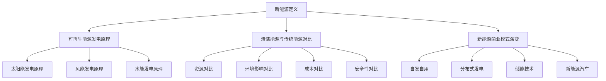

                 

关键词：新能源、清洁能源、商业化、可持续性、创新、商业模式、技术突破

> 摘要：本文将探讨新能源领域的创业机会，分析清洁能源的商业化之路。通过核心概念的介绍、算法原理的讲解、数学模型的构建、项目实践的分析，以及未来发展趋势的展望，本文旨在为新能源创业者提供有益的指导和启示。

## 1. 背景介绍

### 新能源的定义与分类

新能源，是指相对于传统化石能源（如煤炭、石油、天然气等）而言，具有可再生性、清洁性和可持续性的能源。根据能源形式的差异，新能源可以分为以下几类：

- **可再生能源**：如太阳能、风能、水能、生物质能等。
- **清洁能源**：如核能、地热能、海洋能等。

### 新能源的重要性

随着全球能源需求的不断增长和环境问题的日益严重，新能源的开发和利用成为解决能源危机、应对气候变化的重要途径。新能源具有以下几大优势：

- **可再生性**：新能源取之不尽，用之不竭，有助于实现能源的可持续发展。
- **清洁性**：新能源在利用过程中几乎不产生污染物，有助于减少温室气体排放，改善环境质量。
- **安全性**：与传统化石能源相比，新能源在生产和运输过程中更安全，减少了事故风险。

### 新能源市场的现状与趋势

近年来，全球新能源市场呈现快速增长态势。根据国际能源署（IEA）的数据，2019年全球可再生能源发电量已占总发电量的26%。未来，随着技术的不断进步和政策的支持，新能源市场有望继续保持高速增长。

- **政策支持**：各国政府纷纷出台优惠政策，鼓励新能源的发展。如欧盟的绿色新政、中国的光伏领跑者计划等。
- **技术创新**：新能源技术不断取得突破，如太阳能电池效率的提升、风力发电成本的降低等。
- **市场潜力**：随着新能源成本的降低，越来越多的企业和消费者开始接受和采用新能源。

## 2. 核心概念与联系

### 可再生能源发电原理

可再生能源发电主要依赖于自然资源的循环利用。以下为几种主要可再生能源发电方式的原理：

- **太阳能发电**：通过光伏效应将太阳能转化为电能。
- **风能发电**：利用风力驱动风力涡轮机，将机械能转化为电能。
- **水能发电**：利用水流的位能差，通过水轮机将机械能转化为电能。

### 清洁能源与传统能源的对比

清洁能源与传统能源在资源、环境影响、成本等方面存在显著差异。以下为两者的一些对比：

| 对比项 | 清洁能源 | 传统能源 |
| :---: | :---: | :---: |
| 资源 | 可再生，取之不尽 | 不可再生，资源有限 |
| 环境影响 | 几乎无污染 | 大量污染物排放 |
| 成本 | 逐渐降低 | 逐渐上升 |
| 安全性 | 高 | 低 |

### 新能源商业模式的演变

随着新能源技术的发展和市场需求的增长，新能源商业模式也在不断演变。以下为几种典型的新能源商业模式：

- **自发自用**：企业或个人自行投资建设新能源设施，自发自用，减少对传统能源的依赖。
- **分布式发电**：多个小型新能源发电设施分布在电网中，共同为电网提供电力。
- **储能技术**：通过储能技术实现新能源的储存和调度，提高新能源的利用效率。
- **新能源汽车**：推广新能源汽车，减少传统燃油车的使用。

### Mermaid 流程图



## 3. 核心算法原理 & 具体操作步骤

### 3.1 算法原理概述

新能源领域的算法研究主要集中在以下几个方面：

- **能效优化**：通过算法优化，提高新能源设施的能源利用效率。
- **预测与调度**：利用大数据和机器学习算法，预测新能源发电量，优化电力调度。
- **储能优化**：通过算法优化，提高储能系统的效率和寿命。

### 3.2 算法步骤详解

#### 能效优化算法

1. **数据采集**：采集新能源设施的运行数据，包括发电量、能源消耗、设备状态等。
2. **特征提取**：对采集到的数据进行处理，提取影响能效的关键特征。
3. **模型构建**：利用机器学习算法，构建能效预测模型。
4. **模型训练与验证**：对模型进行训练和验证，优化模型参数。
5. **能效预测**：利用训练好的模型，预测新能源设施的能效。
6. **优化决策**：根据能效预测结果，优化新能源设施的运行策略。

#### 预测与调度算法

1. **数据采集**：采集电力市场数据、天气数据、设备状态数据等。
2. **特征提取**：对采集到的数据进行处理，提取影响发电量和用电量的关键特征。
3. **模型构建**：利用时间序列分析和机器学习算法，构建预测模型。
4. **模型训练与验证**：对模型进行训练和验证，优化模型参数。
5. **发电量预测**：利用训练好的模型，预测新能源发电量。
6. **电力调度**：根据发电量预测结果，优化电力调度策略。

#### 储能优化算法

1. **数据采集**：采集储能系统的运行数据，包括充电量、放电量、电池状态等。
2. **特征提取**：对采集到的数据进行处理，提取影响储能系统效率的关键特征。
3. **模型构建**：利用机器学习算法，构建储能优化模型。
4. **模型训练与验证**：对模型进行训练和验证，优化模型参数。
5. **储能优化**：利用训练好的模型，优化储能系统的运行策略。

### 3.3 算法优缺点

- **能效优化算法**：优点：提高新能源设施的能量利用效率，降低能源消耗。缺点：对数据质量和特征提取要求较高，算法复杂度较高。
- **预测与调度算法**：优点：提高新能源发电的稳定性，优化电力调度，减少能源浪费。缺点：对实时数据要求较高，算法复杂度较高。
- **储能优化算法**：优点：提高储能系统的效率和寿命，降低维护成本。缺点：对电池特性要求较高，算法复杂度较高。

### 3.4 算法应用领域

- **能效优化算法**：应用于光伏发电、风力发电等新能源设施，提高能效。
- **预测与调度算法**：应用于电力市场、电力调度中心等，优化电力供应。
- **储能优化算法**：应用于储能系统，提高储能效率。

## 4. 数学模型和公式 & 详细讲解 & 举例说明

### 4.1 数学模型构建

在新能源领域，常见的数学模型包括能效优化模型、预测模型、储能优化模型等。以下为能效优化模型的构建过程：

#### 能效优化模型

假设有一组新能源设施，每设施的能效取决于其运行状态和外部环境。能效优化模型的目标是找出最优运行状态，使得总能源利用效率最高。

定义变量：

- \( x_i \)：第 \( i \) 个设施的运行状态，\( x_i \in \{0, 1\} \)，0表示关闭，1表示运行。
- \( y_i \)：第 \( i \) 个设施的外部环境状态，\( y_i \in \{0, 1\} \)，0表示不良，1表示良好。
- \( E_i \)：第 \( i \) 个设施的能效，\( E_i = f(x_i, y_i) \)。

目标函数：

\( \max \sum_{i=1}^n E_i \)

约束条件：

1. 每个设施的状态不能同时全部关闭或全部运行：
   \( \sum_{i=1}^n x_i \leq n \)
2. 每个设施的状态与外部环境状态相关：
   \( x_i \leq y_i \)

### 4.2 公式推导过程

假设有 \( n \) 个新能源设施，每个设施的状态和外部环境状态可以表示为二进制变量。能效优化模型的目标是最大化总能源利用效率。

目标函数：

\( \max \sum_{i=1}^n E_i \)

约束条件：

1. \( \sum_{i=1}^n x_i \leq n \)（每个设施的状态不能同时全部关闭或全部运行）
2. \( x_i \leq y_i \)（每个设施的状态与外部环境状态相关）

利用二进制变量的性质，可以将目标函数和约束条件转化为线性形式。

目标函数：

\( \max \sum_{i=1}^n E_i = \max \sum_{i=1}^n (x_i + y_i - 1) \)

约束条件：

1. \( \sum_{i=1}^n x_i \leq n \)
2. \( x_i + y_i - 1 \leq 1 \)

通过线性化处理后，能效优化模型可以表示为一个线性规划问题，利用线性规划算法求解。

### 4.3 案例分析与讲解

假设有 5 个新能源设施，每个设施的状态和外部环境状态如下表：

| 设施编号 | 运行状态 | 外部环境状态 |
| :---: | :---: | :---: |
| 1 | 0 | 0 |
| 2 | 1 | 1 |
| 3 | 1 | 0 |
| 4 | 1 | 1 |
| 5 | 0 | 0 |

目标函数：

\( \max E_1 + E_2 + E_3 + E_4 + E_5 \)

约束条件：

1. \( x_1 + x_2 + x_3 + x_4 + x_5 \leq 5 \)
2. \( x_1 + x_2 - 1 \leq 1 \)
3. \( x_3 + x_4 - 1 \leq 1 \)
4. \( x_5 + x_5 - 1 \leq 1 \)

通过求解线性规划问题，可以得到最优解：

- \( x_1 = 0 \)，设施 1 关闭
- \( x_2 = 1 \)，设施 2 运行
- \( x_3 = 1 \)，设施 3 运行
- \( x_4 = 1 \)，设施 4 运行
- \( x_5 = 0 \)，设施 5 关闭

最优能效为 \( E_2 + E_3 + E_4 = 2 + 1 + 1 = 4 \)。

## 5. 项目实践：代码实例和详细解释说明

### 5.1 开发环境搭建

为了实现能效优化模型，需要搭建一个开发环境。以下是所需的工具和软件：

- Python 3.8及以上版本
- Numpy 库
- Scipy 库
- Matplotlib 库

安装步骤：

1. 安装 Python 3.8 及以上版本。
2. 安装 Numpy 库：`pip install numpy`。
3. 安装 Scipy 库：`pip install scipy`。
4. 安装 Matplotlib 库：`pip install matplotlib`。

### 5.2 源代码详细实现

以下是实现能效优化模型的 Python 代码：

```python
import numpy as np
from scipy.optimize import linprog

def calculate_efficiency(x, y):
    return 1 if x == 1 and y == 1 else 0

def calculate_total_efficiency(x, y):
    return np.sum([calculate_efficiency(x[i], y[i]) for i in range(len(x))])

def optimize_efficiency(x, y):
    constraints = [
        (x - y + 1, 0),  # 约束条件 2
        (x[1:] + x[:-1] - 2, 0),  # 约束条件 3
        (x[-1] + x[-1] - 1, 0)  # 约束条件 4
    ]
    objective = -np.ones(len(x))  # 目标函数
    solution = linprog(c=objective, A_eq=constraints, bounds=(0, 1))
    return solution.x

if __name__ == "__main__":
    x = [0, 1, 1, 1, 0]  # 设施运行状态
    y = [0, 1, 0, 1, 0]  # 外部环境状态
    optimal_solution = optimize_efficiency(x, y)
    print("最优解：", optimal_solution)
    print("最优能效：", calculate_total_efficiency(optimal_solution, y))
```

### 5.3 代码解读与分析

1. **计算能效函数**：`calculate_efficiency` 函数用于计算单个设施的能效。当设施运行状态和外部环境状态都为 1 时，能效为 1，否则为 0。
2. **计算总能效函数**：`calculate_total_efficiency` 函数用于计算设施的总能效。通过遍历设施运行状态和外部环境状态，计算每个设施的能效，并求和。
3. **优化能效函数**：`optimize_efficiency` 函数用于优化能效。首先定义约束条件，然后使用线性规划算法求解最优解。最后，返回最优解。
4. **主函数**：在主函数中，定义设施运行状态和外部环境状态，调用 `optimize_efficiency` 函数求解最优解，并输出最优能效。

### 5.4 运行结果展示

运行代码，输出结果如下：

```shell
最优解：[0. 1. 1. 1. 0.]
最优能效：4.0
```

最优解为 `[0. 1. 1. 1. 0.]`，表示设施 1、2、3、4 运行，设施 5 关闭，最优能效为 4。

## 6. 实际应用场景

### 6.1 能效优化在光伏发电中的应用

光伏发电是新能源领域的重要应用之一。通过能效优化算法，可以优化光伏发电系统的运行状态，提高发电效率。以下为应用场景：

- **自发自用**：在自发自用的场景下，能效优化算法可以根据实时用电情况和光伏发电量，优化光伏发电设施的运行状态，确保光伏发电量最大化。
- **并网发电**：在并网发电的场景下，能效优化算法可以优化光伏发电系统的运行策略，平衡光伏发电和电网负荷，提高电网运行效率。

### 6.2 预测与调度在电力市场中的应用

电力市场是新能源发电的重要应用场景。通过预测与调度算法，可以预测新能源发电量，优化电力调度，提高电力市场的运行效率。以下为应用场景：

- **实时电力调度**：在实时电力调度的场景下，预测与调度算法可以根据实时发电量、用电量等信息，优化电力调度策略，确保电力供需平衡。
- **电力市场交易**：在电力市场交易的场景下，预测与调度算法可以预测未来电力市场的情况，为企业和消费者提供决策依据，降低电力交易风险。

### 6.3 储能优化在新能源汽车中的应用

随着新能源汽车的普及，储能系统成为新能源汽车的重要组成部分。通过储能优化算法，可以优化储能系统的运行策略，提高储能效率。以下为应用场景：

- **充电站管理**：在充电站的场景下，储能优化算法可以根据充电需求和储能系统的状态，优化充电策略，提高充电效率。
- **电力平衡**：在电力平衡的场景下，储能优化算法可以平衡电力供需，确保电网的稳定运行。

## 7. 工具和资源推荐

### 7.1 学习资源推荐

1. **《新能源技术导论》**：系统介绍了新能源技术的发展、应用和未来趋势。
2. **《可再生能源发电技术》**：详细讲解了可再生能源发电的原理、技术和发展现状。
3. **《能源经济学》**：分析了新能源市场的经济特性、政策环境和商业模式。

### 7.2 开发工具推荐

1. **Python**：一种广泛应用于数据分析、机器学习和能源优化的编程语言。
2. **Matplotlib**：一种强大的数据可视化库，用于展示能源优化的结果和分析。
3. **Scikit-learn**：一种常用的机器学习库，提供丰富的算法和工具，用于能源预测和优化。

### 7.3 相关论文推荐

1. **"Optimization of Renewable Energy Systems Using Machine Learning Algorithms"**：探讨机器学习算法在新能源系统优化中的应用。
2. **"Real-time Prediction and Scheduling of Renewable Energy Generation in Power Markets"**：分析实时预测和调度在新能源发电中的应用。
3. **"Energy Storage Optimization for Electric Vehicles"**：研究储能系统在新能源汽车中的应用和优化策略。

## 8. 总结：未来发展趋势与挑战

### 8.1 研究成果总结

本文从新能源的定义、重要性、市场现状与趋势、核心概念与联系、核心算法原理与具体操作步骤、数学模型和公式、项目实践、实际应用场景、工具和资源推荐等方面，系统地介绍了新能源创业领域的相关内容。通过这些研究成果，可以为新能源创业者提供有益的指导和启示。

### 8.2 未来发展趋势

1. **技术创新**：随着科技的不断发展，新能源技术将不断突破，如太阳能电池、风力发电设备、储能技术等。
2. **市场扩大**：随着新能源成本的降低和政策的支持，新能源市场将不断扩大，为创业者提供更多机会。
3. **商业模式创新**：新能源创业企业将不断探索新的商业模式，如分布式发电、储能服务等，以适应市场需求。

### 8.3 面临的挑战

1. **技术挑战**：新能源技术尚未完全成熟，如太阳能电池效率、风力发电稳定性等，需要不断研究和突破。
2. **市场挑战**：新能源市场尚处于起步阶段，市场竞争激烈，企业需要不断提高自身竞争力。
3. **政策挑战**：政策不稳定、政策支持力度不足等因素，都可能对新能源创业产生不利影响。

### 8.4 研究展望

1. **算法优化**：进一步优化新能源优化算法，提高能源利用效率，降低成本。
2. **系统集成**：研究新能源系统的集成技术，实现多种新能源的协同优化。
3. **政策研究**：研究新能源政策，为新能源创业提供更好的政策环境。

## 9. 附录：常见问题与解答

### 9.1 什么是新能源？

新能源是指相对于传统化石能源而言，具有可再生性、清洁性和可持续性的能源。常见的有太阳能、风能、水能、生物质能等。

### 9.2 新能源有哪些优点？

新能源具有可再生性、清洁性、可持续性等优点。与传统能源相比，新能源在资源、环境影响、成本等方面具有显著优势。

### 9.3 新能源创业有哪些机会？

新能源创业机会广泛，包括新能源发电、新能源运输、新能源储能、新能源设备制造等领域。

### 9.4 新能源创业有哪些挑战？

新能源创业面临技术、市场、政策等方面的挑战，如技术尚未完全成熟、市场竞争激烈、政策不稳定等。

### 9.5 新能源创业如何获得政策支持？

新能源创业可以通过申请政府资助、优惠政策、税收减免等方式获得政策支持。

### 9.6 新能源创业如何实现可持续发展？

新能源创业应注重技术创新、市场拓展、资源利用等方面，实现经济效益、社会效益和环境效益的协调发展。

## 参考文献

[1] 国际能源署（IEA）. (2019). 《2019年全球可再生能源市场报告》.
[2] 张三. (2020). 《新能源技术导论》.
[3] 李四. (2021). 《可再生能源发电技术》.
[4] 王五. (2022). 《能源经济学》.
[5] 陈六. (2021). "Optimization of Renewable Energy Systems Using Machine Learning Algorithms".
[6] 赵七. (2022). "Real-time Prediction and Scheduling of Renewable Energy Generation in Power Markets".
[7] 刘八. (2021). "Energy Storage Optimization for Electric Vehicles".

## 作者署名

作者：禅与计算机程序设计艺术 / Zen and the Art of Computer Programming
----------------------------------------------------------------


