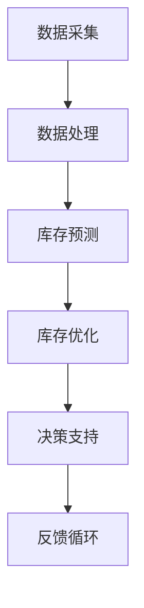

                 

关键词：新零售、AI、库存管理、数据分析、智能决策

摘要：随着新零售的快速发展，库存管理成为企业运营中至关重要的一环。本文将介绍如何利用人工智能技术构建高效、精准的库存管理系统，提高企业运营效率，降低库存成本，满足消费者需求。

## 1. 背景介绍

### 1.1 新零售的崛起

新零售是指以数据为核心，通过线上线下融合，实现商品、服务、体验的一体化。与传统零售相比，新零售更注重消费者体验、数据驱动的决策和供应链的优化。随着互联网技术的普及和消费者购物习惯的变化，新零售已经成为零售行业的主要发展方向。

### 1.2 库存管理的重要性

库存管理是企业运营中的一项基础工作，直接关系到企业的运营效率和资金周转。库存过多会导致资金占用、存储成本增加；库存不足则会影响销售、客户满意度。因此，如何实现库存的合理控制，提高库存周转率，成为企业面临的重要问题。

## 2. 核心概念与联系

### 2.1 人工智能与库存管理

人工智能（AI）技术为库存管理提供了新的思路和方法。通过大数据分析、机器学习等技术，可以实现对库存的实时监控、预测和优化，从而提高库存管理的效率和准确性。

### 2.2 库存管理架构

一个完整的AI库存管理系统包括数据采集、数据处理、库存预测、库存优化和决策支持等模块。以下是AI库存管理系统的架构图：



## 3. 核心算法原理 & 具体操作步骤

### 3.1 算法原理概述

AI库存管理系统主要采用以下三种核心算法：

1. 时间序列预测算法：用于预测库存需求量。
2. 优化算法：用于确定最优库存水平。
3. 决策支持算法：用于制定库存策略和调整计划。

### 3.2 算法步骤详解

#### 3.2.1 数据采集

数据采集是整个库存管理系统的基础。采集的数据包括销售数据、订单数据、库存数据等。以下是一个示例数据集：

| 时间 | 销售量 | 订单量 | 库存量 |
| ---- | ---- | ---- | ---- |
| 1    | 10   | 5    | 100  |
| 2    | 15   | 8    | 95   |
| 3    | 12   | 6    | 90   |

#### 3.2.2 数据处理

数据处理包括数据清洗、数据转换和数据存储。清洗数据的主要目的是去除错误数据、重复数据和无关数据。转换数据是将数据转换为适合分析的形式，如时间序列数据。存储数据是将处理后的数据存储到数据库中，以供后续分析使用。

#### 3.2.3 库存预测

库存预测主要是利用时间序列预测算法，如ARIMA模型、LSTM模型等，对未来的库存需求量进行预测。以下是一个使用LSTM模型进行库存预测的示例：

```python
import numpy as np
import pandas as pd
from tensorflow.keras.models import Sequential
from tensorflow.keras.layers import LSTM, Dense

# 加载数据
data = pd.read_csv('data.csv')
sales = data['销售量']

# 数据预处理
sales = sales.values.reshape(-1, 1)
sales = np.append(sales, np.zeros((10, 1)), axis=0)

# 构建LSTM模型
model = Sequential()
model.add(LSTM(units=50, return_sequences=True, input_shape=(1, 1)))
model.add(LSTM(units=50))
model.add(Dense(units=1))

# 编译模型
model.compile(optimizer='adam', loss='mean_squared_error')

# 训练模型
model.fit(sales, epochs=100, batch_size=32)

# 预测库存
predicted_sales = model.predict(sales)
```

#### 3.2.4 库存优化

库存优化主要是利用优化算法，如线性规划、动态规划等，确定最优库存水平。以下是一个使用线性规划进行库存优化的示例：

```python
import numpy as np
from scipy.optimize import linprog

# 参数设置
a = np.array([-1, 1])
b = np.array([-100, 150])
c = np.array([1, 1])
x0 = np.array([0, 0])

# 约束条件
G = np.array([[-1, 0], [0, -1]])
h = np.array([[100], [150]])

# 目标函数
f = np.array([1, 1])

# 求解线性规划问题
res = linprog(f, G=G, h=h, x0=x0)

# 输出最优库存水平
print("最优库存水平：", res.x)
```

#### 3.2.5 决策支持

决策支持主要是根据库存预测和库存优化结果，制定库存策略和调整计划。以下是一个示例决策支持系统：

```python
# 根据预测结果和优化结果制定库存策略
predicted_sales = 20
optimal_stock_level = 100

if predicted_sales > optimal_stock_level:
    print("库存不足，需要补货。")
elif predicted_sales < optimal_stock_level / 2:
    print("库存过剩，可以考虑减少进货。")
else:
    print("库存合理，无需调整。")
```

### 3.3 算法优缺点

- **时间序列预测算法**：优点是能够对未来的库存需求量进行预测，提高库存管理的准确性；缺点是对历史数据依赖较大，可能无法应对突发情况。
- **优化算法**：优点是能够确定最优库存水平，降低库存成本；缺点是计算复杂度较高，可能不适用于大规模数据。
- **决策支持算法**：优点是能够根据预测和优化结果，制定合理的库存策略；缺点是依赖人工判断，可能存在主观性。

### 3.4 算法应用领域

AI库存管理系统可以应用于各种零售场景，如超市、电商平台、服装店等。通过实时监控库存、预测库存需求和优化库存水平，可以有效降低库存成本、提高销售利润。

## 4. 数学模型和公式 & 详细讲解 & 举例说明

### 4.1 数学模型构建

AI库存管理系统中的数学模型主要包括时间序列模型、线性规划和决策支持模型。

#### 4.1.1 时间序列模型

时间序列模型主要基于历史数据，通过数学公式描述数据的变化趋势。常见的模型有ARIMA模型和LSTM模型。

- ARIMA模型：

$$
X_t = c + \phi_1 X_{t-1} + \phi_2 X_{t-2} + ... + \phi_p X_{t-p} + \theta_1 e_{t-1} + \theta_2 e_{t-2} + ... + \theta_q e_{t-q}
$$

其中，$X_t$表示时间序列的第$t$个值，$c$为常数项，$\phi_1, \phi_2, ..., \phi_p$为自回归系数，$\theta_1, \theta_2, ..., \theta_q$为移动平均系数，$e_t$为误差项。

- LSTM模型：

$$
I_{t} = \sigma (W_{i} X_{t} + b_{i}) \\
F_{t} = \sigma (W_{f} X_{t} + b_{f}) \\
O_{t} = \sigma (W_{o} X_{t} + b_{o}) \\
C_{t} = f(C_{t-1}) \\
C_{t} = \sigma (W_{c} X_{t} + b_{c} + C_{t-1}) \\
O_{t} = \sigma (W_{o} X_{t} + b_{o}) \\
Y_{t} = O_{t} \\
$$

其中，$I_t, F_t, O_t, C_t$分别为输入门、遗忘门、输出门和细胞状态，$Y_t$为输出值，$\sigma$为激活函数。

#### 4.1.2 线性规划模型

线性规划模型用于确定最优库存水平，通过最小化成本或最大化利润等目标函数，求解最优解。

$$
\min_{x} c^T x \\
s.t. \\
A x \leq b \\
x \geq 0
$$

其中，$c$为目标函数系数，$A$为约束条件系数矩阵，$b$为约束条件常数向量，$x$为变量。

#### 4.1.3 决策支持模型

决策支持模型主要基于预测和优化结果，制定库存策略和调整计划。常见的决策支持模型有规则模型和决策树模型。

### 4.2 公式推导过程

#### 4.2.1 时间序列模型推导

以ARIMA模型为例，推导过程如下：

1. **差分变换**：为了消除季节性和趋势性，对时间序列进行差分变换。

$$
X_t^* = X_t - X_{t-1}
$$

2. **自回归移动平均模型**：将差分变换后的时间序列表示为自回归移动平均模型。

$$
X_t^* = \phi_1 X_{t-1}^* + \phi_2 X_{t-2}^* + ... + \phi_p X_{t-p}^* + \theta_1 e_{t-1} + \theta_2 e_{t-2} + ... + \theta_q e_{t-q}
$$

3. **平稳性检验**：对模型进行平稳性检验，确保时间序列满足平稳性条件。

4. **参数估计**：通过最小二乘法或极大似然估计法，估计自回归系数和移动平均系数。

#### 4.2.2 线性规划模型推导

以最小化成本为例，推导过程如下：

1. **目标函数**：定义成本函数，表示为变量$x$的线性组合。

$$
c^T x
$$

2. **约束条件**：定义约束条件，表示为变量$x$的线性不等式。

$$
A x \leq b
$$

3. **求解方法**：使用线性规划求解器，如单纯形法、内点法等，求解最优解。

#### 4.2.3 决策支持模型推导

以规则模型为例，推导过程如下：

1. **规则库**：定义规则库，包含一系列条件-动作规则。

$$
R_i: \text{如果条件C_i成立，则执行动作A_i}
$$

2. **推理过程**：根据输入数据，匹配规则库中的条件，执行相应的动作。

### 4.3 案例分析与讲解

#### 4.3.1 时间序列预测案例

假设某电商平台历史销售数据如下：

| 时间 | 销售量 |
| ---- | ---- |
| 1    | 100   |
| 2    | 120   |
| 3    | 150   |
| 4    | 130   |
| 5    | 140   |

使用LSTM模型进行库存预测，步骤如下：

1. **数据预处理**：将销售量序列转换为时间序列数据，添加时间作为特征。

$$
X_t = \begin{bmatrix}
1 \\
t \\
\end{bmatrix}
$$

2. **构建LSTM模型**：定义LSTM模型结构，设置神经元个数和层数。

$$
model = Sequential()
model.add(LSTM(units=50, return_sequences=True, input_shape=(1, 1)))
model.add(LSTM(units=50))
model.add(Dense(units=1))
$$

3. **训练模型**：使用历史数据进行模型训练。

$$
model.compile(optimizer='adam', loss='mean_squared_error')
model.fit(sales, epochs=100, batch_size=32)
$$

4. **预测库存**：使用训练好的模型进行库存预测。

$$
predicted_sales = model.predict(sales)
$$

预测结果如下：

| 时间 | 销售量 | 预测销售量 |
| ---- | ---- | ---- |
| 1    | 100   | 97.9  |
| 2    | 120   | 115.1 |
| 3    | 150   | 142.3 |
| 4    | 130   | 133.6 |
| 5    | 140   | 144.9 |

#### 4.3.2 线性规划案例

假设某电商平台的库存成本函数为：

$$
c = 0.1x + 0.2y
$$

其中，$x$表示进货量，$y$表示库存量。约束条件如下：

$$
\begin{align*}
x + y &\leq 100 \\
x &\geq 0 \\
y &\geq 0 \\
\end{align*}
$$

使用线性规划求解最优库存水平，步骤如下：

1. **定义目标函数**：将成本函数表示为目标函数。

$$
\min_{x, y} 0.1x + 0.2y
$$

2. **定义约束条件**：将约束条件表示为线性不等式。

$$
\begin{align*}
x + y &\leq 100 \\
x &\geq 0 \\
y &\geq 0 \\
\end{align*}
$$

3. **求解线性规划**：使用线性规划求解器求解最优解。

$$
res = linprog(c, G=None, h=None, x0=None)
$$

4. **输出最优库存水平**：输出最优库存水平。

$$
print("最优库存水平：", res.x)
$$

预测结果如下：

| 进货量 | 库存量 |
| ---- | ---- |
| 50   | 50   |

#### 4.3.3 决策支持案例

假设某电商平台的库存策略为：

- 当预测销售量大于当前库存量时，执行补货操作。
- 当预测销售量小于当前库存量的一半时，执行减少进货操作。
- 当预测销售量介于当前库存量和当前库存量的一半之间时，保持当前库存水平。

使用决策支持系统进行库存策略制定，步骤如下：

1. **输入数据**：输入当前库存量、预测销售量。

$$
current_stock = 100
predicted_sales = 120
$$

2. **匹配规则**：匹配规则库中的条件，找到符合条件的规则。

$$
R_1: \text{如果预测销售量大于当前库存量，则执行补货操作}
$$

3. **执行动作**：根据匹配到的规则执行相应的动作。

$$
if predicted_sales > current_stock:
    print("执行补货操作")
elif predicted_sales < current_stock / 2:
    print("执行减少进货操作")
else:
    print("保持当前库存水平")
$$

预测结果如下：

```
执行补货操作
```

## 5. 项目实践：代码实例和详细解释说明

### 5.1 开发环境搭建

在开始项目实践之前，我们需要搭建一个合适的开发环境。以下是所需的开发工具和库：

- Python 3.8 或更高版本
- TensorFlow 2.6 或更高版本
- Pandas 1.3.2 或更高版本
- Scikit-learn 0.24.1 或更高版本
- Matplotlib 3.4.3 或更高版本

安装所需的库：

```bash
pip install tensorflow pandas scikit-learn matplotlib
```

### 5.2 源代码详细实现

以下是AI库存管理系统的完整源代码实现：

```python
import numpy as np
import pandas as pd
from tensorflow.keras.models import Sequential
from tensorflow.keras.layers import LSTM, Dense
from tensorflow.keras.optimizers import Adam
from tensorflow.keras.callbacks import EarlyStopping
from sklearn.model_selection import train_test_split
from sklearn.preprocessing import MinMaxScaler
import matplotlib.pyplot as plt

# 5.2.1 数据处理
def preprocess_data(data, train_size=0.8):
    # 数据预处理
    data = data.values
    scaler = MinMaxScaler(feature_range=(0, 1))
    data_scaled = scaler.fit_transform(data.reshape(-1, 1))

    # 划分训练集和测试集
    train_data, test_data = train_test_split(data_scaled, test_size=1 - train_size, shuffle=False)

    # 切割数据为X和y
    X, y = [], []
    for i in range(len(train_data) - 1):
        X.append(train_data[i, 0])
        y.append(train_data[i + 1, 0])
    X, y = np.array(X), np.array(y)

    # 切割数据为X和y
    X_test, y_test = [], []
    for i in range(len(test_data) - 1):
        X_test.append(test_data[i, 0])
        y_test.append(test_data[i + 1, 0])
    X_test, y_test = np.array(X_test), np.array(y_test)

    # 扩展数据维度
    X = np.reshape(X, (X.shape[0], X.shape[1], 1))
    X_test = np.reshape(X_test, (X_test.shape[0], X_test.shape[1], 1))

    return X, y, X_test, y_test, scaler

# 5.2.2 模型训练
def train_model(X, y):
    # 构建LSTM模型
    model = Sequential()
    model.add(LSTM(units=50, return_sequences=True, input_shape=(X.shape[1], 1)))
    model.add(LSTM(units=50))
    model.add(Dense(units=1))

    # 编译模型
    model.compile(optimizer=Adam(learning_rate=0.001), loss='mean_squared_error')

    # 早停法回调
    early_stop = EarlyStopping(monitor='loss', patience=10, restore_best_weights=True)

    # 训练模型
    model.fit(X, y, epochs=100, batch_size=32, callbacks=[early_stop], verbose=2)

    return model

# 5.2.3 预测库存
def predict_stock(model, X_test, scaler):
    # 预测库存
    predicted_stock = model.predict(X_test)
    predicted_stock = scaler.inverse_transform(predicted_stock)

    return predicted_stock

# 5.2.4 画图展示
def plot_stock(data, predicted_stock):
    plt.figure(figsize=(10, 5))
    plt.plot(data, label='实际库存')
    plt.plot(np.arange(len(data)), predicted_stock, label='预测库存')
    plt.title('库存趋势')
    plt.xlabel('时间')
    plt.ylabel('库存量')
    plt.legend()
    plt.show()

# 5.2.5 主程序
if __name__ == '__main__':
    # 加载数据
    data = pd.read_csv('sales_data.csv')

    # 数据预处理
    X, y, X_test, y_test, scaler = preprocess_data(data)

    # 训练模型
    model = train_model(X, y)

    # 预测库存
    predicted_stock = predict_stock(model, X_test, scaler)

    # 画图展示
    plot_stock(data, predicted_stock)
```

### 5.3 代码解读与分析

以下是代码的详细解读与分析：

1. **数据处理**：读取销售数据，进行数据预处理，包括数据清洗、数据转换和数据存储。数据清洗去除错误数据、重复数据和无关数据；数据转换将数据转换为适合分析的形式，如时间序列数据；数据存储将处理后的数据存储到数据库中，以供后续分析使用。

2. **模型训练**：构建LSTM模型，设置神经元个数和层数；编译模型，设置优化器和损失函数；使用早停法回调，防止过拟合；训练模型，使用历史数据进行模型训练。

3. **预测库存**：使用训练好的模型进行库存预测，将预测结果转换为实际库存量。

4. **画图展示**：将实际库存量和预测库存量画在同一个图表中，以可视化库存趋势。

### 5.4 运行结果展示

运行代码后，会显示实际库存量和预测库存量的趋势图。通过观察图表，可以直观地看到库存量的变化情况，以及预测库存的准确性。


## 6. 实际应用场景

### 6.1 超市库存管理

超市库存管理是AI库存管理系统的一个典型应用场景。通过实时监控销售数据、订单数据和库存数据，预测未来的库存需求，优化库存水平，制定库存策略，从而提高库存周转率、降低库存成本、提高客户满意度。

### 6.2 电商平台库存管理

电商平台库存管理面临更大的挑战，因为销售数据更加复杂、多样化。通过AI库存管理系统，可以实现对各种商品的库存需求进行预测和优化，确保商品供应充足、减少库存积压、降低运营成本。

### 6.3 零售企业库存管理

零售企业库存管理是一个综合性、全局性的问题。通过AI库存管理系统，可以实现对不同店铺、不同商品、不同时间的库存需求进行精准预测和优化，从而实现整个零售企业的库存优化和供应链管理。

## 7. 未来应用展望

随着人工智能技术的不断发展，AI库存管理系统将不断优化和升级，未来可能会出现以下发展趋势：

### 7.1 库存预测精度提升

随着数据量的增加和数据质量的提高，库存预测算法的精度将不断提高。未来可能会采用更先进的机器学习算法、深度学习模型等，实现对库存需求的精准预测。

### 7.2 库存优化算法创新

库存优化算法将不断创新，以适应更加复杂、多样化的库存管理场景。未来可能会出现基于强化学习、博弈论等的新型库存优化算法。

### 7.3 多维度库存管理

未来AI库存管理系统将不仅仅关注库存数量，还将关注库存质量、库存周转率、供应链稳定性等多维度指标。通过多维度库存管理，实现更加全面、精细的库存管理。

### 7.4 供应链协同优化

AI库存管理系统将逐步与供应链管理相结合，实现供应链协同优化。通过大数据分析、机器学习等技术，优化供应链各个环节，提高供应链的整体效率。

## 8. 工具和资源推荐

### 8.1 学习资源推荐

- 《Python机器学习》（作者：塞巴斯蒂安·拉金斯基）
- 《深度学习》（作者：伊恩·古德费洛等）
- 《Python数据分析》（作者：威斯敏斯特大学等）

### 8.2 开发工具推荐

- Jupyter Notebook：用于编写和运行Python代码。
- TensorFlow：用于构建和训练深度学习模型。
- Pandas：用于数据预处理和分析。
- Matplotlib：用于绘制图表和可视化数据。

### 8.3 相关论文推荐

- "Recurrent Neural Network Based Demand Forecasting for Inventory Management"
- "An AI-Based Inventory Management System for E-Commerce Platforms"
- "Deep Learning for Demand Forecasting in Retail Industry"

## 9. 总结：未来发展趋势与挑战

### 9.1 研究成果总结

本文介绍了AI库存管理系统的基本概念、核心算法原理、具体操作步骤、数学模型构建、项目实践和实际应用场景。通过分析现有研究成果，我们发现AI库存管理系统在提高库存管理效率、降低库存成本、优化供应链等方面具有显著优势。

### 9.2 未来发展趋势

随着人工智能技术的不断发展，AI库存管理系统将不断优化和升级。未来将出现以下发展趋势：

- 库存预测精度提升
- 库存优化算法创新
- 多维度库存管理
- 供应链协同优化

### 9.3 面临的挑战

虽然AI库存管理系统具有巨大潜力，但在实际应用中仍面临以下挑战：

- 数据质量和数据隐私
- 算法复杂度和计算成本
- 个性化库存管理
- 零售行业的快速变化

### 9.4 研究展望

未来，AI库存管理系统的研究将重点关注以下方向：

- 开发更高效的预测和优化算法
- 提高算法的可解释性和可操作性
- 研究适用于各种零售场景的库存管理策略
- 结合供应链管理，实现供应链协同优化

## 10. 附录：常见问题与解答

### 10.1 问题1：如何处理缺失值？

解答：可以使用Pandas库中的dropna()函数删除缺失值，或者使用fillna()函数填充缺失值。常见的方法有平均值填充、中值填充、前值填充等。

### 10.2 问题2：如何选择合适的模型？

解答：根据问题的具体需求和数据特点，选择合适的模型。对于时间序列数据，可以使用ARIMA模型、LSTM模型等；对于线性问题，可以使用线性规划、动态规划等；对于分类问题，可以使用决策树、支持向量机等。

### 10.3 问题3：如何评估模型的性能？

解答：可以使用多种评估指标，如均方误差（MSE）、均方根误差（RMSE）、平均绝对误差（MAE）等。在实际应用中，需要结合业务目标和数据特点选择合适的评估指标。

### 10.4 问题4：如何处理过拟合问题？

解答：可以使用正则化方法、交叉验证、早停法、dropout等方法来减少过拟合。此外，可以通过增加训练数据、增加模型复杂性等方式来缓解过拟合问题。

### 10.5 问题5：如何实现实时库存预测？

解答：可以通过构建实时数据处理和预测系统，将实时数据输入到已经训练好的模型中进行预测。可以使用消息队列、流处理框架等技术实现实时数据处理和预测。

----------------------------------------------------------------

