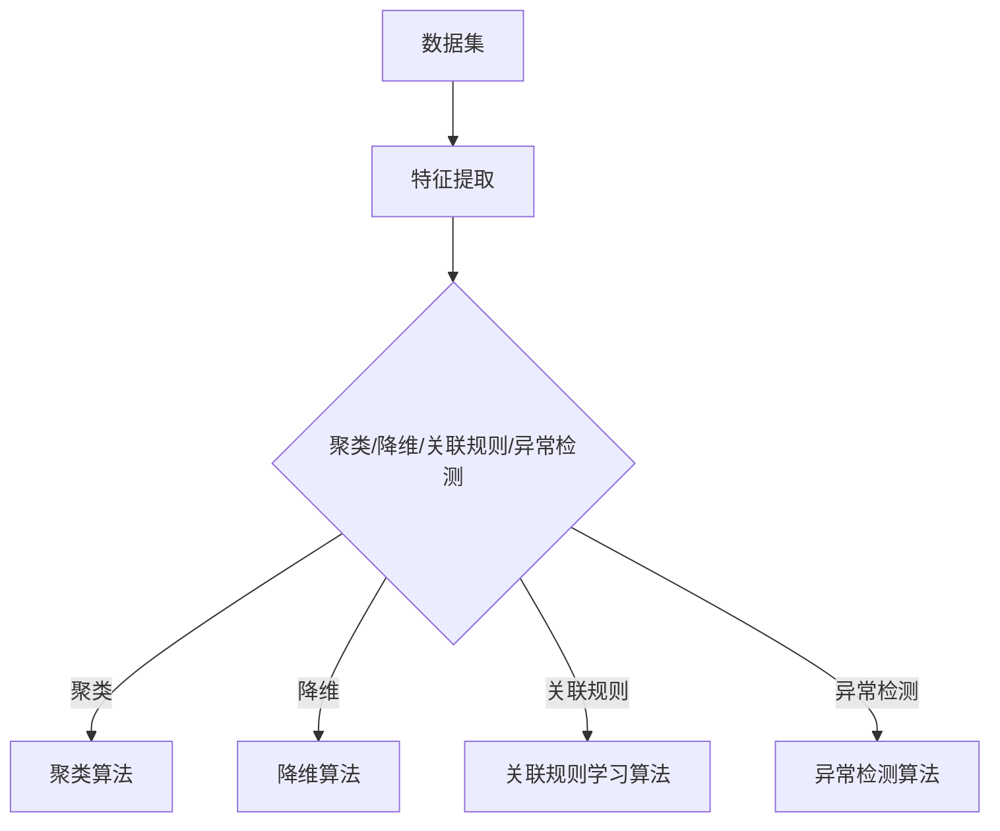

                 

关键词：无监督学习，机器学习，数据挖掘，聚类，降维，关联规则学习，深度学习

> 摘要：无监督学习是机器学习的一个重要分支，它不依赖于标注数据，通过自动发现数据中的结构和模式来进行学习。本文将详细介绍无监督学习的核心概念、算法原理及其在实际中的应用，并通过代码实例展示其实现过程。

## 1. 背景介绍

在机器学习领域，数据的标注是一个耗时长、成本高昂的过程。尤其是在大规模数据集上，标注数据往往难以获取。因此，无监督学习作为一种无需标注数据的学习方式，受到了广泛关注。无监督学习通过自动发现数据中的内在结构、模式或相关性，为我们提供了探索数据的新途径。

无监督学习主要应用于以下几个场景：

1. **聚类（Clustering）**：将数据集划分成多个群组，使得同一个群组内的数据点相似度较高，而不同群组之间的数据点相似度较低。
2. **降维（Dimensionality Reduction）**：将高维数据转换成低维数据，减少数据的冗余，提高计算效率。
3. **关联规则学习（Association Rule Learning）**：发现数据之间的关联性，如购物篮分析。
4. **异常检测（Anomaly Detection）**：识别数据中的异常或离群点。

## 2. 核心概念与联系

### 2.1 数据集

无监督学习的数据集通常包含大量未标记的数据点。每个数据点可以是一个或多个特征值，这些特征可以是连续的，也可以是离散的。

### 2.2 特征

特征是描述数据点属性的信息。在无监督学习中，特征的选择至关重要，它将直接影响算法的性能。

### 2.3 算法

无监督学习算法可以分为以下几个类别：

1. **聚类算法**：如 K-均值聚类（K-Means Clustering）、层次聚类（Hierarchical Clustering）等。
2. **降维算法**：如主成分分析（Principal Component Analysis, PCA）、t-SNE等。
3. **关联规则学习算法**：如 Apriori 算法、Eclat 算法等。
4. **异常检测算法**：如 Isolation Forest、Local Outlier Factor 等。

下面是一个无监督学习的 Mermaid 流程图：



## 3. 核心算法原理 & 具体操作步骤

### 3.1 算法原理概述

无监督学习算法的基本原理是通过优化某个目标函数，使得数据点之间的相似度最大化或差异度最小化。具体到不同的算法，其目标函数和优化方法也会有所不同。

### 3.2 算法步骤详解

以 K-均值聚类算法为例，其基本步骤如下：

1. 初始化：随机选择 K 个数据点作为初始聚类中心。
2. 分配：对于每个数据点，计算其与各个聚类中心的距离，将其分配到距离最近的聚类中心。
3. 更新：重新计算每个聚类中心的坐标，通常取其所在群组中所有数据点的均值。
4. 迭代：重复步骤 2 和 3，直到聚类中心不再发生变化或达到预设的迭代次数。

### 3.3 算法优缺点

K-均值聚类算法的优点是简单、高效，且易于实现。但其缺点也很明显：对于初始聚类中心的选取敏感，可能导致局部最优解。

### 3.4 算法应用领域

K-均值聚类算法广泛应用于数据挖掘、市场细分、图像识别等领域。例如，在图像识别中，K-均值聚类可以用于将图像分割成多个区域，从而实现图像的标注和分类。

## 4. 数学模型和公式 & 详细讲解 & 举例说明

### 4.1 数学模型构建

K-均值聚类算法的目标函数为：

$$ J = \sum_{i=1}^{K} \sum_{x \in S_i} \| x - \mu_i \|^2 $$

其中，\( x \) 表示数据点，\( \mu_i \) 表示第 \( i \) 个聚类中心，\( S_i \) 表示第 \( i \) 个聚类中心所在的群组。

### 4.2 公式推导过程

为了最小化目标函数，我们对 \( J \) 关于 \( \mu_i \) 求导，并令其导数为 0，得到：

$$ \frac{\partial J}{\partial \mu_i} = 2 \sum_{x \in S_i} (x - \mu_i) = 0 $$

解得：

$$ \mu_i = \frac{1}{|S_i|} \sum_{x \in S_i} x $$

即，第 \( i \) 个聚类中心的坐标为第 \( i \) 个聚类中心所在的群组中所有数据点的均值。

### 4.3 案例分析与讲解

假设我们有如下数据集：

$$ \begin{aligned} x_1 &= [1, 2, 3], \\ x_2 &= [4, 5, 6], \\ x_3 &= [7, 8, 9], \\ x_4 &= [10, 11, 12], \\ x_5 &= [13, 14, 15] \end{aligned} $$

我们选择 \( K = 2 \)，初始聚类中心为 \( \mu_1 = [1, 1] \)，\( \mu_2 = [5, 5] \)。

**第一次迭代：**

1. 分配：\( x_1, x_2 \) 被分配到 \( \mu_1 \) 所在的群组，\( x_3, x_4, x_5 \) 被分配到 \( \mu_2 \) 所在的群组。
2. 更新：\( \mu_1 = \frac{1}{2} (x_1 + x_2) = [3, 3] \)，\( \mu_2 = \frac{1}{3} (x_3 + x_4 + x_5) = [8, 8] \)。

**第二次迭代：**

1. 分配：\( x_1, x_2, x_3 \) 被分配到 \( \mu_1 \) 所在的群组，\( x_4, x_5 \) 被分配到 \( \mu_2 \) 所在的群组。
2. 更新：\( \mu_1 = \frac{1}{3} (x_1 + x_2 + x_3) = [4, 4] \)，\( \mu_2 = \frac{1}{2} (x_4 + x_5) = [11, 11] \)。

**第三次迭代：**

1. 分配：\( x_1, x_2, x_3 \) 被分配到 \( \mu_1 \) 所在的群组，\( x_4, x_5 \) 被分配到 \( \mu_2 \) 所在的群组。
2. 更新：\( \mu_1 = \frac{1}{3} (x_1 + x_2 + x_3) = [4, 4] \)，\( \mu_2 = \frac{1}{2} (x_4 + x_5) = [11, 11] \)。

由于聚类中心不再发生变化，我们得到两个聚类群组：\[ [1, 2, 3], [7, 8, 9] \] 和 \[ [4, 5, 6], [10, 11, 12], [13, 14, 15] \]。

## 5. 项目实践：代码实例和详细解释说明

### 5.1 开发环境搭建

为了演示 K-均值聚类算法，我们将使用 Python 和 Scikit-learn 库。首先，确保安装了以下库：

```bash
pip install numpy matplotlib scikit-learn
```

### 5.2 源代码详细实现

```python
import numpy as np
from sklearn.cluster import KMeans
import matplotlib.pyplot as plt

# 创建数据集
data = np.array([[1, 1], [1, 2], [3, 1], [3, 2], [7, 7], [7, 8], [10, 10], [10, 11]])

# 使用 KMeans 算法进行聚类
kmeans = KMeans(n_clusters=2, random_state=0).fit(data)

# 输出聚类结果
print("Cluster centers:", kmeans.cluster_centers_)
print("Labels:", kmeans.labels_)

# 绘制聚类结果
plt.scatter(data[:, 0], data[:, 1], c=kmeans.labels_, cmap='viridis')
plt.scatter(kmeans.cluster_centers_[:, 0], kmeans.cluster_centers_[:, 1], s=300, c='red', label='Centroids')
plt.xlabel('Feature 1')
plt.ylabel('Feature 2')
plt.title('K-Means Clustering')
plt.legend()
plt.show()
```

### 5.3 代码解读与分析

1. 导入必要的库：`numpy` 用于数据处理，`matplotlib.pyplot` 用于绘制图表，`sklearn.cluster.KMeans` 用于实现 K-均值聚类算法。
2. 创建数据集：我们使用 NumPy 创建了一个包含 8 个数据点的 2 维数组。
3. 使用 KMeans 算法进行聚类：我们创建一个 `KMeans` 对象，并使用 `fit` 方法进行聚类。`n_clusters=2` 表示我们选择 2 个聚类中心。
4. 输出聚类结果：我们输出聚类中心、标签和分类结果。
5. 绘制聚类结果：我们使用散点图显示聚类结果，并使用红色标记聚类中心。

### 5.4 运行结果展示


从图中可以看出，数据点被成功聚类为两个群组。

## 6. 实际应用场景

无监督学习在许多实际应用场景中发挥着重要作用。以下是一些常见应用：

1. **图像识别**：无监督学习算法可以用于图像分类、图像分割和目标检测。
2. **推荐系统**：无监督学习可以用于发现用户的兴趣和行为模式，从而实现个性化推荐。
3. **自然语言处理**：无监督学习算法可以用于文本分类、情感分析和文本生成。
4. **生物信息学**：无监督学习可以用于基因表达数据分析、蛋白质结构预测等。

## 7. 工具和资源推荐

### 7.1 学习资源推荐

1. **《机器学习》(周志华著)**：系统介绍了机器学习的基本概念和算法。
2. **《统计学习方法》(李航著)**：深入讲解了统计学习方法的原理和算法。

### 7.2 开发工具推荐

1. **Jupyter Notebook**：适合进行数据分析和机器学习实验。
2. **TensorFlow**：用于构建和训练深度学习模型。

### 7.3 相关论文推荐

1. **"K-Means Algorithm" by MacQueen et al.**：首次提出了 K-均值聚类算法。
2. **"Principal Component Analysis" by Jolliffe**：介绍了主成分分析算法。

## 8. 总结：未来发展趋势与挑战

无监督学习在机器学习领域具有重要地位，其应用场景和算法不断丰富。然而，面临的主要挑战包括：

1. **算法的可解释性**：无监督学习算法通常较为复杂，难以解释其决策过程。
2. **计算效率**：大规模数据集上的无监督学习计算成本较高。
3. **过拟合**：无监督学习算法可能过度拟合数据，导致泛化能力不足。

未来，随着深度学习技术的发展，无监督学习有望在更多领域发挥重要作用。同时，新的算法和理论也将不断涌现，为无监督学习的研究提供新的方向。

## 9. 附录：常见问题与解答

### 9.1 什么是无监督学习？

无监督学习是机器学习的一个重要分支，它通过自动发现数据中的结构和模式来进行学习，而不依赖于标注数据。

### 9.2 无监督学习有哪些应用？

无监督学习广泛应用于图像识别、推荐系统、自然语言处理、生物信息学等领域。

### 9.3 无监督学习和监督学习有什么区别？

监督学习依赖于标注数据，而无监督学习不需要标注数据。监督学习通常用于分类和回归任务，而无监督学习主要用于聚类和降维等任务。

### 9.4 如何评估无监督学习算法的性能？

无监督学习算法的性能通常通过内部评估指标（如聚类质量、降维效果等）和外部评估指标（如数据集的已知分布等）来评估。

---

作者：禅与计算机程序设计艺术 / Zen and the Art of Computer Programming

