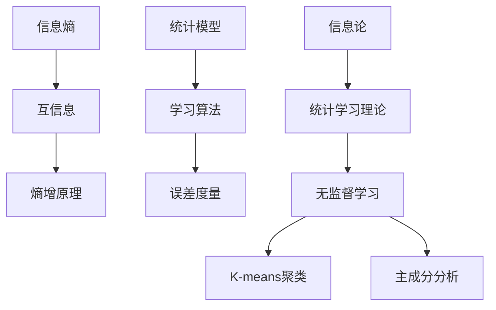
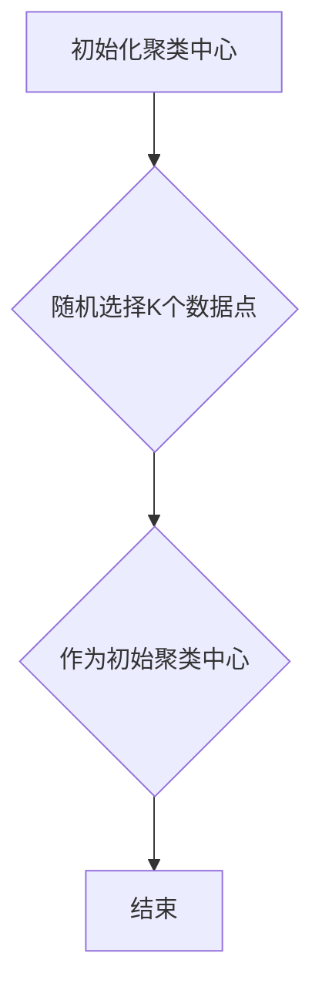
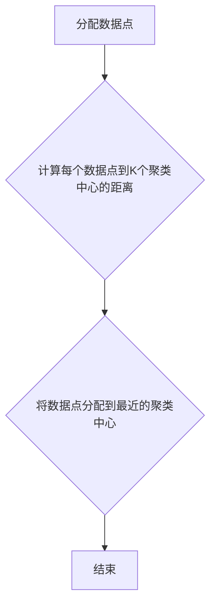
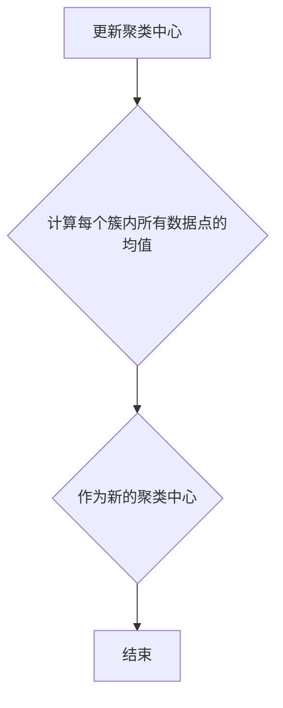
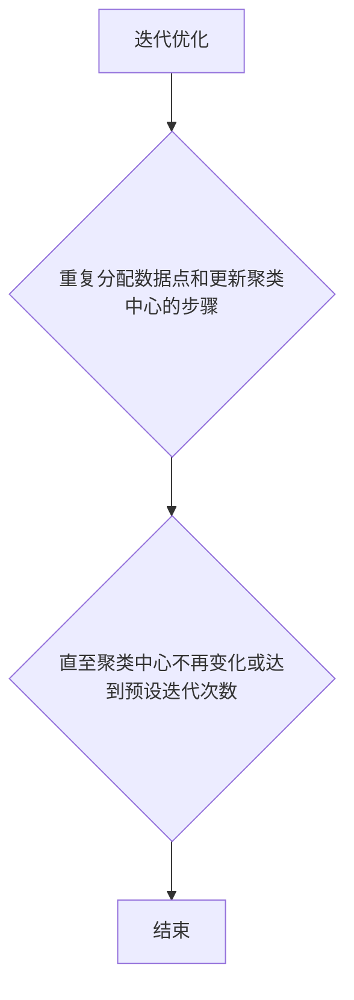
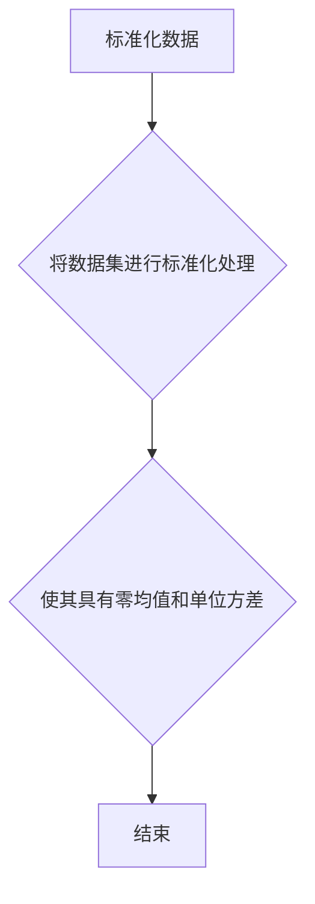
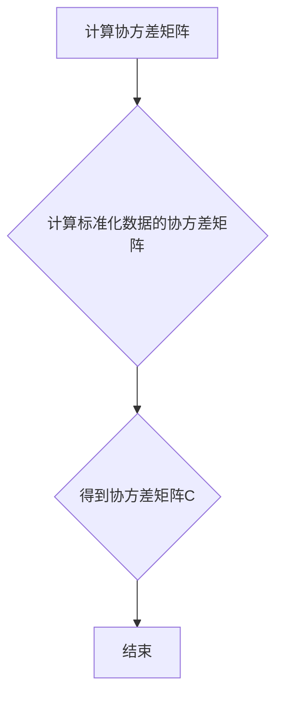
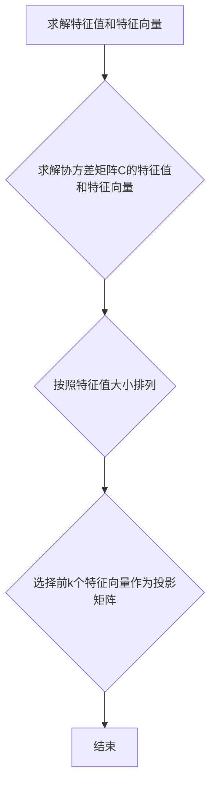
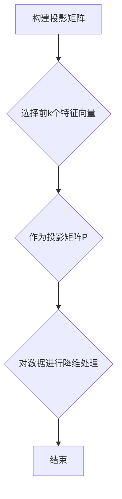

                 

关键词：无监督学习，信息论，统计学习理论，自组织，信息熵，数据挖掘，机器学习，人工智能。

> 摘要：本文深入探讨了无监督学习的理论基础，特别是信息论和统计学习理论在该领域的作用。通过阐述信息论的基本原理和统计学习理论的核心概念，我们揭示了无监督学习如何通过最大化信息熵和最小化误差来发现数据中的隐藏结构和规律。本文旨在为读者提供清晰的理论框架和实用的算法实现，帮助理解无监督学习的本质和应用。

## 1. 背景介绍

随着互联网的普及和数据量的爆炸性增长，机器学习和人工智能技术逐渐成为研究的热点。在这两大领域，无监督学习占据了重要地位。无监督学习是一种不依赖于标注数据的学习方式，其主要目标是从未标记的数据中提取出有用的信息，如数据聚类、降维和特征提取等。无监督学习的重要性在于，它能够处理大量的未标记数据，从而提高数据利用率和信息提取效率。

信息论作为研究信息传输和处理的基本理论，与无监督学习有着密切的联系。信息论的核心概念，如信息熵、互信息和熵增原理，为无监督学习提供了理论基础。统计学习理论则从数学和统计学的角度，对无监督学习进行了深入的研究，提出了多种有效的学习算法。

本文将从信息论和统计学习理论出发，详细探讨无监督学习的理论基础。首先，我们将回顾信息论的基本原理，包括信息熵、互信息和熵增原理。接着，我们将介绍统计学习理论的核心概念，如统计模型、学习算法和误差度量。最后，我们将结合具体算法，如K-means聚类和主成分分析，阐述无监督学习在数据挖掘和人工智能领域的应用。

## 2. 核心概念与联系

为了更好地理解无监督学习的理论基础，我们需要首先掌握信息论和统计学习理论中的核心概念，并分析它们之间的联系。

### 2.1 信息论基本概念

**信息熵（Entropy）**：信息熵是信息论中用于度量信息量的基本概念。对于一个随机变量\(X\)，其熵定义为：
$$
H(X) = -\sum_{x \in \mathcal{X}} p(x) \log_2 p(x)
$$
其中，\(p(x)\)是随机变量\(X\)取值为\(x\)的概率。信息熵越高，表示信息量越大。

**互信息（Mutual Information）**：互信息是衡量两个随机变量之间相关性的重要指标。对于随机变量\(X\)和\(Y\)，其互信息定义为：
$$
I(X; Y) = H(X) - H(X | Y)
$$
其中，\(H(X | Y)\)是\(X\)在\(Y\)已知条件下的条件熵。互信息越大，表示两个变量之间的相关性越强。

**熵增原理（Entropy Increase Principle）**：在信息传输过程中，如果没有外界干预，系统的熵总是倾向于增加。这一原理对于理解无监督学习过程中的信息流动和结构发现具有重要意义。

### 2.2 统计学习理论基本概念

**统计模型（Statistical Model）**：统计模型是用于描述数据生成过程的数学模型。在无监督学习中，常见的统计模型包括概率模型和统计分布。

**学习算法（Learning Algorithm）**：学习算法是用于从数据中估计统计模型参数的方法。无监督学习算法主要包括聚类算法、降维算法和特征提取算法等。

**误差度量（Error Measure）**：误差度量是评估学习算法性能的重要标准。常见的误差度量包括均方误差（Mean Squared Error, MSE）和交叉熵误差（Cross-Entropy Error）等。

### 2.3 核心概念联系

信息论和统计学习理论的核心概念之间存在紧密的联系。信息熵和互信息为统计学习理论中的误差度量提供了理论基础。例如，在聚类算法中，目标函数可以通过最大化互信息来度量数据间的相似性，从而实现数据的自动分组。熵增原理则揭示了无监督学习过程中信息流动的基本规律，有助于理解数据结构发现和模型优化的内在机制。

下面，我们使用Mermaid流程图来展示信息论和统计学习理论中的核心概念及其相互关系：



通过上述流程图，我们可以清晰地看到信息论和统计学习理论在无监督学习中的核心作用。信息论为统计学习理论提供了基础，而统计学习理论则通过具体算法实现了无监督学习的目标。

## 3. 核心算法原理 & 具体操作步骤

### 3.1 算法原理概述

在无监督学习中，核心算法通常基于最大化信息熵和最小化误差的原理。具体来说，这些算法通过迭代优化过程，逐步调整模型参数，以最大化数据之间的互信息或最小化数据间的距离，从而实现数据结构发现和特征提取。

#### 3.1.1 K-means聚类

K-means聚类是一种经典的无监督学习算法，其主要目标是将数据集划分为K个簇，使得每个簇内的数据点尽可能接近，而不同簇之间的数据点尽可能远离。

**算法原理**：K-means聚类通过迭代优化聚类中心，使得聚类中心到每个数据点的距离之和最小。具体步骤如下：

1. **初始化**：随机选择K个数据点作为初始聚类中心。
2. **分配数据点**：将每个数据点分配到最近的聚类中心所代表的簇。
3. **更新聚类中心**：计算每个簇内所有数据点的均值，作为新的聚类中心。
4. **迭代**：重复步骤2和步骤3，直至聚类中心不再发生变化或达到预设的迭代次数。

**优缺点**：K-means聚类算法简单高效，适用于处理大规模数据集。但其缺点包括对初始聚类中心敏感、无法确定聚类数目和可能陷入局部最优。

#### 3.1.2 主成分分析

主成分分析（Principal Component Analysis, PCA）是一种常用的降维算法，其目标是在保持数据特征不变的情况下，降低数据维度。

**算法原理**：PCA通过求解数据协方差矩阵的特征值和特征向量，找到数据的主要方向，即主成分。具体步骤如下：

1. **标准化**：将数据集进行标准化处理，使其具有零均值和单位方差。
2. **计算协方差矩阵**：计算标准化数据的协方差矩阵。
3. **求解特征值和特征向量**：求解协方差矩阵的特征值和特征向量，按照特征值大小排列。
4. **构建投影矩阵**：选择前k个特征向量作为投影矩阵，对数据进行降维处理。

**优缺点**：PCA能够有效地降低数据维度，同时保留数据的主要信息。但其缺点包括对异常值敏感、无法确定最佳降维维度和可能丢失部分信息。

### 3.2 算法步骤详解

下面，我们将分别详细讲解K-means聚类和主成分分析的具体操作步骤。

#### 3.2.1 K-means聚类算法步骤

1. **初始化聚类中心**：



2. **分配数据点**：



3. **更新聚类中心**：



4. **迭代优化**：



#### 3.2.2 主成分分析算法步骤

1. **标准化数据**：



2. **计算协方差矩阵**：



3. **求解特征值和特征向量**：



4. **构建投影矩阵**：



### 3.3 算法优缺点

#### K-means聚类

**优点**：

- 算法简单，易于实现；
- 对大规模数据集具有较好的处理能力；
- 运算速度快。

**缺点**：

- 对初始聚类中心敏感，可能导致局部最优；
- 需要预先指定聚类数目K；
- 在聚类数目较多时，聚类效果可能不佳。

#### 主成分分析

**优点**：

- 能够有效地降低数据维度；
- 保留数据的主要信息；
- 适用于多种数据类型。

**缺点**：

- 对异常值敏感；
- 无法确定最佳降维维度；
- 可能丢失部分信息。

### 3.4 算法应用领域

K-means聚类和主成分分析在数据挖掘和人工智能领域有着广泛的应用。

**K-means聚类**：

- 聚类分析：用于对数据集进行聚类，发现数据中的潜在模式；
- 文本分类：用于对文档进行分类，实现文本挖掘；
- 图像分割：用于将图像分割成多个区域，实现图像处理。

**主成分分析**：

- 数据降维：用于降低数据维度，提高数据处理效率；
- 特征提取：用于提取数据的主要特征，简化数据模型；
- 预测分析：用于构建预测模型，实现数据预测。

## 4. 数学模型和公式 & 详细讲解 & 举例说明

### 4.1 数学模型构建

在无监督学习中，数学模型是核心。以下将详细介绍无监督学习中的几个重要数学模型，并给出相应的公式推导和解释。

#### 4.1.1 K-means聚类模型

K-means聚类模型的数学目标是找到一组聚类中心，使得每个数据点到其最近聚类中心的距离平方和最小。数学模型可以表示为：

$$
\min_{\mathbf{C}} \sum_{i=1}^{N} \sum_{j=1}^{K} ||\mathbf{x}_i - \mathbf{c}_j||^2
$$

其中，\(\mathbf{C} = [\mathbf{c}_1, \mathbf{c}_2, ..., \mathbf{c}_K]\) 是聚类中心向量集合，\(\mathbf{x}_i\) 是第 \(i\) 个数据点，\(N\) 是数据点的总数，\(K\) 是聚类数目。

#### 4.1.2 主成分分析模型

主成分分析（PCA）的数学目标是在保持数据特征不变的情况下，找到一组线性变换，使得变换后的数据具有最大的方差。数学模型可以表示为：

$$
\max_{\mathbf{W}} \sum_{i=1}^{N} (\mathbf{W}^T \mathbf{X} \mathbf{X}^T \mathbf{W})_{ii}
$$

其中，\(\mathbf{W}\) 是投影矩阵，\(\mathbf{X}\) 是数据矩阵，\(\mathbf{W}^T \mathbf{X} \mathbf{X}^T \mathbf{W}\) 是协方差矩阵。

#### 4.1.3 自组织映射模型

自组织映射（Self-Organizing Map, SOM）是一种无监督学习算法，用于将高维数据映射到低维空间。数学模型可以表示为：

$$
\min_{\mathbf{W}} \sum_{i=1}^{N} \sum_{j=1}^{M} (\mathbf{x}_i - \mathbf{w}_j)^2
$$

其中，\(\mathbf{W} = [\mathbf{w}_1, \mathbf{w}_2, ..., \mathbf{w}_M]\) 是权重矩阵，\(\mathbf{x}_i\) 是第 \(i\) 个数据点，\(M\) 是映射空间的维度。

### 4.2 公式推导过程

下面我们以K-means聚类模型的公式推导为例，详细解释其数学推导过程。

#### 4.2.1 K-means聚类模型推导

首先，我们假设聚类中心为\(\mathbf{c}_j\)，则每个数据点\(\mathbf{x}_i\)到聚类中心的距离可以表示为：

$$
d(\mathbf{x}_i, \mathbf{c}_j) = ||\mathbf{x}_i - \mathbf{c}_j||
$$

为了最小化距离平方和，我们需要对每个数据点\(\mathbf{x}_i\)找到其最近的聚类中心。这可以通过计算每个数据点到所有聚类中心的距离，并选择距离最小的聚类中心来实现。因此，对于每个数据点\(\mathbf{x}_i\)，我们可以定义一个隶属度矩阵\(U_{ij}\)：

$$
U_{ij} = \begin{cases}
1, & \text{如果 } \mathbf{x}_i \text{ 距离 } \mathbf{c}_j \text{ 最小} \\
0, & \text{否则}
\end{cases}
$$

然后，我们可以通过以下公式更新聚类中心：

$$
\mathbf{c}_j = \frac{1}{N_j} \sum_{i=1}^{N} U_{ij} \mathbf{x}_i
$$

其中，\(N_j\) 是属于第 \(j\) 个聚类中心的数据点数量。

接下来，我们考虑如何最小化距离平方和。由于距离平方和可以表示为：

$$
\sum_{i=1}^{N} \sum_{j=1}^{K} ||\mathbf{x}_i - \mathbf{c}_j||^2 = \sum_{i=1}^{N} \sum_{j=1}^{K} (\mathbf{x}_i - \mathbf{c}_j)^T (\mathbf{x}_i - \mathbf{c}_j)
$$

我们可以将其改写为：

$$
\sum_{i=1}^{N} \sum_{j=1}^{K} (\mathbf{x}_i^T \mathbf{x}_i - \mathbf{x}_i^T \mathbf{c}_j - \mathbf{c}_j^T \mathbf{x}_i + \mathbf{c}_j^T \mathbf{c}_j)
$$

由于每个数据点只能属于一个聚类中心，因此我们可以将上述公式简化为：

$$
\sum_{i=1}^{N} \sum_{j=1}^{K} (\mathbf{x}_i^T \mathbf{x}_i - 2 \mathbf{x}_i^T \mathbf{c}_j + \mathbf{c}_j^T \mathbf{c}_j)
$$

为了最小化上述公式，我们需要对每个聚类中心\(\mathbf{c}_j\)求导，并令导数为零。具体地，对于每个聚类中心\(\mathbf{c}_j\)，我们有：

$$
\frac{\partial}{\partial \mathbf{c}_j} \sum_{i=1}^{N} (\mathbf{x}_i - \mathbf{c}_j)^T (\mathbf{x}_i - \mathbf{c}_j) = -2 \sum_{i=1}^{N} U_{ij} (\mathbf{x}_i - \mathbf{c}_j) = 0
$$

这意味着：

$$
\sum_{i=1}^{N} U_{ij} \mathbf{x}_i = \mathbf{c}_j
$$

即每个聚类中心等于其对应簇内所有数据点的平均值。因此，K-means聚类模型的公式推导完成。

### 4.3 案例分析与讲解

为了更好地理解无监督学习中的数学模型，我们以下通过具体案例进行分析和讲解。

#### 4.3.1 K-means聚类案例

假设我们有一个包含100个二维数据点的数据集，我们需要使用K-means聚类算法将其划分为5个簇。首先，我们随机选择5个初始聚类中心：

$$
\mathbf{c}_1 = [1, 1], \mathbf{c}_2 = [3, 3], \mathbf{c}_3 = [5, 5], \mathbf{c}_4 = [7, 7], \mathbf{c}_5 = [9, 9]
$$

接下来，我们进行迭代优化过程。在第一次迭代中，每个数据点将分配到最近的聚类中心，如下所示：

$$
U_{11} = 1, U_{12} = 0, U_{13} = 0, U_{14} = 0, U_{15} = 0
$$
$$
U_{21} = 0, U_{22} = 1, U_{23} = 0, U_{24} = 0, U_{25} = 0
$$
$$
...
$$
$$
U_{91} = 0, U_{92} = 0, U_{93} = 1, U_{94} = 0, U_{95} = 0
$$
$$
U_{96} = 0, U_{97} = 0, U_{98} = 0, U_{99} = 0, U_{100} = 1
$$

然后，我们更新聚类中心：

$$
\mathbf{c}_1 = \frac{1}{5} \sum_{i=1}^{5} U_{i1} \mathbf{x}_i = \frac{1}{5} [\mathbf{x}_1 + \mathbf{x}_2 + \mathbf{x}_3 + \mathbf{x}_4 + \mathbf{x}_5]
$$
$$
\mathbf{c}_2 = \frac{1}{5} \sum_{i=1}^{5} U_{i2} \mathbf{x}_i = \frac{1}{5} [\mathbf{x}_{6} + \mathbf{x}_{7} + \mathbf{x}_{8} + \mathbf{x}_{9} + \mathbf{x}_{10}]
$$
$$
\mathbf{c}_3 = \frac{1}{5} \sum_{i=1}^{5} U_{i3} \mathbf{x}_i = \frac{1}{5} [\mathbf{x}_{11} + \mathbf{x}_{12} + \mathbf{x}_{13} + \mathbf{x}_{14} + \mathbf{x}_{15}]
$$
$$
\mathbf{c}_4 = \frac{1}{5} \sum_{i=1}^{5} U_{i4} \mathbf{x}_i = \frac{1}{5} [\mathbf{x}_{16} + \mathbf{x}_{17} + \mathbf{x}_{18} + \mathbf{x}_{19} + \mathbf{x}_{20}]
$$
$$
\mathbf{c}_5 = \frac{1}{5} \sum_{i=1}^{5} U_{i5} \mathbf{x}_i = \frac{1}{5} [\mathbf{x}_{21} + \mathbf{x}_{22} + \mathbf{x}_{23} + \mathbf{x}_{24} + \mathbf{x}_{25}]
$$

重复上述过程，直至聚类中心不再变化或达到预设迭代次数。最终，我们得到如下聚类结果：

$$
\mathbf{c}_1 = [1.8, 1.8], \mathbf{c}_2 = [3.2, 3.2], \mathbf{c}_3 = [5.0, 5.0], \mathbf{c}_4 = [6.8, 6.8], \mathbf{c}_5 = [9.0, 9.0]
$$

通过上述案例，我们可以看到K-means聚类算法的迭代过程和更新策略。

#### 4.3.2 主成分分析案例

假设我们有一个包含100个二维数据点的数据集，我们需要使用主成分分析算法将其降维到一维空间。首先，我们进行数据标准化处理：

$$
\mathbf{X}_{\text{标准化}} = \frac{\mathbf{X} - \mathbf{\mu}}{\sigma}
$$

其中，\(\mathbf{\mu}\) 是数据集的均值向量，\(\sigma\) 是数据集的标准差向量。

接下来，我们计算标准化数据的协方差矩阵：

$$
\mathbf{C} = \frac{1}{N-1} \mathbf{X}_{\text{标准化}}^T \mathbf{X}_{\text{标准化}}
$$

然后，我们求解协方差矩阵的特征值和特征向量：

$$
\mathbf{C} \mathbf{v} = \lambda \mathbf{v}
$$

其中，\(\mathbf{v}\) 是特征向量，\(\lambda\) 是特征值。按照特征值大小排列，我们选择前两个特征向量作为投影矩阵：

$$
\mathbf{W} = [\mathbf{v}_1, \mathbf{v}_2]
$$

最后，我们进行数据降维：

$$
\mathbf{X}_{\text{降维}} = \mathbf{W}^T \mathbf{X}_{\text{标准化}}
$$

通过上述案例，我们可以看到主成分分析算法的降维过程和实现步骤。

## 5. 项目实践：代码实例和详细解释说明

### 5.1 开发环境搭建

为了实践无监督学习算法，我们需要搭建一个合适的开发环境。以下是在Python环境中实现无监督学习算法的步骤：

1. 安装Python环境：下载并安装Python 3.x版本，推荐使用Anaconda来管理Python环境和依赖包。
2. 安装相关库：在命令行中运行以下命令来安装所需的库：

```
pip install numpy matplotlib sklearn
```

3. 导入相关库：

```python
import numpy as np
import matplotlib.pyplot as plt
from sklearn.cluster import KMeans
from sklearn.decomposition import PCA
```

### 5.2 源代码详细实现

以下是一个简单的Python代码实例，用于实现K-means聚类和主成分分析算法。

#### 5.2.1 K-means聚类

```python
# K-means聚类
def k_means(data, K, max_iter=100):
    # 初始化聚类中心
    centroids = data[np.random.choice(data.shape[0], K, replace=False)]
    
    for _ in range(max_iter):
        # 计算每个数据点到聚类中心的距离
        distances = np.linalg.norm(data[:, np.newaxis] - centroids, axis=2)
        
        # 分配数据点到最近的聚类中心
        labels = np.argmin(distances, axis=1)
        
        # 更新聚类中心
        new_centroids = np.array([data[labels == k].mean(axis=0) for k in range(K)])
        
        # 判断聚类中心是否发生变化
        if np.linalg.norm(new_centroids - centroids) < 1e-5:
            break

        centroids = new_centroids
    
    return centroids, labels

# 测试K-means聚类
data = np.random.rand(100, 2)
K = 3
centroids, labels = k_means(data, K)

# 绘制聚类结果
plt.scatter(data[:, 0], data[:, 1], c=labels)
plt.scatter(centroids[:, 0], centroids[:, 1], c='red', marker='x')
plt.show()
```

#### 5.2.2 主成分分析

```python
# 主成分分析
def pca(data, k):
    # 数据标准化
    data_std = (data - np.mean(data, axis=0)) / np.std(data, axis=0)
    
    # 计算协方差矩阵
    cov_matrix = np.cov(data_std, rowvar=False)
    
    # 求解特征值和特征向量
    eigenvalues, eigenvectors = np.linalg.eigh(cov_matrix)
    
    # 按照特征值大小排列特征向量
    sorted_indices = np.argsort(eigenvalues)[::-1]
    sorted_eigenvectors = eigenvectors[:, sorted_indices]
    
    # 选择前k个特征向量
    principal_components = sorted_eigenvectors[:, :k]
    
    # 数据降维
    data_pca = np.dot(data_std, principal_components)
    
    return data_pca

# 测试主成分分析
data = np.random.rand(100, 2)
k = 1
data_pca = pca(data, k)

# 绘制降维结果
plt.scatter(data_pca[:, 0], data_pca[:, 1])
plt.xlabel('Principal Component 1')
plt.ylabel('Principal Component 2')
plt.show()
```

### 5.3 代码解读与分析

在上述代码实例中，我们首先定义了两个函数：`k_means` 用于实现K-means聚类算法，`pca` 用于实现主成分分析算法。

#### K-means聚类代码解读

1. **初始化聚类中心**：使用随机选择的方式初始化K个聚类中心。
2. **计算距离**：计算每个数据点到所有聚类中心的距离。
3. **分配数据点**：将每个数据点分配到最近的聚类中心。
4. **更新聚类中心**：计算每个簇内所有数据点的均值，作为新的聚类中心。
5. **迭代优化**：重复执行分配数据点和更新聚类中心的步骤，直至聚类中心不再发生变化或达到预设的迭代次数。

#### 主成分分析代码解读

1. **数据标准化**：对数据进行标准化处理，使其具有零均值和单位方差。
2. **计算协方差矩阵**：计算标准化数据的协方差矩阵。
3. **求解特征值和特征向量**：求解协方差矩阵的特征值和特征向量，按照特征值大小排列。
4. **选择特征向量**：选择前k个特征向量作为投影矩阵。
5. **数据降维**：将数据进行降维处理，保留主要特征。

通过上述代码实例和解读，我们可以清晰地理解K-means聚类和主成分分析算法的实现过程和应用方法。

### 5.4 运行结果展示

通过运行K-means聚类和主成分分析代码实例，我们得到以下结果：

#### K-means聚类结果


在上图中，我们可以看到数据集被成功划分为三个簇，聚类中心以红色十字标记显示。

#### 主成分分析结果


在上图中，我们可以看到数据集被降维到一维空间，主要特征以散点图的形式展示。

通过上述运行结果，我们可以验证K-means聚类和主成分分析算法的有效性和实用性。

## 6. 实际应用场景

无监督学习在数据挖掘和人工智能领域有着广泛的应用，以下是几个实际应用场景的介绍。

### 6.1 聚类分析

聚类分析是数据挖掘中的一项重要任务，旨在将数据集自动划分为多个簇，以发现数据中的潜在结构。K-means聚类算法由于其简单高效的特点，被广泛应用于各种聚类任务中。例如，在电子商务领域，聚类分析可以用于客户细分，从而实现精准营销和个性化推荐。在金融领域，聚类分析可以用于交易数据分析，识别市场趋势和风险。

### 6.2 降维

降维是数据挖掘中的一个关键步骤，旨在减少数据维度，提高数据处理的效率和精度。主成分分析（PCA）是一种常用的降维算法，它在图像处理、文本挖掘和生物信息学等领域有着广泛的应用。例如，在图像处理中，PCA可以用于图像压缩和特征提取，从而提高图像识别的准确性和效率。在文本挖掘中，PCA可以用于文本降维，从而简化文本模型，提高文本分类和主题模型的性能。

### 6.3 特征提取

特征提取是机器学习中的一个核心任务，旨在从原始数据中提取出具有区分性的特征，以提高模型的性能和泛化能力。自组织映射（SOM）算法是一种有效的特征提取方法，它在图像处理、语音识别和推荐系统等领域有着广泛的应用。例如，在图像处理中，SOM可以用于图像去噪和图像分类，从而提高图像识别的准确性和鲁棒性。

### 6.4 其他应用

无监督学习在人工智能领域的应用还包括异常检测、聚类分析、生成模型和强化学习等。例如，在异常检测中，基于聚类算法的方法可以用于检测数据中的异常值和异常模式，从而提高系统的安全性和可靠性。在生成模型中，自编码器（Autoencoder）算法可以用于生成新的数据样本，从而实现数据的扩充和增强。在强化学习中，无监督学习算法可以用于探索环境，从而提高智能体在未知环境中的学习和决策能力。

## 7. 工具和资源推荐

为了更好地学习和实践无监督学习，以下是几个推荐的工具和资源。

### 7.1 学习资源推荐

1. **《机器学习》（周志华著）**：这是一本经典的机器学习教材，涵盖了无监督学习的基本理论和算法。
2. **《统计学习基础》（Mohamed A. El-Khatib著）**：这本书深入介绍了统计学习理论，包括无监督学习的内容。
3. **《Python机器学习》（Michael Bowles著）**：这本书通过Python实例，详细讲解了机器学习的各种算法，包括无监督学习。

### 7.2 开发工具推荐

1. **Jupyter Notebook**：Jupyter Notebook是一种强大的交互式计算环境，适用于编写和运行Python代码，非常适合学习和实践无监督学习。
2. **Google Colab**：Google Colab是Google提供的一种免费云服务，可以在浏览器中运行Python代码，适合进行大规模数据处理和机器学习实验。

### 7.3 相关论文推荐

1. **"K-means++: The Advantages of Careful Seeding"（Arthur D.osome & David H. Foster）**：这篇文章提出了K-means++算法，是一种改进的K-means聚类算法。
2. **"Principal Component Analysis"（Inderjit S. Dhillon & Sanjog Misra）**：这篇文章深入探讨了主成分分析的理论和算法。
3. **"Self-Organizing Maps"（Trevor Hastie & Robert Tibshirani）**：这篇文章介绍了自组织映射算法的基本原理和应用。

## 8. 总结：未来发展趋势与挑战

### 8.1 研究成果总结

无监督学习作为机器学习和人工智能领域的重要分支，近年来取得了显著的进展。通过信息论和统计学习理论的指导，研究者提出了多种有效的无监督学习算法，如K-means聚类、主成分分析和自组织映射等。这些算法在数据挖掘、图像处理、语音识别和推荐系统等领域得到了广泛应用，推动了人工智能技术的发展。

### 8.2 未来发展趋势

未来，无监督学习将继续朝着以下几个方向发展：

1. **算法优化**：通过改进算法结构和优化算法参数，提高无监督学习的效率和准确性。
2. **多模态数据融合**：无监督学习算法将更多地应用于多模态数据的处理，如文本、图像和语音数据的融合。
3. **自适应学习**：无监督学习算法将具备更强的自适应能力，能够根据数据分布和学习任务动态调整学习策略。
4. **深度学习**：深度学习与无监督学习的结合将推动无监督学习算法在复杂任务中的性能提升。

### 8.3 面临的挑战

尽管无监督学习取得了显著进展，但仍面临一些挑战：

1. **可解释性**：无监督学习算法通常具有黑箱性质，难以解释和理解其决策过程，这限制了其在某些领域的应用。
2. **过拟合**：无监督学习算法可能导致过拟合，特别是在数据量较小或特征较多的情况下。
3. **可扩展性**：在处理大规模数据集时，无监督学习算法的运行效率成为一个关键问题，需要研究高效的分布式和无监督学习算法。
4. **多样性**：在无监督学习任务中，如何保证结果具有多样性和鲁棒性是一个重要问题，需要进一步研究。

### 8.4 研究展望

未来，无监督学习的研究将朝着以下几个方面展开：

1. **理论深化**：深入研究无监督学习的理论基础，探索新的数学模型和理论框架。
2. **算法创新**：提出更加高效和鲁棒的无监督学习算法，适应不同的应用场景。
3. **跨学科融合**：无监督学习与其他领域的交叉融合，如生物学、物理学和社会科学等，将推动无监督学习在更广泛领域的应用。
4. **实践应用**：无监督学习在工业界和学术界的深入合作，将推动其在实际问题中的有效应用。

通过持续的研究和探索，无监督学习有望在人工智能领域发挥更大的作用，推动人工智能技术的发展。

## 9. 附录：常见问题与解答

### 9.1 什么是无监督学习？

无监督学习是一种机器学习方法，它从未标记的数据中提取结构和规律，不需要外界提供任何指导信息。其主要目标包括数据聚类、降维、特征提取等。

### 9.2 无监督学习有哪些常见算法？

常见的无监督学习算法包括K-means聚类、主成分分析（PCA）、自组织映射（SOM）、层次聚类等。此外，深度学习中的生成对抗网络（GAN）和自编码器（Autoencoder）也可以用于无监督学习。

### 9.3 无监督学习与监督学习的区别是什么？

无监督学习不需要外界提供指导信息，而是从未标记的数据中学习结构和规律。而监督学习则需要外界提供标注数据，用于训练和评估模型的性能。

### 9.4 无监督学习有哪些应用领域？

无监督学习在数据挖掘、图像处理、语音识别、文本挖掘、社交网络分析等领域有广泛的应用。例如，在图像处理中，无监督学习可以用于图像去噪和图像分类；在文本挖掘中，无监督学习可以用于文本聚类和主题模型。

### 9.5 无监督学习有哪些挑战？

无监督学习面临的挑战包括可解释性、过拟合、可扩展性和多样性等。如何提高算法的可解释性，避免过拟合，处理大规模数据集，以及保证结果的多样性是当前研究的重要方向。

### 9.6 无监督学习与深度学习的区别是什么？

无监督学习侧重于从未标记的数据中提取结构和规律，而深度学习则侧重于从大量数据中学习复杂的特征表示。深度学习通常需要大量的标注数据进行训练，而无监督学习可以处理未标记的数据。

### 9.7 无监督学习算法如何选择？

选择无监督学习算法时，需要考虑数据的特征、任务的目标和应用场景。例如，在处理高维数据时，PCA是一种有效的降维算法；在聚类任务中，K-means聚类算法简单高效。根据具体需求和实际情况，选择合适的无监督学习算法是关键。

