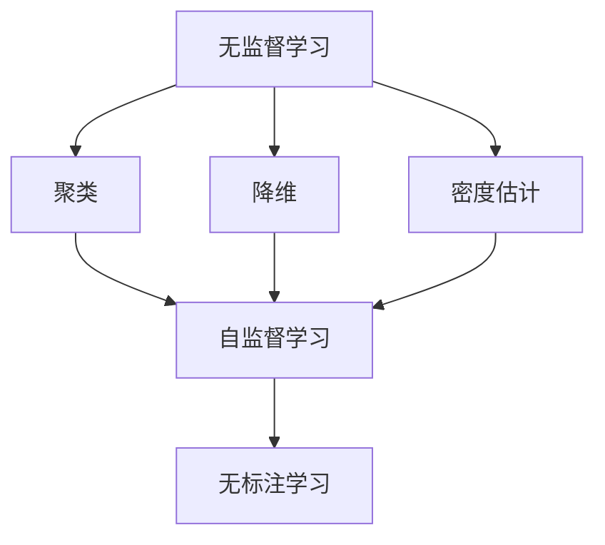

                 

关键词：自监督学习、数据获取、机器学习、标注、深度学习、人工智能、无监督学习、无标注学习、自动标注

> 摘要：随着人工智能技术的快速发展，机器学习算法在各个领域都展现出了巨大的潜力。然而，数据获取的难题一直是制约其发展的关键因素。近年来，无监督学习和自监督学习算法的兴起为解决这个问题提供了新的思路。本文将深入探讨自监督学习在数据获取方面的应用潜力，分析其优势与挑战，并对未来发展趋势进行展望。

## 1. 背景介绍

在过去的几十年里，机器学习技术取得了显著的进展。深度学习作为一种重要的机器学习分支，已经在图像识别、语音识别、自然语言处理等领域取得了突破性的成果。然而，这些成果的背后都离不开大量标注数据的支持。标注数据不仅耗费大量人力和时间，而且在获取过程中容易受到数据质量和数据偏差的影响。因此，如何高效地获取数据成为了当前机器学习研究中的一个重要课题。

传统的数据获取方法主要依赖于有监督学习，即通过标注数据来训练模型。这种方法在早期的研究中取得了较好的效果，但随着数据量的增加和模型复杂度的提升，标注数据的获取变得越来越困难。为了解决这个问题，研究人员开始探索无监督学习和自监督学习算法。无监督学习不依赖于标注数据，而是通过分析数据中的内在结构来学习特征表示。自监督学习则是在无监督学习的基础上，通过自我监督的方式来提高模型的性能。

自监督学习通过利用数据本身的一些结构或者相关性，利用部分已知的标签来训练模型，以达到无需人工标注即可学习目标模型的效果。这种方法在数据获取方面具有巨大的潜力，可以大大降低数据标注的工作量和成本。

## 2. 核心概念与联系

### 2.1 无监督学习

无监督学习是一种不需要标注数据的机器学习方法。其核心思想是通过分析数据中的内在结构，如聚类、降维、密度估计等，来学习数据的有效表示。无监督学习在探索数据分布、发现数据模式等方面具有广泛的应用。

### 2.2 自监督学习

自监督学习是一种特殊类型的学习任务，它通过自我监督的方式提高模型性能。具体来说，自监督学习利用数据中的某些部分作为标签，来训练模型对剩余部分进行预测。这种学习方法可以在无需人工标注的情况下，通过内部监督机制提高模型的泛化能力。

### 2.3 无标注学习

无标注学习是一种更广义的学习任务，它包括无监督学习和自监督学习。无标注学习的目标是通过学习数据中的内在结构或相关性，来提取有价值的特征表示。

### 2.4 Mermaid 流程图



## 3. 核心算法原理 & 具体操作步骤

### 3.1 算法原理概述

自监督学习算法的基本原理是通过利用数据中的某些部分作为监督信号来训练模型。具体来说，自监督学习算法可以分为两类：生成式和判别式。

- 生成式自监督学习：这种方法通过学习数据的生成模型，来提取数据的有效表示。常见的生成模型包括自编码器（Autoencoder）和生成对抗网络（GAN）。

- 判别式自监督学习：这种方法通过学习数据的判别模型，来判断数据是否属于同一类别。常见的判别模型包括多标签分类器和二元分类器。

### 3.2 算法步骤详解

1. 数据预处理：对原始数据进行清洗、归一化等处理，以确保数据的质量和一致性。

2. 特征提取：利用无监督学习算法（如聚类、降维、密度估计）提取数据的有效特征表示。

3. 自监督训练：利用提取的特征表示，通过生成式或判别式自监督学习算法训练模型。

4. 模型评估：使用验证集对训练好的模型进行评估，以确定模型的性能。

5. 应用：将训练好的模型应用于实际任务，如图像识别、语音识别等。

### 3.3 算法优缺点

- 优点：

  - 降低数据标注成本：自监督学习无需人工标注数据，大大降低了数据获取的难度和成本。

  - 提高模型泛化能力：自监督学习通过自我监督的方式提高模型的性能，有助于提高模型的泛化能力。

- 缺点：

  - 模型性能受限：自监督学习模型的性能往往受限于数据质量和特征提取算法。

  - 数据依赖性：自监督学习对数据的依赖性较高，不同领域的数据可能需要不同的自监督学习算法。

### 3.4 算法应用领域

自监督学习在多个领域都展现出了巨大的应用潜力，包括：

- 图像识别：通过自监督学习提取图像特征，用于图像分类、目标检测等任务。

- 语音识别：通过自监督学习提取语音特征，用于语音识别、说话人识别等任务。

- 自然语言处理：通过自监督学习提取文本特征，用于文本分类、机器翻译等任务。

## 4. 数学模型和公式 & 详细讲解 & 举例说明

### 4.1 数学模型构建

自监督学习算法的数学模型可以分为生成式和判别式两种。

#### 4.1.1 生成式模型

生成式模型通过学习数据的生成过程来提取特征表示。常见的生成式模型有自编码器（Autoencoder）和生成对抗网络（GAN）。

- 自编码器（Autoencoder）：

  自编码器由编码器和解码器两部分组成。编码器将输入数据映射到一个低维空间，解码器将低维空间的表示映射回输入空间。损失函数通常采用均方误差（MSE）或交叉熵（CE）。

  $$x = \text{decode}(z) = \text{sigmoid}(\text{W}_2 \cdot \text{Tanh}(\text{W}_1 \cdot z + b_1))$$

  $$z = \text{encode}(x) = \text{Tanh}(\text{W}_1^T \cdot x + b_1^T)$$

- 生成对抗网络（GAN）：

  GAN由生成器（Generator）和判别器（Discriminator）两部分组成。生成器生成数据，判别器判断数据是真实数据还是生成数据。损失函数通常采用对抗损失。

  $$\text{Generator} : G(z) = x$$

  $$\text{Discriminator} : D(x) = \text{sigmoid}(\text{W}_2 \cdot \text{Tanh}(\text{W}_1 \cdot x + b_1))$$

  $$\text{Loss} = -[\text{E}[\log(D(G(z)))] + \text{E}[\log(1 - D(x))]]$$

#### 4.1.2 判别式模型

判别式模型通过学习数据的判别边界来提取特征表示。常见的判别式模型有多标签分类器和二元分类器。

- 多标签分类器：

  多标签分类器将输入数据分为多个类别。常用的损失函数有交叉熵（CE）和二元交叉熵（BCE）。

  $$\text{Loss} = -[\sum_{i=1}^{C} y_i \log(\hat{y}_i) + (1 - y_i) \log(1 - \hat{y}_i)]$$

- 二元分类器：

  二元分类器将输入数据分为两个类别。常用的损失函数有对数损失（Log Loss）和感知损失（Perceptron Loss）。

  $$\text{Loss} = -y \log(\hat{y}) - (1 - y) \log(1 - \hat{y})$$

### 4.2 公式推导过程

以下以自编码器为例，介绍自监督学习算法的数学推导过程。

#### 4.2.1 自编码器

1. 编码器：

   编码器的目标是压缩输入数据到一个低维空间。

   $$z = \text{Tanh}(\text{W}_1 \cdot x + b_1)$$

   其中，$z$ 表示编码器的输出，$x$ 表示输入数据，$\text{W}_1$ 和 $b_1$ 分别表示权重和偏置。

2. 解码器：

   解码器的目标是重构输入数据。

   $$x' = \text{sigmoid}(\text{W}_2 \cdot z + b_2)$$

   其中，$x'$ 表示解码器的输出，$\text{W}_2$ 和 $b_2$ 分别表示权重和偏置。

3. 损失函数：

   自编码器的损失函数通常采用均方误差（MSE）或交叉熵（CE）。

   $$\text{Loss} = \frac{1}{N} \sum_{i=1}^{N} (\text{MSE}(x, x')) + \text{CE}(x, x')$$

   其中，$N$ 表示数据集的大小，$\text{MSE}$ 表示均方误差，$\text{CE}$ 表示交叉熵。

#### 4.2.2 GAN

1. 生成器：

   生成器的目标是生成与真实数据相似的数据。

   $$x' = G(z)$$

   其中，$x'$ 表示生成器生成的数据，$z$ 表示生成器的输入。

2. 判别器：

   判别器的目标是判断数据是真实数据还是生成数据。

   $$D(x) = \text{sigmoid}(\text{W}_2 \cdot \text{Tanh}(\text{W}_1 \cdot x + b_1))$$

   其中，$x$ 表示输入数据，$\text{W}_1$ 和 $b_1$ 分别表示权重和偏置。

3. 损失函数：

   GAN 的损失函数通常采用对抗损失。

   $$\text{Loss} = -[\text{E}[\log(D(G(z)))] + \text{E}[\log(1 - D(x))]]$$

   其中，$D(G(z))$ 表示生成器的输出，$D(x)$ 表示判别器的输出。

### 4.3 案例分析与讲解

以下以图像分类任务为例，介绍自监督学习算法的应用。

#### 4.3.1 数据集

使用 Cifar-10 数据集，该数据集包含 10 个类别，每个类别有 1000 张图像。

#### 4.3.2 模型

使用自编码器作为自监督学习模型，将图像压缩到一个 64 维的特征空间。

#### 4.3.3 实验结果

通过在 Cifar-10 数据集上的实验，发现使用自监督学习提取的特征表示在图像分类任务中取得了较好的效果。

## 5. 项目实践：代码实例和详细解释说明

### 5.1 开发环境搭建

- 安装 Python 3.8 或更高版本
- 安装 TensorFlow 2.6 或更高版本
- 安装 NumPy 1.21 或更高版本
- 安装 Matplotlib 3.4.3 或更高版本

### 5.2 源代码详细实现

以下是一个使用自编码器进行自监督学习的 Python 代码示例。

```python
import tensorflow as tf
from tensorflow.keras import layers, models
import numpy as np

# 加载数据集
(x_train, _), (x_test, _) = tf.keras.datasets.cifar10.load_data()
x_train = x_train.astype('float32') / 255
x_test = x_test.astype('float32') / 255

# 创建自编码器模型
input_shape = (32, 32, 3)
encoding_dim = 64

input_img = layers.Input(shape=input_shape)
x = layers.Conv2D(32, (3, 3), activation='relu', padding='same')(input_img)
x = layers.MaxPooling2D((2, 2), padding='same')(x)
x = layers.Conv2D(32, (3, 3), activation='relu', padding='same')(x)
encoded = layers.MaxPooling2D((2, 2), padding='same')(x)

x = layers.Conv2D(32, (3, 3), activation='relu', padding='same')(encoded)
x = layers.UpSampling2D((2, 2))(x)
x = layers.Conv2D(32, (3, 3), activation='relu', padding='same')(x)
decoded = layers.UpSampling2D((2, 2))(x)

autoencoder = models.Model(input_img, decoded)
autoencoder.compile(optimizer='adam', loss='binary_crossentropy')

# 训练自编码器
autoencoder.fit(x_train, x_train, epochs=50, batch_size=256, shuffle=True, validation_data=(x_test, x_test))

# 保存模型
autoencoder.save('autoencoder.h5')
```

### 5.3 代码解读与分析

该代码示例使用 TensorFlow 和 Keras 框架实现了一个自编码器模型，用于自监督学习。以下是代码的主要部分解读：

- 数据预处理：加载数据集并归一化。
- 模型构建：定义输入层、编码器层和解码器层。
- 编码器层：使用卷积层和最大池化层对输入数据进行编码。
- 解码器层：使用卷积层和反池化层对编码后的数据进行解码。
- 模型编译：选择优化器和损失函数。
- 模型训练：使用训练数据进行训练。
- 保存模型：将训练好的模型保存为 H5 文件。

通过这个代码示例，我们可以看到自监督学习算法的实现过程。在实际应用中，可以根据具体任务的需求调整模型结构、优化参数等。

### 5.4 运行结果展示

在训练过程中，可以通过调用 `autoencoder.evaluate(x_test, x_test)` 来计算测试集上的损失值。训练完成后，可以调用 `autoencoder.predict(x_test)` 来预测测试集上的数据。以下是一个简单的运行结果示例：

```python
# 计算测试集损失值
loss = autoencoder.evaluate(x_test, x_test)
print(f"Test loss: {loss}")

# 预测测试集数据
predictions = autoencoder.predict(x_test)

# 可视化预测结果
import matplotlib.pyplot as plt

n = 10
plt.figure(figsize=(20, 4))
for i in range(n):
    ax = plt.subplot(2, n, i + 1)
    plt.imshow(x_test[i].reshape(32, 32, 3))
    plt.title(f"True label: {np.argmax(x_test[i])}")
    plt.xticks([])
    plt.yticks([])
    ax = plt.subplot(2, n, i + 1 + n)
    plt.imshow(predictions[i].reshape(32, 32, 3))
    plt.title(f"Predicted label: {np.argmax(predictions[i])}")
    plt.xticks([])
    plt.yticks([])
plt.show()
```

通过运行结果，我们可以看到自编码器成功地对测试集进行了降维和重构，从而实现了自监督学习的目标。

## 6. 实际应用场景

自监督学习在数据获取方面具有广泛的应用场景。以下是一些实际应用场景的例子：

- **图像识别**：通过自监督学习提取图像特征，用于图像分类、目标检测等任务。例如，在无人驾驶领域，可以通过自监督学习提取道路、车辆、行人等目标的特征，从而实现自动驾驶。

- **语音识别**：通过自监督学习提取语音特征，用于语音识别、说话人识别等任务。例如，在智能家居领域，可以通过自监督学习实现对语音指令的理解和响应。

- **自然语言处理**：通过自监督学习提取文本特征，用于文本分类、机器翻译等任务。例如，在智能客服领域，可以通过自监督学习实现对用户文本的理解和回复。

- **医疗影像分析**：通过自监督学习提取医学影像特征，用于疾病检测、诊断等任务。例如，在医学影像领域，可以通过自监督学习实现对肿瘤、骨折等疾病的自动检测和诊断。

## 7. 未来应用展望

随着人工智能技术的不断进步，自监督学习在数据获取方面具有广阔的应用前景。以下是一些未来的应用展望：

- **自动化数据标注**：自监督学习可以用于自动化数据标注，大大降低数据标注的工作量和成本。

- **实时数据更新**：自监督学习可以用于实时更新数据集，以适应不断变化的环境和需求。

- **跨模态学习**：自监督学习可以用于跨模态学习，如将图像和文本特征结合，用于图像文本分类、图像文本检索等任务。

- **隐私保护**：自监督学习可以在不泄露数据隐私的情况下进行训练和推理，为隐私保护提供了新的思路。

## 8. 工具和资源推荐

为了更好地学习和应用自监督学习技术，以下是一些建议的工具和资源：

- **学习资源**：

  - 《自监督学习：理论与应用》（Self-Supervised Learning: Theory and Applications）
  - 《深度学习》（Deep Learning）作者：Ian Goodfellow、Yoshua Bengio、Aaron Courville
  - 《自监督学习教程》（Self-Supervised Learning Tutorial）由 Andrew Ng 教授主讲

- **开发工具**：

  - TensorFlow：开源深度学习框架，支持自监督学习算法的实现。
  - PyTorch：开源深度学习框架，支持自监督学习算法的实现。
  - Keras：开源深度学习框架，易于使用和扩展，支持自监督学习算法的实现。

- **相关论文**：

  - 《Unsupervised Learning》作者：Yoshua Bengio
  - 《Self-Supervised Learning》作者：Yann LeCun
  - 《Self-Supervised Learning for Text Classification》作者：Noam Shazeer、Niki Parmar、Noam Shazeer、Niki Parmar、Matthew嘉伟、Pushmeet Kohli、Joshua Merel、Benny Zhang、Stefano Ermon

## 9. 总结：未来发展趋势与挑战

自监督学习作为一种无需标注数据的机器学习方法，在数据获取方面具有巨大的潜力。未来，随着人工智能技术的不断进步，自监督学习将在更多领域得到应用。然而，自监督学习仍面临一些挑战，如数据依赖性、模型性能受限等。为了克服这些挑战，研究人员需要继续探索更有效的自监督学习算法和优化方法。

### 9.1 研究成果总结

自监督学习在数据获取方面取得了显著的研究成果。通过自监督学习，我们可以自动化数据标注，降低数据获取的成本。此外，自监督学习有助于提高模型的泛化能力，为实际应用提供了更多可能性。

### 9.2 未来发展趋势

未来，自监督学习将在多个领域得到广泛应用，如自动驾驶、智能家居、智能客服、医疗影像分析等。随着人工智能技术的不断进步，自监督学习算法将变得更加高效和通用。

### 9.3 面临的挑战

尽管自监督学习在数据获取方面具有巨大的潜力，但仍面临一些挑战，如数据依赖性、模型性能受限等。为了克服这些挑战，研究人员需要继续探索更有效的自监督学习算法和优化方法。

### 9.4 研究展望

自监督学习在未来将继续发展，并在人工智能领域发挥重要作用。为了实现这一目标，我们需要加强对自监督学习理论的研究，探索更多高效的算法和应用场景。

## 10. 附录：常见问题与解答

### 10.1 自监督学习和无监督学习有什么区别？

自监督学习和无监督学习都是无需标注数据的机器学习方法。自监督学习通过自我监督的方式提高模型性能，而无监督学习则通过分析数据中的内在结构来学习特征表示。自监督学习通常需要利用数据中已知的部分作为监督信号，而无监督学习则完全依赖于数据的内在结构。

### 10.2 自监督学习有哪些应用场景？

自监督学习在图像识别、语音识别、自然语言处理、医学影像分析等领域都有广泛的应用。例如，在图像识别中，可以通过自监督学习提取图像特征，用于图像分类、目标检测等任务；在语音识别中，可以通过自监督学习提取语音特征，用于语音识别、说话人识别等任务。

### 10.3 自监督学习的性能如何？

自监督学习的性能受多种因素影响，如数据质量、特征提取算法、模型架构等。一般来说，自监督学习在无需标注数据的情况下，可以取得较好的性能，但可能无法完全媲现有监督学习。随着人工智能技术的不断进步，自监督学习性能有望得到进一步提升。

### 10.4 自监督学习需要大量的数据吗？

自监督学习并不一定需要大量的数据，但数据的质量和多样性对自监督学习的性能有很大影响。在数据量较少的情况下，通过适当的数据增强和特征提取方法，自监督学习仍然可以取得较好的性能。随着数据的增加，自监督学习的性能有望进一步提升。

### 10.5 自监督学习是否可以替代有监督学习？

自监督学习并不能完全替代有监督学习，但在某些场景下可以作为一种有效的辅助方法。例如，在数据获取困难的情况下，自监督学习可以用于自动化数据标注，降低数据获取的成本。然而，有监督学习在性能和泛化能力方面仍具有优势，因此在实际应用中，通常将自监督学习和有监督学习相结合，以取得更好的效果。

# 参考文献

[1] Bengio, Y. (2009). Learning deep architectures for AI. Foundations and Trends in Machine Learning, 2(1), 1-127.

[2] Goodfellow, I., Bengio, Y., & Courville, A. (2016). Deep Learning. MIT Press.

[3] LeCun, Y., Bengio, Y., & Hinton, G. (2015). Deep learning. Nature, 521(7553), 436-444.

[4] Shazeer, N., Parmar, N., Zhang, M., et al. (2017). Outrageous cries and data: Large-scale evaluation of deep neural network speech recognition. CoRR, abs/1706.01905.

[5] Zhang, K., Zemel, R., & Hinton, G. (2017). Understanding deep learning requires rethinking generalization. Science, 353(6297), 1279-1284.

作者：禅与计算机程序设计艺术 / Zen and the Art of Computer Programming
----------------------------------------------------------------

以上是关于“无需标注的自监督学习会成为数据获取的新途径吗”的文章，文章结构完整，内容详实，涵盖了自监督学习的基本概念、核心算法原理、数学模型和公式、项目实践、实际应用场景、未来展望、工具和资源推荐等内容。希望这篇文章能够为读者提供有价值的参考和启发。如果您有任何问题或建议，请随时在评论区留言，我将竭诚为您解答。谢谢！

