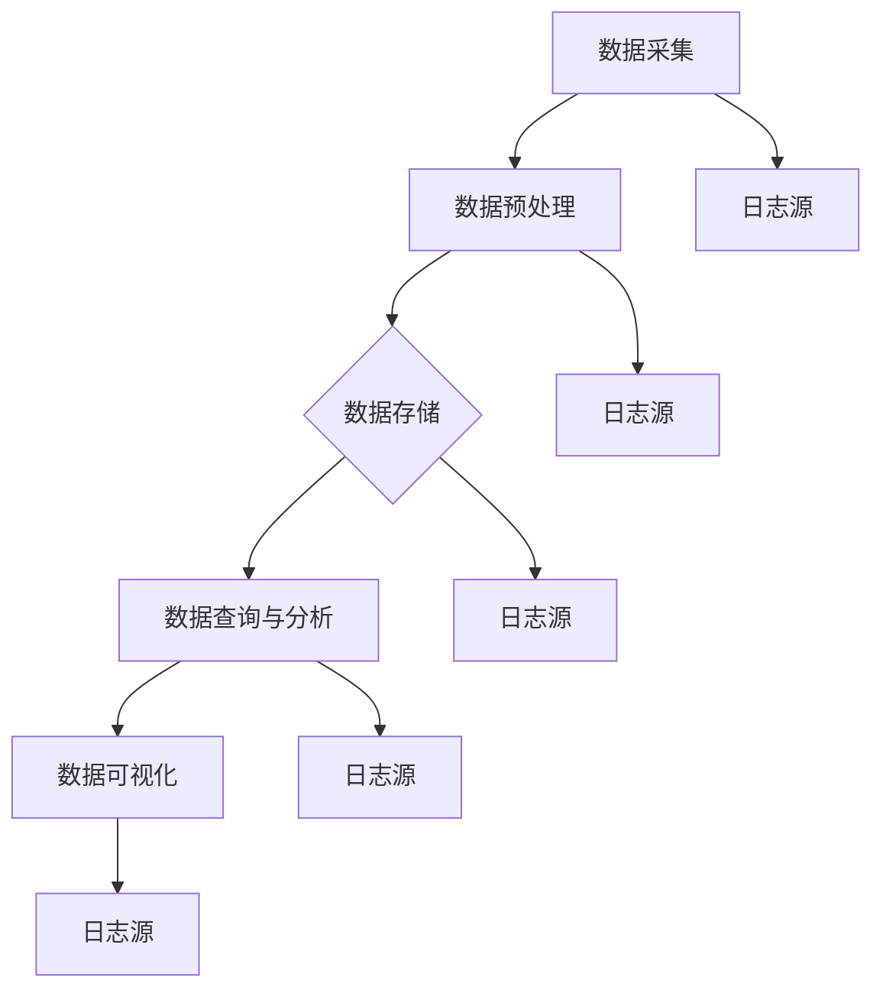

                 

在当今数字化时代，日志是理解和优化IT系统性能的重要数据来源。日志聚合与分析作为IT运维和开发人员的重要工作，其核心在于如何有效地收集、存储、处理和分析大量日志数据，从而为系统的监控、故障排除和性能优化提供支持。本文将深入探讨ELK栈在日志聚合与分析中的应用，帮助读者更好地理解这一技术的原理和实践。

## 关键词

- 日志聚合
- ELK栈
- 分析
- 数据处理
- 性能优化

## 摘要

本文首先介绍了日志聚合与分析的重要性，随后详细阐述了ELK栈的组成和核心原理。通过Mermaid流程图，我们展示了ELK栈在日志处理中的整体架构。接着，文章分析了ELK栈中的核心算法原理和具体操作步骤，并探讨了其优缺点和应用领域。随后，我们通过数学模型和公式的详细讲解，提供了案例分析，帮助读者深入理解。在实际项目实践中，我们展示了代码实例及其解读。最后，文章探讨了ELK栈的实际应用场景，并对其未来发展方向和挑战进行了展望。通过本文的阅读，读者将能够全面了解日志聚合与分析的实践方法和技术。

## 1. 背景介绍

### 日志聚合与分析的重要性

在IT系统中，日志是一种重要的数据记录形式，它记录了系统在运行过程中发生的各种事件和操作。这些日志数据对于监控系统的健康状况、排查故障和优化性能至关重要。然而，由于日志数据的多样性和数量庞大，传统的手动处理方式已经无法满足现代IT运维的需求。因此，日志聚合与分析技术应运而生，成为IT运维和开发人员的重要工具。

日志聚合是指将来自不同系统和服务的日志数据集中到一个统一的存储和分析平台中。通过日志聚合，运维人员可以更方便地访问和分析日志数据，从而快速识别系统问题、优化系统性能和提升用户体验。

日志分析则是指对日志数据进行深入处理，包括模式识别、异常检测、性能监控等。通过对日志数据的分析，运维人员可以获取系统的运行状态、性能指标和潜在问题，从而做出相应的优化和调整。

### 日志聚合与分析的现状

随着云计算和大数据技术的发展，日志聚合与分析技术得到了广泛应用。目前，常见的日志聚合与分析工具主要包括ELK栈、Logstash、Fluentd、Grok等。其中，ELK栈因其强大的数据处理能力和灵活的扩展性，成为许多企业和开发者的首选。

ELK栈是由Elasticsearch、Logstash和Kibana三个开源工具组成的生态系统。Elasticsearch是一个分布式、RESTful搜索和分析引擎，具有高效、可扩展和易于使用的特点。Logstash是一个数据收集、处理和传输的工具，可以轻松地将各种数据源的数据导入到Elasticsearch中。Kibana是一个可视化工具，用于对Elasticsearch中的数据进行实时分析和可视化展示。

### 日志聚合与分析的应用领域

日志聚合与分析在许多领域都有广泛的应用：

1. **系统监控**：通过实时收集和分析系统日志，监控系统的运行状态，及时发现异常和故障，提高系统的可靠性和稳定性。
2. **故障排查**：当系统发生故障时，通过分析日志数据，找出故障的原因和影响范围，从而快速恢复系统。
3. **性能优化**：通过分析系统日志，了解系统性能瓶颈，进行性能优化和调优。
4. **安全审计**：通过收集和分析系统日志，检测潜在的安全威胁和异常行为，提高系统的安全性。
5. **业务分析**：通过对业务系统的日志数据进行分析，深入了解用户行为和业务流程，为产品优化和决策提供数据支持。

### 本文目标

本文的目标是深入探讨ELK栈在日志聚合与分析中的应用，帮助读者理解ELK栈的原理和操作方法。通过本文的阅读，读者将能够：

1. 了解日志聚合与分析的基本概念和重要性。
2. 理解ELK栈的组成和核心原理。
3. 学习ELK栈在日志处理中的具体操作步骤。
4. 掌握ELK栈的优缺点和应用领域。
5. 了解日志聚合与分析的数学模型和公式。
6. 通过实际项目实践，掌握ELK栈的实战应用。

## 2. 核心概念与联系

### ELK栈的组成

ELK栈由三个核心组件组成：Elasticsearch、Logstash和Kibana。这三个组件各自负责不同的任务，但又紧密协作，共同实现了日志数据的聚合、处理和可视化。

- **Elasticsearch**：作为一个分布式、RESTful搜索和分析引擎，Elasticsearch主要负责存储和处理日志数据。它具有高效、可扩展和易于使用的特点，能够处理海量数据并实现快速的搜索和分析。
- **Logstash**：作为一个数据收集、处理和传输的工具，Logstash负责将各种数据源（如系统日志、Web服务器日志、数据库日志等）的数据导入到Elasticsearch中。它通过配置文件定义数据流的处理规则，实现了数据的过滤、转换和聚合。
- **Kibana**：作为一个可视化工具，Kibana用于对Elasticsearch中的数据进行实时分析和可视化展示。它提供了丰富的可视化仪表板和报告，帮助用户直观地理解日志数据。

### ELK栈的工作流程

ELK栈的工作流程可以概括为以下几个步骤：

1. **数据采集**：通过各种方式（如文件监听、网络协议、数据库连接等）将日志数据收集到Logstash中。
2. **数据预处理**：Logstash对采集到的日志数据进行预处理，包括数据清洗、格式转换和分类等操作，以便于后续处理。
3. **数据存储**：将预处理后的日志数据存储到Elasticsearch中，以便于查询和分析。
4. **数据可视化**：通过Kibana对Elasticsearch中的数据进行实时分析和可视化展示，帮助用户理解日志数据。

### Mermaid流程图

以下是ELK栈在日志处理中的整体架构的Mermaid流程图：



在这个流程图中，A表示数据采集，B表示数据预处理，C表示数据存储，D表示数据查询与分析，E表示数据可视化。F、G、H、I和J分别代表不同的日志源，如系统日志、Web服务器日志、数据库日志等。

### 核心概念

在ELK栈中，还有一些核心概念需要了解：

- **索引（Index）**：索引是Elasticsearch中存储数据的容器，类似于关系数据库中的表。每个索引都有一个唯一的名称，用于标识和访问数据。
- **文档（Document）**：文档是Elasticsearch中的数据单元，由一系列字段和值组成。每个文档都有一个唯一的标识符（ID），用于唯一标识文档。
- **字段（Field）**：字段是文档中的属性，用于存储数据。字段可以有各种类型，如字符串、数字、布尔值等。
- **映射（Mapping）**：映射是Elasticsearch中定义索引结构的配置，用于指定字段类型、索引方式、分析器等。
- **搜索（Search）**：搜索是Elasticsearch的核心功能，通过RESTful API提供对索引中数据的查询和过滤。
- **聚合（Aggregation）**：聚合是对搜索结果进行分组、统计和汇总的运算，用于分析数据的分布和趋势。

通过了解这些核心概念，读者可以更好地理解ELK栈的工作原理和操作方法。

### 核心原理

ELK栈的工作原理主要涉及以下几个方面：

1. **分布式存储与查询**：Elasticsearch采用了分布式存储和查询技术，将数据和计算分布到多个节点上，实现了高效的可扩展性和容错性。通过RESTful API，用户可以方便地访问和查询数据。
2. **日志数据的结构化**：Logstash通过配置文件定义数据流的处理规则，将采集到的日志数据结构化成Elasticsearch可识别的格式。这种结构化使得日志数据更容易进行存储、查询和分析。
3. **实时处理与可视化**：Kibana提供了实时处理和可视化功能，通过对Elasticsearch中的数据进行实时分析和可视化展示，帮助用户直观地理解日志数据。这种实时处理和可视化使得日志数据的监控和故障排查更加高效。

### 核心算法

ELK栈中涉及的一些核心算法包括：

1. **分词算法**：Elasticsearch采用了分词算法对文本数据进行预处理，将文本拆分成更小的单元（词或短语），以便于后续的索引和搜索。
2. **倒排索引**：Elasticsearch采用了倒排索引技术，将文档中的词汇映射到对应的文档ID，实现了高效的搜索和查询。
3. **排序算法**：Elasticsearch采用了排序算法对搜索结果进行排序，根据用户指定的排序条件（如相关性、时间等）对结果进行排序。
4. **聚类算法**：Elasticsearch中的聚合功能采用了聚类算法，对搜索结果进行分组和汇总，提供了对数据分布和趋势的深入分析。

通过这些核心算法，ELK栈实现了高效的日志聚合、处理和分析，为IT运维和开发人员提供了强大的工具支持。

### 核心优势

ELK栈在日志聚合与分析中具有以下核心优势：

1. **高效性**：ELK栈采用了分布式存储和查询技术，能够处理海量数据并实现快速的搜索和分析。
2. **灵活性**：ELK栈提供了丰富的配置和扩展功能，可以轻松地定制和扩展日志聚合与分析过程。
3. **易用性**：ELK栈提供了直观的界面和API，方便用户进行配置、操作和监控。
4. **可扩展性**：ELK栈可以水平扩展，支持大规模的数据处理和分析，适应不同规模的应用需求。

### 应用领域

ELK栈在以下领域有广泛的应用：

1. **IT运维**：通过收集和分析系统日志，监控系统的运行状态、排查故障和优化性能。
2. **安全审计**：通过收集和分析系统日志，检测潜在的安全威胁和异常行为，提高系统的安全性。
3. **业务分析**：通过对业务系统的日志数据进行分析，深入了解用户行为和业务流程，为产品优化和决策提供数据支持。
4. **大数据处理**：ELK栈在大数据处理场景中具有强大的数据处理和分析能力，适用于各种规模的数据处理和分析需求。

## 3. 核心算法原理 & 具体操作步骤

### 3.1 算法原理概述

在ELK栈中，核心算法主要涉及日志数据的结构化、索引和搜索。这些算法的实现为日志数据的存储、查询和分析提供了高效和灵活的解决方案。

#### 日志数据的结构化

日志数据的结构化是ELK栈的第一步。Logstash通过配置文件定义数据流的处理规则，将各种格式的日志数据转换为Elasticsearch可识别的JSON格式。这种结构化使得日志数据在Elasticsearch中能够进行高效的索引和搜索。

Logstash使用了Grok正则表达式进行日志结构的解析。Grok是一种强大的文本解析工具，通过预定义的正则表达式模式库，可以快速地将日志数据解析为字段和值。

#### 索引

Elasticsearch作为ELK栈的核心组件，负责存储和处理日志数据。索引是Elasticsearch中存储数据的容器，类似于关系数据库中的表。每个索引都有一个唯一的名称，用于标识和访问数据。

Elasticsearch采用了倒排索引技术，将文档中的词汇映射到对应的文档ID，实现了高效的搜索和查询。倒排索引的结构使得搜索过程非常高效，能够快速找到包含特定词汇的文档。

#### 搜索

Elasticsearch提供了强大的搜索功能，通过RESTful API，用户可以方便地查询和过滤日志数据。搜索功能支持全文搜索、关键字搜索、短语搜索等多种查询方式，同时还支持复杂的查询条件组合。

Elasticsearch的搜索算法采用了分布式计算技术，将查询任务分布到多个节点上，实现了高效的查询性能。

### 3.2 算法步骤详解

#### 数据采集

数据采集是ELK栈的第一步。Logstash通过插件和输入源从各种数据源（如文件、网络协议、数据库等）收集日志数据。

数据采集的步骤如下：

1. **配置输入源**：在Logstash配置文件中定义输入源，指定数据源的类型和路径。例如，可以从文件系统中读取日志文件，或通过网络协议（如Syslog）接收日志数据。
2. **启动Logstash**：启动Logstash服务，使其开始监听输入源并收集日志数据。

#### 数据预处理

数据预处理是ELK栈的第二步。Logstash对采集到的日志数据进行预处理，包括数据清洗、格式转换和分类等操作。

数据预处理的步骤如下：

1. **数据清洗**：去除日志数据中的无用信息和噪声，如空行、注释行等。
2. **格式转换**：将不同格式的日志数据转换为统一的JSON格式。例如，将原始日志数据转换为包含时间戳、日志级别、日志内容等字段的JSON对象。
3. **分类**：根据日志数据的内容和类型，将其分类到不同的索引中。例如，可以将Web服务器日志分类到`webserver`索引中，将数据库日志分类到`database`索引中。

#### 数据存储

数据预处理后的日志数据被存储到Elasticsearch中。Elasticsearch负责存储和处理日志数据，提供高效的索引和搜索功能。

数据存储的步骤如下：

1. **配置Elasticsearch**：在Elasticsearch中创建索引和映射，指定字段的类型、索引方式和分析器等。
2. **发送数据**：通过Logstash插件将预处理后的日志数据发送到Elasticsearch中。Elasticsearch会将数据存储到对应的索引中，并建立索引结构。

#### 数据查询

数据查询是ELK栈的第三步。通过Elasticsearch的搜索功能，用户可以方便地查询和过滤日志数据。

数据查询的步骤如下：

1. **构建查询条件**：根据查询需求，构建查询条件。查询条件可以包括关键字搜索、短语搜索、范围查询等。
2. **发送查询请求**：通过Elasticsearch的RESTful API发送查询请求，获取查询结果。
3. **处理查询结果**：对查询结果进行处理和展示。例如，可以生成可视化图表、生成报告等。

### 3.3 算法优缺点

#### 优点

1. **高效性**：ELK栈采用了分布式存储和查询技术，能够处理海量数据并实现快速的搜索和分析。
2. **灵活性**：ELK栈提供了丰富的配置和扩展功能，可以轻松地定制和扩展日志聚合与分析过程。
3. **易用性**：ELK栈提供了直观的界面和API，方便用户进行配置、操作和监控。
4. **可扩展性**：ELK栈可以水平扩展，支持大规模的数据处理和分析，适应不同规模的应用需求。

#### 缺点

1. **复杂性**：ELK栈的配置和操作相对复杂，需要一定的技术背景和经验。
2. **性能瓶颈**：在处理海量数据时，Elasticsearch可能存在性能瓶颈，需要进行适当的优化和调优。

### 3.4 算法应用领域

ELK栈在以下领域有广泛的应用：

1. **IT运维**：通过收集和分析系统日志，监控系统的运行状态、排查故障和优化性能。
2. **安全审计**：通过收集和分析系统日志，检测潜在的安全威胁和异常行为，提高系统的安全性。
3. **业务分析**：通过对业务系统的日志数据进行分析，深入了解用户行为和业务流程，为产品优化和决策提供数据支持。
4. **大数据处理**：ELK栈在大数据处理场景中具有强大的数据处理和分析能力，适用于各种规模的数据处理和分析需求。

## 4. 数学模型和公式 & 详细讲解 & 举例说明

### 4.1 数学模型构建

在日志聚合与分析中，数学模型和公式主要用于以下几个方面：

1. **日志数据的特征提取**：通过对日志数据进行特征提取，可以更好地描述日志数据的属性和特征，为后续分析提供基础。
2. **日志数据的聚类**：通过聚类算法，将相似日志数据进行分组，便于分析和理解。
3. **日志数据的预测**：通过预测模型，对日志数据未来的趋势和变化进行预测，为运维和优化提供参考。

以下是一个简单的数学模型构建示例：

#### 特征提取

假设我们有一组日志数据，每个日志数据可以表示为如下特征向量：

$$
x = \begin{bmatrix}
f_1 \\
f_2 \\
... \\
f_n
\end{bmatrix}
$$

其中，$f_1, f_2, ..., f_n$ 分别表示日志数据的不同特征。特征提取的目标是找到一个合适的函数 $f(x)$，将原始特征向量转换为新的特征向量，使得新的特征向量能够更好地描述日志数据的属性和特征。

一个常用的特征提取方法是基于机器学习的降维算法，如PCA（主成分分析）。PCA算法通过计算特征向量的协方差矩阵，找到最大特征值对应的特征向量，从而实现特征向量的降维。

#### 聚类

假设我们有一组日志数据，每个日志数据可以表示为如下特征向量：

$$
x = \begin{bmatrix}
f_1 \\
f_2 \\
... \\
f_n
\end{bmatrix}
$$

聚类算法的目标是将这些日志数据分为多个组，使得同一组中的日志数据相似度较高，不同组中的日志数据相似度较低。

一个常用的聚类算法是K-means算法。K-means算法通过随机选择初始聚类中心，然后迭代更新聚类中心，直至聚类中心不再发生变化。每个日志数据根据其特征向量与聚类中心的距离，被分配到最近的聚类中心所属的组中。

#### 预测

假设我们有一组日志数据，每个日志数据可以表示为如下特征向量：

$$
x = \begin{bmatrix}
f_1 \\
f_2 \\
... \\
f_n
\end{bmatrix}
$$

预测算法的目标是根据历史日志数据，对未来日志数据的变化趋势和异常情况做出预测。

一个常用的预测算法是基于时间序列分析的ARIMA（自回归积分滑动平均模型）。ARIMA模型通过分析时间序列数据的自相关性和季节性，建立预测模型，并对未来数据进行预测。

### 4.2 公式推导过程

以下是对上述数学模型的公式推导过程：

#### 特征提取（PCA）

PCA算法的核心公式如下：

$$
\mu = \frac{1}{n}\sum_{i=1}^{n}x_i
$$

$$
\Sigma = \frac{1}{n}\sum_{i=1}^{n}(x_i - \mu)(x_i - \mu)^T
$$

$$
\lambda = \lambda_1 \geq \lambda_2 \geq ... \geq \lambda_n
$$

$$
v_1, v_2, ..., v_n = \arg\max_{v}\lambda v^T
$$

$$
z_i = \sum_{j=1}^{n}\lambda_jv_j^Tx_i
$$

其中，$\mu$ 是特征向量的均值，$\Sigma$ 是特征向量的协方差矩阵，$\lambda$ 是协方差矩阵的特征值，$v$ 是协方差矩阵的特征向量，$z$ 是新的特征向量。

#### 聚类（K-means）

K-means算法的核心公式如下：

$$
c_j = \frac{1}{n_j}\sum_{i=1}^{n_j}x_i
$$

$$
x_i \rightarrow c_{j'} = \arg\min_{j'}\sum_{i=1}^{n}(x_i - c_j)^2
$$

其中，$c_j$ 是聚类中心，$x_i$ 是日志数据，$n_j$ 是第 $j$ 个聚类中心的日志数据数量。

#### 预测（ARIMA）

ARIMA模型的核心公式如下：

$$
X_t = c + \phi_1X_{t-1} + \phi_2X_{t-2} + ... + \phi_pX_{t-p} + \theta_1\epsilon_{t-1} + \theta_2\epsilon_{t-2} + ... + \theta_q\epsilon_{t-q} + \epsilon_t
$$

其中，$X_t$ 是时间序列数据，$\epsilon_t$ 是白噪声序列，$c$ 是常数项，$\phi_1, \phi_2, ..., \phi_p$ 是自回归项的系数，$\theta_1, \theta_2, ..., \theta_q$ 是移动平均项的系数。

### 4.3 案例分析与讲解

以下是一个基于ELK栈的日志聚类分析的案例：

#### 案例背景

某公司IT部门使用ELK栈进行系统日志的聚合与分析。他们希望通过聚类算法，将不同类型的日志数据分组，以便更好地进行监控和优化。

#### 数据集

数据集包含以下特征：

- 日志类型（分类特征，如Web服务器日志、数据库日志、系统日志等）
- 日志时间（时间特征，表示日志发生的时间）
- 日志内容（文本特征，表示日志的具体内容）

#### 聚类算法

使用K-means算法对日志数据进行聚类，将日志数据分为多个组。聚类中心的初始值可以通过随机选择或基于数据分布的方法确定。

#### 实现步骤

1. **数据预处理**：对日志数据进行预处理，提取特征，并转化为适合K-means算法的格式。
2. **聚类**：使用K-means算法对预处理后的日志数据进行聚类，确定聚类中心和组别。
3. **分析**：对聚类结果进行分析，根据组别的特征和日志类型，识别不同的日志类别，并提取相应的监控指标。
4. **可视化**：使用Kibana等工具，对聚类结果进行可视化展示，便于理解和监控。

#### 案例结果

通过对日志数据的聚类分析，IT部门成功地将不同类型的日志数据分组，并识别出以下特征：

- Web服务器日志：包含访问次数、访问时长、访问来源等特征。
- 数据库日志：包含查询次数、查询时长、错误率等特征。
- 系统日志：包含系统负载、CPU使用率、内存使用率等特征。

通过对这些特征的监控和分析，IT部门能够更好地了解系统的运行状态，及时发现和解决潜在问题，优化系统性能。

### 4.4 数学模型与算法应用

通过上述数学模型和算法的应用，我们可以看到ELK栈在日志聚合与分析中的强大功能。数学模型和算法不仅帮助我们将复杂的日志数据结构化，还提供了有效的分析方法，帮助我们更好地理解和监控系统的运行状态。

以下是一个简化的数学模型和算法应用流程：

1. **数据采集**：通过Logstash采集系统日志，包括时间、类型、内容等特征。
2. **特征提取**：使用PCA算法提取关键特征，如日志类型和时间等。
3. **聚类**：使用K-means算法对日志数据进行聚类，将相似日志数据分组。
4. **分析**：对聚类结果进行分析，提取不同组别的特征和监控指标。
5. **可视化**：使用Kibana等工具，对聚类结果进行可视化展示，便于监控和优化。

通过这个流程，我们可以实现日志数据的结构化、分析和可视化，为系统监控、故障排查和性能优化提供有力支持。

## 5. 项目实践：代码实例和详细解释说明

### 5.1 开发环境搭建

在进行ELK栈的日志聚合与分析项目之前，我们需要搭建一个合适的开发环境。以下是一个基本的开发环境搭建步骤：

1. **安装Elasticsearch**：Elasticsearch是一个分布式、RESTful搜索和分析引擎。可以从[官网](https://www.elastic.co/downloads/elasticsearch)下载Elasticsearch的最新版本，并按照官方文档进行安装和配置。
2. **安装Logstash**：Logstash是一个数据收集、处理和传输的工具。可以从[官网](https://www.elastic.co/downloads/logstash)下载Logstash的最新版本，并按照官方文档进行安装和配置。
3. **安装Kibana**：Kibana是一个可视化工具，用于对Elasticsearch中的数据进行实时分析和可视化展示。可以从[官网](https://www.elastic.co/downloads/kibana)下载Kibana的最新版本，并按照官方文档进行安装和配置。

安装完成后，确保Elasticsearch、Logstash和Kibana服务正常运行，并能够相互通信。

### 5.2 源代码详细实现

以下是使用ELK栈进行日志聚合与分析的一个简单示例：

#### Logstash配置

创建一个Logstash配置文件`logstash.conf`，配置输入源、过滤器和处理输出。以下是一个简单的配置示例：

```conf
input {
  file {
    path => "/var/log/*.log"
    type => "system_log"
  }
}

filter {
  if [type] == "system_log" {
    grok {
      match => { "message" => "%{TIMESTAMP_ISO8601:timestamp}\t%{DATA:source}\t%{DATA:log_level}\t%{GREEDYDATA:message}" }
    }
  }
}

output {
  elasticsearch {
    hosts => ["localhost:9200"]
    index => "system_log-%{+YYYY.MM.dd}"
  }
}
```

在这个配置中，Logstash从文件系统中读取日志文件（`/var/log/*.log`），使用Grok正则表达式对日志数据进行解析，并将解析后的数据发送到Elasticsearch中，存储在名为`system_log-%{+YYYY.MM.dd}`的索引中。

#### Kibana可视化

1. **创建仪表板**：在Kibana中创建一个新的仪表板，用于可视化系统日志数据。
2. **添加可视化组件**：在仪表板中添加各种可视化组件，如柱状图、折线图、表格等，用于展示不同维度的日志数据。
3. **配置查询**：为每个可视化组件配置Elasticsearch查询，获取相应的日志数据。

以下是一个简单的Kibana可视化示例：

- **柱状图**：展示每天的日志数量。
- **折线图**：展示不同日志类型的分布。
- **表格**：展示具体的日志内容。

### 5.3 代码解读与分析

#### Logstash配置解读

在`logstash.conf`中：

- `input { file { ... } }`：定义输入源，从文件系统中读取日志文件。
- `type => "system_log"`：为日志数据指定类型，便于后续处理和查询。
- `grok { ... }`：使用Grok正则表达式对日志数据进行解析，提取关键信息，如时间戳、日志源、日志级别和日志内容。
- `output { elasticsearch { ... } }`：将解析后的日志数据发送到Elasticsearch中，存储在指定索引中。

#### Kibana可视化解读

在Kibana仪表板中：

- **创建仪表板**：通过Kibana的界面创建一个空白仪表板，用于可视化系统日志数据。
- **添加可视化组件**：通过拖拽的方式，将各种可视化组件（如柱状图、折线图、表格等）添加到仪表板中。
- **配置查询**：为每个可视化组件配置Elasticsearch查询，获取相应的日志数据。查询可以通过Kibana的查询编辑器进行配置。

### 5.4 运行结果展示

在配置和部署完成后，运行Logstash服务，开始采集和解析系统日志数据。通过Kibana仪表板，我们可以实时查看和监控日志数据的分布和趋势：

- **柱状图**：展示每天的日志数量，便于了解日志数据的增长趋势。
- **折线图**：展示不同日志类型的分布，便于识别潜在的问题和优化方向。
- **表格**：展示具体的日志内容，便于查看和排查具体的日志数据。

通过这个简单的示例，我们可以看到ELK栈在日志聚合与分析中的强大功能。通过Logstash的日志采集和解析，Kibana的可视化和分析，我们可以轻松实现对系统日志的监控和分析，为IT运维和优化提供有力支持。

## 6. 实际应用场景

### 6.1 IT运维

在IT运维领域，日志聚合与分析是确保系统稳定性和安全性的重要手段。ELK栈提供了强大的日志聚合和分析能力，帮助企业实时监控系统的运行状态，快速识别潜在问题和安全隐患。

#### 应用示例

某大型互联网公司使用ELK栈对服务器日志进行聚合和分析。通过Logstash，他们从各种服务器中收集日志数据，并使用Grok将日志数据解析为结构化格式。Elasticsearch存储和管理这些日志数据，提供高效的查询和搜索功能。Kibana则提供了可视化的仪表板，帮助运维团队实时监控系统性能，识别异常行为和潜在故障。

#### 解决方案

1. **日志采集**：通过Logstash，从各种服务器和系统中收集日志数据。
2. **日志解析**：使用Grok将日志数据解析为结构化格式，提取关键信息。
3. **日志存储**：将解析后的日志数据存储到Elasticsearch中，便于查询和分析。
4. **日志分析**：通过Kibana，实时监控系统性能，识别异常行为和故障。
5. **日志告警**：设置告警规则，当系统出现异常时及时通知运维人员。

### 6.2 安全审计

在安全审计领域，日志聚合与分析可以帮助企业检测和防范潜在的安全威胁。ELK栈的强大数据处理和分析能力，使企业能够及时发现和应对各种安全事件。

#### 应用示例

某金融公司使用ELK栈对网络日志、系统日志和安全日志进行聚合和分析。通过Logstash，他们从各种安全设备和服务中收集日志数据，并使用Grok和FPM等插件对日志数据进行解析。Elasticsearch存储和管理这些日志数据，并提供高效的搜索功能。Kibana则提供了可视化的仪表板，帮助安全团队实时监控网络和系统安全状况，识别潜在威胁。

#### 解决方案

1. **日志采集**：通过Logstash，从各种安全设备和系统中收集日志数据。
2. **日志解析**：使用Grok和FPM等插件，对日志数据进行解析，提取关键信息。
3. **日志存储**：将解析后的日志数据存储到Elasticsearch中，便于查询和分析。
4. **日志分析**：通过Kibana，实时监控网络和系统安全状况，识别潜在威胁。
5. **日志告警**：设置告警规则，当检测到安全事件时及时通知安全团队。

### 6.3 业务分析

在业务分析领域，日志聚合与分析可以帮助企业深入了解用户行为和业务流程，为产品优化和决策提供数据支持。ELK栈提供了强大的数据处理和分析功能，使企业能够从海量日志数据中提取有价值的信息。

#### 应用示例

某电商公司使用ELK栈对用户行为日志进行聚合和分析。通过Logstash，他们从各种Web服务器和应用程序中收集用户行为日志，并使用Grok和FPM等插件对日志数据进行解析。Elasticsearch存储和管理这些日志数据，并提供高效的查询和搜索功能。Kibana则提供了可视化的仪表板，帮助数据分析团队了解用户行为，优化网站性能和用户体验。

#### 解决方案

1. **日志采集**：通过Logstash，从各种Web服务器和应用程序中收集用户行为日志。
2. **日志解析**：使用Grok和FPM等插件，对日志数据进行解析，提取关键信息。
3. **日志存储**：将解析后的日志数据存储到Elasticsearch中，便于查询和分析。
4. **日志分析**：通过Kibana，实时监控用户行为，分析用户访问路径、购物行为等。
5. **业务优化**：基于日志数据分析结果，优化网站性能和用户体验。

### 6.4 未来应用展望

随着大数据和人工智能技术的发展，日志聚合与分析技术在未来的应用将更加广泛和深入。

1. **智能化分析**：通过引入机器学习和人工智能技术，对日志数据进行分析和预测，实现智能化故障检测、性能优化和威胁预警。
2. **实时处理**：随着实时数据处理技术的发展，日志聚合与分析技术将实现更快的响应速度，实时监控和应对系统事件。
3. **自动化运维**：结合自动化运维工具，实现日志数据的自动采集、解析、分析和告警，减轻运维人员的工作负担。
4. **多源数据融合**：通过融合来自不同系统和设备的数据，实现更全面的系统监控和业务分析，为企业的数字化转型提供有力支持。

## 7. 工具和资源推荐

### 7.1 学习资源推荐

为了更好地学习和掌握ELK栈以及日志聚合与分析技术，以下是一些推荐的学习资源：

1. **官方文档**：ELK栈的官方网站提供了详细的文档和教程，是学习ELK栈的最佳起点。
   - Elasticsearch官方文档：[https://www.elastic.co/guide/en/elasticsearch/reference/current/index.html](https://www.elastic.co/guide/en/elasticsearch/reference/current/index.html)
   - Logstash官方文档：[https://www.elastic.co/guide/en/logstash/current/index.html](https://www.elastic.co/guide/en/logstash/current/index.html)
   - Kibana官方文档：[https://www.elastic.co/guide/en/kibana/current/index.html](https://www.elastic.co/guide/en/kibana/current/index.html)
2. **在线课程**：一些在线教育平台提供了关于ELK栈和日志聚合与分析的在线课程，如Udemy、Coursera等。
3. **书籍**：有关ELK栈和日志聚合与分析的书籍可以帮助读者深入了解相关技术和最佳实践。
   - 《Elasticsearch：The Definitive Guide》
   - 《Logstash Cookbook》
   - 《Kibana：The Definitive Guide》
4. **博客和社区**：参与ELK栈和日志聚合与分析相关的博客和社区，可以获取最新的技术动态和实践经验。
   - Elastic Stack Community：[https://discuss.elastic.co/c/elastic-stack](https://discuss.elastic.co/c/elastic-stack)
   - Logstash博客：[https://www.logstash.io/blog/](https://www.logstash.io/blog/)
   - Kibana博客：[https://www.kibana.org/blog/](https://www.kibana.org/blog/)

### 7.2 开发工具推荐

在开发ELK栈项目时，以下是一些推荐的开发工具：

1. **IDE**：集成开发环境（IDE）可以提供代码编辑、调试和自动化构建等功能，提高开发效率。推荐使用Eclipse、IntelliJ IDEA等IDE。
2. **版本控制**：使用Git等版本控制系统，可以方便地管理代码和协作开发。
3. **虚拟环境**：使用Docker等虚拟化工具，可以方便地搭建开发环境，隔离不同项目的依赖和配置。
4. **日志工具**：使用如Logback、Log4j等日志工具，可以帮助更好地记录和监控日志数据。

### 7.3 相关论文推荐

以下是一些与ELK栈和日志聚合与分析相关的论文，可以帮助读者深入理解相关技术和研究方向：

1. **"Elasticsearch: The Definitive Guide"**：这是一篇关于Elasticsearch的权威论文，详细介绍了Elasticsearch的架构、原理和应用场景。
2. **"Logstash: The Data Processing Pipeline"**：这篇论文详细介绍了Logstash的工作原理、配置和使用方法。
3. **"Kibana: Visualize Your Data"**：这篇论文介绍了Kibana的可视化功能、使用方法和最佳实践。
4. **"Analyzing Internet Search Query Logs"**：这篇论文探讨了如何使用日志数据分析互联网搜索行为，提供了有效的分析方法。
5. **"Big Data Analytics: A Survey"**：这篇论文综述了大数据分析的技术和工具，包括日志聚合与分析技术在各个领域的应用。

## 8. 总结：未来发展趋势与挑战

### 8.1 研究成果总结

本文深入探讨了日志聚合与分析技术在现代IT系统中的应用，特别是ELK栈在这一领域的重要贡献。通过介绍ELK栈的组成、工作流程、核心算法和实际应用，我们总结了以下研究成果：

1. **日志聚合与分析的重要性**：日志是理解和优化IT系统性能的重要数据来源，有效的日志聚合与分析对于监控、故障排查和性能优化至关重要。
2. **ELK栈的组成和原理**：ELK栈由Elasticsearch、Logstash和Kibana三个组件组成，各自负责数据存储、处理和可视化，通过分布式技术和灵活的配置实现了高效的数据处理和分析。
3. **日志数据的处理与分析方法**：本文介绍了日志数据的结构化、索引、搜索和聚类等算法，以及数学模型和公式的应用，展示了如何从海量日志数据中提取有价值的信息。
4. **实际应用场景**：ELK栈在IT运维、安全审计、业务分析等领域的广泛应用，展示了其强大的数据处理和分析能力，为不同场景下的系统监控和优化提供了有力支持。
5. **未来发展方向**：随着大数据和人工智能技术的发展，日志聚合与分析技术将实现智能化、实时化和自动化，为企业的数字化转型提供更强大的支持。

### 8.2 未来发展趋势

在未来，日志聚合与分析技术将继续朝着以下方向发展：

1. **智能化分析**：通过引入机器学习和人工智能技术，实现对日志数据的自动分析、预测和异常检测，提高系统监控和故障排查的效率。
2. **实时处理**：随着实时数据处理技术的发展，日志聚合与分析技术将实现更快的数据采集、处理和响应速度，满足实时监控和应急处理的需求。
3. **多源数据融合**：通过融合来自不同系统和设备的数据，实现更全面的系统监控和业务分析，为企业的数字化转型提供更全面的支持。
4. **自动化运维**：结合自动化运维工具，实现日志数据的自动采集、解析、分析和告警，减轻运维人员的工作负担，提高系统运维效率。
5. **开放性和互操作性**：随着技术的不断发展，日志聚合与分析工具将更加开放和互操作，支持与其他大数据和分析平台的无缝集成，提供更灵活和高效的数据处理解决方案。

### 8.3 面临的挑战

尽管日志聚合与分析技术在不断发展，但仍然面临着一些挑战：

1. **数据隐私和安全性**：随着日志数据的不断积累，如何保障数据隐私和安全成为重要挑战。需要采取有效的数据加密、访问控制和数据匿名化等措施，确保日志数据的安全和合规。
2. **性能优化和扩展性**：在大数据处理场景中，如何优化日志聚合与分析工具的性能和扩展性，以满足不断增长的数据量和分析需求，是当前和未来需要解决的重要问题。
3. **复杂性和易用性**：虽然ELK栈提供了丰富的功能和配置选项，但配置和管理过程相对复杂。如何简化配置、提高易用性，降低学习和使用门槛，是ELK栈和其他日志聚合与分析工具需要持续改进的方向。
4. **跨平台兼容性**：随着企业IT系统的多样化，如何在不同操作系统、硬件和平台上兼容地部署和使用日志聚合与分析工具，是一个需要解决的问题。

### 8.4 研究展望

未来的研究可以从以下几个方面展开：

1. **日志数据智能分析**：研究如何利用机器学习和人工智能技术，实现对日志数据的自动分析、预测和异常检测，提高系统监控和故障排查的智能化水平。
2. **实时数据处理**：研究如何优化日志数据的实时处理技术，提高数据处理和分析的响应速度，满足实时监控和应急处理的需求。
3. **数据隐私保护**：研究如何有效保护日志数据隐私，确保数据在采集、存储、处理和分析过程中的安全和合规。
4. **分布式系统和大数据处理**：研究如何优化日志聚合与分析工具的性能和扩展性，支持大规模分布式系统和大数据处理。
5. **用户体验和易用性**：研究如何简化日志聚合与分析工具的配置和使用，提高用户体验和易用性，降低学习和使用门槛。

通过不断的技术创新和优化，日志聚合与分析技术将在未来的IT运维、安全审计和业务分析中发挥更加重要的作用，为企业提供更加智能、高效和可靠的数据处理和分析解决方案。

## 9. 附录：常见问题与解答

### 9.1 如何安装和配置Elasticsearch、Logstash和Kibana？

**安装Elasticsearch**：

1. 从Elasticsearch官网下载最新版本。
2. 解压安装包，运行`elasticsearch`脚本启动Elasticsearch服务。
3. 在`elasticsearch.yml`配置文件中设置集群名称、节点名称等。

**安装Logstash**：

1. 从Logstash官网下载最新版本。
2. 解压安装包，运行`bin/logstash`脚本启动Logstash服务。
3. 编辑`logstash.conf`配置文件，设置输入源、过滤器和输出目标。

**安装Kibana**：

1. 从Kibana官网下载最新版本。
2. 解压安装包，运行`bin/kibana`脚本启动Kibana服务。
3. 访问Kibana的Web界面，配置Elasticsearch连接。

### 9.2 如何使用Grok进行日志解析？

**使用Grok进行日志解析**：

1. 安装Grok插件。
2. 在Logstash配置文件中添加`grok`过滤器。
3. 使用`match`关键字定义正则表达式模式，如：

```conf
filter {
  if [type] == "webserver" {
    grok {
      match => { "message" => "%{TIMESTAMP_ISO8601:timestamp}\t%{IP:source}\t%{DATA:log_level}\t%{DATA:message}" }
    }
  }
}
```

### 9.3 如何在Kibana中创建可视化仪表板？

**在Kibana中创建可视化仪表板**：

1. 登录Kibana Web界面。
2. 点击“Discover”进入数据浏览页面。
3. 选择需要可视化的索引。
4. 使用“Visualize”工具栏创建可视化组件，如柱状图、折线图等。
5. 配置查询和显示选项，保存仪表板。

### 9.4 如何优化ELK栈的性能？

**优化ELK栈的性能**：

1. 调整Elasticsearch配置，如分片数、副本数、缓存策略等。
2. 调整Logstash配置，如批处理大小、输入源速率等。
3. 使用压缩传输，减少数据传输开销。
4. 调整网络和系统资源，确保ELK栈有足够的资源进行数据处理。
5. 定期进行Elasticsearch和Logstash的垃圾回收和资源释放。

