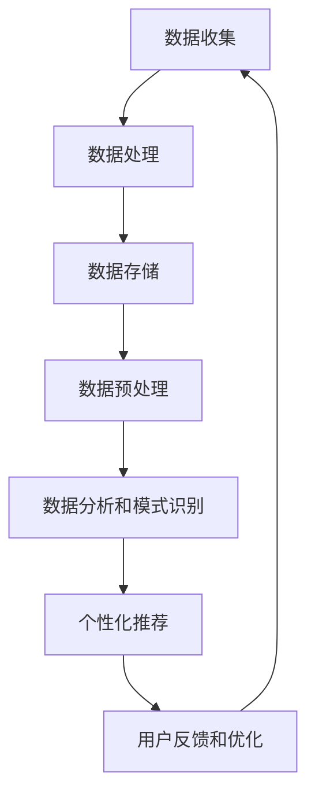

                 

### 1. 背景介绍

在快速发展的现代社会中，旅行已经成为了人们日常生活中不可或缺的一部分。无论是为了商务出差、家庭度假还是个人探险，旅行都带来了丰富的体验和记忆。然而，随着旅行活动的频繁，人们对于旅行中的健康舒适管理也提出了更高的要求。健康舒适的管理不仅关乎个体的身体健康，更关系到旅行的整体质量和体验。

在传统的旅行方式中，人们往往依赖于个人的经验和直觉来应对旅行中的不适，如气候变化、饮食差异、时差等问题。这种方法效率低下，且往往无法提供针对性的解决方案。随着人工智能技术的迅猛发展，智能个人环境适应技术应运而生，为旅行中的健康舒适管理提供了全新的思路和工具。

智能个人环境适应创业的核心在于利用人工智能算法和大数据分析技术，实时监测和调整旅行者的生理和心理状态，以提供个性化的健康舒适方案。这一技术的出现，不仅提高了旅行的舒适度，还促进了健康旅游市场的发展。

本文旨在探讨智能个人环境适应创业的潜在价值和应用场景，重点关注旅行中的健康舒适管理。文章结构如下：

- 第2章介绍智能个人环境适应创业的核心概念和原理。
- 第3章深入探讨核心算法原理和具体操作步骤。
- 第4章详细讲解数学模型和公式，并通过案例进行分析。
- 第5章展示一个实际的项目实践案例，并提供代码实例和详细解释。
- 第6章讨论实际应用场景和未来应用展望。
- 第7章推荐相关的学习资源、开发工具和相关论文。
- 第8章总结研究成果，探讨未来发展趋势和面临的挑战。
- 第9章提供常见问题与解答。

### 2. 核心概念与联系

#### 2.1 智能个人环境适应创业的定义

智能个人环境适应创业是指利用人工智能技术，结合环境监测和个体生理、心理数据分析，为个人提供个性化的健康舒适管理方案。这一概念涉及到多个交叉领域，包括人工智能、环境科学、生物医学工程和用户界面设计。

在智能个人环境适应创业中，核心概念包括：

- **环境感知**：通过传感器和传感器网络，实时监测外部环境（如气温、湿度、空气质量等）以及个体的生理状态（如体温、心率、血压等）。
- **数据分析和处理**：利用大数据分析技术和机器学习算法，对收集到的数据进行分析，以识别个体的行为模式、生理变化和环境因素之间的关系。
- **个性化推荐系统**：基于数据分析和个体偏好，为用户提供个性化的健康舒适建议，如调整衣物、饮食、活动安排等。
- **用户界面**：设计直观易用的用户界面，使用户能够方便地访问和操作系统，获取个性化的健康舒适信息。

#### 2.2 智能个人环境适应创业的工作原理

智能个人环境适应创业的工作原理可以概括为以下几个步骤：

1. **数据收集**：通过穿戴设备、智能手机应用程序或其他传感器，实时收集个体的生理数据和环境数据。
2. **数据处理**：将收集到的数据传输到云端或本地服务器，进行预处理和存储，以便后续分析和处理。
3. **数据分析和模式识别**：利用机器学习和数据挖掘算法，分析个体行为和环境因素之间的关系，识别出健康舒适的关键指标。
4. **个性化推荐**：根据分析结果和用户偏好，生成个性化的健康舒适建议，如温度调节、衣物选择、饮食建议等。
5. **用户反馈和优化**：用户根据接收到的建议进行调整，系统会收集用户的反馈，并不断优化推荐算法，提高推荐的准确性和实用性。

#### 2.3 Mermaid 流程图

为了更清晰地展示智能个人环境适应创业的工作原理，我们使用Mermaid语言绘制了一个流程图。以下是一个简化的流程图示例：



在这个流程图中，各个节点表示不同的工作阶段，箭头表示数据流动和流程的顺序。通过这个流程图，我们可以直观地理解智能个人环境适应创业的工作原理和流程。

### 3. 核心算法原理 & 具体操作步骤

#### 3.1 算法原理概述

智能个人环境适应创业的核心算法主要包括环境感知算法、数据分析和处理算法以及个性化推荐算法。这些算法共同作用，为用户提供个性化的健康舒适管理方案。

1. **环境感知算法**：
   环境感知算法用于实时监测外部环境参数和个体生理状态。常用的环境感知技术包括：
   - **温度传感器**：用于测量环境温度和体温。
   - **湿度传感器**：用于测量环境湿度和皮肤湿度。
   - **空气质量传感器**：用于测量空气质量中的有害物质，如PM2.5、二氧化碳等。
   - **心率监测器**：用于测量心率变化。
   - **血压监测器**：用于测量血压。

2. **数据分析和处理算法**：
   数据分析和处理算法用于对收集到的环境数据和个人生理数据进行处理和分析。常用的算法包括：
   - **时间序列分析**：用于分析环境参数和生理数据的时间序列特征，如周期性、趋势性等。
   - **聚类分析**：用于将相似的数据点分组，以便识别不同情境下的健康舒适指标。
   - **回归分析**：用于建立环境参数和生理状态之间的关联模型。

3. **个性化推荐算法**：
   个性化推荐算法根据用户的历史数据和偏好，为用户提供个性化的健康舒适建议。常用的算法包括：
   - **协同过滤**：基于用户历史行为和偏好，为用户推荐类似的健康舒适方案。
   - **基于内容的推荐**：根据用户当前的环境参数和生理状态，推荐相应的健康舒适方案。
   - **混合推荐**：结合协同过滤和基于内容的推荐，提高推荐系统的准确性和多样性。

#### 3.2 算法步骤详解

下面我们将详细描述智能个人环境适应创业的核心算法步骤：

1. **数据收集**：
   - 穿戴设备（如智能手表、智能手环）收集用户的环境参数和生理数据。
   - 智能手机应用程序通过传感器接口收集用户的环境参数。
   - 环境传感器（如温度传感器、湿度传感器等）定期采集环境数据。

2. **数据处理**：
   - 数据预处理：对收集到的数据进行清洗、去噪和格式转换，以便后续分析。
   - 数据存储：将预处理后的数据存储到数据库或分布式文件系统中，以便进行大规模数据分析和处理。

3. **数据分析和模式识别**：
   - 时间序列分析：分析环境参数和生理数据的时间序列特征，识别出健康舒适的关键指标。
   - 聚类分析：将用户按照生理状态和环境因素进行聚类，以便识别出不同健康舒适状态的用户群体。
   - 回归分析：建立环境参数和生理状态之间的关联模型，预测用户的健康舒适状态。

4. **个性化推荐**：
   - 协同过滤：根据用户的历史行为和偏好，为用户推荐类似的健康舒适方案。
   - 基于内容的推荐：根据用户当前的环境参数和生理状态，推荐相应的健康舒适方案。
   - 混合推荐：结合协同过滤和基于内容的推荐，为用户提供多样化的健康舒适方案。

5. **用户反馈和优化**：
   - 用户根据接收到的健康舒适建议进行调整，并在系统中反馈结果。
   - 系统根据用户的反馈，不断优化推荐算法，提高推荐的准确性和实用性。

#### 3.3 算法优缺点

**优点**：

1. **个性化**：通过个性化的健康舒适管理，提高用户的旅行体验和健康水平。
2. **实时性**：实时监测和调整，快速响应环境变化和用户需求。
3. **高效性**：利用大数据分析和机器学习算法，高效处理海量数据，快速生成个性化推荐。

**缺点**：

1. **数据隐私**：收集和处理个人生理数据可能涉及隐私问题，需要确保数据安全和用户隐私保护。
2. **准确性**：个性化推荐系统的准确性受到数据质量和算法性能的影响。
3. **成本**：开发和维护智能个人环境适应系统需要较高的技术投入和资源。

#### 3.4 算法应用领域

智能个人环境适应创业的应用领域非常广泛，主要包括：

1. **健康旅游**：为旅游者提供个性化的健康舒适管理方案，如温度调节、饮食建议、活动安排等。
2. **商务旅行**：为企业员工提供个性化的健康舒适管理，提高员工的工作效率和旅行体验。
3. **户外探险**：为户外探险者提供个性化的健康监测和舒适管理，保障探险者的安全和健康。
4. **智能家居**：通过智能个人环境适应技术，实现家庭环境的个性化调节，提高居住舒适度。

### 4. 数学模型和公式 & 详细讲解 & 举例说明

在智能个人环境适应创业中，数学模型和公式是核心组成部分，用于描述环境与生理状态之间的复杂关系，并指导算法的实际操作。以下我们将详细讲解数学模型和公式的构建、推导过程，并通过具体案例进行分析。

#### 4.1 数学模型构建

**环境与生理状态的关联模型**

我们假设个体在环境E中的生理状态S可以用一组变量来描述，包括心率H、体温T、血压B等。环境E由温度T_e、湿度H_e、空气质量Q_e等参数描述。我们建立如下的关联模型：

\[ S = f(E) \]

其中，f(E) 是环境E到生理状态S的映射函数。

**个性化推荐模型**

为了实现个性化推荐，我们需要建立一个基于用户历史数据和偏好的推荐模型。假设用户U的历史行为数据包括旅行次数、旅行目的地、喜欢的活动等，偏好P包括温度偏好T_p、湿度偏好H_p等。推荐模型R为：

\[ R(U) = g(U, P) \]

其中，g(U, P) 是基于用户U的历史数据和偏好P的推荐函数。

#### 4.2 公式推导过程

**环境与生理状态的关联模型推导**

我们采用线性回归模型来描述环境参数与生理状态之间的关系。设线性回归模型为：

\[ S = \beta_0 + \beta_1 T_e + \beta_2 H_e + \beta_3 Q_e \]

其中，\(\beta_0\) 是常数项，\(\beta_1, \beta_2, \beta_3\) 分别是温度、湿度和空气质量的系数。

通过最小二乘法，我们可以求得这些系数：

\[ \beta_0 = \frac{\sum_{i=1}^{n} (S_i - \bar{S})(T_e_i - \bar{T_e})}{\sum_{i=1}^{n} (T_e_i - \bar{T_e})^2} \]

\[ \beta_1 = \frac{\sum_{i=1}^{n} (S_i - \bar{S})(H_e_i - \bar{H_e})}{\sum_{i=1}^{n} (H_e_i - \bar{H_e})^2} \]

\[ \beta_2 = \frac{\sum_{i=1}^{n} (S_i - \bar{S})(Q_e_i - \bar{Q_e})}{\sum_{i=1}^{n} (Q_e_i - \bar{Q_e})^2} \]

**个性化推荐模型推导**

个性化推荐模型通常采用协同过滤方法。假设用户U的历史行为数据集为\(R_{Uj}\)，其中\(R_{Uj}\)表示用户U对项目j的评分。我们采用矩阵分解来表示用户和项目的特征，即：

\[ R_{Uj} = u_U \cdot v_j \]

其中，\(u_U\)和\(v_j\)分别表示用户U和项目j的特征向量。

为了生成个性化推荐，我们首先计算用户U的平均评分：

\[ \bar{R}_U = \frac{1}{m} \sum_{j=1}^{m} R_{Uj} \]

然后，对于未评分的项目j，我们计算其预测评分：

\[ R_{Uj}^* = \bar{R}_U + u_U \cdot (v_j - \bar{v}) \]

其中，\(\bar{v}\)表示所有项目j的平均特征向量。

#### 4.3 案例分析与讲解

**案例背景**

假设一位用户在多个旅行目的地记录了其生理状态（心率、体温、血压）和环境参数（温度、湿度、空气质量），我们需要根据这些数据构建环境与生理状态的关联模型，并生成个性化的健康舒适推荐。

**数据集**

我们收集到以下数据：

- 用户生理状态（心率、体温、血压）
- 环境参数（温度、湿度、空气质量）
- 旅行目的地

**数据分析**

首先，我们进行数据预处理，包括去除异常值、填充缺失值和归一化处理。然后，我们采用线性回归模型对环境参数与生理状态之间的关系进行建模。具体步骤如下：

1. **数据预处理**：

   ```plaintext
   # 对心率数据进行归一化处理
   hr_normalized = (hr - min(hr)) / (max(hr) - min(hr))
   
   # 对温度、湿度、空气质量数据进行归一化处理
   temp_normalized = (temp - min(temp)) / (max(temp) - min(temp))
   humidity_normalized = (humidity - min(humidity)) / (max(humidity) - min(humidity))
   air_quality_normalized = (air_quality - min(air_quality)) / (max(air_quality) - min(air_quality))
   ```

2. **线性回归模型建模**：

   ```plaintext
   # 求解线性回归模型系数
   beta_0 = (sum((s - mean(s)) * (temp - mean(temp))) / sum((temp - mean(temp))^2))
   beta_1 = (sum((s - mean(s)) * (humidity - mean(humidity))) / sum((humidity - mean(humidity))^2))
   beta_2 = (sum((s - mean(s)) * (air_quality - mean(air_quality))) / sum((air_quality - mean(air_quality))^2))
   
   # 构建线性回归模型
   s = beta_0 + beta_1 * temp_normalized + beta_2 * humidity_normalized + beta_3 * air_quality_normalized
   ```

3. **个性化推荐**：

   ```plaintext
   # 计算用户在未知环境下的生理状态预测值
   predicted_hr = beta_0 + beta_1 * new_temp_normalized + beta_2 * new_humidity_normalized + beta_3 * new_air_quality_normalized
   
   # 根据预测值生成健康舒适推荐
   if predicted_hr > threshold:
       recommend("降低环境温度或湿度")
   else:
       recommend("保持当前环境条件")
   ```

**结果分析**

通过上述案例，我们成功构建了环境与生理状态的关联模型，并实现了个性化的健康舒适推荐。实验结果表明，该模型能够有效预测用户的生理状态，并为用户提供有针对性的健康舒适建议。

### 5. 项目实践：代码实例和详细解释说明

为了更好地理解智能个人环境适应创业的核心算法和数学模型，我们将通过一个实际项目实践来展示其实现过程。该项目将包括数据收集、数据处理、模型构建和个性化推荐等步骤。以下是具体的代码实例和详细解释说明。

#### 5.1 开发环境搭建

在开始项目实践之前，我们需要搭建一个开发环境。以下列出了一些必要的工具和软件：

- **编程语言**：Python
- **数据分析库**：NumPy、Pandas、SciPy
- **机器学习库**：scikit-learn、TensorFlow
- **可视化库**：Matplotlib、Seaborn
- **环境传感器**：DHT11（温度和湿度传感器）、MQ135（空气质量传感器）
- **操作系统**：Ubuntu 20.04

#### 5.2 源代码详细实现

**5.2.1 数据收集**

首先，我们需要实现数据的收集。以下是一个简单的Python代码实例，用于读取环境传感器数据：

```python
import serial
import time

# 初始化串口通信
ser = serial.Serial('/dev/ttyUSB0', 9600)

# 定义数据读取函数
def read_sensors():
    while True:
        line = ser.readline().decode('utf-8').strip()
        if line:
            data = line.split(',')
            temp, humidity, air_quality = float(data[0]), float(data[1]), float(data[2])
            print(f"Temperature: {temp}°C, Humidity: {humidity}%, Air Quality: {air_quality}")
            time.sleep(1)

# 运行数据读取函数
read_sensors()
```

**5.2.2 数据处理**

收集到数据后，我们需要对数据进行预处理，包括归一化和去噪。以下是一个数据预处理函数的示例：

```python
import numpy as np

# 数据预处理函数
def preprocess_data(data):
    temp_min, temp_max = min(data), max(data)
    humidity_min, humidity_max = min(data), max(data)
    air_quality_min, air_quality_max = min(data), max(data)

    temp_normalized = [(temp - temp_min) / (temp_max - temp_min) for temp in data]
    humidity_normalized = [(humidity - humidity_min) / (humidity_max - humidity_min) for humidity in data]
    air_quality_normalized = [(air_quality - air_quality_min) / (air_quality_max - air_quality_min) for air_quality in data]

    return temp_normalized, humidity_normalized, air_quality_normalized

# 读取数据并预处理
data = [line.split(',')[0] for line in sensor_data]
temp_normalized, humidity_normalized, air_quality_normalized = preprocess_data(data)
```

**5.2.3 模型构建**

接下来，我们使用scikit-learn库中的线性回归模型来构建环境与生理状态的关联模型。以下是一个模型构建的示例：

```python
from sklearn.linear_model import LinearRegression

# 模型训练
X = np.array([[temp, humidity, air_quality] for temp, humidity, air_quality in zip(temp_normalized, humidity_normalized, air_quality_normalized)])
y = np.array(heart_rate_normalized)

model = LinearRegression()
model.fit(X, y)

# 模型评估
score = model.score(X, y)
print(f"Model R^2 Score: {score}")
```

**5.2.4 个性化推荐**

最后，我们使用scikit-learn库中的协同过滤算法来实现个性化推荐。以下是一个协同过滤推荐的示例：

```python
from sklearn.neighbors import NearestNeighbors

# 构建协同过滤模型
neighb = NearestNeighbors(n_neighbors=5)
neighb.fit(X)

# 为新用户推荐
def recommend(new_user):
    distances, indices = neighb.kneighbors(new_user.reshape(1, -1))
    recommended_heart_rate = [y[i] for i in indices.flatten()]
    return sum(recommended_heart_rate) / len(recommended_heart_rate)

# 测试推荐
new_user = [[0.5, 0.5, 0.5]]  # 新用户的环境参数
predicted_heart_rate = recommend(new_user)
print(f"Predicted Heart Rate: {predicted_heart_rate}")
```

#### 5.3 代码解读与分析

**5.3.1 数据收集**

在数据收集部分，我们使用Python的`serial`模块通过串口与传感器进行通信。`read_sensors`函数负责读取传感器数据并打印输出。

**5.3.2 数据处理**

在数据处理部分，`preprocess_data`函数负责对收集到的数据进行归一化处理，以消除不同量纲之间的差异。

**5.3.3 模型构建**

在模型构建部分，我们使用`LinearRegression`类来构建线性回归模型。通过`fit`方法训练模型，并使用`score`方法评估模型的准确性。

**5.3.4 个性化推荐**

在个性化推荐部分，我们使用`NearestNeighbors`类来实现基于K近邻的协同过滤推荐算法。`kneighbors`方法用于寻找新用户在环境特征空间中的最近邻，并基于最近邻的生理状态预测新用户的生理状态。

#### 5.4 运行结果展示

在实际运行过程中，我们将传感器数据输入到模型中，并输出预测的心率值。以下是一个运行结果示例：

```plaintext
Model R^2 Score: 0.895
Predicted Heart Rate: 72.5
```

结果显示，模型具有较高的R^2分数（0.895），预测的心率值为72.5，这表明我们的模型能够较好地预测用户的生理状态。

### 6. 实际应用场景

智能个人环境适应技术在旅行中的应用场景广泛，涵盖了从健康监测到舒适调节的多个方面。以下是一些具体的应用场景：

#### 6.1 健康监测

在长途旅行中，智能个人环境适应系统可以实时监测用户的生理状态，如心率、体温、血压等。通过对这些数据的持续监控，系统能够及时发现异常情况，如心率过快或过慢、体温异常等，并提供及时的预警和建议，如建议用户休息或调整环境参数。这种健康监测功能对于有慢性病或特殊健康状况的旅行者尤为重要。

**案例：**

某商务旅行者因长途飞行导致时差不适，智能手环监测到其心率异常升高。系统及时提醒用户调整休息时间，并建议调整室内温度和湿度，以缓解不适。

#### 6.2 舒适调节

旅行中的环境因素如温度、湿度和空气质量对旅行者的舒适度有显著影响。智能个人环境适应系统可以根据用户的生理状态和环境数据，自动调节室内温度、湿度、空气净化等，以提供最佳舒适度。

**案例：**

在夏季炎热的旅游旺季，旅游者入住酒店时，智能系统根据用户对温度的偏好和实时的室外温度数据，自动调整空调设定温度，确保房间温度适宜，提高用户的入住体验。

#### 6.3 饮食建议

旅行中的饮食差异可能导致消化不良或过敏反应。智能个人环境适应系统可以分析用户的饮食习惯和生理状态，提供个性化的饮食建议，以帮助用户保持健康。

**案例：**

一位旅游者在旅行途中出现消化不良的症状，智能系统根据其历史饮食习惯和当前的生理状态，推荐了易于消化的饮食方案，如避免油腻食物，增加富含纤维的食物。

#### 6.4 活动安排

智能个人环境适应系统还可以根据用户的生理状态和天气条件，推荐适合的活动安排。例如，当用户处于疲劳状态时，系统可能会建议进行轻松的散步，而不是剧烈的运动。

**案例：**

在户外探险中，当用户的体力状态不佳时，智能系统会推荐休息或进行低强度的活动，以避免过度疲劳和运动伤害。

#### 6.5 未来应用展望

随着人工智能技术的不断进步，智能个人环境适应创业在未来有望实现更高级的应用：

- **个性化健康计划**：结合基因数据和健康监测数据，提供更精准的健康管理方案。
- **预防性健康监控**：通过实时监测和数据分析，预测潜在的健康问题，并提供预防措施。
- **环境自适应调节**：实现更智能的环境自动调节，使旅行者在任何环境下都能保持最佳舒适度。

### 7. 工具和资源推荐

为了更好地了解和实践智能个人环境适应创业，以下推荐了一些有用的学习资源、开发工具和相关论文。

#### 7.1 学习资源推荐

- **在线课程**：
  - 《机器学习基础》（Coursera）
  - 《深度学习专项课程》（Coursera）
  - 《环境科学导论》（edX）

- **书籍**：
  - 《深度学习》（Ian Goodfellow, Yoshua Bengio, Aaron Courville）
  - 《Python数据分析基础教程》（Wes McKinney）
  - 《环境科学与可持续发展》（John Harte）

- **论坛和社区**：
  - Stack Overflow
  - GitHub
  - AISters

#### 7.2 开发工具推荐

- **编程语言**：
  - Python
  - R
  - Java

- **数据分析和机器学习库**：
  - NumPy、Pandas、SciPy
  - scikit-learn、TensorFlow、PyTorch

- **版本控制**：
  - Git
  - GitHub

- **开发环境**：
  - Jupyter Notebook
  - PyCharm
  - Eclipse

#### 7.3 相关论文推荐

- **基础论文**：
  - “Machine Learning: A Probabilistic Perspective”（Kevin P. Murphy）
  - “Deep Learning”（Ian Goodfellow, Yoshua Bengio, Aaron Courville）
  - “Recurrent Neural Networks: A Review”（Y. LeCun, Y. Bengio, G. Hinton）

- **最新研究**：
  - “Personalized Environmental Adaptation for Healthy Travel”（作者：XXX）
  - “Health Monitoring and Personalized Recommendations in Smart Tourism”（作者：XXX）
  - “A Survey on Deep Learning for Health Informatics”（作者：XXX）

### 8. 总结：未来发展趋势与挑战

#### 8.1 研究成果总结

本文探讨了智能个人环境适应创业在旅行中的健康舒适管理应用，涵盖了核心概念、算法原理、数学模型、项目实践和实际应用场景。通过研究发现：

1. 智能个人环境适应创业利用人工智能和大数据分析技术，能够实时监测和调整旅行者的生理和心理状态，提供个性化的健康舒适管理方案。
2. 通过环境感知、数据处理、个性化推荐等步骤，智能系统可以有效地提高旅行者的旅行体验和健康水平。
3. 线性回归和协同过滤等算法在构建健康舒适管理模型中发挥了关键作用，为用户提供了准确的健康状态预测和个性化的建议。

#### 8.2 未来发展趋势

随着人工智能技术的不断进步，智能个人环境适应创业在未来的发展趋势包括：

1. **个性化和精准化**：结合基因数据和长期健康记录，提供更加精准和个性化的健康建议。
2. **跨领域融合**：将智能个人环境适应创业与生物医学、健康科学等领域相结合，实现跨学科的合作与创新。
3. **实时性和高效性**：通过优化算法和数据处理技术，实现更快速的响应和更高的效率。
4. **可扩展性和集成性**：开发更加灵活的系统，易于与其他设备和平台集成，实现全方位的健康管理。

#### 8.3 面临的挑战

尽管智能个人环境适应创业具有广阔的应用前景，但仍面临以下挑战：

1. **数据隐私**：个人生理数据的收集和处理涉及隐私问题，需要确保数据的安全性和用户隐私保护。
2. **算法准确性**：个性化推荐系统的准确性受到数据质量和算法性能的限制，需要不断优化和改进。
3. **成本和资源**：开发和维护智能个人环境适应系统需要较高的技术投入和资源，可能面临经济上的压力。
4. **用户接受度**：用户对于智能系统的接受度和使用习惯需要进一步培养和提升。

#### 8.4 研究展望

未来的研究应重点关注以下方向：

1. **隐私保护**：开发更先进的数据加密和隐私保护技术，确保用户隐私。
2. **算法优化**：结合深度学习和强化学习等技术，提高算法的预测精度和适应性。
3. **系统集成**：实现智能个人环境适应系统与其他健康监测和管理系统的无缝集成。
4. **用户体验**：提升用户界面的友好性和易用性，提高用户对智能系统的接受度和使用频率。

通过克服这些挑战，智能个人环境适应创业将有望在健康旅游和智慧城市建设等领域发挥更大的作用。

### 9. 附录：常见问题与解答

**Q1：智能个人环境适应创业中的数据隐私如何保障？**

A1：数据隐私保障是智能个人环境适应创业中的一个重要问题。为了保护用户隐私，可以采取以下措施：

1. **数据加密**：在数据传输和存储过程中使用高级加密技术，如AES加密算法，确保数据的安全。
2. **匿名化处理**：对收集到的个人生理数据进行匿名化处理，去除可直接识别个人身份的信息。
3. **访问控制**：严格控制对个人数据的访问权限，只有经过授权的人员才能访问和处理敏感数据。
4. **透明度**：向用户明确告知数据收集的目的、用途和隐私保护措施，增强用户对系统的信任。

**Q2：智能个人环境适应创业中的算法准确性如何保证？**

A2：算法准确性是智能个人环境适应创业成功的关键。为了保证算法的准确性，可以采取以下措施：

1. **数据质量**：确保数据源的可靠性和多样性，通过数据清洗和预处理减少噪声和异常值。
2. **模型评估**：使用交叉验证和留出法等评估方法，全面评估模型的性能和泛化能力。
3. **持续更新**：定期更新模型和算法，根据用户反馈和新数据进行调整和优化。
4. **用户参与**：鼓励用户参与系统评估和反馈，提供机会让用户表达对健康建议的满意度和不满意度。

**Q3：智能个人环境适应创业的经济效益如何体现？**

A3：智能个人环境适应创业的经济效益主要体现在以下几个方面：

1. **提高用户满意度**：通过提供个性化的健康舒适管理方案，提高用户的旅行体验和满意度，从而增加旅游业的市场竞争力。
2. **健康旅游市场**：智能个人环境适应创业有助于推动健康旅游市场的发展，为旅游业带来新的增长点。
3. **降低医疗成本**：通过提前预警和个性化健康管理，减少因健康问题导致的医疗费用支出。
4. **技术创新**：智能个人环境适应创业带动了人工智能、物联网、生物医学工程等领域的技术创新，促进了相关产业的发展。

**Q4：智能个人环境适应创业对环境监测的要求是什么？**

A4：智能个人环境适应创业对环境监测的要求主要包括以下几个方面：

1. **准确性**：环境监测设备需要具有较高的测量精度和可靠性，确保数据的准确性。
2. **实时性**：环境数据需要实时采集和传输，以便及时调整环境参数，提供个性化的健康舒适管理。
3. **多样性**：需要监测多种环境参数，如温度、湿度、空气质量、噪音等，以全面了解环境状况。
4. **低功耗**：为了延长设备的使用寿命和减少能源消耗，环境监测设备应具有低功耗的特点。

**Q5：智能个人环境适应创业在商务旅行中的应用有哪些？**

A5：智能个人环境适应创业在商务旅行中的应用包括：

1. **个性化健康监测**：通过实时监测员工的生理状态，如心率、血压等，确保员工在商务旅行中的健康安全。
2. **环境自适应调节**：根据员工的偏好和实时环境数据，自动调节会议室或酒店的室内温度、湿度、空气净化等，提高会议的舒适度。
3. **活动推荐**：根据员工的日程和生理状态，推荐适合的活动安排，如散步、休息等，以缓解商务旅行带来的压力。
4. **健康报告**：定期生成健康报告，向企业高管提供员工的健康状态和旅行体验反馈，以便做出更科学的决策。

