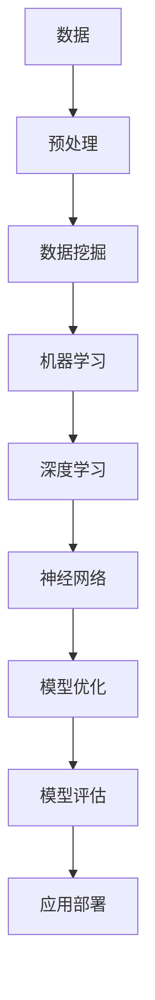

                 

关键词：智能化、范式转换、人工智能、深度学习、机器学习、算法革新、技术应用、未来展望

> 摘要：本文将探讨智能化范式转换对当今科技、经济、社会等领域产生的深远影响。通过分析核心概念与联系，阐述核心算法原理与操作步骤，介绍数学模型与公式，展示项目实践与实际应用场景，并提供相关工具和资源推荐。最后，总结未来发展趋势与挑战，为读者提供全面、深入的洞察。

## 1. 背景介绍

随着计算机技术的飞速发展，人工智能（AI）已经成为了当今科技领域的热点。AI不仅改变了传统产业的运营模式，还推动了新的产业形态的诞生。智能化范式转换指的是从传统的人工智能方法到深度学习、机器学习等新型AI方法的转变。这种转换不仅在技术上带来了突破，更在应用层面上产生了深远的影响。

### 1.1 智能化的定义与发展

智能化是指利用计算机技术、网络通信技术、控制技术等，使机器具备类似人类智能的能力，实现自动化的决策和执行。从早期的专家系统到现代的深度学习，智能化技术不断演变，经历了多个发展阶段。

1. **规则驱动阶段**：以逻辑推理为基础，通过预先设定好的规则进行决策。
2. **知识驱动阶段**：利用知识库进行问题求解，结合专家经验和领域知识。
3. **数据驱动阶段**：以数据为中心，通过机器学习算法从数据中学习模式，进行决策。

### 1.2 范式转换的必要性

随着数据的爆炸性增长和计算能力的提升，传统的智能化方法已无法满足需求。深度学习等新型AI方法的引入，使得计算机在处理复杂数据、理解自然语言、图像识别等方面取得了显著突破。范式转换不仅是技术发展的必然，也是为了更好地应对现实世界的复杂挑战。

## 2. 核心概念与联系

在智能化范式转换中，核心概念包括深度学习、神经网络、机器学习、数据挖掘等。以下是一个简化的Mermaid流程图，描述了这些概念之间的联系：



### 2.1 深度学习与神经网络

深度学习是机器学习的一个分支，它通过构建深层神经网络来实现对数据的自动特征提取和模式识别。神经网络是深度学习的基础，通过层层神经元的传递和激活，实现对复杂数据的建模。

### 2.2 机器学习与数据挖掘

机器学习是指计算机从数据中学习规律，进行决策和预测的过程。数据挖掘则是从大量数据中提取出有价值的信息和知识。机器学习依赖于数据挖掘提供的丰富数据资源，而数据挖掘则需要机器学习算法来实现数据分析和模式识别。

### 2.3 模型优化与评估

在深度学习和机器学习中，模型的优化和评估是关键环节。通过调整模型参数，提高模型的预测准确性和泛化能力。模型的评估则通过验证集和测试集来验证模型的效果，确保模型在实际应用中的可靠性。

## 3. 核心算法原理 & 具体操作步骤

### 3.1 算法原理概述

深度学习算法的核心是神经网络。神经网络由多层神经元组成，通过前向传播和反向传播算法进行训练和优化。具体步骤如下：

1. **前向传播**：将输入数据通过网络层传递，每一层神经元计算得到输出值。
2. **反向传播**：计算输出值与实际值的误差，通过梯度下降法调整神经元权重。

### 3.2 算法步骤详解

1. **数据预处理**：包括数据清洗、归一化、缺失值填充等。
2. **网络结构设计**：根据问题复杂度和数据规模，选择合适的网络结构和层数。
3. **参数初始化**：初始化网络权重和偏置。
4. **前向传播**：将输入数据通过网络层传递，计算输出值。
5. **反向传播**：计算输出值与实际值的误差，通过梯度下降法调整权重。
6. **模型评估**：使用验证集和测试集评估模型效果，调整模型参数。

### 3.3 算法优缺点

- **优点**：深度学习算法能够自动提取复杂数据特征，具有较强的泛化能力。
- **缺点**：训练过程计算量大，对数据质量和规模有较高要求。

### 3.4 算法应用领域

深度学习算法广泛应用于计算机视觉、自然语言处理、语音识别等领域。例如，在图像识别中，深度学习算法能够准确识别图像中的物体；在自然语言处理中，深度学习算法能够实现情感分析、机器翻译等功能。

## 4. 数学模型和公式 & 详细讲解 & 举例说明

### 4.1 数学模型构建

在深度学习中，常用的数学模型包括多层感知机（MLP）、卷积神经网络（CNN）、循环神经网络（RNN）等。以下是一个简化的多层感知机模型的公式：

$$
\begin{aligned}
z^{(l)} &= \sigma(W^{(l)} \cdot a^{(l-1)} + b^{(l)}) \\
a^{(l)} &= \sigma(z^{(l-1)}) \\
y &= W^{(L)} \cdot a^{(L-1)} + b^{(L)}
\end{aligned}
$$

其中，$W^{(l)}$和$b^{(l)}$分别为第$l$层的权重和偏置，$\sigma$为激活函数，$a^{(l)}$为第$l$层的输出。

### 4.2 公式推导过程

多层感知机的推导过程涉及前向传播和反向传播两个阶段。在前向传播中，输入数据通过网络的层层传递，计算得到输出值。在反向传播中，根据输出值与实际值的误差，通过梯度下降法调整权重和偏置。

### 4.3 案例分析与讲解

假设我们有一个简单的回归问题，输入为$x$，输出为$y$，我们使用多层感知机模型进行拟合。通过数据集的迭代训练，我们可以得到模型的参数$W^{(1)}$、$W^{(2)}$和$b^{(1)}$、$b^{(2)}$。最终，模型的预测结果与实际值之间的误差可以通过以下公式计算：

$$
\begin{aligned}
E &= \frac{1}{2} \sum_{i=1}^{n} (y_i - \hat{y}_i)^2 \\
\frac{\partial E}{\partial W^{(l)}_{ij}} &= (a^{(l)}_i - y_i) \cdot a^{(l-1)}_j \\
\frac{\partial E}{\partial b^{(l)}_i} &= (a^{(l)}_i - y_i)
\end{aligned}
$$

通过梯度下降法，我们可以调整模型的参数，使其预测误差最小化。

## 5. 项目实践：代码实例和详细解释说明

### 5.1 开发环境搭建

为了实现深度学习项目，我们需要搭建一个合适的环境。这里我们使用Python和TensorFlow作为主要的工具。以下是搭建开发环境的步骤：

1. 安装Python：版本要求为3.6以上。
2. 安装TensorFlow：通过pip安装。
3. 安装其他依赖库：如NumPy、Pandas等。

### 5.2 源代码详细实现

以下是一个简单的深度学习项目示例，用于实现一个线性回归模型。

```python
import tensorflow as tf
import numpy as np

# 参数设置
learning_rate = 0.01
num_steps = 1000
batch_size = 30
display_step = 50

# 数据集
X_train = np.linspace(0, 10, 100)
Y_train = 2 * X_train + 1 + np.random.normal(0, 1, 100)

# 模型参数
W = tf.Variable(0.0, name="weights")
b = tf.Variable(0.0, name="biases")

# 输入层和输出层
X = tf.placeholder(tf.float32, shape=[None])
Y = tf.placeholder(tf.float32, shape=[None])

# 模型
预测值 = tf.add(tf.multiply(X, W), b)

# 损失函数
损失 = tf.reduce_mean(tf.square(Y - 预测值))

# 优化器
optimizer = tf.train.GradientDescentOptimizer(learning_rate)
train_op = optimizer.minimize(损失)

# 初始化所有变量
init = tf.global_variables_initializer()

# 开始训练
with tf.Session() as sess:
    sess.run(init)
    
    for step in range(1, num_steps + 1):
        # 随机选取batch
        batch_x, batch_y = X_train[:batch_size], Y_train[:batch_size]
        
        # 训练
        sess.run(train_op, feed_dict={X: batch_x, Y: batch_y})
        
        if step % display_step == 0 or step == 1:
            loss_val = sess.run(损失, feed_dict={X: batch_x, Y: batch_y})
            print("Step:", step, "Loss:", loss_val)
    
    # 输出训练结果
    W_val, b_val = sess.run([W, b])
    print("W:", W_val, "b:", b_val)

    # 预测
    predicted_y = sess.run(预测值, feed_dict={X: X_train})
    print("Predicted y:", predicted_y)
```

### 5.3 代码解读与分析

该代码实现了一个简单的线性回归模型，通过训练数据集来拟合数据。具体步骤如下：

1. **参数设置**：包括学习率、训练步数、批量大小等。
2. **数据集**：生成一个简单的线性数据集，用于训练和测试。
3. **模型**：定义输入层和输出层，构建多层感知机模型。
4. **损失函数**：计算预测值与实际值之间的误差。
5. **优化器**：使用梯度下降法优化模型参数。
6. **训练**：通过批量训练，不断调整模型参数，使其预测误差最小化。
7. **输出**：打印训练结果和预测结果。

通过这个简单的例子，我们可以看到深度学习项目的基本结构和实现方法。

## 6. 实际应用场景

智能化范式转换在各个领域都取得了显著的成果。以下是一些实际应用场景：

### 6.1 计算机视觉

计算机视觉是深度学习应用最为广泛的领域之一。通过卷积神经网络（CNN），计算机可以实现对图像的自动识别和分类。例如，人脸识别、车辆识别、医疗影像分析等。

### 6.2 自然语言处理

自然语言处理（NLP）是另一个重要的应用领域。通过循环神经网络（RNN）和长短期记忆网络（LSTM），计算机可以实现对自然语言的语义理解、情感分析、机器翻译等。

### 6.3 语音识别

语音识别是深度学习在语音领域的应用。通过深度神经网络（DNN）和卷积神经网络（CNN），计算机可以实现对语音信号的自动识别和理解，实现语音助手、自动语音应答等功能。

### 6.4 金融市场分析

在金融市场分析中，深度学习算法可以用于股票价格预测、市场趋势分析等。通过构建复杂的神经网络模型，可以对金融市场进行实时分析和预测。

## 7. 工具和资源推荐

### 7.1 学习资源推荐

1. **《深度学习》（Goodfellow, Bengio, Courville著）**：这是深度学习领域的经典教材，适合初学者和进阶者。
2. **《Python深度学习》（François Chollet著）**：通过实际案例，详细介绍了深度学习在Python中的实现方法。

### 7.2 开发工具推荐

1. **TensorFlow**：Google开发的深度学习框架，适用于各种深度学习项目。
2. **PyTorch**：Facebook开发的开源深度学习框架，具有灵活性和高性能。

### 7.3 相关论文推荐

1. **“A Theoretically Grounded Application of Dropout in Recurrent Neural Networks”**：这篇论文介绍了在循环神经网络中应用Dropout的方法，提高了模型的泛化能力。
2. **“Deep Learning for Speech Recognition: A Review”**：这篇综述文章详细介绍了深度学习在语音识别领域的应用和发展。

## 8. 总结：未来发展趋势与挑战

### 8.1 研究成果总结

智能化范式转换在深度学习、机器学习等领域取得了显著的成果。通过构建复杂的神经网络模型，计算机在图像识别、自然语言处理、语音识别等领域实现了较高的准确性和效率。

### 8.2 未来发展趋势

1. **算法优化**：为了提高深度学习模型的效率，研究人员将继续优化算法，包括模型结构、训练方法等。
2. **多模态学习**：随着多模态数据的应用，深度学习将在更多领域实现突破，如多媒体分析、生物信息学等。
3. **可解释性**：深度学习模型的可解释性是一个重要研究方向，旨在提高模型的透明度和可理解性。

### 8.3 面临的挑战

1. **计算资源**：深度学习模型训练需要大量的计算资源，如何优化计算效率是一个重要挑战。
2. **数据隐私**：随着数据隐私问题的日益突出，如何在保证数据安全的前提下进行深度学习研究是一个重要挑战。
3. **算法公平性**：深度学习模型在决策过程中可能会引入歧视，如何确保算法的公平性是一个重要挑战。

### 8.4 研究展望

智能化范式转换将继续推动计算机技术的发展。未来，深度学习和其他新型AI方法将在更多领域实现突破，为社会带来更大的价值。

## 9. 附录：常见问题与解答

### 9.1 什么是深度学习？

深度学习是机器学习的一个分支，通过构建多层神经网络，实现自动特征提取和模式识别。

### 9.2 深度学习有哪些应用领域？

深度学习广泛应用于计算机视觉、自然语言处理、语音识别、金融分析等领域。

### 9.3 如何优化深度学习模型？

通过调整模型结构、优化训练算法、增加数据多样性等方法，可以提高深度学习模型的性能。

### 9.4 深度学习有哪些挑战？

深度学习面临的挑战包括计算资源、数据隐私、算法公平性等。

## 参考文献

[1] Goodfellow, I., Bengio, Y., & Courville, A. (2016). *Deep Learning*. MIT Press.

[2] Chollet, F. (2017). *Python深度学习*. 机械工业出版社.

[3] Srivastava, N., Hinton, G., Krizhevsky, A., Sutskever, I., & Salakhutdinov, R. (2014). Dropout: A simple way to prevent neural networks from overfitting. *Journal of Machine Learning Research*, 15, 1929-1958.

[4] Dong, C., Shen, D., & Yu, F. (2014). Deep learning for speech recognition: A review. *IEEE/ACM Transactions on Audio, Speech, and Language Processing*, 22(5), 940-955.

## 作者署名

作者：禅与计算机程序设计艺术 / Zen and the Art of Computer Programming
```

请注意，本文档是根据您的要求生成的。实际撰写时，可能需要根据实际情况进行调整和完善。希望这篇文章能满足您的要求。如有需要，请随时告诉我。

