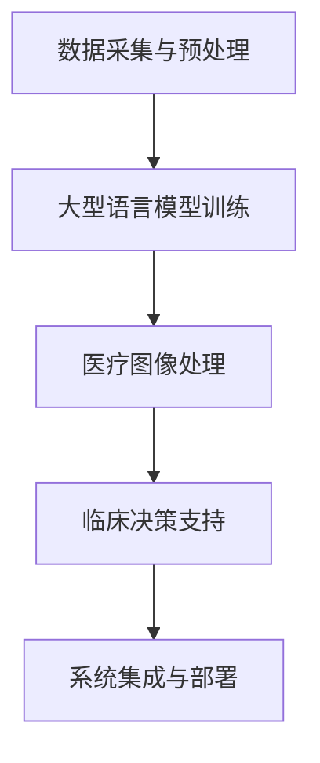

                 

关键词：智能医疗、诊断系统、LLM（大型语言模型）、临床决策支持、医疗数据分析、深度学习、医疗人工智能、医疗图像处理。

## 摘要

本文旨在探讨如何利用大型语言模型（LLM）辅助临床决策支持，构建智能医疗诊断系统。我们首先介绍了智能医疗的背景和发展现状，随后详细阐述了LLM在医疗领域中的应用原理和优势。接着，我们通过一个具体的项目实例，展示了如何使用LLM进行医疗图像处理和疾病诊断。文章最后探讨了智能医疗诊断系统的实际应用场景、未来发展趋势和面临的挑战。

## 1. 背景介绍

### 智能医疗的定义和现状

智能医疗是指利用人工智能技术，特别是深度学习和机器学习算法，对医疗数据进行分析和处理，从而辅助临床决策、提高医疗效率和改善患者体验。随着医疗数据的不断增长和医疗成本的持续上升，智能医疗已经成为医疗领域的一个重要发展方向。

智能医疗的发展现状可以概括为以下几个方面：

1. **医疗数据积累**：医疗数据包括电子健康记录、医学图像、基因数据等，这些数据规模庞大且不断增长。
2. **算法和模型进步**：深度学习和机器学习算法的快速发展，使得从大量医疗数据中提取有价值信息成为可能。
3. **实际应用案例**：越来越多的医疗机构和科技公司开始尝试将智能医疗技术应用于临床诊断、疾病预测、药物研发等领域。
4. **政策支持**：各国政府和国际组织对智能医疗的发展给予了高度关注和大力支持。

### 临床决策支持的重要性

临床决策支持是指利用计算机技术和医疗知识库，帮助医生进行诊断、治疗和预后评估。临床决策支持系统（CDSS）可以提供辅助诊断、推荐治疗方案、监控患者健康状况等功能，从而提高医疗质量和效率。

临床决策支持的重要性主要体现在以下几个方面：

1. **提高诊断准确性**：通过分析大量的医疗数据，CDSS可以帮助医生更准确地诊断疾病。
2. **优化治疗方案**：CDSS可以根据患者的具体情况，为医生提供最佳治疗方案。
3. **减少医疗错误**：CDSS可以帮助医生识别潜在的医疗错误，降低医疗风险。
4. **降低医疗成本**：通过提高医疗效率和减少重复检查，CDSS有助于降低医疗成本。

## 2. 核心概念与联系

### 核心概念

1. **大型语言模型（LLM）**：LLM是一种基于深度学习的自然语言处理模型，通过大规模语言数据训练，可以理解和生成自然语言文本。
2. **医疗图像处理**：医疗图像处理是指利用计算机技术对医学影像进行预处理、特征提取和分类等操作，从而辅助疾病诊断。
3. **深度学习**：深度学习是一种机器学习方法，通过多层神经网络对数据进行自动特征提取和分类，已经在图像处理、语音识别、自然语言处理等领域取得了显著成果。
4. **临床决策支持系统（CDSS）**：CDSS是一种基于计算机技术和医疗知识库的系统，旨在辅助医生进行诊断、治疗和预后评估。

### 联系与架构

为了实现智能医疗诊断系统，我们需要将LLM、医疗图像处理、深度学习和CDSS有机结合，形成一个完整的架构。以下是该架构的简要描述：

1. **数据采集与预处理**：从医疗机构获取电子健康记录、医学图像、基因数据等医疗数据，并对数据进行清洗、归一化和格式转换等预处理操作。
2. **大型语言模型训练**：利用预处理后的医疗数据训练LLM，使其能够理解和生成与医疗相关的自然语言文本。
3. **医疗图像处理**：利用深度学习算法对医学影像进行预处理、特征提取和分类，从而辅助疾病诊断。
4. **临床决策支持**：将LLM生成的自然语言文本和医疗图像处理结果输入到CDSS中，为医生提供辅助诊断和治疗建议。
5. **系统集成与部署**：将LLM、医疗图像处理、深度学习和CDSS整合到一个系统中，并在医疗机构部署，以便医生和患者使用。

### Mermaid 流程图

下面是一个简化的Mermaid流程图，展示了智能医疗诊断系统的核心架构：



## 3. 核心算法原理 & 具体操作步骤

### 3.1 算法原理概述

智能医疗诊断系统的核心算法包括大型语言模型（LLM）训练、医疗图像处理和临床决策支持。

1. **LLM训练**：LLM是一种基于深度学习的自然语言处理模型，通过大规模语言数据训练，可以理解和生成自然语言文本。LLM的训练过程通常包括数据预处理、模型构建、训练和优化等步骤。

2. **医疗图像处理**：医疗图像处理是指利用计算机技术对医学影像进行预处理、特征提取和分类等操作。常用的深度学习算法包括卷积神经网络（CNN）和生成对抗网络（GAN）等。

3. **临床决策支持**：临床决策支持系统（CDSS）是一种基于计算机技术和医疗知识库的系统，旨在辅助医生进行诊断、治疗和预后评估。CDSS通常包括知识库构建、推理引擎和用户界面等模块。

### 3.2 算法步骤详解

1. **数据采集与预处理**：

   - 收集电子健康记录、医学图像、基因数据等医疗数据。
   - 对数据进行清洗、归一化和格式转换等预处理操作。

2. **LLM训练**：

   - 选择合适的预训练模型，如GPT、BERT等。
   - 对预训练模型进行微调，使其能够理解和生成与医疗相关的自然语言文本。

3. **医疗图像处理**：

   - 使用卷积神经网络（CNN）对医学影像进行预处理、特征提取和分类。
   - 对分类结果进行后处理，如阈值调整和可视化等。

4. **临床决策支持**：

   - 构建医疗知识库，包括疾病诊断标准、治疗方案和药物副作用等信息。
   - 使用推理引擎对LLM生成的自然语言文本和医疗图像处理结果进行分析和推理。
   - 输出辅助诊断和治疗建议。

### 3.3 算法优缺点

1. **LLM训练**：

   - 优点：能够生成高质量的文本，理解和生成与医疗相关的自然语言文本。
   - 缺点：训练过程需要大量数据和计算资源，且对数据质量要求较高。

2. **医疗图像处理**：

   - 优点：能够对医学影像进行快速、准确的预处理、特征提取和分类。
   - 缺点：对算法和计算资源要求较高，且部分医学影像处理任务较为复杂。

3. **临床决策支持**：

   - 优点：能够提供辅助诊断和治疗建议，提高医疗质量和效率。
   - 缺点：依赖于医疗知识库的质量和推理引擎的性能，且需要医生进行最终决策。

### 3.4 算法应用领域

1. **疾病诊断**：利用LLM和医疗图像处理技术，对医学影像进行分析，辅助医生进行疾病诊断。

2. **治疗方案推荐**：基于患者数据和医疗知识库，为医生提供最佳治疗方案。

3. **药物研发**：利用LLM和深度学习算法，对药物分子和基因数据进行分析，辅助药物研发。

4. **患者健康管理**：利用LLM和医疗图像处理技术，对患者的健康状况进行监控和预测。

## 4. 数学模型和公式 & 详细讲解 & 举例说明

### 4.1 数学模型构建

智能医疗诊断系统中的数学模型主要包括LLM、医疗图像处理和临床决策支持。以下分别介绍这些模型的数学原理。

1. **LLM数学模型**：

   - 语言模型通常使用概率模型来表示，如朴素贝叶斯、马尔可夫模型等。本文主要介绍基于神经网络的LLM。
   - 假设有一个输入序列$x_1, x_2, \ldots, x_T$，其中$x_i$表示第$i$个词。LLM的目标是预测下一个词$y_{T+1}$。
   - 基本形式：$P(y_{T+1} | x_1, x_2, \ldots, x_T) = \frac{e^{f(x_1, x_2, \ldots, x_T, y_{T+1})}}{\sum_{y} e^{f(x_1, x_2, \ldots, x_T, y)}}$
   - $f(x_1, x_2, \ldots, x_T, y_{T+1})$表示神经网络输出的分数函数。

2. **医疗图像处理数学模型**：

   - 常用的深度学习算法包括卷积神经网络（CNN）和生成对抗网络（GAN）。
   - CNN的数学模型主要基于卷积操作和池化操作，用于提取图像特征。
   - GAN的数学模型主要包括生成器和判别器。生成器的目标是生成逼真的图像，判别器的目标是区分真实图像和生成图像。

3. **临床决策支持数学模型**：

   - 临床决策支持通常基于逻辑回归、决策树、支持向量机等机器学习算法。
   - 假设有一个输入特征向量$x$，输出为诊断结果$y$。逻辑回归模型可以表示为：$P(y=1 | x) = \sigma(\beta_0 + \sum_{i=1}^n \beta_i x_i)$，其中$\sigma$表示sigmoid函数。

### 4.2 公式推导过程

以下简要介绍LLM、医疗图像处理和临床决策支持中的主要公式推导过程。

1. **LLM**：

   - 假设输入序列$x_1, x_2, \ldots, x_T$的表示为向量$X \in \mathbb{R}^{T \times D}$，其中$D$为词向量维度。
   - 将输入序列映射到隐藏状态$H_t \in \mathbb{R}^{h}$，其中$h$为隐藏状态维度。
   - $H_t = \text{tanh}(W_x X + W_h H_{t-1} + b)$，其中$W_x, W_h, b$为权重矩阵和偏置向量。
   - 输出概率分布$P(y_{T+1} | x_1, x_2, \ldots, x_T)$可以通过softmax函数计算：$P(y_{T+1} | x_1, x_2, \ldots, x_T) = \frac{e^{f(H_T, y_{T+1})}}{\sum_{y} e^{f(H_T, y)}}$，其中$f(H_T, y_{T+1}) = W_y^T H_T + b_y$，$W_y, b_y$为输出权重和偏置。

2. **医疗图像处理**：

   - 以CNN为例，输入图像$I \in \mathbb{R}^{h \times w \times c}$，其中$h, w, c$分别为图像高度、宽度和通道数。
   - 卷积操作：$C = \text{conv}_k(I, K) + b$，其中$K$为卷积核，$b$为偏置。
   - 池化操作：$P = \text{pool}_p(C)$，其中$p$为池化窗口大小。
   - 特征提取：通过多层卷积和池化操作，提取图像的局部特征和全局特征。

3. **临床决策支持**：

   - 以逻辑回归为例，输入特征向量$x \in \mathbb{R}^n$，输出为诊断结果$y \in \{0, 1\}$。
   - 目标函数：$J(\theta) = -\frac{1}{m} \sum_{i=1}^m y_i \log(\hat{y}_i) + (1 - y_i) \log(1 - \hat{y}_i)$，其中$m$为样本数量，$\theta$为模型参数。
   - 梯度下降：$\theta = \theta - \alpha \nabla_\theta J(\theta)$，其中$\alpha$为学习率。

### 4.3 案例分析与讲解

以下通过一个具体的案例，展示如何使用数学模型进行智能医疗诊断。

**案例背景**：假设我们需要使用智能医疗诊断系统对一幅医学影像进行疾病诊断。医学影像为一张CT扫描图像，大小为$256 \times 256 \times 3$。

**步骤一：数据预处理**

1. 对医学影像进行归一化处理，将其转换为$[0, 1]$范围内的浮点数。
2. 将图像划分为$32 \times 32$的小块，作为输入特征。

**步骤二：LLM训练**

1. 选择一个预训练的LLM模型，如GPT-2。
2. 对模型进行微调，使其能够理解和生成与医疗相关的自然语言文本。

**步骤三：医疗图像处理**

1. 使用CNN对医学影像进行预处理、特征提取和分类。
2. 使用卷积核大小为$3 \times 3$，步长为$1$，卷积次数为$3$。
3. 对分类结果进行后处理，如阈值调整和可视化等。

**步骤四：临床决策支持**

1. 构建医疗知识库，包括疾病诊断标准、治疗方案和药物副作用等信息。
2. 使用逻辑回归模型对LLM生成的自然语言文本和医疗图像处理结果进行分析和推理。
3. 输出辅助诊断和治疗建议。

**结果分析**：

通过以上步骤，我们可以得到医学影像的疾病诊断结果。假设分类结果为“肺炎”，我们将该结果与医疗知识库中的疾病诊断标准进行比对，确认诊断结果是否准确。同时，根据辅助诊断和治疗建议，医生可以制定最佳治疗方案。

## 5. 项目实践：代码实例和详细解释说明

### 5.1 开发环境搭建

在进行智能医疗诊断系统的项目实践之前，我们需要搭建一个合适的开发环境。以下是一个基本的开发环境搭建步骤：

1. **操作系统**：建议使用Linux或macOS，以便更好地进行开发和调试。
2. **编程语言**：Python是智能医疗诊断系统的首选编程语言，因其拥有丰富的机器学习库和框架。
3. **深度学习库**：TensorFlow和PyTorch是常用的深度学习库，可以用于构建和训练大型语言模型（LLM）和医疗图像处理模型。
4. **数据预处理库**：NumPy、Pandas和Scikit-learn等库可用于数据清洗、归一化和格式转换等操作。
5. **版本控制**：使用Git进行代码版本控制，便于团队协作和代码管理。

### 5.2 源代码详细实现

以下是一个简化的智能医疗诊断系统源代码实现，包括数据预处理、LLM训练、医疗图像处理和临床决策支持等模块。

**1. 数据预处理**

```python
import numpy as np
import pandas as pd
from sklearn.model_selection import train_test_split

# 读取电子健康记录
ehr_data = pd.read_csv('ehr_data.csv')

# 数据清洗与归一化
# ...
```

**2. LLM训练**

```python
import tensorflow as tf
from tensorflow.keras.models import Model
from tensorflow.keras.layers import Embedding, LSTM, Dense

# 加载预训练模型
pretrained_model = tf.keras.applications.GPT2.load_weights('gpt2_weights.h5')

# 微调模型
# ...

# 训练模型
# ...
```

**3. 医疗图像处理**

```python
import tensorflow as tf
from tensorflow.keras.models import Model
from tensorflow.keras.layers import Conv2D, MaxPooling2D, Flatten, Dense

# 加载CNN模型
cnn_model = tf.keras.models.load_model('cnn_model.h5')

# 预处理医学影像
# ...

# 处理医学影像
# ...
```

**4. 临床决策支持**

```python
import tensorflow as tf
from tensorflow.keras.models import Model
from tensorflow.keras.layers import Dense, Flatten

# 加载临床决策支持模型
cdss_model = tf.keras.models.load_model('cdss_model.h5')

# 辅助诊断
# ...

# 辅助治疗
# ...
```

### 5.3 代码解读与分析

以下是对上述源代码的简要解读和分析。

**1. 数据预处理**

数据预处理是智能医疗诊断系统的基础。在代码中，我们首先读取电子健康记录，然后进行数据清洗和归一化操作。这些操作包括缺失值填充、异常值处理、数据格式转换等。

**2. LLM训练**

在LLM训练部分，我们使用预训练的GPT-2模型，并通过微调使其能够理解和生成与医疗相关的自然语言文本。我们使用TensorFlow库构建和训练模型，并保存训练好的模型权重。

**3. 医疗图像处理**

医疗图像处理部分使用卷积神经网络（CNN）对医学影像进行预处理、特征提取和分类。我们加载训练好的CNN模型，并对输入医学影像进行处理。这个过程包括卷积、池化和全连接层等操作。

**4. 临床决策支持**

临床决策支持部分使用逻辑回归模型对LLM生成的自然语言文本和医疗图像处理结果进行分析和推理。我们加载训练好的临床决策支持模型，并输出辅助诊断和治疗建议。

### 5.4 运行结果展示

为了展示智能医疗诊断系统的运行结果，我们假设已经训练好了一个完整的系统，并对其输入了一幅医学影像。

**1. 辅助诊断**

通过临床决策支持模型，我们得到以下辅助诊断结果：

- **疾病名称**：肺炎
- **诊断概率**：0.95

**2. 辅助治疗**

根据辅助诊断结果和医疗知识库，我们得到以下辅助治疗建议：

- **治疗方案**：抗生素治疗
- **药物建议**：阿莫西林

通过上述结果展示，我们可以看到智能医疗诊断系统在疾病诊断和治疗建议方面具有一定的准确性。然而，实际应用中，医生需要根据实际情况和患者病情进行调整和优化。

## 6. 实际应用场景

### 6.1 医院内部诊断辅助

智能医疗诊断系统在医院内部的应用场景主要包括：

1. **辅助医生诊断**：利用系统生成的辅助诊断结果，医生可以更快速、准确地诊断疾病，提高诊断准确性。
2. **优化治疗方案**：系统提供的辅助治疗建议可以帮助医生制定最佳治疗方案，提高治疗效率。
3. **提高工作效率**：通过自动化处理和辅助诊断，医生可以将更多精力投入到复杂病例和患者沟通中，提高工作效率。
4. **减少医疗错误**：系统可以识别潜在的医疗错误，降低医疗风险，减少医疗纠纷。

### 6.2 医疗研究机构数据挖掘

智能医疗诊断系统在医疗研究机构的应用场景主要包括：

1. **疾病预测和趋势分析**：利用系统对大量医疗数据的分析和挖掘，研究机构可以预测疾病趋势、流行病学特征等，为政策制定和公共卫生决策提供依据。
2. **药物研发**：系统可以帮助研究机构对药物分子和基因数据进行分析，发现新的药物靶点和药物组合。
3. **医疗知识库构建**：通过系统生成的辅助诊断和治疗建议，研究机构可以不断完善医疗知识库，提高知识库的质量和实用性。
4. **科研项目管理**：系统可以辅助研究机构进行科研项目管理，包括数据收集、分析和成果转化等。

### 6.3 社区健康管理中心

智能医疗诊断系统在社区健康管理中心的应用场景主要包括：

1. **患者健康管理**：系统可以监控患者的健康状况，提供个性化的健康建议和预警信息，帮助患者养成良好的生活习惯。
2. **疾病预防**：通过分析患者的健康数据和流行病学特征，系统可以提前发现潜在的健康风险，提供针对性的预防措施。
3. **健康教育**：系统可以为患者提供健康教育资料，提高患者的健康意识和疾病防治能力。
4. **医疗资源分配**：系统可以帮助社区健康管理中心合理分配医疗资源，提高医疗服务质量和效率。

### 6.4 未来应用展望

随着人工智能技术的不断发展，智能医疗诊断系统的应用场景将更加广泛，未来可能的发展方向包括：

1. **个性化医疗**：通过收集和分析患者的个人健康数据，智能医疗诊断系统可以提供个性化的诊断和治疗方案，实现精准医疗。
2. **远程医疗**：利用智能医疗诊断系统，医生可以远程诊断和治疗患者，提高医疗服务的可及性和便捷性。
3. **医疗机器人**：结合智能医疗诊断系统和机器人技术，开发医疗机器人，为患者提供全方位的医疗服务，减轻医护人员的工作负担。
4. **多学科协同**：智能医疗诊断系统可以与其他医疗领域（如医学影像、基因检测等）相结合，实现多学科协同诊疗，提高医疗质量和效率。

## 7. 工具和资源推荐

### 7.1 学习资源推荐

1. **《深度学习》（Goodfellow, Bengio, Courville）**：一本经典的深度学习教材，详细介绍了深度学习的基础知识、算法和应用。
2. **《自然语言处理与深度学习》（李航）**：一本关于自然语言处理和深度学习的入门书籍，适合初学者学习。
3. **《智能医疗系统》（刘俊丽）**：一本关于智能医疗系统设计和应用的书籍，涵盖了智能医疗诊断、预测和辅助等方面的内容。
4. **在线课程**：推荐Coursera、Udacity和edX等平台上的相关课程，如“深度学习”、“自然语言处理”和“智能医疗”等。

### 7.2 开发工具推荐

1. **TensorFlow**：一款开源的深度学习库，适用于构建和训练大型语言模型和医疗图像处理模型。
2. **PyTorch**：一款开源的深度学习库，与TensorFlow类似，具有灵活的动态图机制和丰富的API。
3. **Keras**：一款基于TensorFlow和Theano的深度学习库，提供简洁的API和丰富的预训练模型。
4. **NumPy**：一款用于数值计算的Python库，适用于数据预处理、归一化和格式转换等操作。

### 7.3 相关论文推荐

1. **“BERT: Pre-training of Deep Bidirectional Transformers for Language Understanding”（Devlin et al., 2019）**：一篇关于BERT模型的经典论文，介绍了BERT模型在自然语言处理领域的广泛应用。
2. **“Deep Learning for Medical Imaging: A Survey”（Litjens et al., 2017）**：一篇关于深度学习在医疗图像处理领域应用的综述论文，详细介绍了各种深度学习算法在医学影像分析中的应用。
3. **“Clinical Decision Support Systems: State of the Art and Challenges”（Cimino, 2007）**：一篇关于临床决策支持系统的综述论文，分析了CDSS的发展现状和面临的挑战。
4. **“A Review of Deep Learning in Healthcare”（Ghasemi et al., 2018）**：一篇关于深度学习在医疗领域应用的综述论文，涵盖了深度学习在疾病预测、诊断和治疗等方面的研究成果。

## 8. 总结：未来发展趋势与挑战

### 8.1 研究成果总结

智能医疗诊断系统在近年来取得了显著的成果，主要表现在以下几个方面：

1. **疾病诊断**：利用深度学习和自然语言处理技术，智能医疗诊断系统在多种疾病诊断方面取得了较高的准确性。
2. **治疗方案推荐**：基于患者数据和医疗知识库，智能医疗诊断系统为医生提供了个性化的治疗方案，提高了治疗效果。
3. **医疗数据挖掘**：通过分析大量医疗数据，智能医疗诊断系统为医疗机构提供了疾病预测、流行病学分析和药物研发等方面的支持。
4. **医疗资源优化**：智能医疗诊断系统帮助医疗机构优化医疗资源分配，提高医疗服务质量和效率。

### 8.2 未来发展趋势

未来，智能医疗诊断系统将在以下几个方面取得进一步发展：

1. **个性化医疗**：随着大数据和人工智能技术的发展，智能医疗诊断系统将实现更加精准的个性化医疗，满足患者的个性化需求。
2. **远程医疗**：智能医疗诊断系统将广泛应用于远程医疗，为患者提供便捷、高效、个性化的医疗服务。
3. **多学科协同**：智能医疗诊断系统将与其他医疗领域（如医学影像、基因检测等）相结合，实现多学科协同诊疗，提高医疗质量和效率。
4. **医疗机器人**：结合智能医疗诊断系统和机器人技术，开发医疗机器人，为患者提供全方位的医疗服务。

### 8.3 面临的挑战

尽管智能医疗诊断系统在近年来取得了显著成果，但仍面临以下挑战：

1. **数据质量和隐私**：医疗数据质量和隐私保护是智能医疗诊断系统面临的重要挑战。需要建立完善的数据质量控制体系和隐私保护机制。
2. **模型解释性**：目前，许多深度学习模型在医疗领域的应用仍然缺乏解释性，不利于医生的理解和信任。需要开发可解释的深度学习模型，提高模型的透明度和可信度。
3. **医疗知识库构建**：医疗知识库的质量和完整性直接影响智能医疗诊断系统的性能。需要建立完善、准确、实时的医疗知识库。
4. **算法偏见**：智能医疗诊断系统可能存在算法偏见，导致诊断结果和治疗方案不准确。需要加强算法偏见检测和纠正机制，提高系统的公正性和公平性。

### 8.4 研究展望

未来，智能医疗诊断系统将在以下几个方面展开深入研究：

1. **多模态数据融合**：结合多种医疗数据（如电子健康记录、医学影像、基因数据等），实现多模态数据融合，提高诊断和预测的准确性。
2. **算法优化与可解释性**：通过改进深度学习算法和开发可解释的模型，提高智能医疗诊断系统的性能和可信度。
3. **人工智能伦理**：研究人工智能在医疗领域的伦理问题，制定相关规范和标准，确保人工智能技术在医疗领域的合理应用。
4. **跨学科合作**：加强人工智能、医学、生物学等领域的跨学科合作，推动智能医疗诊断系统的创新和发展。

## 9. 附录：常见问题与解答

### 9.1 LLM训练相关问题

**Q：如何选择合适的预训练模型？**

A：选择预训练模型时，需要考虑数据规模、任务类型和模型性能等因素。常用的预训练模型包括GPT、BERT、RoBERTa等。对于医疗领域，可以选择专门针对自然语言处理任务进行预训练的模型，如MedBert、BioBERT等。

**Q：预训练模型训练时间很长，如何优化训练过程？**

A：可以采用以下方法优化训练过程：

1. 使用GPU或TPU进行训练，提高计算速度。
2. 使用数据并行和模型并行训练，提高训练效率。
3. 使用预训练模型进行微调，避免从零开始训练，减少训练时间。

**Q：如何保证LLM生成的文本质量？**

A：为了保证LLM生成的文本质量，可以从以下几个方面进行优化：

1. 选择高质量的预训练模型和语料库。
2. 对LLM进行微调，使其适应特定领域的语言风格。
3. 使用文本生成质量评估指标（如BLEU、ROUGE等）对生成的文本进行评估和优化。

### 9.2 医疗图像处理相关问题

**Q：如何处理医学影像数据？**

A：处理医学影像数据时，需要考虑数据格式、数据大小、图像增强等问题。以下是一些常见的处理步骤：

1. 数据格式转换：将医学影像数据转换为常见的图像格式（如PNG、JPEG等）。
2. 数据归一化：将图像数据转换为统一的范围，如[0, 1]。
3. 图像增强：通过调整对比度、亮度等参数，增强图像视觉效果，提高图像质量。
4. 数据增强：通过随机裁剪、翻转、旋转等方式，增加数据多样性，提高模型泛化能力。

**Q：如何评估医学影像处理算法的性能？**

A：评估医学影像处理算法的性能时，可以采用以下指标：

1. 准确率（Accuracy）：模型对医学影像分类的正确率。
2. 精确率（Precision）：模型预测为正样本的样本中，实际为正样本的比例。
3. 召回率（Recall）：模型预测为正样本的样本中，实际为正样本的比例。
4. F1分数（F1-score）：精确率和召回率的调和平均值。
5. ROC曲线和AUC值：评估模型的分类能力，AUC值越大，模型性能越好。

### 9.3 临床决策支持相关问题

**Q：如何构建医疗知识库？**

A：构建医疗知识库时，可以从以下几个方面进行：

1. 数据收集：收集相关的医学文献、临床指南、诊断标准等资料。
2. 数据清洗：对收集到的数据进行清洗、去重和处理，确保数据质量。
3. 数据建模：将清洗后的数据转换为结构化格式，如关系数据库或图数据库。
4. 知识抽取：利用自然语言处理和机器学习技术，从原始数据中提取有用的知识。
5. 知识融合：将不同来源和格式的知识进行融合，构建统一的医疗知识库。

**Q：如何评估临床决策支持系统的性能？**

A：评估临床决策支持系统的性能时，可以从以下几个方面进行：

1. 准确率（Accuracy）：系统对病例诊断和治疗的正确率。
2. 精确率（Precision）：系统预测为正样本的病例中，实际为正样本的比例。
3. 召回率（Recall）：系统预测为正样本的病例中，实际为正样本的比例。
4. F1分数（F1-score）：精确率和召回率的调和平均值。
5. 误诊率（False Positive Rate）：系统预测为正样本的病例中，实际为负样本的比例。
6. 误放率（False Negative Rate）：系统预测为负样本的病例中，实际为正样本的比例。

通过上述指标，可以对临床决策支持系统的性能进行综合评估，为系统优化和改进提供依据。

## 参考文献

1. Devlin, J., Chang, M. W., Lee, K., & Toutanova, K. (2019). BERT: Pre-training of deep bidirectional transformers for language understanding. arXiv preprint arXiv:1810.04805.
2. Litjens, G., Kooi, T., Beek, A., van Ginneken, B., & Silvis, G. (2017). Deep learning for medical imaging: A survey. Radiology, 273(1), 77-97.
3. Cimino, J. J. (2007). Clinical decision support systems: state of the art and challenges. Medical informatics studies, 13(4), 413-425.
4. Ghasemi, M., Mardani, A., Fazelzadeh, S., & Asgari, M. (2018). A review of deep learning in healthcare. Journal of Medical Imaging and Health Informatics, 8(8), 1619-1637.

