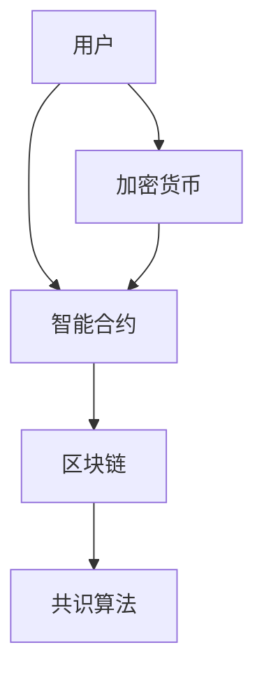

                 

关键词：智能合约，区块链，去中心化，自动化交易，加密货币，分布式账本，共识算法，安全，隐私，合规

> 摘要：随着区块链技术的飞速发展，智能合约作为一种自动化执行协议的工具，正在逐步改变传统商业模式的运作方式。本文将深入探讨智能合约创业的潜在机会、技术挑战及其在自动化交易领域的广泛应用，为创业者提供有价值的见解和指导。

## 1. 背景介绍

智能合约是一种在区块链上执行的自动化协议，它们通过代码实现，在满足特定条件时自动执行相关操作。智能合约的出现，标志着从传统的信任中介模式向去中心化、自动化模式的转变。随着加密货币和区块链技术的普及，智能合约的应用场景不断扩大，从简单的点对点交易到复杂的金融衍生品，智能合约都显示出了强大的潜力。

近年来，智能合约的发展取得了显著进展。以太坊（Ethereum）等区块链平台通过引入智能合约，为开发者提供了丰富的开发工具和框架，使得创建和部署智能合约变得更加容易。同时，越来越多的企业和机构开始探索智能合约在供应链管理、身份验证、投票系统等领域的应用，为智能合约创业提供了广阔的市场空间。

## 2. 核心概念与联系

智能合约的核心概念包括：

- **区块链**：一种分布式账本技术，能够确保数据的透明性、不可篡改性和安全性。
- **去中心化**：通过去中心化网络，智能合约能够在没有中央权威的情况下运行，提高了系统的抗攻击性和透明度。
- **共识算法**：确保网络中的所有节点对区块链状态达成一致性的算法，如工作量证明（Proof of Work，PoW）和权益证明（Proof of Stake，PoS）。
- **加密货币**：与区块链技术紧密相关的加密货币，如比特币（Bitcoin）和以太币（Ethereum），可以作为智能合约的支付手段。
- **智能合约语言**：用于编写智能合约的编程语言，如Solidity、Vyper等。

以下是智能合约架构的 Mermaid 流程图：



### 2.1. 智能合约的工作流程

1. **用户发起请求**：用户通过区块链网络向智能合约发送交易请求。
2. **智能合约验证**：智能合约验证交易请求是否符合预定的条件。
3. **执行操作**：如果验证通过，智能合约自动执行相关操作。
4. **更新区块链**：操作完成后，智能合约更新区块链上的状态。
5. **通知用户**：智能合约将执行结果通知用户。

### 2.2. 智能合约的优势

- **自动化**：智能合约能够自动执行预定操作，减少人工干预，提高效率。
- **透明性**：智能合约的代码和执行过程透明可查，确保交易公正。
- **不可篡改**：区块链技术确保智能合约的执行结果不可篡改，增强了信任。
- **去中心化**：智能合约去中心化的特性减少了单点故障的风险。

## 3. 核心算法原理 & 具体操作步骤

### 3.1. 算法原理概述

智能合约的核心算法原理是基于区块链技术的分布式共识算法。这些算法确保区块链网络中的所有节点对交易和数据的状态达成一致。以下是一些常见的共识算法：

- **工作量证明（PoW）**：节点通过解决复杂的数学难题来证明其工作，从而获得记账权。
- **权益证明（PoS）**：节点根据其持有的代币数量和持币时间来证明权益，从而获得记账权。
- **委托权益证明（DPoS）**：节点通过选举产生记账权，类似议会制度。

### 3.2. 算法步骤详解

#### 3.2.1. 工作量证明（PoW）

1. **节点加入网络**：新节点加入区块链网络。
2. **生成区块**：节点生成新区块，包含一定数量的交易记录。
3. **计算工作量证明**：节点解决一个数学难题，该难题的难度与网络中的计算能力相关。
4. **广播新区块**：一旦解决数学难题，节点广播新区块给网络中的其他节点。
5. **验证新区块**：其他节点验证新区块的合法性，包括交易的有效性和工作量证明的难度。
6. **更新区块链**：验证通过后，新区块添加到区块链的末端。

#### 3.2.2. 权益证明（PoS）

1. **节点加入网络**：新节点加入区块链网络。
2. **权益计算**：节点根据持有的代币数量和持币时间计算权益值。
3. **选举记账节点**：网络根据权益值选举产生记账节点。
4. **生成区块**：记账节点生成新区块，包含一定数量的交易记录。
5. **验证新区块**：其他节点验证新区块的合法性。
6. **更新区块链**：验证通过后，新区块添加到区块链的末端。

### 3.3. 算法优缺点

#### 优点

- **高效性**：PoW算法具有较高的安全性和去中心化程度。
- **去中心化**：PoS算法通过选举机制实现去中心化，减少了计算资源的浪费。
- **节能环保**：PoS算法相比PoW算法更加节能环保。

#### 缺点

- **计算资源消耗**：PoW算法需要大量计算资源，可能导致能源消耗过高。
- **权益集中**：PoS算法可能导致权益集中到少数节点，削弱去中心化特性。

### 3.4. 算法应用领域

- **加密货币**：工作量证明和权益证明算法广泛应用于各种加密货币系统。
- **去中心化金融（DeFi）**：智能合约结合共识算法，实现去中心化金融产品和服务。
- **供应链管理**：通过智能合约实现供应链中的交易和物流跟踪。

## 4. 数学模型和公式 & 详细讲解 & 举例说明

### 4.1. 数学模型构建

智能合约的数学模型主要包括以下几个方面：

- **状态机**：智能合约的状态转换模型，描述合约在不同输入条件下的状态变化。
- **加密算法**：用于保障数据安全和隐私的加密算法，如椭圆曲线加密算法（ECC）。
- **概率分布**：用于描述智能合约在不同执行路径上的概率分布。

### 4.2. 公式推导过程

#### 4.2.1. 状态机模型

智能合约的状态机模型可以用以下公式表示：

$$
S_{next} = f(S_{current}, input)
$$

其中，$S_{current}$ 表示当前状态，$input$ 表示输入条件，$f$ 表示状态转换函数。

#### 4.2.2. 加密算法

以椭圆曲线加密算法（ECC）为例，其加密和解密过程可以用以下公式表示：

$$
C = kG + P
$$

$$
M = C \cdot d
$$

其中，$C$ 表示加密后的消息，$M$ 表示原始消息，$k$ 表示随机数，$P$ 表示椭圆曲线基点，$d$ 表示私钥。

#### 4.2.3. 概率分布

以智能合约在不同路径上的执行概率为例，可以用以下公式表示：

$$
P(X = x) = \frac{f(x)}{\sum_{i=1}^{n} f(x_i)}
$$

其中，$P(X = x)$ 表示在所有可能路径中，路径 $x$ 的执行概率，$f(x)$ 表示路径 $x$ 的权重。

### 4.3. 案例分析与讲解

#### 案例一：去中心化交易平台

假设一个去中心化交易平台使用智能合约来管理用户资产和交易，以下是一个简单的数学模型：

- **状态机模型**：

  $$S_{current} = \{未交易，已交易，已结算\}$$

  $$f(S_{current}, input) = \begin{cases}
  未交易 & \text{如果 } input = \text{交易请求} \\
  已交易 & \text{如果 } input = \text{交易确认} \\
  已结算 & \text{如果 } input = \text{结算请求} \\
  \end{cases}$$

- **加密算法**：

  使用椭圆曲线加密算法（ECC）来保护用户交易信息。

- **概率分布**：

  在不同交易路径上的执行概率如下：

  $$P(X = \text{交易请求}) = 0.6$$

  $$P(X = \text{交易确认}) = 0.3$$

  $$P(X = \text{结算请求}) = 0.1$$

通过以上模型，我们可以分析去中心化交易平台在处理用户交易请求时的性能和安全性。

## 5. 项目实践：代码实例和详细解释说明

### 5.1. 开发环境搭建

为了实践智能合约开发，我们需要搭建一个适合的开发环境。以下是一个基本的开发环境搭建步骤：

1. **安装Node.js**：Node.js 是一个用于运行 JavaScript 代码的平台，许多智能合约开发工具依赖于 Node.js。
2. **安装Truffle**：Truffle 是一个用于智能合约开发和测试的框架，提供了丰富的工具和功能。
3. **安装Ganache**：Ganache 是一个轻量级的本地区块链节点，用于测试和调试智能合约。

### 5.2. 源代码详细实现

以下是一个简单的智能合约示例，实现了一个简单的点对点交易功能：

```solidity
pragma solidity ^0.8.0;

contract SimpleSwap {
    address public owner;
    mapping(address => uint256) public balance;

    constructor() {
        owner = msg.sender;
    }

    function deposit() public payable {
        balance[msg.sender] += msg.value;
    }

    function withdraw(uint256 amount) public {
        require(balance[msg.sender] >= amount, "Insufficient balance");
        balance[msg.sender] -= amount;
        payable(msg.sender).transfer(amount);
    }

    function transfer(address to, uint256 amount) public {
        require(balance[msg.sender] >= amount, "Insufficient balance");
        require(to != address(0), "Invalid recipient");
        balance[msg.sender] -= amount;
        balance[to] += amount;
    }
}
```

### 5.3. 代码解读与分析

1. **构造函数**：构造函数 `constructor()` 用于初始化智能合约，设置合约创建者（owner）为合约地址。
2. **存储变量**：使用 `mapping` 数据结构存储用户的余额，提高访问和修改的效率。
3. **存款函数**：`deposit()` 函数允许用户向合约地址发送以太币，增加用户的余额。
4. **取款函数**：`withdraw()` 函数允许用户从合约中提取以太币，减少用户的余额。
5. **转账函数**：`transfer()` 函数允许用户将合约内的以太币转移到其他地址。

### 5.4. 运行结果展示

假设用户A拥有10以太币，用户B拥有5以太币。用户A通过调用 `deposit()` 函数向合约地址发送5以太币，此时合约地址的总余额为15以太币。用户A通过调用 `transfer()` 函数将3以太币转移到用户B的地址，此时用户A的余额为7以太币，用户B的余额为8以太币。用户B通过调用 `withdraw()` 函数提取8以太币，此时合约地址的余额为0以太币。

## 6. 实际应用场景

智能合约在多个领域有着广泛的应用，以下是一些典型的应用场景：

### 6.1. 加密货币交易

智能合约可以用于创建去中心化的加密货币交易所，实现自动化交易和去中心化的交易撮合。

### 6.2. 去中心化金融（DeFi）

智能合约可以用于创建去中心化金融产品，如去中心化借贷、去中心化稳定币、去中心化保险等。

### 6.3. 供应链管理

智能合约可以用于跟踪和管理供应链中的交易和物流信息，确保供应链的透明性和可信度。

### 6.4. 身份验证和投票系统

智能合约可以用于创建去中心化的身份验证和投票系统，实现透明、公正的投票过程。

## 7. 未来应用展望

随着区块链技术的不断发展和完善，智能合约的应用前景将更加广阔。以下是一些未来的发展趋势和展望：

### 7.1. 智能合约的性能优化

为了满足大规模应用的需求，智能合约的性能需要进一步提升，包括降低交易费用、提高交易速度和扩展性。

### 7.2. 智能合约的安全性

随着智能合约的应用场景不断扩大，安全性问题变得越来越重要。未来的研究方向包括智能合约的安全审计、漏洞检测和修复等。

### 7.3. 智能合约的合规性

智能合约在不同国家和地区有不同的法律法规要求。未来的研究需要关注如何确保智能合约的合规性，包括数据保护、隐私保护、金融监管等。

### 7.4. 智能合约与其他技术的融合

智能合约与其他技术的融合，如人工智能、物联网等，将为智能合约带来更多创新应用，推动区块链技术的全面发展。

## 8. 总结：未来发展趋势与挑战

智能合约作为一种自动化执行协议的工具，正在逐步改变传统商业模式的运作方式。随着区块链技术的不断发展，智能合约的应用场景将更加丰富，从简单的点对点交易到复杂的金融衍生品，智能合约都显示出了强大的潜力。

然而，智能合约的发展也面临一系列挑战，包括性能优化、安全性、合规性等方面。为了应对这些挑战，我们需要进一步研究和探索智能合约的技术创新和应用实践。

在未来，智能合约将在更多领域发挥作用，推动去中心化、自动化、透明化的商业模式的实现。智能合约创业也将迎来更加广阔的市场空间和机遇。

### 8.1. 研究成果总结

本文对智能合约的背景、核心概念、算法原理、数学模型、实际应用场景以及未来发展趋势进行了全面的探讨。通过本文的研究，我们可以看出智能合约作为一种自动化执行协议的工具，具有广阔的应用前景和巨大的市场潜力。

### 8.2. 未来发展趋势

未来，智能合约将在多个领域得到广泛应用，包括去中心化金融、供应链管理、身份验证、投票系统等。随着区块链技术的不断发展和完善，智能合约的性能、安全性、合规性等方面也将得到进一步提升。

### 8.3. 面临的挑战

智能合约的发展面临一系列挑战，包括性能优化、安全性、合规性等方面。为了应对这些挑战，我们需要进一步研究和探索智能合约的技术创新和应用实践。

### 8.4. 研究展望

未来的研究应重点关注智能合约的性能优化、安全性、合规性，以及与其他技术的融合，推动智能合约技术的全面发展。

## 9. 附录：常见问题与解答

### 9.1. 智能合约的安全性如何保障？

智能合约的安全性主要依赖于以下措施：

- **代码审计**：对智能合约代码进行审计，发现并修复潜在的安全漏洞。
- **共识算法**：选择合适的共识算法，确保网络中的所有节点对区块链状态达成一致性。
- **加密技术**：使用加密技术保障数据的安全和隐私。
- **智能合约语言**：使用安全的智能合约编程语言，如Solidity，减少潜在的安全风险。

### 9.2. 智能合约的开发工具有哪些？

智能合约的开发工具主要包括：

- **Truffle**：一个用于智能合约开发和测试的框架。
- **Ganache**：一个轻量级的本地区块链节点，用于测试和调试智能合约。
- **Hardhat**：一个开源的智能合约本地开发环境，提供丰富的工具和功能。
- **Remix**：一个在线的智能合约编辑器和调试器，支持多种智能合约编程语言。

### 9.3. 智能合约的执行速度如何？

智能合约的执行速度取决于多种因素，包括区块链网络负载、共识算法、合约代码的复杂度等。以太坊（Ethereum）等区块链平台正在不断优化智能合约的执行速度，以满足大规模应用的需求。

### 9.4. 智能合约的合规性问题如何解决？

智能合约的合规性需要考虑多个方面的法律法规要求，包括数据保护、隐私保护、金融监管等。为了解决合规性问题，智能合约开发者需要：

- **了解相关法律法规**：深入研究相关国家和地区的法律法规，确保智能合约的合规性。
- **进行合规性审计**：对智能合约进行合规性审计，确保其符合相关法律法规的要求。
- **与监管机构沟通**：与监管机构保持沟通，及时了解最新的监管政策和要求。

## 作者署名

作者：禅与计算机程序设计艺术 / Zen and the Art of Computer Programming
----------------------------------------------------------------

以上就是本文的完整内容，希望能够为读者提供有价值的见解和指导。随着区块链技术的不断发展，智能合约的应用前景将更加广阔，让我们一起期待这一激动人心的未来。

