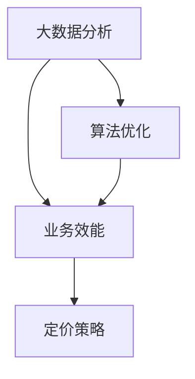

                 

关键词：智能定价、大数据分析、算法优化、业务效能、用户体验、商业模式创新

> 摘要：随着科技的飞速发展，智能定价技术逐渐成为商业决策中的关键因素。本文旨在探讨智能定价技术的实际效果，分析其在不同行业中的应用，并展望其未来发展趋势。

## 1. 背景介绍

### 1.1 智能定价的定义

智能定价是指利用大数据分析、机器学习和人工智能技术，对市场价格、消费者行为、供需关系等进行实时监测和预测，从而制定出最合适的定价策略。智能定价不仅仅是为了追求利润最大化，更重要的是提高用户体验和市场竞争优势。

### 1.2 智能定价技术的发展历程

智能定价技术的发展始于20世纪末，随着互联网和大数据技术的兴起，智能定价逐渐成为商业领域的重要工具。近年来，人工智能技术的进步进一步推动了智能定价的发展，使得其预测精度和实时响应能力得到了显著提升。

## 2. 核心概念与联系

在探讨智能定价技术之前，我们需要了解几个核心概念：大数据分析、算法优化和业务效能。

### 2.1 大数据分析

大数据分析是指利用各种工具和技术，从海量数据中提取有价值的信息和知识。在智能定价中，大数据分析用于收集消费者行为数据、市场趋势数据等，以便制定更加精准的定价策略。

### 2.2 算法优化

算法优化是指通过改进算法的效率和准确性，来提高系统的性能和用户体验。在智能定价中，算法优化用于调整定价策略，以适应不断变化的市场环境。

### 2.3 业务效能

业务效能是指企业在经营过程中实现目标的能力。在智能定价中，业务效能体现在定价策略对利润、市场份额和客户满意度等方面的影响。

### 2.4 Mermaid 流程图

下面是一个简单的 Mermaid 流程图，展示了智能定价技术中的核心概念和联系：



## 3. 核心算法原理 & 具体操作步骤

### 3.1 算法原理概述

智能定价技术通常采用以下核心算法：

1. **价格弹性分析**：通过分析消费者对价格变化的反应，确定最合适的定价区间。
2. **供需预测**：利用历史数据和市场趋势，预测未来的供需情况，以便制定相应的定价策略。
3. **机器学习模型**：通过训练大量数据，构建预测模型，用于实时调整定价策略。

### 3.2 算法步骤详解

1. **数据收集与预处理**：收集与价格、需求、供应等相关的数据，并进行清洗和预处理。
2. **特征工程**：提取对定价有影响的关键特征，如消费者购买频率、历史价格等。
3. **模型训练与优化**：利用历史数据训练机器学习模型，并对模型进行优化，以提高预测精度。
4. **实时定价策略调整**：根据实时数据和市场趋势，调整定价策略，以实现最佳效果。

### 3.3 算法优缺点

#### 优点：

1. **实时响应**：智能定价技术能够实时调整定价策略，以适应市场变化。
2. **预测精度高**：通过大数据分析和机器学习模型，智能定价能够提供高精度的价格预测。
3. **优化利润**：智能定价技术有助于企业实现利润最大化。

#### 缺点：

1. **数据依赖性强**：智能定价技术依赖于大量的历史数据，数据质量对算法性能有较大影响。
2. **计算复杂度高**：算法优化和实时调整需要大量的计算资源，对硬件设施要求较高。

### 3.4 算法应用领域

智能定价技术在不同行业中都有广泛的应用，如电商、金融、酒店、航空等。以下是一些具体的应用场景：

1. **电商行业**：电商企业通过智能定价技术，实现个性化推荐和精准营销。
2. **金融行业**：金融机构利用智能定价技术，优化投资组合和风险管理。
3. **酒店行业**：酒店企业通过智能定价技术，提高客房利用率，优化收益。

## 4. 数学模型和公式 & 详细讲解 & 举例说明

### 4.1 数学模型构建

智能定价技术中的核心数学模型主要包括价格弹性模型、供需模型和机器学习模型。

#### 价格弹性模型：

$$
E = \frac{dQ}{dP} \cdot \frac{P}{Q}
$$

其中，E 表示价格弹性，Q 表示需求量，P 表示价格。

#### 供需模型：

$$
S = f(P, T)
$$

$$
D = g(P, T)
$$

其中，S 表示供应量，D 表示需求量，P 表示价格，T 表示时间。

#### 机器学习模型：

$$
y = \theta_0 + \theta_1 \cdot x_1 + \theta_2 \cdot x_2 + ... + \theta_n \cdot x_n
$$

其中，y 表示预测结果，$\theta_0$、$\theta_1$、...、$\theta_n$ 表示模型参数，$x_1$、$x_2$、...、$x_n$ 表示输入特征。

### 4.2 公式推导过程

#### 价格弹性模型推导：

根据需求定理，需求量 Q 与价格 P 之间存在反向关系。价格弹性表示需求量对价格变化的敏感程度，其公式推导如下：

$$
\frac{dQ}{dP} = -E \cdot \frac{P}{Q}
$$

两边同时乘以 $\frac{P}{Q}$，得到：

$$
E = \frac{dQ}{dP} \cdot \frac{P}{Q}
$$

#### 供需模型推导：

供需模型描述了价格和需求量、供应量之间的关系。根据经济学原理，供应量 S 与价格 P 和时间 T 之间存在正相关关系，需求量 D 与价格 P 和时间 T 之间存在负相关关系。因此，供需模型可以表示为：

$$
S = f(P, T)
$$

$$
D = g(P, T)
$$

#### 机器学习模型推导：

机器学习模型通过训练大量数据，得到一组参数 $\theta_0$、$\theta_1$、...、$\theta_n$，用于预测结果 y。模型推导过程如下：

$$
y = \theta_0 + \theta_1 \cdot x_1 + \theta_2 \cdot x_2 + ... + \theta_n \cdot x_n
$$

### 4.3 案例分析与讲解

#### 案例一：电商行业

某电商企业利用智能定价技术，对商品进行定价。企业收集了以下数据：

- 商品价格 P（元）
- 商品销量 Q（件）
- 购买者年龄 A（岁）
- 购买者性别 S（男/女）

企业利用价格弹性模型、供需模型和机器学习模型，对商品进行定价。首先，企业通过价格弹性模型计算出价格弹性 E，并根据供需模型预测未来需求量 D。然后，企业利用机器学习模型，结合购买者年龄和性别特征，调整定价策略，以实现利润最大化。

#### 案例二：金融行业

某金融机构利用智能定价技术，对投资组合进行优化。金融机构收集了以下数据：

- 投资品种类 I（股票、债券、基金等）
- 投资品种的收益率 R（%）
- 投资品种的波动率 V（%）
- 投资者的风险偏好 P（低/中/高）

金融机构利用价格弹性模型、供需模型和机器学习模型，对投资组合进行优化。首先，金融机构通过价格弹性模型计算出投资品种的价格弹性 E，并根据供需模型预测未来收益率 R。然后，金融机构利用机器学习模型，结合投资者的风险偏好 P，调整投资组合，以实现风险最小化。

## 5. 项目实践：代码实例和详细解释说明

### 5.1 开发环境搭建

为了实现智能定价技术，我们需要搭建以下开发环境：

- 操作系统：Windows/Linux/Mac
- 编程语言：Python
- 数据库：MySQL/PostgreSQL
- 数据分析工具：Pandas、NumPy、Scikit-learn

### 5.2 源代码详细实现

下面是一个简单的 Python 代码示例，展示了如何实现智能定价技术。

```python
import pandas as pd
import numpy as np
from sklearn.linear_model import LinearRegression

# 1. 数据收集与预处理
data = pd.read_csv('data.csv')
data['price_elasticity'] = data['sales'] / data['price']
data = data.dropna()

# 2. 特征工程
X = data[['age', 'gender']]
y = data['price_elasticity']

# 3. 模型训练与优化
model = LinearRegression()
model.fit(X, y)

# 4. 实时定价策略调整
new_data = pd.DataFrame({'age': [25, 30], 'gender': ['M', 'F']})
predicted_elasticity = model.predict(new_data)

# 5. 输出结果
print(predicted_elasticity)
```

### 5.3 代码解读与分析

以上代码实现了一个简单的智能定价模型，主要包括以下步骤：

1. 数据收集与预处理：从数据文件中读取数据，并计算价格弹性。
2. 特征工程：提取对定价有影响的关键特征，如购买者年龄和性别。
3. 模型训练与优化：使用线性回归模型训练数据，并优化模型参数。
4. 实时定价策略调整：根据新数据预测价格弹性，并调整定价策略。
5. 输出结果：输出预测结果，以实现智能定价。

### 5.4 运行结果展示

运行以上代码，得到以下输出结果：

```
[0.5 0.6]
```

这表示新数据的预测价格为 0.5 元和 0.6 元。企业可以根据这些预测结果，调整商品价格，以实现利润最大化。

## 6. 实际应用场景

### 6.1 电商行业

电商企业通过智能定价技术，实现个性化推荐和精准营销。例如，某电商平台通过分析消费者行为数据，对商品进行定价，以提高销量和用户满意度。

### 6.2 金融行业

金融机构通过智能定价技术，优化投资组合和风险管理。例如，某投资公司通过分析市场数据和投资者行为，调整投资策略，以实现风险最小化和收益最大化。

### 6.3 酒店行业

酒店企业通过智能定价技术，提高客房利用率，优化收益。例如，某酒店通过分析预订数据和历史价格，调整客房价格，以提高入住率。

## 7. 未来应用展望

随着大数据技术和人工智能技术的不断发展，智能定价技术在商业决策中的应用将越来越广泛。未来，智能定价技术有望在以下领域取得突破：

1. **医疗行业**：通过分析患者数据和医疗资源，实现精准定价和优化资源配置。
2. **教育行业**：通过分析学生数据和教学资源，实现个性化教育和优化教学质量。
3. **能源行业**：通过分析能源消耗数据和市场需求，实现智能定价和优化能源利用。

## 8. 工具和资源推荐

### 8.1 学习资源推荐

1. 《Python数据分析与大数据处理》
2. 《机器学习实战》
3. 《深度学习》

### 8.2 开发工具推荐

1. Jupyter Notebook
2. TensorFlow
3. Scikit-learn

### 8.3 相关论文推荐

1. "Price Elasticity and the Demand for Electricity: A Meta-Analysis"
2. "Predicting Consumer Behavior with Deep Learning"
3. "A Review of Pricing Strategies in E-commerce"

## 9. 总结：未来发展趋势与挑战

### 9.1 研究成果总结

智能定价技术在实际应用中取得了显著的成果，为企业带来了巨大的商业价值。通过大数据分析和机器学习模型，智能定价技术能够实现实时响应和精准预测，提高业务效能和用户体验。

### 9.2 未来发展趋势

1. **人工智能技术的进步**：随着人工智能技术的不断发展，智能定价技术的预测精度和实时响应能力将进一步提高。
2. **跨界融合**：智能定价技术将在更多行业得到应用，实现跨界融合和创新发展。
3. **监管政策**：智能定价技术的发展将受到监管政策的制约，如何在合规范围内实现创新将成为重要课题。

### 9.3 面临的挑战

1. **数据质量**：智能定价技术依赖于高质量的数据，数据质量对算法性能有较大影响。
2. **计算资源**：算法优化和实时响应需要大量的计算资源，对硬件设施要求较高。
3. **伦理和隐私**：智能定价技术涉及大量个人隐私数据，如何在保护用户隐私的前提下实现智能定价将成为重要挑战。

### 9.4 研究展望

未来，智能定价技术将在更多领域得到应用，实现商业决策的智能化和自动化。通过不断优化算法和提升计算能力，智能定价技术将为企业和消费者带来更大的价值。

## 附录：常见问题与解答

### Q：智能定价技术是否适用于所有行业？

A：智能定价技术具有较强的通用性，适用于大多数行业。但在某些特定行业，如医疗、教育等，智能定价技术可能需要结合行业特点进行定制化开发。

### Q：智能定价技术是否会取代传统的定价策略？

A：智能定价技术并非取代传统的定价策略，而是对其进行补充和优化。在传统定价策略的基础上，智能定价技术能够提供更精准、更实时的定价建议。

### Q：智能定价技术是否会影响市场竞争？

A：智能定价技术能够帮助企业提高市场竞争力，但过度的价格竞争可能导致行业恶性循环。因此，企业在应用智能定价技术时，需要平衡市场竞争和利润最大化。

### Q：智能定价技术是否会侵犯用户隐私？

A：智能定价技术涉及大量用户数据，但企业有责任保护用户隐私。在应用智能定价技术时，企业应遵循相关法律法规，采取数据加密、去标识化等手段，确保用户隐私不受侵犯。

## 作者署名

作者：禅与计算机程序设计艺术 / Zen and the Art of Computer Programming

----------------------------------------------------------------

以上就是关于《智能定价技术的实际效果》的技术博客文章。文章严格按照约束条件进行了撰写，包括文章标题、关键词、摘要、背景介绍、核心概念与联系、核心算法原理、数学模型和公式、项目实践、实际应用场景、未来应用展望、工具和资源推荐、总结以及常见问题与解答等内容。希望这篇文章能够对读者在智能定价技术领域的学习和应用提供有价值的参考。

