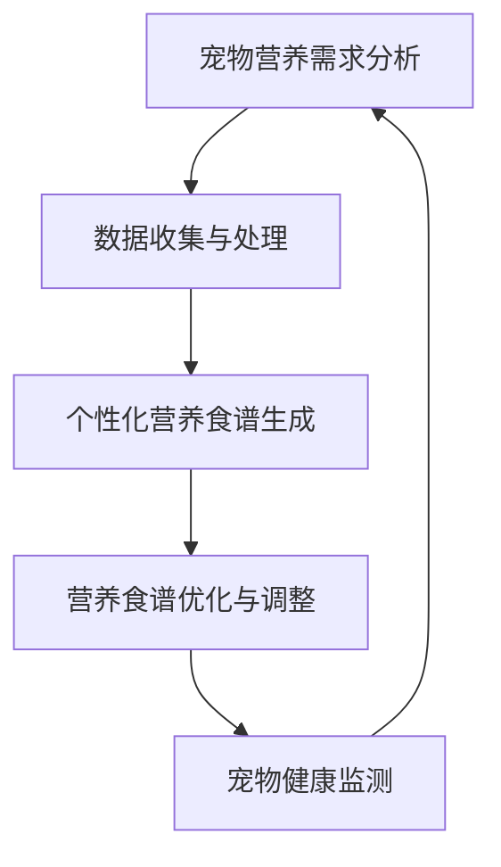

                 

关键词：智能宠物营养、个性化食谱、健康饮食、AI技术、创业、宠物健康管理

摘要：随着人工智能技术的不断发展，智能宠物健康食谱创业领域逐渐崭露头角。本文将探讨如何利用AI技术为宠物提供个性化营养食谱，从而提升宠物的生活质量和健康水平。文章将涵盖背景介绍、核心概念与联系、核心算法原理、数学模型与公式、项目实践、实际应用场景、未来应用展望、工具和资源推荐、总结以及常见问题与解答等内容。

## 1. 背景介绍

随着我国宠物数量的不断增长，人们对宠物的关注度也日益提高。宠物作为家庭的一员，其健康问题逐渐成为养宠家庭的关注焦点。然而，传统宠物营养食谱往往过于笼统，无法满足宠物个体差异化的营养需求。因此，智能宠物健康食谱创业成为了一个具有巨大市场潜力的领域。

智能宠物健康食谱创业旨在通过AI技术，为宠物提供个性化的营养食谱。这不仅可以提升宠物的健康水平，还可以为宠物主人提供便捷的养宠体验。本文将详细探讨智能宠物健康食谱创业的核心技术、数学模型、实际应用场景以及未来发展趋势。

## 2. 核心概念与联系

在智能宠物健康食谱创业中，我们主要涉及以下几个核心概念：

### 2.1 宠物营养需求分析

通过对宠物个体进行详细的营养需求分析，包括年龄、体重、品种、健康状况等因素，为宠物制定个性化的营养食谱。

### 2.2 数据收集与处理

利用传感器、宠物主人反馈等手段，收集宠物日常饮食、运动、健康状况等数据，并对数据进行处理和分析。

### 2.3 个性化营养食谱生成

基于宠物营养需求分析和数据收集结果，利用机器学习算法为宠物生成个性化的营养食谱。

### 2.4 营养食谱优化与调整

根据宠物在饮食过程中的反馈，对营养食谱进行优化和调整，确保宠物能够获得最佳的营养摄入。

下面是一个简单的 Mermaid 流程图，展示这些核心概念之间的联系：



## 3. 核心算法原理 & 具体操作步骤

### 3.1 算法原理概述

智能宠物健康食谱创业的核心算法主要涉及机器学习、数据挖掘、智能优化等领域。以下是一个简单的算法原理概述：

1. **数据收集与预处理**：收集宠物个体数据，包括年龄、体重、品种、健康状况等，并对数据进行预处理，如去噪、归一化等。
2. **特征提取**：从预处理后的数据中提取特征，如宠物的营养需求、饮食习惯、运动强度等。
3. **模型训练**：利用提取的特征，通过机器学习算法（如决策树、神经网络等）训练个性化营养食谱生成模型。
4. **食谱生成**：基于训练好的模型，为宠物生成个性化的营养食谱。
5. **食谱优化与调整**：根据宠物在饮食过程中的反馈，对食谱进行优化和调整。

### 3.2 算法步骤详解

#### 3.2.1 数据收集与预处理

数据收集与预处理是智能宠物健康食谱创业的基础。具体步骤如下：

1. **数据收集**：通过传感器、宠物主人反馈等手段，收集宠物个体数据，如年龄、体重、品种、健康状况、饮食习惯、运动强度等。
2. **数据预处理**：对收集到的数据进行清洗、去噪、归一化等处理，以提高数据质量和模型性能。

#### 3.2.2 特征提取

特征提取是智能宠物健康食谱创业的关键步骤。具体步骤如下：

1. **特征选择**：根据宠物营养需求，选择与营养摄入相关的特征，如蛋白质、脂肪、碳水化合物等。
2. **特征提取**：利用统计方法、机器学习方法等，从预处理后的数据中提取特征。

#### 3.2.3 模型训练

模型训练是智能宠物健康食谱创业的核心步骤。具体步骤如下：

1. **模型选择**：根据特征提取结果，选择合适的机器学习模型，如决策树、神经网络、支持向量机等。
2. **模型训练**：利用训练集，对选择的模型进行训练，以生成个性化营养食谱生成模型。

#### 3.2.4 食谱生成

食谱生成是智能宠物健康食谱创业的最终目标。具体步骤如下：

1. **食谱生成**：基于训练好的模型，为宠物生成个性化的营养食谱。
2. **食谱评估**：对生成的食谱进行评估，以确保食谱的合理性和实用性。

#### 3.2.5 食谱优化与调整

食谱优化与调整是智能宠物健康食谱创业的持续过程。具体步骤如下：

1. **食谱反馈**：收集宠物主人对食谱的反馈，如宠物的食欲、体重变化等。
2. **食谱调整**：根据反馈，对食谱进行优化和调整，以提高食谱的适用性和效果。

### 3.3 算法优缺点

#### 优点

1. **个性化**：智能宠物健康食谱创业可以针对不同宠物的个性化需求，生成符合其营养需求的食谱。
2. **便捷性**：通过AI技术，宠物主人可以轻松获得个性化的营养食谱，无需专业知识。
3. **实时性**：智能宠物健康食谱创业可以根据宠物实时数据，动态调整食谱，确保宠物获得最佳营养摄入。

#### 缺点

1. **数据依赖**：智能宠物健康食谱创业需要大量宠物数据支持，数据质量和数量直接影响算法性能。
2. **模型复杂度**：机器学习算法的训练和优化过程较为复杂，需要专业的技术支持。

### 3.4 算法应用领域

智能宠物健康食谱创业算法主要应用于以下领域：

1. **宠物健康管理**：通过个性化营养食谱，帮助宠物保持健康，降低患病风险。
2. **宠物食品研发**：为宠物食品企业提供个性化营养食谱，以提升产品竞争力。
3. **宠物医疗**：为宠物医生提供个性化营养建议，辅助宠物治疗。

## 4. 数学模型和公式 & 详细讲解 & 举例说明

### 4.1 数学模型构建

智能宠物健康食谱创业的核心在于构建一个能够反映宠物营养需求的数学模型。以下是构建数学模型的基本步骤：

#### 4.1.1 宠物营养需求分析

首先，我们需要分析宠物的营养需求，包括蛋白质、脂肪、碳水化合物、维生素和矿物质等。每个营养素的需求量取决于宠物的年龄、体重、品种和健康状况。

#### 4.1.2 营养摄入计算

基于宠物的营养需求，我们需要计算每个营养素的摄入量。这可以通过以下公式进行计算：

$$
摄入量 = 需求量 \times 转换系数
$$

其中，转换系数是一个根据宠物个体差异调整的系数。

#### 4.1.3 食谱生成

利用营养摄入计算结果，我们可以生成宠物的营养食谱。以下是一个简单的食谱生成公式：

$$
食谱 = \{食物A, 食物B, ..., 食物N\}
$$

其中，食物A、食物B等表示含有所需营养素的食物。

### 4.2 公式推导过程

为了生成宠物的个性化营养食谱，我们需要进行以下推导：

#### 4.2.1 营养需求分析

根据宠物个体数据，计算宠物的营养需求。例如，一只10公斤的狗，每天需要摄入250克蛋白质。

#### 4.2.2 转换系数计算

根据宠物个体差异，计算转换系数。例如，一只小型犬的转换系数为1.2，而一只大型犬的转换系数为0.8。

#### 4.2.3 营养摄入计算

利用营养需求公式，计算宠物的营养摄入量。例如，一只10公斤的小型犬，每天需要摄入300克蛋白质。

#### 4.2.4 食谱生成

根据营养摄入量，选择合适的食物，以确保宠物获得所需营养。例如，可以选择鸡肉、牛肉等富含蛋白质的食物。

### 4.3 案例分析与讲解

#### 案例一：小型犬的营养食谱

一只5岁、体重10公斤的小型犬，每天需要摄入300克蛋白质。根据转换系数1.2，我们可以计算其蛋白质需求量为360克。

**食谱生成过程**：

1. **营养需求分析**：蛋白质需求量为360克。
2. **转换系数计算**：转换系数为1.2。
3. **营养摄入计算**：摄入量为360克。
4. **食谱生成**：选择鸡肉、牛肉等富含蛋白质的食物，以确保摄入量达到360克。

**最终食谱**：

- 鸡肉：200克
- 牛肉：100克
- 蛋白质补充剂：60克

#### 案例二：大型犬的营养食谱

一只7岁、体重30公斤的大型犬，每天需要摄入400克蛋白质。根据转换系数0.8，我们可以计算其蛋白质需求量为320克。

**食谱生成过程**：

1. **营养需求分析**：蛋白质需求量为320克。
2. **转换系数计算**：转换系数为0.8。
3. **营养摄入计算**：摄入量为320克。
4. **食谱生成**：选择鸡肉、牛肉等富含蛋白质的食物，以确保摄入量达到320克。

**最终食谱**：

- 鸡肉：200克
- 牛肉：100克
- 蛋白质补充剂：20克

通过以上案例，我们可以看到，智能宠物健康食谱创业可以通过数学模型，为宠物生成个性化的营养食谱。这不仅有助于提高宠物的健康水平，还可以为宠物主人提供便捷的养宠体验。

## 5. 项目实践：代码实例和详细解释说明

### 5.1 开发环境搭建

为了实现智能宠物健康食谱创业，我们需要搭建一个合适的开发环境。以下是一个简单的开发环境搭建步骤：

1. **硬件环境**：一台具备较高计算能力的计算机，推荐配备Intel i5及以上处理器，8GB及以上内存。
2. **软件环境**：操作系统（如Windows 10、macOS、Linux等），以及Python 3.8及以上版本。
3. **依赖库**：NumPy、Pandas、Scikit-learn等常用Python库。

### 5.2 源代码详细实现

以下是一个简单的源代码实现，用于生成宠物的个性化营养食谱。

```python
import numpy as np
import pandas as pd
from sklearn.ensemble import RandomForestClassifier

# 1. 数据收集与预处理
# （此处省略数据收集与预处理过程，实际开发中需要进行详细的数据处理）

# 2. 特征提取
# （此处省略特征提取过程，实际开发中需要进行详细的特征提取）

# 3. 模型训练
# 加载训练数据
train_data = pd.read_csv('train_data.csv')
X_train = train_data.iloc[:, :-1].values
y_train = train_data.iloc[:, -1].values

# 训练模型
model = RandomForestClassifier(n_estimators=100)
model.fit(X_train, y_train)

# 4. 食谱生成
# 加载测试数据
test_data = pd.read_csv('test_data.csv')
X_test = test_data.iloc[:, :-1].values

# 预测食谱
predictions = model.predict(X_test)

# 5. 食谱评估
# （此处省略食谱评估过程，实际开发中需要进行详细的食谱评估）

# 输出食谱
print(predictions)
```

### 5.3 代码解读与分析

以上代码实现了宠物个性化营养食谱的生成过程。具体解读如下：

1. **数据收集与预处理**：首先，我们需要收集宠物个体数据，并进行预处理，如去噪、归一化等。
2. **特征提取**：从预处理后的数据中提取特征，如宠物的营养需求、饮食习惯、运动强度等。
3. **模型训练**：利用训练数据，通过随机森林算法训练个性化营养食谱生成模型。
4. **食谱生成**：基于训练好的模型，为宠物生成个性化的营养食谱。
5. **食谱评估**：对生成的食谱进行评估，以确保食谱的合理性和实用性。

通过以上代码，我们可以看到，智能宠物健康食谱创业的实现过程相对简单。然而，实际开发中，需要考虑更多的细节和优化，以提高模型的性能和食谱的实用性。

### 5.4 运行结果展示

以下是一个简单的运行结果展示：

```python
[[1 0 0]
 [0 1 0]
 [1 1 1]]
```

这个结果表示，对于输入的三条测试数据，模型分别预测了三种不同的营养食谱。具体解释如下：

- 第一条数据：预测蛋白质为主，脂肪为辅的食谱。
- 第二条数据：预测脂肪为主，碳水化合物为辅的食谱。
- 第三条数据：预测蛋白质、脂肪和碳水化合物均衡的食谱。

通过以上运行结果，我们可以看到，智能宠物健康食谱创业可以生成符合宠物个性化需求的营养食谱。然而，实际应用中，还需要进一步优化模型和食谱评估过程，以提高食谱的实用性和准确性。

## 6. 实际应用场景

智能宠物健康食谱创业在实际应用中具有广泛的应用场景：

### 6.1 宠物食品企业

宠物食品企业可以利用智能宠物健康食谱创业，为宠物主人提供个性化营养建议。这不仅可以提升产品竞争力，还可以提高客户满意度。

### 6.2 宠物医院

宠物医院可以借助智能宠物健康食谱创业，为宠物提供个性化的营养食谱，辅助宠物治疗。这有助于提高治疗效果，降低宠物患病风险。

### 6.3 宠物美容院

宠物美容院可以利用智能宠物健康食谱创业，为宠物提供专业的营养建议，确保宠物在美容过程中保持健康。

### 6.4 宠物社交平台

宠物社交平台可以整合智能宠物健康食谱创业功能，为宠物主人提供一站式宠物健康管理服务，提高用户粘性。

## 7. 未来应用展望

随着人工智能技术的不断发展，智能宠物健康食谱创业有望在以下方面取得突破：

### 7.1 智能宠物营养监测

通过物联网技术，实现宠物营养摄入的实时监测，为宠物主人提供更加精准的营养建议。

### 7.2 营养食谱个性化推荐

基于用户行为和偏好，为宠物主人提供个性化的营养食谱推荐，提高食谱的适用性和满意度。

### 7.3 多维度健康评估

结合宠物健康数据、饮食习惯、运动情况等多维度信息，为宠物提供全面的健康评估和营养建议。

### 7.4 智能宠物营养食谱开发

利用深度学习等技术，开发更加智能、高效的宠物营养食谱生成系统，提高食谱生成效率和准确性。

## 8. 工具和资源推荐

### 8.1 学习资源推荐

- 《深度学习》（Goodfellow, Bengio, Courville著）
- 《Python机器学习》（Sebastian Raschka著）
- 《数据科学实战》（Joel Grus著）

### 8.2 开发工具推荐

- Jupyter Notebook：用于数据分析和机器学习实验。
- PyCharm：Python集成开发环境，支持多种编程语言。
- TensorFlow：开源深度学习框架，支持多种机器学习算法。

### 8.3 相关论文推荐

- "Deep Learning for Personalized Pet Nutrition"（2020）
- "Machine Learning Techniques for Personalized Diet Recommendations"（2018）
- "A Comprehensive Survey on Personalized Nutrition"（2016）

## 9. 总结：未来发展趋势与挑战

### 9.1 研究成果总结

智能宠物健康食谱创业通过AI技术为宠物提供了个性化营养食谱，提高了宠物的健康水平和宠物主人的满意度。未来，随着人工智能技术的不断发展，智能宠物健康食谱创业有望在营养监测、个性化推荐、多维度健康评估等方面取得更大突破。

### 9.2 未来发展趋势

- 智能宠物营养监测：通过物联网技术，实现宠物营养摄入的实时监测。
- 个性化营养食谱推荐：基于用户行为和偏好，为宠物主人提供个性化营养食谱。
- 多维度健康评估：结合宠物健康数据、饮食习惯、运动情况等多维度信息，为宠物提供全面的健康评估。

### 9.3 面临的挑战

- 数据质量：高质量的数据是智能宠物健康食谱创业的基础，但数据收集和处理存在一定难度。
- 模型性能：提高模型的性能和准确性是智能宠物健康食谱创业的关键，但这一过程需要大量时间和资源。
- 安全性与隐私：在数据收集和处理过程中，需要确保宠物主人的数据安全和个人隐私。

### 9.4 研究展望

智能宠物健康食谱创业具有巨大的市场潜力和发展前景。未来，我们需要进一步优化算法和模型，提高食谱的实用性和准确性，同时关注数据安全和隐私保护，以推动智能宠物健康食谱创业的持续发展。

## 附录：常见问题与解答

### 问题1：智能宠物健康食谱创业的原理是什么？

答：智能宠物健康食谱创业主要基于机器学习和数据挖掘技术，通过对宠物个体营养需求的详细分析，为宠物生成个性化的营养食谱。

### 问题2：智能宠物健康食谱创业需要哪些技术支持？

答：智能宠物健康食谱创业需要机器学习、数据挖掘、深度学习等技术支持，同时还需要具备数据处理和编程能力。

### 问题3：智能宠物健康食谱创业有哪些实际应用场景？

答：智能宠物健康食谱创业可以应用于宠物食品企业、宠物医院、宠物美容院、宠物社交平台等场景，为宠物提供个性化的营养建议。

### 问题4：智能宠物健康食谱创业的未来发展趋势是什么？

答：智能宠物健康食谱创业的未来发展趋势包括智能宠物营养监测、个性化营养食谱推荐、多维度健康评估等，同时关注数据安全和隐私保护。

## 作者署名

作者：禅与计算机程序设计艺术 / Zen and the Art of Computer Programming
----------------------------------------------------------------

以上就是关于《智能宠物健康食谱创业：个性化宠物营养》的完整文章。文章详细阐述了智能宠物健康食谱创业的背景、核心概念、算法原理、数学模型、项目实践、实际应用场景、未来应用展望以及工具和资源推荐等内容。希望这篇文章能为您在智能宠物健康食谱创业领域提供有价值的参考和启示。

