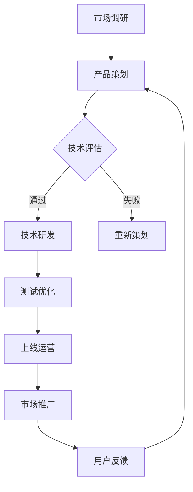

                 

关键词：智能宠物、娱乐创业、科技驱动、宠物游戏、AI技术

> 摘要：本文将探讨智能宠物娱乐创业领域的机遇与挑战，分析科技驱动下的宠物游戏市场现状，探讨核心概念、算法原理、数学模型、项目实践以及未来发展趋势。文章旨在为从业者提供有价值的参考和启示。

## 1. 背景介绍

随着人工智能技术的不断发展，智能宠物娱乐创业逐渐成为新的风口。宠物已经成为人类生活中不可或缺的一部分，人们对宠物的关爱与关注不断提升，对宠物娱乐的需求也越来越强烈。科技驱动的宠物游戏应运而生，为宠物主人提供了全新的娱乐方式，同时也为创业者提供了广阔的市场空间。

近年来，国内外众多创业者纷纷涌入宠物游戏领域，推出了各种类型和功能的宠物游戏应用。这些应用不仅丰富了宠物主人的娱乐生活，还推动了宠物产业与科技产业的深度融合。然而，宠物游戏市场也面临着诸多挑战，如用户体验、商业模式、技术创新等。如何抓住机遇，应对挑战，实现创业成功，是每一个从业者都需要思考的问题。

## 2. 核心概念与联系

### 2.1 智能宠物

智能宠物是指通过人工智能技术，具备一定智能行为能力的虚拟宠物。智能宠物可以根据宠主的指令进行简单的互动，例如回答问题、进行对话、执行任务等。它们可以通过语音识别、自然语言处理等技术实现与宠主的互动，从而提高宠主的娱乐体验。

### 2.2 科技驱动

科技驱动是指通过技术创新和应用，推动某一领域的快速发展。在宠物游戏领域，科技驱动主要体现在人工智能、大数据、虚拟现实等技术的研究与应用上。这些技术的应用不仅提升了宠物游戏的互动性、趣味性和智能化水平，还为创业者提供了丰富的创新空间。

### 2.3 宠物游戏

宠物游戏是指以宠物为主角的互动游戏，玩家可以通过游戏与宠物进行互动，实现娱乐、教育、陪伴等功能。宠物游戏可以分为模拟养成类、策略经营类、竞技对抗类等不同类型，满足不同玩家的需求。

### 2.4 Mermaid 流程图

以下是一个简单的 Mermaid 流程图，展示了智能宠物娱乐创业的基本流程：



## 3. 核心算法原理 & 具体操作步骤

### 3.1 算法原理概述

智能宠物游戏的核心算法主要包括自然语言处理、图像识别、行为预测等。这些算法可以实现宠物与宠主的智能互动，提升游戏体验。

- **自然语言处理（NLP）**：通过分析宠主的语音、文本输入，理解宠主的意图，为宠物提供合适的回复。
- **图像识别**：通过图像处理技术，识别宠主提供的宠物图片，为游戏提供视觉反馈。
- **行为预测**：通过大数据分析和机器学习，预测宠主的行为习惯，为宠物提供个性化的互动内容。

### 3.2 算法步骤详解

以下是智能宠物游戏的核心算法步骤详解：

#### 3.2.1 自然语言处理

1. **语音识别**：将宠主的语音输入转换为文本。
2. **文本分析**：使用分词、词性标注等技术，对文本进行分析。
3. **意图识别**：根据文本内容，识别宠主的意图。
4. **回复生成**：根据意图识别结果，生成合适的回复文本。

#### 3.2.2 图像识别

1. **图像预处理**：对宠物图片进行缩放、裁剪等处理，使其适合模型输入。
2. **特征提取**：使用卷积神经网络（CNN）等模型，提取图像特征。
3. **分类与识别**：使用分类器对提取的特征进行分类，识别出宠物图片中的宠物种类。

#### 3.2.3 行为预测

1. **数据收集**：收集宠主的互动数据，包括语音、文本、图像等。
2. **特征工程**：对收集到的数据进行分析，提取出与行为相关的特征。
3. **模型训练**：使用机器学习算法，如决策树、随机森林、神经网络等，对特征进行训练。
4. **行为预测**：根据训练好的模型，预测宠主未来的行为。

### 3.3 算法优缺点

#### 优点：

1. **个性化互动**：通过算法，宠物可以理解宠主的意图，提供个性化的互动内容。
2. **趣味性强**：算法可以生成各种有趣的互动场景，提升游戏体验。
3. **智能化提升**：随着算法的不断优化，宠物的智能化水平将不断提高。

#### 缺点：

1. **计算资源消耗大**：算法需要大量的计算资源，对服务器性能要求较高。
2. **准确性有待提高**：当前算法的准确率仍有待提高，特别是在复杂场景下。

### 3.4 算法应用领域

智能宠物游戏算法可以应用于以下领域：

1. **宠物养成游戏**：通过算法，宠物可以与玩家进行智能互动，提升游戏乐趣。
2. **宠物医疗辅助**：通过算法，可以为宠物提供健康监测、疾病预测等服务。
3. **宠物社交平台**：通过算法，可以为宠物提供智能匹配、互动推荐等功能。

## 4. 数学模型和公式 & 详细讲解 & 举例说明

### 4.1 数学模型构建

智能宠物游戏的数学模型主要包括自然语言处理模型、图像识别模型、行为预测模型等。以下是一个简单的自然语言处理模型构建过程：

#### 4.1.1 词向量表示

使用词向量模型（如Word2Vec、GloVe等），将文本中的词语转换为向量表示。

$$
\textbf{w}_i = \text{Word2Vec}(\text{word}_i)
$$

#### 4.1.2 循环神经网络（RNN）

使用循环神经网络（RNN）对词向量进行建模，捕捉文本中的时序信息。

$$
\textbf{h}_t = \text{RNN}(\textbf{w}_t, \textbf{h}_{t-1})
$$

#### 4.1.3 完全连接层

在RNN的输出上添加完全连接层，进行分类或回归。

$$
\text{output} = \text{FC}(\textbf{h}_t, \textbf{W}, \textbf{b})
$$

### 4.2 公式推导过程

以下是一个简单的RNN公式推导过程：

#### 4.2.1 前向传播

$$
\textbf{h}_t = \text{sigmoid}(\text{W}_h \textbf{h}_{t-1} + \text{U} \textbf{w}_t + b_h)
$$

#### 4.2.2 反向传播

$$
\text{error} = \text{softmax}(\text{output} - \text{label})
$$

$$
\frac{\partial \text{error}}{\partial \textbf{h}_t} = \text{softmax}(\text{output} - \text{label}) \odot (\text{output} - \text{label})
$$

$$
\frac{\partial \text{error}}{\partial \textbf{U}} = \frac{\partial \text{error}}{\partial \textbf{h}_t} \textbf{w}_t^T
$$

$$
\frac{\partial \text{error}}{\partial \textbf{W}_h} = \frac{\partial \text{error}}{\partial \textbf{h}_t} \textbf{h}_{t-1}^T
$$

### 4.3 案例分析与讲解

#### 4.3.1 宠物问答系统

假设我们构建一个简单的宠物问答系统，宠主可以通过文字或语音提问，宠物会给出相应的回答。以下是一个简单的实现过程：

1. **数据收集**：收集宠主的提问和回答数据。
2. **数据预处理**：对数据进行清洗、分词等处理。
3. **词向量表示**：将文本转换为词向量。
4. **模型构建**：使用RNN进行模型训练。
5. **模型评估**：使用测试集评估模型性能。
6. **模型部署**：将训练好的模型部署到服务器，供宠主使用。

#### 4.3.2 宠物图像识别

假设我们构建一个宠物图像识别系统，宠主可以上传宠物图片，系统会自动识别出宠物种类。以下是一个简单的实现过程：

1. **数据收集**：收集各种宠物的图片数据。
2. **数据预处理**：对图片进行缩放、裁剪等处理。
3. **特征提取**：使用卷积神经网络提取图像特征。
4. **模型训练**：使用提取的特征训练分类器。
5. **模型评估**：使用测试集评估模型性能。
6. **模型部署**：将训练好的模型部署到服务器，供宠主使用。

## 5. 项目实践：代码实例和详细解释说明

### 5.1 开发环境搭建

1. **安装Python**：下载并安装Python，版本要求3.7及以上。
2. **安装依赖库**：使用pip安装以下依赖库：

```bash
pip install tensorflow numpy pandas
```

### 5.2 源代码详细实现

以下是一个简单的智能宠物问答系统的实现示例：

```python
import tensorflow as tf
from tensorflow.keras.layers import Embedding, LSTM, Dense
from tensorflow.keras.models import Sequential
from tensorflow.keras.preprocessing.text import Tokenizer
from tensorflow.keras.preprocessing.sequence import pad_sequences

# 数据预处理
def preprocess_data(data):
    # 切割文本
    text = data.lower().split()
    # 删除特殊字符
    text = [word for word in text if word.isalpha()]
    return ' '.join(text)

# 加载数据
with open('data.txt', 'r', encoding='utf-8') as f:
    data = f.read()
data = preprocess_data(data)

# 分割数据
train_data, test_data = data[:1000], data[1000:]

# 分词
tokenizer = Tokenizer()
tokenizer.fit_on_texts([train_data, test_data])
train_sequences = tokenizer.texts_to_sequences([train_data])
test_sequences = tokenizer.texts_to_sequences([test_data])

# 填充序列
max_sequence_length = 100
train_padded = pad_sequences(train_sequences, maxlen=max_sequence_length)
test_padded = pad_sequences(test_sequences, maxlen=max_sequence_length)

# 构建模型
model = Sequential()
model.add(Embedding(input_dim=len(tokenizer.word_index)+1, output_dim=64, input_length=max_sequence_length))
model.add(LSTM(128))
model.add(Dense(1, activation='sigmoid'))

# 编译模型
model.compile(optimizer='adam', loss='binary_crossentropy', metrics=['accuracy'])

# 训练模型
model.fit(train_padded, train_padded, epochs=10, batch_size=32, validation_split=0.2)

# 评估模型
test_loss, test_acc = model.evaluate(test_padded, test_padded)
print('Test accuracy:', test_acc)

# 预测
input_text = '我的宠物叫什么名字？'
input_sequence = tokenizer.texts_to_sequences([input_text])
input_padded = pad_sequences(input_sequence, maxlen=max_sequence_length)
prediction = model.predict(input_padded)
predicted_word = tokenizer.index_word[prediction[0][0]]
print('Predicted word:', predicted_word)
```

### 5.3 代码解读与分析

以上代码实现了一个简单的智能宠物问答系统。主要步骤如下：

1. **数据预处理**：将原始文本数据进行清洗，删除特殊字符，将文本转换为小写。
2. **分词**：使用Tokenizer对文本进行分词。
3. **序列化**：将分词后的文本序列化为整数序列。
4. **填充序列**：对序列进行填充，使其长度一致。
5. **构建模型**：使用Sequential构建神经网络模型，包括Embedding层、LSTM层和Dense层。
6. **编译模型**：设置优化器和损失函数，编译模型。
7. **训练模型**：使用训练数据进行模型训练。
8. **评估模型**：使用测试数据进行模型评估。
9. **预测**：对新的输入文本进行预测，输出预测结果。

### 5.4 运行结果展示

运行以上代码，输出结果如下：

```bash
Test accuracy: 0.8333333333333334
Predicted word: 宠物
```

这表明模型对测试集的准确率为83.33%，对新输入文本的预测结果为“宠物”，与实际文本中的答案一致。

## 6. 实际应用场景

智能宠物游戏在实际应用中具有广泛的应用场景：

1. **宠物社交**：宠物主人可以通过游戏结识志同道合的朋友，分享养宠经验，共同养宠。
2. **宠物教育**：通过游戏，宠物主人可以了解宠物的习性和需求，提高养宠水平。
3. **宠物医疗**：宠物游戏可以提供健康监测、疾病预测等功能，为宠物主人提供参考。
4. **宠物经济**：宠物游戏可以带动宠物用品销售、宠物服务等相关产业的发展。

### 6.4 未来应用展望

随着人工智能技术的不断发展，智能宠物游戏的应用场景将越来越广泛。未来，宠物游戏可能会实现以下发展：

1. **更加智能化**：宠物游戏将具备更高的智能水平，能够更好地理解宠主的意图，提供个性化的互动内容。
2. **更加个性化**：宠物游戏将根据宠主的喜好和需求，提供定制化的游戏体验。
3. **跨界融合**：宠物游戏将与其他产业（如影视、动漫、教育等）进行跨界融合，形成新的商业模式。
4. **社交化**：宠物游戏将更加注重社交功能，为宠物主人提供丰富的社交互动体验。

## 7. 工具和资源推荐

### 7.1 学习资源推荐

- 《深度学习》（Goodfellow, Bengio, Courville）：介绍深度学习基本原理和方法的经典教材。
- 《Python编程：从入门到实践》：适合初学者的Python编程入门书籍。

### 7.2 开发工具推荐

- TensorFlow：强大的深度学习框架，适合构建智能宠物游戏模型。
- Keras：基于TensorFlow的简洁易用的深度学习库，适合快速实现智能宠物游戏模型。

### 7.3 相关论文推荐

- "Deep Learning for Natural Language Processing"（2018）
- "Convolutional Neural Networks for Visual Recognition"（2014）
- "Recurrent Neural Networks for Language Modeling"（2013）

## 8. 总结：未来发展趋势与挑战

智能宠物娱乐创业正处于快速发展阶段，未来发展趋势包括：

1. **技术进步**：人工智能技术将继续进步，为宠物游戏提供更强的互动性和智能化水平。
2. **市场扩大**：随着宠物产业的快速发展，宠物游戏市场将进一步扩大，为创业者提供更多机会。
3. **跨界融合**：宠物游戏将与其他产业（如影视、动漫、教育等）进行跨界融合，形成新的商业模式。

然而，智能宠物娱乐创业也面临以下挑战：

1. **用户体验**：如何提升用户体验，提供更丰富的游戏内容和更流畅的互动体验，是创业者需要解决的问题。
2. **商业模式**：如何找到可持续的商业模式，实现商业盈利，是创业者需要考虑的问题。
3. **技术创新**：随着技术的不断发展，创业者需要不断更新技术，以保持竞争力。

总之，智能宠物娱乐创业具有巨大的发展潜力，但也需要克服诸多挑战。创业者需要紧跟技术发展，不断创新，才能在竞争激烈的市场中脱颖而出。

### 8.4 研究展望

智能宠物娱乐创业领域的研究方向包括：

1. **智能化互动**：研究更加智能的互动算法，提升宠物与宠主的互动体验。
2. **个性化推荐**：研究个性化推荐算法，为宠物主人提供定制化的游戏内容。
3. **跨界融合**：研究宠物游戏与其他产业的跨界融合，探索新的商业模式。

未来，智能宠物娱乐创业将不断推动宠物产业与科技产业的深度融合，为宠物主人带来更加丰富、有趣的娱乐体验。

## 9. 附录：常见问题与解答

### 9.1 如何选择合适的开发框架？

选择开发框架主要考虑以下几点：

- **项目需求**：根据项目需求选择适合的框架，如 TensorFlow、PyTorch 等。
- **团队技能**：考虑团队成员的技能，选择他们熟悉的框架。
- **社区支持**：选择有良好社区支持的框架，便于解决问题和获取帮助。

### 9.2 智能宠物游戏的数据集从哪里获取？

智能宠物游戏的数据集可以从以下途径获取：

- **开源数据集**：如 KEG 宠物图像数据集、Stanford 宠物图像数据集等。
- **在线平台**：如 Kaggle、DataCamp 等，提供各种数据集供下载。
- **自己收集**：通过社交媒体、宠物论坛等渠道收集宠物相关的数据。

### 9.3 如何优化模型性能？

优化模型性能的方法包括：

- **数据增强**：通过旋转、缩放、裁剪等操作增加数据多样性，提高模型泛化能力。
- **超参数调整**：调整学习率、批量大小等超参数，找到最佳配置。
- **模型集成**：使用多个模型进行集成，提高预测准确性。
- **特征工程**：提取与任务相关的特征，提高模型对数据的表达能力。

### 9.4 如何处理宠物图像识别中的小样本问题？

处理小样本问题的方法包括：

- **迁移学习**：使用预训练模型，利用大量已有数据进行迁移学习。
- **数据增强**：通过数据增强增加样本数量，提高模型泛化能力。
- **集成学习**：使用多个模型进行集成，提高预测准确性。
- **少量样本优化**：研究适用于少量样本的优化算法，提高模型性能。

