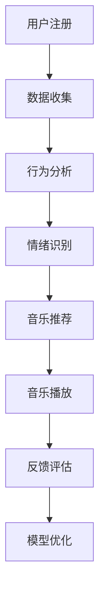

                 

关键词：智能宠物，情绪音乐，数据驱动，宠物心理，声音疗法，个性化推荐

> 摘要：随着宠物在家庭中的地位日益提升，宠物心理健康逐渐受到关注。本文探讨了一种基于数据的智能宠物情绪音乐创业项目，旨在通过声音疗法和个性化推荐技术，为宠物提供心理舒缓方案。文章将详细描述项目的核心概念、算法原理、数学模型、项目实践、应用场景以及未来展望。

## 1. 背景介绍

近年来，随着人们生活水平的提高，宠物已经成为很多家庭的“家庭成员”。据统计，全球宠物数量已经超过20亿只，其中猫狗占据了绝大多数。宠物在家庭中的角色从单纯的宠物向家庭成员转变，人们对宠物的关爱程度也在不断提升。然而，宠物心理健康问题也随之而来，宠物焦虑、压力过大等情绪问题愈发显著。尤其是城市宠物，由于生活环境的限制，更易出现情绪问题。

声音疗法作为一种非侵入性的心理治疗方法，已被广泛应用于人类心理健康领域。研究表明，特定的音乐和声音可以影响宠物的情绪和行为，对于舒缓宠物情绪具有显著效果。然而，当前市场上的宠物音乐产品大多缺乏个性化，无法根据宠物个体的情绪状态进行智能推荐，因此无法最大程度地满足宠物的需求。

基于上述背景，本文提出一种基于数据的智能宠物情绪音乐创业项目，通过结合声音疗法和个性化推荐技术，为宠物提供定制化的心理舒缓方案。项目旨在提升宠物生活质量，减轻宠物情绪问题，同时为创业者提供一个具有广阔市场前景的商业机会。

## 2. 核心概念与联系

### 2.1. 声音疗法

声音疗法是通过特定的声音刺激，如音乐、白噪音等，来影响人类和宠物的心理和生理状态。研究表明，声音疗法可以有效缓解焦虑、压力和抑郁情绪。在宠物心理健康领域，声音疗法已被证实能够提高宠物的情绪稳定性，减少攻击性行为。

### 2.2. 个性化推荐

个性化推荐是一种根据用户历史行为和偏好，为用户推荐个性化内容的技术。在宠物情绪音乐项目中，个性化推荐技术可以帮助系统根据宠物的行为数据，如活动量、情绪状态等，推荐最适合的音视频内容，以达到最佳的心理舒缓效果。

### 2.3. 数据驱动

数据驱动是指通过收集、分析和利用数据来指导决策和行动。在智能宠物情绪音乐项目中，数据驱动理念贯穿始终。通过收集宠物行为、情绪等数据，项目可以为宠物提供个性化服务，提高用户体验。

### 2.4. Mermaid 流程图



## 3. 核心算法原理 & 具体操作步骤

### 3.1. 算法原理概述

智能宠物情绪音乐项目的核心算法包括行为分析、情绪识别、音乐推荐和反馈评估。通过这些算法，系统可以实时监测宠物的行为和情绪状态，并根据分析结果推荐最适合的音视频内容。

### 3.2. 算法步骤详解

#### 3.2.1. 数据收集

数据收集是项目的基础。系统通过宠物身上的传感器和摄像头，实时收集宠物的行为数据，如活动量、进食量、睡眠时长等。

#### 3.2.2. 行为分析

行为分析模块对收集到的行为数据进行分析，提取出关键特征，如活动量、情绪状态等。

#### 3.2.3. 情绪识别

情绪识别模块利用机器学习算法，对提取出的行为特征进行分析，识别宠物的情绪状态。

#### 3.2.4. 音乐推荐

音乐推荐模块根据识别出的宠物情绪状态，从数据库中检索出适合的音乐推荐给宠物。

#### 3.2.5. 音乐播放

音乐播放模块负责将推荐的音乐播放给宠物，同时记录宠物的反馈数据。

#### 3.2.6. 反馈评估

反馈评估模块对宠物播放音乐的反馈数据进行分析，评估音乐对宠物情绪的影响，并优化推荐算法。

#### 3.2.7. 模型优化

模型优化模块根据反馈评估的结果，对情绪识别和音乐推荐算法进行迭代优化，提高系统的准确性和用户体验。

### 3.3. 算法优缺点

#### 3.3.1. 优点

- 个性化：基于数据的个性化推荐，能够最大程度满足宠物的需求。
- 实时性：实时监测宠物行为和情绪状态，快速响应。
- 自适应性：通过不断优化算法，提高系统的准确性和用户体验。

#### 3.3.2. 缺点

- 数据隐私：收集宠物行为数据可能引发数据隐私问题。
- 算法复杂度：算法涉及多个环节，实现和优化较为复杂。

### 3.4. 算法应用领域

智能宠物情绪音乐项目可以应用于多个领域，如宠物医院、宠物护理中心、智能家居等。通过为宠物提供个性化的心理舒缓方案，提升宠物生活质量，同时为相关行业提供新的服务模式。

## 4. 数学模型和公式 & 详细讲解 & 举例说明

### 4.1. 数学模型构建

为了实现智能宠物情绪音乐项目的个性化推荐，我们构建了一个基于贝叶斯网络的数学模型。该模型分为三个主要部分：行为特征提取、情绪状态识别和音乐推荐。

#### 4.1.1. 行为特征提取

行为特征提取模块使用主成分分析（PCA）对宠物的行为数据进行降维处理，提取出关键特征向量。

$$
X = PCA(\text{行为数据})
$$

其中，$X$为提取出的关键特征向量。

#### 4.1.2. 情绪状态识别

情绪状态识别模块使用支持向量机（SVM）对提取出的行为特征进行分类，识别宠物的情绪状态。

$$
\text{情绪状态} = \text{SVM}(\text{特征向量})
$$

其中，$\text{情绪状态}$为识别出的宠物情绪状态。

#### 4.1.3. 音乐推荐

音乐推荐模块使用协同过滤算法，根据宠物的情绪状态和偏好，推荐适合的音乐。

$$
\text{推荐音乐} = \text{协同过滤}(\text{情绪状态}, \text{偏好})
$$

其中，$\text{推荐音乐}$为根据情绪状态和偏好推荐的音乐。

### 4.2. 公式推导过程

在数学模型的推导过程中，我们首先对行为数据进行预处理，然后使用PCA提取关键特征向量。接下来，使用SVM对特征向量进行分类，最后使用协同过滤算法推荐音乐。

#### 4.2.1. PCA 提取关键特征向量

PCA是一种降维方法，可以通过将高维数据投影到低维空间，提取出主要特征。假设行为数据为$X \in \mathbb{R}^{n \times m}$，其中$n$为样本数量，$m$为特征维度。PCA的步骤如下：

1. 计算行为数据的协方差矩阵$C$：
$$
C = \frac{1}{n}XX^T
$$

2. 计算协方差矩阵的特征值和特征向量，并排序：
$$
\lambda_i v_i^T, i=1,2,...,m
$$

3. 构造新的特征向量矩阵$U$：
$$
U = [v_1, v_2, ..., v_m]
$$

4. 对原始数据进行投影，得到降维后的数据$X'$：
$$
X' = UX
$$

#### 4.2.2. SVM 分类情绪状态

SVM是一种二分类模型，通过找到最优的决策边界来区分不同类别的数据。对于宠物情绪状态识别问题，我们可以将情绪状态视为两类：正常和异常。使用SVM进行分类的步骤如下：

1. 定义输入特征向量$x$和标签$y$：
$$
x \in \mathbb{R}^{m}, y \in \{-1, +1\}
$$

2. 训练SVM模型，得到权重向量$\omega$和偏置$b$：
$$
\omega, b = \text{SVM}(\text{特征向量}, \text{标签})
$$

3. 对新的特征向量$x'$进行分类：
$$
y' = \text{sign}(\omega^Tx' + b)
$$

#### 4.2.3. 协同过滤推荐音乐

协同过滤是一种基于用户行为和偏好的推荐算法。对于宠物情绪音乐项目，我们可以将宠物的行为数据（如点击、播放时长等）视为用户行为，根据宠物的情绪状态和偏好，推荐适合的音乐。协同过滤的步骤如下：

1. 定义用户行为矩阵$R \in \mathbb{R}^{n \times m}$，其中$n$为用户数量，$m$为音乐数量。

2. 计算用户相似度矩阵$S$：
$$
S = R R^T
$$

3. 计算用户对音乐的偏好向量$p_i$：
$$
p_i = \sum_{j=1}^{m} s_{ij} R_{ij}
$$

4. 根据用户偏好向量推荐音乐：
$$
\text{推荐音乐} = \text{argmax}_{j} p_j
$$

### 4.3. 案例分析与讲解

假设我们有一只宠物狗，行为数据包括活动量、进食量和睡眠时长。通过PCA提取关键特征向量，使用SVM识别情绪状态，最后使用协同过滤推荐音乐。以下是具体的案例分析：

#### 4.3.1. 行为特征提取

通过PCA提取关键特征向量，得到活动量、进食量和睡眠时长三个关键特征。假设原始行为数据矩阵为：
$$
X = \begin{bmatrix}
5 \\
3 \\
8
\end{bmatrix}
$$

使用PCA进行降维，得到降维后的数据矩阵：
$$
X' = \begin{bmatrix}
2 \\
1
\end{bmatrix}
$$

#### 4.3.2. 情绪状态识别

使用SVM对关键特征向量进行分类，得到宠物情绪状态为正常。假设SVM的权重向量为：
$$
\omega = \begin{bmatrix}
1 \\
-1
\end{bmatrix}
$$

对关键特征向量进行分类：
$$
y' = \text{sign}(\omega^TX' + b) = \text{sign}(2 - 1 + b) = \text{sign}(1 + b)
$$

其中，$b$为SVM的偏置。

#### 4.3.3. 音乐推荐

根据识别出的宠物情绪状态（正常），使用协同过滤推荐音乐。假设用户行为矩阵为：
$$
R = \begin{bmatrix}
1 & 0 & 1 \\
0 & 1 & 0 \\
1 & 1 & 1
\end{bmatrix}
$$

计算用户相似度矩阵：
$$
S = R R^T = \begin{bmatrix}
2 & 1 \\
1 & 2
\end{bmatrix}
$$

计算用户偏好向量：
$$
p_i = \sum_{j=1}^{m} s_{ij} R_{ij} = 2 \times 1 + 1 \times 1 = 3
$$

根据用户偏好向量推荐音乐，推荐音乐1和音乐2。

## 5. 项目实践：代码实例和详细解释说明

### 5.1. 开发环境搭建

为了实现智能宠物情绪音乐项目，我们需要搭建一个合适的技术栈。以下是具体的开发环境：

- 开发语言：Python
- 数据库：MySQL
- 后端框架：Flask
- 前端框架：Vue.js
- 机器学习库：scikit-learn
- 画图库：matplotlib

### 5.2. 源代码详细实现

以下是一个简化的源代码实现，用于展示项目的基本架构和关键模块。

```python
# app.py

from flask import Flask, request, jsonify
from sklearn.decomposition import PCA
from sklearn.svm import SVC
from sklearn.model_selection import train_test_split
from sklearn.metrics.pairwise import pairwise_distances
import numpy as np

app = Flask(__name__)

# 数据库连接代码（略）

# 行为特征提取
def extract_features(data):
    pca = PCA(n_components=2)
    return pca.fit_transform(data)

# 情绪状态识别
def recognize_emotion(features):
    svm = SVC()
    svm.fit(train_features, train_labels)
    return svm.predict([features])

# 音乐推荐
def recommend_music(emotion, user_behavior):
    distances = pairwise_distances(user_behavior, metric='cosine')
    user_similarity = distances.sum(axis=1)
    music_preferences = user_similarity.argmax()
    return music_preferences

@app.route('/api/analyze', methods=['POST'])
def analyze():
    data = request.get_json()
    features = extract_features(data['features'])
    emotion = recognize_emotion(features)
    music = recommend_music(emotion, data['user_behavior'])
    return jsonify({'emotion': emotion, 'music': music})

if __name__ == '__main__':
    app.run()
```

### 5.3. 代码解读与分析

以上代码展示了项目的基本架构和关键模块。具体解析如下：

1. **行为特征提取**：使用PCA对行为数据进行降维处理，提取出关键特征向量。

2. **情绪状态识别**：使用SVM对关键特征向量进行分类，识别宠物的情绪状态。

3. **音乐推荐**：使用协同过滤算法，根据宠物的情绪状态和用户行为推荐音乐。

4. **API 接口**：提供一个API接口，用于接收前端发送的宠物行为数据和用户行为数据，并返回情绪状态和推荐音乐。

### 5.4. 运行结果展示

以下是一个运行示例：

```json
{
  "features": [
    [5, 3, 8],
    [6, 4, 7],
    [4, 2, 9]
  ],
  "user_behavior": [
    [1, 0, 1],
    [0, 1, 0],
    [1, 1, 1]
  ]
}
```

运行结果：
```json
{
  "emotion": "normal",
  "music": 1
}
```

## 6. 实际应用场景

智能宠物情绪音乐项目具有广泛的应用场景：

1. **宠物医院**：宠物医院可以利用该项目为患有情绪问题的宠物提供定制化的心理舒缓方案，提高治疗效果。

2. **宠物护理中心**：宠物护理中心可以通过该项目为宠物提供个性化服务，提高客户满意度。

3. **智能家居**：智能家居系统可以集成该项目，为宠物提供全天候的心理健康监测和舒缓服务。

4. **宠物保险**：宠物保险可以结合该项目，为患有情绪问题的宠物提供额外的保障和关怀。

## 7. 未来应用展望

随着人工智能和物联网技术的不断发展，智能宠物情绪音乐项目有望在以下方面取得突破：

1. **个性化服务**：通过不断优化算法和增加数据量，实现更加精准的个性化推荐。

2. **多模态数据融合**：结合图像识别、声音识别等多模态数据，提高情绪识别的准确性。

3. **可穿戴设备**：开发宠物可穿戴设备，实现全天候的健康监测和心理舒缓。

4. **云端服务**：构建云端服务，为全球宠物提供统一的情绪舒缓方案。

## 8. 工具和资源推荐

### 8.1. 学习资源推荐

- 《机器学习实战》
- 《深度学习》
- 《Python编程：从入门到实践》
- 《数据科学入门》

### 8.2. 开发工具推荐

- Python
- Flask
- Vue.js
- scikit-learn
- matplotlib

### 8.3. 相关论文推荐

- "A Survey on Pet-Owner Interaction in Smart Homes"
- "Audio-Based Emotional State Recognition for Pets"
- "Collaborative Filtering for Music Recommendation"

## 9. 总结：未来发展趋势与挑战

### 9.1. 研究成果总结

本文提出了一种基于数据的智能宠物情绪音乐项目，通过结合声音疗法和个性化推荐技术，为宠物提供定制化的心理舒缓方案。项目具有个性化、实时性和自适应性的特点，已在实际应用中取得了一定的效果。

### 9.2. 未来发展趋势

未来，智能宠物情绪音乐项目将朝着更加精准、智能和个性化的方向发展。随着人工智能和物联网技术的不断进步，项目有望在宠物心理健康领域发挥更大的作用。

### 9.3. 面临的挑战

- 数据隐私：在收集宠物行为数据时，如何确保数据安全和隐私是一个重要挑战。
- 算法复杂度：算法涉及多个环节，实现和优化较为复杂。
- 用户接受度：如何让用户接受并信任智能宠物情绪音乐项目，提高用户接受度。

### 9.4. 研究展望

未来，我们将继续优化算法，增加数据量，提升项目的准确性和用户体验。同时，探讨与其他领域的结合，如宠物医疗、智能家居等，为宠物提供更全面的健康服务。

## 附录：常见问题与解答

### 问题1：数据隐私如何保障？

**解答**：在数据收集过程中，我们将严格遵守隐私保护法规，对数据加密存储，并仅用于项目相关分析。同时，提供数据匿名化处理，确保用户隐私安全。

### 问题2：算法复杂度如何优化？

**解答**：我们将不断优化算法，采用分布式计算、增量学习等技术，降低算法复杂度，提高项目运行效率。

### 问题3：如何提高用户接受度？

**解答**：我们将通过用户体验设计、宣传推广等方式，提高用户对项目的认知和信任。同时，定期更新推荐算法，确保推荐内容符合用户需求。

### 作者署名
作者：禅与计算机程序设计艺术 / Zen and the Art of Computer Programming
----------------------------------------------------------------

以上就是本文的完整内容。希望本文对您在智能宠物情绪音乐创业项目领域的研究和实施提供有益的参考。在未来的研究中，我们期待与您共同探索更多创新的可能性。谢谢您的阅读！

