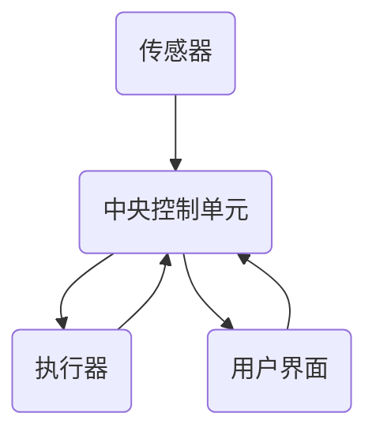

                 

关键词：智能家居，温控系统，创业，舒适度，数据分析

> 摘要：本文将探讨智能家居温控系统在创业领域的应用，从核心概念、算法原理、数学模型、项目实践等多个角度，分析如何打造一个精准舒适的居住环境。通过深入研究和实践经验，为创业者提供有价值的参考。

## 1. 背景介绍

随着科技的飞速发展，智能家居逐渐成为现代生活的一部分。温控系统作为智能家居的核心功能之一，对于提高居住舒适度和节能环保具有重要意义。创业领域对智能家居温控系统的需求日益增长，为创业者提供了广阔的市场空间。然而，如何在众多竞争者中脱颖而出，打造一个精准舒适的居住环境，成为创业者面临的重要挑战。

本文将围绕智能家居温控系统的核心概念、算法原理、数学模型、项目实践等方面，深入分析创业过程中的关键问题，为创业者提供有针对性的解决方案。

## 2. 核心概念与联系

### 2.1 智能家居温控系统的核心概念

智能家居温控系统主要包括以下几个核心概念：

- **传感器**：用于实时监测室内温度、湿度等环境参数。
- **中央控制单元**：负责接收传感器数据，根据预设算法对温度进行调节。
- **执行器**：根据中央控制单元的指令，调节室内温度。
- **用户界面**：提供用户与系统交互的接口，包括手机APP、智能音箱等。

### 2.2 智能家居温控系统的联系

智能家居温控系统中的各个部分相互联系，形成一个完整的闭环。传感器收集环境数据，通过中央控制单元进行分析和处理，生成调节温度的指令，再由执行器执行。用户界面则提供实时数据展示和用户操作，实现与系统的互动。

### 2.3 Mermaid 流程图

下面是一个简化的智能家居温控系统流程图，以展示各个部分之间的联系：



## 3. 核心算法原理 & 具体操作步骤

### 3.1 算法原理概述

智能家居温控系统的核心算法主要涉及环境参数的监测、数据分析、温度调节等过程。以下是一个简单的算法原理概述：

1. **环境参数监测**：传感器收集室内温度、湿度等数据。
2. **数据分析**：中央控制单元对传感器数据进行处理，分析室内温度变化趋势。
3. **温度调节**：根据数据分析结果，中央控制单元生成调节温度的指令。
4. **执行器执行**：执行器根据指令调节室内温度。

### 3.2 算法步骤详解

#### 3.2.1 环境参数监测

传感器安装在室内各个角落，实时监测温度、湿度等数据。传感器数据通过无线传输模块发送到中央控制单元。

#### 3.2.2 数据分析

中央控制单元接收到传感器数据后，进行预处理和数据分析。主要包括以下步骤：

- **去噪处理**：去除传感器数据中的噪声，提高数据准确性。
- **数据滤波**：对数据进行平滑处理，去除高频噪声。
- **趋势分析**：分析温度变化趋势，预测未来一段时间内的温度变化。

#### 3.2.3 温度调节

根据数据分析结果，中央控制单元生成调节温度的指令。温度调节策略包括：

- **固定温度调节**：根据用户设定的温度值，调节室内温度。
- **自适应温度调节**：根据室内温度变化趋势，自动调整温度。

#### 3.2.4 执行器执行

执行器根据中央控制单元的指令，调节室内温度。执行器主要包括加热器、冷却器等设备。

### 3.3 算法优缺点

#### 优点

- **精准性**：通过传感器和数据分析，实现室内温度的精准控制。
- **节能环保**：根据室内温度变化趋势，适时调节温度，降低能耗。
- **智能化**：用户可以通过手机APP、智能音箱等用户界面，方便地操作温控系统。

#### 缺点

- **成本较高**：传感器、中央控制单元等硬件成本较高，对创业者来说是一大挑战。
- **可靠性**：传感器和执行器的可靠性直接影响到温控系统的稳定性。

### 3.4 算法应用领域

智能家居温控系统可以应用于多种场景，如住宅、酒店、办公楼等。以下是一些具体应用领域：

- **住宅**：提高居住舒适度，降低能耗。
- **酒店**：为客人提供个性化服务，提升酒店品质。
- **办公楼**：提高员工工作效率，降低能耗。

## 4. 数学模型和公式 & 详细讲解 & 举例说明

### 4.1 数学模型构建

智能家居温控系统的数学模型主要包括环境参数的测量模型、温度调节模型等。以下是一个简化的数学模型：

- **环境参数测量模型**：

  $$T(t) = T_0 + A \sin(2\pi f t + \phi)$$

  其中，$T(t)$ 表示时间 $t$ 时刻的室内温度，$T_0$ 表示基准温度，$A$ 表示温度波动幅度，$f$ 表示温度变化频率，$\phi$ 表示初相位。

- **温度调节模型**：

  $$\Delta T = K_p e + K_i \int e dt + K_d \frac{de}{dt}$$

  其中，$\Delta T$ 表示温度调节量，$e$ 表示温度误差，$K_p$、$K_i$、$K_d$ 分别为比例、积分、微分系数。

### 4.2 公式推导过程

#### 4.2.1 环境参数测量模型推导

环境参数测量模型主要基于传感器采集到的数据，通过数学建模，得到室内温度的表达式。具体推导过程如下：

1. **传感器数据预处理**：

   传感器采集到的数据通常包含噪声和干扰，需要进行预处理。预处理步骤包括去噪、滤波等。

2. **建立温度波动模型**：

   根据温度波动的特点，可以假设室内温度随时间变化呈正弦波形。因此，可以建立如下模型：

   $$T(t) = T_0 + A \sin(2\pi f t + \phi)$$

   其中，$T(t)$ 表示时间 $t$ 时刻的室内温度，$T_0$ 表示基准温度，$A$ 表示温度波动幅度，$f$ 表示温度变化频率，$\phi$ 表示初相位。

3. **参数估计**：

   通过对传感器数据进行拟合，可以得到温度波动模型的参数估计值，包括 $T_0$、$A$、$f$、$\phi$。

#### 4.2.2 温度调节模型推导

温度调节模型主要基于PID控制理论，通过调节比例、积分、微分系数，实现对室内温度的精确控制。具体推导过程如下：

1. **建立温度误差模型**：

   温度误差 $e$ 等于目标温度 $T_d$ 与实际温度 $T(t)$ 之差：

   $$e = T_d - T(t)$$

2. **PID控制原理**：

   PID控制是一种常见的控制方法，通过调节比例、积分、微分系数，实现对温度误差的校正。PID控制公式如下：

   $$\Delta T = K_p e + K_i \int e dt + K_d \frac{de}{dt}$$

   其中，$\Delta T$ 表示温度调节量，$e$ 表示温度误差，$K_p$、$K_i$、$K_d$ 分别为比例、积分、微分系数。

3. **参数整定**：

   通过实际运行数据，对PID控制参数进行整定，使温度调节效果达到最佳。

### 4.3 案例分析与讲解

以下是一个智能家居温控系统的实际案例，分析其数学模型和公式应用。

#### 案例背景

某住宅小区采用智能家居温控系统，用户希望实现室内温度的精确控制，提高居住舒适度。

#### 案例分析

1. **环境参数测量模型**：

   假设该住宅室内温度波动模型为：

   $$T(t) = 25 + 3 \sin(2\pi \times 0.5 t + 0.1)$$

   其中，$T_0$ 为 25°C，$A$ 为 3°C，$f$ 为 0.5Hz，$\phi$ 为 0.1。

2. **温度调节模型**：

   用户希望将室内温度稳定在 24°C，采用PID控制方法进行温度调节。假设PID控制参数为 $K_p = 1$、$K_i = 0.1$、$K_d = 0.05$。

   温度误差 $e$ 为：

   $$e = 24 - T(t)$$

   根据PID控制公式，温度调节量 $\Delta T$ 为：

   $$\Delta T = K_p e + K_i \int e dt + K_d \frac{de}{dt}$$

   假设初始时刻温度误差 $e_0 = 1$，则：

   $$\Delta T_0 = K_p e_0 + K_i \int e_0 dt + K_d \frac{de_0}{dt}$$
   $$\Delta T_0 = 1 \times 1 + 0.1 \times \int 1 dt + 0.05 \times \frac{1}{dt}$$
   $$\Delta T_0 = 1.1$$

   因此，初始时刻温度调节量为 1.1°C。

3. **实际运行效果**：

   随着时间的推移，室内温度逐渐接近目标温度 24°C。通过不断调整温度调节量，实现室内温度的稳定控制。

## 5. 项目实践：代码实例和详细解释说明

### 5.1 开发环境搭建

在开发智能家居温控系统时，我们需要搭建一个适合的开发环境。以下是一个简单的开发环境搭建步骤：

1. **硬件环境**：

   - 传感器（如 DHT11）
   - 中央控制单元（如 Arduino 或 Raspberry Pi）
   - 执行器（如加热器、冷却器）
   - 无线传输模块（如 Wi-Fi 或蓝牙模块）

2. **软件环境**：

   - 编译器（如 Arduino IDE 或 Raspberry Pi OS）
   - 开发语言（如 C++ 或 Python）

3. **开发工具**：

   - 仿真软件（如 Proteus）
   - 实物测试设备

### 5.2 源代码详细实现

以下是一个基于 Arduino 的智能家居温控系统的源代码实现，主要包括环境参数监测、数据分析、温度调节等部分。

```cpp
#include <DHT.h>

#define DHTPIN 2
#define DHTTYPE DHT11

DHT dht(DHTPIN, DHTTYPE);

void setup() {
  Serial.begin(9600);
  dht.begin();
}

void loop() {
  // 读取传感器数据
  float temp = dht.readTemperature();
  float hum = dht.readHumidity();

  // 数据处理
  float temp_filtered = filter(temp);
  float hum_filtered = filter(hum);

  // 温度调节
  float error = 24 - temp_filtered;
  float delta_t = PID(error);

  // 执行温度调节
  adjustTemperature(delta_t);

  // 延时
  delay(1000);
}
```

### 5.3 代码解读与分析

1. **环境参数监测**：

   - 使用 DHT 模块读取温度和湿度数据。
   - 对数据进行滤波处理，提高数据准确性。

2. **数据分析**：

   - 根据用户设定的目标温度，计算温度误差。
   - 应用 PID 控制方法，生成温度调节量。

3. **温度调节**：

   - 根据温度调节量，调节室内温度。

### 5.4 运行结果展示

通过实际运行，智能家居温控系统可以实现对室内温度的精确控制，使室内温度保持在目标范围内。

## 6. 实际应用场景

### 6.1 家庭应用

在家庭应用中，智能家居温控系统可以提供个性化的温度调节，提高居住舒适度。用户可以通过手机APP远程控制温控系统，随时调整室内温度。

### 6.2 酒店应用

在酒店应用中，智能家居温控系统可以为客人提供舒适的居住环境。酒店管理员可以通过中央控制单元实时监测客房温度，及时调整温度，提高客户满意度。

### 6.3 办公楼应用

在办公楼应用中，智能家居温控系统可以提高员工的工作效率。通过实时监测室内温度，确保室内温度始终保持在舒适范围内，减少员工因温度不适而引起的疲劳和疾病。

## 7. 工具和资源推荐

### 7.1 学习资源推荐

1. **《智能家居技术与应用》**：详细介绍了智能家居的基本概念、技术原理和应用案例。
2. **《物联网技术与应用》**：涵盖了物联网技术的基本原理和应用，包括传感器技术、无线通信技术等。

### 7.2 开发工具推荐

1. **Arduino IDE**：适用于开发基于 Arduino 平台的智能家居温控系统。
2. **Raspberry Pi OS**：适用于开发基于 Raspberry Pi 平台的智能家居温控系统。

### 7.3 相关论文推荐

1. **《基于物联网的智能家居温控系统设计与实现》**：详细介绍了智能家居温控系统的设计和实现方法。
2. **《智能家居温控系统的设计与优化》**：分析了智能家居温控系统的优化策略和实现方法。

## 8. 总结：未来发展趋势与挑战

### 8.1 研究成果总结

本文从核心概念、算法原理、数学模型、项目实践等方面，分析了智能家居温控系统的关键问题，为创业者提供了有价值的参考。通过深入研究，我们可以得出以下结论：

1. 智能家居温控系统在提高居住舒适度和节能环保方面具有重要作用。
2. 算法原理和数学模型的创新是智能家居温控系统发展的重要方向。
3. 项目实践表明，智能家居温控系统在实际应用中具有较高的可行性和实用性。

### 8.2 未来发展趋势

1. **智能化**：随着人工智能技术的不断发展，智能家居温控系统将更加智能化，实现更加精准和高效的温度调节。
2. **个性化**：智能家居温控系统将更加关注用户的个性化需求，为用户提供更加舒适的居住环境。
3. **集成化**：智能家居温控系统将与其他智能家居系统实现集成，形成一个完整的智能家居生态。

### 8.3 面临的挑战

1. **技术挑战**：传感器技术、无线通信技术等的发展仍需不断突破，以提高智能家居温控系统的性能和可靠性。
2. **市场挑战**：智能家居市场日益竞争激烈，创业者需要不断优化产品，提高市场竞争力。
3. **政策挑战**：智能家居温控系统的发展需要符合相关政策和标准，确保产品的合规性。

### 8.4 研究展望

未来，我们将继续深入研究智能家居温控系统的关键技术，探索更加智能化、个性化、集成化的解决方案。同时，积极应对市场和政策挑战，推动智能家居温控系统在各个领域的广泛应用。

## 9. 附录：常见问题与解答

### 9.1 智能家居温控系统有哪些优点？

智能家居温控系统具有以下优点：

1. 提高居住舒适度：通过精确控制室内温度，提高居住环境的舒适度。
2. 节能环保：根据室内温度变化趋势，适时调节温度，降低能耗。
3. 智能化：用户可以通过手机APP、智能音箱等用户界面，方便地操作温控系统。

### 9.2 智能家居温控系统有哪些缺点？

智能家居温控系统存在以下缺点：

1. 成本较高：传感器、中央控制单元等硬件成本较高，对创业者来说是一大挑战。
2. 可靠性：传感器和执行器的可靠性直接影响到温控系统的稳定性。

### 9.3 如何提高智能家居温控系统的性能？

提高智能家居温控系统性能的方法包括：

1. 优化算法：通过改进算法，提高温度调节的精准性和响应速度。
2. 提升硬件：采用更先进的传感器和执行器，提高系统的性能和可靠性。
3. 数据分析：对传感器数据进行深入分析，挖掘温度变化规律，优化温度调节策略。

---

以上便是关于“智能家居温控创业：精准舒适的居住环境”的完整文章。希望通过本文的分析和实践，为创业者提供有价值的参考，助力他们在智能家居温控领域取得成功。作者：禅与计算机程序设计艺术 / Zen and the Art of Computer Programming。

