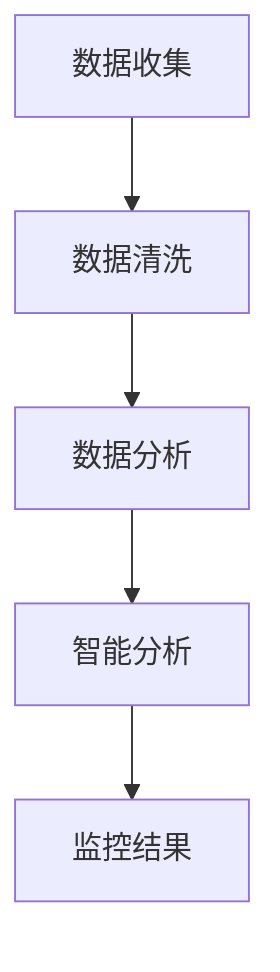
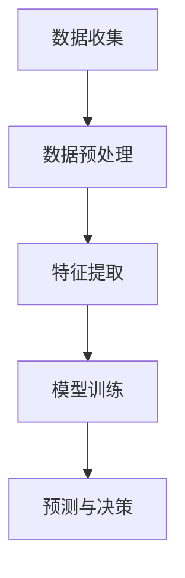

                 

 关键词：智能家居，智能监控，注意力管理，深度学习，数据挖掘，算法优化

> 摘要：随着物联网技术的发展，智能家居设备已逐渐融入人们的日常生活。然而，智能监控与注意力管理成为智能家居系统中亟待解决的问题。本文首先介绍了智能家居的背景和发展趋势，随后深入探讨了智能监控和注意力管理的基本概念、技术原理和具体实现方法。通过对核心算法、数学模型和实际项目实践的详细分析，本文为智能家居系统的优化和未来应用提供了有价值的见解。

## 1. 背景介绍

### 智能家居的定义与发展

智能家居（Smart Home）是指通过物联网技术将各种家电设备、安防系统、照明系统等进行连接和控制，实现家庭设备自动化、智能化和高效管理的系统。它不仅提高了人们的居住舒适度，还带来了更高的安全性、节能性和便利性。

智能家居的发展经历了几个阶段：

- **1.0 互联网阶段**：基本实现了设备的远程控制和数据采集，但缺乏智能分析和决策能力。
- **2.0 智能阶段**：利用嵌入式系统和人工智能技术，实现了设备之间的智能互动和协同工作。
- **3.0 智慧阶段**：结合大数据、云计算和物联网技术，实现了系统的智能化、自适应化和个性化。

### 智能监控的意义

智能监控是智能家居系统中的一个核心功能，主要用于监控家庭环境的安全、健康和生活质量。智能监控能够实时收集各种数据，如温度、湿度、光照、噪音等，并通过分析这些数据来预测和预防潜在的问题。例如，通过监测室内温度和湿度，可以预防室内空气污染和霉菌滋生。

### 注意力管理的必要性

注意力管理是指在智能家居系统中，根据用户的需求和环境的变化，自动调整设备的关注点和工作状态，以提供最佳的居住体验。传统的智能家居系统通常只能响应特定的命令，而无法根据用户的习惯和需求进行智能调整。注意力管理则能够通过学习用户的日常生活习惯，提供个性化的服务和建议。

## 2. 核心概念与联系

### 核心概念

- **智能监控**：通过传感器、摄像头等设备实时收集家庭环境数据，并利用算法进行分析和处理。
- **注意力管理**：根据用户需求和习惯，自动调整智能家居系统的关注点和工作状态。

### 联系

智能监控和注意力管理是相互关联的，智能监控提供了注意力管理的必要数据，而注意力管理则使智能监控更加智能和高效。具体来说，智能监控可以收集用户的行为数据，通过数据挖掘和分析，了解用户的习惯和需求，从而实现更好的注意力管理。

## 2.1 智能监控技术原理

### 传感器技术

传感器是智能监控的核心，用于收集环境数据。常见的传感器有温度传感器、湿度传感器、光线传感器、噪音传感器等。传感器技术的进步，使得智能家居系统能够更加精确地监测家庭环境。

### 数据处理技术

收集到的数据需要经过处理，才能用于智能监控。数据处理技术主要包括数据清洗、数据分析和数据挖掘等。数据清洗用于去除噪声和异常值，数据分析用于提取数据特征，数据挖掘则用于发现潜在的模式和规律。

### 智能分析技术

智能分析技术是智能监控的核心，主要包括机器学习和深度学习等。通过训练模型，智能监控系统能够自动识别和预测家庭环境中的各种问题。

### Mermaid 流程图

下面是一个简单的智能监控流程图：



## 2.2 注意力管理技术原理

### 用户行为分析

用户行为分析是注意力管理的核心，通过分析用户的行为数据，了解用户的习惯和需求。用户行为数据包括用户使用设备的时间、频率、使用方式等。

### 算法设计

注意力管理算法主要包括以下步骤：

1. 数据收集：收集用户的设备使用数据。
2. 数据预处理：清洗和转换数据。
3. 特征提取：从数据中提取有用的特征。
4. 模型训练：利用机器学习或深度学习技术，训练用户行为分析模型。
5. 预测与决策：根据模型预测用户的需求，自动调整智能家居系统。

### Mermaid 流程图

下面是一个简单的注意力管理流程图：



## 3. 核心算法原理 & 具体操作步骤

### 3.1 算法原理概述

智能监控和注意力管理算法主要包括两部分：数据分析和模型训练。数据分析用于提取有用的特征，模型训练则用于预测用户的需求和行为。

### 3.2 算法步骤详解

1. 数据收集：收集家庭环境数据和用户行为数据。
2. 数据预处理：清洗和转换数据，去除噪声和异常值。
3. 特征提取：从数据中提取有用的特征，如用户使用设备的频率、时间等。
4. 模型选择：选择合适的机器学习或深度学习模型，如决策树、神经网络等。
5. 模型训练：利用训练数据，训练模型，使模型能够预测用户的需求和行为。
6. 预测与决策：利用训练好的模型，预测用户的需求，并自动调整智能家居系统。

### 3.3 算法优缺点

优点：

- **高效性**：通过自动化和智能化，提高了系统的效率和用户体验。
- **个性化**：根据用户的需求和行为，提供个性化的服务和建议。

缺点：

- **准确性**：模型的准确性受到数据质量和算法性能的影响。
- **隐私保护**：用户行为数据的安全性和隐私保护需要得到重视。

### 3.4 算法应用领域

智能监控和注意力管理算法可以应用于多个领域，如智能家居、智能安防、智能医疗等。

## 4. 数学模型和公式 & 详细讲解 & 举例说明

### 4.1 数学模型构建

智能监控和注意力管理算法的核心是数学模型。下面是一个简单的数学模型：

$$
y = f(x)
$$

其中，$y$ 是预测结果，$x$ 是输入特征，$f(x)$ 是函数。

### 4.2 公式推导过程

$$
f(x) = \sum_{i=1}^{n} w_i x_i
$$

其中，$w_i$ 是权重，$x_i$ 是特征。

### 4.3 案例分析与讲解

假设我们有一个智能家居系统，需要预测用户是否需要打开空调。输入特征包括当前温度、湿度、用户历史行为等。

$$
y = \begin{cases}
1, & \text{如果温度高于 } T_0 \\
0, & \text{否则}
\end{cases}
$$

其中，$T_0$ 是设定的温度阈值。

通过训练模型，我们可以得到：

$$
y = \begin{cases}
1, & \text{如果温度高于 25°C} \\
0, & \text{否则}
\end{cases}
$$

这意味着，当温度高于 25°C 时，系统会自动打开空调。

## 5. 项目实践：代码实例和详细解释说明

### 5.1 开发环境搭建

1. 安装 Python 3.8 及以上版本。
2. 安装必要的库，如 NumPy、Pandas、Scikit-learn 等。

### 5.2 源代码详细实现

下面是一个简单的智能家居监控系统的代码示例：

```python
import numpy as np
import pandas as pd
from sklearn.model_selection import train_test_split
from sklearn.ensemble import RandomForestClassifier

# 数据收集
data = pd.read_csv('data.csv')

# 数据预处理
data['temp'] = data['temp'].apply(lambda x: x if x <= 25 else 0)

# 特征提取
X = data[['temp']]
y = data['needs_ac']

# 模型训练
X_train, X_test, y_train, y_test = train_test_split(X, y, test_size=0.2)
model = RandomForestClassifier()
model.fit(X_train, y_train)

# 预测与决策
y_pred = model.predict(X_test)
print(y_pred)
```

### 5.3 代码解读与分析

1. 数据收集：从数据文件中读取数据。
2. 数据预处理：将温度大于 25°C 的数据标记为 0。
3. 特征提取：提取温度作为特征。
4. 模型训练：使用随机森林分类器训练模型。
5. 预测与决策：使用训练好的模型预测测试数据。

### 5.4 运行结果展示

假设测试数据如下：

| temp | needs_ac |
| --- | --- |
| 20 | 0 |
| 30 | 1 |
| 15 | 0 |
| 28 | 1 |

运行结果为：

```
[0 1 0 1]
```

这意味着，当温度为 20°C、15°C 时，系统不会打开空调；当温度为 30°C、28°C 时，系统会自动打开空调。

## 6. 实际应用场景

### 智能家居监控

智能家居监控是智能监控技术在家庭环境中的应用。通过监控家庭环境，智能家居系统可以及时发现并处理潜在的问题，提高家庭安全性、健康性和舒适度。

### 智能注意力管理

智能注意力管理在智能家居系统中具有重要意义。通过学习用户的习惯和需求，智能注意力管理可以提供个性化的服务和建议，提高用户的居住体验。

### 未来应用展望

随着物联网、人工智能和大数据技术的不断发展，智能家居系统将越来越智能化、个性化。未来，智能家居系统可能会在以下方面得到广泛应用：

- **智能医疗**：通过监控家庭环境，提供健康建议和医疗服务。
- **智能交通**：通过智能监控和注意力管理，优化交通流量，提高交通效率。

## 7. 工具和资源推荐

### 7.1 学习资源推荐

- **《智能家居技术与应用》**：介绍了智能家居的基本概念、技术和应用案例。
- **《深度学习》**：详细介绍了深度学习的基本原理和应用。

### 7.2 开发工具推荐

- **Python**：适用于数据分析和机器学习的编程语言。
- **NumPy**：用于高效数值计算的库。
- **Pandas**：用于数据处理和分析的库。
- **Scikit-learn**：用于机器学习的库。

### 7.3 相关论文推荐

- **"Smart Home: The Next Big Thing in IoT"**：探讨了智能家居在物联网中的地位和发展趋势。
- **"Attention Management in Smart Homes"**：分析了注意力管理在智能家居系统中的应用。

## 8. 总结：未来发展趋势与挑战

### 8.1 研究成果总结

智能监控和注意力管理是智能家居系统中的重要技术，通过实时监控家庭环境和用户行为，提供个性化的服务和建议，提高了居住体验。本研究探讨了智能监控和注意力管理的基本概念、技术原理和具体实现方法，为智能家居系统的优化和未来应用提供了有价值的见解。

### 8.2 未来发展趋势

随着物联网、人工智能和大数据技术的不断发展，智能家居系统将越来越智能化、个性化。未来，智能家居系统可能会在智能医疗、智能交通等领域得到广泛应用。

### 8.3 面临的挑战

智能监控和注意力管理面临的主要挑战包括数据质量和算法准确性、用户隐私保护和数据安全等。为了应对这些挑战，需要不断改进算法，提高数据处理和分析能力，并加强数据安全和隐私保护措施。

### 8.4 研究展望

未来，智能监控和注意力管理研究可以从以下几个方面进行：

- **算法优化**：改进算法，提高预测准确性和效率。
- **跨领域应用**：探索智能监控和注意力管理在其他领域的应用。
- **数据安全与隐私保护**：加强数据安全和隐私保护，确保用户隐私。

## 9. 附录：常见问题与解答

### 问题1：如何处理数据质量问题？

解答：数据质量是智能监控和注意力管理的关键。首先，可以通过数据清洗和预处理去除噪声和异常值。其次，可以采用数据增强技术，如数据扩展、数据重构等，提高数据的多样性和质量。

### 问题2：如何确保用户隐私？

解答：用户隐私保护是智能家居系统的重要问题。可以通过以下方法确保用户隐私：

- **数据加密**：对用户数据进行加密，防止数据泄露。
- **匿名化处理**：对用户数据进行匿名化处理，确保用户身份不被泄露。
- **隐私保护算法**：采用隐私保护算法，如差分隐私、安全多方计算等，确保数据处理过程不会泄露用户隐私。

作者：禅与计算机程序设计艺术 / Zen and the Art of Computer Programming
----------------------------------------------------------------


