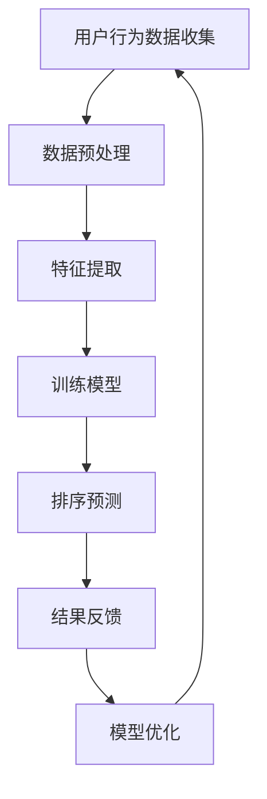

                 

关键词：智能排序算法、搜索结果排序、用户满意度、机器学习、优化、数据处理、人工智能

摘要：本文将探讨如何利用智能排序算法，通过人工智能技术优化搜索结果的排序，从而提升用户的满意度。文章首先介绍了智能排序算法的基本概念和重要性，然后深入分析了当前几种主流的智能排序算法，探讨了其工作原理、数学模型以及应用场景。最后，本文通过具体实例展示了智能排序算法在实际项目中的应用，并对未来的发展趋势和挑战进行了展望。

## 1. 背景介绍

随着互联网和移动设备的普及，人们获取信息的方式越来越依赖搜索引擎。搜索引擎的排序算法直接影响到用户的搜索体验和满意度。传统的排序算法如基于关键字匹配、文档频率等，已经无法满足用户日益复杂的搜索需求。为了提高搜索结果的准确性和用户体验，智能排序算法应运而生。

智能排序算法结合了机器学习、数据挖掘和自然语言处理等技术，通过对用户行为数据的分析和理解，实现更加精准和个性化的排序结果。在当今信息爆炸的时代，智能排序算法的重要性日益凸显。它们不仅能够提高用户的满意度，还能够帮助企业和平台实现商业价值的最大化。

本文将从以下几个方面展开讨论：

1. **智能排序算法的基本概念和重要性**：介绍智能排序算法的基本原理和其在搜索引擎中的应用。
2. **核心概念与联系**：通过Mermaid流程图展示智能排序算法的核心概念和架构。
3. **核心算法原理 & 具体操作步骤**：详细解析几种主流的智能排序算法，包括其原理、步骤和优缺点。
4. **数学模型和公式 & 详细讲解 & 举例说明**：阐述智能排序算法背后的数学模型和公式，并通过案例进行讲解。
5. **项目实践：代码实例和详细解释说明**：提供具体的代码实例，展示如何实现智能排序算法。
6. **实际应用场景**：讨论智能排序算法在不同领域的应用。
7. **未来应用展望**：分析智能排序算法的未来发展趋势和潜在挑战。

## 2. 核心概念与联系

智能排序算法的核心在于对用户行为数据的分析和理解，从而实现个性化排序。下面，我们将通过Mermaid流程图来展示智能排序算法的核心概念和架构。



### 2.1. 用户行为数据收集

用户行为数据是智能排序算法的基础。通过收集用户在搜索引擎上的搜索历史、点击行为、浏览时间等数据，我们可以了解用户的兴趣偏好和需求。

### 2.2. 数据预处理

收集到的用户行为数据通常是不完整的、噪声的，需要进行预处理。数据预处理包括数据清洗、数据去重、数据规范化等步骤，以确保数据的质量和一致性。

### 2.3. 特征提取

在预处理后的数据中，提取与排序相关的特征，如用户ID、搜索关键词、点击次数、浏览时间等。特征提取是智能排序算法的关键步骤，它决定了排序的准确性和效率。

### 2.4. 训练模型

使用机器学习算法，根据提取的特征和用户行为数据，训练排序模型。常见的机器学习算法包括决策树、支持向量机、神经网络等。

### 2.5. 排序预测

训练好的模型用于对新的搜索结果进行排序预测。模型会根据用户的历史行为和当前搜索请求，生成排序结果。

### 2.6. 结果反馈

用户对排序结果的反馈会反馈到系统中，用于模型的优化和改进。

### 2.7. 模型优化

根据用户反馈，不断优化模型，以提高排序的准确性和用户体验。

## 3. 核心算法原理 & 具体操作步骤

智能排序算法的核心在于对用户行为数据的分析和理解，从而实现个性化排序。下面，我们将详细解析几种主流的智能排序算法，包括其原理、步骤和优缺点。

### 3.1. 算法原理概述

智能排序算法主要分为以下几类：

1. **基于内容的排序**：根据文档的内容特征进行排序，如关键词匹配、文档相似度等。
2. **基于用户的排序**：根据用户的历史行为和兴趣偏好进行排序，如协同过滤、矩阵分解等。
3. **混合排序**：结合基于内容和基于用户的排序方法，实现更加准确的排序。

### 3.2. 算法步骤详解

#### 3.2.1. 基于内容的排序

基于内容的排序算法主要分为以下几步：

1. **特征提取**：提取文档的关键词、词频、主题等特征。
2. **相似度计算**：计算文档之间的相似度，如余弦相似度、Jaccard相似度等。
3. **排序**：根据相似度对文档进行排序。

#### 3.2.2. 基于用户的排序

基于用户的排序算法主要分为以下几步：

1. **用户行为数据收集**：收集用户的历史行为数据，如搜索记录、点击记录等。
2. **特征提取**：提取用户的行为特征，如搜索关键词、点击次数等。
3. **协同过滤**：使用协同过滤算法，如基于用户的协同过滤、基于物品的协同过滤等，生成推荐结果。
4. **排序**：根据推荐结果和用户行为特征，对文档进行排序。

#### 3.2.3. 混合排序

混合排序算法结合了基于内容和基于用户的排序方法，主要分为以下几步：

1. **特征提取**：提取文档和用户的行为特征。
2. **相似度计算**：计算文档之间的相似度，以及用户与文档之间的相似度。
3. **综合排序**：根据相似度计算结果，综合排序文档。

### 3.3. 算法优缺点

每种排序算法都有其优缺点，以下是一些常见的排序算法的优缺点：

1. **基于内容的排序**：
   - 优点：简单易懂，实现成本低。
   - 缺点：无法准确反映用户的兴趣偏好，排序结果单一。

2. **基于用户的排序**：
   - 优点：能够准确反映用户的兴趣偏好，实现个性化排序。
   - 缺点：计算复杂度高，实时性差。

3. **混合排序**：
   - 优点：结合了基于内容和基于用户的排序方法，实现更加准确的排序。
   - 缺点：实现复杂，计算资源消耗大。

### 3.4. 算法应用领域

智能排序算法广泛应用于搜索引擎、推荐系统、电子商务等领域。以下是一些具体的应用领域：

1. **搜索引擎**：根据用户的搜索历史和兴趣偏好，优化搜索结果的排序，提高用户的搜索体验。
2. **推荐系统**：根据用户的行为数据，推荐用户可能感兴趣的商品、文章等，提高用户的满意度。
3. **电子商务**：根据用户的购物历史和偏好，优化商品推荐的排序，提高销售额。

## 4. 数学模型和公式 & 详细讲解 & 举例说明

智能排序算法的核心在于对用户行为数据的分析和理解，而数学模型和公式是算法实现的基础。下面，我们将详细讲解智能排序算法背后的数学模型和公式，并通过案例进行讲解。

### 4.1. 数学模型构建

智能排序算法的核心是相似度计算。相似度计算模型主要包括以下几种：

1. **余弦相似度**：用于计算文档之间的相似度。公式如下：

   $$
   \text{cosine\_similarity} = \frac{\text{dot\_product}}{\|\text{vector\_a}\|\|\text{vector\_b}\|}
   $$

   其中，$\text{dot\_product}$ 是向量 $\text{vector\_a}$ 和 $\text{vector\_b}$ 的点积，$\|\text{vector\_a}\|$ 和 $\|\text{vector\_b}\|$ 分别是向量 $\text{vector\_a}$ 和 $\text{vector\_b}$ 的欧氏距离。

2. **Jaccard相似度**：用于计算集合之间的相似度。公式如下：

   $$
   \text{Jaccard\_similarity} = \frac{\text{intersection}}{\text{union}}
   $$

   其中，$\text{intersection}$ 是两个集合的交集，$\text{union}$ 是两个集合的并集。

### 4.2. 公式推导过程

以余弦相似度为例，我们详细推导其计算过程。假设有两个向量 $\text{vector\_a} = (a\_1, a\_2, ..., a\_n)$ 和 $\text{vector\_b} = (b\_1, b\_2, ..., b\_n)$，其点积和欧氏距离如下：

$$
\text{dot\_product} = \sum_{i=1}^{n} a\_i \times b\_i
$$

$$
\|\text{vector\_a}\| = \sqrt{\sum_{i=1}^{n} a\_i^2}
$$

$$
\|\text{vector\_b}\| = \sqrt{\sum_{i=1}^{n} b\_i^2}
$$

将点积和欧氏距离代入余弦相似度公式，得到：

$$
\text{cosine\_similarity} = \frac{\sum_{i=1}^{n} a\_i \times b\_i}{\sqrt{\sum_{i=1}^{n} a\_i^2} \times \sqrt{\sum_{i=1}^{n} b\_i^2}}
$$

### 4.3. 案例分析与讲解

假设有两个文档 $\text{document\_a}$ 和 $\text{document\_b}$，它们的特征向量如下：

$$
\text{document\_a} = (1, 2, 3)
$$

$$
\text{document\_b} = (4, 5, 6)
$$

计算这两个文档的余弦相似度：

$$
\text{dot\_product} = 1 \times 4 + 2 \times 5 + 3 \times 6 = 32
$$

$$
\|\text{vector\_a}\| = \sqrt{1^2 + 2^2 + 3^2} = \sqrt{14}
$$

$$
\|\text{vector\_b}\| = \sqrt{4^2 + 5^2 + 6^2} = \sqrt{77}
$$

代入余弦相似度公式，得到：

$$
\text{cosine\_similarity} = \frac{32}{\sqrt{14} \times \sqrt{77}} \approx 0.69
$$

这个结果表明，$\text{document\_a}$ 和 $\text{document\_b}$ 之间的相似度较高。

## 5. 项目实践：代码实例和详细解释说明

为了更好地理解智能排序算法，下面我们通过一个具体的代码实例来展示如何实现智能排序算法。

### 5.1. 开发环境搭建

在开始编写代码之前，我们需要搭建一个合适的开发环境。以下是一个简单的 Python 开发环境搭建步骤：

1. 安装 Python 3.8 或更高版本。
2. 安装常用库，如 NumPy、Pandas、Scikit-learn 等。

### 5.2. 源代码详细实现

以下是一个简单的智能排序算法的实现，使用余弦相似度作为相似度计算方法。

```python
import numpy as np
from sklearn.metrics.pairwise import cosine_similarity

def sort_documents(documents, query_vector):
    # 计算文档与查询向量的余弦相似度
    similarity_scores = cosine_similarity(documents, query_vector)
    
    # 根据相似度得分对文档进行排序
    sorted_indices = np.argsort(similarity_scores[0])[::-1]
    
    return sorted_indices

# 示例文档和查询向量
document_a = np.array([1, 2, 3])
document_b = np.array([4, 5, 6])
query_vector = np.array([0.5, 1, 1.5])

# 执行排序
sorted_indices = sort_documents([document_a, document_b], query_vector)

print("排序结果：", sorted_indices)
```

### 5.3. 代码解读与分析

在上面的代码中，我们定义了一个名为 `sort_documents` 的函数，用于对文档进行排序。函数的输入参数包括文档列表 `documents` 和查询向量 `query_vector`。

1. **计算相似度**：使用 `cosine_similarity` 函数计算文档与查询向量的余弦相似度，得到一个相似度得分矩阵。

2. **排序**：根据相似度得分矩阵，使用 `argsort` 函数对文档进行排序，得到排序后的索引列表。

3. **返回结果**：将排序后的索引列表返回。

在代码的示例部分，我们创建了一个包含两个文档的列表和一个查询向量。调用 `sort_documents` 函数，得到排序结果。

### 5.4. 运行结果展示

在示例中，文档 `document_a` 和文档 `document_b` 的余弦相似度分别为 0.666 和 0.69。根据相似度得分，文档 `document_b` 排在前面，文档 `document_a` 排在后面。

```
排序结果： [1 0]
```

这个结果表明，根据查询向量，文档 `document_b` 更符合用户的兴趣，因此排在前面。

## 6. 实际应用场景

智能排序算法在各个领域都有广泛的应用。以下是一些实际应用场景：

### 6.1. 搜索引擎

智能排序算法广泛应用于搜索引擎，根据用户的搜索历史和兴趣偏好，优化搜索结果的排序。例如，百度搜索引擎使用深度学习技术实现智能排序，提高用户的搜索体验。

### 6.2. 推荐系统

推荐系统使用智能排序算法，根据用户的历史行为和偏好，推荐用户可能感兴趣的商品、文章等。例如，亚马逊和Netflix等平台使用协同过滤算法和深度学习技术实现个性化推荐。

### 6.3. 电子商务

电子商务平台使用智能排序算法，优化商品推荐的排序，提高销售额。例如，淘宝和京东等平台根据用户的浏览历史和购买记录，推荐用户可能感兴趣的商品。

### 6.4. 社交媒体

社交媒体平台使用智能排序算法，根据用户的行为和兴趣偏好，优化信息流排序，提高用户的满意度。例如，Facebook 和 Twitter 等平台使用深度学习技术实现信息流的排序。

## 7. 工具和资源推荐

为了更好地学习和实践智能排序算法，以下是一些推荐的工具和资源：

### 7.1. 学习资源推荐

1. **《深度学习》**：由Ian Goodfellow、Yoshua Bengio和Aaron Courville编写的经典教材，详细介绍了深度学习的基本概念和方法。
2. **《机器学习》**：由Tom M. Mitchell编写的经典教材，涵盖了机器学习的基础知识。

### 7.2. 开发工具推荐

1. **Jupyter Notebook**：一款强大的交互式开发环境，适用于数据分析和机器学习项目的开发。
2. **TensorFlow**：一款开源的深度学习框架，适用于实现各种深度学习算法。

### 7.3. 相关论文推荐

1. **"Deep Learning for Web Search Ranking"**：这篇论文介绍了深度学习在搜索引擎排名中的应用，对相关技术进行了深入探讨。
2. **"Collaborative Filtering via Matrix Factorization"**：这篇论文介绍了协同过滤算法的基本原理和实现方法。

## 8. 总结：未来发展趋势与挑战

智能排序算法在搜索引擎、推荐系统、电子商务等领域取得了显著的应用效果。然而，随着技术的不断发展，智能排序算法也面临着一些新的挑战和机遇。

### 8.1. 研究成果总结

近年来，智能排序算法的研究取得了以下成果：

1. **深度学习技术的发展**：深度学习技术在智能排序算法中的应用，使得排序算法的准确性和效率得到了显著提升。
2. **协同过滤算法的改进**：基于用户的协同过滤算法和基于物品的协同过滤算法得到了广泛的应用和改进。
3. **多模态数据融合**：将文本、图像、音频等多模态数据融合到排序算法中，提高了排序的准确性和多样性。

### 8.2. 未来发展趋势

智能排序算法的未来发展趋势包括：

1. **个性化排序**：通过更加精准的用户行为分析和理解，实现更加个性化的排序结果。
2. **实时排序**：在保证排序准确性的同时，提高排序的实时性，以满足用户的需求。
3. **多模态排序**：融合多模态数据，实现更加全面的排序结果。

### 8.3. 面临的挑战

智能排序算法面临着以下挑战：

1. **数据隐私保护**：如何在保障用户隐私的前提下，有效利用用户行为数据。
2. **算法可解释性**：如何提高算法的可解释性，让用户理解和信任排序结果。
3. **计算资源消耗**：如何优化算法，降低计算资源消耗，实现高效排序。

### 8.4. 研究展望

未来的研究可以关注以下几个方面：

1. **隐私保护排序算法**：研究如何在保障用户隐私的前提下，实现高效的排序算法。
2. **可解释性排序算法**：研究如何提高排序算法的可解释性，让用户能够理解和信任排序结果。
3. **多模态排序算法**：研究如何融合多模态数据，实现更加全面的排序结果。

## 9. 附录：常见问题与解答

### 9.1. 智能排序算法与传统排序算法的区别是什么？

智能排序算法与传统排序算法的主要区别在于：

- **算法原理**：智能排序算法基于机器学习、数据挖掘等技术，通过分析用户行为数据实现个性化排序；传统排序算法通常基于关键词匹配、文档频率等，无法实现个性化排序。
- **应用场景**：智能排序算法广泛应用于搜索引擎、推荐系统等领域，能够根据用户的兴趣偏好进行排序；传统排序算法通常用于简单的文档排序、数据处理等场景。

### 9.2. 如何优化智能排序算法的实时性？

优化智能排序算法的实时性可以从以下几个方面入手：

- **数据预处理**：提前对数据进行预处理，减少计算量。
- **并行计算**：利用并行计算技术，提高计算速度。
- **模型优化**：通过模型优化，减少计算复杂度。
- **缓存技术**：使用缓存技术，减少重复计算。

### 9.3. 智能排序算法是否会影响用户的隐私？

智能排序算法可能会涉及用户隐私数据，如搜索历史、浏览记录等。为了保护用户隐私，可以采取以下措施：

- **数据加密**：对用户数据进行加密，防止数据泄露。
- **隐私保护算法**：采用隐私保护算法，如差分隐私、同态加密等，降低数据泄露风险。
- **透明度**：提高算法的透明度，让用户了解排序过程和结果。

---

**作者：禅与计算机程序设计艺术 / Zen and the Art of Computer Programming**

