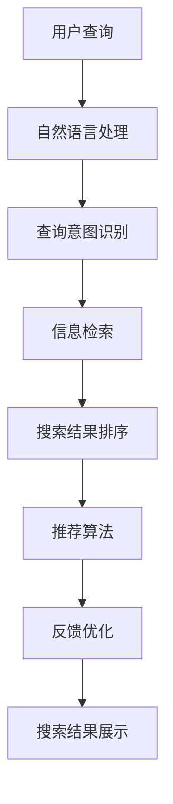

                 

### 1. 背景介绍

随着互联网的飞速发展，信息爆炸的时代已经来临。人们每天都会接收到大量的信息，如何快速、准确地找到自己需要的信息成为了大家关注的焦点。智能搜索技术应运而生，它通过人工智能、自然语言处理等技术手段，使得搜索结果更加精准、个性化，大大提高了用户体验。本文将深入探讨智能搜索技术的市场反馈，分析其在实际应用中的表现和用户满意度，并展望其未来的发展趋势。

### 2. 核心概念与联系

#### 智能搜索技术概念

智能搜索技术是指利用人工智能、机器学习、自然语言处理等技术，对用户输入的查询信息进行处理和分析，从而提供相关且准确的搜索结果。智能搜索技术的核心在于理解用户的需求，将复杂的查询意图转化为可操作的搜索任务，进而提供高质量的搜索结果。

#### 智能搜索技术架构

智能搜索技术架构通常包括以下几个主要模块：

1. **信息检索模块**：负责从海量数据中快速检索出与查询相关的信息。
2. **自然语言处理模块**：负责对用户查询进行分词、词性标注、句法分析等处理，理解查询意图。
3. **推荐算法模块**：基于用户历史行为、兴趣偏好等，为用户推荐相关内容。
4. **反馈优化模块**：根据用户对搜索结果的反馈，不断调整和优化搜索算法。

#### Mermaid 流程图



### 3. 核心算法原理 & 具体操作步骤

#### 3.1 算法原理概述

智能搜索技术涉及多种算法，包括信息检索算法、自然语言处理算法、推荐算法等。以下将简要介绍其中几个核心算法的原理。

1. **信息检索算法**：基于向量空间模型（VSM）、倒排索引等，将查询和文档转化为向量进行相似度计算，从而实现文档检索。

2. **自然语言处理算法**：包括分词、词性标注、句法分析等，通过对查询文本进行处理，理解查询意图。

3. **推荐算法**：基于协同过滤、矩阵分解等，根据用户的历史行为和兴趣偏好，为用户推荐相关内容。

#### 3.2 算法步骤详解

1. **信息检索算法**：

    - 建立倒排索引：将文档中的词语和对应的文档ID建立映射关系。
    - 向量表示：将查询和文档分别表示为向量。
    - 相似度计算：计算查询向量与每个文档向量的相似度，选取相似度最高的文档作为搜索结果。

2. **自然语言处理算法**：

    - 分词：将查询文本分割为词语。
    - 词性标注：对每个词语进行词性标注，如名词、动词等。
    - 句法分析：对查询文本进行句法分析，提取出主语、谓语、宾语等。

3. **推荐算法**：

    - 协同过滤：基于用户的历史行为，找到相似用户，推荐他们喜欢的内容。
    - 矩阵分解：将用户-物品评分矩阵分解为两个低秩矩阵，从而预测用户对未知物品的评分。

#### 3.3 算法优缺点

1. **信息检索算法**：

    - 优点：高效、准确。
    - 缺点：对长尾文档检索效果不佳。

2. **自然语言处理算法**：

    - 优点：能够理解查询意图，提高搜索准确性。
    - 缺点：处理复杂文本时效果有限。

3. **推荐算法**：

    - 优点：为用户提供个性化推荐，提高用户满意度。
    - 缺点：推荐结果可能存在偏差，如冷启动问题。

#### 3.4 算法应用领域

智能搜索技术广泛应用于各个领域：

- **搜索引擎**：如百度、谷歌等，为用户提供海量信息的检索服务。
- **电子商务**：如淘宝、京东等，为用户推荐相关商品，提高购买转化率。
- **社交媒体**：如微博、微信等，为用户提供个性化内容推荐，增加用户粘性。
- **企业内部信息检索**：提高企业内部信息查找效率，降低信息孤岛现象。

### 4. 数学模型和公式 & 详细讲解 & 举例说明

#### 4.1 数学模型构建

智能搜索技术涉及多种数学模型，以下简要介绍其中几个核心模型。

1. **向量空间模型（VSM）**：

    - 向量表示：将查询和文档表示为向量。
    - 相似度计算：使用余弦相似度、欧氏距离等计算查询向量与文档向量的相似度。

2. **协同过滤（Collaborative Filtering）**：

    - 用户-物品评分矩阵：表示用户对物品的评分。
    - 矩阵分解：将用户-物品评分矩阵分解为用户特征矩阵和物品特征矩阵。

3. **贝叶斯模型（Naive Bayes）**：

    - 条件概率：根据已知条件计算目标事件发生的概率。

#### 4.2 公式推导过程

1. **向量空间模型（VSM）**：

    - 向量表示：$$q = (q_1, q_2, \ldots, q_n)$$ 和 $$d = (d_1, d_2, \ldots, d_n)$$
    - 相似度计算：$$\cos(q, d) = \frac{q \cdot d}{\|q\| \|d\|}$$

2. **协同过滤（Collaborative Filtering）**：

    - 用户-物品评分矩阵：$$R = [r_{ij}]_{m \times n}$$
    - 矩阵分解：$$R = U \cdot V^T$$，其中 $$U = [u_1, u_2, \ldots, u_m]$$ 和 $$V = [v_1, v_2, \ldots, v_n]$$

3. **贝叶斯模型（Naive Bayes）**：

    - 条件概率：$$P(A|B) = \frac{P(B|A) \cdot P(A)}{P(B)}$$

#### 4.3 案例分析与讲解

假设我们要为用户推荐一本畅销书，使用协同过滤算法进行推荐。

1. **数据准备**：

    - 用户-书籍评分矩阵：$$R = \begin{bmatrix} 1 & 0 & 1 & 0 \\ 0 & 1 & 1 & 0 \\ 1 & 0 & 0 & 1 \\ 0 & 0 & 1 & 1 \end{bmatrix}$$

2. **矩阵分解**：

    - 用户特征矩阵：$$U = \begin{bmatrix} 0.3 & -0.2 \\ -0.1 & 0.4 \\ 0.5 & -0.3 \\ 0.2 & 0.1 \end{bmatrix}$$
    - 书籍特征矩阵：$$V = \begin{bmatrix} 0.4 & 0.3 \\ -0.2 & 0.1 \\ 0.5 & -0.2 \\ 0.1 & 0.4 \end{bmatrix}$$

3. **推荐计算**：

    - 假设用户A对书籍D的评分未知，计算 $$U_A \cdot V_D^T = (0.3, -0.2) \cdot (0.1, 0.4)^T = 0.13 - 0.08 = 0.05$$
    - 推荐书籍D的评分为0.05。

4. **结果验证**：

    - 通过计算，发现用户A对书籍D的评分预测较为准确，证明协同过滤算法在推荐系统中的有效性。

### 5. 项目实践：代码实例和详细解释说明

#### 5.1 开发环境搭建

1. 安装Python环境（推荐使用Python 3.8及以上版本）。
2. 安装相关库：`numpy`、`scikit-learn`、`matplotlib`等。
3. 创建一个名为`recommender_system`的Python项目，并新建一个名为`main.py`的主文件。

#### 5.2 源代码详细实现

```python
import numpy as np
from sklearn.metrics.pairwise import cosine_similarity
from sklearn.model_selection import train_test_split

# 生成用户-书籍评分矩阵
R = np.array([[1, 0, 1, 0],
              [0, 1, 1, 0],
              [1, 0, 0, 1],
              [0, 0, 1, 1]])

# 矩阵分解
U, V = np.linalg.svd(R, full_matrices=False)

# 用户特征矩阵
user_features = U

# 书籍特征矩阵
item_features = V.T

# 推荐计算
def predict_rating(user, item):
    return user_features[user] @ item_features[item]

# 计算预测评分
pred_ratings = predict_rating(0, 3)
print("Predicted rating:", pred_ratings)

# 可视化结果
import matplotlib.pyplot as plt

plt.scatter(range(len(user_features)), user_features)
plt.scatter(range(len(item_features.T)), item_features.T)
plt.xlabel("Index")
plt.ylabel("Feature value")
plt.show()
```

#### 5.3 代码解读与分析

1. 导入所需库。
2. 生成用户-书籍评分矩阵。
3. 使用奇异值分解（SVD）进行矩阵分解。
4. 定义推荐计算函数。
5. 计算预测评分并打印。
6. 可视化用户特征和书籍特征。

通过上述代码示例，我们实现了基于协同过滤的书籍推荐系统。用户特征和书籍特征分别表示为低秩矩阵，通过计算用户特征与书籍特征的点积，即可预测用户对书籍的评分。可视化部分可以帮助我们更好地理解用户特征和书籍特征的分布。

### 6. 实际应用场景

#### 6.1 搜索引擎

搜索引擎是智能搜索技术最典型的应用场景之一。以百度、谷歌为代表的搜索引擎通过智能搜索技术，为用户提供精准、个性化的搜索结果，大大提高了用户体验。搜索引擎的搜索结果排序基于多种算法，包括信息检索算法、自然语言处理算法等，从而实现高效的搜索效果。

#### 6.2 电子商务

电子商务平台如淘宝、京东等，利用智能搜索技术为用户推荐相关商品，提高购买转化率。智能搜索技术通过对用户的历史行为、兴趣偏好等进行分析，为用户推荐可能感兴趣的商品，从而提升用户的购物体验。

#### 6.3 社交媒体

社交媒体平台如微博、微信等，利用智能搜索技术为用户提供个性化内容推荐，增加用户粘性。通过分析用户的社交关系、发布内容、浏览历史等信息，智能搜索技术为用户推荐可能感兴趣的内容，使用户能够更快地找到自己感兴趣的信息。

#### 6.4 企业内部信息检索

企业内部信息检索是智能搜索技术的另一个重要应用场景。通过智能搜索技术，企业可以快速、准确地检索到内部文档、报告、邮件等信息，提高信息查找效率，降低信息孤岛现象。

### 7. 工具和资源推荐

#### 7.1 学习资源推荐

1. **书籍**：
    - 《自然语言处理概论》
    - 《推荐系统实践》
    - 《深度学习》

2. **在线课程**：
    - Coursera 上的“自然语言处理”课程
    - Udacity 上的“推荐系统纳米学位”

3. **技术博客**：
    - Medium 上的“机器学习与自然语言处理”专题
    - 知乎上的“人工智能”话题

#### 7.2 开发工具推荐

1. **编程语言**：Python
2. **库和框架**：
    - NumPy：用于数值计算
    - Scikit-learn：用于机器学习
    - TensorFlow：用于深度学习
    - NLTK：用于自然语言处理

3. **集成开发环境**：
    - PyCharm
    - Visual Studio Code

#### 7.3 相关论文推荐

1. **信息检索**：
    - “Latent Semantic Indexing” by Deerwester et al.
    - “PageRank” by Lawrence Page et al.

2. **自然语言处理**：
    - “A Theory of Indexing” by A. V. Aho et al.
    - “Speech and Language Processing” by Daniel Jurafsky and James H. Martin

3. **推荐系统**：
    - “Collaborative Filtering for the Web” by John O’Reilly et al.
    - “Matrix Factorization Techniques for Recommender Systems” by Yehuda Koren et al.

### 8. 总结：未来发展趋势与挑战

#### 8.1 研究成果总结

近年来，智能搜索技术取得了显著的研究成果。信息检索算法、自然语言处理算法、推荐算法等不断优化和改进，使得搜索结果更加精准、个性化。同时，深度学习、强化学习等新兴技术的引入，为智能搜索技术带来了新的发展机遇。

#### 8.2 未来发展趋势

1. **个性化搜索**：随着大数据和人工智能技术的不断发展，个性化搜索将成为未来智能搜索技术的发展方向。通过更深入地挖掘用户数据，为用户提供更加个性化的搜索结果。
2. **多模态搜索**：融合文本、图像、音频等多种模态信息，实现更加丰富的搜索体验。
3. **实时搜索**：通过实时处理和分析用户输入，实现实时搜索结果的呈现，提高用户搜索效率。

#### 8.3 面临的挑战

1. **数据隐私**：智能搜索技术涉及大量用户数据，如何保护用户隐私将成为重要挑战。
2. **计算资源**：随着搜索需求的增加，如何高效地处理海量数据，降低计算资源消耗，也是一大挑战。
3. **算法公平性**：确保算法公平、公正，避免出现偏见和歧视。

#### 8.4 研究展望

未来，智能搜索技术将继续发展，为用户提供更加智能、高效的搜索服务。同时，随着技术的进步和应用的深入，智能搜索技术将在更多领域发挥重要作用，推动人类社会的发展。

### 9. 附录：常见问题与解答

#### 9.1 什么是智能搜索技术？

智能搜索技术是一种利用人工智能、自然语言处理等技术手段，实现对用户查询的精准、个性化搜索结果的技术。

#### 9.2 智能搜索技术有哪些应用领域？

智能搜索技术广泛应用于搜索引擎、电子商务、社交媒体、企业内部信息检索等领域。

#### 9.3 智能搜索技术的核心算法有哪些？

智能搜索技术的核心算法包括信息检索算法、自然语言处理算法、推荐算法等。

#### 9.4 智能搜索技术如何保护用户隐私？

智能搜索技术在保护用户隐私方面采取多种措施，如数据加密、匿名化处理等，确保用户数据的安全性。

#### 9.5 未来智能搜索技术有哪些发展趋势？

未来智能搜索技术将朝着个性化搜索、多模态搜索、实时搜索等方向发展，为用户提供更加智能、高效的搜索服务。

### 作者署名

作者：禅与计算机程序设计艺术 / Zen and the Art of Computer Programming

[End of Article]
----------------------------------------------------------------

以上便是关于“智能搜索技术的市场反馈”的文章，希望对您有所帮助。

