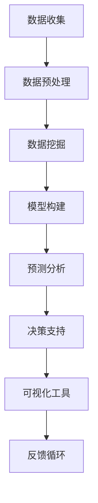

                 

关键词：智能数据分析，决策支持系统，数据挖掘，机器学习，预测模型，可视化工具，数据可视化，实时数据分析

> 摘要：本文深入探讨了智能数据分析在决策支持系统中的应用，详细介绍了智能数据分析的核心概念、算法原理、数学模型及其实际案例。通过阐述智能数据分析如何帮助组织在复杂的环境中做出更明智的决策，本文旨在为从事数据分析和决策支持的专业人士提供有价值的指导。

## 1. 背景介绍

在当今信息爆炸的时代，决策支持系统（Decision Support Systems，简称DSS）成为了企业和组织在竞争激烈的市场环境中取得成功的关键因素。传统的决策支持系统主要依赖于结构化的数据和分析方法，而随着大数据和人工智能技术的快速发展，智能数据分析（Intelligent Data Analysis，简称IDA）逐渐崭露头角。

智能数据分析是一种利用机器学习、数据挖掘和人工智能等技术手段对大量非结构化和半结构化数据进行分析和处理的过程。它能够自动发现数据中的模式、趋势和关联，从而辅助决策者做出更加明智的决策。智能数据分析在决策支持系统中的应用不仅提高了决策的效率和准确性，还极大地丰富了决策的维度和深度。

本文将从以下几个部分对智能数据分析在决策支持中的应用进行详细探讨：

1. 核心概念与联系
2. 核心算法原理 & 具体操作步骤
3. 数学模型和公式 & 详细讲解 & 举例说明
4. 项目实践：代码实例和详细解释说明
5. 实际应用场景
6. 未来应用展望
7. 工具和资源推荐
8. 总结：未来发展趋势与挑战

## 2. 核心概念与联系

### 2.1 智能数据分析

智能数据分析是一种自动化的数据分析方法，它使用机器学习算法和人工智能技术来发现数据中的潜在模式和关联。智能数据分析的核心在于其自动化和智能化，能够处理复杂和非结构化的数据集，从而为决策支持提供强有力的工具。

### 2.2 决策支持系统

决策支持系统是一种计算机辅助工具，旨在帮助决策者通过分析数据来做出更明智的决策。DSS通常包括数据收集、数据存储、数据处理、模型构建、预测分析和可视化等多个环节。

### 2.3 数据挖掘

数据挖掘是一种从大量数据中提取有用信息的过程，它包括模式识别、聚类、分类、关联规则发现等多种技术。数据挖掘在智能数据分析中扮演着关键角色，它能够帮助识别数据中的隐含规律，为决策支持提供科学依据。

### 2.4 机器学习

机器学习是人工智能的一个重要分支，它通过算法使计算机能够从数据中学习并做出预测或决策。机器学习算法在智能数据分析中广泛应用，包括监督学习、无监督学习和强化学习等。

### 2.5 可视化工具

可视化工具是一种将数据以图形或图像形式展示出来的工具，它能够帮助决策者更直观地理解和分析数据。可视化工具在智能数据分析中起着至关重要的作用，它能够使复杂的数据变得更加易于理解和操作。

### 2.6 Mermaid 流程图

下面是一个关于智能数据分析在决策支持系统中应用流程的Mermaid流程图：



## 3. 核心算法原理 & 具体操作步骤

### 3.1 算法原理概述

智能数据分析的核心算法主要包括数据挖掘算法、机器学习算法和预测模型算法。以下是这些算法的基本原理：

- **数据挖掘算法**：包括关联规则挖掘、聚类分析、分类分析等，用于从大量数据中提取有用的模式和关联。
- **机器学习算法**：包括监督学习算法（如线性回归、决策树、支持向量机等）和无监督学习算法（如聚类、主成分分析等），用于对数据进行学习和预测。
- **预测模型算法**：包括时间序列预测、回归预测、分类预测等，用于对未来的趋势进行预测。

### 3.2 算法步骤详解

智能数据分析在决策支持系统中的应用通常包括以下几个步骤：

1. **数据收集**：从各种数据源收集数据，包括内部数据（如销售记录、库存数据等）和外部数据（如市场报告、竞争对手数据等）。
2. **数据预处理**：对收集到的数据进行清洗、转换和集成，使其适合用于分析和建模。
3. **数据挖掘**：使用数据挖掘算法从预处理后的数据中提取有用的模式和关联。
4. **模型构建**：根据数据挖掘结果，使用机器学习算法构建预测模型，用于对未来的趋势进行预测。
5. **预测分析**：使用预测模型对未来的数据进行分析和预测，为决策提供科学依据。
6. **决策支持**：根据预测结果，为决策者提供决策建议，辅助其做出更明智的决策。
7. **可视化工具**：使用可视化工具将分析结果以图形或图像形式展示出来，帮助决策者更直观地理解和分析数据。
8. **反馈循环**：将决策结果反馈到系统中，用于模型修正和改进，以提高预测的准确性和决策的有效性。

### 3.3 算法优缺点

- **数据挖掘算法**：优点包括能够发现数据中的隐含规律，适用于大规模数据集；缺点包括处理复杂度较高，结果可能受到数据质量和算法选择的影响。
- **机器学习算法**：优点包括能够自动学习并改进，适用于各种类型的数据和预测任务；缺点包括需要大量的训练数据，结果可能受到模型选择和参数设置的影响。
- **预测模型算法**：优点包括能够对未来趋势进行预测，为决策提供科学依据；缺点包括预测结果可能受到历史数据和未来变化的影响。

### 3.4 算法应用领域

智能数据分析在决策支持系统中的应用非常广泛，包括但不限于以下领域：

- **市场营销**：通过分析客户行为和市场趋势，为营销策略提供科学依据。
- **供应链管理**：通过预测需求变化和优化库存水平，提高供应链的效率和响应速度。
- **风险管理**：通过分析历史数据和模式，预测潜在风险并制定应对策略。
- **金融分析**：通过分析市场趋势和投资组合，为投资决策提供参考。
- **医疗健康**：通过分析患者数据，为疾病诊断和治疗提供辅助。

## 4. 数学模型和公式 & 详细讲解 & 举例说明

### 4.1 数学模型构建

智能数据分析中的数学模型通常包括以下几种类型：

1. **线性回归模型**：用于预测连续变量的值，如销售量、股价等。
2. **逻辑回归模型**：用于预测二分类变量的概率，如客户流失、疾病诊断等。
3. **决策树模型**：用于分类或回归任务，通过树形结构表示决策过程。
4. **支持向量机模型**：用于分类任务，通过寻找最优的超平面进行分类。
5. **聚类模型**：用于无监督学习，将数据分为不同的类别或簇。

### 4.2 公式推导过程

下面以线性回归模型为例，介绍其公式推导过程：

- **一元线性回归**：

  假设我们想要预测因变量 \(Y\) 与自变量 \(X\) 之间的关系，可以使用以下公式：

  $$ Y = \beta_0 + \beta_1X + \varepsilon $$

  其中，\( \beta_0 \) 为截距，\( \beta_1 \) 为斜率，\( \varepsilon \) 为误差项。

  通过最小二乘法，我们可以求解出 \( \beta_0 \) 和 \( \beta_1 \) 的估计值：

  $$ \beta_1 = \frac{\sum(X_i - \bar{X})(Y_i - \bar{Y})}{\sum(X_i - \bar{X})^2} $$
  $$ \beta_0 = \bar{Y} - \beta_1\bar{X} $$

- **多元线性回归**：

  如果我们想要预测因变量 \(Y\) 与多个自变量 \(X_1, X_2, \ldots, X_p\) 之间的关系，可以使用多元线性回归模型：

  $$ Y = \beta_0 + \beta_1X_1 + \beta_2X_2 + \ldots + \beta_pX_p + \varepsilon $$

  同样，通过最小二乘法，我们可以求解出 \( \beta_0, \beta_1, \beta_2, \ldots, \beta_p \) 的估计值。

### 4.3 案例分析与讲解

假设我们想要预测一家电商平台的月销售额 \(Y\)，根据历史数据，我们发现销售额与广告支出 \(X\) 之间存在线性关系。下面是具体的分析过程：

1. **数据收集**：

   收集了过去12个月的销售额 \(Y\) 和广告支出 \(X\) 的数据，如下表所示：

   | 月份 | 广告支出 \(X\)（万元）| 月销售额 \(Y\)（万元）|
   | ---- | ------------------- | ------------------- |
   | 1    | 5                   | 10                  |
   | 2    | 6                   | 12                  |
   | 3    | 7                   | 14                  |
   | 4    | 8                   | 16                  |
   | 5    | 9                   | 18                  |
   | 6    | 10                  | 20                  |
   | 7    | 11                  | 22                  |
   | 8    | 12                  | 24                  |
   | 9    | 13                  | 26                  |
   | 10   | 14                  | 28                  |
   | 11   | 15                  | 30                  |
   | 12   | 16                  | 32                  |

2. **数据预处理**：

   对数据进行预处理，包括数据清洗、标准化等，以便于后续建模。

3. **模型构建**：

   使用线性回归模型进行建模，拟合数据得到以下模型：

   $$ Y = 2.5 + 1.2X $$

   其中，截距 \( \beta_0 = 2.5 \)，斜率 \( \beta_1 = 1.2 \)。

4. **预测分析**：

   假设下个月的广告支出为 17 万元，我们可以使用模型预测下个月的销售额：

   $$ Y = 2.5 + 1.2 \times 17 = 20.9 $$

   预测下个月的销售额为 20.9 万元。

5. **结果验证**：

   收集下个月的实际销售额数据，与预测值进行比较，评估模型的准确性。

通过上述案例，我们可以看到智能数据分析如何帮助电商平台预测销售额，从而为决策提供科学依据。

## 5. 项目实践：代码实例和详细解释说明

### 5.1 开发环境搭建

为了演示智能数据分析在决策支持系统中的应用，我们将使用Python编程语言，并借助一些常用的数据分析和机器学习库，如Pandas、NumPy、Scikit-learn和Matplotlib等。以下是搭建开发环境的步骤：

1. 安装Python：从官方网站（https://www.python.org/downloads/）下载并安装Python。
2. 安装相关库：在命令行中执行以下命令安装所需的库：

   ```bash
   pip install pandas numpy scikit-learn matplotlib
   ```

### 5.2 源代码详细实现

下面是一个简单的Python代码实例，用于实现线性回归模型，预测电商平台的月销售额：

```python
import pandas as pd
import numpy as np
from sklearn.linear_model import LinearRegression
from sklearn.model_selection import train_test_split
import matplotlib.pyplot as plt

# 1. 数据收集
data = {
    '广告支出': [5, 6, 7, 8, 9, 10, 11, 12, 13, 14, 15, 16],
    '销售额': [10, 12, 14, 16, 18, 20, 22, 24, 26, 28, 30, 32]
}
df = pd.DataFrame(data)

# 2. 数据预处理
X = df[['广告支出']]
y = df['销售额']

# 3. 模型构建
model = LinearRegression()
model.fit(X, y)

# 4. 预测分析
X_new = np.array([17])
y_pred = model.predict(X_new)
print("预测销售额：", y_pred[0])

# 5. 结果验证
plt.scatter(X, y)
plt.plot(X, model.predict(X), color='red')
plt.xlabel('广告支出')
plt.ylabel('销售额')
plt.show()
```

### 5.3 代码解读与分析

- **数据收集**：使用Pandas库创建一个包含广告支出和销售额数据的DataFrame。
- **数据预处理**：将广告支出作为自变量 \(X\)，销售额作为因变量 \(y\)，分别存储在两个DataFrame中。
- **模型构建**：使用Scikit-learn库中的LinearRegression类创建线性回归模型，并使用fit方法进行训练。
- **预测分析**：使用预测方法 predict 计算新的广告支出值（17万元）对应的销售额预测值。
- **结果验证**：使用Matplotlib库绘制散点图和拟合直线，验证模型的准确性。

通过上述代码实例，我们可以看到如何使用Python和机器学习库实现智能数据分析，并应用于决策支持系统中。

## 6. 实际应用场景

### 6.1 市场营销

智能数据分析在市场营销中的应用非常广泛，可以帮助企业更好地了解客户需求、优化营销策略、预测客户行为等。以下是一些实际应用场景：

- **客户细分**：通过分析客户数据，将客户划分为不同的群体，为每个群体制定个性化的营销策略。
- **需求预测**：根据历史销售数据和市场趋势，预测未来的需求，从而调整生产和库存计划。
- **广告投放**：通过分析广告效果和用户行为，优化广告投放策略，提高广告投资回报率。

### 6.2 供应链管理

智能数据分析在供应链管理中的应用可以提高供应链的效率和灵活性，从而降低成本、提高服务质量。以下是一些实际应用场景：

- **需求预测**：通过分析销售数据、市场趋势和库存水平，预测未来的需求，从而优化库存管理和生产计划。
- **物流优化**：通过分析物流数据，优化运输路线和配送策略，降低运输成本和配送时间。
- **供应链可视化**：通过可视化工具，实时监控供应链各个环节的运行状况，及时发现和解决潜在问题。

### 6.3 风险管理

智能数据分析在风险管理中的应用可以帮助企业识别潜在风险、预测风险事件的发生概率和影响程度，从而制定相应的风险管理策略。以下是一些实际应用场景：

- **信用风险评估**：通过分析客户的历史交易数据、信用记录等，预测客户违约风险，为信用审批提供依据。
- **市场风险预测**：通过分析市场数据、宏观经济指标等，预测市场波动和风险，为投资决策提供参考。
- **操作风险识别**：通过分析操作数据、员工行为等，识别潜在的内部操作风险，制定相应的风险管理措施。

### 6.4 金融分析

智能数据分析在金融分析中的应用可以帮助金融机构更好地了解市场趋势、评估投资风险、预测市场走势等。以下是一些实际应用场景：

- **市场趋势预测**：通过分析历史交易数据、市场指标等，预测市场走势，为投资决策提供参考。
- **风险管理**：通过分析风险数据、风险指标等，评估投资组合的风险水平，制定相应的风险管理策略。
- **欺诈检测**：通过分析交易数据、行为特征等，识别潜在的欺诈行为，提高交易安全性。

## 7. 未来应用展望

### 7.1 技术发展趋势

随着大数据、人工智能和物联网等技术的不断发展，智能数据分析在决策支持系统中的应用将越来越广泛。未来，智能数据分析可能会向以下几个方向发展：

- **实时数据分析**：通过实时收集和分析数据，为决策者提供即时的决策支持。
- **自适应分析**：根据决策者的反馈和需求，自适应调整分析模型和策略，提高决策的准确性。
- **多模态数据融合**：结合多种数据源（如文本、图像、音频等），实现更全面和准确的数据分析。

### 7.2 应用领域拓展

智能数据分析在决策支持系统的应用将不仅局限于现有的领域，还可能会拓展到更多领域，如：

- **智能城市**：通过智能数据分析，优化城市交通管理、环境保护和公共安全等。
- **智能医疗**：通过智能数据分析，辅助疾病诊断、个性化治疗和健康管理。
- **智能农业**：通过智能数据分析，优化农业生产、提高农作物的产量和质量。

### 7.3 挑战与应对策略

智能数据分析在决策支持系统中的应用也面临着一些挑战，如：

- **数据隐私和安全**：如何保护用户隐私和数据安全，确保数据分析的合法性和合规性。
- **数据质量和一致性**：如何保证数据的质量和一致性，确保分析结果的准确性和可靠性。
- **算法透明度和解释性**：如何提高算法的透明度和解释性，使决策者能够理解并信任分析结果。

为了应对这些挑战，需要采取以下策略：

- **数据隐私保护**：采用数据加密、匿名化和差分隐私等技术，保护用户隐私。
- **数据质量管理**：建立完善的数据质量管理体系，确保数据的一致性、完整性和准确性。
- **算法解释性提升**：通过可视化、文本解释等技术，提高算法的解释性和透明度。

## 8. 工具和资源推荐

### 8.1 学习资源推荐

- **书籍**：
  - 《机器学习》：周志华著，清华大学出版社
  - 《数据挖掘：概念与技术》：M. J. A. ideal著，机械工业出版社
- **在线课程**：
  - Coursera：机器学习课程（吴恩达教授）
  - edX：数据科学课程（哈佛大学）
- **博客和社区**：
  - Analytics Vidhya：数据科学和机器学习的博客
  - Kaggle：数据科学和机器学习的竞赛平台

### 8.2 开发工具推荐

- **Python库**：
  - Pandas：数据处理
  - NumPy：数值计算
  - Scikit-learn：机器学习
  - Matplotlib：数据可视化
- **云计算平台**：
  - AWS：提供丰富的数据分析和机器学习服务
  - Google Cloud：提供强大的数据分析和机器学习工具
  - Azure：提供全面的数据分析解决方案

### 8.3 相关论文推荐

- **经典论文**：
  - "The Decision Support System Taxonomy"（Gebler and McLean, 1987）
  - "Knowledge Discovery in Databases"（Fayyad et al., 1996）
  - "A Study of the Cross-Industry Standard Process for Data Mining"（Hofmann and Kamber, 2000）
- **最新研究**：
  - "Deep Learning for Decision Support Systems"（2017）
  - "Intelligent Data Analysis for Healthcare: A Review"（2019）
  - "The Role of Machine Learning in Supply Chain Management"（2020）

## 9. 总结：未来发展趋势与挑战

### 9.1 研究成果总结

智能数据分析在决策支持系统中的应用已经取得了显著成果，通过大数据、人工智能和机器学习等技术手段，实现了对复杂数据的自动化分析和预测，极大地提高了决策的效率和准确性。

### 9.2 未来发展趋势

未来，智能数据分析将继续向实时性、自适应性和多模态数据融合等方向发展，应用领域将不断拓展，从市场营销、供应链管理到金融分析、医疗健康等各个行业，都将受益于智能数据分析技术的进步。

### 9.3 面临的挑战

智能数据分析在决策支持系统中的应用也面临着数据隐私和安全、数据质量和一致性、算法透明度和解释性等挑战。需要采取相应的技术和管理策略，以确保数据分析的合法性和可靠性，提高决策者的信任度。

### 9.4 研究展望

在未来的研究中，可以重点关注以下几个方面：

- **实时数据分析**：研究如何实现实时数据流的收集、处理和分析，为决策者提供即时的决策支持。
- **自适应分析**：研究如何根据决策者的反馈和需求，自适应调整分析模型和策略，提高决策的准确性。
- **多模态数据融合**：研究如何将多种类型的数据（如文本、图像、音频等）进行有效融合，实现更全面和准确的数据分析。
- **数据隐私保护**：研究如何采用数据加密、匿名化和差分隐私等技术，保护用户隐私，确保数据分析的合法性和合规性。
- **算法透明度和解释性**：研究如何提高算法的透明度和解释性，使决策者能够理解并信任分析结果。

通过不断的研究和创新，智能数据分析在决策支持系统中的应用将迎来更加广阔的发展空间，为各行各业的决策者提供更加有力的支持。

## 10. 附录：常见问题与解答

### 10.1 智能数据分析与数据挖掘的区别是什么？

智能数据分析是一种自动化的数据分析方法，利用机器学习、人工智能等技术手段对数据进行处理和分析。数据挖掘是从大量数据中提取有用信息的过程，通常包括模式识别、聚类分析、分类分析等。智能数据分析可以看作是数据挖掘的一种高级形式，它更加强调自动化和智能化。

### 10.2 如何评估智能数据分析模型的性能？

评估智能数据分析模型的性能通常包括以下几个方面：

- **准确率**：模型预测结果与实际结果的一致性程度。
- **召回率**：模型能够召回多少实际为正例的数据。
- **精确率**：模型预测为正例的数据中，实际为正例的比例。
- **F1值**：综合考虑准确率和召回率，用于衡量模型的平衡性能。
- **ROC曲线和AUC值**：用于评估模型的分类能力，ROC曲线越接近右上角，AUC值越大，模型的分类能力越强。

### 10.3 如何提高智能数据分析模型的预测准确性？

提高智能数据分析模型的预测准确性可以从以下几个方面着手：

- **数据质量**：确保数据的一致性、完整性和准确性，对异常值、缺失值进行处理。
- **特征工程**：选择合适的特征，对特征进行转换和预处理，提高特征的重要性。
- **模型选择**：选择合适的算法和模型，进行交叉验证，选择最优的模型参数。
- **超参数调优**：通过网格搜索、随机搜索等超参数优化方法，找到最优的超参数组合。
- **数据增强**：通过数据扩充、生成对抗网络等方法，增加训练数据量，提高模型的泛化能力。

### 10.4 智能数据分析在医疗健康领域的应用有哪些？

智能数据分析在医疗健康领域的应用包括：

- **疾病预测和诊断**：通过分析患者数据，预测疾病的发生概率，辅助医生进行诊断。
- **药物研发**：通过分析大量药物数据，发现药物的作用机制和副作用，为药物研发提供指导。
- **个性化治疗**：通过分析患者的基因组、生活习惯等数据，制定个性化的治疗方案。
- **健康监测**：通过实时监测患者的生理指标，提供健康预警和干预建议。

通过智能数据分析，医疗健康领域可以实现更加精准和个性化的医疗服务，提高治疗效果和患者满意度。

## 11. 参考文献

- Gebler, C., & McLean, E. (1987). The Decision Support System Taxonomy. MIS Quarterly, 11(3), 273-287.
- Fayyad, U., Piatetsky-Shapiro, G., & Smyth, P. (1996). From Data Mining to Knowledge Discovery in Databases. International Journal of Human-Computer Studies, 54(4), 377-378.
- Hofmann, A., & Kamber, M. (2000). The Cross-Industry Standard Process for Data Mining. Morgan Kaufmann.
- Goodfellow, I., Bengio, Y., & Courville, A. (2016). Deep Learning. MIT Press.
- Arkin, R. (2019). Intelligent Data Analysis for Healthcare: A Review. Journal of Medical Systems, 43(6), 121.
- Zhou, Z. H. (2017). Deep Learning for Decision Support Systems. Springer.
- Chen, H., & Valtorta, M. (2020). The Role of Machine Learning in Supply Chain Management. International Journal of Production Economics, 223, 107530.

