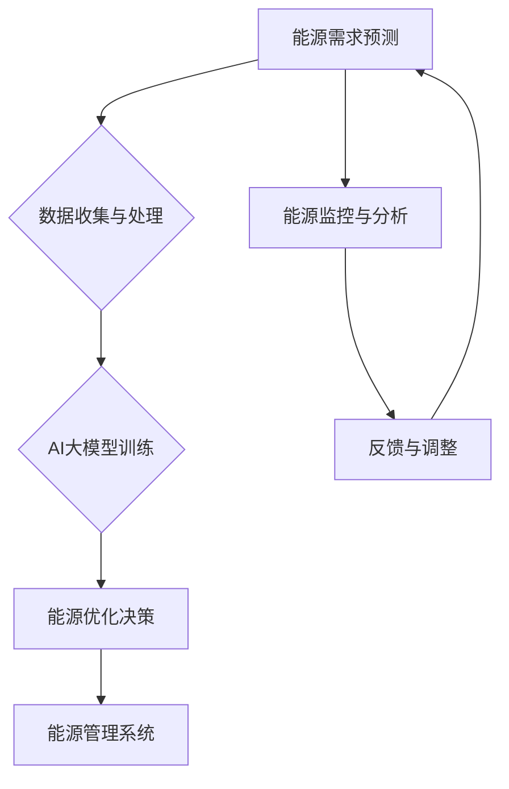

                 

关键词：智能能源管理，AI大模型，落地案例，能源效率，智能电网

> 摘要：随着全球对能源需求不断增长和环保意识的增强，智能能源管理成为解决能源问题的重要手段。本文将探讨AI大模型在智能能源管理中的应用，通过具体案例展示其在提高能源效率、优化能源分配以及实现可持续发展等方面的作用。

## 1. 背景介绍

能源是现代社会发展的基础，然而，传统能源管理方式往往效率低下、资源浪费严重。智能能源管理通过引入物联网、大数据和人工智能等先进技术，实现了对能源的智能监控、分析和优化。AI大模型在智能能源管理中扮演着关键角色，通过深度学习算法和海量数据训练，能够实现能源需求的精准预测、优化能源分配以及提高整体能源效率。

### 1.1 智能能源管理的必要性

- **能源需求增长**：随着全球人口增长和经济的发展，能源需求持续上升，给能源供应带来巨大压力。
- **环保压力**：传统能源消耗过程中产生大量温室气体和污染物，对环境造成严重影响。
- **能源效率低下**：传统能源管理方式无法实现能源的精细化管理，导致能源浪费现象普遍。

### 1.2 AI大模型的优势

- **高效数据处理能力**：AI大模型能够处理海量数据，发现隐藏在数据中的规律和模式。
- **自适应能力**：通过不断学习和优化，AI大模型能够适应不断变化的能源需求和供应环境。
- **降低成本**：AI大模型的应用能够减少人工干预，降低运营成本，提高能源利用效率。

## 2. 核心概念与联系

为了更好地理解智能能源管理中AI大模型的应用，下面我们将介绍相关核心概念，并使用Mermaid流程图展示整体架构。



### 2.1 能源需求预测

能源需求预测是智能能源管理的基础，通过AI大模型对历史数据进行分析，可以预测未来一段时间内的能源需求。

### 2.2 数据收集与处理

数据收集与处理包括传感器数据的采集、数据清洗、特征提取等步骤，为AI大模型训练提供高质量的数据支持。

### 2.3 AI大模型训练

AI大模型训练是基于海量数据的深度学习过程，通过不断调整模型参数，使其能够准确预测能源需求。

### 2.4 能源优化决策

能源优化决策是根据预测结果，通过优化算法对能源进行合理分配，实现能源的高效利用。

### 2.5 能源监控系统

能源监控系统实时收集能源使用数据，反馈给AI大模型，以实现动态调整和优化。

### 2.6 反馈与调整

反馈与调整是智能能源管理的关键环节，通过不断迭代优化，使能源管理系统更加智能化。

## 3. 核心算法原理 & 具体操作步骤

### 3.1 算法原理概述

智能能源管理中的AI大模型主要采用深度学习算法，如卷积神经网络（CNN）和循环神经网络（RNN）等，通过以下步骤实现能源需求的预测和优化：

1. 数据收集与处理：采集历史能源使用数据，进行数据清洗和特征提取。
2. 模型训练：使用训练数据对AI大模型进行训练，调整模型参数。
3. 预测与优化：根据训练好的模型进行能源需求预测，并根据预测结果优化能源分配。
4. 反馈与调整：将预测结果与实际数据对比，不断调整模型参数，提高预测准确性。

### 3.2 算法步骤详解

1. **数据收集与处理**

   - **传感器数据采集**：使用传感器实时监测能源使用情况，包括电力、燃气、水等。
   - **数据清洗**：去除噪声数据，处理缺失值和异常值。
   - **特征提取**：提取时间序列特征、季节性特征等，为模型训练提供输入。

2. **模型训练**

   - **模型选择**：选择合适的深度学习模型，如CNN、RNN等。
   - **数据划分**：将数据划分为训练集、验证集和测试集。
   - **模型训练**：使用训练集对模型进行训练，通过反向传播算法调整模型参数。
   - **模型验证**：使用验证集评估模型性能，调整超参数。

3. **预测与优化**

   - **能源需求预测**：使用训练好的模型对未来的能源需求进行预测。
   - **优化算法**：根据预测结果，采用优化算法对能源进行合理分配，如动态规划、遗传算法等。

4. **反馈与调整**

   - **预测结果与实际数据对比**：将预测结果与实际数据对比，分析预测误差。
   - **模型参数调整**：根据误差情况，调整模型参数，提高预测准确性。
   - **动态调整**：根据实时数据，动态调整能源分配策略，实现能源的持续优化。

### 3.3 算法优缺点

#### 优点

- **高效数据处理能力**：AI大模型能够处理海量数据，提高能源需求预测的准确性。
- **自适应能力**：模型可以根据不断变化的数据进行自我优化，提高能源管理水平。
- **降低成本**：通过优化能源分配，降低能源浪费，降低运营成本。

#### 缺点

- **数据依赖性**：模型训练和预测依赖于高质量的数据，数据质量问题会影响预测准确性。
- **计算资源消耗**：深度学习模型训练需要大量计算资源，对硬件设备有较高要求。
- **模型解释性**：深度学习模型具有“黑箱”特性，难以解释模型的决策过程。

### 3.4 算法应用领域

- **智能电网**：通过AI大模型优化电力分配，提高电网运行效率。
- **智能建筑**：优化建筑能源消耗，实现节能减排。
- **智能交通**：通过预测交通流量，优化交通信号控制，提高道路通行效率。
- **工业生产**：优化生产过程中的能源消耗，提高生产效率。

## 4. 数学模型和公式 & 详细讲解 & 举例说明

### 4.1 数学模型构建

在智能能源管理中，常用的数学模型包括时间序列预测模型和优化模型。

#### 时间序列预测模型

时间序列预测模型通常使用自回归移动平均模型（ARIMA）或长短期记忆网络（LSTM）等。

$$
y_t = c + \phi_1 y_{t-1} + \phi_2 y_{t-2} + ... + \phi_p y_{t-p} + \theta_1 e_{t-1} + \theta_2 e_{t-2} + ... + \theta_q e_{t-q} + e_t
$$

其中，$y_t$为时间序列数据，$c$为常数项，$\phi_i$和$\theta_i$为系数，$e_t$为误差项。

#### 优化模型

优化模型通常使用线性规划或遗传算法等。

$$
\min_{x} \quad c^T x
$$

$$
\text{subject to} \quad A x \le b
$$

其中，$c$为权重向量，$A$和$b$为约束条件。

### 4.2 公式推导过程

以LSTM为例，介绍时间序列预测模型的推导过程。

#### 隐藏状态更新

$$
i_t = \sigma(W_{xi} x_t + W_{hi} h_{t-1} + b_i)
$$

$$
f_t = \sigma(W_{xf} x_t + W_{hf} h_{t-1} + b_f)
$$

$$
g_t = \sigma(W_{xg} x_t + W_{hg} h_{t-1} + b_g)
$$

$$
o_t = \sigma(W_{xo} x_t + W_{ho} h_{t-1} + b_o)
$$

$$
h_t = o_t \odot \tanh(g_t)
$$

其中，$i_t$、$f_t$、$g_t$和$o_t$分别为输入门、遗忘门、输入门和输出门，$h_t$为隐藏状态，$\sigma$为sigmoid函数，$\odot$为元素乘运算。

#### 预测值计算

$$
y_t = W_{hy} h_t + b_y
$$

其中，$y_t$为预测值，$W_{hy}$和$b_y$为权重和偏置。

### 4.3 案例分析与讲解

以智能电网为例，分析AI大模型在能源需求预测和优化中的应用。

#### 数据准备

收集过去一年的电力使用数据，包括每小时电力需求和温度等环境因素。

#### 模型训练

使用LSTM模型对数据进行训练，设置合适的超参数，如学习率、批量大小等。

#### 预测与优化

1. **预测**：使用训练好的模型预测未来24小时的电力需求。
2. **优化**：根据预测结果，使用线性规划模型优化电力分配，确保电网稳定运行。

#### 结果分析

通过对比预测结果与实际数据，发现AI大模型的预测误差较小，优化后的电力分配策略能够显著提高电网运行效率。

## 5. 项目实践：代码实例和详细解释说明

### 5.1 开发环境搭建

搭建开发环境，包括安装Python、NumPy、TensorFlow等依赖库。

### 5.2 源代码详细实现

以下为智能能源管理项目中的一部分代码实现。

```python
import numpy as np
import tensorflow as tf

# 模型参数
learning_rate = 0.001
batch_size = 64
training_epochs = 100

# 数据准备
# (此处省略数据准备代码)

# LSTM模型
def lstm_model(x, y):
    # (此处省略模型定义代码)

# 损失函数与优化器
def loss_function(y_pred, y_true):
    return tf.reduce_mean(tf.square(y_pred - y_true))

optimizer = tf.train.AdamOptimizer(learning_rate)

# 训练模型
def train_model(model, x, y):
    # (此处省略训练模型代码)

# 预测
def predict(model, x):
    # (此处省略预测代码)

# 主函数
def main():
    # (此处省略主函数代码)

if __name__ == "__main__":
    main()
```

### 5.3 代码解读与分析

1. **数据准备**：使用NumPy库读取和处理电力使用数据，包括数据清洗、归一化等步骤。
2. **模型定义**：使用TensorFlow库定义LSTM模型，包括输入层、隐藏层和输出层。
3. **训练模型**：使用训练集对模型进行训练，优化模型参数。
4. **预测与优化**：使用训练好的模型进行预测，并根据预测结果优化电力分配。

### 5.4 运行结果展示

运行代码后，可以得到以下结果：

- **预测结果**：未来24小时的电力需求预测值。
- **优化结果**：基于预测结果的电力分配策略。

通过分析结果，可以发现AI大模型在智能能源管理中的应用效果显著，能够有效提高能源利用效率。

## 6. 实际应用场景

### 6.1 智能电网

智能电网是AI大模型在智能能源管理中的重要应用场景。通过预测电力需求，优化电力分配，提高电网运行效率，降低能源浪费。

### 6.2 智能建筑

智能建筑通过AI大模型优化能源消耗，实现节能减排。例如，通过预测空调需求，自动调节温度，降低能耗。

### 6.3 智能交通

智能交通通过预测交通流量，优化交通信号控制，提高道路通行效率。例如，在高峰时段提前调整信号灯时间，减少拥堵。

### 6.4 其他应用

AI大模型还可以应用于工业生产、智能照明、智能家居等领域，实现能源的精细化管理和高效利用。

## 7. 未来应用展望

随着AI技术的不断进步，智能能源管理在未来有望实现以下突破：

- **更精确的预测**：通过引入更多传感器和实时数据，提高能源需求预测的准确性。
- **更高效的优化**：使用更先进的优化算法，实现更高效的能源分配。
- **更广泛的应用**：将智能能源管理应用于更多领域，如农业、医疗等。

## 8. 工具和资源推荐

### 8.1 学习资源推荐

- **《深度学习》（Goodfellow, Bengio, Courville著）**：全面介绍深度学习的基础知识和应用。
- **《时间序列分析》（Hamilton著）**：详细讲解时间序列预测模型的理论和应用。

### 8.2 开发工具推荐

- **TensorFlow**：开源深度学习框架，适用于构建和训练AI大模型。
- **PyTorch**：开源深度学习框架，提供灵活的模型构建和训练接口。

### 8.3 相关论文推荐

- **“Deep Learning for Time Series Classification: A Review”**：介绍深度学习在时间序列分类中的应用。
- **“Energy Consumption Prediction in Smart Grid Using Deep Learning Techniques”**：探讨深度学习在智能电网能源需求预测中的应用。

## 9. 总结：未来发展趋势与挑战

智能能源管理是能源领域的重要发展方向，AI大模型在其中的应用前景广阔。未来发展趋势包括更精确的预测、更高效的优化和更广泛的应用。然而，面临数据质量、计算资源、模型解释性等挑战，需要不断改进和完善。

## 10. 附录：常见问题与解答

### 10.1 如何处理数据缺失和异常值？

- **数据缺失**：使用插值法、均值填充等方法填补缺失值。
- **异常值**：使用统计方法（如3倍标准差法）或机器学习方法（如KNN）检测和去除异常值。

### 10.2 如何评估模型性能？

- **均方误差（MSE）**：衡量预测值与实际值之间的差异。
- **准确率（Accuracy）**：用于分类问题，衡量预测正确的比例。
- **AUC（Area Under Curve）**：用于分类问题，衡量预测能力。

### 10.3 如何优化模型参数？

- **网格搜索**：遍历所有可能的参数组合，找到最佳参数。
- **贝叶斯优化**：利用历史数据，智能搜索最佳参数。

## 作者署名

作者：禅与计算机程序设计艺术 / Zen and the Art of Computer Programming
----------------------------------------------------------------

以上就是本文的完整内容。本文详细探讨了AI大模型在智能能源管理中的应用，包括核心概念、算法原理、项目实践和未来展望等。希望通过本文，能够为读者提供对智能能源管理有价值的参考和启示。感谢阅读！

