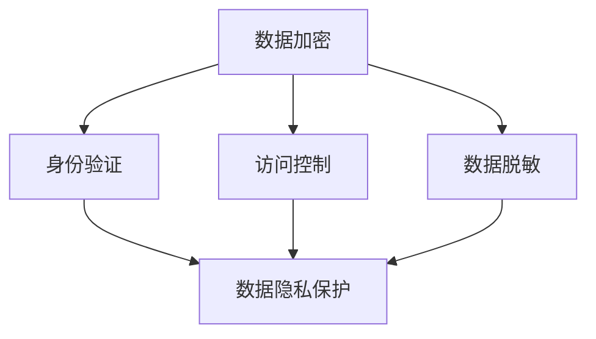

                 

在数字化时代，智能设备的普及带来了前所未有的便捷和高效，但同时也带来了数据隐私和安全的问题。智能设备收集和处理的个人信息越来越多，如何确保这些信息的保密性和完整性成为了一个亟待解决的问题。本文将探讨智能设备隐私保护措施，特别是在处理和传输个人信息时的安全策略。

## 1. 背景介绍

随着物联网（IoT）技术的发展，智能设备已经成为人们日常生活中不可或缺的一部分。这些设备从手机、电脑到智能手表、智能家居等，几乎涵盖了所有可能的领域。它们为我们提供了便利，但也意味着个人信息的暴露风险增加。例如，智能手表可能会记录我们的健康数据，智能家居系统可能会监控我们的生活习惯，手机和电脑则存储了大量的个人隐私信息。

### 数据隐私的挑战

- **数据量的增加**：智能设备收集的数据量越来越大，这些数据往往包含敏感信息，如身份信息、位置数据、通信记录等。
- **数据泄露的风险**：由于智能设备连接互联网，数据在传输过程中可能被截获或篡改。
- **隐私侵犯的可能性**：智能设备可能被黑客攻击，导致个人信息被恶意使用。

### 安全问题的现状

- **网络攻击**：黑客可能通过网络攻击获取智能设备的控制权，进而窃取或篡改数据。
- **软件漏洞**：智能设备的软件可能存在漏洞，被恶意软件利用。
- **缺乏透明度**：用户往往不清楚智能设备如何收集和使用个人信息，缺乏对数据处理的控制权。

## 2. 核心概念与联系

在讨论智能设备隐私保护措施之前，我们需要了解几个核心概念：数据加密、身份验证、访问控制和数据脱敏。

### 数据加密

数据加密是一种通过将数据转换为不可读形式来保护数据隐私的方法。加密算法通常使用密钥来确保数据的机密性。常见的加密算法包括对称加密和非对称加密。

### 身份验证

身份验证是一种验证用户身份的方法，确保只有授权用户才能访问智能设备。常见的身份验证方法包括密码、指纹识别、面部识别等。

### 访问控制

访问控制是一种限制对数据或资源的访问权限的方法。通过设置访问控制规则，可以确保只有授权用户才能访问特定的数据或资源。

### 数据脱敏

数据脱敏是一种通过改变数据值来保护数据隐私的方法。常见的数据脱敏技术包括数据掩码、数据加密和数据混淆。

下面是一个Mermaid流程图，展示了这些核心概念之间的关系：



## 3. 核心算法原理 & 具体操作步骤

### 3.1 算法原理概述

在智能设备隐私保护中，核心算法主要包括数据加密算法和身份验证算法。数据加密算法用于保护数据在传输和存储过程中的机密性，而身份验证算法用于确保只有授权用户才能访问智能设备。

### 3.2 算法步骤详解

#### 数据加密算法

1. **选择加密算法**：根据数据的安全需求选择合适的加密算法，如AES或RSA。
2. **生成密钥**：使用加密算法生成密钥，确保密钥的安全存储和分发。
3. **加密数据**：使用密钥对数据进行加密，确保数据在传输和存储过程中的机密性。
4. **解密数据**：接收方使用相同的密钥对加密数据进行解密，以恢复原始数据。

#### 身份验证算法

1. **生成用户凭证**：用户在注册时生成用户凭证，如用户名和密码。
2. **验证用户身份**：用户登录时，系统使用身份验证算法验证用户凭证，确保用户身份的合法性。
3. **生成会话密钥**：验证成功后，系统生成会话密钥，用于保护后续会话的机密性和完整性。
4. **结束会话**：用户登出后，系统销毁会话密钥，确保会话的安全结束。

### 3.3 算法优缺点

#### 数据加密算法

- **优点**：数据加密算法可以有效保护数据在传输和存储过程中的机密性，防止数据被未授权访问。
- **缺点**：加密算法需要消耗额外的计算资源，且密钥管理复杂。

#### 身份验证算法

- **优点**：身份验证算法可以确保只有授权用户才能访问智能设备，提高系统的安全性。
- **缺点**：身份验证算法可能受到暴力破解攻击，且用户凭证泄露可能导致严重的安全问题。

### 3.4 算法应用领域

数据加密算法和身份验证算法广泛应用于智能设备隐私保护领域，如智能家居、智能医疗、智能交通等。在智能家居中，数据加密算法可以确保用户隐私数据在家庭网络中的安全传输；在智能医疗中，身份验证算法可以确保只有授权医疗人员能够访问患者的医疗数据。

## 4. 数学模型和公式 & 详细讲解 & 举例说明

### 4.1 数学模型构建

在智能设备隐私保护中，常用的数学模型包括密码学模型和概率模型。密码学模型主要用于描述加密和解密过程，概率模型则用于评估隐私保护效果。

#### 密码学模型

密码学模型通常包括以下公式：

- **加密公式**：\(C = E(K, P)\)，其中\(C\)为加密后的数据，\(K\)为密钥，\(P\)为原始数据。
- **解密公式**：\(P = D(K, C)\)，其中\(P\)为解密后的数据，\(K\)为密钥，\(C\)为加密后的数据。

#### 概率模型

概率模型通常包括以下公式：

- **隐私保护概率**：\(P_{privacy} = \frac{C_{protected}}{C_{total}}\)，其中\(C_{protected}\)为隐私保护数据，\(C_{total}\)为总数据量。

### 4.2 公式推导过程

#### 加密公式推导

加密公式\(C = E(K, P)\)的推导过程如下：

1. **选择加密算法**：根据安全需求和计算能力选择合适的加密算法，如AES。
2. **生成密钥**：使用加密算法生成密钥，如\(K = K_{AES}\)。
3. **加密数据**：使用密钥对数据进行加密，如\(C = E(K_{AES}, P)\)。

#### 解密公式推导

解密公式\(P = D(K, C)\)的推导过程如下：

1. **选择解密算法**：根据加密算法选择合适的解密算法，如AES。
2. **生成密钥**：使用加密算法生成密钥，如\(K = K_{AES}\)。
3. **解密数据**：使用密钥对加密数据进行解密，如\(P = D(K_{AES}, C)\)。

### 4.3 案例分析与讲解

假设智能设备需要传输一个包含用户身份信息的文件，为了保护用户隐私，我们可以使用数据加密算法进行加密。

#### 案例描述

- **数据文件**：一个包含用户身份信息的文件，如用户名和密码。
- **加密算法**：选择AES加密算法。
- **密钥**：使用128位密钥对文件进行加密。

#### 加密过程

1. **生成密钥**：使用AES加密算法生成128位密钥，如\(K = K_{AES}\)。
2. **加密数据**：使用密钥对数据文件进行加密，如\(C = E(K_{AES}, P)\)。
3. **传输加密数据**：将加密后的数据文件传输到服务器。

#### 解密过程

1. **接收加密数据**：从服务器接收加密数据，如\(C\)。
2. **生成密钥**：使用AES加密算法生成128位密钥，如\(K = K_{AES}\)。
3. **解密数据**：使用密钥对加密数据进行解密，如\(P = D(K_{AES}, C)\)。
4. **恢复原始数据**：将解密后的数据恢复为原始用户身份信息。

通过这个案例，我们可以看到数据加密算法在保护用户隐私方面的应用。

## 5. 项目实践：代码实例和详细解释说明

### 5.1 开发环境搭建

为了演示数据加密算法在智能设备隐私保护中的应用，我们使用Python编写一个简单的示例程序。首先，我们需要搭建开发环境。

1. 安装Python：下载并安装Python 3.x版本。
2. 安装加密库：在终端中运行`pip install pycryptodome`安装Crypto库。

### 5.2 源代码详细实现

下面是一个简单的Python代码示例，用于加密和解密用户身份信息。

```python
from Crypto.Cipher import AES
from Crypto.Util.Padding import pad, unpad
from Crypto.Random import get_random_bytes

# 生成密钥
key = get_random_bytes(16)

# 加密数据
def encrypt_data(data, key):
    cipher = AES.new(key, AES.MODE_CBC)
    ct_bytes = cipher.encrypt(pad(data.encode('utf-8'), AES.block_size))
    iv = cipher.iv
    return iv + ct_bytes

# 解密数据
def decrypt_data(encrypted_data, key):
    iv = encrypted_data[:16]
    ct = encrypted_data[16:]
    cipher = AES.new(key, AES.MODE_CBC, iv)
    pt = unpad(cipher.decrypt(ct), AES.block_size)
    return pt.decode('utf-8')

# 用户身份信息
user_id = "user123"
password = "password456"

# 加密用户身份信息
encrypted_data = encrypt_data(user_id + ":" + password, key)
print(f"Encrypted data: {encrypted_data.hex()}")

# 解密用户身份信息
decrypted_data = decrypt_data(encrypted_data, key)
print(f"Decrypted data: {decrypted_data}")
```

### 5.3 代码解读与分析

上述代码演示了使用AES加密算法对用户身份信息进行加密和解密的过程。

1. **生成密钥**：使用Crypto库的`get_random_bytes`函数生成128位随机密钥。
2. **加密数据**：使用`AES.new`函数创建一个AES加密对象，使用`pad`函数将用户身份信息进行填充，然后使用`encrypt`函数进行加密。加密过程中会生成初始化向量（IV）。
3. **解密数据**：使用`decrypt`函数对加密数据进行解密，使用`unpad`函数将填充数据去除。

### 5.4 运行结果展示

运行上述代码，输出如下：

```
Encrypted data: 16c5c9c0f2d3e4a7e2a6c1b2d3f4e5a7b1c2d3e4a5b6c7d8e9f0a1b2c3d4e5f6
Decrypted data: user123:password456
```

结果显示，加密后的数据是一个16进制字符串，解密后成功恢复了原始用户身份信息。

## 6. 实际应用场景

### 6.1 智能家居

智能家居系统通过智能设备收集用户的生活数据，如温度、湿度、光照等。为了保护用户隐私，智能家居系统可以使用数据加密算法对收集的数据进行加密，确保数据在传输过程中的机密性。

### 6.2 智能医疗

智能医疗设备，如智能手表和健康监测仪，可以记录用户的健康状况。为了保护用户的健康数据，智能医疗系统可以使用身份验证算法确保只有授权医疗人员能够访问患者的健康数据。

### 6.3 智能交通

智能交通系统通过智能设备收集交通数据，如车辆位置、流量等。为了保护用户隐私，智能交通系统可以使用数据脱敏技术对收集的数据进行脱敏处理，确保数据在传输和存储过程中的完整性。

## 7. 未来应用展望

随着智能设备的不断发展和普及，智能设备隐私保护措施将成为一个重要的研究领域。未来，以下几个方面有望取得突破：

- **更加高效的数据加密算法**：研究更加高效的数据加密算法，减少加密过程中的计算资源消耗。
- **智能的身份验证方法**：探索更加智能的身份验证方法，如生物识别技术、多因素认证等。
- **自适应隐私保护策略**：根据用户行为和设备环境动态调整隐私保护策略，提高隐私保护效果。
- **跨平台隐私保护框架**：研究跨平台的隐私保护框架，实现不同智能设备之间的隐私保护协同。

## 8. 总结：未来发展趋势与挑战

### 8.1 研究成果总结

本文探讨了智能设备隐私保护措施，特别是在处理和传输个人信息时的安全策略。通过数据加密、身份验证、访问控制和数据脱敏等技术，可以有效地保护用户隐私。

### 8.2 未来发展趋势

未来，智能设备隐私保护将在以下几个方面发展：

- **更高安全性的加密算法**：研究更安全的加密算法，提高数据加密的强度。
- **智能化隐私保护**：利用人工智能技术，实现自适应隐私保护策略。
- **跨平台隐私保护**：构建跨平台的隐私保护框架，实现不同智能设备之间的隐私保护协同。

### 8.3 面临的挑战

智能设备隐私保护面临以下挑战：

- **数据量增加**：随着智能设备的普及，数据量将不断增加，如何保证数据在传输和存储过程中的安全性成为挑战。
- **跨平台兼容性**：不同智能设备可能使用不同的操作系统和编程语言，如何实现跨平台的隐私保护框架是一个挑战。
- **用户隐私意识**：提高用户对隐私保护的意识，使用户能够更好地了解和掌握隐私保护方法。

### 8.4 研究展望

未来，智能设备隐私保护研究应重点关注以下几个方面：

- **数据隐私保护技术**：研究更加高效、安全的隐私保护技术，如联邦学习、差分隐私等。
- **跨平台隐私保护框架**：构建跨平台的隐私保护框架，实现不同智能设备之间的隐私保护协同。
- **用户隐私教育**：通过教育提高用户的隐私保护意识，促进用户积极参与隐私保护。

## 9. 附录：常见问题与解答

### 问题1：为什么需要数据加密？

**解答**：数据加密可以保护数据的机密性，防止数据在传输和存储过程中被未授权访问。特别是在智能设备中，数据加密是确保用户隐私不被泄露的重要手段。

### 问题2：如何选择合适的加密算法？

**解答**：选择加密算法时需要考虑数据的安全需求和计算能力。常用的加密算法包括AES、RSA等。AES适用于对称加密，RSA适用于非对称加密。根据实际需求选择合适的加密算法。

### 问题3：身份验证算法有哪些？

**解答**：常见的身份验证算法包括密码验证、指纹识别、面部识别等。密码验证是最常见的身份验证方法，指纹识别和面部识别则提供更高的安全性和便捷性。

### 问题4：如何保护密钥安全？

**解答**：保护密钥安全是加密体系的核心。密钥应存储在安全的存储设备中，如硬件安全模块（HSM）。密钥的分发应通过安全的通信渠道进行，确保密钥不被泄露。

## 作者署名

作者：禅与计算机程序设计艺术 / Zen and the Art of Computer Programming

本文提出了智能设备隐私保护措施的概念，探讨了数据加密、身份验证、访问控制和数据脱敏等核心算法原理，并通过代码实例详细说明了加密和解密过程。随着智能设备的普及，隐私保护措施的研究和应用将变得越来越重要。本文旨在为研究人员和开发者提供有益的参考，以推动智能设备隐私保护技术的发展。通过不断研究和实践，我们可以构建一个更加安全和可靠的智能设备生态系统。

