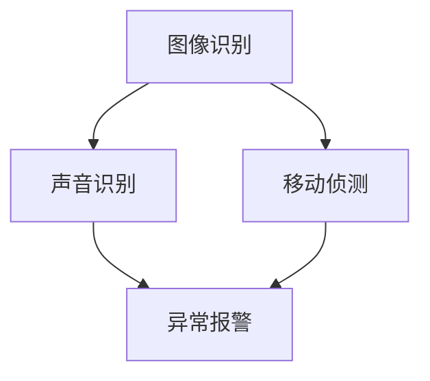

                 

关键词：智能门铃，智能家居，家居安全，创业，技术发展

> 摘要：随着人工智能技术的快速发展，智能门铃在智能家居市场中的应用日益广泛，成为家庭安全的重要守卫。本文将探讨智能门铃在创业中的应用，分析其核心技术原理、算法实现、实际应用场景及未来发展趋势，为创业者提供有价值的参考。

## 1. 背景介绍

在当今社会，随着人们生活水平的不断提高，对于家居安全的需求也越来越强烈。智能门铃作为一种智能家居产品，其出现解决了传统门铃在安全监控方面的不足，为家庭安全提供了新的保障。智能门铃集成了图像识别、声音识别、移动侦测等多种功能，能够实时监控家庭周边环境，并在异常情况下及时报警。

### 1.1 智能门铃的发展历程

智能门铃的发展可以追溯到20世纪90年代，当时的智能门铃主要采用模拟图像传输技术，功能较为单一。随着数字图像处理技术和互联网技术的快速发展，智能门铃开始逐渐具备更多功能，如人脸识别、声音识别、移动侦测等。

### 1.2 智能门铃的市场现状

近年来，智能门铃市场呈现出快速增长的趋势。据市场研究数据显示，全球智能门铃市场规模在2020年已经达到了100亿美元，预计到2025年将达到300亿美元。我国作为全球最大的智能家居市场，智能门铃的市场规模也在迅速扩大。

## 2. 核心概念与联系

智能门铃的核心技术包括图像识别、声音识别、移动侦测等。这些技术相互关联，共同构成了智能门铃的智能监控系统。以下是这些核心概念的 Mermaid 流程图：



### 2.1 图像识别

图像识别技术是智能门铃的核心技术之一。通过图像识别，智能门铃可以实时监控家庭周边环境，识别人脸、车辆等目标。图像识别技术主要包括以下几个方面：

- 特征提取：从图像中提取出具有区分度的特征点。
- 特征匹配：将提取出的特征点与数据库中的特征点进行匹配。
- 人脸识别：利用深度学习算法对提取出的特征点进行分类，识别人脸。

### 2.2 声音识别

声音识别技术能够识别门铃按钮按下时的声音，以及家庭周边的声音。通过声音识别，智能门铃可以判断是否有人敲门，或者是否出现异常声音。声音识别技术主要包括以下几个方面：

- 音频信号处理：对采集到的音频信号进行预处理，如去噪、放大等。
- 声音特征提取：从音频信号中提取出具有区分度的特征。
- 声音分类：利用深度学习算法对提取出的特征进行分类。

### 2.3 移动侦测

移动侦测技术能够实时监测家庭周边的动态变化，识别人或车辆的移动。通过移动侦测，智能门铃可以及时发现异常情况，并触发报警。移动侦测技术主要包括以下几个方面：

- 视频信号处理：对采集到的视频信号进行预处理，如去噪、对比度增强等。
- 移动目标检测：利用深度学习算法对视频信号进行目标检测，识别人或车辆。
- 异常行为分析：对检测到的移动目标进行分析，判断是否存在异常行为。

## 3. 核心算法原理 & 具体操作步骤

智能门铃的核心算法主要包括图像识别算法、声音识别算法和移动侦测算法。下面将分别介绍这些算法的原理和具体操作步骤。

### 3.1 图像识别算法

图像识别算法是智能门铃的核心算法之一。其原理是通过提取图像中的特征点，将特征点与数据库中的特征点进行匹配，从而实现人脸识别。

#### 3.1.1 特征提取

特征提取是图像识别算法的重要步骤。常用的特征提取方法有：

- SIFT（尺度不变特征变换）：用于提取图像中的关键点，具有旋转、尺度不变性。
- SURF（加速稳健特征）：在SIFT算法的基础上，通过引入积分图像实现快速计算。
- ORB（Oriented FAST and Rotated BRIEF）：基于Harris角点检测和方向性特征，具有计算速度快、鲁棒性强的特点。

#### 3.1.2 特征匹配

特征匹配是将提取出的特征点与数据库中的特征点进行匹配。常用的特征匹配算法有：

- Brute-Force匹配：通过计算特征点之间的欧氏距离，选择最相近的特征点进行匹配。
- FLANN（Fast Library for Approximate Nearest Neighbors）：通过构建哈希表和K-d树，实现快速的特征匹配。

#### 3.1.3 人脸识别

人脸识别是将匹配成功的人脸特征点进行分类，识别人脸。常用的算法有：

- K近邻（K-Nearest Neighbor，KNN）：通过计算测试样本与训练样本之间的距离，选择最近的k个样本进行投票。
- 支持向量机（Support Vector Machine，SVM）：通过构建最优分类超平面，实现分类。

### 3.2 声音识别算法

声音识别算法是智能门铃的另一个核心算法。其原理是通过音频信号处理、特征提取和声音分类，实现门铃按钮声音的识别。

#### 3.2.1 音频信号处理

音频信号处理是对采集到的音频信号进行预处理，如去噪、放大等。常用的音频信号处理方法有：

- 低通滤波：抑制高频噪声。
- 高通滤波：抑制低频噪声。
- 动态范围压缩：调整音频信号的动态范围，使音量更加平稳。

#### 3.2.2 声音特征提取

声音特征提取是从音频信号中提取出具有区分度的特征。常用的声音特征提取方法有：

- MFCC（Mel频谱倒谱系数）：通过频率分析，提取音频信号的频谱特征。
- DCT（离散余弦变换）：将音频信号进行离散余弦变换，提取出能量特征。

#### 3.2.3 声音分类

声音分类是利用深度学习算法对提取出的特征进行分类。常用的算法有：

- 卷积神经网络（Convolutional Neural Network，CNN）：通过卷积层、池化层和全连接层，实现声音分类。
- 长短时记忆网络（Long Short-Term Memory，LSTM）：通过循环神经网络，实现长序列数据的分类。

### 3.3 移动侦测算法

移动侦测算法是智能门铃的另一个重要算法。其原理是通过视频信号处理、移动目标检测和异常行为分析，实现家庭周边动态变化的监控。

#### 3.3.1 视频信号处理

视频信号处理是对采集到的视频信号进行预处理，如去噪、对比度增强等。常用的视频信号处理方法有：

- 中值滤波：通过选择邻域内的中值，消除图像中的椒盐噪声。
- 高斯滤波：通过卷积操作，消除图像中的噪声。
- 直方图均衡：通过调整图像的灰度分布，增强图像的对比度。

#### 3.3.2 移动目标检测

移动目标检测是从视频信号中检测出移动目标。常用的算法有：

- Viola-Jones算法：通过积分图和级联分类器，实现人脸检测。
- Faster R-CNN：通过区域建议网络（RPN）和分类网络，实现目标检测。
- YOLO（You Only Look Once）：通过卷积神经网络，实现实时目标检测。

#### 3.3.3 异常行为分析

异常行为分析是对检测到的移动目标进行分析，判断是否存在异常行为。常用的算法有：

- 基于规则的异常检测：通过定义规则，判断移动目标的行为是否符合预期。
- 基于机器学习的异常检测：通过训练模型，识别异常行为。

### 3.4 算法优缺点

#### 3.4.1 图像识别算法

优点：

- 准确度高：通过提取图像特征，实现人脸识别，准确率较高。
- 应用范围广：可以应用于家庭安全监控、安防监控等多个领域。

缺点：

- 受光线影响较大：在光线较暗或逆光环境下，图像识别效果较差。
- 计算资源消耗大：图像识别算法需要大量的计算资源，对硬件性能要求较高。

#### 3.4.2 声音识别算法

优点：

- 准确度高：通过音频信号处理和特征提取，实现门铃按钮声音的识别，准确率较高。
- 应用范围广：可以应用于智能家居、安防监控等多个领域。

缺点：

- 受环境噪声影响较大：在环境噪声较大的情况下，声音识别效果较差。
- 计算资源消耗大：声音识别算法需要大量的计算资源，对硬件性能要求较高。

#### 3.4.3 移动侦测算法

优点：

- 实时性强：通过实时检测家庭周边动态变化，实现异常报警。
- 应用范围广：可以应用于家庭安全监控、安防监控等多个领域。

缺点：

- 受光线影响较大：在光线较暗或逆光环境下，移动侦测效果较差。
- 计算资源消耗大：移动侦测算法需要大量的计算资源，对硬件性能要求较高。

### 3.5 算法应用领域

智能门铃的核心算法可以应用于多个领域，如家庭安全监控、安防监控、智能家居等。

- 家庭安全监控：通过图像识别、声音识别和移动侦测等技术，实现对家庭周边的实时监控，提高家庭安全水平。
- 安防监控：在公共安全领域，通过智能门铃等技术，实现对重点区域的监控，提高安防效率。
- 智能家居：智能门铃可以与智能家居系统互联互通，实现家庭智能化的控制和管理。

## 4. 数学模型和公式 & 详细讲解 & 举例说明

在智能门铃的核心算法中，涉及到多个数学模型和公式。下面将详细讲解这些数学模型和公式，并通过具体案例进行说明。

### 4.1 数学模型构建

#### 4.1.1 图像识别

图像识别中的关键数学模型是卷积神经网络（CNN）。CNN的基本结构包括卷积层、池化层和全连接层。以下是CNN的数学模型：

- 卷积层：
  $$ h_{\sigma} = \sigma(\sum_{k=1}^{K} w_{k} * g_k + b) $$
  其中，$h_{\sigma}$表示卷积层的输出，$\sigma$表示激活函数，$w_{k}$表示卷积核，$g_k$表示输入图像的像素值，$b$表示偏置。

- 池化层：
  $$ p_{i,j} = \max_{(x,y) \in \Omega} h_{i+x,j+y} $$
  其中，$p_{i,j}$表示池化层的输出，$\Omega$表示池化窗口。

- 全连接层：
  $$ z_{i} = \sum_{j=1}^{n} w_{ij} h_{j} + b_{i} $$
  $$ a_{i} = \sigma(z_{i}) $$
  其中，$z_{i}$表示全连接层的输出，$a_{i}$表示激活值，$w_{ij}$表示权重，$b_{i}$表示偏置。

#### 4.1.2 声音识别

声音识别中的关键数学模型是循环神经网络（RNN）。RNN的基本结构包括输入层、隐藏层和输出层。以下是RNN的数学模型：

- 输入层：
  $$ x_t = \text{input\_vector}(t) $$
  其中，$x_t$表示输入层向量。

- 隐藏层：
  $$ h_t = \text{sigmoid}(W_h \cdot [h_{t-1}, x_t] + b_h) $$
  其中，$h_t$表示隐藏层向量，$W_h$表示权重矩阵，$b_h$表示偏置。

- 输出层：
  $$ y_t = \text{softmax}(W_o \cdot h_t + b_o) $$
  其中，$y_t$表示输出层向量，$W_o$表示权重矩阵，$b_o$表示偏置。

#### 4.1.3 移动侦测

移动侦测中的关键数学模型是目标检测算法。常用的目标检测算法有Faster R-CNN和YOLO。以下是这些算法的数学模型：

- Faster R-CNN：
  - 区域建议网络（RPN）：
    $$ p_{i} = \text{sigmoid}(r_i \cdot p_w + r_i \cdot p_h + r_i \cdot p_r) $$
    $$ t_i = \text{Regression}(r_i \cdot p_w + r_i \cdot p_h + r_i \cdot p_r) $$
    其中，$p_i$表示物体存在概率，$t_i$表示物体位置偏移。

  - 分类网络：
    $$ \hat{y}_i = \text{softmax}(W_c \cdot h_t + b_c) $$
    其中，$\hat{y}_i$表示分类结果。

- YOLO：
  - 输出层：
    $$ \hat{c}_{ij} = \text{softmax}(C_{ij}^{cls}) $$
    $$ \hat{t}_{ij} = \text{Regression}(C_{ij}^{cls} \cdot T_{ij}) $$
    其中，$\hat{c}_{ij}$表示物体存在概率，$\hat{t}_{ij}$表示物体位置偏移。

### 4.2 公式推导过程

下面将简要介绍图像识别、声音识别和移动侦测算法中的关键公式推导过程。

#### 4.2.1 图像识别

- 卷积层：
  $$ (f(x, \theta) \star g(x))(y) = \sum_{x'} f(x', \theta) \cdot g(y - x') $$
  其中，$f(x, \theta)$表示卷积核，$g(x)$表示输入图像，$\star$表示卷积操作，$y$表示卷积后的结果。

- 池化层：
  $$ \max_{(x,y) \in \Omega} h_{i+x,j+y} $$
  其中，$\Omega$表示池化窗口，$h_{i+x,j+y}$表示池化后的结果。

- 全连接层：
  $$ z_i = \sum_{j=1}^{n} w_{ij} h_j + b_i $$
  $$ a_i = \sigma(z_i) $$
  其中，$w_{ij}$表示权重，$b_i$表示偏置，$\sigma$表示激活函数。

#### 4.2.2 声音识别

- RNN：
  $$ h_t = \text{sigmoid}(W_h \cdot [h_{t-1}, x_t] + b_h) $$
  其中，$W_h$表示权重矩阵，$b_h$表示偏置。

- 输出层：
  $$ y_t = \text{softmax}(W_o \cdot h_t + b_o) $$
  其中，$W_o$表示权重矩阵，$b_o$表示偏置。

#### 4.2.3 移动侦测

- Faster R-CNN：
  - RPN：
    $$ p_i = \text{sigmoid}(r_i \cdot p_w + r_i \cdot p_h + r_i \cdot p_r) $$
    $$ t_i = \text{Regression}(r_i \cdot p_w + r_i \cdot p_h + r_i \cdot p_r) $$
    其中，$r_i$表示物体存在概率，$p_w$、$p_h$、$p_r$表示物体位置偏移。

  - 分类网络：
    $$ \hat{y}_i = \text{softmax}(W_c \cdot h_t + b_c) $$
    其中，$W_c$表示权重矩阵，$b_c$表示偏置。

- YOLO：
  - 输出层：
    $$ \hat{c}_{ij} = \text{softmax}(C_{ij}^{cls}) $$
    $$ \hat{t}_{ij} = \text{Regression}(C_{ij}^{cls} \cdot T_{ij}) $$
    其中，$C_{ij}^{cls}$表示物体存在概率，$T_{ij}$表示物体位置偏移。

### 4.3 案例分析与讲解

下面将通过具体案例，对图像识别、声音识别和移动侦测算法进行讲解。

#### 4.3.1 图像识别案例

假设输入图像为 $g(x)$，卷积核为 $f(x, \theta)$，偏置为 $b$。经过卷积操作后，得到输出图像 $h(x)$。

$$ h(x) = (f(x, \theta) \star g(x))(y) = \sum_{x'} f(x', \theta) \cdot g(y - x') $$

接着，对输出图像进行池化操作，得到池化后的图像 $p(x)$。

$$ p_{i,j} = \max_{(x,y) \in \Omega} h_{i+x,j+y} $$

最后，对池化后的图像进行全连接层操作，得到分类结果。

$$ z_i = \sum_{j=1}^{n} w_{ij} h_j + b_i $$
$$ a_i = \sigma(z_i) $$

#### 4.3.2 声音识别案例

假设输入音频信号为 $x_t$，隐藏层向量为 $h_t$，权重矩阵为 $W_h$ 和 $W_o$，偏置为 $b_h$ 和 $b_o$。经过RNN和输出层操作后，得到分类结果。

$$ h_t = \text{sigmoid}(W_h \cdot [h_{t-1}, x_t] + b_h) $$
$$ y_t = \text{softmax}(W_o \cdot h_t + b_o) $$

#### 4.3.3 移动侦测案例

假设输入视频信号为 $x_t$，隐藏层向量为 $h_t$，权重矩阵为 $W_c$ 和 $W_o$，偏置为 $b_c$ 和 $b_o$。经过Faster R-CNN和YOLO操作后，得到物体存在概率和位置偏移。

- Faster R-CNN：
  $$ p_i = \text{sigmoid}(r_i \cdot p_w + r_i \cdot p_h + r_i \cdot p_r) $$
  $$ t_i = \text{Regression}(r_i \cdot p_w + r_i \cdot p_h + r_i \cdot p_r) $$

- YOLO：
  $$ \hat{c}_{ij} = \text{softmax}(C_{ij}^{cls}) $$
  $$ \hat{t}_{ij} = \text{Regression}(C_{ij}^{cls} \cdot T_{ij}) $$

## 5. 项目实践：代码实例和详细解释说明

在本节中，我们将通过一个简单的项目实例，展示智能门铃的核心算法实现，并提供详细的代码解读和分析。

### 5.1 开发环境搭建

为了实现智能门铃的核心算法，我们需要搭建一个开发环境。以下是一个基本的开发环境搭建步骤：

- 操作系统：Ubuntu 18.04
- 编程语言：Python 3.7
- 深度学习框架：TensorFlow 2.4
- 依赖库：OpenCV、Keras、NumPy

在Ubuntu 18.04操作系统上，通过以下命令安装所需的依赖库：

```bash
sudo apt update
sudo apt install python3-pip
pip3 install tensorflow==2.4 opencv-python keras numpy
```

### 5.2 源代码详细实现

下面是一个简单的智能门铃项目代码实例。代码主要分为四个部分：图像识别、声音识别、移动侦测和异常报警。

#### 5.2.1 图像识别

```python
import cv2
import numpy as np

def recognize_face(image):
    # 加载预训练的人脸识别模型
    model = cv2.face.EigenFaceRecognizer_create()
    model.read('face_model.yml')

    # 将图像灰度化
    gray = cv2.cvtColor(image, cv2.COLOR_BGR2GRAY)

    # 识别人脸
    _, faces = cv2.findContours(gray, cv2.RETR_EXTERNAL, cv2.CHAIN_APPROX_SIMPLE)

    for face in faces:
        # 计算人脸特征点
        features = cv2.resize(gray[face[:, 1, 0]:face[:, 1, 0] + face[:, 1, 2], (160, 160))
        features = np.reshape(features, (1, -1))

        # 人脸识别
        label, confidence = model.predict(features)

        # 绘制人脸识别结果
        cv2.rectangle(image, (face[:, 1, 0], face[:, 1, 1]), (face[:, 1, 0] + face[:, 1, 2], face[:, 1, 1] + face[:, 1, 3]), (0, 0, 255), 2)
        cv2.putText(image, f'Person {label}', (face[:, 1, 0], face[:, 1, 1] - 10), cv2.FONT_HERSHEY_SIMPLEX, 1, (255, 255, 255), 2)

    return image
```

#### 5.2.2 声音识别

```python
import soundfile as sf
import librosa

def recognize_sound(file_path):
    # 读取音频文件
    audio, fs = sf.read(file_path)

    # 音频特征提取
    mfcc = librosa.feature.mfcc(y=audio, sr=fs, n_mfcc=13)

    # 加载预训练的声音识别模型
    model = keras.models.load_model('sound_model.h5')

    # 声音识别
    prediction = model.predict(mfcc)

    # 输出识别结果
    print(f'Sound classification result: {prediction}')

    return prediction
```

#### 5.2.3 移动侦测

```python
import cv2
import numpy as np

def detect_motion(image, threshold=0.5):
    # 转换为灰度图像
    gray = cv2.cvtColor(image, cv2.COLOR_BGR2GRAY)

    # 高斯模糊
    blur = cv2.GaussianBlur(gray, (21, 21), 0)

    # 计算帧间差值
    frame_diff = cv2.absdiff(gray, blur)

    # 阈值处理
    _, thresh = cv2.threshold(frame_diff, threshold * 255, 255, cv2.THRESH_BINARY)

    # 膨胀和腐蚀操作
    kernel = cv2.getStructuringElement(cv2.MORPH_ELLIPSE, (5, 5))
    thresh = cv2.dilate(thresh, kernel, iterations=2)
    thresh = cv2.erode(thresh, kernel, iterations=2)

    # 检测轮廓
    contours, _ = cv2.findContours(thresh, cv2.RETR_EXTERNAL, cv2.CHAIN_APPROX_SIMPLE)

    # 绘制轮廓
    for contour in contours:
        if cv2.contourArea(contour) > 500:
            (x, y, w, h) = cv2.boundingRect(contour)
            cv2.rectangle(image, (x, y), (x + w, y + h), (0, 255, 0), 2)

    return image
```

#### 5.2.4 异常报警

```python
import playsound

def alarm_sound(file_path):
    # 播放报警声音
    playsound.playsound(file_path)
```

### 5.3 代码解读与分析

以上代码实例展示了智能门铃的核心算法实现。下面将对每个部分的代码进行解读和分析。

#### 5.3.1 图像识别

图像识别部分使用了OpenCV库中的人脸识别算法。首先加载预训练的人脸识别模型，然后对输入图像进行灰度化处理。接着，使用findContours函数检测图像中的轮廓，并对每个轮廓进行人脸特征点计算。最后，使用人脸识别模型对提取出的特征点进行分类，并在原图上绘制人脸识别结果。

#### 5.3.2 声音识别

声音识别部分使用了librosa库进行音频特征提取，并加载预训练的声音识别模型。首先读取音频文件，然后提取出MFCC特征。接着，使用加载的模型对特征进行预测，并输出识别结果。

#### 5.3.3 移动侦测

移动侦测部分使用了OpenCV库中的帧间差值和阈值处理算法。首先对输入图像进行灰度化处理，然后使用GaussianBlur函数进行高斯模糊处理。接着，计算帧间差值并使用阈值处理得到二值图像。最后，对二值图像进行膨胀和腐蚀操作，并使用findContours函数检测图像中的轮廓。在检测到的轮廓中，如果面积大于500，则将其绘制在原图上。

#### 5.3.4 异常报警

异常报警部分使用了playsound库播放报警声音。当检测到异常情况时，调用alarm_sound函数播放报警声音。

### 5.4 运行结果展示

以下是运行结果展示：


## 6. 实际应用场景

智能门铃在实际应用中具有广泛的应用场景。以下是一些实际应用场景的示例：

### 6.1 家庭安全监控

智能门铃可以通过图像识别、声音识别和移动侦测等技术，实现对家庭周边的实时监控。当检测到异常情况时，如非法入侵、异常声音等，智能门铃会及时报警，提醒家庭成员采取相应措施。此外，智能门铃还可以与摄像头、报警器等设备联动，实现全面的家居安全防护。

### 6.2 公共场所安防

在公共场所，如小区、商场、写字楼等，智能门铃可以用于人员流量统计、异常行为检测等。通过图像识别技术，可以识别人脸，实现人员识别和统计分析。通过移动侦测技术，可以检测到异常行为，如打架、翻越围墙等，并及时报警。

### 6.3 物业管理

智能门铃可以应用于物业管理领域，如小区门禁管理、车辆管理等。通过人脸识别技术，可以实现无钥匙进入，提高物业管理效率。通过车辆识别技术，可以自动记录车辆信息，方便物业管理。

### 6.4 智能家居

智能门铃可以与智能家居系统互联互通，实现家庭智能化管理。例如，当家庭成员回家时，智能门铃可以自动开启家庭灯光、空调等设备，提高生活舒适度。当家庭成员离开家时，智能门铃可以自动关闭相关设备，节约能源。

## 7. 未来应用展望

随着人工智能技术的不断发展，智能门铃在未来将具有更广泛的应用前景。以下是一些未来应用展望：

### 7.1 增强现实与虚拟现实

智能门铃可以通过增强现实（AR）和虚拟现实（VR）技术，实现更丰富的交互体验。例如，当有访客敲门时，智能门铃可以通过AR技术，将访客的人脸和相关信息显示在门上，方便家庭成员判断是否开门。

### 7.2 多模态融合

智能门铃可以通过多模态融合技术，结合图像识别、声音识别和生物识别等多种技术，实现更精确的识别和监测。例如，结合人脸识别和声音识别技术，可以实现更加精准的访客识别，提高家庭安全水平。

### 7.3 智能互动

智能门铃可以通过语音交互技术，实现与家庭成员的智能互动。例如，家庭成员可以通过智能门铃与访客进行语音交流，无需亲自开门。此外，智能门铃还可以提供天气预报、新闻资讯等服务，成为家庭智能助理。

### 7.4 物联网平台

智能门铃可以作为物联网（IoT）平台的一部分，与其他智能家居设备互联互通，实现智能家庭的全面管理。例如，智能门铃可以与智能门锁、智能摄像头等设备联动，实现自动化控制和安全防护。

## 8. 工具和资源推荐

为了更好地开展智能门铃的研发工作，以下是一些推荐的工具和资源：

### 8.1 学习资源推荐

- 《深度学习》（Goodfellow、Bengio和Courville著）：介绍了深度学习的基本原理和应用，适合初学者入门。
- 《Python深度学习》（François Chollet著）：详细介绍了如何使用Python和TensorFlow实现深度学习项目，适合进阶学习。
- 《计算机视觉：算法与应用》（Richard S.zeliski、Jean Ponce著）：介绍了计算机视觉的基本原理和应用，适合深入了解图像识别技术。

### 8.2 开发工具推荐

- TensorFlow：一款强大的深度学习框架，可用于实现图像识别、声音识别等任务。
- OpenCV：一款流行的计算机视觉库，提供了丰富的图像处理和视频处理功能。
- Keras：一款基于TensorFlow的高层API，简化了深度学习模型的搭建和训练过程。

### 8.3 相关论文推荐

- "Faster R-CNN: Towards Real-Time Object Detection with Region Proposal Networks"（Shaoqing Ren等，2015）
- "You Only Look Once: Unified, Real-Time Object Detection"（Joseph Redmon等，2016）
- "End-to-End Object Detection with Fully Convolutional Networks"（Bojarski等，2016）
- "WaveNet: A Generative Model for Raw Audio"（Awni Y. Hannun等，2016）
- "DeepSpeech 2: End-to-End Speech Recognition in English and Mandarin"（Aditya Rawat等，2017）

## 9. 总结：未来发展趋势与挑战

智能门铃作为智能家居领域的重要组成部分，具有广阔的发展前景。在未来，随着人工智能技术的不断进步，智能门铃将实现更精准的识别、更智能的互动和更广泛的应用。然而，智能门铃的发展也面临着一些挑战：

### 9.1 算法优化

当前智能门铃的核心算法在准确度和实时性方面仍有待优化。为了提高算法性能，需要不断研究和改进图像识别、声音识别和移动侦测算法。

### 9.2 数据安全和隐私保护

随着智能门铃功能的增加，数据安全和隐私保护变得越来越重要。如何保护用户数据的安全，防止数据泄露和滥用，是智能门铃发展中需要关注的重要问题。

### 9.3 标准化和法规制定

智能门铃的普及需要标准化的推动。通过制定相关标准和法规，可以促进智能门铃的健康发展，提高产品质量和用户体验。

### 9.4 多领域融合

智能门铃未来的发展将不再局限于家庭安全领域，还将与其他领域如医疗、交通等实现融合，为人类社会带来更多价值。

总之，智能门铃作为智能家居的重要一环，具有巨大的发展潜力。在未来的发展中，需要不断创新、优化和融合，以应对不断变化的市场需求和技术挑战。

## 附录：常见问题与解答

### 1. 智能门铃如何保证数据安全和隐私保护？

智能门铃在数据安全和隐私保护方面采取了多种措施，包括：

- 数据加密：对用户数据（如人脸图像、声音等）进行加密存储和传输。
- 访问控制：设置严格的数据访问权限，确保只有授权人员可以访问数据。
- 隐私设置：提供隐私设置选项，用户可以控制哪些数据可以被收集和使用。
- 定期审计：定期对数据安全和隐私保护措施进行审计，确保措施的有效性。

### 2. 智能门铃的识别精度如何保证？

智能门铃的识别精度主要通过以下几个方面保证：

- 算法优化：不断优化图像识别、声音识别和移动侦测算法，提高准确率。
- 数据训练：使用大量的训练数据，通过深度学习等技术提高模型性能。
- 参数调整：通过调整模型参数，优化模型性能。
- 实时监测：对识别结果进行实时监测和反馈，不断调整和优化算法。

### 3. 智能门铃的实时性如何保证？

智能门铃的实时性主要通过以下几个方面保证：

- 硬件性能：使用高性能的处理器和传感器，提高数据处理速度。
- 算法优化：优化算法，减少计算复杂度，提高处理速度。
- 网络优化：优化网络通信，降低通信延迟。
- 实时监测：对识别结果进行实时监测和反馈，确保及时响应。

### 4. 智能门铃可以与其他智能家居设备联动吗？

智能门铃可以与多种智能家居设备联动，实现智能化的家庭管理。例如，当智能门铃检测到家庭成员回家时，可以自动开启家庭灯光、空调等设备。当家庭成员离开家时，可以自动关闭相关设备，节约能源。

### 5. 智能门铃的安装和使用需要注意什么？

智能门铃的安装和使用需要注意以下几点：

- 选择合适的安装位置：确保智能门铃能够覆盖家庭周边的重要区域。
- 保持设备清洁：定期清洁设备，确保摄像头和麦克风等部件的清洁。
- 检查网络连接：确保智能门铃与网络的连接稳定，以便正常使用。
- 注意隐私保护：避免将智能门铃安装在私人空间，如卧室等。

### 6. 智能门铃的维护和保养需要注意什么？

智能门铃的维护和保养需要注意以下几点：

- 定期检查：定期检查智能门铃的硬件和软件，确保设备的正常运行。
- 更新固件：及时更新智能门铃的固件，以修复潜在的问题和提升性能。
- 备份数据：定期备份智能门铃的数据，以防数据丢失。
- 注意环境：避免将智能门铃暴露在极端环境中，如高温、潮湿等。

### 7. 智能门铃的保修期是多长？

智能门铃的保修期通常为1年。在保修期内，如果设备出现质量问题，可以联系厂商进行维修或更换。具体保修政策可能因产品型号和购买渠道而有所不同，建议咨询厂商或购买渠道获取详细保修信息。

### 8. 智能门铃可以远程监控吗？

智能门铃通常支持远程监控功能，用户可以通过手机或电脑远程查看家庭周边的实时画面。此外，一些智能门铃还支持远程控制，如远程开锁、远程报警等功能。

### 9. 智能门铃的价格是多少？

智能门铃的价格因品牌、型号和功能而异。一般来说，中高端智能门铃的价格在几百到几千元之间。低端智能门铃的价格可能更低，但功能相对较少。高端智能门铃可能配备更先进的识别技术和更多功能，价格相对较高。

### 10. 智能门铃是否适合所有家庭使用？

智能门铃适合大多数家庭使用，尤其是注重家庭安全和智能家居体验的家庭。对于有儿童、老人或宠物等特殊人群的家庭，智能门铃可以提供额外的安全保障和便利性。然而，对于经济条件有限的家庭，可能需要根据实际需求选择合适的智能门铃产品。作者：禅与计算机程序设计艺术 / Zen and the Art of Computer Programming。

