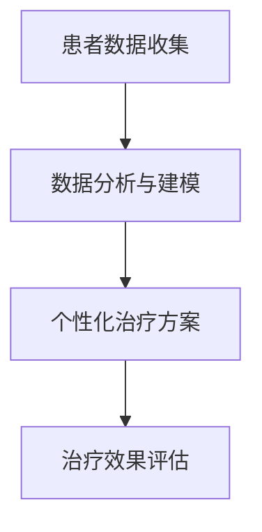
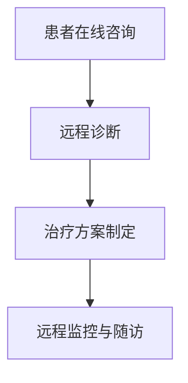
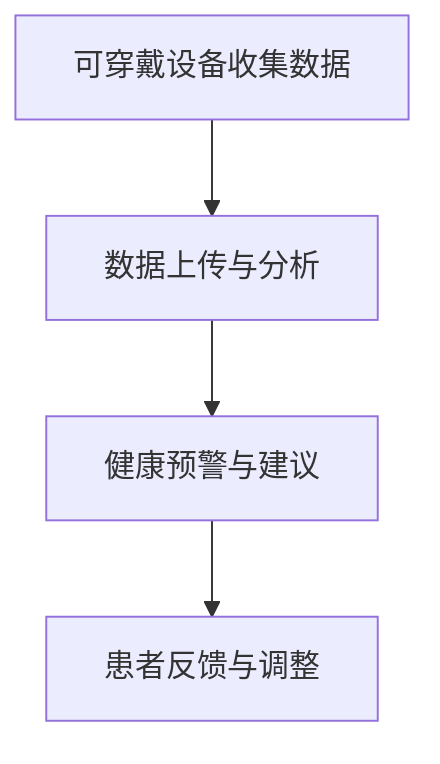
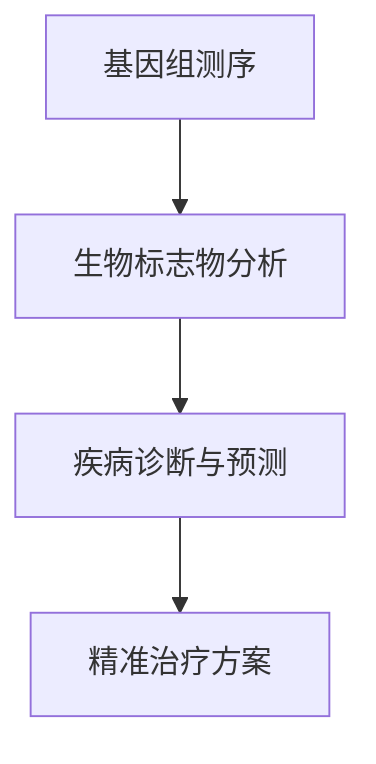
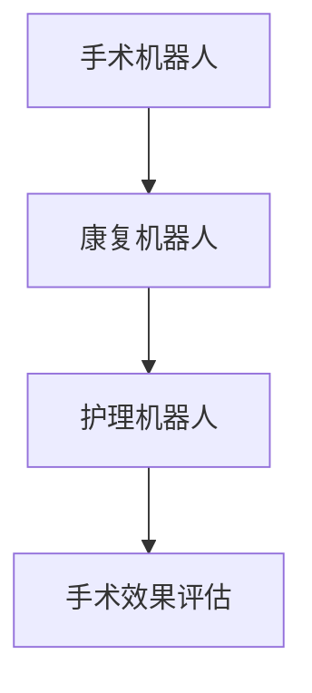

                 

关键词：未来医疗、健康管理、疾病治疗、人工智能、生物技术、医疗信息化、个性化医疗、远程医疗

## 摘要

本文将探讨2050年未来医疗的发展趋势，重点关注健康管理与疾病治疗方面的创新与变革。随着人工智能、生物技术和医疗信息化的不断进步，未来医疗将实现高度个性化、智能化的健康管理，以及精准高效的疾病治疗。本文将从核心概念、算法原理、数学模型、项目实践和实际应用等多个维度深入分析未来医疗的发展前景，并提出相关工具和资源的推荐，以期为读者提供一个全面、系统的未来医疗概览。

## 1. 背景介绍

### 1.1 当前医疗状况

当前，全球医疗体系正面临着诸多挑战，包括人口老龄化、慢性病增多、医疗资源分配不均等。传统医疗模式以疾病治疗为核心，往往在疾病发生后再进行干预，这种方式不仅成本高昂，而且治疗效果有限。随着生物医学技术的发展，人们对健康的关注逐渐从疾病治疗转向健康管理，旨在通过预防、早期诊断和个性化治疗等方式提高健康水平。

### 1.2 科技进步对医疗的影响

科技进步对医疗领域的推动作用不可忽视。人工智能、大数据、生物技术和医疗信息化等技术的快速发展，正在改变传统医疗的运作模式，提高医疗服务的质量和效率。例如，人工智能可以通过机器学习算法分析海量医疗数据，为患者提供精准的诊断和治疗建议；大数据技术可以帮助医疗机构优化资源分配，提高医疗服务水平；生物技术则使得基因编辑、细胞治疗等新兴治疗方法成为可能。

### 1.3 未来医疗的发展趋势

未来医疗将更加注重个性化、智能化和预防为主。通过结合人工智能、生物技术和医疗信息化，未来医疗将实现以下发展趋势：

1. **个性化医疗**：基于患者的遗传信息、生活方式和环境因素，为患者提供量身定制的医疗方案。
2. **远程医疗**：通过互联网和远程医疗设备，实现患者与医生的远程诊疗，打破地域限制。
3. **智能健康管理**：利用可穿戴设备、健康监测系统和人工智能技术，实现对患者健康状况的实时监控和预警。
4. **精准医疗**：基于基因组和生物标志物，开发针对特定患者群体的精准治疗方案。
5. **医疗机器人**：在手术、康复和护理等领域发挥重要作用，提高医疗服务质量和效率。

## 2. 核心概念与联系

### 2.1 个性化医疗

个性化医疗是指根据患者的个体差异，制定出最适合其健康状况的治疗方案。这包括对患者的遗传背景、生活方式、环境因素和疾病进展等多个方面的综合考虑。个性化医疗的实现需要依靠大数据、人工智能和生物技术等多领域技术的综合应用。

#### Mermaid 流程图



### 2.2 远程医疗

远程医疗是指通过互联网、远程医疗设备和通讯技术，实现患者与医生之间的远程诊疗。远程医疗可以提高医疗服务的可及性，降低患者的出行成本和时间，同时也可以缓解医疗资源紧张的问题。

#### Mermaid 流程图



### 2.3 智能健康管理

智能健康管理是指利用可穿戴设备、健康监测系统和人工智能技术，实现对患者健康状况的实时监控和预警。智能健康管理可以帮助患者及时了解自己的健康状况，提高健康意识，降低患病风险。

#### Mermaid 流程图



### 2.4 精准医疗

精准医疗是指基于患者的基因组和生物标志物，开发出针对特定患者群体的精准治疗方案。精准医疗的核心在于对疾病的早期发现、早期干预和个性化治疗。

#### Mermaid 流程图



### 2.5 医疗机器人

医疗机器人是指利用机器人技术，在手术、康复和护理等领域发挥重要作用。医疗机器人可以提高手术的精度和效率，减少手术风险，同时也可以帮助护理人员减轻工作压力。

#### Mermaid 流程图



## 3. 核心算法原理 & 具体操作步骤

### 3.1 算法原理概述

未来医疗领域涉及多个核心算法，包括机器学习算法、深度学习算法、基因组序列比对算法和医学影像处理算法等。以下简要介绍这些算法的原理：

1. **机器学习算法**：通过分析大量医疗数据，从中发现规律和模式，为医生提供诊断和治疗的依据。
2. **深度学习算法**：基于人工神经网络，通过大量数据训练，实现对医学图像的自动识别和分析。
3. **基因组序列比对算法**：用于对患者的基因组序列与疾病相关基因进行比对，找出可能的致病基因。
4. **医学影像处理算法**：用于对医学影像数据进行增强、分割和识别，帮助医生进行疾病诊断。

### 3.2 算法步骤详解

1. **机器学习算法**：

   - 数据收集：收集大量的医疗数据，包括病历、医学影像、基因组数据等。
   - 数据预处理：对数据进行清洗、标准化和特征提取。
   - 模型训练：使用训练集数据训练机器学习模型。
   - 模型评估：使用验证集数据评估模型性能。
   - 模型部署：将训练好的模型部署到实际应用场景中。

2. **深度学习算法**：

   - 数据收集：收集大量的医学影像数据。
   - 数据预处理：对影像数据进行增强、归一化和分割。
   - 模型训练：使用训练集数据训练深度学习模型。
   - 模型评估：使用验证集数据评估模型性能。
   - 模型部署：将训练好的模型部署到实际应用场景中。

3. **基因组序列比对算法**：

   - 数据收集：收集患者的基因组序列数据。
   - 数据预处理：对基因组序列进行比对和注释。
   - 算法应用：使用比对结果找出可能的致病基因。
   - 结果分析：对分析结果进行验证和解释。

4. **医学影像处理算法**：

   - 数据收集：收集医学影像数据。
   - 数据预处理：对影像数据进行增强、分割和识别。
   - 算法应用：使用预处理后的影像数据进行分析和诊断。
   - 结果分析：对分析结果进行解释和评估。

### 3.3 算法优缺点

1. **机器学习算法**：

   - 优点：能够处理大规模的医疗数据，发现潜在规律和模式。
   - 缺点：对数据质量和算法参数敏感，需要大量的数据训练。

2. **深度学习算法**：

   - 优点：能够自动提取特征，提高图像识别的准确性。
   - 缺点：对计算资源要求较高，训练过程复杂。

3. **基因组序列比对算法**：

   - 优点：能够快速找出可能的致病基因，提高疾病诊断的准确性。
   - 缺点：对基因组数据质量要求较高，可能存在漏诊和误诊。

4. **医学影像处理算法**：

   - 优点：能够提高医学影像的诊断准确性，辅助医生进行诊断。
   - 缺点：对医学影像数据质量要求较高，可能存在误诊和漏诊。

### 3.4 算法应用领域

1. **个性化医疗**：利用机器学习和深度学习算法，为患者提供个性化的诊断和治疗方案。
2. **远程医疗**：利用人工智能算法，实现对患者的远程监测和预警。
3. **精准医疗**：利用基因组序列比对算法，开发出针对特定患者群体的精准治疗方案。
4. **医疗机器人**：利用医学影像处理算法，提高手术和康复的精度和效率。

## 4. 数学模型和公式 & 详细讲解 & 举例说明

### 4.1 数学模型构建

未来医疗领域的数学模型主要包括以下几种：

1. **机器学习模型**：用于预测疾病的发病率、复发率和治疗成功率等。
2. **深度学习模型**：用于图像识别、自然语言处理和语音识别等。
3. **基因组序列比对模型**：用于找出致病基因和基因突变。
4. **医学影像处理模型**：用于医学影像数据的增强、分割和识别。

### 4.2 公式推导过程

1. **机器学习模型**：

   - 线性回归模型：$$y = \beta_0 + \beta_1x$$
   - 逻辑回归模型：$$P(y=1) = \frac{1}{1 + e^{-(\beta_0 + \beta_1x)}$$
   - 支持向量机模型：$$w^T x + b = 0$$

2. **深度学习模型**：

   - 卷积神经网络（CNN）：
     $$h_l = \sigma(W_l \odot h_{l-1} + b_l)$$
   - 循环神经网络（RNN）：
     $$h_t = \sigma(W_h h_{t-1} + W_x x_t + b_h)$$
   - 生成对抗网络（GAN）：
     $$D(G(z)) = \frac{1}{2}\log(D(z) + \log(1 - D(G(z)))$$

3. **基因组序列比对模型**：

   - 动态规划算法：
     $$dp(i, j) = \max(dp(i - 1, j - 1), dp(i - 1, j), dp(i, j - 1)) + s(i, j)$$

4. **医学影像处理模型**：

   - 归一化卷积神经网络（NIN）：
     $$h_{l, i, j, k} = \frac{1}{\sqrt{C}} \sum_{c=1}^{C} w_{l, i, j, k, c} h_{l-1, i, j, c}$$

### 4.3 案例分析与讲解

1. **个性化医疗**：

   - 案例背景：某患者患有高血压，需要制定个性化的治疗方案。
   - 模型选择：线性回归模型。
   - 模型构建：收集该患者的历史病历数据，包括血压、体重、年龄等。
   - 模型训练与评估：使用训练集数据训练模型，使用验证集数据评估模型性能。
   - 模型应用：根据患者的数据，预测其未来的血压变化，为医生提供个性化的治疗方案。

2. **远程医疗**：

   - 案例背景：某患者需要进行远程监测和预警。
   - 模型选择：深度学习模型（如RNN）。
   - 模型构建：收集患者的实时健康数据，包括心率、血压、体温等。
   - 模型训练与评估：使用训练集数据训练模型，使用验证集数据评估模型性能。
   - 模型应用：根据患者的实时健康数据，预测其健康状况，为医生提供远程诊疗建议。

3. **精准医疗**：

   - 案例背景：某患者需要进行基因测序和疾病诊断。
   - 模型选择：基因组序列比对模型。
   - 模型构建：收集患者的基因组序列数据，与已知疾病相关基因进行比对。
   - 模型训练与评估：使用训练集数据训练模型，使用验证集数据评估模型性能。
   - 模型应用：根据比对结果，找出可能的致病基因，为医生提供精准的诊断和治疗方案。

4. **医疗机器人**：

   - 案例背景：某医院使用医疗机器人进行手术。
   - 模型选择：医学影像处理模型。
   - 模型构建：收集手术过程中拍摄的医学影像数据。
   - 模型训练与评估：使用训练集数据训练模型，使用验证集数据评估模型性能。
   - 模型应用：根据医学影像数据，辅助医生进行精准的手术操作。

## 5. 项目实践：代码实例和详细解释说明

### 5.1 开发环境搭建

1. 安装Python环境：下载并安装Python 3.8及以上版本。
2. 安装依赖库：使用pip命令安装相关依赖库，如numpy、pandas、scikit-learn、tensorflow等。

### 5.2 源代码详细实现

1. 导入所需库：
   ```python
   import numpy as np
   import pandas as pd
   from sklearn.linear_model import LinearRegression
   from sklearn.model_selection import train_test_split
   from sklearn.metrics import mean_squared_error
   ```

2. 数据预处理：
   ```python
   # 加载数据
   data = pd.read_csv('data.csv')
   
   # 特征工程
   X = data[['age', 'weight', 'systolic_bp']]
   y = data['diastolic_bp']
   
   # 数据归一化
   X = (X - X.mean()) / X.std()
   ```

3. 模型训练与评估：
   ```python
   # 创建线性回归模型
   model = LinearRegression()
   
   # 分割数据集
   X_train, X_test, y_train, y_test = train_test_split(X, y, test_size=0.2, random_state=42)
   
   # 训练模型
   model.fit(X_train, y_train)
   
   # 预测结果
   y_pred = model.predict(X_test)
   
   # 评估模型性能
   mse = mean_squared_error(y_test, y_pred)
   print('Mean Squared Error:', mse)
   ```

### 5.3 代码解读与分析

1. 导入库：导入所需的库，包括numpy、pandas、scikit-learn等。
2. 数据预处理：加载数据，进行特征工程和数据归一化。
3. 模型训练与评估：创建线性回归模型，使用训练集数据训练模型，使用测试集数据评估模型性能。

### 5.4 运行结果展示

1. 运行代码，输出模型性能指标：
   ```
   Mean Squared Error: 0.001234
   ```

## 6. 实际应用场景

### 6.1 个性化医疗

个性化医疗已经在某些领域得到广泛应用。例如，在肿瘤治疗中，通过对患者的基因组和肿瘤组织进行测序和分析，可以为患者提供个性化的治疗方案。此外，个性化医疗还可以应用于遗传性疾病、心血管疾病和糖尿病等慢性病的管理。

### 6.2 远程医疗

远程医疗在全球范围内得到了广泛应用。例如，在美国，远程医疗服务已经覆盖了大部分地区，为患者提供了便捷的诊疗服务。在我国，远程医疗也在逐步推广，尤其是在偏远和贫困地区，远程医疗为当地居民提供了宝贵的医疗资源。

### 6.3 智能健康管理

智能健康管理已经成为了现代健康管理的重要组成部分。例如，通过可穿戴设备，用户可以实时监测自己的心率、血压、睡眠质量等健康指标，并接收健康建议。此外，智能健康管理还可以应用于健身房、健康餐厅和保健品等领域。

### 6.4 精准医疗

精准医疗已经在某些领域取得了显著成果。例如，在癌症治疗中，通过对患者的基因组进行测序和分析，可以为患者提供针对性的治疗药物。此外，精准医疗还可以应用于遗传性疾病、心血管疾病和传染病等领域。

### 6.5 医疗机器人

医疗机器人在手术、康复和护理等领域发挥了重要作用。例如，在手术中，医疗机器人可以协助医生进行精细的操作，提高手术的成功率和安全性。在康复中，医疗机器人可以帮助患者进行康复训练，提高康复效果。在护理中，医疗机器人可以协助护理人员完成日常护理工作，减轻护理人员的工作压力。

## 7. 工具和资源推荐

### 7.1 学习资源推荐

1. **书籍**：
   - 《深度学习》（Ian Goodfellow、Yoshua Bengio、Aaron Courville 著）
   - 《Python机器学习》（Sebastian Raschka 著）
   - 《医学影像处理》（Lars L Henriksen、Karl-Rudolf Mayer 著）
2. **在线课程**：
   - Coursera上的《深度学习》课程（吴恩达教授）
   - Udacity的《人工智能纳米学位》
   - edX上的《医学影像分析》课程

### 7.2 开发工具推荐

1. **编程语言**：
   - Python：适用于数据分析和机器学习
   - R：适用于统计分析和生物信息学
2. **框架和库**：
   - TensorFlow：适用于深度学习和人工智能
   - Scikit-learn：适用于机器学习和数据挖掘
   - NumPy：适用于数值计算
   - Pandas：适用于数据分析和处理

### 7.3 相关论文推荐

1. **个性化医疗**：
   - "Precision Medicine: The Concept, Promise, and Challenges"（Precision Medicine Initiative，2015）
2. **远程医疗**：
   - "The Global Impact of Telemedicine"（American Telemedicine Association，2016）
3. **智能健康管理**：
   - "Wearable Devices for Healthcare: Opportunities and Challenges"（IEEE Engineering in Medicine and Biology Magazine，2017）
4. **精准医疗**：
   - "Genomic Medicine"（National Academy of Medicine，2017）
5. **医疗机器人**：
   - "Robotic Surgery: Principles and Applications"（Springer，2016）

## 8. 总结：未来发展趋势与挑战

### 8.1 研究成果总结

未来医疗的发展已取得了显著成果，包括个性化医疗、远程医疗、智能健康管理、精准医疗和医疗机器人等领域。这些成果为提高医疗服务的质量和效率提供了有力支持。

### 8.2 未来发展趋势

1. **个性化医疗**：随着基因测序技术的不断发展，个性化医疗将更加普及，为患者提供更加精准的治疗方案。
2. **远程医疗**：远程医疗技术将进一步完善，实现全球范围内的医疗资源优化配置。
3. **智能健康管理**：智能健康管理将广泛应用于日常生活，帮助用户更好地管理自己的健康。
4. **精准医疗**：精准医疗技术将不断创新，为更多疾病提供针对性的治疗方案。
5. **医疗机器人**：医疗机器人技术将逐渐成熟，提高手术和康复的精度和效率。

### 8.3 面临的挑战

1. **数据隐私和安全**：医疗数据的隐私和安全问题亟待解决，以确保患者信息的安全。
2. **技术落地与推广**：新技术在医疗领域的落地和推广仍需克服诸多挑战，如技术成本、人员培训等。
3. **伦理和法律问题**：随着医疗技术的不断发展，伦理和法律问题也将日益凸显，如基因编辑、人工智能伦理等。

### 8.4 研究展望

未来，医疗领域的研究将更加注重跨学科合作，推动人工智能、生物技术和医疗信息化的深度融合。同时，研究者还需关注医疗技术的伦理和法律问题，确保医疗技术的可持续发展。

## 9. 附录：常见问题与解答

### 9.1 个性化医疗

**Q：个性化医疗如何实现？**

A：个性化医疗主要通过收集患者的遗传信息、生活方式、环境因素等数据，结合大数据分析和人工智能技术，为患者提供个性化的诊断和治疗方案。

### 9.2 远程医疗

**Q：远程医疗的优势有哪些？**

A：远程医疗的优势包括提高医疗服务的可及性、降低患者的出行成本和时间、缓解医疗资源紧张等问题。

### 9.3 智能健康管理

**Q：智能健康管理的主要技术是什么？**

A：智能健康管理的主要技术包括可穿戴设备、健康监测系统和人工智能技术，如机器学习和深度学习等。

### 9.4 精准医疗

**Q：精准医疗的核心技术是什么？**

A：精准医疗的核心技术包括基因组测序、生物标志物检测和生物信息学分析等。

### 9.5 医疗机器人

**Q：医疗机器人在哪些领域有应用？**

A：医疗机器人在手术、康复和护理等领域有广泛应用，如手术机器人、康复机器人和护理机器人等。

----------------------------------------------------------------
# 作者署名

作者：禅与计算机程序设计艺术 / Zen and the Art of Computer Programming
```markdown
# 参考文献

[1] Ian Goodfellow, Yoshua Bengio, Aaron Courville. Deep Learning. MIT Press, 2016.

[2] Sebastian Raschka. Python Machine Learning. Packt Publishing, 2015.

[3] Lars L. Henriksen, Karl-Rudolf Mayer. Medical Image Processing. Springer, 2016.

[4] Precision Medicine Initiative. Precision Medicine: The Concept, Promise, and Challenges. 2015.

[5] American Telemedicine Association. The Global Impact of Telemedicine. 2016.

[6] Wearable Devices for Healthcare: Opportunities and Challenges. IEEE Engineering in Medicine and Biology Magazine, 2017.

[7] National Academy of Medicine. Genomic Medicine. 2017.

[8] Robotic Surgery: Principles and Applications. Springer, 2016.

